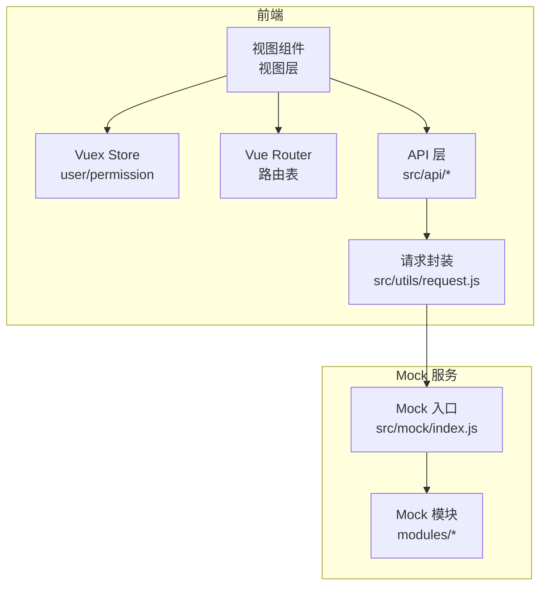
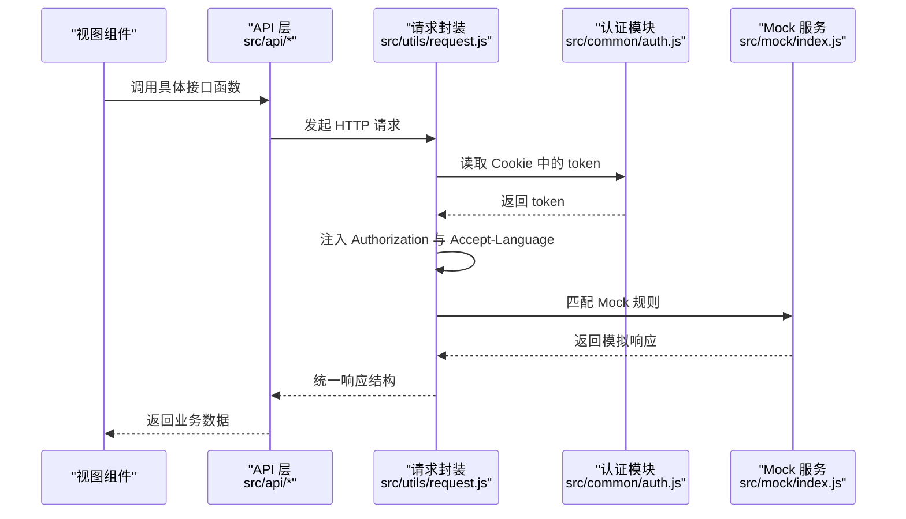
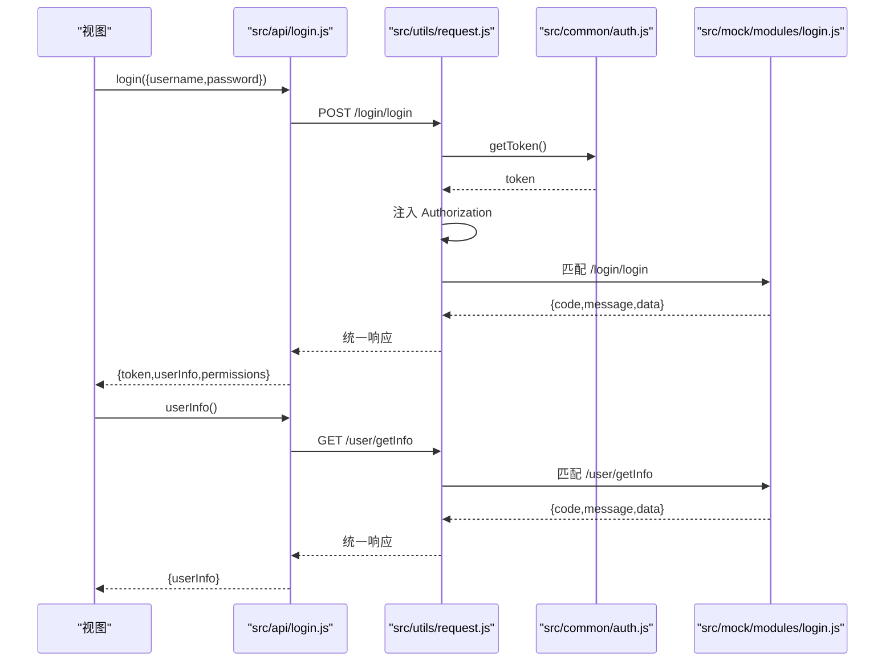
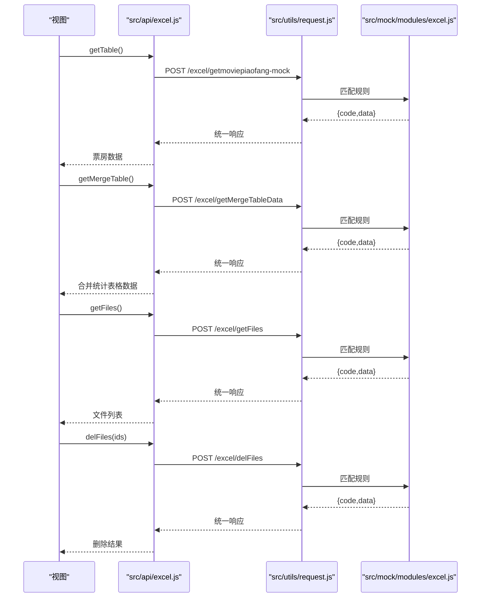
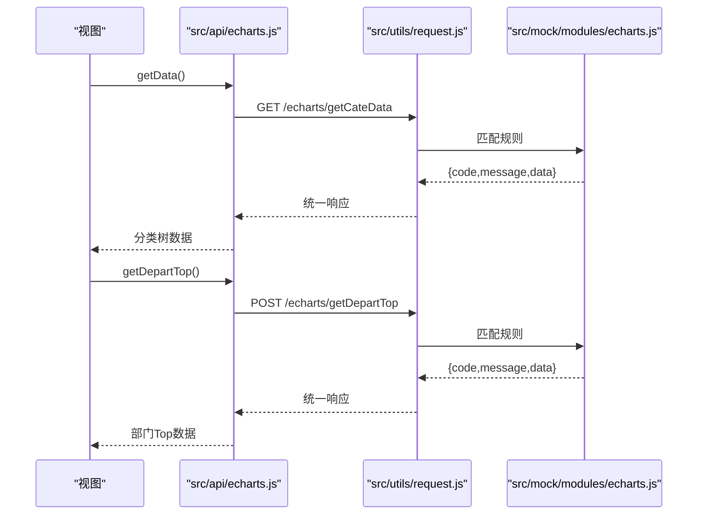
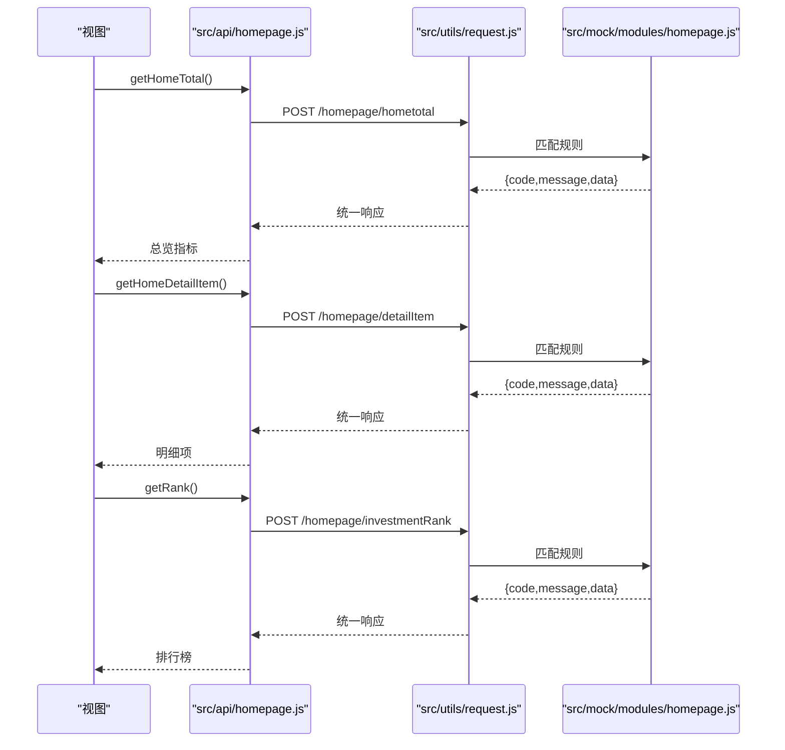
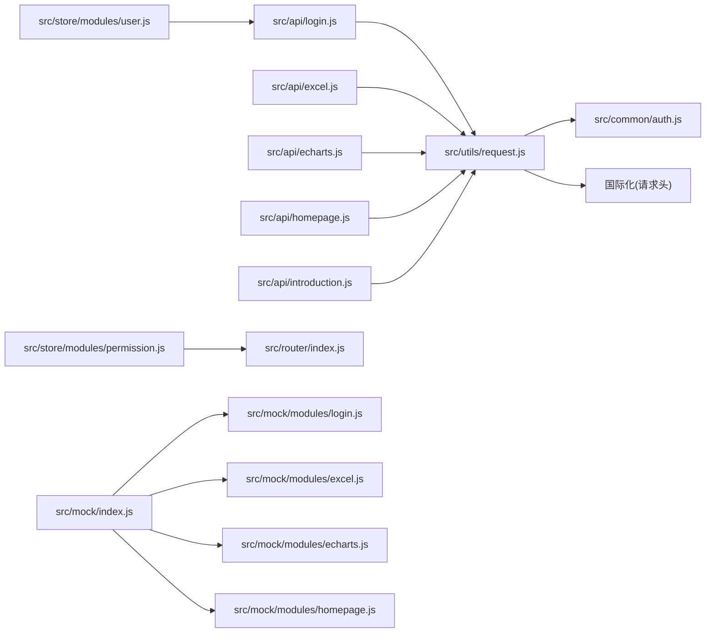
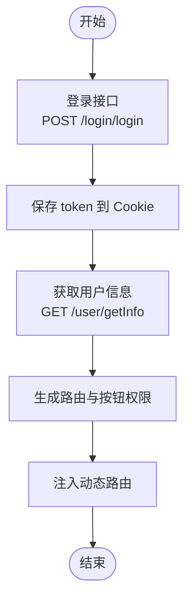

# API接口文档

<cite>
**本文引用的文件**
- [src/api/login.js](file://src/api/login.js)
- [src/api/excel.js](file://src/api/excel.js)
- [src/api/echarts.js](file://src/api/echarts.js)
- [src/api/homepage.js](file://src/api/homepage.js)
- [src/api/introduction.js](file://src/api/introduction.js)
- [src/utils/request.js](file://src/utils/request.js)
- [src/common/auth.js](file://src/common/auth.js)
- [src/store/modules/user.js](file://src/store/modules/user.js)
- [src/store/modules/permission.js](file://src/store/modules/permission.js)
- [src/router/index.js](file://src/router/index.js)
- [src/mock/index.js](file://src/mock/index.js)
- [src/mock/modules/login.js](file://src/mock/modules/login.js)
- [src/mock/modules/excel.js](file://src/mock/modules/excel.js)
- [src/mock/modules/echarts.js](file://src/mock/modules/echarts.js)
- [src/mock/modules/homepage.js](file://src/mock/modules/homepage.js)
</cite>

## 目录
1. [简介](#简介)
2. [项目结构](#项目结构)
3. [核心组件](#核心组件)
4. [架构总览](#架构总览)
5. [详细组件分析](#详细组件分析)
6. [依赖关系分析](#依赖关系分析)
7. [性能考量](#性能考量)
8. [故障排查指南](#故障排查指南)
9. [结论](#结论)
10. [附录](#附录)

## 简介
本文件为 Vue CMS 的 API 接口完整文档，覆盖用户认证、Excel 处理、图表数据、首页聚合等模块的 RESTful 接口规范。文档包含：
- 接口清单：HTTP 方法、URL 模式、请求参数、响应格式
- 认证与权限：认证方式、权限验证流程、安全注意事项
- Mock 数据：本地开发调试支持与数据结构
- 错误处理与状态码：统一响应结构与错误处理策略
- 客户端调用示例与最佳实践
- 版本管理与扩展规范

## 项目结构
前端通过统一请求封装发起 API 调用，Mock 服务用于本地开发与联调，Store 负责状态与权限管理。

**图表来源**
- [src/router/index.js:1-343](file://src/router/index.js#L1-L343)
- [src/store/modules/user.js:1-154](file://src/store/modules/user.js#L1-L154)
- [src/store/modules/permission.js:1-187](file://src/store/modules/permission.js#L1-L187)
- [src/api/login.js:1-24](file://src/api/login.js#L1-L24)
- [src/api/excel.js:1-38](file://src/api/excel.js#L1-L38)
- [src/api/echarts.js:1-20](file://src/api/echarts.js#L1-L20)
- [src/api/homepage.js:1-23](file://src/api/homepage.js#L1-L23)
- [src/api/introduction.js:1-13](file://src/api/introduction.js#L1-L13)
- [src/utils/request.js:1-139](file://src/utils/request.js#L1-L139)
- [src/mock/index.js:1-38](file://src/mock/index.js#L1-L38)

**章节来源**
- [src/router/index.js:1-343](file://src/router/index.js#L1-L343)
- [src/store/modules/user.js:1-154](file://src/store/modules/user.js#L1-L154)
- [src/store/modules/permission.js:1-187](file://src/store/modules/permission.js#L1-L187)
- [src/utils/request.js:1-139](file://src/utils/request.js#L1-L139)
- [src/mock/index.js:1-38](file://src/mock/index.js#L1-L38)

## 核心组件
- 统一请求封装：负责 baseURL、超时、请求头注入（Authorization、Accept-Language）、GET 防缓存、响应拦截与错误处理
- 认证模块：Cookie 存取 token，配合请求拦截器自动附加 Authorization
- Store 模块：用户登录、拉取用户信息、登出、重置 token；权限路由生成与按钮权限提取
- Mock 服务：集中注册各模块 Mock 规则，统一响应格式

**章节来源**
- [src/utils/request.js:1-139](file://src/utils/request.js#L1-L139)
- [src/common/auth.js:1-18](file://src/common/auth.js#L1-L18)
- [src/store/modules/user.js:1-154](file://src/store/modules/user.js#L1-L154)
- [src/store/modules/permission.js:1-187](file://src/store/modules/permission.js#L1-L187)
- [src/mock/index.js:1-38](file://src/mock/index.js#L1-L38)

## 架构总览
下图展示从视图到 API、再到 Mock 的调用链路与鉴权流程。

**图表来源**
- [src/api/login.js:1-24](file://src/api/login.js#L1-L24)
- [src/api/excel.js:1-38](file://src/api/excel.js#L1-L38)
- [src/api/echarts.js:1-20](file://src/api/echarts.js#L1-L20)
- [src/api/homepage.js:1-23](file://src/api/homepage.js#L1-L23)
- [src/api/introduction.js:1-13](file://src/api/introduction.js#L1-L13)
- [src/utils/request.js:1-139](file://src/utils/request.js#L1-L139)
- [src/common/auth.js:1-18](file://src/common/auth.js#L1-L18)
- [src/mock/index.js:1-38](file://src/mock/index.js#L1-L38)

## 详细组件分析

### 用户认证模块
- 登录
  - 方法与路径：POST /login/login
  - 请求体参数：用户名、密码（示例占位）
  - 成功响应：包含 token、用户信息、权限列表
  - 失败响应：错误码与消息
- 登出
  - 方法与路径：POST /login/logout
  - 请求体参数：无
  - 成功响应：空数据或布尔值
- 获取用户信息
  - 方法与路径：GET /user/getInfo
  - 请求头：Authorization（Bearer token）
  - 成功响应：用户信息对象
  - 失败响应：错误码与消息

**图表来源**
- [src/api/login.js:1-24](file://src/api/login.js#L1-L24)
- [src/utils/request.js:1-139](file://src/utils/request.js#L1-L139)
- [src/common/auth.js:1-18](file://src/common/auth.js#L1-L18)
- [src/mock/modules/login.js:1-25](file://src/mock/modules/login.js#L1-L25)

**章节来源**
- [src/api/login.js:1-24](file://src/api/login.js#L1-L24)
- [src/mock/modules/login.js:1-25](file://src/mock/modules/login.js#L1-L25)
- [src/utils/request.js:1-139](file://src/utils/request.js#L1-L139)
- [src/common/auth.js:1-18](file://src/common/auth.js#L1-L18)

### Excel 处理模块
- 获取电影票房 Mock 数据
  - 方法与路径：POST /excel/getmoviepiaofang-mock
  - 请求体参数：无
  - 成功响应：包含票房实时与预测时间序列的复杂数据结构
- 合并统计表格数据
  - 方法与路径：POST /excel/getMergeTableData
  - 请求体参数：无
  - 成功响应：包含若干字段的表格数据集合
- 获取文件列表
  - 方法与路径：POST /excel/getFiles
  - 请求体参数：无
  - 成功响应：文件列表（含类型、缩略图、大小、创建者等）
- 删除文件
  - 方法与路径：POST /excel/delFiles
  - 请求体参数：选中文件 ID 数组
  - 成功响应：布尔值或计数变化后的状态

**图表来源**
- [src/api/excel.js:1-38](file://src/api/excel.js#L1-L38)
- [src/utils/request.js:1-139](file://src/utils/request.js#L1-L139)
- [src/mock/modules/excel.js:1-93](file://src/mock/modules/excel.js#L1-L93)

**章节来源**
- [src/api/excel.js:1-38](file://src/api/excel.js#L1-L38)
- [src/mock/modules/excel.js:1-93](file://src/mock/modules/excel.js#L1-L93)

### 图表数据模块
- 分类数据（树形结构）
  - 方法与路径：GET /echarts/getCateData
  - 请求头：Accept-Language（国际化）
  - 成功响应：分类树形数据
- 部门 Top 数据
  - 方法与路径：POST /echarts/getDepartTop
  - 请求体参数：无
  - 成功响应：部门完成度等指标集合

**图表来源**
- [src/api/echarts.js:1-20](file://src/api/echarts.js#L1-L20)
- [src/utils/request.js:1-139](file://src/utils/request.js#L1-L139)
- [src/mock/modules/echarts.js:1-194](file://src/mock/modules/echarts.js#L1-L194)

**章节来源**
- [src/api/echarts.js:1-20](file://src/api/echarts.js#L1-L20)
- [src/mock/modules/echarts.js:1-194](file://src/mock/modules/echarts.js#L1-L194)

### 首页聚合模块
- 首页总览指标
  - 方法与路径：POST /homepage/hometotal
  - 请求体参数：无
  - 成功响应：指标卡片集合（标题、数值、颜色、趋势数据）
- 首页明细项
  - 方法与路径：POST /homepage/detailItem
  - 请求体参数：无
  - 成功响应：注册用户数、活跃用户数等指标
- 投资排行榜
  - 方法与路径：POST /homepage/investmentRank
  - 请求体参数：无
  - 成功响应：排行榜条目集合

**图表来源**
- [src/api/homepage.js:1-23](file://src/api/homepage.js#L1-L23)
- [src/utils/request.js:1-139](file://src/utils/request.js#L1-L139)
- [src/mock/modules/homepage.js:1-120](file://src/mock/modules/homepage.js#L1-L120)

**章节来源**
- [src/api/homepage.js:1-23](file://src/api/homepage.js#L1-L23)
- [src/mock/modules/homepage.js:1-120](file://src/mock/modules/homepage.js#L1-L120)

### 简介模块（电影图片列表）
- 获取电影图片列表
  - 方法与路径：GET /introduction/getMovieImages
  - 请求头：Accept-Language
  - 成功响应：图片列表数据
  - 说明：使用 Mock 数据，避免跨域问题

**章节来源**
- [src/api/introduction.js:1-13](file://src/api/introduction.js#L1-L13)
- [src/mock/index.js:1-38](file://src/mock/index.js#L1-L38)

## 依赖关系分析
- API 层仅依赖统一请求封装，职责清晰
- 请求封装依赖认证模块与国际化模块
- Store 依赖 API 与路由表，负责权限路由生成与按钮权限提取
- Mock 服务集中注册模块规则，统一响应格式

**图表来源**
- [src/api/login.js:1-24](file://src/api/login.js#L1-L24)
- [src/api/excel.js:1-38](file://src/api/excel.js#L1-L38)
- [src/api/echarts.js:1-20](file://src/api/echarts.js#L1-L20)
- [src/api/homepage.js:1-23](file://src/api/homepage.js#L1-L23)
- [src/api/introduction.js:1-13](file://src/api/introduction.js#L1-L13)
- [src/utils/request.js:1-139](file://src/utils/request.js#L1-L139)
- [src/common/auth.js:1-18](file://src/common/auth.js#L1-L18)
- [src/store/modules/user.js:1-154](file://src/store/modules/user.js#L1-L154)
- [src/store/modules/permission.js:1-187](file://src/store/modules/permission.js#L1-L187)
- [src/router/index.js:1-343](file://src/router/index.js#L1-L343)
- [src/mock/index.js:1-38](file://src/mock/index.js#L1-L38)
- [src/mock/modules/login.js:1-25](file://src/mock/modules/login.js#L1-L25)
- [src/mock/modules/excel.js:1-93](file://src/mock/modules/excel.js#L1-L93)
- [src/mock/modules/echarts.js:1-194](file://src/mock/modules/echarts.js#L1-L194)
- [src/mock/modules/homepage.js:1-120](file://src/mock/modules/homepage.js#L1-L120)

**章节来源**
- [src/utils/request.js:1-139](file://src/utils/request.js#L1-L139)
- [src/store/modules/user.js:1-154](file://src/store/modules/user.js#L1-L154)
- [src/store/modules/permission.js:1-187](file://src/store/modules/permission.js#L1-L187)
- [src/router/index.js:1-343](file://src/router/index.js#L1-L343)
- [src/mock/index.js:1-38](file://src/mock/index.js#L1-L38)

## 性能考量
- 请求超时：统一 5 秒，避免长时间阻塞
- GET 防缓存：对 GET 请求追加时间戳参数，确保数据新鲜度
- Mock 延迟：模拟网络抖动，提升联调体验
- 响应拦截：对 Blob/ArrayBuffer 类型直接透传，便于文件下载场景

**章节来源**
- [src/utils/request.js:1-139](file://src/utils/request.js#L1-L139)
- [src/mock/index.js:1-38](file://src/mock/index.js#L1-L38)

## 故障排查指南
- 统一响应结构
  - 成功：code=200 或特定业务码，message 为描述，data 为业务数据
  - 失败：非 200/特定业务码时弹窗提示，必要时触发重新登录流程
- 常见错误码
  - 50008/50012/50014：令牌非法/其他客户端登录/令牌过期，触发重新登录确认
  - B0001：特殊业务提示，警告级别
- 网络与超时
  - 超时：提示“请求超时”
  - 网络错误：提示“与网络有关的请求失败”
- Mock 未生效
  - 检查模块 state 是否启用、URL 正则匹配、请求方法一致

**章节来源**
- [src/utils/request.js:1-139](file://src/utils/request.js#L1-L139)
- [src/mock/index.js:1-38](file://src/mock/index.js#L1-L38)

## 结论
本项目采用统一请求封装与 Mock 服务，结合 Vuex Store 实现认证与权限控制，形成清晰的前后端协作模式。建议在真实后端接入时，保持统一响应结构与错误处理策略不变，以降低迁移成本。

## 附录

### 统一响应结构
- 成功响应
  - 字段：code（数字或特定业务码）、message（字符串）、data（对象/数组/布尔）
- 失败响应
  - 字段：同上，但 code 非 200/特定业务码

**章节来源**
- [src/mock/index.js:1-38](file://src/mock/index.js#L1-L38)
- [src/utils/request.js:1-139](file://src/utils/request.js#L1-L139)

### 认证与权限
- 认证方式
  - Cookie 存储 token，请求拦截器自动注入 Authorization: Bearer token
  - Accept-Language 由国际化模块注入
- 权限验证
  - 登录成功后保存用户信息与路由权限
  - 前端根据后端返回的路由地址与前端路由表进行匹配，生成可访问路由
  - 提取按钮权限地址，用于界面元素显隐控制

**图表来源**
- [src/api/login.js:1-24](file://src/api/login.js#L1-L24)
- [src/store/modules/user.js:1-154](file://src/store/modules/user.js#L1-L154)
- [src/store/modules/permission.js:1-187](file://src/store/modules/permission.js#L1-L187)
- [src/common/auth.js:1-18](file://src/common/auth.js#L1-L18)

**章节来源**
- [src/common/auth.js:1-18](file://src/common/auth.js#L1-L18)
- [src/store/modules/user.js:1-154](file://src/store/modules/user.js#L1-L154)
- [src/store/modules/permission.js:1-187](file://src/store/modules/permission.js#L1-L187)

### Mock 数据使用与开发调试
- 启动方式
  - 引入 Mock 入口文件后自动扫描 modules 并注册规则
- 开发建议
  - 新增接口时同步在对应模块新增 Mock 规则
  - 使用统一响应格式，便于前后端并行开发
  - 对于需要跨域的第三方接口，优先使用 Mock 代理

**章节来源**
- [src/mock/index.js:1-38](file://src/mock/index.js#L1-L38)
- [src/mock/modules/login.js:1-25](file://src/mock/modules/login.js#L1-L25)
- [src/mock/modules/excel.js:1-93](file://src/mock/modules/excel.js#L1-L93)
- [src/mock/modules/echarts.js:1-194](file://src/mock/modules/echarts.js#L1-L194)
- [src/mock/modules/homepage.js:1-120](file://src/mock/modules/homepage.js#L1-L120)

### 客户端调用示例与最佳实践
- 示例路径
  - 登录：参考 [src/api/login.js:3-9](file://src/api/login.js#L3-L9)
  - 获取用户信息：参考 [src/api/login.js:18-23](file://src/api/login.js#L18-L23)
  - Excel 数据：参考 [src/api/excel.js:5-18](file://src/api/excel.js#L5-L18)
  - 图表数据：参考 [src/api/echarts.js:5-17](file://src/api/echarts.js#L5-L17)
  - 首页数据：参考 [src/api/homepage.js:3-22](file://src/api/homepage.js#L3-L22)
- 最佳实践
  - 统一通过 API 层发起请求，避免直接调用底层封装
  - 对 GET 请求使用防缓存策略，确保数据一致性
  - 对文件下载场景，注意响应类型为 Blob/ArrayBuffer
  - 错误处理遵循统一响应结构，避免重复判断

**章节来源**
- [src/api/login.js:1-24](file://src/api/login.js#L1-L24)
- [src/api/excel.js:1-38](file://src/api/excel.js#L1-L38)
- [src/api/echarts.js:1-20](file://src/api/echarts.js#L1-L20)
- [src/api/homepage.js:1-23](file://src/api/homepage.js#L1-L23)
- [src/utils/request.js:1-139](file://src/utils/request.js#L1-L139)

### 版本管理与扩展规范
- 版本策略
  - 建议在 baseURL 中体现版本号（如 /api/v1），便于灰度与回滚
- 扩展新接口
  - 在 src/api 下新增模块文件，导出函数封装请求
  - 在 src/mock/modules 下新增对应 Mock 规则
  - 在 src/store/modules 中按需扩展状态与动作
  - 在 src/router 中配置路由与权限

**章节来源**
- [src/utils/request.js:1-139](file://src/utils/request.js#L1-L139)
- [src/mock/modules/login.js:1-25](file://src/mock/modules/login.js#L1-L25)
- [src/store/modules/permission.js:1-187](file://src/store/modules/permission.js#L1-L187)
- [src/router/index.js:1-343](file://src/router/index.js#L1-L343)