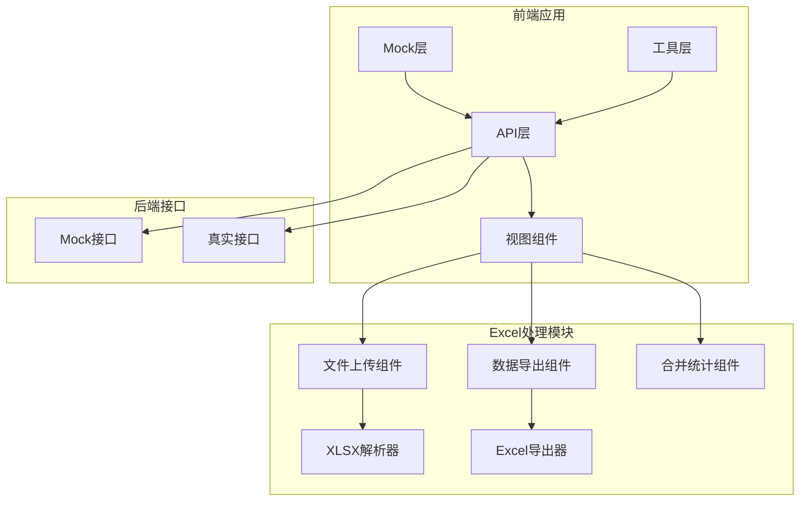
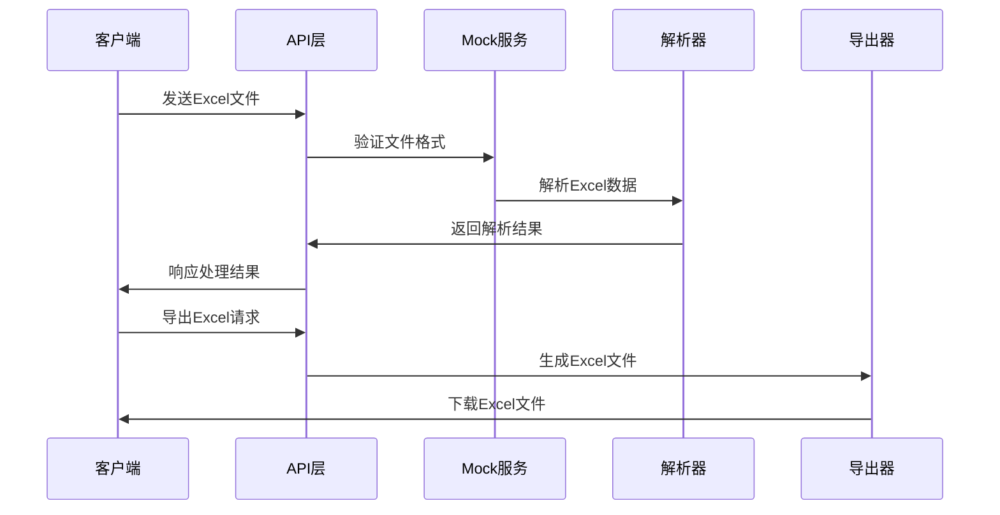
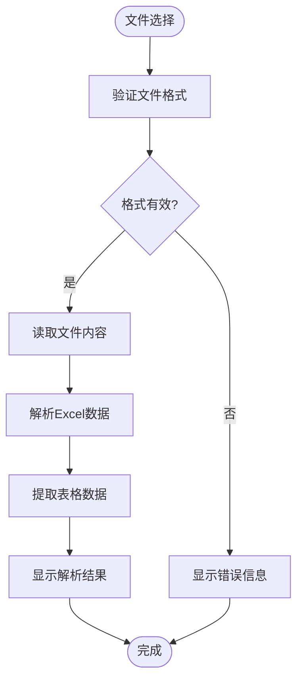
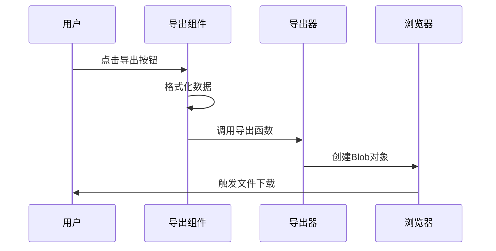
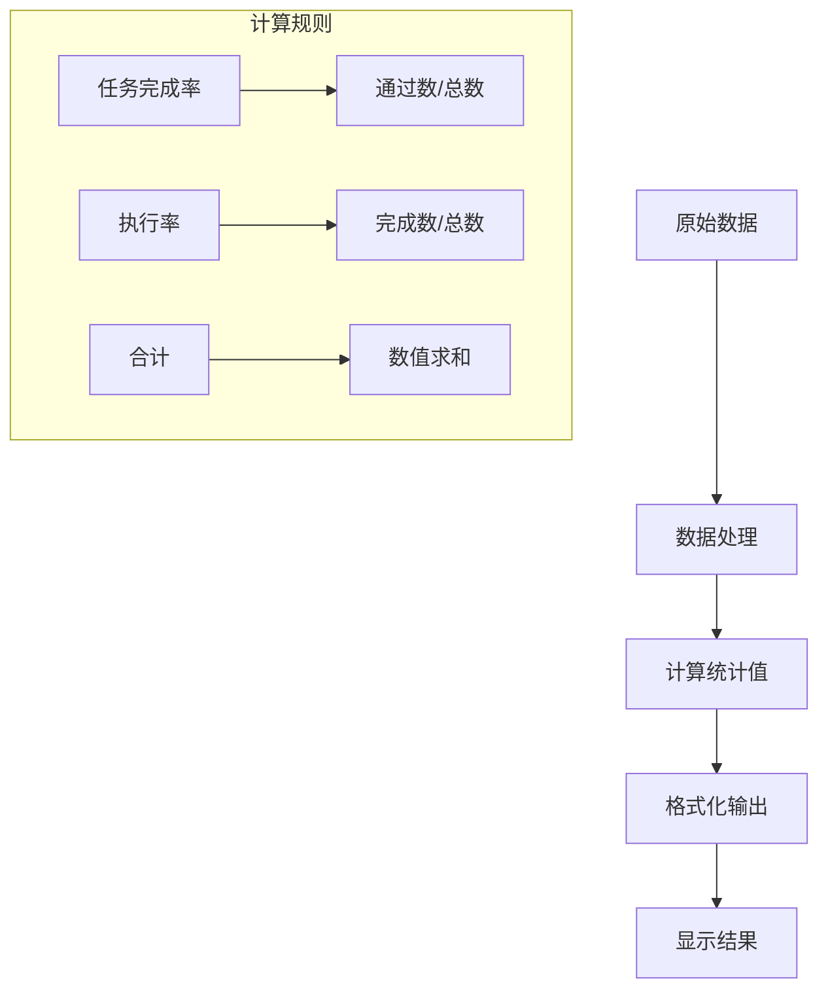
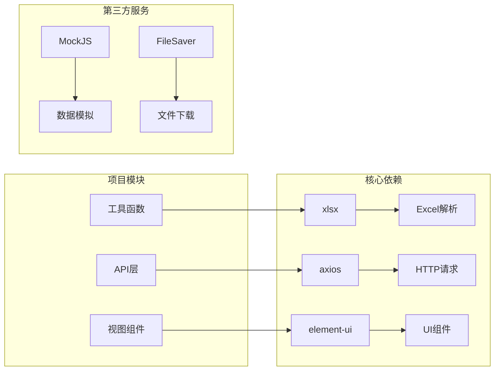

# Excel数据处理API

<cite>
**本文档引用的文件**
- [src/api/excel.js](file://src/api/excel.js)
- [src/mock/excel.js](file://src/mock/excel.js)
- [src/views/excel/upload-excel.vue](file://src/views/excel/upload-excel.vue)
- [src/views/excel/export-excel.vue](file://src/views/excel/export-excel.vue)
- [src/views/excel/merge-count.vue](file://src/views/excel/merge-count.vue)
- [src/vendor/Export2Excel.js](file://src/vendor/Export2Excel.js)
- [src/utils/request.js](file://src/utils/request.js)
- [src/mock/modules/excel.js](file://src/mock/modules/excel.js)
</cite>

## 目录
1. [项目概述](#项目概述)
2. [项目结构](#项目结构)
3. [核心组件](#核心组件)
4. [架构概览](#架构概览)
5. [详细组件分析](#详细组件分析)
6. [依赖关系分析](#依赖关系分析)
7. [性能考虑](#性能考虑)
8. [故障排除指南](#故障排除指南)
9. [结论](#结论)

## 项目概述

本项目提供了一套完整的Excel数据处理解决方案，包括文件上传、解析、合并统计和导出功能。基于Vue.js框架构建，采用前后端分离架构，支持多种Excel格式的处理和转换。

## 项目结构

项目采用模块化设计，主要包含以下核心模块：

**图表来源**
- [src/api/excel.js:1-38](file://src/api/excel.js#L1-L38)
- [src/views/excel/upload-excel.vue:1-130](file://src/views/excel/upload-excel.vue#L1-L130)

**章节来源**
- [src/api/excel.js:1-38](file://src/api/excel.js#L1-L38)
- [src/mock/excel.js:1-65](file://src/mock/excel.js#L1-L65)

## 核心组件

### API接口层

项目提供了三个主要的Excel处理API：

1. **数据表格接口** - `/excel/getmoviepiaofang-mock`
2. **合并统计接口** - `/excel/getMergeTableData`
3. **文件管理接口** - `/excel/getFiles` 和 `/excel/delFiles`

### 视图组件层

- **文件上传组件** (`upload-excel.vue`) - 支持.xlsx和.xls格式的本地文件解析
- **数据导出组件** (`export-excel.vue`) - 将数据导出为Excel文件
- **合并统计组件** (`merge-count.vue`) - 展示和计算统计数据

**章节来源**
- [src/api/excel.js:5-38](file://src/api/excel.js#L5-L38)
- [src/views/excel/upload-excel.vue:1-130](file://src/views/excel/upload-excel.vue#L1-L130)
- [src/views/excel/export-excel.vue:1-172](file://src/views/excel/export-excel.vue#L1-L172)
- [src/views/excel/merge-count.vue:1-118](file://src/views/excel/merge-count.vue#L1-L118)

## 架构概览

系统采用前后端分离架构，结合Mock数据进行开发测试：

**图表来源**
- [src/utils/request.js:1-139](file://src/utils/request.js#L1-L139)
- [src/vendor/Export2Excel.js:1-159](file://src/vendor/Export2Excel.js#L1-L159)

## 详细组件分析

### 文件上传组件

文件上传组件实现了完整的Excel文件处理流程：

#### 支持的Excel格式
- `.xlsx` - Office Open XML格式（推荐）
- `.xls` - 传统Excel格式

#### 数据解析流程

**图表来源**
- [src/views/excel/upload-excel.vue:42-94](file://src/views/excel/upload-excel.vue#L42-L94)

#### 关键实现特性

1. **文件格式验证** - 通过accept属性限制文件类型
2. **异步解析** - 使用FileReader和XLSX库进行异步处理
3. **数据预览** - 实时显示解析后的表格内容

**章节来源**
- [src/views/excel/upload-excel.vue:1-130](file://src/views/excel/upload-excel.vue#L1-L130)

### 数据导出组件

数据导出组件提供了灵活的Excel导出功能：

#### 导出功能特性

1. **动态列配置** - 支持自定义导出列
2. **数据格式化** - 自动处理日期、数字等格式
3. **文件命名** - 支持自定义文件名
4. **进度显示** - 导出过程的可视化反馈

#### 导出流程

**图表来源**
- [src/views/excel/export-excel.vue:80-123](file://src/views/excel/export-excel.vue#L80-L123)
- [src/vendor/Export2Excel.js:117-158](file://src/vendor/Export2Excel.js#L117-L158)

**章节来源**
- [src/views/excel/export-excel.vue:1-172](file://src/views/excel/export-excel.vue#L1-L172)
- [src/vendor/Export2Excel.js:1-159](file://src/vendor/Export2Excel.js#L1-L159)

### 合并统计组件

合并统计组件实现了复杂的数据汇总和计算功能：

#### 统计功能

1. **任务完成率计算** - 基于分子分母的百分比计算
2. **自动合计** - 智能计算各列的总和
3. **实时更新** - 支持定时刷新统计数据

#### 数据处理逻辑

**图表来源**
- [src/views/excel/merge-count.vue:54-109](file://src/views/excel/merge-count.vue#L54-L109)

**章节来源**
- [src/views/excel/merge-count.vue:1-118](file://src/views/excel/merge-count.vue#L1-L118)

### Mock数据服务

项目提供了完整的Mock数据服务，用于开发和测试：

#### Mock接口定义

| 接口名称 | URL路径 | 方法 | 功能描述 |
|---------|---------|------|----------|
| getTable | `/excel/getmoviepiaofang-mock` | POST | 获取电影票房数据 |
| getMergeTable | `/excel/getMergeTableData` | POST | 获取合并统计数据 |
| getFileList | `/excel/getFiles` | POST | 获取文件列表 |
| delFiles | `/excel/delFiles` | POST | 删除文件 |

#### Mock数据特点

1. **模拟真实数据** - 包含完整的业务场景数据
2. **随机生成** - 使用Mock.js生成多样化的测试数据
3. **可扩展性** - 易于添加新的Mock接口

**章节来源**
- [src/mock/excel.js:1-65](file://src/mock/excel.js#L1-L65)
- [src/mock/modules/excel.js:44-92](file://src/mock/modules/excel.js#L44-L92)

## 依赖关系分析

项目的关键依赖关系如下：

**图表来源**
- [src/views/excel/upload-excel.vue](file://src/views/excel/upload-excel.vue#L30)
- [src/utils/request.js:1-139](file://src/utils/request.js#L1-L139)

**章节来源**
- [src/views/excel/upload-excel.vue:1-130](file://src/views/excel/upload-excel.vue#L1-L130)
- [src/utils/request.js:1-139](file://src/utils/request.js#L1-L139)

## 性能考虑

### 文件处理性能优化

1. **异步处理** - 所有文件操作都采用异步方式，避免阻塞主线程
2. **内存管理** - 及时释放解析过程中产生的临时数据
3. **分页加载** - 大数据量时采用分页展示策略

### 前端性能优化

1. **懒加载** - Excel导出功能按需加载
2. **虚拟滚动** - 大表格数据的虚拟滚动支持
3. **缓存策略** - 对常用数据进行缓存

### 后端性能优化

1. **Mock数据缓存** - 开发环境下使用Mock数据减少网络请求
2. **接口限流** - 防止大量并发请求导致的性能问题
3. **错误处理** - 完善的错误捕获和处理机制

## 故障排除指南

### 常见问题及解决方案

#### 文件上传问题

**问题**：文件上传失败
**原因**：文件格式不支持或文件过大
**解决方案**：
1. 确认文件格式为.xlsx或.xls
2. 检查文件大小限制
3. 确认浏览器兼容性

#### 数据解析问题

**问题**：Excel数据无法正确解析
**原因**：Excel格式不标准或包含特殊字符
**解决方案**：
1. 使用标准的Excel格式
2. 避免在单元格中使用特殊字符
3. 检查数据区域的有效性

#### 导出功能问题

**问题**：Excel导出失败
**原因**：浏览器安全设置或文件下载被阻止
**解决方案**：
1. 检查浏览器的弹窗拦截设置
2. 确认文件下载权限
3. 尝试在其他浏览器中导出

**章节来源**
- [src/utils/request.js:54-136](file://src/utils/request.js#L54-L136)

## 结论

本Excel数据处理API提供了完整的Excel文件处理解决方案，包括文件上传、解析、合并统计和导出功能。系统采用模块化设计，具有良好的可扩展性和维护性。通过Mock数据服务，开发者可以快速进行功能测试和原型开发。项目遵循现代前端开发最佳实践，提供了优秀的用户体验和性能表现。

未来可以考虑的功能增强包括：
- 支持更多Excel格式（.xlsb、.xlsm等）
- 添加Excel模板生成功能
- 实现Excel文件的在线编辑功能
- 增强数据验证和错误处理机制