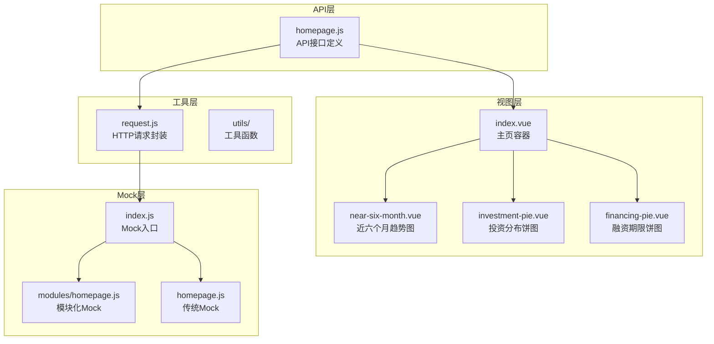
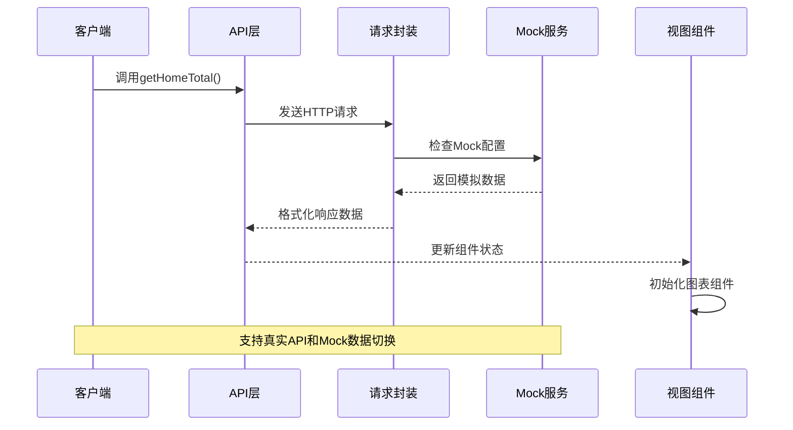
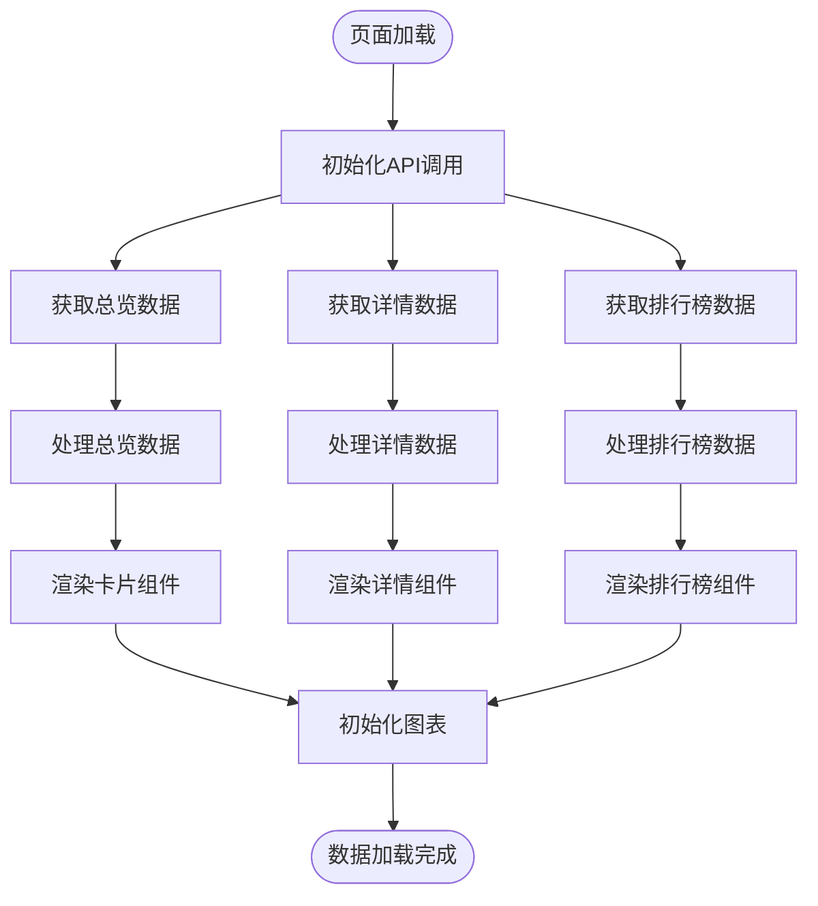
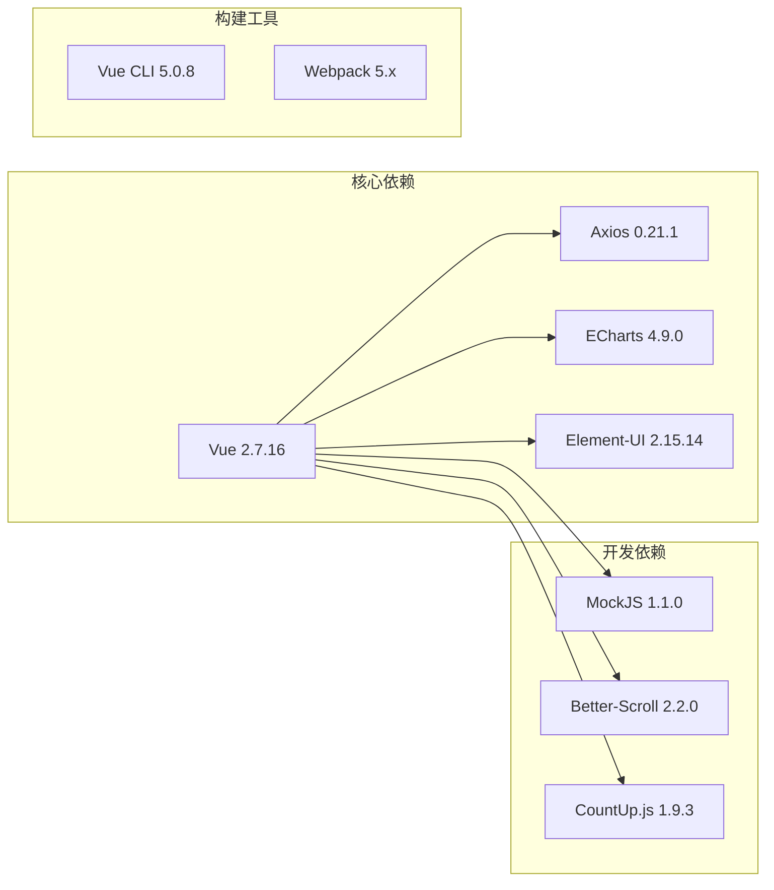
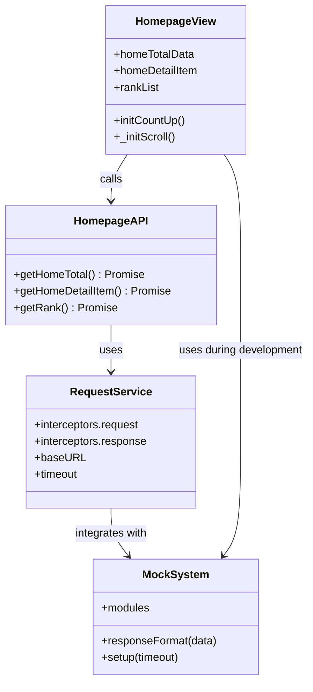

# 主页数据API

<cite>
**本文档引用的文件**
- [src/api/homepage.js](file://src/api/homepage.js)
- [src/views/homepage/index.vue](file://src/views/homepage/index.vue)
- [src/views/homepage/near-six-month.vue](file://src/views/homepage/near-six-month.vue)
- [src/views/homepage/investment-pie.vue](file://src/views/homepage/investment-pie.vue)
- [src/views/homepage/financing-pie.vue](file://src/views/homepage/financing-pie.vue)
- [src/utils/request.js](file://src/utils/request.js)
- [src/mock/index.js](file://src/mock/index.js)
- [src/mock/modules/homepage.js](file://src/mock/modules/homepage.js)
- [src/mock/homepage.js](file://src/mock/homepage.js)
- [vue.config.js](file://vue.config.js)
- [package.json](file://package.json)
</cite>

## 目录
1. [简介](#简介)
2. [项目结构](#项目结构)
3. [核心组件](#核心组件)
4. [架构概览](#架构概览)
5. [详细组件分析](#详细组件分析)
6. [依赖关系分析](#依赖关系分析)
7. [性能考虑](#性能考虑)
8. [故障排除指南](#故障排除指南)
9. [结论](#结论)
10. [附录](#附录)

## 简介

本文档详细描述了Vue CMS项目中主页仪表板数据相关API的设计与实现。该系统提供了投资组合、融资情况、近六个月数据等图表和统计数据的完整接口规范，涵盖饼图数据、趋势数据、汇总统计等不同类型的API端点。

系统采用前后端分离架构，使用Vue.js作为前端框架，Axios进行HTTP通信，Mock.js提供数据模拟，ECharts实现图表可视化。所有API接口都遵循统一的响应格式，支持实时数据更新和缓存策略。

## 项目结构

主页数据API相关的项目结构组织如下：



**图表来源**
- [src/api/homepage.js:1-23](file://src/api/homepage.js#L1-L23)
- [src/views/homepage/index.vue:176-278](file://src/views/homepage/index.vue#L176-L278)
- [src/utils/request.js:1-139](file://src/utils/request.js#L1-L139)

**章节来源**
- [src/api/homepage.js:1-23](file://src/api/homepage.js#L1-L23)
- [src/views/homepage/index.vue:1-654](file://src/views/homepage/index.vue#L1-L654)
- [src/utils/request.js:1-139](file://src/utils/request.js#L1-L139)

## 核心组件

### API接口定义

系统提供三个主要的数据API接口：

1. **首页总览数据** (`/homepage/hometotal`)
2. **详情项数据** (`/homepage/detailItem`)  
3. **投资排行榜** (`/homepage/investmentRank`)

每个接口都通过统一的请求封装进行调用，支持Promise链式处理和错误处理。

**章节来源**
- [src/api/homepage.js:3-22](file://src/api/homepage.js#L3-L22)

### 视图组件架构

主页采用响应式布局设计，包含四个主要区域：

1. **总览卡片区域** - 显示平台交易总额、已为投资人赚取、待回收金额、已回收金额
2. **近六个月趋势图** - 展示交易总额、营收、净利润、直接访问、搜索引擎等指标的趋势变化
3. **详情项展示** - 注册用户数、活跃用户数、人均投资金额、网站日均访问量
4. **投资分布饼图** - 投资金额分布和融资期限分布的可视化展示

**章节来源**
- [src/views/homepage/index.vue:1-654](file://src/views/homepage/index.vue#L1-L654)

## 架构概览

系统采用分层架构设计，确保各层职责清晰分离：



**图表来源**
- [src/api/homepage.js:1-23](file://src/api/homepage.js#L1-L23)
- [src/utils/request.js:17-52](file://src/utils/request.js#L17-L52)
- [src/mock/index.js:27-34](file://src/mock/index.js#L27-L34)

### 数据流架构



**图表来源**
- [src/views/homepage/index.vue:233-265](file://src/views/homepage/index.vue#L233-L265)

## 详细组件分析

### API接口规范

#### 总览数据接口

**接口地址**: `/homepage/hometotal`
**请求方法**: POST
**功能描述**: 获取主页总览数据，包括平台交易总额、已为投资人赚取、待回收金额、已回收金额等关键指标

**请求参数**: 无
**响应数据结构**:
```javascript
{
  code: 200,
  message: "success",
  data: [
    {
      title: "平台交易总额",
      value: 1234567,
      color: "#ff6b6b",
      data: [120, 132, 101, 134, 90, 230]
    }
  ]
}
```

**字段说明**:
- `title`: 指标名称
- `value`: 数值大小
- `color`: 配色方案
- `data`: 近六个月数据数组，长度为6

#### 详情项数据接口

**接口地址**: `/homepage/detailItem`
**请求方法**: POST
**功能描述**: 获取主页详情项数据，包括注册用户数、活跃用户数、人均投资金额、网站日均访问量

**请求参数**: 无
**响应数据结构**:
```javascript
{
  code: 200,
  message: "success", 
  data: [
    {
      name: "注册用户数",
      value: 123456,
      color: "#ec407a"
    }
  ]
}
```

**字段说明**:
- `name`: 指标名称
- `value`: 数值大小（单位：万）
- `color`: 配色方案

#### 投资排行榜接口

**接口地址**: `/homepage/investmentRank`
**请求方法**: POST
**功能描述**: 获取投资排行榜数据，包含用户姓名、投资金额、头像URL等信息

**请求参数**: 无
**响应数据结构**:
```javascript
{
  code: 200,
  message: "success",
  data: [
    {
      name: "张三",
      value: 1234567,
      avatar: "https://avatars.githubusercontent.com/u/1234567"
    }
  ]
}
```

**字段说明**:
- `name`: 用户姓名
- `value`: 投资金额
- `avatar`: 用户头像URL

**章节来源**
- [src/api/homepage.js:3-22](file://src/api/homepage.js#L3-L22)
- [src/mock/modules/homepage.js:75-119](file://src/mock/modules/homepage.js#L75-L119)

### 图表组件分析

#### 近六个月趋势图组件

**组件名称**: near-six-month.vue
**功能特性**:
- 展示近六个月的多指标趋势数据
- 支持响应式布局和窗口大小调整
- 包含交易总额、营收、净利润、直接访问、搜索引擎五个指标

**数据结构**:
```javascript
{
  xAxisData: ["2023-01", "2023-02", "2023-03", "2023-04", "2023-05", "2023-06"],
  seriesData: [
    { name: "交易总额", data: [120, 132, 101, 134, 90, 230] },
    { name: "营收", data: [220, 182, 191, 234, 290, 330] },
    { name: "净利润", data: [150, 232, 201, 154, 190, 330] },
    { name: "直接访问", data: [320, 332, 301, 334, 390, 330] },
    { name: "搜索引擎", data: [820, 932, 901, 934, 1290, 1330] }
  ]
}
```

**图表配置**:
- 图表类型: 折线图
- 时间轴: 近六个月（按月显示）
- 图例: 支持多系列对比
- 坐标轴: 左侧数值轴，底部分类轴

**章节来源**
- [src/views/homepage/near-six-month.vue:31-107](file://src/views/homepage/near-six-month.vue#L31-L107)

#### 投资分布饼图组件

**组件名称**: investment-pie.vue
**功能特性**:
- 展示投资金额分布情况
- 支持环形饼图显示
- 包含百分比和数值标签

**数据结构**:
```javascript
{
  legendData: ["1万元以下", "1-10万", "10-40万", "40万以上"],
  seriesData: [
    { name: "1万元以下", value: 335 },
    { name: "1-10万", value: 310 },
    { name: "10-40万", value: 234 },
    { name: "40万以上", value: 135 }
  ]
}
```

**图表配置**:
- 图表类型: 饼图（环形）
- 颜色方案: 默认主题色
- 标签: 高亮显示选中项
- 图例: 右侧垂直排列

**章节来源**
- [src/views/homepage/investment-pie.vue:33-78](file://src/views/homepage/investment-pie.vue#L33-L78)

#### 融资期限饼图组件

**组件名称**: financing-pie.vue
**功能特性**:
- 展示融资期限分布情况
- 支持环形饼图显示
- 包含百分比和数值标签

**数据结构**:
```javascript
{
  legendData: ["0-3个月", "3-6个月", "6-12个月", "12个月以上"],
  seriesData: [
    { name: "0-3个月", value: 135 },
    { name: "3-6个月", value: 210 },
    { name: "6-12个月", value: 234 },
    { name: "12个月以上", value: 135 }
  ]
}
```

**图表配置**:
- 图表类型: 饼图（环形）
- 颜色方案: 默认主题色
- 标签: 高亮显示选中项
- 图例: 右侧垂直排列

**章节来源**
- [src/views/homepage/financing-pie.vue:33-78](file://src/views/homepage/financing-pie.vue#L33-L78)

### 数据缓存策略

系统实现了多层次的数据缓存策略：

1. **HTTP缓存控制**: 通过请求拦截器设置`Cache-Control: no-cache`
2. **Mock数据缓存**: Mock.js提供本地数据缓存，支持随机数据生成
3. **组件级缓存**: Vue组件内部维护数据状态，避免重复请求
4. **浏览器缓存**: 通过URL参数添加时间戳防止缓存

**章节来源**
- [src/utils/request.js:24-43](file://src/utils/request.js#L24-L43)
- [src/mock/index.js:16-18](file://src/mock/index.js#L16-L18)

## 依赖关系分析

### 外部依赖

系统主要依赖以下外部库：



**图表来源**
- [package.json:33-63](file://package.json#L33-L63)

### 内部依赖关系



**图表来源**
- [src/api/homepage.js:1-23](file://src/api/homepage.js#L1-L23)
- [src/utils/request.js:1-139](file://src/utils/request.js#L1-L139)
- [src/mock/index.js:1-38](file://src/mock/index.js#L1-L38)
- [src/views/homepage/index.vue:176-278](file://src/views/homepage/index.vue#L176-L278)

**章节来源**
- [package.json:33-99](file://package.json#L33-L99)

## 性能考虑

### 图表性能优化

1. **懒加载策略**: ECharts组件采用按需加载，只在需要时引入相应模块
2. **防抖处理**: 窗口大小调整事件使用防抖机制，避免频繁重绘
3. **内存管理**: 组件销毁时自动清理图表实例和事件监听器

### 数据加载优化

1. **并发请求**: 主页初始化时并行发起多个API请求，提高加载速度
2. **数据转换**: 在组件层面进行必要的数据格式转换，减少重复计算
3. **增量更新**: 支持局部数据更新，避免整页刷新

### 缓存策略

1. **Mock数据缓存**: 开发环境下使用Mock.js缓存生成的测试数据
2. **HTTP缓存**: 生产环境下通过合理的缓存头控制数据更新频率
3. **组件缓存**: Vue组件内部维护数据状态，避免重复请求相同数据

**章节来源**
- [src/views/homepage/near-six-month.vue:113-118](file://src/views/homepage/near-six-month.vue#L113-L118)
- [src/views/homepage/index.vue:233-265](file://src/views/homepage/index.vue#L233-L265)

## 故障排除指南

### 常见问题及解决方案

#### API请求失败

**症状**: 控制台出现网络错误或请求超时
**可能原因**:
1. 后端服务未启动
2. 网络连接问题
3. CORS跨域配置错误

**解决步骤**:
1. 检查后端服务状态
2. 验证代理配置
3. 查看浏览器开发者工具网络面板

#### Mock数据不更新

**症状**: 页面显示的测试数据固定不变
**可能原因**:
1. Mock服务未正确初始化
2. Mock模块配置错误

**解决步骤**:
1. 确认Mock入口文件正确导入
2. 检查Mock模块的state配置
3. 验证Mock数据格式

#### 图表显示异常

**症状**: ECharts图表无法正常显示或显示错误
**可能原因**:
1. DOM元素未完全加载
2. 容器尺寸未正确设置
3. 图表配置错误

**解决步骤**:
1. 确保在mounted生命周期中初始化图表
2. 检查容器的width和height属性
3. 验证ECharts配置选项

**章节来源**
- [src/utils/request.js:108-135](file://src/utils/request.js#L108-L135)
- [src/mock/index.js:27-34](file://src/mock/index.js#L27-L34)

## 结论

主页数据API系统提供了完整的仪表板数据展示解决方案，具有以下特点：

1. **模块化设计**: API接口、视图组件、工具函数职责清晰分离
2. **灵活的数据源**: 支持真实API和Mock数据两种模式
3. **丰富的图表类型**: 涵盖趋势图、饼图等多种可视化组件
4. **完善的错误处理**: 提供全面的异常处理和用户反馈机制
5. **性能优化**: 采用多种优化策略确保良好的用户体验

该系统为后续的功能扩展和维护奠定了坚实的基础，支持快速迭代和功能增强。

## 附录

### 开发调试技巧

#### Mock数据配置

1. **模块化Mock**: 使用`src/mock/modules/homepage.js`进行模块化配置
2. **响应格式**: 所有Mock数据都通过`responseFormat`函数包装
3. **数据生成**: 使用Mock.js语法生成随机测试数据

#### 开发环境配置

1. **代理设置**: 通过`vue.config.js`配置API代理
2. **环境变量**: 使用`VUE_APP_BASE_API`和`VUE_APP_PROXY_API`环境变量
3. **热重载**: 开发环境下支持热重载和实时调试

#### 性能监控

1. **网络监控**: 使用浏览器开发者工具监控API请求
2. **内存监控**: 关注图表实例的内存使用情况
3. **渲染性能**: 监控组件的渲染时间和重绘频率

**章节来源**
- [src/mock/index.js:7-14](file://src/mock/index.js#L7-L14)
- [vue.config.js:29-50](file://vue.config.js#L29-L50)