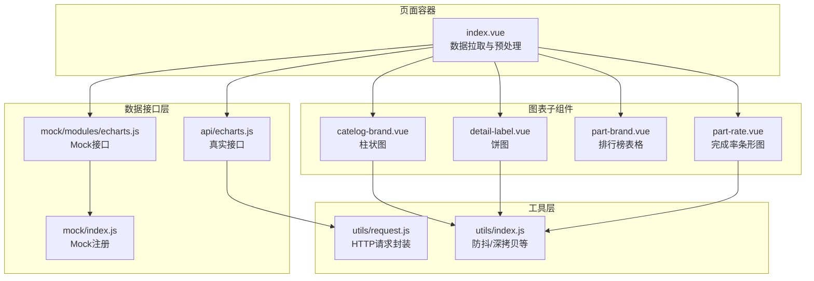
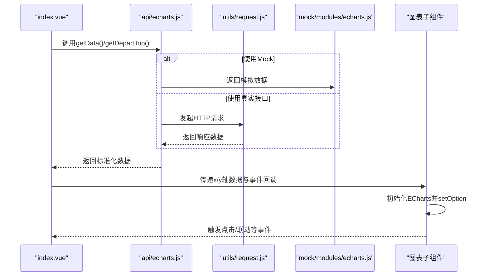
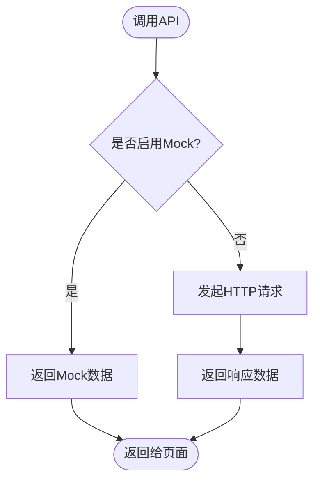
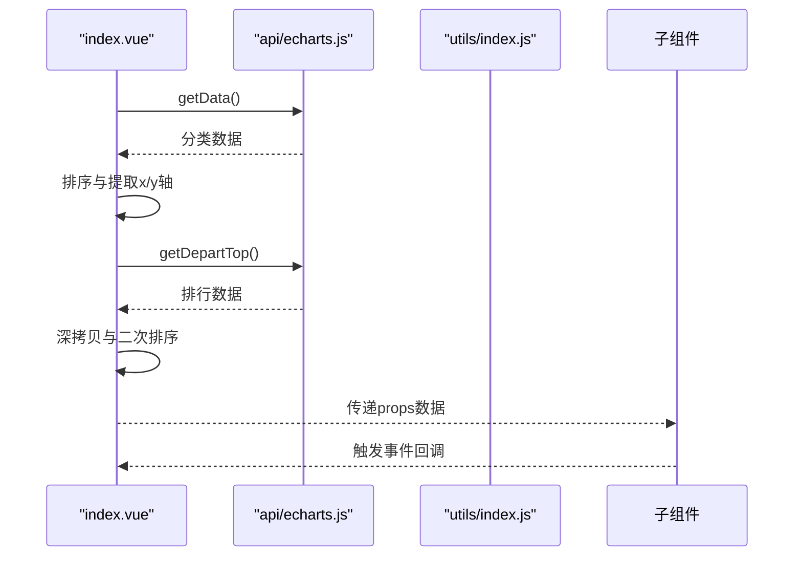
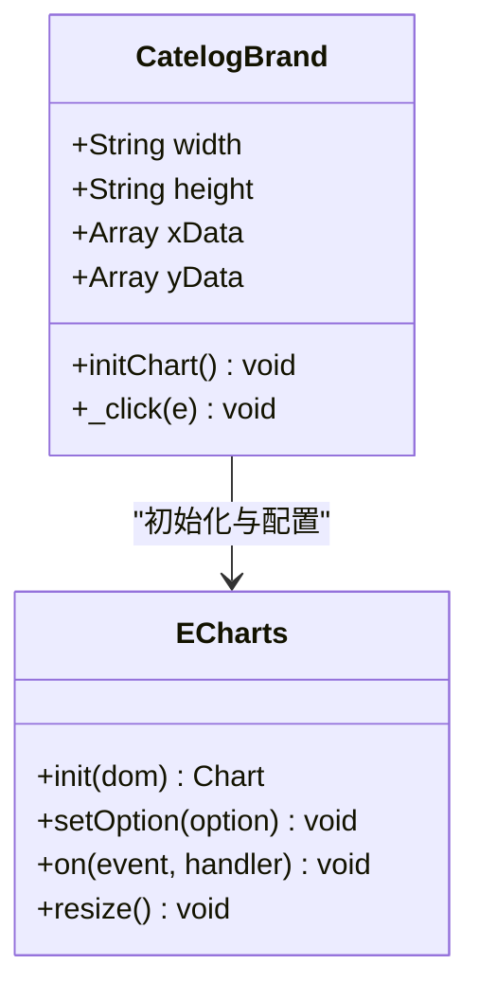
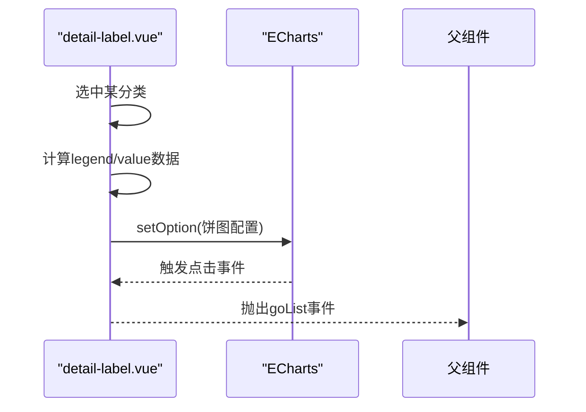
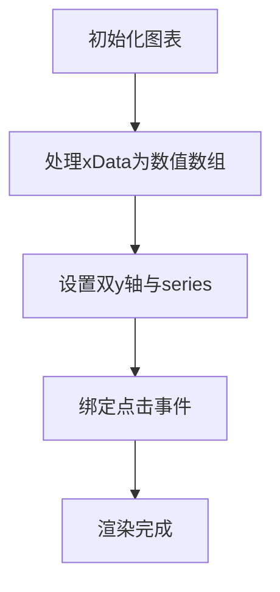
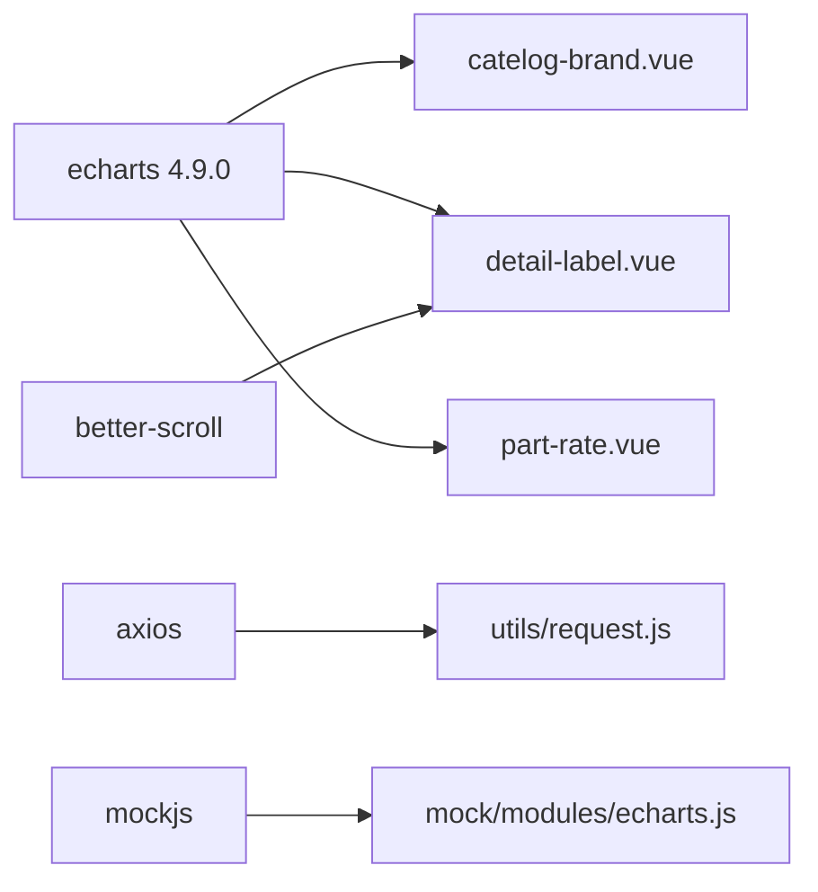

# 图表数据API

<cite>
**本文档引用的文件**
- [src/api/echarts.js](file://src/api/echarts.js)
- [src/mock/echarts.js](file://src/mock/echarts.js)
- [src/mock/modules/echarts.js](file://src/mock/modules/echarts.js)
- [src/views/echarts/index.vue](file://src/views/echarts/index.vue)
- [src/views/echarts/index-child/catelog-brand.vue](file://src/views/echarts/index-child/catelog-brand.vue)
- [src/views/echarts/index-child/detail-label.vue](file://src/views/echarts/index-child/detail-label.vue)
- [src/views/echarts/index-child/part-brand.vue](file://src/views/echarts/index-child/part-brand.vue)
- [src/views/echarts/index-child/part-rate.vue](file://src/views/echarts/index-child/part-rate.vue)
- [src/utils/request.js](file://src/utils/request.js)
- [src/utils/index.js](file://src/utils/index.js)
- [src/mock/index.js](file://src/mock/index.js)
- [package.json](file://package.json)
</cite>

## 目录
1. [简介](#简介)
2. [项目结构](#项目结构)
3. [核心组件](#核心组件)
4. [架构总览](#架构总览)
5. [详细组件分析](#详细组件分析)
6. [依赖关系分析](#依赖关系分析)
7. [性能考虑](#性能考虑)
8. [故障排查指南](#故障排查指南)
9. [结论](#结论)
10. [附录](#附录)

## 简介
本文件面向ECharts图表数据相关API的完整文档化，覆盖柱状图、饼图、条形图等常见图表类型的接口规范、数据格式、颜色配置、交互事件、动态更新、图表联动与缩放过滤等高级能力。同时提供Mock图表数据接口的使用方法、开发调试指南，以及图表组件封装的API设计规范与性能优化建议，帮助开发者快速理解并扩展图表模块。

## 项目结构
图表模块位于视图层的echarts目录下，采用“页面容器 + 子组件”的分层组织方式：
- 页面容器负责数据拉取、数据预处理与子组件编排
- 子组件封装具体图表类型，内部初始化ECharts实例并绑定交互事件
- API层提供真实数据接口，Mock层提供本地开发与联调用的模拟数据

**图表来源**
- [src/views/echarts/index.vue:1-217](file://src/views/echarts/index.vue#L1-L217)
- [src/api/echarts.js:1-20](file://src/api/echarts.js#L1-L20)
- [src/mock/modules/echarts.js:1-194](file://src/mock/modules/echarts.js#L1-L194)
- [src/mock/index.js:1-38](file://src/mock/index.js#L1-L38)
- [src/utils/request.js:1-139](file://src/utils/request.js#L1-L139)
- [src/utils/index.js:1-122](file://src/utils/index.js#L1-L122)

**章节来源**
- [src/views/echarts/index.vue:1-217](file://src/views/echarts/index.vue#L1-L217)
- [src/api/echarts.js:1-20](file://src/api/echarts.js#L1-L20)
- [src/mock/modules/echarts.js:1-194](file://src/mock/modules/echarts.js#L1-L194)
- [src/mock/index.js:1-38](file://src/mock/index.js#L1-L38)
- [src/utils/request.js:1-139](file://src/utils/request.js#L1-L139)
- [src/utils/index.js:1-122](file://src/utils/index.js#L1-L122)

## 核心组件
- 页面容器组件负责：
  - 调用API获取分类与排行数据
  - 对数据进行排序与格式化，生成图表所需的x/y轴数据
  - 通过事件向子组件传递数据并接收子组件回调
- 图表子组件负责：
  - 初始化ECharts实例
  - 设置option（标题、网格、坐标轴、系列、颜色、渐变等）
  - 绑定点击、缩放、联动等交互事件
  - 响应props变化，动态刷新图表

**章节来源**
- [src/views/echarts/index.vue:56-172](file://src/views/echarts/index.vue#L56-L172)
- [src/views/echarts/index-child/catelog-brand.vue:44-146](file://src/views/echarts/index-child/catelog-brand.vue#L44-L146)
- [src/views/echarts/index-child/detail-label.vue:65-168](file://src/views/echarts/index-child/detail-label.vue#L65-L168)
- [src/views/echarts/index-child/part-rate.vue:48-161](file://src/views/echarts/index-child/part-rate.vue#L48-L161)

## 架构总览
图表数据API的调用链路如下：
- 页面容器发起数据请求
- 若启用Mock，则由Mock拦截并返回模拟数据
- 若未启用Mock，则通过HTTP请求访问后端接口
- 数据到达后进行格式化，传入各图表子组件
- 子组件根据ECharts配置渲染图表并绑定交互事件

**图表来源**
- [src/views/echarts/index.vue:94-166](file://src/views/echarts/index.vue#L94-L166)
- [src/api/echarts.js:5-19](file://src/api/echarts.js#L5-L19)
- [src/utils/request.js:17-136](file://src/utils/request.js#L17-L136)
- [src/mock/modules/echarts.js:176-193](file://src/mock/modules/echarts.js#L176-L193)

## 详细组件分析

### API层：图表数据接口
- 接口定义
  - getData(): GET /echarts/getCateData
  - getDepartTop(): POST /echarts/getDepartTop
- 数据格式
  - 响应体包含标准字段：code/message/status/data
  - data为数组，元素包含业务字段（如all、done、quesName、quesId、deptName等）
- Mock模式
  - 通过mock/modules/echarts.js注册路由，返回固定数据
  - mock/index.js统一加载modules下的Mock配置

**图表来源**
- [src/api/echarts.js:5-19](file://src/api/echarts.js#L5-L19)
- [src/mock/modules/echarts.js:176-193](file://src/mock/modules/echarts.js#L176-L193)
- [src/mock/index.js:20-34](file://src/mock/index.js#L20-L34)

**章节来源**
- [src/api/echarts.js:1-20](file://src/api/echarts.js#L1-L20)
- [src/mock/modules/echarts.js:1-194](file://src/mock/modules/echarts.js#L1-L194)
- [src/mock/index.js:1-38](file://src/mock/index.js#L1-L38)

### 页面容器：数据拉取与预处理
- 功能要点
  - 调用getData()获取分类数据并按总量降序排序
  - 提取x/y轴数据用于柱状图
  - 调用getDepartTop()获取排行数据，分别生成“总数排行”和“完成率排行”
  - 将数据通过props传递给子组件
- 事件处理
  - 接收子组件发出的gotoList/goList事件，触发页面跳转逻辑

**图表来源**
- [src/views/echarts/index.vue:94-166](file://src/views/echarts/index.vue#L94-L166)
- [src/utils/index.js:54-67](file://src/utils/index.js#L54-L67)

**章节来源**
- [src/views/echarts/index.vue:56-172](file://src/views/echarts/index.vue#L56-L172)
- [src/utils/index.js:12-45](file://src/utils/index.js#L12-L45)

### 柱状图组件：catelog-brand.vue
- 图表类型：柱状图（bar）
- 数据输入
  - xData: 支持字符串或对象（包含value/id），用于横轴标签
  - yData: 数值数组，用于柱高
- 配置要点
  - 标题、提示框、网格、坐标轴样式（颜色、字体、边距）
  - 渐变填充色（LinearGradient）
  - 点击事件：根据dataIndex获取对应id并向上抛出事件
- 响应式与交互
  - 监听xData/yData变化，重新初始化图表并触发resize
  - 窗口resize时使用防抖处理

**图表来源**
- [src/views/echarts/index-child/catelog-brand.vue:11-34](file://src/views/echarts/index-child/catelog-brand.vue#L11-L34)
- [src/views/echarts/index-child/catelog-brand.vue:44-146](file://src/views/echarts/index-child/catelog-brand.vue#L44-L146)

**章节来源**
- [src/views/echarts/index-child/catelog-brand.vue:1-172](file://src/views/echarts/index-child/catelog-brand.vue#L1-L172)

### 饼图组件：detail-label.vue
- 图表类型：饼图（pie）
- 数据输入
  - labelData: 用于左侧滚动选择的分类列表
  - 通过选中项生成饼图数据（legendDetail/valueDetail）
- 配置要点
  - 提示框位置与格式化
  - 图例配置（位置、颜色、图标）
  - 饼图半径、最小角度、中心位置
  - 渐变色填充（LinearGradient）
- 交互事件
  - 点击扇区：解析名称获取quesId并向上抛出事件
  - 图例切换：阻止默认toggle行为，保持单选

**图表来源**
- [src/views/echarts/index-child/detail-label.vue:65-168](file://src/views/echarts/index-child/detail-label.vue#L65-L168)
- [src/views/echarts/index-child/detail-label.vue:209-227](file://src/views/echarts/index-child/detail-label.vue#L209-L227)

**章节来源**
- [src/views/echarts/index-child/detail-label.vue:1-383](file://src/views/echarts/index-child/detail-label.vue#L1-L383)

### 排行榜表格：part-brand.vue
- 组件职责：展示地区/部门的总数、完成数与完成率
- 交互：点击某一行，向上抛出goList事件，携带deptId
- 样式：前三名高亮显示

**章节来源**
- [src/views/echarts/index-child/part-brand.vue:1-129](file://src/views/echarts/index-child/part-brand.vue#L1-L129)

### 完成率条形图：part-rate.vue
- 图表类型：条形图（bar）
- 数据输入
  - xData: 百分比数值或对象（包含value/id）
  - yData: 地区名称数组
- 配置要点
  - 双y轴：左侧隐藏、右侧显示百分比标签
  - 背景灰条与前景彩色条组合，形成对比
  - 渐变色填充（colorStops）
- 交互事件
  - 点击条形：根据dataIndex获取deptId并向上抛出事件

**图表来源**
- [src/views/echarts/index-child/part-rate.vue:48-161](file://src/views/echarts/index-child/part-rate.vue#L48-L161)

**章节来源**
- [src/views/echarts/index-child/part-rate.vue:1-187](file://src/views/echarts/index-child/part-rate.vue#L1-L187)

## 依赖关系分析
- 依赖生态
  - ECharts 4.9.0：图表渲染与交互
  - Axios：HTTP请求封装
  - MockJS：本地Mock数据
  - better-scroll：滚动容器（饼图详情列表）
- 组件耦合
  - 页面容器与子组件通过props与事件解耦
  - 图表子组件内部持有ECharts实例，避免跨组件共享复杂度
  - 工具函数（防抖、深拷贝）在多个子组件复用

**图表来源**
- [package.json:40](file://package.json#L40)
- [package.json:35](file://package.json#L35)
- [package.json:46](file://package.json#L46)
- [package.json:36](file://package.json#L36)

**章节来源**
- [package.json:1-99](file://package.json#L1-L99)

## 性能考虑
- 防抖与节流
  - 窗口resize使用防抖，降低频繁重绘开销
  - 建议对图表点击、缩放等高频事件也采用防抖策略
- 数据处理
  - 使用深拷贝避免原数据被污染
  - 排序与格式化尽量在组件外完成，减少重复计算
- 渲染优化
  - 按需加载ECharts模块，避免全量引入
  - 合理设置zlevel/z-index，控制图层顺序
- 内存管理
  - 组件销毁时释放ECharts实例与事件监听
  - 监听window resize时注意移除事件，避免内存泄漏

[本节为通用性能建议，不直接分析特定文件]

## 故障排查指南
- 请求失败
  - 检查utils/request.js中的拦截器是否正确处理错误码与网络异常
  - 关注超时、网络错误提示
- Mock未生效
  - 确认mock/index.js已加载modules中的echarts.js
  - 检查URL与method匹配是否正确
- 图表不显示或尺寸异常
  - 确认容器宽高设置与防抖resize处理
  - 检查xData/yData格式是否符合预期
- 事件未触发
  - 确认子组件是否正确绑定事件并向上抛出
  - 检查事件名与参数是否一致

**章节来源**
- [src/utils/request.js:54-136](file://src/utils/request.js#L54-L136)
- [src/mock/index.js:20-34](file://src/mock/index.js#L20-L34)
- [src/views/echarts/index-child/catelog-brand.vue:158-169](file://src/views/echarts/index-child/catelog-brand.vue#L158-L169)
- [src/views/echarts/index-child/detail-label.vue:209-227](file://src/views/echarts/index-child/detail-label.vue#L209-L227)

## 结论
本图表数据API以清晰的分层架构实现了数据获取、格式化与图表渲染的完整闭环。通过Mock机制简化了开发与联调流程，通过组件化的图表封装提升了可维护性与复用性。建议在后续迭代中进一步完善事件防抖、内存清理与错误恢复机制，以提升整体稳定性与用户体验。

[本节为总结性内容，不直接分析特定文件]

## 附录

### 数据格式与字段说明
- 分类数据（getData）
  - 字段：quesName、quesId、all、children（可选）
  - children：包含子项的quesName、quesId、all
- 排行数据（getDepartTop）
  - 字段：deptName、all、done、deptId（可选）

**章节来源**
- [src/mock/modules/echarts.js:3-158](file://src/mock/modules/echarts.js#L3-L158)
- [src/mock/modules/echarts.js:159-174](file://src/mock/modules/echarts.js#L159-L174)

### 颜色配置与渐变
- 柱状图：使用LinearGradient从上到下渐变
- 饼图：使用LinearGradient双色渐变，配合多段颜色数组
- 完成率条形图：使用colorStops实现从左到右渐变

**章节来源**
- [src/views/echarts/index-child/catelog-brand.vue:122-139](file://src/views/echarts/index-child/catelog-brand.vue#L122-L139)
- [src/views/echarts/index-child/detail-label.vue:243-254](file://src/views/echarts/index-child/detail-label.vue#L243-L254)
- [src/views/echarts/index-child/part-rate.vue:142-156](file://src/views/echarts/index-child/part-rate.vue#L142-L156)

### 交互事件清单
- 点击事件
  - 柱状图：根据dataIndex获取quesId
  - 饼图：根据扇区名称解析quesId
  - 完成率条形图：根据dataIndex获取deptId
- 图例事件
  - 饼图：阻止默认toggle，保持单选

**章节来源**
- [src/views/echarts/index-child/catelog-brand.vue:40-43](file://src/views/echarts/index-child/catelog-brand.vue#L40-L43)
- [src/views/echarts/index-child/detail-label.vue:209-227](file://src/views/echarts/index-child/detail-label.vue#L209-L227)
- [src/views/echarts/index-child/part-rate.vue:43-47](file://src/views/echarts/index-child/part-rate.vue#L43-L47)

### Mock图表数据接口使用指南
- 启用Mock
  - 确保mock/index.js已注册modules中的echarts.js
  - 调用getData()与getDepartTop()将返回模拟数据
- 自定义Mock数据
  - 修改mock/modules/echarts.js中的cateData/departData
  - 通过responseFormat统一返回格式

**章节来源**
- [src/mock/index.js:20-34](file://src/mock/index.js#L20-L34)
- [src/mock/modules/echarts.js:176-193](file://src/mock/modules/echarts.js#L176-L193)

### 开发调试建议
- 使用浏览器开发者工具观察网络请求与Mock拦截
- 在图表组件中打印option与事件参数，验证数据流转
- 对高频交互（点击、缩放、滚动）增加日志与性能监控

[本节为通用调试建议，不直接分析特定文件]