# 拖拽功能API

<cite>
**本文档引用的文件**
- [draggable.js](file://src/api/draggable.js)
- [draggable.vue](file://src/views/futures/draggable.vue)
- [draggable.js](file://src/mock/modules/draggable.js)
- [draggable.js](file://src/mock/draggable.js)
- [index.js](file://src/mock/index.js)
- [detect-prefixes.js](file://src/utils/detect-prefixes.js)
- [stack.vue](file://src/components/tantan/stack.vue)
- [vuedraggable.js](file://node_modules/vuedraggable/src/vuedraggable.js)
- [package.json](file://package.json)
</cite>

## 目录
1. [简介](#简介)
2. [项目结构](#项目结构)
3. [核心组件](#核心组件)
4. [架构概览](#架构概览)
5. [详细组件分析](#详细组件分析)
6. [依赖关系分析](#依赖关系分析)
7. [性能考虑](#性能考虑)
8. [故障排除指南](#故障排除指南)
9. [结论](#结论)

## 简介

本文档详细介绍了Vue CMS项目中的拖拽功能API，涵盖了拖拽操作的数据接口、事件处理、位置计算、状态同步等技术实现细节。项目实现了基于vuedraggable的拖拽排序功能，支持图片文件的拖拽重排和容器交互。

拖拽功能主要包含以下特性：
- 基于vuedraggable的拖拽排序
- 图片文件的拖拽展示和播放
- Mock数据模拟接口
- 跨平台兼容的触摸事件处理
- 性能优化和防抖处理

## 项目结构

拖拽功能相关的文件组织结构如下：

```mermaid
graph TB
subgraph "拖拽功能模块"
A[src/views/futures/draggable.vue] --> B[src/api/draggable.js]
B --> C[src/mock/modules/draggable.js]
C --> D[src/mock/draggable.js]
D --> E[src/mock/index.js]
end
subgraph "工具类"
F[src/utils/detect-prefixes.js]
G[src/components/tantan/stack.vue]
end
subgraph "第三方库"
H[vuedraggable@2.24.3]
I[sortablejs@1.10.2]
end
A --> H
H --> I
A --> F
G --> F
```

**图表来源**
- [draggable.vue:1-604](file://src/views/futures/draggable.vue#L1-L604)
- [draggable.js:1-35](file://src/api/draggable.js#L1-L35)
- [draggable.js:1-41](file://src/mock/modules/draggable.js#L1-L41)

**章节来源**
- [draggable.vue:1-604](file://src/views/futures/draggable.vue#L1-L604)
- [draggable.js:1-35](file://src/api/draggable.js#L1-L35)
- [draggable.js:1-41](file://src/mock/modules/draggable.js#L1-L41)

## 核心组件

### 主要拖拽组件

拖拽功能的核心实现位于`draggable.vue`组件中，该组件集成了vuedraggable库来实现拖拽排序功能。

### API接口定义

拖拽相关的API接口定义在`draggable.js`文件中：

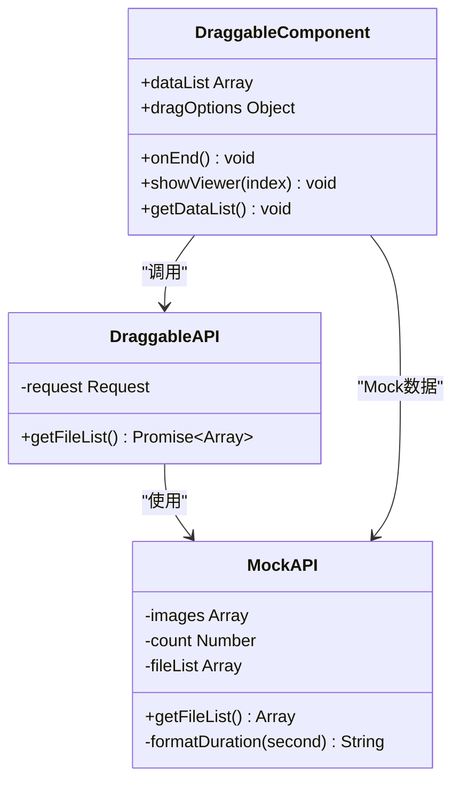

**图表来源**
- [draggable.js:27-32](file://src/api/draggable.js#L27-L32)
- [draggable.js:30-40](file://src/mock/modules/draggable.js#L30-L40)
- [draggable.vue:70-227](file://src/views/futures/draggable.vue#L70-L227)

**章节来源**
- [draggable.js:1-35](file://src/api/draggable.js#L1-L35)
- [draggable.js:1-41](file://src/mock/modules/draggable.js#L1-L41)
- [draggable.vue:1-604](file://src/views/futures/draggable.vue#L1-L604)

## 架构概览

拖拽功能的整体架构采用分层设计，包含数据层、接口层、组件层和工具层：

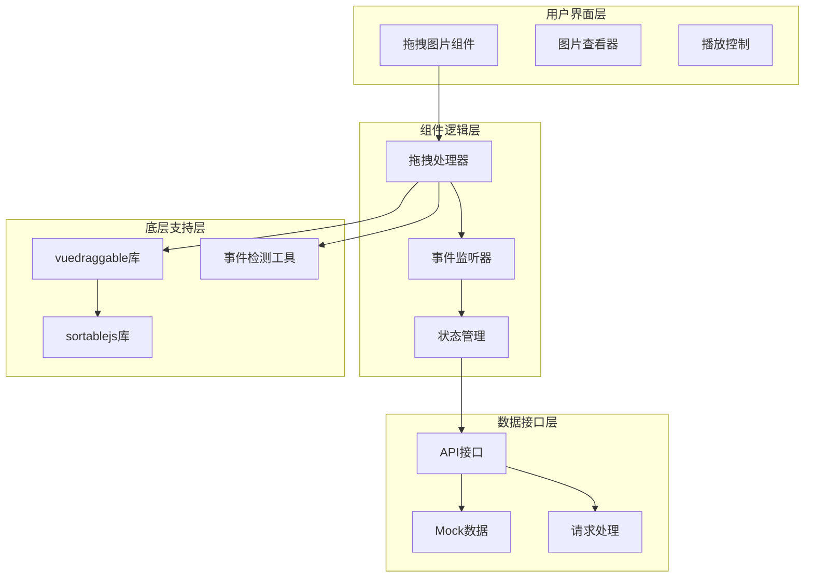

**图表来源**
- [draggable.vue:4-43](file://src/views/futures/draggable.vue#L4-L43)
- [draggable.js:27-32](file://src/api/draggable.js#L27-L32)
- [detect-prefixes.js:8-45](file://src/utils/detect-prefixes.js#L8-L45)

## 详细组件分析

### 拖拽组件实现

拖拽组件的核心实现包含以下关键功能：

#### 拖拽选项配置

```javascript
// 拖拽选项配置
dragOptions: {
  animation: 0,      // 动画持续时间（毫秒）
  ghostClass: 'ghost' // 幽灵类样式
}
```

#### 事件处理机制

组件实现了完整的拖拽事件处理流程：

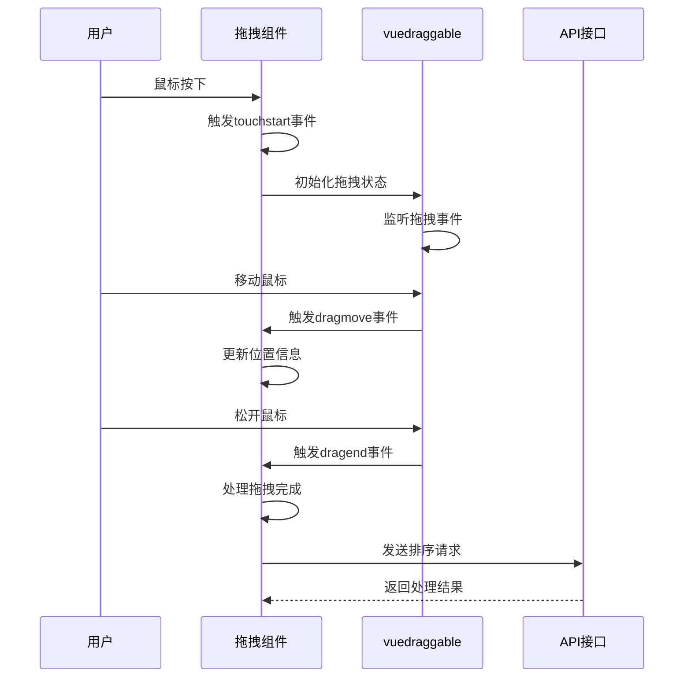

**图表来源**
- [draggable.vue:87-90](file://src/views/futures/draggable.vue#L87-L90)
- [draggable.vue:106-114](file://src/views/futures/draggable.vue#L106-L114)

#### 数据结构定义

拖拽操作涉及的数据结构包括：

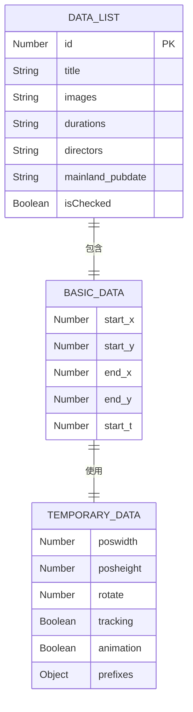

**图表来源**
- [draggable.vue:77-95](file://src/views/futures/draggable.vue#L77-L95)
- [stack.vue:41-55](file://src/components/tantan/stack.vue#L41-L55)

**章节来源**
- [draggable.vue:70-227](file://src/views/futures/draggable.vue#L70-L227)
- [stack.vue:23-362](file://src/components/tantan/stack.vue#L23-L362)

### Mock数据接口

项目提供了完整的Mock数据接口用于开发和测试：

#### Mock数据生成

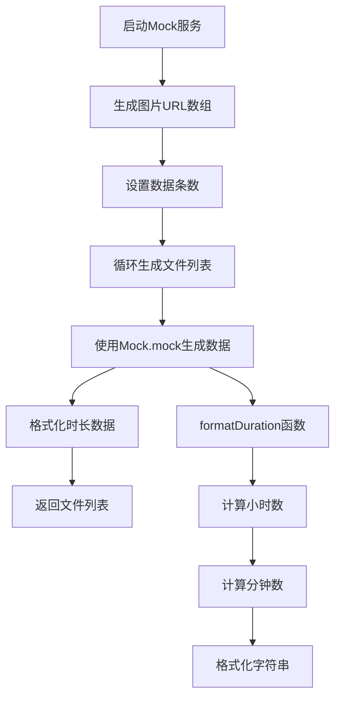

**图表来源**
- [draggable.js:13-32](file://src/mock/draggable.js#L13-L32)
- [draggable.js:27-29](file://src/mock/draggable.js#L27-L29)

#### Mock接口配置

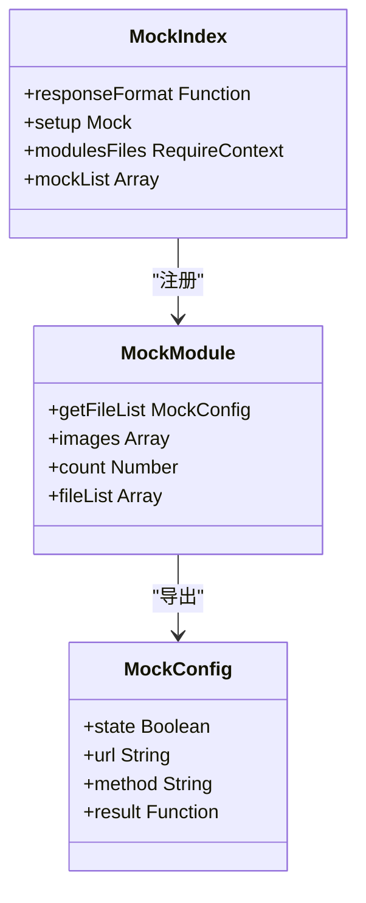

**图表来源**
- [draggable.js:31-40](file://src/mock/modules/draggable.js#L31-L40)
- [draggable.js:20-34](file://src/mock/index.js#L20-L34)

**章节来源**
- [draggable.js:1-41](file://src/mock/modules/draggable.js#L1-L41)
- [draggable.js:1-35](file://src/mock/draggable.js#L1-L35)
- [draggable.js:1-38](file://src/mock/index.js#L1-L38)

### 事件处理系统

拖拽功能实现了跨平台的事件处理机制：

#### 触摸事件处理

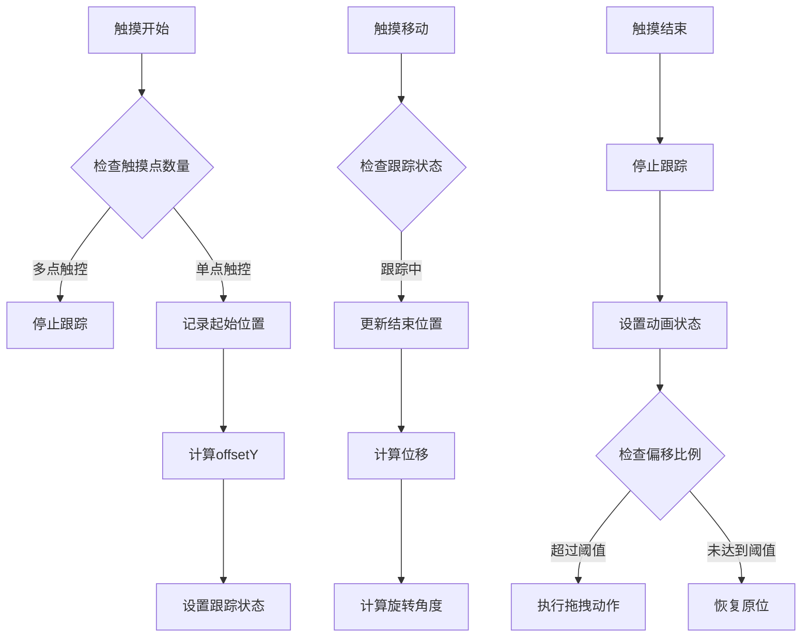

**图表来源**
- [stack.vue:102-158](file://src/components/tantan/stack.vue#L102-L158)
- [stack.vue:128-147](file://src/components/tantan/stack.vue#L128-L147)

#### 兼容性检测

组件使用`detect-prefixes.js`工具进行CSS前缀检测：

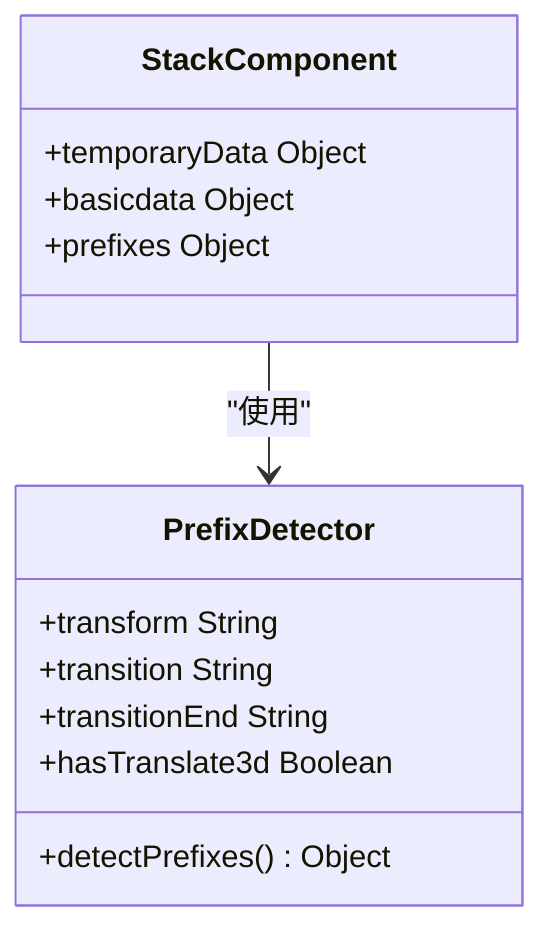

**图表来源**
- [detect-prefixes.js:8-45](file://src/utils/detect-prefixes.js#L8-L45)
- [stack.vue:23-46](file://src/components/tantan/stack.vue#L23-L46)

**章节来源**
- [stack.vue:1-362](file://src/components/tantan/stack.vue#L1-L362)
- [detect-prefixes.js:1-46](file://src/utils/detect-prefixes.js#L1-L46)

## 依赖关系分析

### 第三方库依赖

拖拽功能依赖于多个第三方库：

```mermaid
graph LR
subgraph "核心依赖"
A[vuedraggable@2.24.3]
B[sortablejs@1.10.2]
C[mockjs@1.1.0]
end
subgraph "项目集成"
D[draggable.vue]
E[draggable.js]
F[stack.vue]
end
subgraph "工具类"
G[detect-prefixes.js]
H[request.js]
end
A --> B
D --> A
E --> C
F --> G
D --> H
```

**图表来源**
- [package.json](file://package.json#L60)
- [vuedraggable.js:1-200](file://node_modules/vuedraggable/src/vuedraggable.js#L1-L200)

### 组件间依赖关系

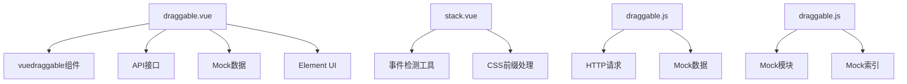

**图表来源**
- [draggable.vue:71-72](file://src/views/futures/draggable.vue#L71-L72)
- [draggable.js](file://src/api/draggable.js#L1)
- [stack.vue](file://src/components/tantan/stack.vue#L23)

**章节来源**
- [package.json:46-64](file://package.json#L46-L64)
- [draggable.vue:70-76](file://src/views/futures/draggable.vue#L70-L76)
- [draggable.js:1-35](file://src/api/draggable.js#L1-L35)

## 性能考虑

### 拖拽性能优化

拖拽功能实现了多项性能优化措施：

#### 防抖和节流机制

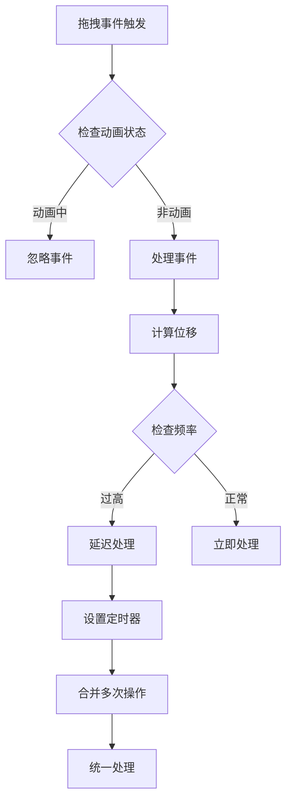

#### 内存管理

组件实现了完善的生命周期管理：

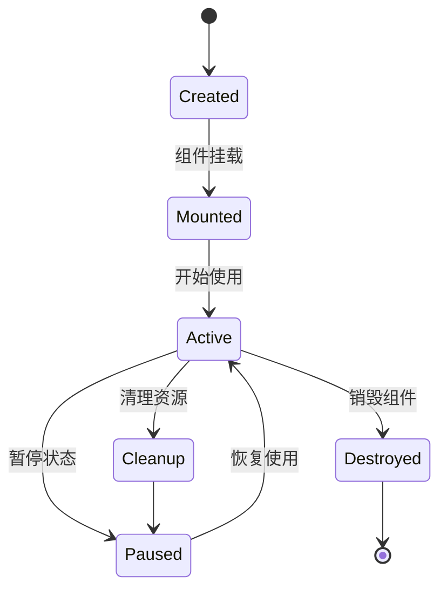

**图表来源**
- [draggable.vue:218-227](file://src/views/futures/draggable.vue#L218-L227)
- [draggable.vue:174-203](file://src/views/futures/draggable.vue#L174-L203)

#### 图片预加载优化

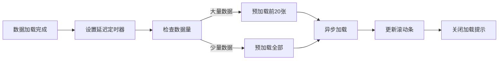

**图表来源**
- [draggable.vue:175-203](file://src/views/futures/draggable.vue#L175-L203)
- [draggable.vue:152-173](file://src/views/futures/draggable.vue#L152-L173)

**章节来源**
- [draggable.vue:174-227](file://src/views/futures/draggable.vue#L174-L227)
- [draggable.vue:152-173](file://src/views/futures/draggable.vue#L152-L173)

## 故障排除指南

### 常见问题及解决方案

#### 拖拽功能异常

**问题描述**: 拖拽功能无法正常使用

**可能原因**:
1. vuedraggable库未正确安装
2. 拖拽选项配置错误
3. 事件监听器冲突

**解决方案**:
1. 检查依赖安装状态
2. 验证拖拽选项配置
3. 检查事件绑定

#### Mock数据不显示

**问题描述**: Mock数据无法正确显示

**可能原因**:
1. Mock服务未启动
2. 接口路径配置错误
3. 数据格式不匹配

**解决方案**:
1. 确认Mock服务状态
2. 检查接口URL配置
3. 验证数据结构

#### 性能问题

**问题描述**: 拖拽操作卡顿

**可能原因**:
1. DOM操作过多
2. 事件处理频繁
3. 图片加载阻塞

**解决方案**:
1. 实施防抖机制
2. 优化DOM操作
3. 实现图片懒加载

**章节来源**
- [draggable.vue:175-203](file://src/views/futures/draggable.vue#L175-L203)
- [draggable.js:31-40](file://src/mock/modules/draggable.js#L31-L40)

## 结论

Vue CMS项目的拖拽功能API提供了完整的拖拽排序解决方案，具有以下特点：

### 技术优势

1. **模块化设计**: 采用分层架构，职责清晰分离
2. **跨平台兼容**: 支持桌面和移动端触摸事件
3. **性能优化**: 实现了多种性能优化策略
4. **开发友好**: 提供完整的Mock数据支持

### 最佳实践建议

1. **事件处理**: 始终在组件销毁时清理事件监听器
2. **内存管理**: 及时清理定时器和缓存数据
3. **错误处理**: 实现完善的异常捕获和处理机制
4. **性能监控**: 定期评估拖拽操作的性能表现

### 扩展建议

1. **状态持久化**: 实现拖拽状态的本地存储
2. **实时同步**: 添加拖拽状态的实时同步机制
3. **冲突解决**: 实现更复杂的拖拽冲突解决策略
4. **用户体验**: 优化拖拽反馈和视觉效果

通过遵循本文档的设计规范和最佳实践，开发者可以有效地集成和扩展拖拽功能，为用户提供流畅的拖拽体验。