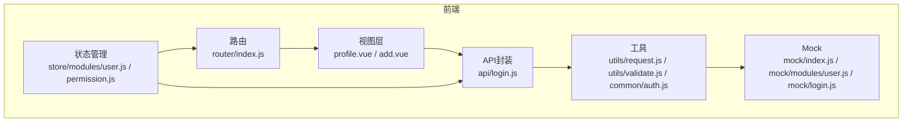
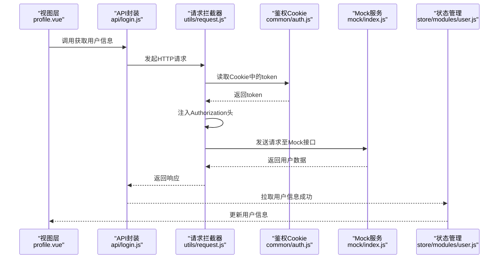
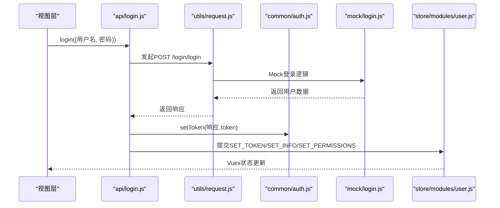
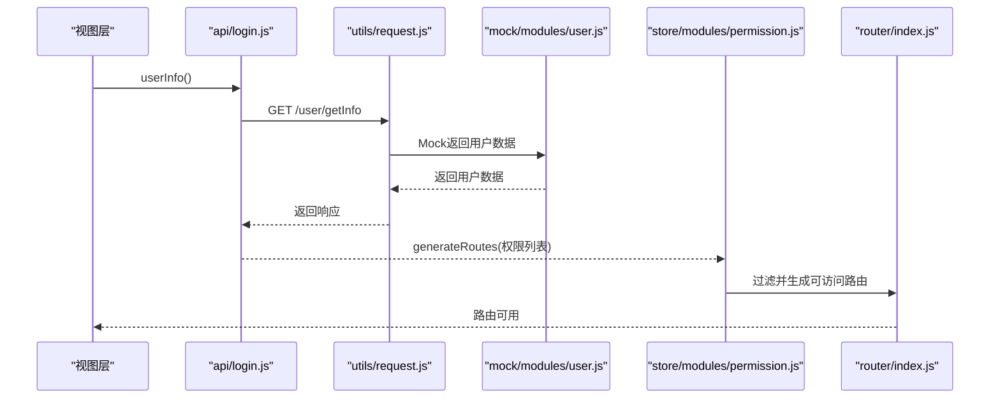
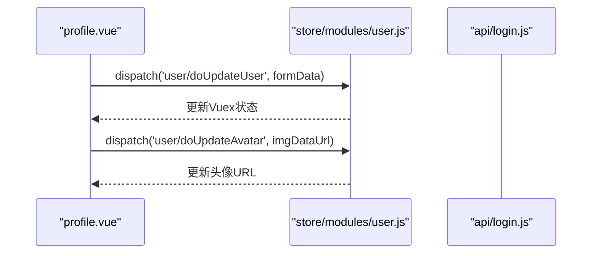
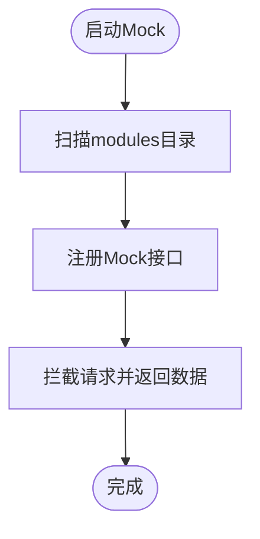
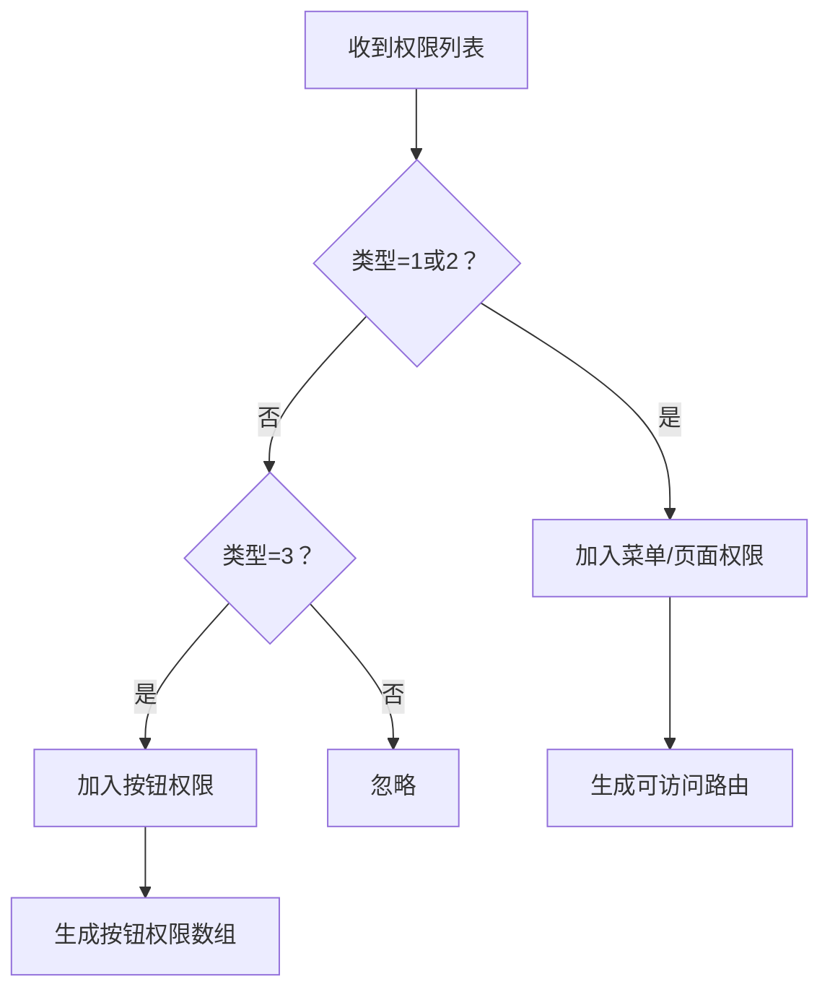
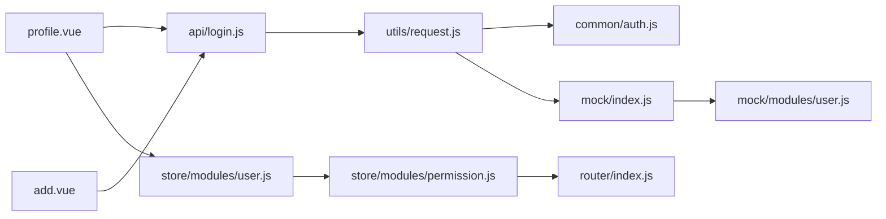

# 用户管理API

<cite>
**本文引用的文件**
- [src/mock/modules/user.js](file://src/mock/modules/user.js)
- [src/api/login.js](file://src/api/login.js)
- [src/common/auth.js](file://src/common/auth.js)
- [src/utils/request.js](file://src/utils/request.js)
- [src/store/modules/user.js](file://src/store/modules/user.js)
- [src/store/modules/permission.js](file://src/store/modules/permission.js)
- [src/router/index.js](file://src/router/index.js)
- [src/views/user/profile.vue](file://src/views/user/profile.vue)
- [src/views/user/add.vue](file://src/views/user/add.vue)
- [src/permission.js](file://src/permission.js)
- [src/mock/index.js](file://src/mock/index.js)
- [src/mock/login.js](file://src/mock/login.js)
- [src/utils/validate.js](file://src/utils/validate.js)
- [src/main.js](file://src/main.js)
- [package.json](file://package.json)
</cite>

## 目录
1. [简介](#简介)
2. [项目结构](#项目结构)
3. [核心组件](#核心组件)
4. [架构总览](#架构总览)
5. [详细组件分析](#详细组件分析)
6. [依赖关系分析](#依赖关系分析)
7. [性能考量](#性能考量)
8. [故障排查指南](#故障排查指南)
9. [结论](#结论)
10. [附录](#附录)

## 简介
本文件面向前端开发者与测试人员，系统化梳理本项目中与“用户管理”相关的API与权限控制机制，覆盖登录、拉取用户信息、登出、权限路由生成、前端权限校验、以及用户资料编辑等能力。文档同时提供Mock用户数据接口的配置方法、开发调试技巧、以及与界面集成的API调用建议与错误处理策略。

## 项目结构
围绕用户管理的关键模块与文件如下：
- Mock层：提供本地开发/联调所需的用户数据与接口模拟
- API层：封装HTTP请求，统一暴露登录、登出、获取用户信息等方法
- 通用工具：鉴权Cookie读写、Axios拦截器、权限类型判断
- 状态管理：用户信息、权限路由、会话清理
- 路由与权限：基于后端返回的权限生成动态路由
- 视图层：用户资料编辑、组织/用户新增等页面

**图表来源**
- [src/views/user/profile.vue](file://src/views/user/profile.vue)
- [src/views/user/add.vue](file://src/views/user/add.vue)
- [src/store/modules/user.js](file://src/store/modules/user.js)
- [src/store/modules/permission.js](file://src/store/modules/permission.js)
- [src/router/index.js](file://src/router/index.js)
- [src/api/login.js](file://src/api/login.js)
- [src/utils/request.js](file://src/utils/request.js)
- [src/utils/validate.js](file://src/utils/validate.js)
- [src/common/auth.js](file://src/common/auth.js)
- [src/mock/index.js](file://src/mock/index.js)
- [src/mock/modules/user.js](file://src/mock/modules/user.js)
- [src/mock/login.js](file://src/mock/login.js)

**章节来源**
- [src/main.js:34](file://src/main.js#L34)
- [src/mock/index.js:20-34](file://src/mock/index.js#L20-L34)
- [src/api/login.js:1-24](file://src/api/login.js#L1-L24)
- [src/utils/request.js:1-139](file://src/utils/request.js#L1-L139)
- [src/common/auth.js:1-18](file://src/common/auth.js#L1-L18)
- [src/store/modules/user.js:1-154](file://src/store/modules/user.js#L1-L154)
- [src/store/modules/permission.js:1-187](file://src/store/modules/permission.js#L1-L187)
- [src/router/index.js:305-320](file://src/router/index.js#L305-L320)
- [src/views/user/profile.vue:1-188](file://src/views/user/profile.vue#L1-L188)
- [src/views/user/add.vue:1-374](file://src/views/user/add.vue#L1-L374)
- [src/permission.js:22-91](file://src/permission.js#L22-L91)

## 核心组件
- Mock用户数据与接口
  - 提供管理员与普通用户两类Mock账户，包含token、用户信息、权限列表
  - 提供“获取用户信息”接口的Mock实现
- API封装
  - 暴露登录、登出、获取用户信息三个常用接口
- 通用鉴权与请求拦截
  - Cookie中读取/写入token，请求头注入Authorization
  - 统一响应处理、错误提示与自动登出流程
- 状态管理
  - 用户登录、拉取用户信息、登出、头像/信息更新
  - 权限路由生成与按钮权限提取
- 路由与权限
  - 基于后端返回的权限地址生成可访问路由
  - 前端路由白名单与全局守卫控制
- 视图层
  - 用户资料编辑页、组织/用户新增页（含表单校验）

**章节来源**
- [src/mock/modules/user.js:9-203](file://src/mock/modules/user.js#L9-L203)
- [src/mock/login.js:1-18](file://src/mock/login.js#L1-L18)
- [src/api/login.js:1-24](file://src/api/login.js#L1-L24)
- [src/common/auth.js:1-18](file://src/common/auth.js#L1-L18)
- [src/utils/request.js:18-52](file://src/utils/request.js#L18-L52)
- [src/store/modules/user.js:52-145](file://src/store/modules/user.js#L52-L145)
- [src/store/modules/permission.js:143-178](file://src/store/modules/permission.js#L143-L178)
- [src/router/index.js:305-320](file://src/router/index.js#L305-L320)
- [src/views/user/profile.vue:104-174](file://src/views/user/profile.vue#L104-L174)
- [src/views/user/add.vue:286-312](file://src/views/user/add.vue#L286-L312)

## 架构总览
下图展示了从视图到后端（Mock）的整体调用链路与鉴权流程：

**图表来源**
- [src/views/user/profile.vue:113-126](file://src/views/user/profile.vue#L113-L126)
- [src/api/login.js:18-23](file://src/api/login.js#L18-L23)
- [src/utils/request.js:18-52](file://src/utils/request.js#L18-L52)
- [src/common/auth.js:5-15](file://src/common/auth.js#L5-L15)
- [src/mock/index.js:27-34](file://src/mock/index.js#L27-L34)
- [src/store/modules/user.js:76-87](file://src/store/modules/user.js#L76-L87)

## 详细组件分析

### 用户登录与会话处理
- 登录接口
  - 方法：POST
  - 路径：/login/login
  - 请求体：包含用户名等登录凭据
  - 响应：包含token、用户信息、权限列表
- 登出接口
  - 方法：POST
  - 路径：/login/logout
  - 响应：字符串“success”
- 会话与鉴权
  - 通过Cookie存储token，请求头注入Authorization: Bearer <token>
  - 登录成功后，将用户信息与权限路由写入sessionStorage，并同步到Vuex
  - 登出时清除token与sessionStorage，重置路由

**图表来源**
- [src/api/login.js:3-9](file://src/api/login.js#L3-L9)
- [src/utils/request.js:22-32](file://src/utils/request.js#L22-L32)
- [src/common/auth.js:9-11](file://src/common/auth.js#L9-L11)
- [src/mock/login.js:4-7](file://src/mock/login.js#L4-L7)
- [src/store/modules/user.js:54-73](file://src/store/modules/user.js#L54-L73)

**章节来源**
- [src/api/login.js:1-24](file://src/api/login.js#L1-L24)
- [src/common/auth.js:1-18](file://src/common/auth.js#L1-L18)
- [src/utils/request.js:18-52](file://src/utils/request.js#L18-L52)
- [src/store/modules/user.js:52-110](file://src/store/modules/user.js#L52-L110)
- [src/mock/login.js:1-18](file://src/mock/login.js#L1-L18)

### 获取用户信息与权限路由
- 获取用户信息接口
  - 方法：GET
  - 路径：/user/getInfo
  - 响应：包含账户、用户信息、权限列表
- 权限路由生成
  - 前端根据后端返回的权限地址生成可访问路由
  - 按权限类型区分菜单/页面/按钮，分别用于路由渲染与按钮显隐
- 全局路由守卫
  - 若已登录且存在权限路由，直接放行
  - 若未登录或权限缺失，重定向至登录页

**图表来源**
- [src/api/login.js:18-23](file://src/api/login.js#L18-L23)
- [src/utils/request.js:66-106](file://src/utils/request.js#L66-L106)
- [src/mock/modules/user.js:194-203](file://src/mock/modules/user.js#L194-L203)
- [src/store/modules/permission.js:147-178](file://src/store/modules/permission.js#L147-L178)
- [src/router/index.js:305-320](file://src/router/index.js#L305-L320)

**章节来源**
- [src/api/login.js:18-23](file://src/api/login.js#L18-L23)
- [src/store/modules/permission.js:143-178](file://src/store/modules/permission.js#L143-L178)
- [src/permission.js:22-91](file://src/permission.js#L22-L91)

### 用户资料编辑与头像更新
- 用户资料编辑
  - 视图层提供表单校验与保存逻辑
  - 保存时调用Vuex action更新用户信息
- 头像更新
  - 使用图片裁剪组件上传头像
  - 调用Vuex action更新头像URL

**图表来源**
- [src/views/user/profile.vue:113-126](file://src/views/user/profile.vue#L113-L126)
- [src/views/user/profile.vue:160-167](file://src/views/user/profile.vue#L160-L167)
- [src/store/modules/user.js:126-133](file://src/store/modules/user.js#L126-L133)
- [src/store/modules/user.js:113-120](file://src/store/modules/user.js#L113-L120)

**章节来源**
- [src/views/user/profile.vue:104-174](file://src/views/user/profile.vue#L104-L174)
- [src/store/modules/user.js:112-133](file://src/store/modules/user.js#L112-L133)

### Mock用户数据与权限配置
- Mock用户数据
  - 管理员与普通用户两类，包含账户、token、用户信息、权限列表
  - 权限列表包含菜单、页面、按钮三类，每项包含类型与地址
- Mock接口注册
  - 自动扫描modules目录，注册各模块的Mock接口
  - 通用响应格式：{ code, message, data }

**图表来源**
- [src/mock/index.js:20-34](file://src/mock/index.js#L20-L34)
- [src/mock/modules/user.js:9-203](file://src/mock/modules/user.js#L9-L203)

**章节来源**
- [src/mock/modules/user.js:9-203](file://src/mock/modules/user.js#L9-L203)
- [src/mock/index.js:1-38](file://src/mock/index.js#L1-L38)

### 权限类型与校验
- 权限类型
  - 1：菜单
  - 2：页面
  - 3：按钮
- 前端校验
  - 根据类型判断是否为菜单/页面或按钮
  - 生成按钮权限数组，用于按钮显隐控制

**图表来源**
- [src/utils/validate.js:25-55](file://src/utils/validate.js#L25-L55)
- [src/store/modules/permission.js:147-178](file://src/store/modules/permission.js#L147-L178)

**章节来源**
- [src/utils/validate.js:1-56](file://src/utils/validate.js#L1-L56)
- [src/store/modules/permission.js:143-178](file://src/store/modules/permission.js#L143-L178)

## 依赖关系分析
- 组件耦合
  - 视图层依赖API封装与状态管理
  - API封装依赖请求拦截器与通用鉴权
  - 状态管理依赖路由与权限模块
- 外部依赖
  - Axios、Element UI、MockJS、js-cookie等

**图表来源**
- [src/views/user/profile.vue](file://src/views/user/profile.vue)
- [src/views/user/add.vue](file://src/views/user/add.vue)
- [src/api/login.js](file://src/api/login.js)
- [src/utils/request.js](file://src/utils/request.js)
- [src/common/auth.js](file://src/common/auth.js)
- [src/store/modules/user.js](file://src/store/modules/user.js)
- [src/store/modules/permission.js](file://src/store/modules/permission.js)
- [src/router/index.js](file://src/router/index.js)
- [src/mock/index.js](file://src/mock/index.js)
- [src/mock/modules/user.js](file://src/mock/modules/user.js)

**章节来源**
- [package.json:33-64](file://package.json#L33-L64)

## 性能考量
- 请求缓存与防抖
  - GET请求在拦截器中追加时间戳参数，避免浏览器缓存导致的旧数据
- 响应处理
  - 统一错误码处理与提示，减少重复错误弹窗
- Mock延迟
  - Mock设置随机响应延时，更贴近真实网络环境

**章节来源**
- [src/utils/request.js:35-43](file://src/utils/request.js#L35-L43)
- [src/mock/index.js:16-18](file://src/mock/index.js#L16-L18)

## 故障排查指南
- 登录后无法进入受保护页面
  - 检查是否有token与权限路由
  - 若session中权限缺失，触发重置token并跳转登录
- 请求报错或超时
  - 查看响应拦截器中的错误提示与超时处理
  - 确认后端接口路径与Mock是否一致
- 权限不生效
  - 确认后端返回的权限地址与前端路由path一致
  - 检查权限类型是否正确（菜单/页面/按钮）

**章节来源**
- [src/permission.js:40-70](file://src/permission.js#L40-L70)
- [src/utils/request.js:108-136](file://src/utils/request.js#L108-L136)
- [src/store/modules/permission.js:147-178](file://src/store/modules/permission.js#L147-L178)

## 结论
本项目通过Mock层、API封装、请求拦截器、状态管理与路由权限模块，构建了完整的用户管理与权限控制闭环。登录、获取用户信息、登出、权限路由生成与前端权限校验均已在视图层得到体现。开发调试时可直接使用Mock用户数据，快速验证界面与权限逻辑。

## 附录

### API一览（方法、路径、请求参数、响应格式）
- 登录
  - 方法：POST
  - 路径：/login/login
  - 请求体：用户名等登录凭据
  - 响应：包含token、用户信息、权限列表
- 登出
  - 方法：POST
  - 路径：/login/logout
  - 请求体：无
  - 响应：字符串“success”
- 获取用户信息
  - 方法：GET
  - 路径：/user/getInfo
  - 请求体：无
  - 响应：包含账户、用户信息、权限列表

**章节来源**
- [src/api/login.js:3-23](file://src/api/login.js#L3-L23)
- [src/mock/modules/user.js:194-203](file://src/mock/modules/user.js#L194-L203)

### 权限类型与用途
- 类型1：菜单
- 类型2：页面
- 类型3：按钮

**章节来源**
- [src/utils/validate.js:25-55](file://src/utils/validate.js#L25-L55)

### Mock用户数据配置
- 用户列表与权限
  - 管理员与普通用户两类，包含账户、token、用户信息、权限列表
- 接口注册
  - 自动扫描modules目录并注册Mock接口

**章节来源**
- [src/mock/modules/user.js:9-203](file://src/mock/modules/user.js#L9-L203)
- [src/mock/index.js:20-34](file://src/mock/index.js#L20-L34)

### 开发调试技巧
- 启用Mock
  - 应用入口已默认引入Mock，无需额外配置
- 切换用户
  - 修改请求头中的Authorization或Cookie中的token键值，以切换不同用户
- 路由与权限
  - 登录后，权限路由将写入sessionStorage并注入到路由表

**章节来源**
- [src/main.js:34](file://src/main.js#L34)
- [src/common/auth.js:3-15](file://src/common/auth.js#L3-L15)
- [src/store/modules/user.js:60-67](file://src/store/modules/user.js#L60-L67)

### 与界面集成指南
- 用户资料编辑
  - 使用表单校验与Vuex action更新用户信息
  - 头像更新使用裁剪组件并调用相应action
- 组织/用户新增
  - 页面包含省市区联动与表单校验，保存逻辑预留

**章节来源**
- [src/views/user/profile.vue:104-174](file://src/views/user/profile.vue#L104-L174)
- [src/views/user/add.vue:286-312](file://src/views/user/add.vue#L286-L312)