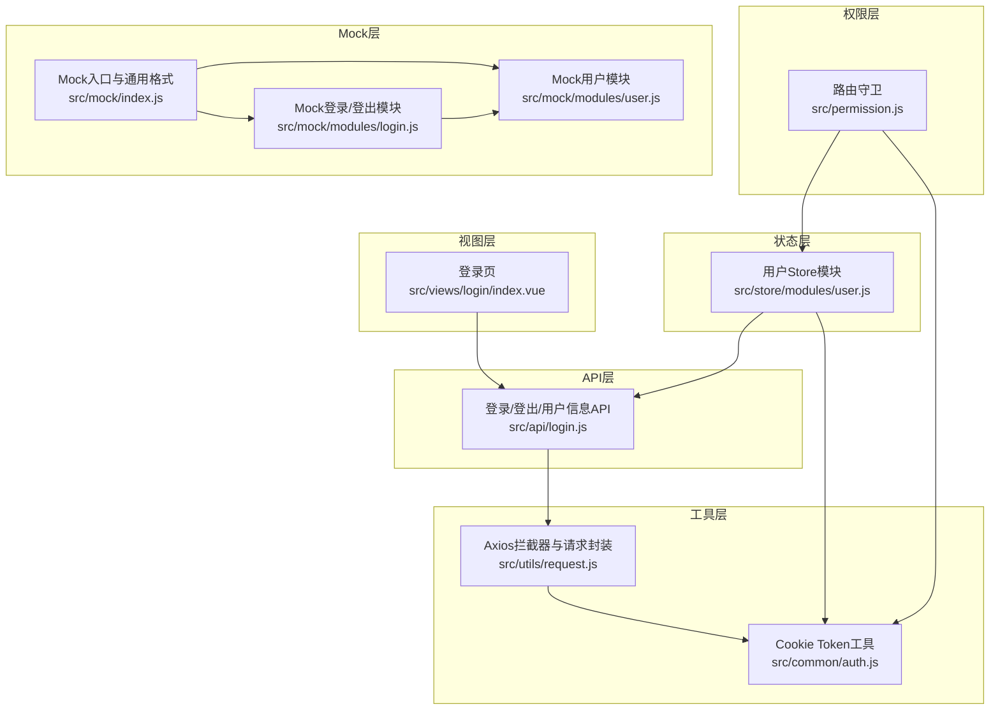
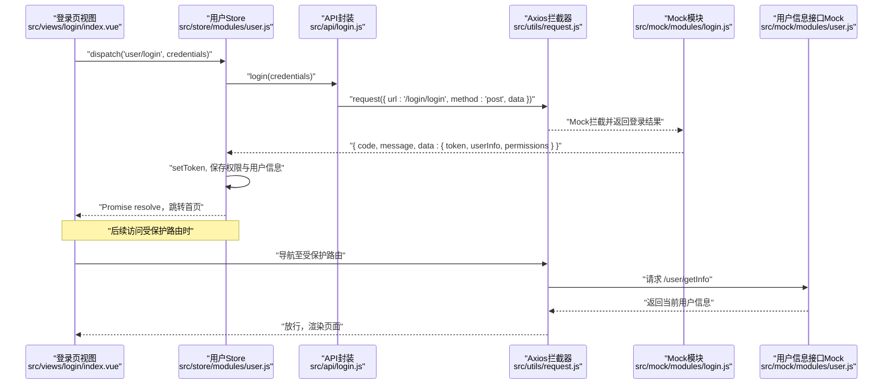
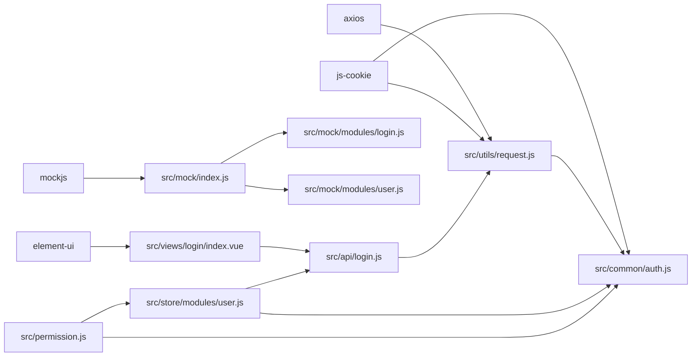

# 用户认证API

<cite>
**本文引用的文件**
- [src/api/login.js](file://src/api/login.js)
- [src/common/auth.js](file://src/common/auth.js)
- [src/store/modules/user.js](file://src/store/modules/user.js)
- [src/utils/request.js](file://src/utils/request.js)
- [src/views/login/index.vue](file://src/views/login/index.vue)
- [src/permission.js](file://src/permission.js)
- [src/mock/modules/login.js](file://src/mock/modules/login.js)
- [src/mock/modules/user.js](file://src/mock/modules/user.js)
- [src/mock/index.js](file://src/mock/index.js)
- [src/main.js](file://src/main.js)
- [package.json](file://package.json)
</cite>

## 目录
1. [简介](#简介)
2. [项目结构](#项目结构)
3. [核心组件](#核心组件)
4. [架构总览](#架构总览)
5. [详细组件分析](#详细组件分析)
6. [依赖关系分析](#依赖关系分析)
7. [性能考量](#性能考量)
8. [故障排查指南](#故障排查指南)
9. [结论](#结论)
10. [附录](#附录)

## 简介
本文件面向前端与后端开发者，系统化梳理本项目的用户认证相关API与实现机制，覆盖登录、登出、用户信息获取等接口的HTTP方法、URL路径、请求参数与响应格式；解释基于Cookie的Token管理、权限验证与路由守卫流程；提供Mock登录接口的使用方法与开发调试技巧；并给出前后端联调时的请求/响应示例与错误处理建议。

## 项目结构
围绕认证的关键文件分布如下：
- API层：封装登录、登出、用户信息获取的HTTP调用
- 状态层：Vuex模块负责登录态、用户信息与权限的持久化
- 工具层：Axios拦截器统一注入Authorization头、错误处理与重登录逻辑
- 视图层：登录页收集凭据并触发登录动作
- 权限层：路由守卫在进入受保护路由前校验Token与动态路由
- Mock层：本地模拟登录、登出与用户信息接口，便于开发调试

图表来源
- [src/views/login/index.vue:1-261](file://src/views/login/index.vue#L1-L261)
- [src/api/login.js:1-24](file://src/api/login.js#L1-L24)
- [src/store/modules/user.js:1-154](file://src/store/modules/user.js#L1-L154)
- [src/utils/request.js:1-139](file://src/utils/request.js#L1-L139)
- [src/common/auth.js:1-18](file://src/common/auth.js#L1-L18)
- [src/permission.js:1-98](file://src/permission.js#L1-L98)
- [src/mock/index.js:1-38](file://src/mock/index.js#L1-L38)
- [src/mock/modules/login.js:1-25](file://src/mock/modules/login.js#L1-L25)
- [src/mock/modules/user.js:1-204](file://src/mock/modules/user.js#L1-L204)

章节来源
- [src/api/login.js:1-24](file://src/api/login.js#L1-L24)
- [src/store/modules/user.js:1-154](file://src/store/modules/user.js#L1-L154)
- [src/utils/request.js:1-139](file://src/utils/request.js#L1-L139)
- [src/common/auth.js:1-18](file://src/common/auth.js#L1-L18)
- [src/permission.js:1-98](file://src/permission.js#L1-L98)
- [src/mock/index.js:1-38](file://src/mock/index.js#L1-L38)
- [src/mock/modules/login.js:1-25](file://src/mock/modules/login.js#L1-L25)
- [src/mock/modules/user.js:1-204](file://src/mock/modules/user.js#L1-L204)
- [src/views/login/index.vue:1-261](file://src/views/login/index.vue#L1-L261)
- [src/main.js:1-53](file://src/main.js#L1-L53)

## 核心组件
- 认证API封装
  - 登录：POST /login/login，请求体包含用户名与密码
  - 登出：POST /login/logout，无需请求体
  - 用户信息：GET /user/getInfo，通过Authorization头携带Token
- Token管理
  - 使用Cookie存储Token，键名来自环境变量
  - 请求拦截器自动在Authorization头中附加Bearer Token
- 状态与权限
  - Vuex模块保存token、用户信息与权限列表
  - 路由守卫在进入受保护路由前校验Token与动态路由
- Mock接口
  - 开发环境下通过Mock模块提供登录、登出与用户信息接口
  - 支持多用户与细粒度权限配置

章节来源
- [src/api/login.js:1-24](file://src/api/login.js#L1-L24)
- [src/common/auth.js:1-18](file://src/common/auth.js#L1-L18)
- [src/store/modules/user.js:1-154](file://src/store/modules/user.js#L1-L154)
- [src/utils/request.js:1-139](file://src/utils/request.js#L1-L139)
- [src/permission.js:1-98](file://src/permission.js#L1-L98)
- [src/mock/modules/login.js:1-25](file://src/mock/modules/login.js#L1-L25)
- [src/mock/modules/user.js:1-204](file://src/mock/modules/user.js#L1-L204)

## 架构总览
下图展示从前端发起认证请求到路由守卫校验的完整链路，以及Mock模式下的替代路径。

图表来源
- [src/views/login/index.vue:118-153](file://src/views/login/index.vue#L118-L153)
- [src/store/modules/user.js:54-74](file://src/store/modules/user.js#L54-L74)
- [src/api/login.js:3-9](file://src/api/login.js#L3-L9)
- [src/utils/request.js:18-52](file://src/utils/request.js#L18-L52)
- [src/mock/modules/login.js:10-14](file://src/mock/modules/login.js#L10-L14)
- [src/mock/modules/user.js:195-202](file://src/mock/modules/user.js#L195-L202)

## 详细组件分析

### 登录接口
- HTTP方法与路径
  - POST /login/login
- 请求参数
  - username: 字符串，必填
  - pwd: 字符串，必填
- 响应格式
  - code: 数字或字符串，业务状态码
  - message: 字符串，提示信息
  - data: 对象，包含
    - token: 字符串，用于后续请求鉴权
    - account: 字符串，当前账号
    - userInfo: 对象，包含name、age、sex、avatar、type、desc等
    - permissions: 数组，包含菜单/页面/按钮级权限项
- 成功场景
  - 返回code为200且包含token与用户信息
- 失败场景
  - 返回非200状态码，前端弹窗提示并根据code决定是否触发重新登录流程
- 前端调用要点
  - 登录页收集username与pwd，调用store的login action
  - 成功后保存token与权限，跳转首页
  - 失败时由拦截器统一提示

章节来源
- [src/api/login.js:3-9](file://src/api/login.js#L3-L9)
- [src/store/modules/user.js:54-74](file://src/store/modules/user.js#L54-L74)
- [src/utils/request.js:66-106](file://src/utils/request.js#L66-L106)
- [src/mock/modules/login.js:10-14](file://src/mock/modules/login.js#L10-L14)

### 登出接口
- HTTP方法与路径
  - POST /login/logout
- 请求参数
  - 无
- 响应格式
  - code: 数字或字符串，业务状态码
  - message: 字符串，提示信息
  - data: 任意（通常为空）
- 行为说明
  - 清除本地token与用户相关状态
  - 清空sessionStorage中的本次登录一次性数据
  - 重置路由并刷新页面

章节来源
- [src/api/login.js:11-16](file://src/api/login.js#L11-L16)
- [src/store/modules/user.js:91-110](file://src/store/modules/user.js#L91-L110)
- [src/mock/modules/login.js:16-23](file://src/mock/modules/login.js#L16-L23)

### 用户信息接口
- HTTP方法与路径
  - GET /user/getInfo
- 请求参数
  - 无（通过Authorization头携带Token）
- 响应格式
  - code: 数字或字符串，业务状态码
  - message: 字符串，提示信息
  - data: 对象，包含当前用户信息
- 行为说明
  - 仅在存在有效Token时可成功获取
  - 用于初始化页面与权限控制

章节来源
- [src/api/login.js:18-23](file://src/api/login.js#L18-L23)
- [src/utils/request.js:24-32](file://src/utils/request.js#L24-L32)
- [src/mock/modules/user.js:195-202](file://src/mock/modules/user.js#L195-L202)

### Token管理与请求拦截
- Token来源
  - 从Cookie读取，键名来自环境变量
- 请求头注入
  - 若存在token，则在Authorization头中附加Bearer token
  - 同时设置Accept-Language与Cache-Control
- 响应处理
  - 非200或特定业务码触发错误提示与重登录流程
  - 特殊业务码B0001用于提示性消息
- 超时与网络错误
  - 统一提示并拒绝Promise

章节来源
- [src/common/auth.js:1-18](file://src/common/auth.js#L1-L18)
- [src/utils/request.js:18-52](file://src/utils/request.js#L18-L52)
- [src/utils/request.js:54-136](file://src/utils/request.js#L54-L136)

### 路由守卫与权限验证
- 白名单
  - /login、/auth-redirect、/singleLogion、/files
- 核心逻辑
  - 有Token：放行；若访问/login则重定向至首页
  - 无Token：清空session并重定向至登录页
  - 动态路由：首次进入时检查session中的权限并生成路由
- 异常处理
  - 动态路由生成失败或权限缺失时，重置token并提示错误

章节来源
- [src/permission.js:23-90](file://src/permission.js#L23-L90)

### Mock登录接口与开发调试
- Mock入口
  - 自动扫描modules目录并注册Mock规则
- 登录Mock
  - 根据传入username返回对应用户信息
- 用户信息Mock
  - 根据当前已登录用户返回其信息
- 使用建议
  - 开发阶段无需后端，直接使用Mock即可联调
  - 可通过修改userMap扩展更多用户与权限

章节来源
- [src/mock/index.js:20-34](file://src/mock/index.js#L20-L34)
- [src/mock/modules/login.js:10-14](file://src/mock/modules/login.js#L10-L14)
- [src/mock/modules/user.js:195-202](file://src/mock/modules/user.js#L195-L202)

## 依赖关系分析
- 前端依赖
  - axios：HTTP客户端
  - js-cookie：Cookie读写
  - element-ui：UI与消息提示
  - mockjs：本地Mock
- 关键耦合点
  - API层依赖请求封装与Cookie工具
  - Store依赖API与Cookie工具
  - 权限守卫依赖Store与Cookie工具
  - Mock依赖Cookie工具与通用响应格式

图表来源
- [package.json:33-63](file://package.json#L33-L63)
- [src/utils/request.js:1-139](file://src/utils/request.js#L1-L139)
- [src/common/auth.js:1-18](file://src/common/auth.js#L1-L18)
- [src/views/login/index.vue:1-261](file://src/views/login/index.vue#L1-L261)
- [src/api/login.js:1-24](file://src/api/login.js#L1-L24)
- [src/store/modules/user.js:1-154](file://src/store/modules/user.js#L1-L154)
- [src/permission.js:1-98](file://src/permission.js#L1-L98)
- [src/mock/index.js:1-38](file://src/mock/index.js#L1-L38)
- [src/mock/modules/login.js:1-25](file://src/mock/modules/login.js#L1-L25)
- [src/mock/modules/user.js:1-204](file://src/mock/modules/user.js#L1-L204)

## 性能考量
- 请求缓存
  - GET请求在拦截器中追加时间戳参数以避免浏览器缓存
- 超时与并发
  - 统一超时时间，避免长时间阻塞
- 体积与加载
  - Mock在开发环境启用，生产环境可通过注释入口禁用
- 本地存储
  - Token与用户信息使用Cookie与SessionStorage分离存储，降低内存压力

## 故障排查指南
- 登录失败
  - 检查用户名/密码是否符合前端校验规则
  - 查看拦截器返回的业务码与message
  - 若出现特定业务码，确认是否需要重新登录
- Token无效或过期
  - 拦截器会弹窗提示并触发重置token流程
  - 检查Cookie中是否存在正确键名与值
- 无法访问受保护路由
  - 确认是否有Token
  - 检查session中是否保存了动态路由权限
  - 若缺失，将被重定向至登录页
- Mock未生效
  - 确认Mock入口已被加载
  - 检查Mock模块的state与url正则匹配

章节来源
- [src/utils/request.js:84-95](file://src/utils/request.js#L84-L95)
- [src/common/auth.js:1-18](file://src/common/auth.js#L1-L18)
- [src/permission.js:40-70](file://src/permission.js#L40-L70)
- [src/main.js:34-34](file://src/main.js#L34-L34)

## 结论
本项目采用Cookie + Bearer Token的方式进行认证，结合Axios拦截器统一注入与错误处理、Vuex模块持久化状态、路由守卫进行权限控制，并通过Mock模块提供便捷的本地联调体验。整体设计清晰、职责分离明确，适合快速迭代与扩展。

## 附录

### 请求与响应示例（按场景）
- 成功登录
  - 请求
    - 方法：POST
    - 路径：/login/login
    - 请求体：{ username, pwd }
  - 响应
    - 状态码：200
    - 示例字段：{ code, message, data:{ token, account, userInfo, permissions } }
- 权限不足
  - 响应
    - 状态码：非200
    - 示例字段：{ code, message }
    - 行为：弹窗提示并可能触发重新登录
- 账户锁定/Token失效
  - 响应
    - 状态码：特定业务码
    - 行为：弹窗提示并触发重置token流程
- 获取用户信息
  - 请求
    - 方法：GET
    - 路径：/user/getInfo
    - 头部：Authorization: Bearer <token>
  - 响应
    - 状态码：200
    - 示例字段：{ code, message, data:{ account, userInfo, permissions } }

章节来源
- [src/api/login.js:3-23](file://src/api/login.js#L3-L23)
- [src/utils/request.js:66-106](file://src/utils/request.js#L66-L106)
- [src/mock/modules/login.js:10-14](file://src/mock/modules/login.js#L10-L14)
- [src/mock/modules/user.js:195-202](file://src/mock/modules/user.js#L195-L202)

### 前端调用与错误处理建议
- 登录
  - 视图层收集凭据并调用store的login action
  - 成功后保存token与权限，跳转首页
  - 失败时由拦截器统一提示
- 登出
  - 调用logout action，清理状态与存储
- 用户信息
  - 首次进入受保护路由时拉取用户信息
- Mock调试
  - 确保Mock入口加载
  - 使用内置账号admin/lucy进行测试

章节来源
- [src/views/login/index.vue:118-153](file://src/views/login/index.vue#L118-L153)
- [src/store/modules/user.js:54-110](file://src/store/modules/user.js#L54-L110)
- [src/main.js:34-34](file://src/main.js#L34-L34)