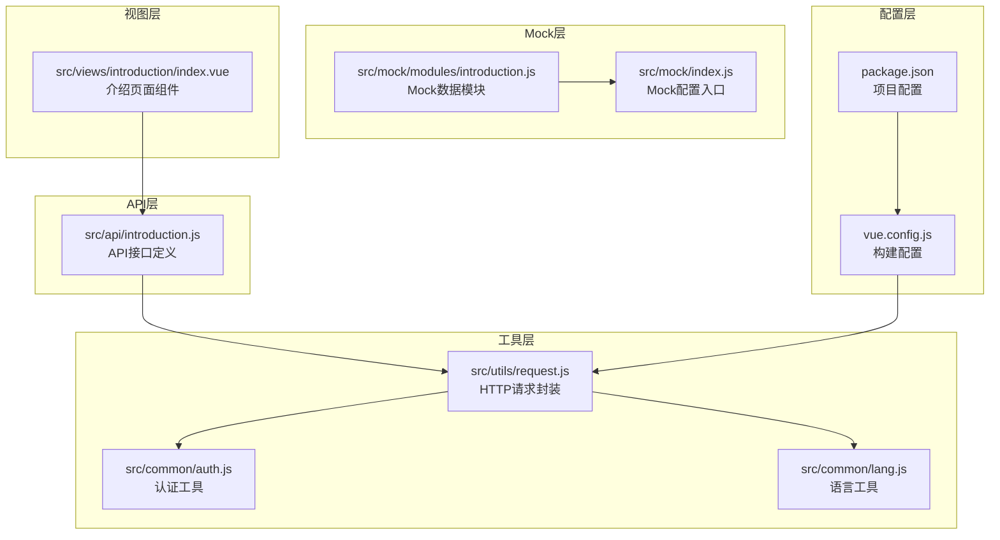
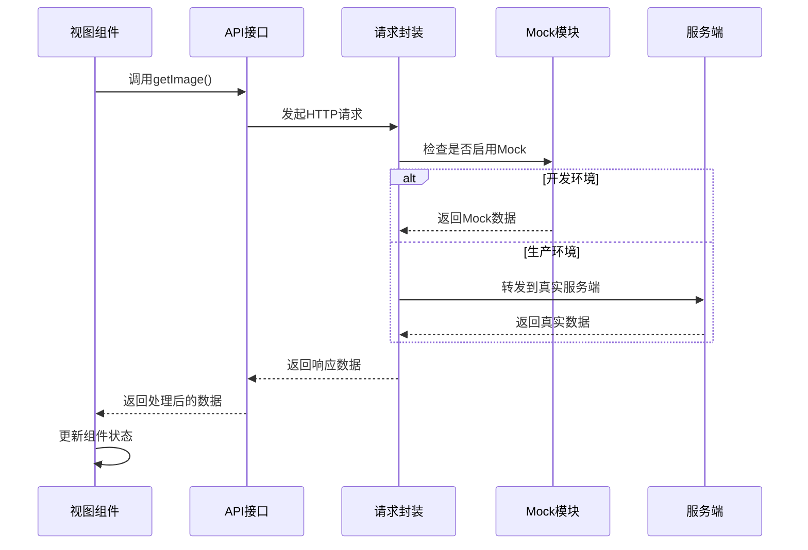
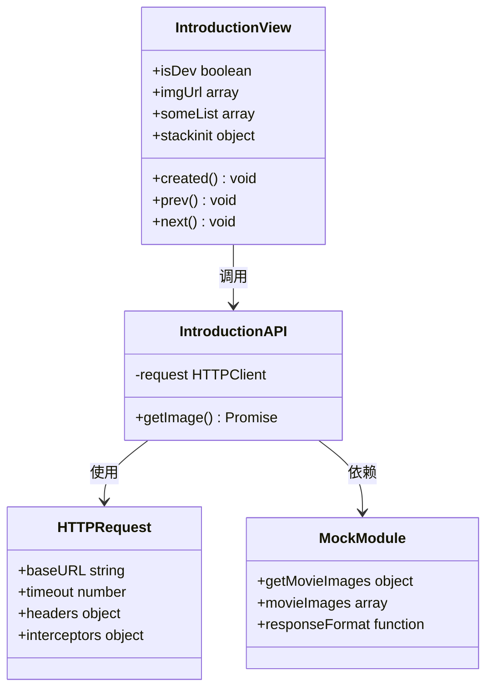
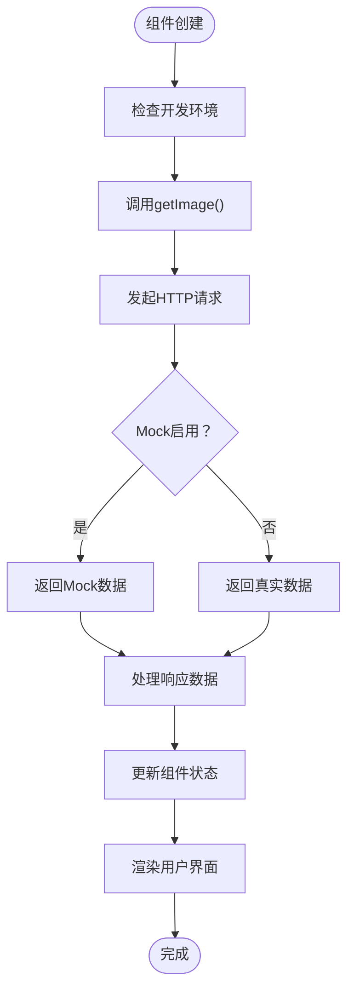
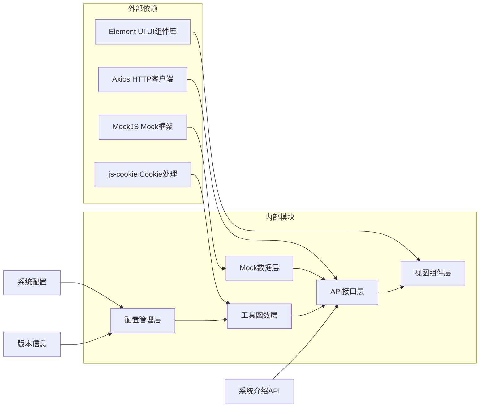

# 系统介绍API

<cite>
**本文档引用的文件**
- [src/api/introduction.js](file://src/api/introduction.js)
- [src/mock/modules/introduction.js](file://src/mock/modules/introduction.js)
- [src/views/introduction/index.vue](file://src/views/introduction/index.vue)
- [src/utils/request.js](file://src/utils/request.js)
- [src/mock/index.js](file://src/mock/index.js)
- [src/common/auth.js](file://src/common/auth.js)
- [src/common/lang.js](file://src/common/lang.js)
- [src/language/zh.js](file://src/language/zh.js)
- [src/language/en.js](file://src/language/en.js)
- [vue.config.js](file://vue.config.js)
- [package.json](file://package.json)
- [src/main.js](file://src/main.js)
</cite>

## 目录
1. [简介](#简介)
2. [项目结构](#项目结构)
3. [核心组件](#核心组件)
4. [架构概览](#架构概览)
5. [详细组件分析](#详细组件分析)
6. [依赖关系分析](#依赖关系分析)
7. [性能考虑](#性能考虑)
8. [故障排除指南](#故障排除指南)
9. [结论](#结论)

## 简介

系统介绍API是Vue-CMS项目中的一个专门用于提供系统介绍和演示数据的接口模块。该模块主要负责：
- 提供电影图片展示功能的演示数据
- 展示系统配置、版本信息等静态数据
- 演示Mock数据接口的配置和使用方法
- 展示前端组件与API的数据交互流程

该项目基于Vue 2.7.16和Element UI 2.15.14构建，采用模块化的架构设计，支持国际化和Mock数据模拟。

## 项目结构

系统介绍API相关的文件组织结构如下：



**图表来源**
- [src/api/introduction.js:1-13](file://src/api/introduction.js#L1-L13)
- [src/views/introduction/index.vue:1-181](file://src/views/introduction/index.vue#L1-L181)
- [src/mock/modules/introduction.js:1-53](file://src/mock/modules/introduction.js#L1-L53)

**章节来源**
- [src/api/introduction.js:1-13](file://src/api/introduction.js#L1-L13)
- [src/views/introduction/index.vue:1-181](file://src/views/introduction/index.vue#L1-L181)
- [src/mock/modules/introduction.js:1-53](file://src/mock/modules/introduction.js#L1-L53)

## 核心组件

### API接口定义

系统介绍API的核心接口定义位于`src/api/introduction.js`文件中，目前包含一个主要接口：

**接口名称**: 获取电影图片列表
**HTTP方法**: GET
**URL路径**: `/introduction/getMovieImages`
**请求参数**: 无
**响应格式**: 
```javascript
{
  code: 200,
  message: "success",
  data: {
    subjects: [
      {
        images: {
          large: "https://picsum.photos/seed/movie1/320/420.jpg"
        }
      }
    ]
  }
}
```

### Mock数据模块

Mock数据模块位于`src/mock/modules/introduction.js`，提供了完整的演示数据结构：

**数据结构**:
- `subjects`: 图片列表数组
- `images`: 图片对象
- `large`: 大图URL地址

**数据源**: 使用Picsum.photos占位图片服务，支持种子参数确保图片一致性。

**章节来源**
- [src/api/introduction.js:7-12](file://src/api/introduction.js#L7-L12)
- [src/mock/modules/introduction.js:8-39](file://src/mock/modules/introduction.js#L8-L39)

## 架构概览

系统介绍API采用分层架构设计，各层职责明确：



**图表来源**
- [src/views/introduction/index.vue:62-80](file://src/views/introduction/index.vue#L62-L80)
- [src/api/introduction.js:7-12](file://src/api/introduction.js#L7-L12)
- [src/utils/request.js:18-52](file://src/utils/request.js#L18-L52)

## 详细组件分析

### API接口组件分析

#### 类关系图



**图表来源**
- [src/api/introduction.js:1-13](file://src/api/introduction.js#L1-L13)
- [src/utils/request.js:8-15](file://src/utils/request.js#L8-L15)
- [src/mock/modules/introduction.js:41-52](file://src/mock/modules/introduction.js#L41-L52)
- [src/views/introduction/index.vue:36-84](file://src/views/introduction/index.vue#L36-L84)

#### 接口调用流程



**图表来源**
- [src/views/introduction/index.vue:62-80](file://src/views/introduction/index.vue#L62-L80)
- [src/api/introduction.js:7-12](file://src/api/introduction.js#L7-L12)

**章节来源**
- [src/api/introduction.js:1-13](file://src/api/introduction.js#L1-L13)
- [src/views/introduction/index.vue:36-84](file://src/views/introduction/index.vue#L36-L84)

### Mock数据配置分析

#### Mock模块配置

Mock模块采用模块化设计，支持动态加载和配置：

**配置参数**:
- `state`: 模块启用状态
- `url`: API路径模式
- `method`: HTTP方法
- `result`: 响应数据生成函数

**响应格式规范**:
```javascript
{
  code: 200,           // 状态码
  message: "success",  // 状态消息
  data: {}             // 实际数据
}
```

**章节来源**
- [src/mock/modules/introduction.js:41-52](file://src/mock/modules/introduction.js#L41-L52)
- [src/mock/index.js:7-14](file://src/mock/index.js#L7-L14)

### 视图组件分析

#### 组件状态管理

视图组件采用Vue响应式数据管理：

**数据属性**:
- `isDev`: 开发环境标识
- `imgUrl`: 图片URL数组
- `someList`: 渲染列表数据
- `stackinit`: 卡片堆叠初始化配置

**组件方法**:
- `prev()`: 上一张图片
- `next()`: 下一张图片
- `created()`: 组件创建时的初始化逻辑

**章节来源**
- [src/views/introduction/index.vue:44-84](file://src/views/introduction/index.vue#L44-L84)

## 依赖关系分析

系统介绍API的依赖关系呈现清晰的层次结构：



**图表来源**
- [src/utils/request.js:1-139](file://src/utils/request.js#L1-L139)
- [src/mock/index.js:5-38](file://src/mock/index.js#L5-L38)
- [package.json:33-64](file://package.json#L33-L64)

**章节来源**
- [src/utils/request.js:1-139](file://src/utils/request.js#L1-L139)
- [src/mock/index.js:1-38](file://src/mock/index.js#L1-L38)
- [package.json:1-99](file://package.json#L1-L99)

## 性能考虑

### 缓存策略

系统实现了智能的缓存控制机制：

**请求级缓存**:
- 对GET请求自动添加时间戳参数
- 防止浏览器缓存导致的数据陈旧
- 支持可配置的缓存控制头

**响应处理优化**:
- 统一的响应拦截器处理
- 错误状态码的统一处理
- 超时和网络错误的优雅降级

### Mock数据性能

**Mock数据优势**:
- 本地数据读取，无网络延迟
- 支持随机响应时间模拟
- 可配置的延迟范围(300-600ms)

**章节来源**
- [src/utils/request.js:34-43](file://src/utils/request.js#L34-L43)
- [src/mock/index.js:16-18](file://src/mock/index.js#L16-L18)

## 故障排除指南

### 常见问题及解决方案

**1. Mock数据不生效**
- 检查Mock模块的state状态
- 确认Mock模块已正确注册
- 验证URL路径匹配规则

**2. 图片加载失败**
- 检查Picsum.photos服务可用性
- 验证图片URL格式正确性
- 确认跨域设置允许

**3. 开发环境配置**
- 确认VUE_APP_BASE_API环境变量设置
- 检查代理配置是否正确
- 验证Mock数据模块导入

**4. 版本兼容性**
- Vue 2.7.16与Element UI 2.15.14的兼容性
- Axios 0.21.1的API变更
- MockJS 1.1.0的特性支持

**章节来源**
- [src/mock/modules/introduction.js:42-44](file://src/mock/modules/introduction.js#L42-L44)
- [src/utils/request.js:54-136](file://src/utils/request.js#L54-L136)
- [vue.config.js:29-50](file://vue.config.js#L29-L50)

## 结论

系统介绍API模块展现了现代前端应用的最佳实践：

**架构优势**:
- 清晰的分层设计，职责分离明确
- 模块化Mock数据，便于开发调试
- 统一的错误处理和响应格式
- 支持国际化和多语言

**技术特色**:
- 基于Vue 2.x的成熟生态
- Element UI提供的丰富组件
- Axios封装的HTTP请求处理
- MockJS的灵活数据模拟

**扩展建议**:
- 可以增加更多的系统配置接口
- 支持动态功能开关的配置管理
- 添加更详细的版本信息接口
- 实现更完善的Mock数据管理

该模块为前端开发者提供了完整的系统介绍数据展示方案，既适合开发调试，也具备生产环境的稳定性保障。