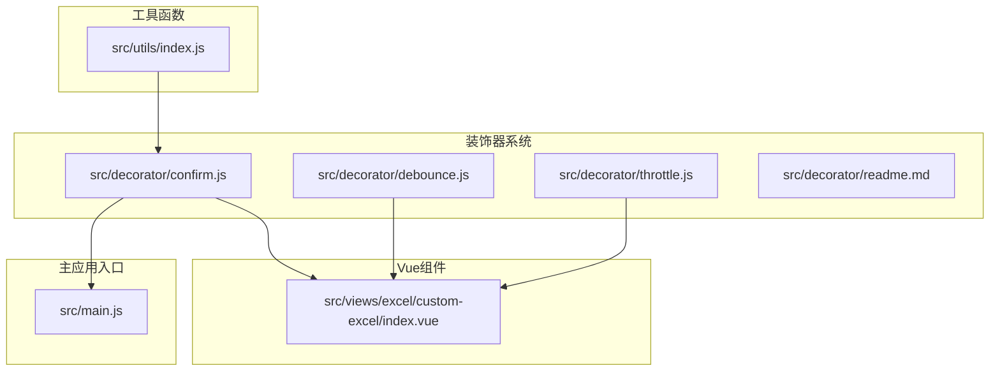
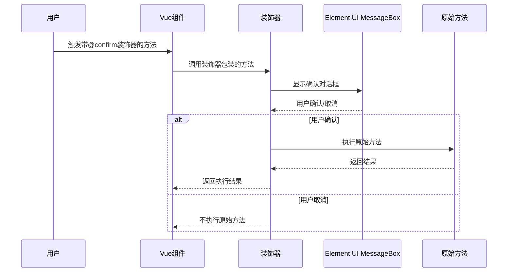
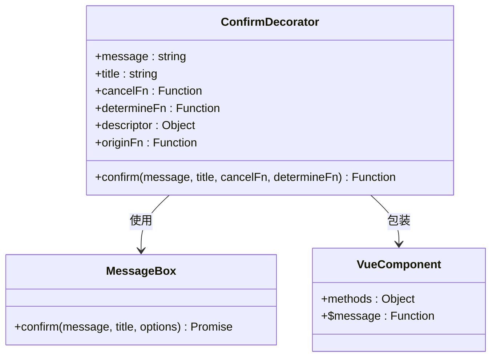
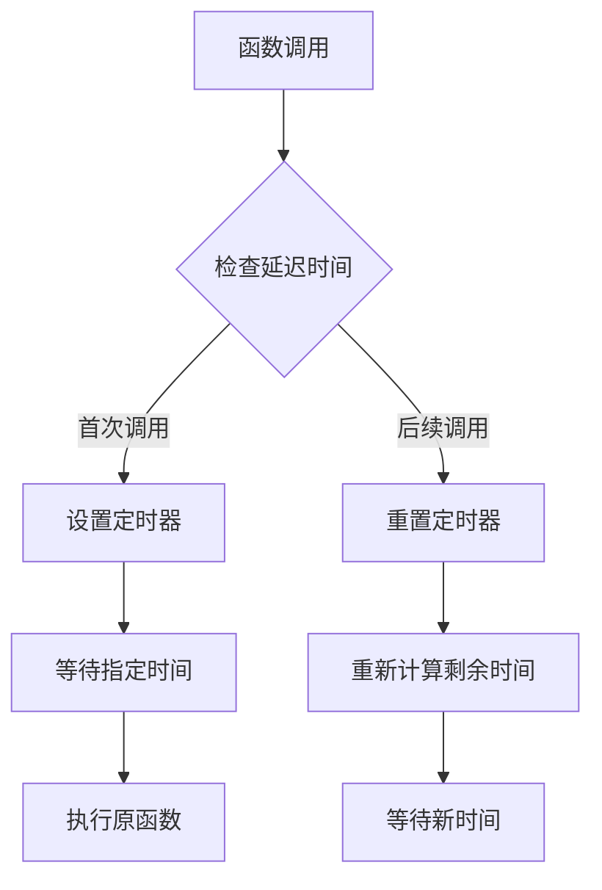
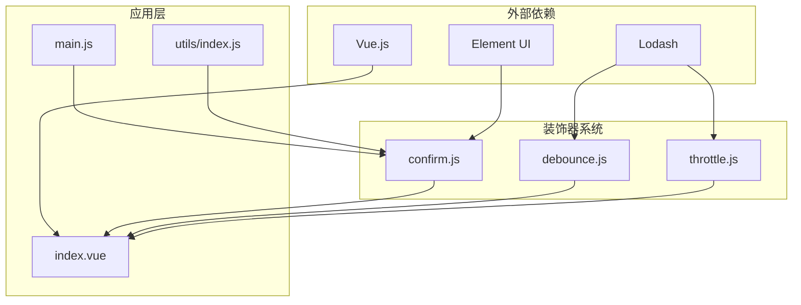

# 装饰器确认系统

<cite>
**本文档引用的文件**
- [confirm.js](file://src/decorator/confirm.js)
- [debounce.js](file://src/decorator/debounce.js)
- [throttle.js](file://src/decorator/throttle.js)
- [readme.md](file://src/decorator/readme.md)
- [index.js](file://src/views/excel/custom-excel/index.vue)
- [main.js](file://src/main.js)
- [index.js](file://src/utils/index.js)
- [package.json](file://package.json)
</cite>

## 目录
1. [简介](#简介)
2. [项目结构](#项目结构)
3. [核心组件](#核心组件)
4. [架构概览](#架构概览)
5. [详细组件分析](#详细组件分析)
6. [依赖关系分析](#依赖关系分析)
7. [性能考虑](#性能考虑)
8. [故障排除指南](#故障排除指南)
9. [结论](#结论)

## 简介

装饰器确认系统是Vue CMS项目中的一个重要功能模块，它提供了基于ES6装饰器语法的确认提示框功能。该系统通过装饰器模式为Vue组件的方法提供统一的确认对话框功能，确保用户在执行敏感操作前能够得到明确的确认提示。

该项目采用现代JavaScript特性（ES6装饰器）和Vue.js框架构建，集成了Element UI组件库，提供了完整的前端解决方案。装饰器确认系统是其中的一个重要组成部分，用于增强用户体验和操作安全性。

## 项目结构

装饰器确认系统位于项目的`src/decorator`目录下，包含以下核心文件：



**图表来源**
- [confirm.js:1-28](file://src/decorator/confirm.js#L1-L28)
- [debounce.js:1-21](file://src/decorator/debounce.js#L1-L21)
- [throttle.js:1-20](file://src/decorator/throttle.js#L1-L20)
- [index.vue:122-122](file://src/views/excel/custom-excel/index.vue#L122-L122)

**章节来源**
- [confirm.js:1-28](file://src/decorator/confirm.js#L1-L28)
- [debounce.js:1-21](file://src/decorator/debounce.js#L1-L21)
- [throttle.js:1-20](file://src/decorator/throttle.js#L1-L20)
- [readme.md:1-8](file://src/decorator/readme.md#L1-L8)

## 核心组件

装饰器确认系统由三个主要组件构成：

### 1. 确认提示框装饰器 (confirm.js)
这是系统的核心组件，提供基于Element UI MessageBox的确认功能。

### 2. 防抖装饰器 (debounce.js)
基于Lodash库实现的函数防抖功能，用于优化高频触发的操作。

### 3. 节流装饰器 (throttle.js)
基于Lodash库实现的函数节流功能，用于控制函数执行频率。

**章节来源**
- [confirm.js:8-27](file://src/decorator/confirm.js#L8-L27)
- [debounce.js:16-20](file://src/decorator/debounce.js#L16-L20)
- [throttle.js:15-19](file://src/decorator/throttle.js#L15-L19)

## 架构概览

装饰器确认系统采用装饰器模式实现，通过高阶函数的方式为目标方法提供额外的功能。



**图表来源**
- [confirm.js:11-25](file://src/decorator/confirm.js#L11-L25)
- [index.vue:122-137](file://src/views/excel/custom-excel/index.vue#L122-L137)

## 详细组件分析

### 确认提示框装饰器 (confirm.js)

#### 类结构图


**图表来源**
- [confirm.js:8-27](file://src/decorator/confirm.js#L8-L27)

#### 核心功能实现

确认装饰器通过以下步骤实现其功能：

1. **参数处理**: 接收消息内容、标题、取消回调和确定回调函数
2. **方法包装**: 创建一个新的包装函数来拦截原始方法调用
3. **确认对话**: 使用Element UI的MessageBox显示确认对话框
4. **条件执行**: 根据用户选择决定是否执行原始方法
5. **回调处理**: 在成功或失败时调用相应的回调函数

#### 使用示例流程
```mermaid
flowchart TD
A[用户点击删除按钮] --> B[@confirm装饰器触发]
B --> C[显示确认对话框]
C --> D{用户选择}
D --> |确认| E[执行原始删除方法]
D --> |取消| F[调用取消回调]
E --> G[显示成功消息]
F --> H[结束操作]
G --> I[更新界面状态]
I --> J[操作完成]
```

**图表来源**
- [index.vue:122-137](file://src/views/excel/custom-excel/index.vue#L122-L137)

**章节来源**
- [confirm.js:8-27](file://src/decorator/confirm.js#L8-L27)
- [index.vue:122-137](file://src/views/excel/custom-excel/index.vue#L122-L137)

### 防抖装饰器 (debounce.js)

#### 功能特点
- 基于Lodash的debounce函数实现
- 支持延迟毫秒数配置
- 支持leading和trailing选项
- 最大等待时间设置

#### 实现原理


**图表来源**
- [debounce.js:16-19](file://src/decorator/debounce.js#L16-L19)

**章节来源**
- [debounce.js:16-20](file://src/decorator/debounce.js#L16-L20)

### 节流装饰器 (throttle.js)

#### 功能特点
- 基于Lodash的throttle函数实现
- 控制函数执行频率
- 支持leading和trailing选项
- 防止函数过于频繁执行

#### 性能优化
节流装饰器主要用于以下场景：
- 滚动事件处理
- 窗口大小调整
- 鼠标移动跟踪
- API请求频率限制

**章节来源**
- [throttle.js:15-19](file://src/decorator/throttle.js#L15-L19)

### 装饰器系统文档 (readme.md)

装饰器系统提供了对ES6装饰器模式的说明和使用指导。装饰器模式作为一种设计模式，允许在不修改原有代码的情况下动态地扩展对象功能。

**章节来源**
- [readme.md:1-8](file://src/decorator/readme.md#L1-L8)

## 依赖关系分析

装饰器确认系统与项目其他部分的依赖关系如下：



**图表来源**
- [confirm.js:1-1](file://src/decorator/confirm.js#L1-L1)
- [debounce.js:6-6](file://src/decorator/debounce.js#L6-L6)
- [throttle.js:6-6](file://src/decorator/throttle.js#L6-L6)
- [package.json:33-63](file://package.json#L33-L63)

**章节来源**
- [package.json:33-63](file://package.json#L33-L63)
- [main.js:16-42](file://src/main.js#L16-L42)

## 性能考虑

### 装饰器性能影响
- **内存开销**: 装饰器会在方法调用时创建闭包，可能增加内存使用
- **执行延迟**: 确认对话框会阻塞用户操作，影响响应速度
- **异步处理**: 装饰器内部使用Promise处理异步操作

### 优化建议
1. **合理使用**: 仅对必要的敏感操作使用确认装饰器
2. **缓存策略**: 对频繁使用的装饰器实例进行缓存
3. **错误处理**: 添加适当的错误处理机制
4. **性能监控**: 监控装饰器对应用性能的影响

## 故障排除指南

### 常见问题及解决方案

#### 1. Element UI MessageBox未找到
**问题**: 装饰器无法显示确认对话框
**解决方案**: 确保Element UI已正确安装和配置

#### 2. 装饰器语法不生效
**问题**: 使用@符号装饰器时出现语法错误
**解决方案**: 检查Babel配置是否支持装饰器语法

#### 3. 方法执行异常
**问题**: 装饰器包装的方法抛出异常
**解决方案**: 添加try-catch块处理异常情况

#### 4. this上下文丢失
**问题**: 装饰器方法中的this指向不正确
**解决方案**: 使用箭头函数或bind方法绑定this上下文

**章节来源**
- [confirm.js:18-24](file://src/decorator/confirm.js#L18-L24)

## 结论

装饰器确认系统为Vue CMS项目提供了一个强大而灵活的确认机制。通过装饰器模式，开发者可以以声明式的方式为任何方法添加确认功能，而无需修改原有代码逻辑。

该系统的优点包括：
- **代码复用**: 统一的确认逻辑可以在多个组件中重复使用
- **易于维护**: 集中的确认逻辑便于维护和更新
- **用户体验**: 提供一致的确认交互体验
- **扩展性**: 支持自定义确认消息和回调函数

未来可以考虑的改进方向：
- 添加更多类型的确认装饰器
- 支持异步确认操作
- 提供更丰富的配置选项
- 增强错误处理和日志记录功能