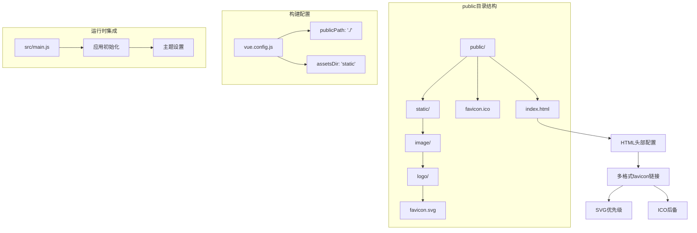
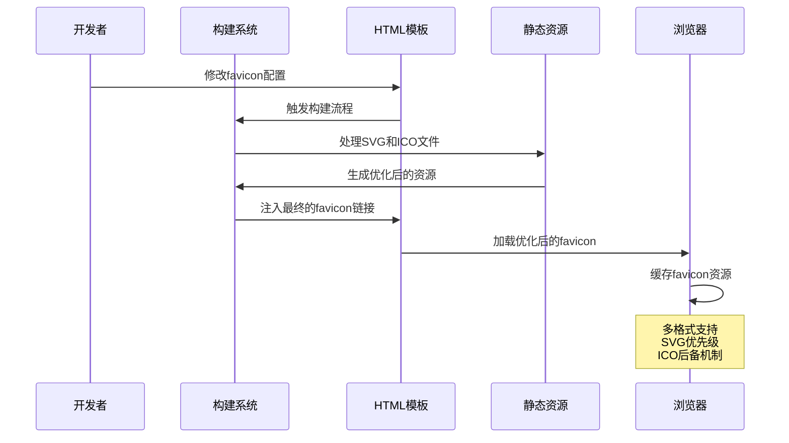
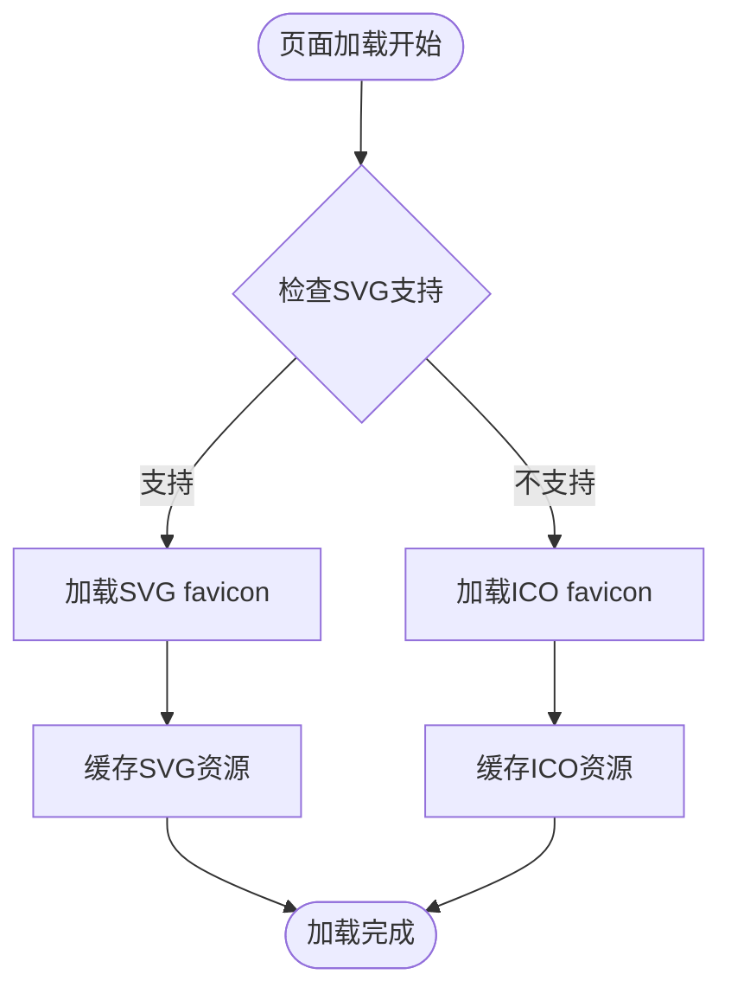
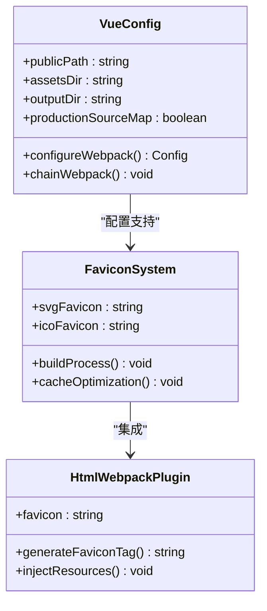
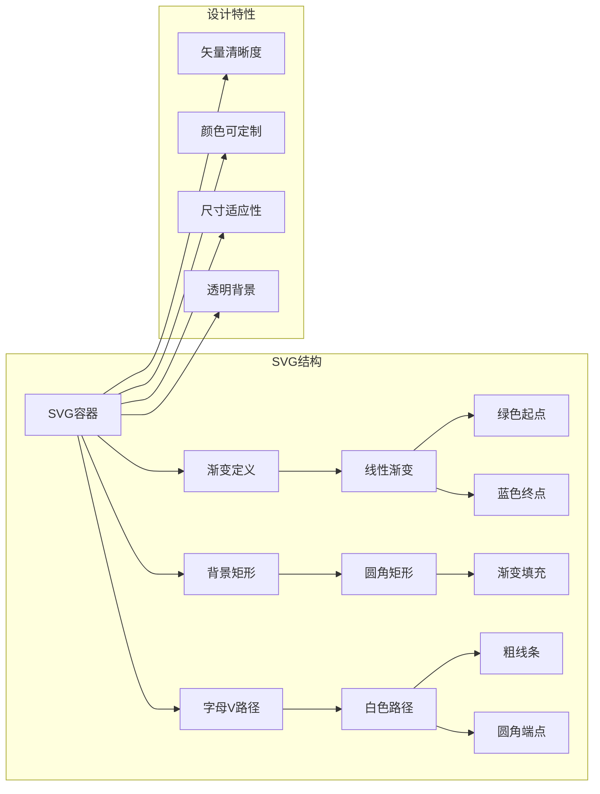
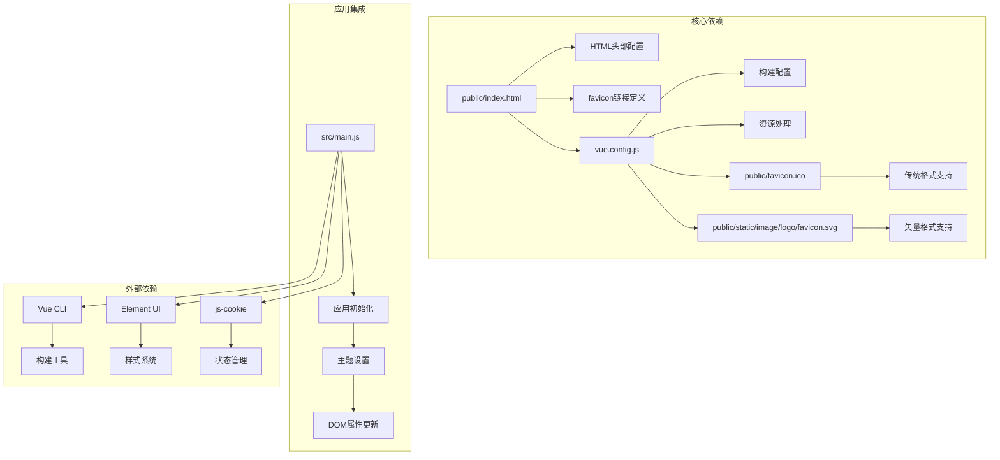

# Favicon系统

<cite>
**本文档引用的文件**
- [public/index.html](file://public/index.html)
- [public/favicon.ico](file://public/favicon.ico)
- [public/static/image/logo/favicon.svg](file://public/static/image/logo/favicon.svg)
- [vue.config.js](file://vue.config.js)
- [src/main.js](file://src/main.js)
- [package.json](file://package.json)
</cite>

## 目录
1. [简介](#简介)
2. [项目结构](#项目结构)
3. [核心组件](#核心组件)
4. [架构概览](#架构概览)
5. [详细组件分析](#详细组件分析)
6. [依赖关系分析](#依赖关系分析)
7. [性能考虑](#性能考虑)
8. [故障排除指南](#故障排除指南)
9. [结论](#结论)

## 简介

Favicon系统是现代Web应用的重要组成部分，它为网站提供了统一的品牌标识和用户体验。在本Vue CMS项目中，favicon系统采用了现代化的多格式支持策略，包括SVG矢量图标和传统ICO图标格式，确保在各种设备和浏览器环境下都能提供最佳的视觉效果。

该系统不仅实现了基础的favicon功能，还通过SVG渐变技术创建了动态的视觉效果，体现了现代Web设计的趋势。通过合理的文件组织和构建配置，确保了favicon在开发和生产环境中的正确加载和缓存优化。

## 项目结构

Vue CMS项目的favicon系统采用多层次的文件组织结构，主要包含以下关键组件：

**图表来源**
- [public/index.html:8](file://public/index.html#L8-L9)
- [vue.config.js:22](file://vue.config.js#L22)
- [vue.config.js:24](file://vue.config.js#L24)

**章节来源**
- [public/index.html:1-22](file://public/index.html#L1-L22)
- [public/static/image/logo/favicon.svg:1-13](file://public/static/image/logo/favicon.svg#L1-L13)
- [vue.config.js:14-144](file://vue.config.js#L14-L144)

## 核心组件

### HTML头部配置组件

项目在HTML模板中实现了双格式的favicon配置策略，这种设计确保了向后兼容性和现代浏览器的最佳支持。

**SVG Favicon配置**：使用`<link rel="icon" type="image/svg+xml">`标签指向SVG格式的favicon文件，提供矢量图形的优势，支持任意缩放而不失真。

**ICO Favicon配置**：使用`<link rel="alternate icon">`标签作为传统格式的后备方案，确保老版本浏览器的兼容性。

### 构建系统组件

Vue CLI的构建配置对favicon系统提供了完整的支持，通过合理的路径配置和资源优化策略。

**静态资源目录配置**：将静态资源输出到`static/`目录，与HTML中的相对路径保持一致。

**公共路径配置**：设置`publicPath`为相对路径'./'，确保在不同部署环境下favicon的正确加载。

### SVG矢量图标组件

项目使用SVG格式的favicon，通过渐变色技术创建了独特的视觉效果。

**渐变背景设计**：使用线性渐变从绿色到蓝色的过渡效果，体现科技感和专业性。

**几何图形设计**：通过路径绘制字母"V"的形状，简洁而富有识别度。

**响应式特性**：SVG格式支持任意尺寸缩放，在高分辨率显示器上保持清晰度。

**章节来源**
- [public/index.html:8-9](file://public/index.html#L8-L9)
- [vue.config.js:22](file://vue.config.js#L22)
- [vue.config.js:24](file://vue.config.js#L24)
- [public/static/image/logo/favicon.svg:1-13](file://public/static/image/logo/favicon.svg#L1-L13)

## 架构概览

Favicon系统的整体架构采用了前后端分离的设计模式，通过构建工具链实现自动化处理：

**图表来源**
- [public/index.html:8-9](file://public/index.html#L8-L9)
- [vue.config.js:14-144](file://vue.config.js#L14-L144)

### 系统工作流程

1. **开发阶段**：开发者在HTML模板中配置favicon链接
2. **构建阶段**：Vue CLI构建系统处理静态资源并生成最终文件
3. **运行阶段**：浏览器根据优先级加载合适的favicon格式
4. **缓存阶段**：浏览器缓存favicon资源以提高加载速度

### 技术栈集成

项目集成了多种技术来实现完整的favicon解决方案：

**前端框架集成**：与Vue.js应用无缝集成，在应用初始化时自动生效

**构建工具集成**：通过Vue CLI的配置系统实现自动化处理

**样式系统集成**：与Element UI和自定义主题系统协同工作

## 详细组件分析

### HTML头部配置分析

HTML模板中的favicon配置体现了现代Web开发的最佳实践：

**图表来源**
- [public/index.html:8-9](file://public/index.html#L8-L9)

#### SVG Favicon特性

- **矢量优势**：无损缩放，适配各种屏幕密度
- **样式灵活性**：可以通过CSS进一步定制
- **文件大小**：通常比多尺寸ICO文件更小
- **现代标准**：得到最新浏览器的原生支持

#### ICO Favicon后备机制

- **兼容性保证**：覆盖所有传统浏览器
- **多尺寸支持**：包含16x16、32x32、48x48等标准尺寸
- **透明度支持**：完全支持PNG透明度
- **性能考虑**：作为SVG不可用时的降级方案

**章节来源**
- [public/index.html:8-9](file://public/index.html#L8-L9)

### 构建配置分析

Vue CLI的配置系统为favicon提供了全面的支持：

**图表来源**
- [vue.config.js:14-144](file://vue.config.js#L14-L144)

#### 路径配置策略

- **相对路径设计**：使用'./'确保在子路径部署时的正确性
- **静态资源分离**：将favicon与应用程序代码分离
- **缓存友好**：通过合理的文件命名和目录结构优化缓存

#### 性能优化策略

- **资源压缩**：构建过程中自动优化SVG和ICO文件
- **缓存控制**：通过文件指纹实现长期缓存
- **按需加载**：避免不必要的资源请求

**章节来源**
- [vue.config.js:14-144](file://vue.config.js#L14-L144)

### SVG矢量图标实现

SVG格式的favicon通过精心设计的图形元素实现了独特的视觉效果：

**图表来源**
- [public/static/image/logo/favicon.svg:1-13](file://public/static/image/logo/favicon.svg#L1-L13)

#### 渐变色彩系统

- **色彩选择**：绿色(#42b883)到蓝色(#409EFF)的渐变
- **心理效应**：绿色代表稳定，蓝色代表专业，符合CMS系统的定位
- **品牌一致性**：与整体UI设计保持色彩协调

#### 几何图形设计

- **字母"V"设计**：简洁的几何形状，易于识别
- **线条美学**：粗细适中的线条，保证在小尺寸下的可读性
- **对称平衡**：整体布局和谐统一

**章节来源**
- [public/static/image/logo/favicon.svg:1-13](file://public/static/image/logo/favicon.svg#L1-L13)

## 依赖关系分析

Favicon系统与其他项目组件存在密切的依赖关系：

**图表来源**
- [public/index.html:1-22](file://public/index.html#L1-L22)
- [vue.config.js:14-144](file://vue.config.js#L14-L144)
- [src/main.js:1-73](file://src/main.js#L1-L73)
- [package.json:33-64](file://package.json#L33-L64)

### 内部依赖关系

**HTML模板依赖**：直接依赖于构建配置中的路径设置

**构建配置依赖**：依赖于public目录中的实际文件存在

**应用集成依赖**：与主题系统和国际化系统协同工作

### 外部依赖关系

**Vue CLI依赖**：构建过程中的核心工具

**第三方库依赖**：Element UI、js-cookie等库的集成

**浏览器兼容性依赖**：不同浏览器对favicon格式的支持差异

**章节来源**
- [package.json:33-64](file://package.json#L33-L64)
- [src/main.js:1-73](file://src/main.js#L1-L73)

## 性能考虑

Favicon系统在性能方面采用了多项优化策略：

### 缓存策略

- **长期缓存**：通过文件指纹实现浏览器长期缓存
- **条件加载**：根据浏览器支持情况选择最优格式
- **CDN优化**：支持CDN部署，提高全球访问速度

### 文件优化

- **SVG压缩**：移除不必要的元数据和注释
- **ICO优化**：生成多尺寸ICO文件以适配不同场景
- **体积控制**：严格控制文件大小，避免影响页面加载速度

### 加载策略

- **异步加载**：不影响页面主要内容的加载
- **预加载优化**：通过适当的HTTP头信息优化缓存
- **回退机制**：确保在任何情况下都有可用的favicon

## 故障排除指南

### 常见问题及解决方案

**问题1：favicon不显示**
- 检查HTML中的路径配置是否正确
- 确认构建后文件是否存在于正确的目录
- 验证浏览器缓存是否需要清除

**问题2：图标模糊**
- 确认使用的是SVG格式而非低分辨率ICO
- 检查CSS是否对favicon进行了额外的样式处理
- 验证浏览器是否正确选择了SVG格式

**问题3：缓存问题**
- 清除浏览器缓存或强制刷新页面
- 检查服务器的缓存头设置
- 验证文件指纹是否正确更新

### 调试技巧

**开发环境调试**：
- 使用浏览器开发者工具检查网络请求
- 查看HTML源码确认favicon链接正确
- 检查控制台是否有相关错误信息

**生产环境调试**：
- 验证构建输出文件的完整性
- 检查服务器配置是否正确
- 确认CDN缓存是否同步更新

**章节来源**
- [public/index.html:8-9](file://public/index.html#L8-L9)
- [vue.config.js:22](file://vue.config.js#L22)

## 结论

Vue CMS项目的favicon系统展现了现代Web开发的最佳实践，通过多格式支持、智能缓存和优雅降级等策略，为用户提供了优质的体验。系统的设计充分考虑了兼容性、性能和可维护性，是一个值得参考的实现案例。

未来可以考虑的改进方向包括：
- 添加更多尺寸的SVG变体以支持更广泛的设备
- 实现动态favicon功能以反映应用状态
- 集成更多现代浏览器的特性如主题色支持

通过持续的优化和改进，这个favicon系统将继续为Vue CMS项目提供可靠的品牌标识服务。