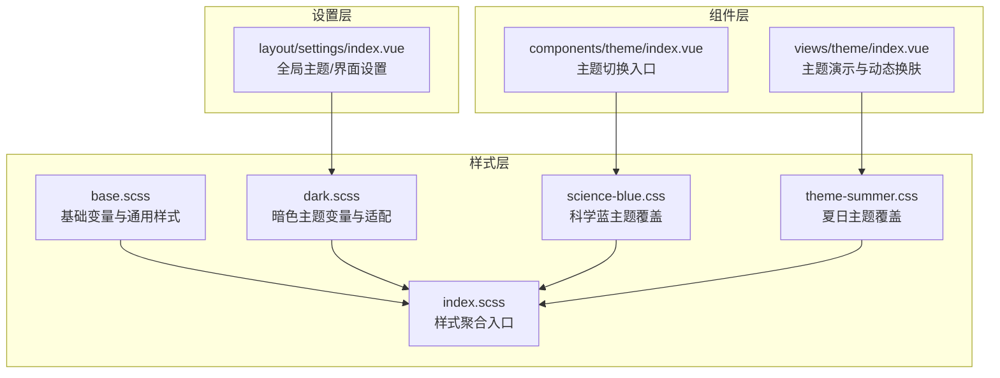
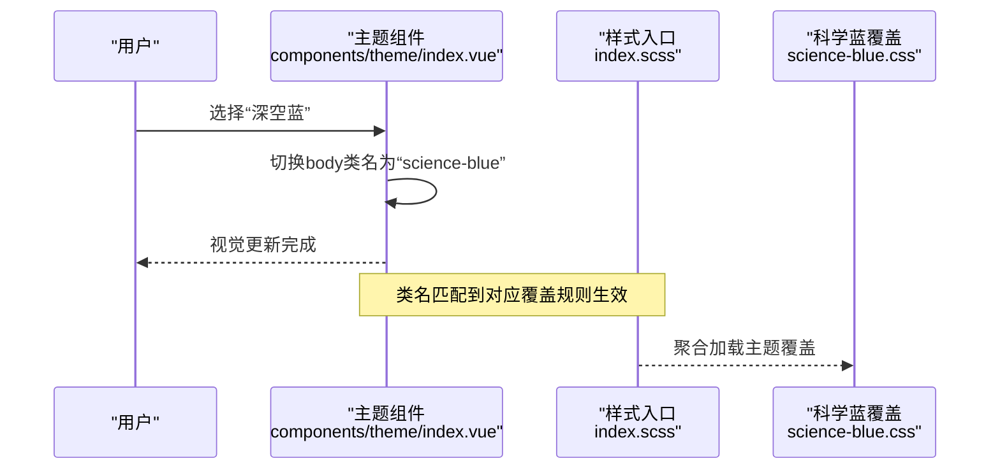
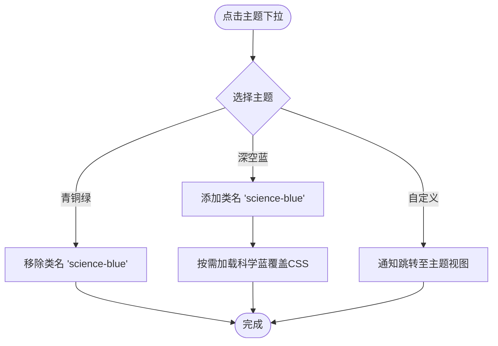
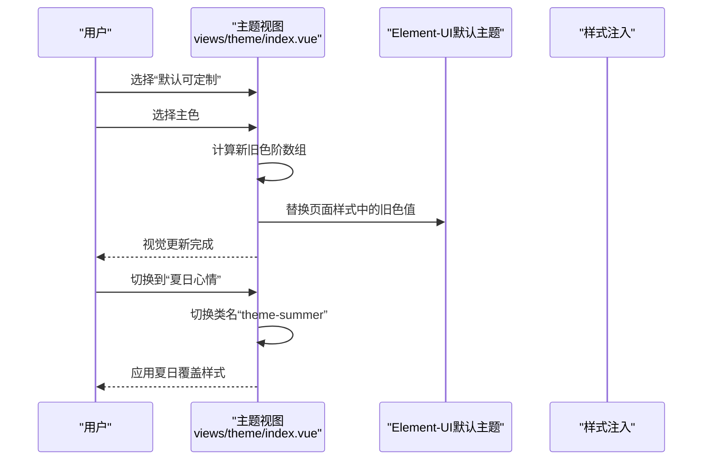
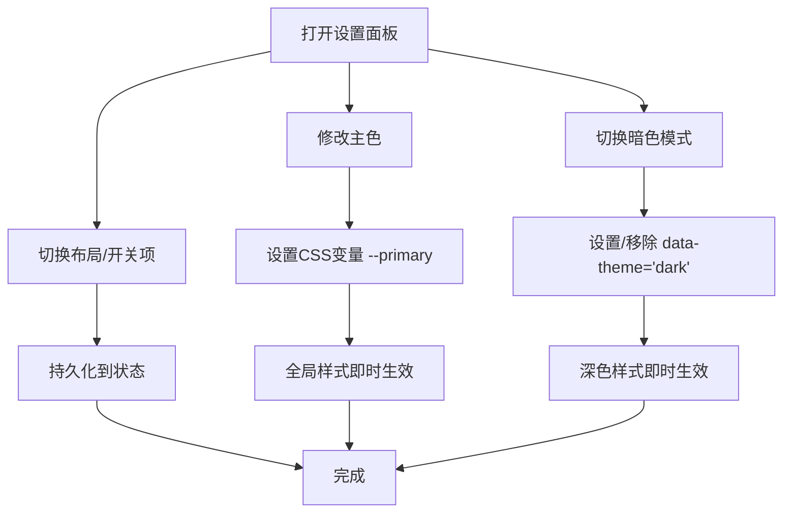
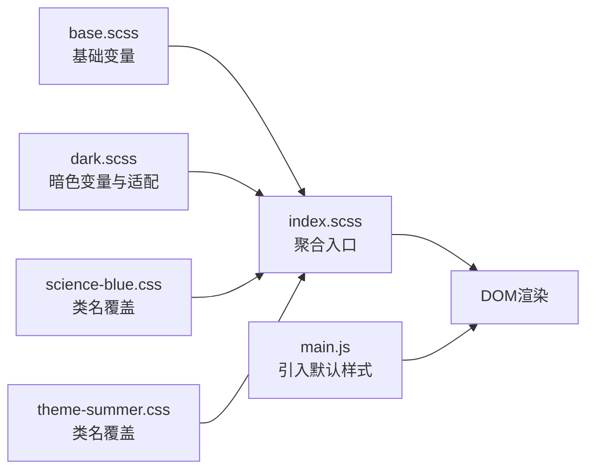
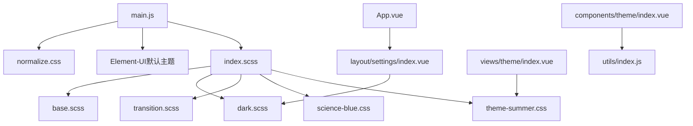

# 主题定制

<cite>
**本文引用的文件**
- [main.js](file://src/main.js)
- [index.scss](file://src/assets/style/index.scss)
- [base.scss](file://src/assets/style/base.scss)
- [dark.scss](file://src/assets/style/dark.scss)
- [transition.scss](file://src/assets/style/transition.scss)
- [science-blue.css](file://src/assets/custom-theme/science-blue.css)
- [theme-summer.css](file://src/assets/custom-theme/theme-summer.css)
- [index.vue（主题组件）](file://src/components/theme/index.vue)
- [index.vue（主题视图）](file://src/views/theme/index.vue)
- [index.vue（设置面板）](file://src/layout/settings/index.vue)
- [App.vue](file://src/App.vue)
- [index.vue（布局容器）](file://src/layout/index.vue)
- [utils/index.js](file://src/utils/index.js)
- [package.json](file://package.json)
- [vue.config.js](file://vue.config.js)
</cite>

## 目录
1. [简介](#简介)
2. [项目结构](#项目结构)
3. [核心组件](#核心组件)
4. [架构总览](#架构总览)
5. [详细组件分析](#详细组件分析)
6. [依赖关系分析](#依赖关系分析)
7. [性能考量](#性能考量)
8. [故障排查指南](#故障排查指南)
9. [结论](#结论)
10. [附录](#附录)

## 简介
本文件面向Vue CMS主题定制系统，系统性阐述主题切换机制与样式体系，包括CSS变量、SCSS变量与主题文件组织方式，解释科学蓝与夏日主题的设计理念与实现细节，提供自定义主题创建流程、样式覆盖方法、暗色主题支持策略、响应式与移动端适配思路、主题与组件样式的集成与优先级规则，并给出最佳实践与性能优化建议，为品牌定制与视觉设计提供技术支撑。

## 项目结构
主题系统由三层构成：
- 样式层：统一的基础变量与主题样式（SCSS/CSS）
- 组件层：主题切换入口与演示视图（Vue组件）
- 设置层：全局主题与界面参数控制（Vuex + 设置抽屉）

图表来源
- [index.scss:1-4](file://src/assets/style/index.scss#L1-L4)
- [base.scss:1-125](file://src/assets/style/base.scss#L1-L125)
- [dark.scss:1-457](file://src/assets/style/dark.scss#L1-L457)
- [science-blue.css:1-49](file://src/assets/custom-theme/science-blue.css#L1-L49)
- [theme-summer.css:1-800](file://src/assets/custom-theme/theme-summer.css#L1-L800)
- [index.vue（主题组件）:1-42](file://src/components/theme/index.vue#L1-L42)
- [index.vue（主题视图）:1-314](file://src/views/theme/index.vue#L1-L314)
- [index.vue（设置面板）:1-512](file://src/layout/settings/index.vue#L1-L512)

章节来源
- [index.scss:1-4](file://src/assets/style/index.scss#L1-L4)
- [base.scss:1-125](file://src/assets/style/base.scss#L1-L125)
- [dark.scss:1-457](file://src/assets/style/dark.scss#L1-L457)
- [science-blue.css:1-49](file://src/assets/custom-theme/science-blue.css#L1-L49)
- [theme-summer.css:1-800](file://src/assets/custom-theme/theme-summer.css#L1-L800)
- [index.vue（主题组件）:1-42](file://src/components/theme/index.vue#L1-L42)
- [index.vue（主题视图）:1-314](file://src/views/theme/index.vue#L1-L314)
- [index.vue（设置面板）:1-512](file://src/layout/settings/index.vue#L1-L512)

## 核心组件
- 样式聚合入口：通过样式聚合入口统一引入基础变量、暗色主题与过渡动画，确保变量与覆盖层的加载顺序。
- 主题切换入口：提供“青铜绿/深空蓝/自定义”三档主题切换，通过类名切换实现主题覆盖。
- 动态换肤视图：基于Element-UI默认主题的动态换肤，按主色生成色阶并替换页面样式中的颜色值。
- 暗色主题设置：通过data-theme属性与CSS变量实现深色模式全局切换。
- 基础变量与通用样式：定义系统级CSS变量与通用排版、滚动条等基础样式。

章节来源
- [index.scss:1-4](file://src/assets/style/index.scss#L1-L4)
- [base.scss:1-125](file://src/assets/style/base.scss#L1-L125)
- [dark.scss:1-457](file://src/assets/style/dark.scss#L1-L457)
- [index.vue（主题组件）:1-42](file://src/components/theme/index.vue#L1-L42)
- [index.vue（主题视图）:1-314](file://src/views/theme/index.vue#L1-L314)
- [index.vue（设置面板）:1-512](file://src/layout/settings/index.vue#L1-L512)

## 架构总览
主题系统采用“变量驱动 + 类名覆盖 + 动态样式替换”的混合策略：
- 变量驱动：基础变量与暗色变量通过CSS变量集中管理，便于全局替换。
- 类名覆盖：科学蓝与夏日主题通过类名前缀对特定组件进行局部覆盖。
- 动态替换：夏日主题视图在默认Element-UI主题基础上，按主色生成色阶并注入/替换样式。

图表来源
- [index.vue（主题组件）:1-42](file://src/components/theme/index.vue#L1-L42)
- [index.scss:1-4](file://src/assets/style/index.scss#L1-L4)
- [science-blue.css:1-49](file://src/assets/custom-theme/science-blue.css#L1-L49)

## 详细组件分析

### 组件A：主题切换入口（components/theme/index.vue）
- 功能要点
  - 下拉菜单提供“青铜绿/深空蓝/自定义”选项
  - 通过工具函数切换body类名，驱动主题覆盖
  - 加载科学蓝主题CSS文件以启用覆盖
- 关键行为
  - 选择“深空蓝”时添加类名，移除时移除类名
  - “自定义”提示跳转至主题视图进行动态换肤

图表来源
- [index.vue（主题组件）:1-42](file://src/components/theme/index.vue#L1-L42)
- [utils/index.js:75-120](file://src/utils/index.js#L75-L120)

章节来源
- [index.vue（主题组件）:1-42](file://src/components/theme/index.vue#L1-L42)
- [utils/index.js:75-120](file://src/utils/index.js#L75-L120)

### 组件B：主题演示与动态换肤（views/theme/index.vue）
- 功能要点
  - 提供“默认（可定制）/夏日心情”两档主题
  - 默认模式下可通过颜色选择器动态替换Element-UI主色
  - 夏日模式通过类名切换应用覆盖样式
- 实现机制
  - 默认模式：计算主色的色阶数组，替换页面中旧色值为新色值
  - 夏日模式：切换类名并按需加载覆盖CSS

图表来源
- [index.vue（主题视图）:1-314](file://src/views/theme/index.vue#L1-L314)
- [theme-summer.css:1-800](file://src/assets/custom-theme/theme-summer.css#L1-L800)

章节来源
- [index.vue（主题视图）:1-314](file://src/views/theme/index.vue#L1-L314)
- [theme-summer.css:1-800](file://src/assets/custom-theme/theme-summer.css#L1-L800)

### 组件C：全局主题与界面设置（layout/settings/index.vue）
- 功能要点
  - 主题色：通过CSS变量实时更新
  - 暗色模式：通过data-theme属性切换
  - 界面参数：侧边栏折叠、菜单手风琴、面包屑/标签页开关、布局切换等
- 交互流程
  - 用户在设置面板操作开关或颜色选择器
  - 组件通过Vuex动作更新状态并同步到DOM

图表来源
- [index.vue（设置面板）:1-512](file://src/layout/settings/index.vue#L1-L512)

章节来源
- [index.vue（设置面板）:1-512](file://src/layout/settings/index.vue#L1-L512)

### 样式系统：变量、覆盖与聚合
- 基础变量（SCSS）
  - 定义系统级颜色与层级变量，作为主题色与组件色的来源
- 暗色主题（SCSS）
  - 通过CSS变量与[data-theme='dark']选择器，对Element-UI组件进行深色适配
- 聚合入口（SCSS）
  - 统一@use引入基础、暗色与过渡动画，保证加载顺序与作用域隔离
- 类名覆盖（CSS）
  - 科学蓝与夏日主题分别以类名前缀限定作用范围，避免全局污染
- 初始化（JS）
  - 引入normalize.css与Element-UI默认主题，确保跨浏览器一致性

图表来源
- [base.scss:1-125](file://src/assets/style/base.scss#L1-L125)
- [dark.scss:1-457](file://src/assets/style/dark.scss#L1-L457)
- [index.scss:1-4](file://src/assets/style/index.scss#L1-L4)
- [science-blue.css:1-49](file://src/assets/custom-theme/science-blue.css#L1-L49)
- [theme-summer.css:1-800](file://src/assets/custom-theme/theme-summer.css#L1-L800)
- [main.js:1-53](file://src/main.js#L1-L53)

章节来源
- [base.scss:1-125](file://src/assets/style/base.scss#L1-L125)
- [dark.scss:1-457](file://src/assets/style/dark.scss#L1-L457)
- [index.scss:1-4](file://src/assets/style/index.scss#L1-L4)
- [science-blue.css:1-49](file://src/assets/custom-theme/science-blue.css#L1-L49)
- [theme-summer.css:1-800](file://src/assets/custom-theme/theme-summer.css#L1-L800)
- [main.js:1-53](file://src/main.js#L1-L53)

## 依赖关系分析
- 样式依赖
  - main.js引入normalize.css与Element-UI默认主题
  - index.scss聚合基础、暗色与过渡动画
  - 主题覆盖CSS按需加载
- 组件依赖
  - 主题组件依赖工具函数进行类名切换
  - 设置面板依赖Vuex状态与动作
  - App.vue承载设置面板抽屉

图表来源
- [main.js:1-53](file://src/main.js#L1-L53)
- [index.scss:1-4](file://src/assets/style/index.scss#L1-L4)
- [base.scss:1-125](file://src/assets/style/base.scss#L1-L125)
- [dark.scss:1-457](file://src/assets/style/dark.scss#L1-L457)
- [transition.scss:1-148](file://src/assets/style/transition.scss#L1-L148)
- [science-blue.css:1-49](file://src/assets/custom-theme/science-blue.css#L1-L49)
- [theme-summer.css:1-800](file://src/assets/custom-theme/theme-summer.css#L1-L800)
- [index.vue（主题组件）:1-42](file://src/components/theme/index.vue#L1-L42)
- [index.vue（主题视图）:1-314](file://src/views/theme/index.vue#L1-L314)
- [index.vue（设置面板）:1-512](file://src/layout/settings/index.vue#L1-L512)
- [App.vue:1-35](file://src/App.vue#L1-L35)
- [utils/index.js:1-122](file://src/utils/index.js#L1-L122)

章节来源
- [main.js:1-53](file://src/main.js#L1-L53)
- [index.scss:1-4](file://src/assets/style/index.scss#L1-L4)
- [index.vue（主题组件）:1-42](file://src/components/theme/index.vue#L1-L42)
- [index.vue（主题视图）:1-314](file://src/views/theme/index.vue#L1-L314)
- [index.vue（设置面板）:1-512](file://src/layout/settings/index.vue#L1-L512)
- [App.vue:1-35](file://src/App.vue#L1-L35)
- [utils/index.js:1-122](file://src/utils/index.js#L1-L122)

## 性能考量
- 资源拆分与缓存
  - 通过打包配置对第三方库与UI组件进行分包，降低重复依赖
  - Element-UI独立分包，提升缓存命中率
- 预加载与首屏优化
  - 配置运行时分包与运行时文件分离，缩短首屏加载时间
  - 移除不必要的prefetch，避免无效请求
- 样式体积控制
  - 仅引入必要样式，避免重复加载多份主题覆盖
  - 将覆盖CSS按需加载，减少初始包体

章节来源
- [vue.config.js:116-141](file://vue.config.js#L116-L141)
- [package.json:33-99](file://package.json#L33-L99)

## 故障排查指南
- 主题切换无效
  - 检查是否正确切换body类名（科学蓝/夏日）
  - 确认对应覆盖CSS已加载
  - 核对选择器优先级，避免被其他样式覆盖
- 暗色模式异常
  - 确认data-theme属性设置与CSS变量是否生效
  - 检查组件是否使用CSS变量而非硬编码颜色
- 动态换肤不生效
  - 确认主色计算与色阶生成逻辑未被拦截
  - 检查页面样式中是否存在不可替换的固定色值
- 响应式问题
  - 检查媒体查询与断点是否与组件样式冲突
  - 确保过渡动画与布局在小屏设备上的表现

章节来源
- [index.vue（主题组件）:1-42](file://src/components/theme/index.vue#L1-L42)
- [index.vue（主题视图）:1-314](file://src/views/theme/index.vue#L1-L314)
- [index.vue（设置面板）:1-512](file://src/layout/settings/index.vue#L1-L512)
- [dark.scss:1-457](file://src/assets/style/dark.scss#L1-L457)

## 结论
该主题系统通过CSS变量、SCSS聚合与类名覆盖相结合的方式，实现了灵活的主题切换与深色模式支持。科学蓝与夏日主题分别采用局部覆盖与动态替换策略，满足不同场景需求。配合设置面板与工具函数，用户可在不改动业务代码的前提下完成品牌化定制与视觉迭代。

## 附录

### 设计理念与实现细节
- 科学蓝主题
  - 以深蓝色为主基调，强调科技感与专业性
  - 通过类名覆盖顶部导航与侧边栏菜单，突出主色一致性
- 夏日主题
  - 以明亮色彩与图标字体为基础，营造轻松氛围
  - 通过类名覆盖与字体图标映射，统一视觉风格

章节来源
- [science-blue.css:1-49](file://src/assets/custom-theme/science-blue.css#L1-L49)
- [theme-summer.css:1-800](file://src/assets/custom-theme/theme-summer.css#L1-L800)

### 自定义主题创建流程
- 准备阶段
  - 在样式层定义主题变量（建议在base.scss或新增主题SCSS）
  - 在组件层新增主题切换入口或视图组件
- 覆盖策略
  - 局部覆盖：以类名前缀限定作用范围，避免全局污染
  - 动态替换：在默认主题基础上按主色生成色阶并替换
- 集成与验证
  - 在聚合入口引入新主题样式
  - 在设置面板或主题组件中注册新主题选项
  - 测试暗色模式与组件适配

章节来源
- [index.scss:1-4](file://src/assets/style/index.scss#L1-L4)
- [base.scss:1-125](file://src/assets/style/base.scss#L1-L125)
- [index.vue（主题组件）:1-42](file://src/components/theme/index.vue#L1-L42)
- [index.vue（主题视图）:1-314](file://src/views/theme/index.vue#L1-L314)
- [index.vue（设置面板）:1-512](file://src/layout/settings/index.vue#L1-L512)

### 暗色主题支持与适配策略
- 变量优先：使用CSS变量承载颜色，便于统一替换
- 选择器适配：针对Element-UI组件编写深色适配规则
- 属性开关：通过data-theme属性快速切换整站主题

章节来源
- [dark.scss:1-457](file://src/assets/style/dark.scss#L1-L457)
- [index.vue（设置面板）:238-246](file://src/layout/settings/index.vue#L238-L246)

### 响应式与移动端适配
- 媒体查询：在样式层统一管理断点与布局
- 组件适配：确保覆盖样式在小屏设备上的表现
- 动画优化：过渡动画在移动端保持流畅

章节来源
- [transition.scss:1-148](file://src/assets/style/transition.scss#L1-L148)
- [base.scss:1-125](file://src/assets/style/base.scss#L1-L125)

### 主题与组件样式的集成与优先级
- 优先级原则
  - 全局变量 > 暗色变量 > 类名覆盖 > 组件内联样式
- 集成建议
  - 组件内部尽量使用CSS变量或类名，避免硬编码颜色
  - 覆盖层使用更具体的类名前缀，避免影响其他组件

章节来源
- [index.scss:1-4](file://src/assets/style/index.scss#L1-L4)
- [dark.scss:1-457](file://src/assets/style/dark.scss#L1-L457)
- [science-blue.css:1-49](file://src/assets/custom-theme/science-blue.css#L1-L49)
- [theme-summer.css:1-800](file://src/assets/custom-theme/theme-summer.css#L1-L800)

### 最佳实践与性能优化建议
- 最佳实践
  - 使用CSS变量集中管理颜色，便于主题切换
  - 覆盖样式采用类名前缀，避免全局污染
  - 在设置面板中统一管理主题与界面参数
- 性能优化
  - 分包与缓存：第三方库与UI组件独立分包
  - 预加载：首屏关键资源预加载
  - 样式瘦身：仅引入必要样式，按需加载覆盖CSS

章节来源
- [vue.config.js:116-141](file://vue.config.js#L116-L141)
- [package.json:33-99](file://package.json#L33-L99)
- [index.scss:1-4](file://src/assets/style/index.scss#L1-L4)