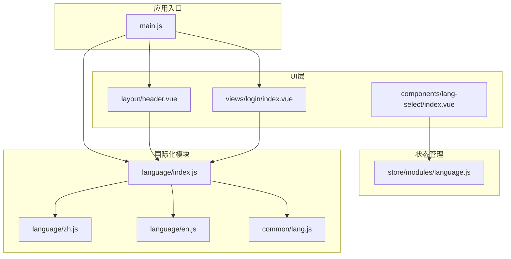
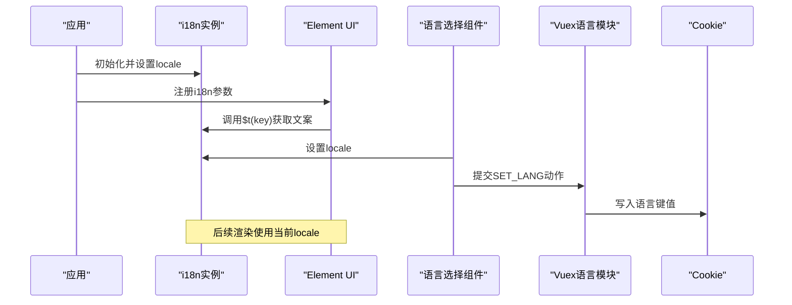
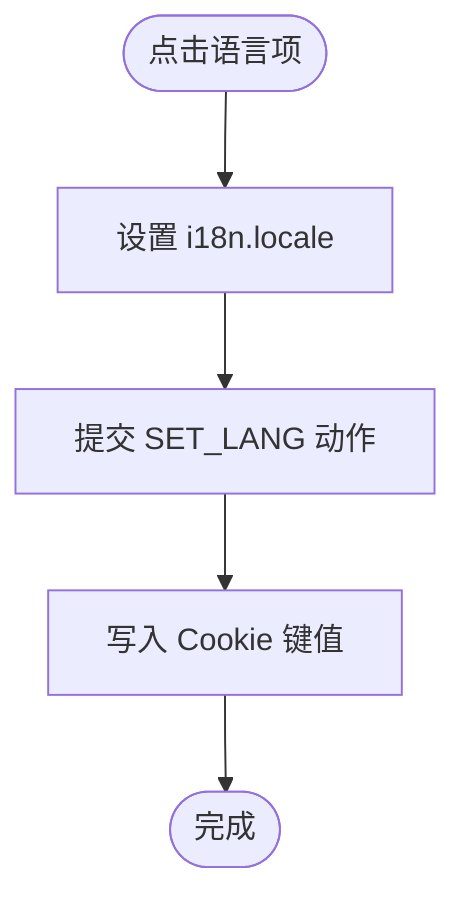
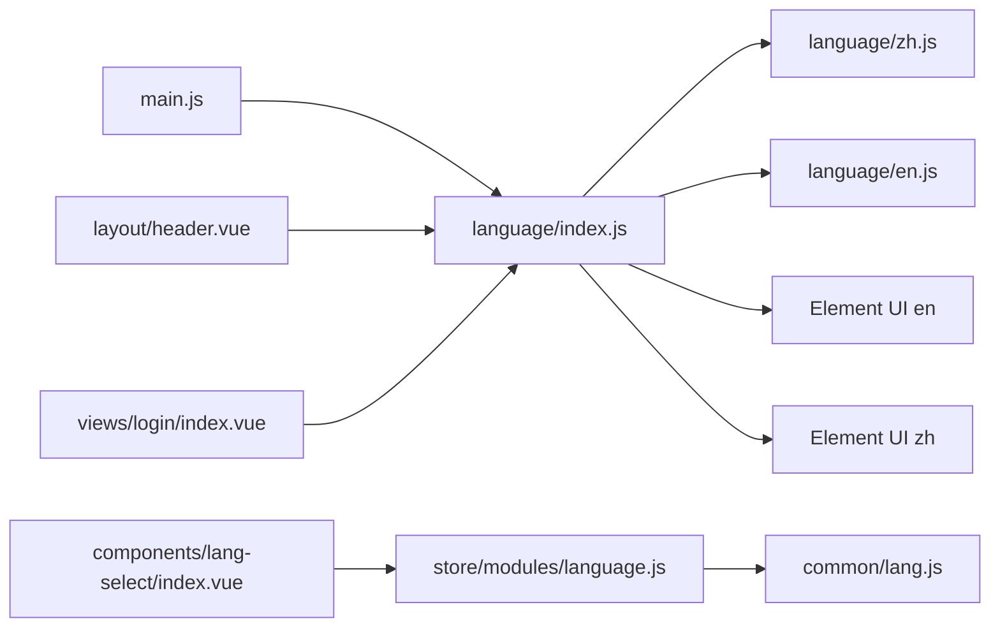

# 国际化系统

<cite>
**本文引用的文件**
- [src/language/index.js](file://src/language/index.js)
- [src/language/en.js](file://src/language/en.js)
- [src/language/zh.js](file://src/language/zh.js)
- [src/common/lang.js](file://src/common/lang.js)
- [src/store/modules/language.js](file://src/store/modules/language.js)
- [src/components/lang-select/index.vue](file://src/components/lang-select/index.vue)
- [src/main.js](file://src/main.js)
- [src/layout/header.vue](file://src/layout/header.vue)
- [src/views/login/index.vue](file://src/views/login/index.vue)
- [package.json](file://package.json)
</cite>

## 目录
1. [简介](#简介)
2. [项目结构](#项目结构)
3. [核心组件](#核心组件)
4. [架构总览](#架构总览)
5. [详细组件分析](#详细组件分析)
6. [依赖关系分析](#依赖关系分析)
7. [性能考量](#性能考量)
8. [故障排查指南](#故障排查指南)
9. [结论](#结论)
10. [附录](#附录)

## 简介
本文件系统性梳理了 Vue CMS 的国际化（i18n）实现与配置，覆盖语言包组织、翻译键值管理、动态语言切换机制、Element UI 组件国际化适配、自定义组件多语言支持、语言文件维护与更新流程、新增语言与扩展示例、文本提取与翻译管理策略、语言检测与存储回退机制，以及国际化扩展与本地化定制建议。目标是帮助开发者快速理解并高效维护多语言能力。

## 项目结构
国际化相关代码主要分布在以下位置：
- 语言包与i18n初始化：src/language
- 语言状态管理：src/store/modules/language.js
- 语言选择组件：src/components/lang-select
- 应用入口与Element UI集成：src/main.js
- 使用翻译键值的视图与组件：如 src/layout/header.vue、src/views/login/index.vue
- Cookie工具：src/common/lang.js
- 依赖声明：package.json

图表来源
- [src/main.js:1-53](file://src/main.js#L1-L53)
- [src/language/index.js:1-28](file://src/language/index.js#L1-L28)
- [src/language/zh.js:1-142](file://src/language/zh.js#L1-L142)
- [src/language/en.js:1-144](file://src/language/en.js#L1-L144)
- [src/common/lang.js:1-18](file://src/common/lang.js#L1-L18)
- [src/store/modules/language.js:1-26](file://src/store/modules/language.js#L1-L26)
- [src/layout/header.vue:1-270](file://src/layout/header.vue#L1-L270)
- [src/views/login/index.vue:1-261](file://src/views/login/index.vue#L1-L261)
- [src/components/lang-select/index.vue:1-39](file://src/components/lang-select/index.vue#L1-L39)

章节来源
- [src/language/index.js:1-28](file://src/language/index.js#L1-L28)
- [src/main.js:1-53](file://src/main.js#L1-L53)

## 核心组件
- i18n初始化与消息聚合：负责加载语言包、合并 Element UI 语言包、设置默认语言、导出 i18n 实例。
- 语言选择组件：提供下拉菜单切换语言，并同步到 Vuex Store 与 Cookie。
- 语言状态模块：集中管理当前语言状态，持久化到 Cookie。
- 应用入口集成：在 Element UI 中启用 i18n 支持，使 Element 组件内部文案自动翻译。
- 视图与组件中的翻译调用：通过 $t 函数渲染多语言文本。

章节来源
- [src/language/index.js:1-28](file://src/language/index.js#L1-L28)
- [src/components/lang-select/index.vue:1-39](file://src/components/lang-select/index.vue#L1-L39)
- [src/store/modules/language.js:1-26](file://src/store/modules/language.js#L1-L26)
- [src/main.js:36-40](file://src/main.js#L36-L40)

## 架构总览
整体流程：应用启动时，main.js 引入 i18n 并将其注入 Vue 实例；Element UI 通过 i18n 参数将内部文案交给 i18n.t 处理；用户通过语言选择组件触发切换，组件直接修改 i18n.locale，并通过 Vuex 将语言写入 Cookie；后续路由与组件渲染均使用当前语言。

图表来源
- [src/main.js:22-40](file://src/main.js#L22-L40)
- [src/language/index.js:22-25](file://src/language/index.js#L22-L25)
- [src/components/lang-select/index.vue:26-29](file://src/components/lang-select/index.vue#L26-L29)
- [src/store/modules/language.js:9-12](file://src/store/modules/language.js#L9-L12)
- [src/common/lang.js:5-11](file://src/common/lang.js#L5-L11)

## 详细组件分析

### 语言包与i18n初始化
- 语言包组织：按语言拆分为独立文件，分别导出对象，包含 login、navbar、route、settings、profile、home、introduction 等模块键空间。
- 消息聚合：在 i18n 初始化中，将 Element UI 对应语言包与业务语言包合并，形成 en/zh 两条消息树。
- 默认语言：优先从 Cookie 读取语言键值，未设置则默认中文。
- 导出实例：供 main.js 注入到 Vue 实例。

章节来源
- [src/language/index.js:11-25](file://src/language/index.js#L11-L25)
- [src/language/zh.js:1-142](file://src/language/zh.js#L1-L142)
- [src/language/en.js:1-144](file://src/language/en.js#L1-L144)
- [src/common/lang.js:5-7](file://src/common/lang.js#L5-L7)

### 语言选择组件
- 功能：下拉菜单提供中英文切换，禁用当前语言项，点击后设置 i18n.locale 并提交 Vuex 动作。
- 状态同步：组件通过 mapGetters 与 mapActions 与 Vuex 语言模块交互，确保语言变更持久化到 Cookie。

图表来源
- [src/components/lang-select/index.vue:26-29](file://src/components/lang-select/index.vue#L26-L29)
- [src/store/modules/language.js:9-12](file://src/store/modules/language.js#L9-L12)
- [src/common/lang.js:9-11](file://src/common/lang.js#L9-L11)

章节来源
- [src/components/lang-select/index.vue:1-39](file://src/components/lang-select/index.vue#L1-L39)
- [src/store/modules/language.js:1-26](file://src/store/modules/language.js#L1-L26)

### 语言状态模块（Vuex）
- 状态：language 字段，初始值来自 Cookie。
- 变更：SET_LANG mutation 将 state.language 更新并写入 Cookie。
- 动作：setLanguage 动作用于外部触发语言切换。

章节来源
- [src/store/modules/language.js:5-17](file://src/store/modules/language.js#L5-L17)
- [src/common/lang.js:5-11](file://src/common/lang.js#L5-L11)

### 应用入口与Element UI集成
- Element UI 注册：通过 i18n 参数将 Element UI 的内部文案交给 i18n.t 处理，确保组件内部文案随应用语言切换。
- i18n 注入：main.js 将 i18n 实例注入 Vue 实例，供全局组件使用。

章节来源
- [src/main.js:36-40](file://src/main.js#L36-L40)
- [src/main.js:22-23](file://src/main.js#L22-L23)

### 视图与组件中的翻译调用
- Header 组件：面包屑标题、下拉菜单项等通过 $t 渲染，键值来自语言包对应模块。
- 登录页：页面标题、表单项标签、按钮文案等通过 $t 渲染，语言选择组件位于该页头部。

章节来源
- [src/layout/header.vue:17-66](file://src/layout/header.vue#L17-L66)
- [src/views/login/index.vue:17-41](file://src/views/login/index.vue#L17-L41)

### 语言检测、存储与回退机制
- 检测：从 Cookie 读取语言键值，若不存在则默认中文。
- 存储：切换语言时写入 Cookie；初始化时读取 Cookie。
- 回退：未命中语言键或 Cookie 为空时，默认使用中文。

章节来源
- [src/common/lang.js:5-15](file://src/common/lang.js#L5-L15)
- [src/language/index.js:23](file://src/language/index.js#L23)

### Element UI 组件国际化适配
- 适配方式：在 i18n 初始化时将 Element UI 对应语言包合并到消息树，使 Element UI 内部文案自动跟随应用语言。
- 集成点：main.js 中注册 Element UI 时传入 i18n 参数，确保 Element 组件内部文案被翻译。

章节来源
- [src/language/index.js:4-5](file://src/language/index.js#L4-L5)
- [src/main.js:36-40](file://src/main.js#L36-L40)

### 自定义组件的多语言支持
- 通用做法：在组件模板中使用 $t('模块.键') 渲染文本；在逻辑中通过 this.$t 或 i18n.t 访问。
- 建议：将所有可翻译文本统一放在语言包中，避免硬编码字符串；对复杂文案（如列表、描述）采用模块化键空间组织。

章节来源
- [src/layout/header.vue:17-66](file://src/layout/header.vue#L17-L66)
- [src/views/login/index.vue:17-41](file://src/views/login/index.vue#L17-L41)

## 依赖关系分析
- 语言包依赖：language/index.js 依赖 zh.js、en.js 与 Element UI 语言包。
- 应用入口依赖：main.js 依赖 language/index.js 与 Element UI。
- 组件依赖：header.vue、login/index.vue 依赖 $t；lang-select 依赖 Vuex 语言模块。
- 状态依赖：store/modules/language.js 依赖 common/lang.js 进行 Cookie 操作。

图表来源
- [src/main.js:22-40](file://src/main.js#L22-L40)
- [src/language/index.js:4-19](file://src/language/index.js#L4-L19)
- [src/store/modules/language.js:1-26](file://src/store/modules/language.js#L1-L26)
- [src/common/lang.js:1-18](file://src/common/lang.js#L1-L18)
- [src/layout/header.vue:17-66](file://src/layout/header.vue#L17-L66)
- [src/views/login/index.vue:17-41](file://src/views/login/index.vue#L17-L41)

章节来源
- [package.json:57](file://package.json#L57)
- [package.json:42](file://package.json#L42)

## 性能考量
- 语言包大小：建议按模块拆分语言包，避免一次性加载过多文本；必要时可考虑按需异步加载语言包。
- 切换成本：当前实现直接设置 i18n.locale，无需重新渲染整个应用，切换成本低。
- 缓存策略：Cookie 存储语言键值，避免每次刷新重新检测语言；可结合浏览器语言偏好进行首屏优化。
- Element UI 文案：合并 Element UI 语言包会增加消息树体积，建议仅保留需要的语言包以减少体积。

## 故障排查指南
- 语言未生效
  - 检查 Cookie 是否正确写入语言键值。
  - 确认 i18n.locale 已被设置。
  - 核对语言包键值是否存在拼写错误。
- Element UI 文案未翻译
  - 确认 main.js 中已传入 i18n 参数。
  - 检查 language/index.js 是否正确合并 Element UI 语言包。
- 语言切换无效
  - 检查 lang-select 组件是否正确提交 SET_LANG 动作。
  - 确认 store/modules/language.js 的 mutation 是否执行 Cookie 写入。

章节来源
- [src/common/lang.js:9-11](file://src/common/lang.js#L9-L11)
- [src/components/lang-select/index.vue:26-29](file://src/components/lang-select/index.vue#L26-L29)
- [src/store/modules/language.js:9-12](file://src/store/modules/language.js#L9-L12)
- [src/main.js:36-40](file://src/main.js#L36-L40)
- [src/language/index.js:4-5](file://src/language/index.js#L4-L5)

## 结论
本项目采用成熟的 Vue-i18n + Element UI 国际化方案，语言包按模块组织，通过 Cookie 持久化语言状态，组件通过 $t 渲染多语言文本。整体架构清晰、耦合度低、易于扩展。建议在保持现有结构的基础上，进一步完善语言包的模块化与按需加载策略，以提升性能与可维护性。

## 附录

### 语言包组织与翻译键值管理
- 建议按功能域划分键空间（如 login、navbar、route、settings、profile、home、introduction），避免键冲突。
- 为每个键提供中英文完整翻译，确保键名稳定且语义明确。
- 对于复杂文案（如列表、描述），建议拆分为多个键，便于翻译与复用。

章节来源
- [src/language/zh.js:1-142](file://src/language/zh.js#L1-L142)
- [src/language/en.js:1-144](file://src/language/en.js#L1-L144)

### 动态语言切换机制
- 切换流程：组件设置 i18n.locale -> 提交 Vuex 动作 -> 写入 Cookie -> 后续渲染使用当前语言。
- 注意事项：确保切换后组件重新计算 computed 与 watch，避免缓存导致的文案不更新。

章节来源
- [src/components/lang-select/index.vue:26-29](file://src/components/lang-select/index.vue#L26-L29)
- [src/store/modules/language.js:9-12](file://src/store/modules/language.js#L9-L12)

### Element UI 组件国际化适配
- 合并 Element UI 语言包至 i18n 消息树，使 Element 组件内部文案自动翻译。
- 若需支持更多语言，只需在 language/index.js 中引入对应语言包并添加到 messages。

章节来源
- [src/language/index.js:4-5](file://src/language/index.js#L4-L5)
- [src/main.js:36-40](file://src/main.js#L36-L40)

### 自定义组件的多语言支持
- 在组件模板中使用 $t('模块.键') 渲染文本。
- 在逻辑中通过 this.$t 或 i18n.t 访问翻译。
- 建议统一在语言包中维护所有可翻译文本，避免硬编码。

章节来源
- [src/layout/header.vue:17-66](file://src/layout/header.vue#L17-L66)
- [src/views/login/index.vue:17-41](file://src/views/login/index.vue#L17-L41)

### 语言文件的维护与更新流程
- 新增键值：在 zh.js 与 en.js 中对应模块下添加新键值。
- 修改键值：统一在语言包中修改，避免散落各处。
- 校验流程：在本地与测试环境验证翻译键值存在性与渲染效果。
- 发布前检查：确保所有 $t 调用的键值在语言包中均有对应条目。

章节来源
- [src/language/zh.js:1-142](file://src/language/zh.js#L1-L142)
- [src/language/en.js:1-144](file://src/language/en.js#L1-L144)

### 新语言添加与现有语言扩展示例
- 添加新语言步骤：
  1) 在 src/language 下新增语言文件（如 ja.js），按现有结构组织键空间。
  2) 在 src/language/index.js 中引入新语言包，并在 messages 中添加对应键值。
  3) 在 src/components/lang-select/index.vue 中新增语言选项。
  4) 在 src/store/modules/language.js 中确保 setLang 能写入新语言键值。
  5) 在 src/common/lang.js 中确认 Cookie 键值读写正常。
- 扩展现有语言：在对应语言文件中新增键值，或调整既有键值的层级结构。

章节来源
- [src/language/index.js:6-19](file://src/language/index.js#L6-L19)
- [src/components/lang-select/index.vue:7-8](file://src/components/lang-select/index.vue#L7-L8)
- [src/store/modules/language.js:9-12](file://src/store/modules/language.js#L9-L12)
- [src/common/lang.js:9-11](file://src/common/lang.js#L9-L11)

### 文本提取、翻译管理与质量保证策略
- 文本提取：扫描项目中所有 $t 调用，导出键值清单，形成翻译清单。
- 翻译管理：使用翻译管理工具（如 POEditor、Crowdin、Weblate）维护语言包，版本控制语言文件。
- 质量保证：建立自动化校验（键值存在性检查、缺失键值告警）、人工审校、多语言回归测试。

[本节为概念性指导，不直接分析具体文件]

### 语言检测、存储与回退机制
- 检测：优先从 Cookie 读取语言键值；若不存在则默认中文。
- 存储：切换语言时写入 Cookie；初始化时读取 Cookie。
- 回退：未命中语言键或 Cookie 为空时，默认使用中文。

章节来源
- [src/common/lang.js:5-15](file://src/common/lang.js#L5-L15)
- [src/language/index.js:23](file://src/language/index.js#L23)

### 国际化扩展与本地化定制建议
- 模块化语言包：按功能域拆分，便于团队协作与维护。
- 按需加载：对大型语言包进行懒加载，减少首屏体积。
- 本地化定制：针对特定地区（如日期、数字格式）可引入 dayjs/Intl 相关库进行本地化。
- 多语言路由：可结合 vue-router 的 meta 字段与 $t，实现路由标题的多语言展示。

[本节为概念性指导，不直接分析具体文件]