# 布局组件

<cite>
**本文档引用的文件**
- [src/layout/index.vue](file://src/layout/index.vue)
- [src/layout/main-container.vue](file://src/layout/main-container.vue)
- [src/layout/footer.vue](file://src/layout/footer.vue)
- [src/layout/logo.vue](file://src/layout/logo.vue)
- [src/layout/tabs-view.vue](file://src/layout/tabs-view.vue)
- [src/layout/library/default.vue](file://src/layout/library/default.vue)
- [src/layout/library/classic.vue](file://src/layout/library/classic.vue)
- [src/layout/library/transverse.vue](file://src/layout/library/transverse.vue)
- [src/layout/library/columns.vue](file://src/layout/library/columns.vue)
- [src/layout/sidebar/sidebar-item.vue](file://src/layout/sidebar/sidebar-item.vue)
- [src/layout/sidebar/item.vue](file://src/layout/sidebar/item.vue)
- [src/layout/settings/index.vue](file://src/layout/settings/index.vue)
- [src/store/modules/setting.js](file://src/store/modules/setting.js)
- [src/assets/style/base.scss](file://src/assets/style/base.scss)
- [src/App.vue](file://src/App.vue)
- [src/main.js](file://src/main.js)
- [src/router/index.js](file://src/router/index.js)
</cite>

## 更新摘要
**变更内容**
- 增强了路由切换时的滚动条复位功能，修复了滚动位置管理问题
- 改进了用户导航体验，确保页面切换时滚动位置正确重置
- 优化了滚动条更新机制，提高了滚动位置管理的可靠性

## 目录
1. [简介](#简介)
2. [项目结构](#项目结构)
3. [核心组件](#核心组件)
4. [架构概览](#架构概览)
5. [详细组件分析](#详细组件分析)
6. [依赖关系分析](#依赖关系分析)
7. [性能考虑](#性能考虑)
8. [故障排除指南](#故障排除指南)
9. [结论](#结论)

## 简介

Vue CMS 项目采用模块化的布局架构，提供了四种不同的布局模式，支持动态主题切换、标签页导航、面包屑导航等现代化 Web 应用特性。该布局系统基于 Element UI 构建，具有良好的可扩展性和用户体验。

**更新** 布局系统现已增强路由切换时的滚动条复位功能，通过智能的滚动位置管理机制，显著改善了用户的导航体验。

## 项目结构

布局系统主要分布在 `src/layout` 目录下，采用按功能模块组织的方式：

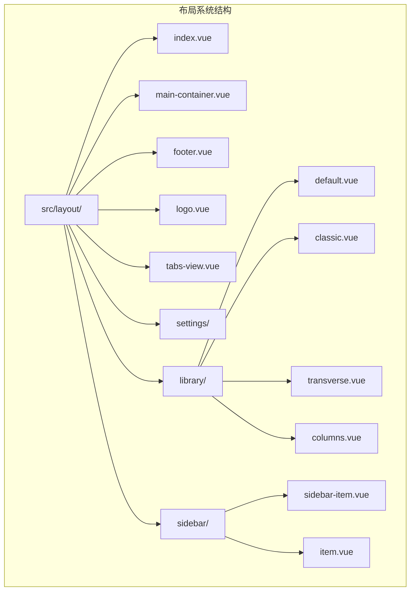

**图表来源**
- [src/layout/index.vue:1-33](file://src/layout/index.vue#L1-L33)
- [src/layout/library/default.vue:1-425](file://src/layout/library/default.vue#L1-L425)

**章节来源**
- [src/layout/index.vue:1-33](file://src/layout/index.vue#L1-L33)
- [src/layout/library/readme.md:1-8](file://src/layout/library/readme.md#L1-L8)

## 核心组件

布局系统的核心组件包括布局容器、主内容区、侧边栏、标签页导航等关键模块。

### 布局容器组件

布局容器组件负责根据用户配置动态选择合适的布局模板：

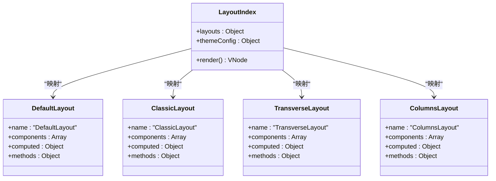

**图表来源**
- [src/layout/index.vue:13-18](file://src/layout/index.vue#L13-L18)
- [src/layout/library/default.vue:109-118](file://src/layout/library/default.vue#L109-L118)

### 主内容区组件

主内容区组件负责渲染页面主体内容，支持页面切换动画和缓存机制：

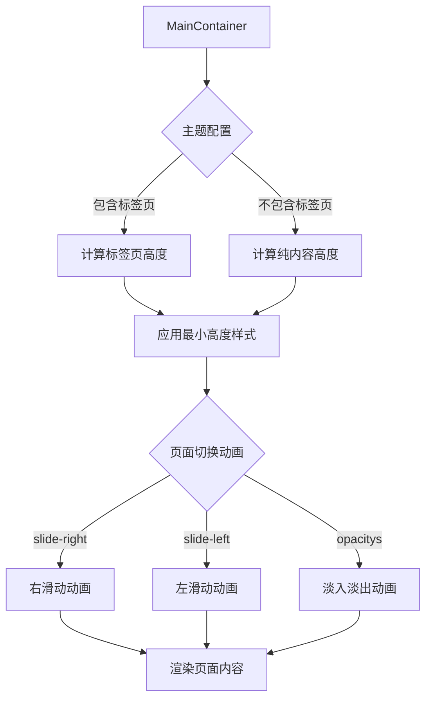

**图表来源**
- [src/layout/main-container.vue:36-72](file://src/layout/main-container.vue#L36-L72)

**章节来源**
- [src/layout/index.vue:1-33](file://src/layout/index.vue#L1-L33)
- [src/layout/main-container.vue:1-134](file://src/layout/main-container.vue#L1-L134)

## 架构概览

布局系统采用分层架构设计，通过 Vuex 状态管理实现配置的统一控制：

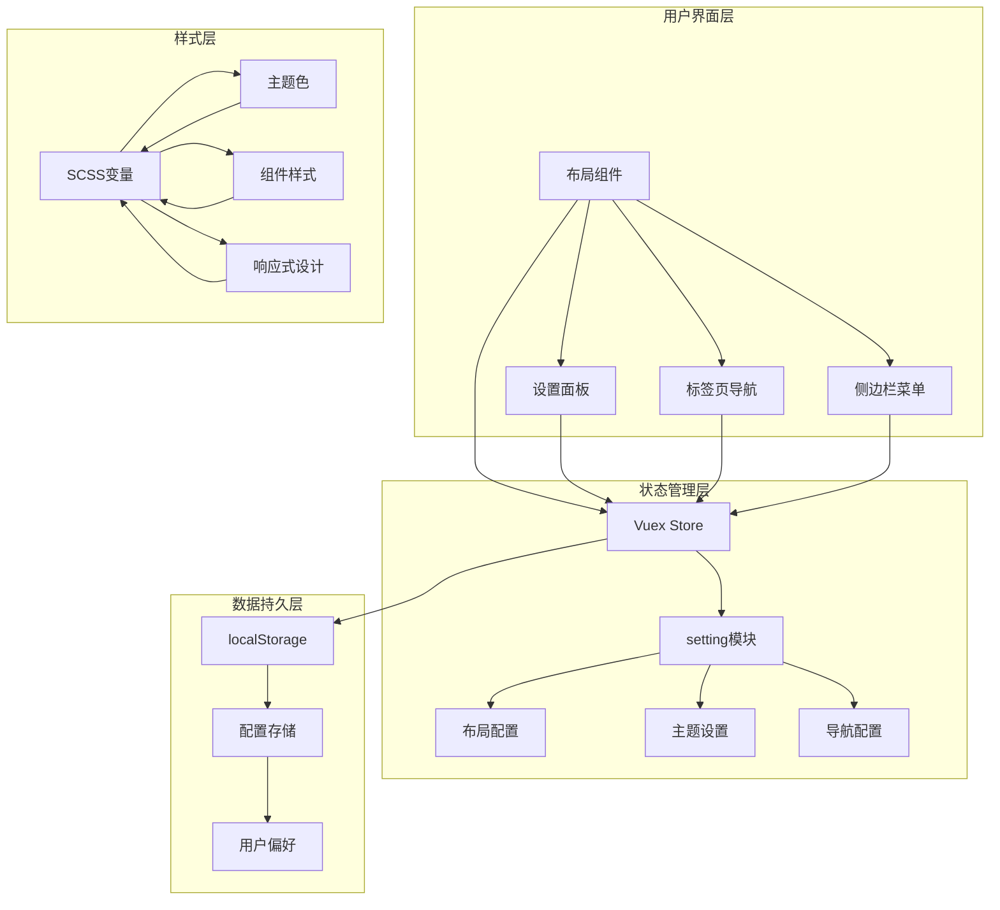

**图表来源**
- [src/store/modules/setting.js:104-104](file://src/store/modules/setting.js#L104-L104)
- [src/layout/settings/index.vue:193-212](file://src/layout/settings/index.vue#L193-L212)

## 详细组件分析

### 默认布局 (Default Layout)

默认布局是最常用的布局模式，采用经典的左侧菜单 + 右侧内容的结构：

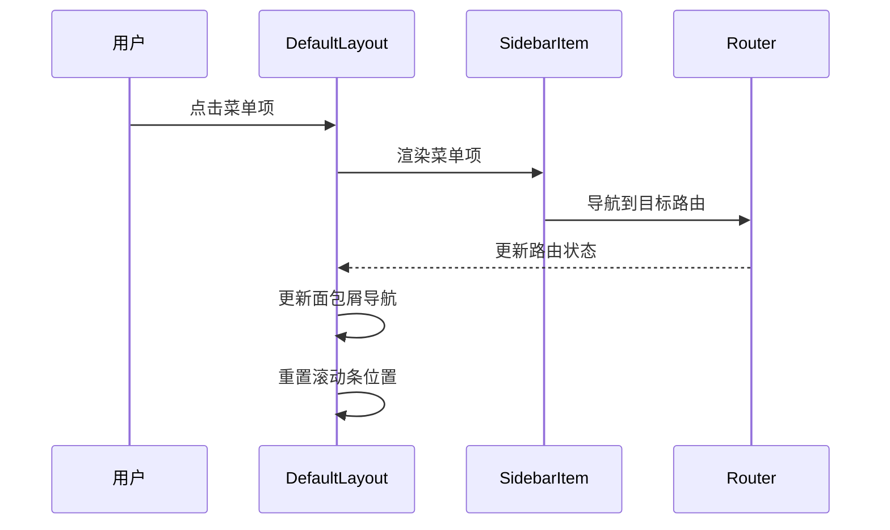

**图表来源**
- [src/layout/library/default.vue:162-220](file://src/layout/library/default.vue#L162-L220)

**更新** 默认布局现已增强滚动条复位功能，通过智能的滚动位置管理机制确保用户在不同页面间导航时获得一致的滚动体验。

默认布局的主要特点：
- 支持左侧菜单的展开/收起
- 集成面包屑导航系统
- 支持多级菜单嵌套
- 提供用户信息下拉菜单
- **增强的滚动条复位功能**：路由切换时自动重置滚动位置

**章节来源**
- [src/layout/library/default.vue:1-425](file://src/layout/library/default.vue#L1-L425)

### 经典布局 (Classic Layout)

经典布局采用顶部一级菜单 + 左侧二级菜单的设计模式：

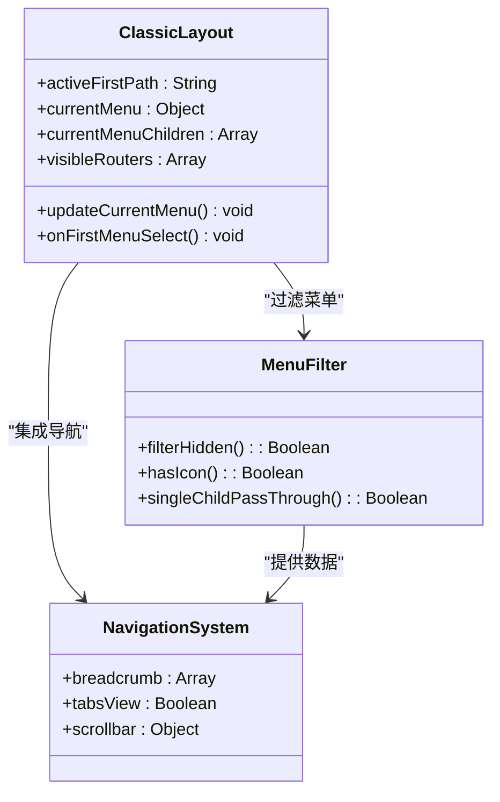

**图表来源**
- [src/layout/library/classic.vue:130-148](file://src/layout/library/classic.vue#L130-L148)

**章节来源**
- [src/layout/library/classic.vue:1-401](file://src/layout/library/classic.vue#L1-L401)

### 横向布局 (Transverse Layout)

横向布局将菜单放置在顶部，适合移动端或空间有限的场景：

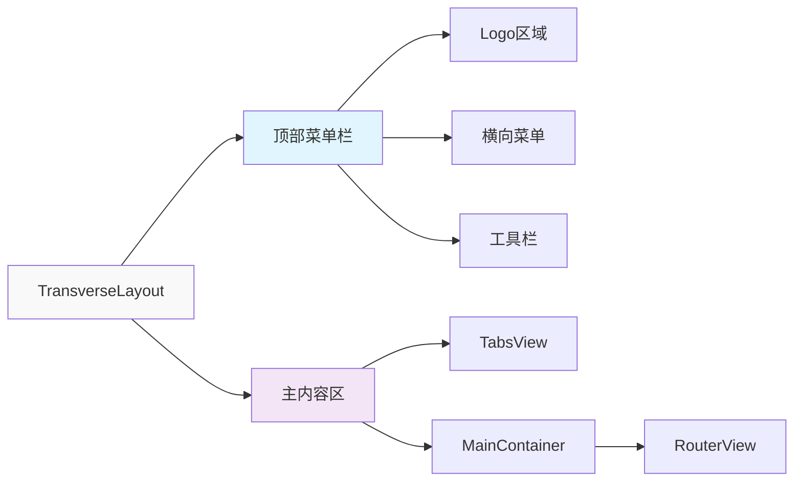

**图表来源**
- [src/layout/library/transverse.vue:5-62](file://src/layout/library/transverse.vue#L5-L62)

**章节来源**
- [src/layout/library/transverse.vue:1-285](file://src/layout/library/transverse.vue#L1-L285)

### 分栏布局 (Columns Layout)

分栏布局采用三列设计：左侧图标菜单 + 中间二级菜单 + 右侧内容区：

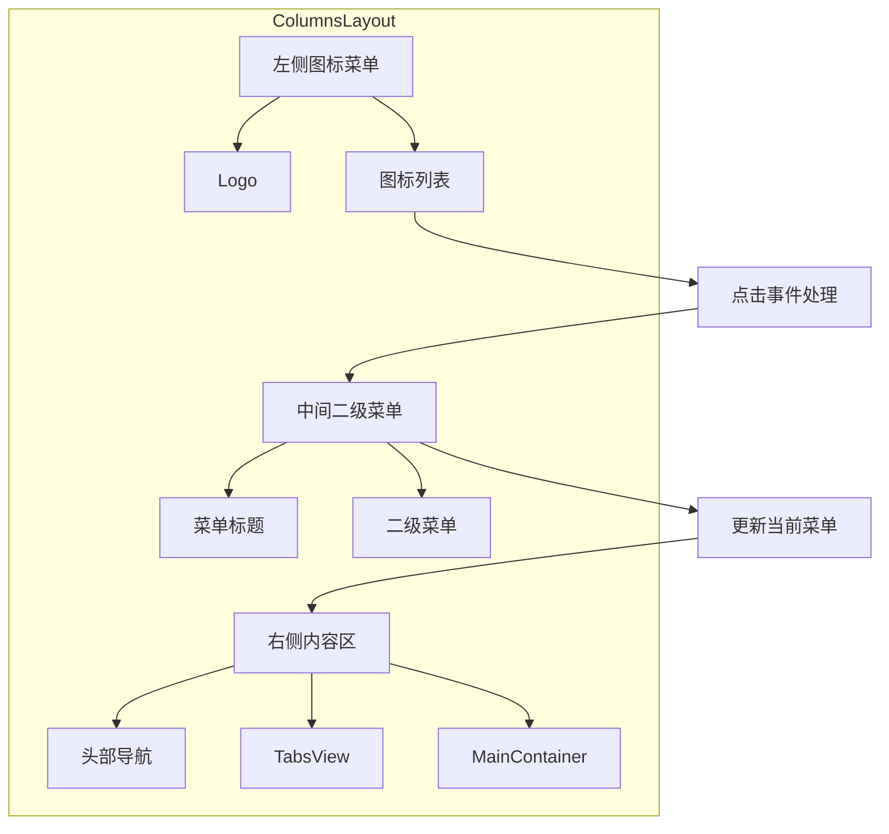

**图表来源**
- [src/layout/library/columns.vue:5-108](file://src/layout/library/columns.vue#L5-L108)

**章节来源**
- [src/layout/library/columns.vue:1-443](file://src/layout/library/columns.vue#L1-L443)

### 侧边栏菜单系统

侧边栏菜单系统采用递归组件设计，支持多级菜单的动态渲染：

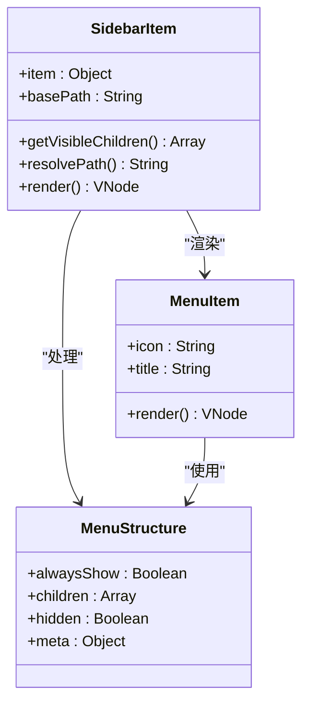

**图表来源**
- [src/layout/sidebar/sidebar-item.vue:41-80](file://src/layout/sidebar/sidebar-item.vue#L41-L80)

**章节来源**
- [src/layout/sidebar/sidebar-item.vue:1-90](file://src/layout/sidebar/sidebar-item.vue#L1-L90)
- [src/layout/sidebar/item.vue:1-48](file://src/layout/sidebar/item.vue#L1-L48)

### 设置面板组件

设置面板提供完整的布局自定义功能：

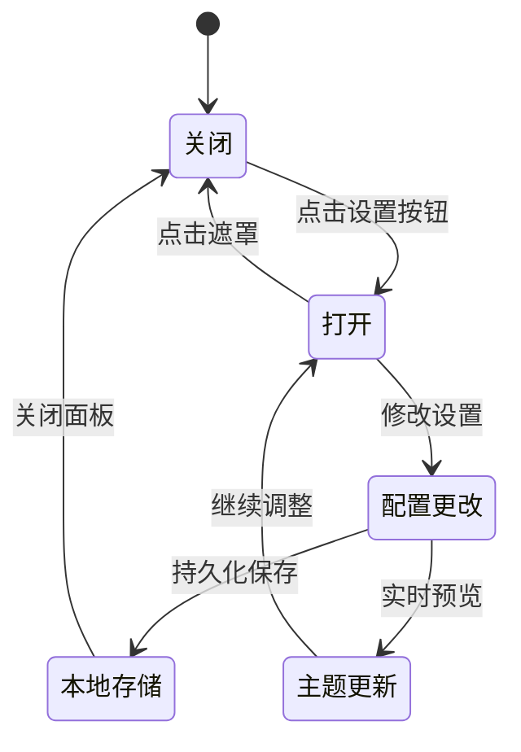

**图表来源**
- [src/layout/settings/index.vue:3-4](file://src/layout/settings/index.vue#L3-L4)

**章节来源**
- [src/layout/settings/index.vue:1-524](file://src/layout/settings/index.vue#L1-L524)

### 滚动条复位机制

**新增** 布局系统现已实现智能的滚动条复位功能，通过以下机制确保用户导航体验：

#### 默认布局滚动复位
- **路由监听器增强**：在 `$route` 变化时自动触发滚动条复位
- **延迟更新机制**：使用 `setTimeout` 和 `nextTick` 确保 DOM 更新完成后再重置滚动位置
- **兼容性处理**：支持 Element UI 滚动条组件的不同版本
- **异常安全**：包含 try-catch 机制防止滚动复位失败影响用户体验

#### 滚动条复位流程
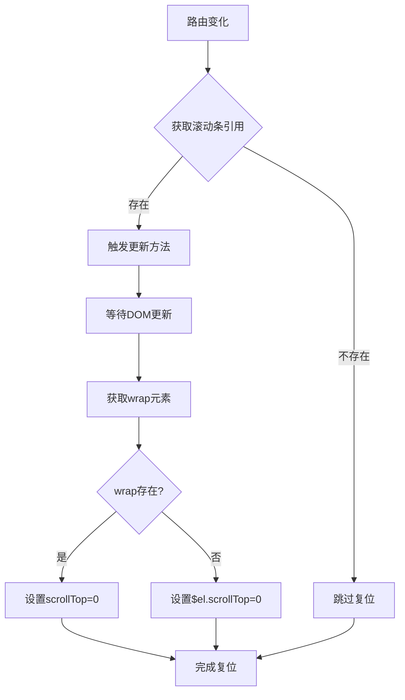

**图表来源**
- [src/layout/library/default.vue:168-188](file://src/layout/library/default.vue#L168-L188)

**章节来源**
- [src/layout/library/default.vue:148-188](file://src/layout/library/default.vue#L148-L188)

## 依赖关系分析

布局系统各组件之间的依赖关系清晰，遵循单一职责原则：

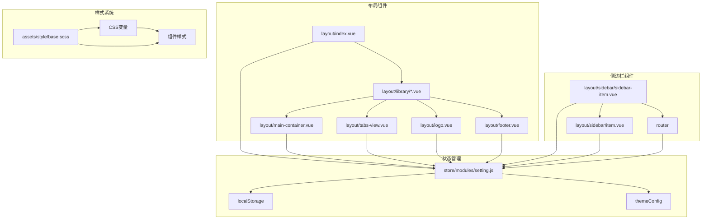

**图表来源**
- [src/store/modules/setting.js:70-102](file://src/store/modules/setting.js#L70-L102)
- [src/assets/style/base.scss:7-47](file://src/assets/style/base.scss#L7-L47)

**章节来源**
- [src/store/modules/setting.js:1-241](file://src/store/modules/setting.js#L1-L241)
- [src/assets/style/base.scss:1-125](file://src/assets/style/base.scss#L1-L125)

## 性能考虑

布局系统在设计时充分考虑了性能优化：

### 渲染优化
- 使用 Vue 的异步组件和动态导入减少初始包大小
- 实现虚拟滚动支持大量菜单项的高效渲染
- 采用防抖和节流机制优化用户交互响应

### 内存管理
- 合理使用 keep-alive 缓存页面组件
- 实施组件生命周期管理避免内存泄漏
- 优化事件监听器的注册和注销

### 网络优化
- 图标资源采用 SVG 格式减少 HTTP 请求
- 样式文件按需加载避免阻塞渲染
- 实现懒加载策略提升首屏加载速度

### 滚动性能优化
**新增** 滚动条复位功能已优化性能：
- **延迟执行**：使用 `setTimeout` 和 `nextTick` 避免阻塞渲染
- **条件检查**：仅在滚动条存在时执行复位操作
- **兼容处理**：支持多种滚动条组件的差异处理
- **异常安全**：包含错误捕获机制防止影响整体性能

## 故障排除指南

### 常见问题及解决方案

**布局切换异常**
- 检查 themeConfig.layout 配置是否正确
- 确认对应布局组件是否正确导入
- 验证 CSS 类名是否匹配

**菜单显示问题**
- 检查路由配置中的 meta 字段
- 确认权限验证逻辑是否正确
- 验证菜单项的 hidden 属性设置

**主题切换失效**
- 检查 CSS 变量是否正确设置
- 确认 data-theme 属性是否正确添加
- 验证主题色是否在 localStorage 中保存

**标签页功能异常**
- 检查 visitedTabsView 状态管理
- 确认路由守卫是否正确处理
- 验证标签页缓存机制

**滚动条复位问题**
**新增** 滚动条复位功能故障排除：
- 检查滚动条引用是否正确获取
- 确认 DOM 更新时机是否正确
- 验证滚动条组件版本兼容性
- 查看控制台错误日志定位问题

**章节来源**
- [src/layout/settings/index.vue:237-316](file://src/layout/settings/index.vue#L237-L316)
- [src/store/modules/setting.js:233-241](file://src/store/modules/setting.js#L233-L241)
- [src/layout/library/default.vue:168-188](file://src/layout/library/default.vue#L168-L188)

## 结论

Vue CMS 布局组件系统展现了优秀的架构设计和实现质量。通过模块化的设计理念、清晰的组件层次结构和完善的配置管理机制，该系统为用户提供了灵活且高性能的布局解决方案。

**更新** 布局系统现已显著增强了用户体验，特别是路由切换时的滚动条复位功能，通过智能的滚动位置管理机制，确保用户在不同页面间导航时获得一致、流畅的滚动体验。

主要优势包括：
- **高度可定制**：支持多种布局模式和主题配置
- **良好的用户体验**：流畅的页面切换动画和导航体验
- **强大的扩展性**：模块化设计便于功能扩展和维护
- **完善的配置管理**：基于 Vuex 的状态管理和持久化存储
- **智能滚动管理**：增强的滚动条复位功能，显著改善导航体验

该布局系统为构建现代化的企业级应用提供了坚实的技术基础，具有良好的可维护性和扩展前景。