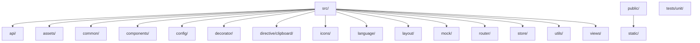
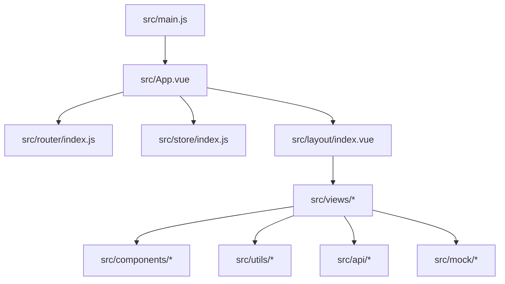
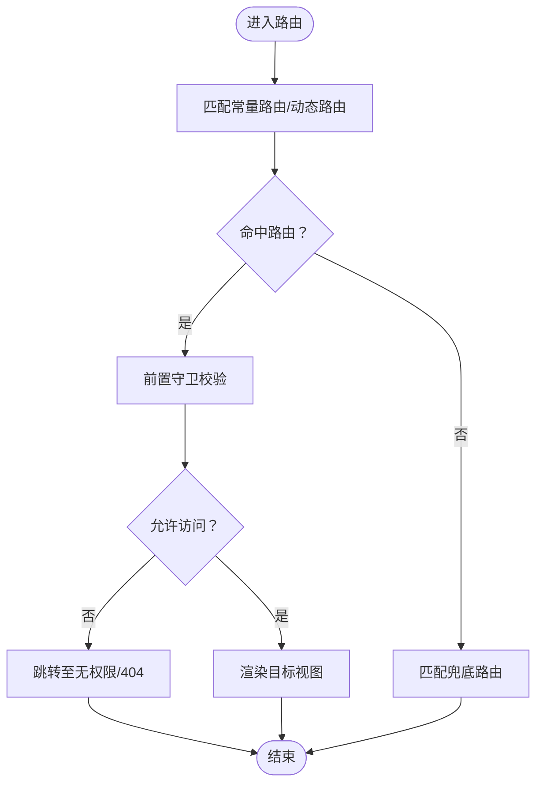
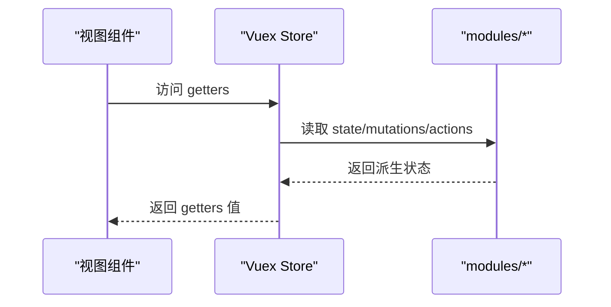
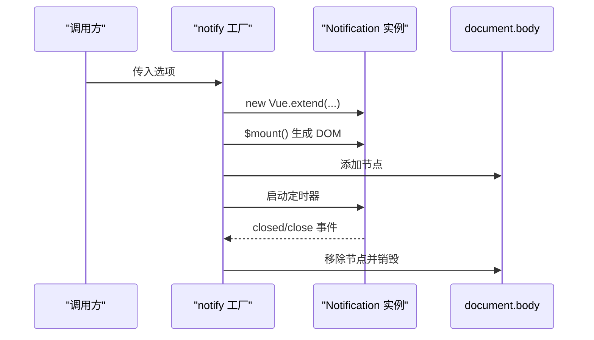
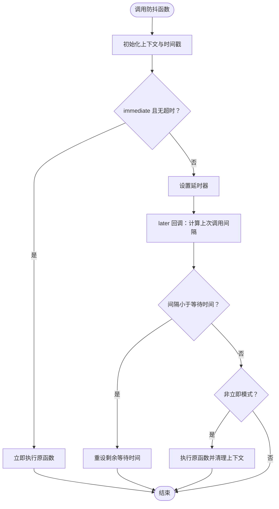
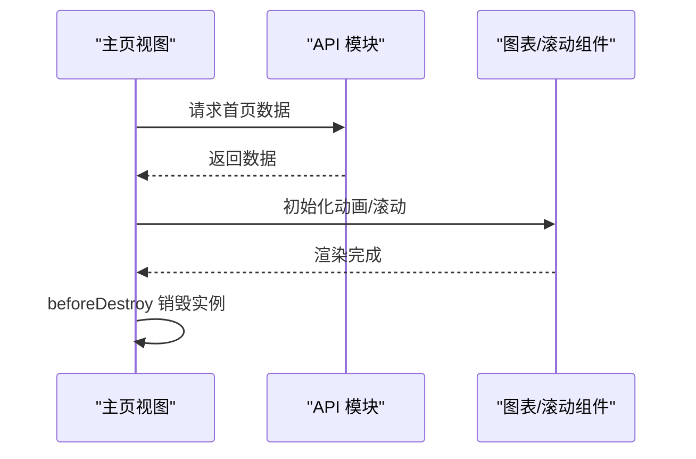
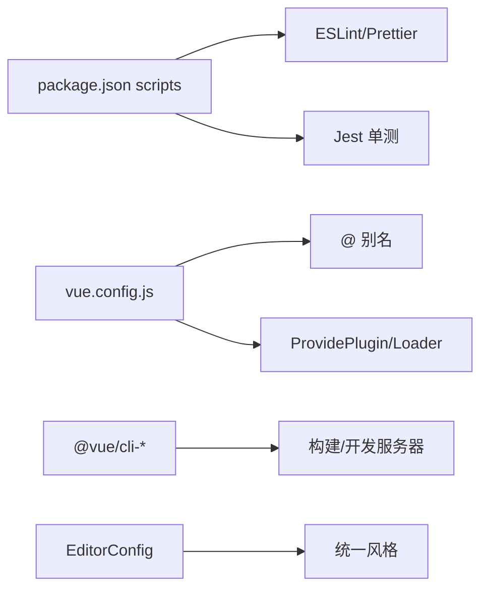

# 代码规范与风格

<cite>
**本文引用的文件**
- [package.json](file://package.json)
- [.editorconfig](file://.editorconfig)
- [babel.config.js](file://babel.config.js)
- [vue.config.js](file://vue.config.js)
- [jest.config.js](file://jest.config.js)
- [README.md](file://README.md)
- [NOTE.md](file://NOTE.md)
- [src/main.js](file://src/main.js)
- [src/App.vue](file://src/App.vue)
- [src/router/index.js](file://src/router/index.js)
- [src/store/index.js](file://src/store/index.js)
- [src/utils/index.js](file://src/utils/index.js)
- [src/common/readme.md](file://src/common/readme.md)
- [src/assets/style/index.scss](file://src/assets/style/index.scss)
- [src/layout/index.vue](file://src/layout/index.vue)
- [src/views/homepage/index.vue](file://src/views/homepage/index.vue)
- [src/components/notification/index.js](file://src/components/notification/index.js)
</cite>

## 目录
1. [简介](#简介)
2. [项目结构](#项目结构)
3. [核心组件](#核心组件)
4. [架构总览](#架构总览)
5. [详细组件分析](#详细组件分析)
6. [依赖关系分析](#依赖关系分析)
7. [性能考量](#性能考量)
8. [故障排查指南](#故障排查指南)
9. [结论](#结论)
10. [附录](#附录)

## 简介
本规范文档面向 Vue CMS 项目，旨在建立统一的 JavaScript/ES6+ 编码规范、Vue 组件编写规范与 CSS/SCSS 样式规范，明确文件命名约定、目录结构组织与模块化设计原则，并配套代码格式化、Lint 规则与自动化检查流程，提供注释规范、变量命名约定与函数设计原则，说明错误处理模式、日志记录标准与调试技巧，最后给出代码审查清单与质量保证流程。

## 项目结构
项目采用典型的 Vue CLI 2.x + Element UI 2.x 体系，结合按功能域划分的目录组织方式，包含 API、通用工具、组件、布局、视图、国际化、状态管理、装饰器与指令等模块。整体结构清晰，便于团队协作与长期维护。

**章节来源**
- [README.md: 目录结构说明:98-132](file://README.md#L98-L132)

## 核心组件
- 应用入口与全局配置：应用入口负责引入 UI 库、国际化、全局样式、图标与权限控制，并挂载根组件。
- 路由系统：采用常量路由、动态路由与末尾兜底路由的组合，支持嵌套路由与权限控制。
- 状态管理：自动扫描 modules 目录，集中注册模块与全局 getters，便于按域拆分与统一取值。
- 工具库：提供防抖、深拷贝、DOM 类名操作等常用工具函数。
- 通知组件：基于 Vue.extend 的消息提示组件，支持多实例堆叠与自动关闭。
- 布局系统：根据主题配置动态选择布局组件，便于扩展不同布局模板。
- 主页视图：集成图表、滚动、数字动画等能力，体现组件化与数据驱动的页面组织方式。

**章节来源**
- [src/main.js: 入口与全局配置:1-53](file://src/main.js#L1-L53)
- [src/router/index.js: 路由定义与注释:1-343](file://src/router/index.js#L1-L343)
- [src/store/index.js: 自动模块注册与 getters:1-74](file://src/store/index.js#L1-L74)
- [src/utils/index.js: 工具函数集合:1-122](file://src/utils/index.js#L1-L122)
- [src/components/notification/index.js: 通知组件实现:1-119](file://src/components/notification/index.js#L1-L119)
- [src/layout/index.vue: 布局选择器:1-32](file://src/layout/index.vue#L1-L32)
- [src/views/homepage/index.vue: 主页视图示例:1-654](file://src/views/homepage/index.vue#L1-L654)

## 架构总览
下图展示了从入口到视图层的关键交互路径，包括路由、状态管理与组件通信。

**图示来源**
- [src/main.js:1-53](file://src/main.js#L1-L53)
- [src/App.vue:1-35](file://src/App.vue#L1-L35)
- [src/router/index.js:1-343](file://src/router/index.js#L1-L343)
- [src/store/index.js:1-74](file://src/store/index.js#L1-L74)
- [src/layout/index.vue:1-32](file://src/layout/index.vue#L1-L32)

## 详细组件分析

### 路由系统与权限模型
- 路由结构：常量路由（无需权限）、动态路由（按权限生成）、末尾兜底路由（404/无权限/通配）。
- 路由属性：支持 meta 标签、keep-alive 控制、iframe 内嵌、菜单显隐等。
- 路由重置：提供 resetRouter 方法以更新 matcher 并重新绑定守卫。

**图示来源**
- [src/router/index.js:43-111](file://src/router/index.js#L43-L111)
- [src/router/index.js:117-320](file://src/router/index.js#L117-L320)
- [src/router/index.js:322-343](file://src/router/index.js#L322-L343)

**章节来源**
- [src/router/index.js: 路由注释与结构:14-36](file://src/router/index.js#L14-L36)
- [src/router/index.js: 常量/动态/兜底路由:43-111](file://src/router/index.js#L43-L111)
- [src/router/index.js: 动态路由示例:117-320](file://src/router/index.js#L117-L320)
- [src/router/index.js: 路由重置:322-343](file://src/router/index.js#L322-L343)

### 状态管理与模块化
- 自动模块注册：通过 require.context 扫描 modules 目录，按文件名注册模块。
- 全局 getters：集中提供常用派生状态，便于跨组件取值。
- 路径与别名：使用 BASE_URL 适配子目录部署场景。

**图示来源**
- [src/store/index.js:10-17](file://src/store/index.js#L10-L17)
- [src/store/index.js:24-68](file://src/store/index.js#L24-L68)

**章节来源**
- [src/store/index.js: 自动模块注册:10-17](file://src/store/index.js#L10-L17)
- [src/store/index.js: getters 设计:24-68](file://src/store/index.js#L24-L68)

### 通知组件与生命周期管理
- 组件创建：通过 Vue.extend 生成构造器，支持传参与默认配置。
- 多实例堆叠：计算垂直偏移，实现消息逐条向上推移。
- 生命周期：自动计时器、挂载/销毁钩子、事件回调清理。

**图示来源**
- [src/components/notification/index.js:74-113](file://src/components/notification/index.js#L74-L113)

**章节来源**
- [src/components/notification/index.js: 组件工厂与实例管理:1-119](file://src/components/notification/index.js#L1-L119)

### 工具库与通用函数
- 防抖：支持立即执行与延迟执行两种模式，内部维护超时与时间戳。
- 深拷贝：递归复制对象或数组，注意对循环引用的处理。
- DOM 类名：提供 has/addClass/removeClass/toggleClass 等便捷方法。

**图示来源**
- [src/utils/index.js:12-44](file://src/utils/index.js#L12-L44)

**章节来源**
- [src/utils/index.js: 防抖实现:12-44](file://src/utils/index.js#L12-L44)
- [src/utils/index.js: 深拷贝实现:54-67](file://src/utils/index.js#L54-L67)
- [src/utils/index.js: DOM 类名工具:75-119](file://src/utils/index.js#L75-L119)

### 主页视图与数据流
- 页面结构：卡片、图表、排行榜、饼图等模块组合。
- 数据获取：通过 API 模块拉取数据，使用 better-scroll 实现滚动，countup.js 实现数字动画。
- 生命周期：created 阶段发起请求，mounted 后初始化滚动与动画，beforeDestroy 清理实例。

**图示来源**
- [src/views/homepage/index.vue:178-277](file://src/views/homepage/index.vue#L178-L277)

**章节来源**
- [src/views/homepage/index.vue: 数据与生命周期:178-277](file://src/views/homepage/index.vue#L178-L277)

## 依赖关系分析
- 构建与脚本：通过 Vue CLI 提供 serve/build/test/lint 等命令，支持 Prettier 自动修复与 ESLint 校验。
- 开发工具链：Babel 预设、Webpack 别名与插件、SVG Sprite Loader、SplitChunks 优化。
- 测试：Jest 单测配置，配合 @vue/cli-plugin-unit-jest。
- 代码风格：EditorConfig 统一缩进、换行与空白处理。

**图示来源**
- [package.json:24-31](file://package.json#L24-L31)
- [vue.config.js:51-65](file://vue.config.js#L51-L65)
- [vue.config.js:90-102](file://vue.config.js#L90-L102)
- [vue.config.js:116-141](file://vue.config.js#L116-L141)
- [.editorconfig:1-26](file://.editorconfig#L1-L26)
- [jest.config.js:1-4](file://jest.config.js#L1-L4)

**章节来源**
- [package.json: 脚本与依赖:24-98](file://package.json#L24-L98)
- [vue.config.js: 别名与插件:51-65](file://vue.config.js#L51-L65)
- [vue.config.js: SVG Sprite 配置:90-102](file://vue.config.js#L90-L102)
- [vue.config.js: SplitChunks 与 runtimeChunk:116-141](file://vue.config.js#L116-L141)
- [.editorconfig: 编辑器风格:1-26](file://.editorconfig#L1-L26)
- [jest.config.js: Jest 配置:1-4](file://jest.config.js#L1-L4)

## 性能考量
- 资源分包：利用 SplitChunks 将第三方库、Element UI 与公共组件拆分为独立 chunk，提升缓存命中率。
- 首屏优化：禁用 prefetch，按需加载路由组件，减少初始包体积。
- 运行时优化：启用 runtimeChunk 单独提取，降低重复代码。
- 构建产物：关闭生产环境 source map，缩短构建时间并减小体积。

**章节来源**
- [vue.config.js: SplitChunks 与 runtimeChunk:116-141](file://vue.config.js#L116-L141)
- [vue.config.js: 禁用 prefetch 与 preload:79-87](file://vue.config.js#L79-L87)
- [vue.config.js: 生产环境 source map:27-27](file://vue.config.js#L27-L27)

## 故障排查指南
- 路由白屏或 404：确认路由是否正确加入 constantRoutes/asyncRoutes/endBasicRoutes，守卫逻辑是否允许访问。
- 图表/滚动异常：检查 DOM 是否已渲染完成（$nextTick），实例是否在 beforeDestroy 中销毁。
- 通知组件未消失：确认定时器是否启动、事件监听是否清理。
- 样式覆盖问题：检查 scoped 作用域与深度选择器使用，避免过度依赖 !important。
- 国际化文案缺失：核对 i18n 键名与语言包映射，确保翻译键存在。
- Mock 与真实接口切换：确认入口是否加载 mock/index.js，或注释以连接后端。

**章节来源**
- [src/router/index.js: 路由结构与守卫:322-343](file://src/router/index.js#L322-L343)
- [src/views/homepage/index.vue: 生命周期与实例销毁:267-271](file://src/views/homepage/index.vue#L267-L271)
- [src/components/notification/index.js: 定时器与事件清理:44-46](file://src/components/notification/index.js#L44-L46)
- [src/main.js: Mock 加载开关:34-34](file://src/main.js#L34-L34)

## 结论
本规范文档基于现有代码库提炼出统一的编码与风格标准，涵盖 ES6+、Vue 组件、CSS/SCSS、文件命名与目录组织、模块化设计、格式化与 Lint、错误处理与日志、调试技巧以及代码审查与质量保障流程。建议团队在开发过程中严格遵循，持续迭代，确保代码一致性与可维护性。

## 附录

### 代码格式化与 Lint 配置
- 使用 EditorConfig 统一缩进、换行与空白处理。
- 使用 ESLint + Prettier 进行代码风格检查与自动修复。
- 使用 Babel 进行语法转换与 polyfill 策略配置。
- 使用 Vue CLI 的 lint 脚本与 --fix 参数进行批量修复。

**章节来源**
- [.editorconfig: 编辑器风格:1-26](file://.editorconfig#L1-L26)
- [package.json: lint 脚本:29-31](file://package.json#L29-L31)
- [babel.config.js: Babel 预设:1-12](file://babel.config.js#L1-L12)

### 文件命名约定与目录组织
- 目录与文件：采用 kebab-case 命名，组件文件以 index.vue 命名，模块文件以 index.js 命名。
- 组件：单文件组件按功能域放置在 components/ 下，视图组件放置在 views/ 下。
- 资源：静态资源位于 assets/ 下，样式入口位于 assets/style/index.scss。
- 国际化：语言包位于 language/ 下，键名使用层级化命名以增强可读性。

**章节来源**
- [src/assets/style/index.scss: 样式入口:1-4](file://src/assets/style/index.scss#L1-L4)
- [src/common/readme.md: 通用方法说明:1-8](file://src/common/readme.md#L1-L8)

### 注释规范与变量命名约定
- 注释：函数/类前使用描述性注释，复杂逻辑处补充行内注释；避免显而易见的注释。
- 变量命名：使用语义化英文，函数使用动词短语，常量使用全大写加下划线，布尔值以 is_/has_/can_ 开头。
- 组件命名：使用帕斯卡命名法，文件名与组件名一致，避免缩写。

**章节来源**
- [src/utils/index.js: 函数与变量命名示例:12-119](file://src/utils/index.js#L12-L119)
- [src/components/notification/index.js: 组件命名与导出:115-119](file://src/components/notification/index.js#L115-L119)

### 错误处理模式与日志记录
- 错误捕获：在 Promise 链中使用 catch，避免静默失败。
- 日志记录：开发环境可使用 console，生产环境建议使用统一日志上报。
- 统一提示：使用通知组件或 UI 组件库的消息提示，避免直接 alert。

**章节来源**
- [src/views/homepage/index.vue: 错误处理示例:240-264](file://src/views/homepage/index.vue#L240-L264)
- [src/components/notification/index.js: 统一提示:74-113](file://src/components/notification/index.js#L74-L113)

### 调试技巧
- 使用 Vue DevTools 检查组件树、状态与事件。
- 在路由守卫与生命周期钩子中设置断点，定位渲染时机问题。
- 对异步数据与 DOM 更新使用 $nextTick 确保时机正确。
- 使用浏览器网络面板检查接口与资源加载。

**章节来源**
- [src/views/homepage/index.vue: $nextTick 使用:200-209](file://src/views/homepage/index.vue#L200-L209)

### 代码审查清单
- 代码风格：是否符合 EditorConfig、ESLint 与 Prettier 规范。
- 可读性：注释是否充分，变量与函数命名是否清晰。
- 性能：是否存在不必要的重渲染、内存泄漏与阻塞主线程的操作。
- 安全：输入校验、权限控制与接口安全。
- 兼容性：浏览器支持与 polyfill 使用。
- 可测试性：是否易于单元测试与集成测试。

### 质量保证流程
- 提交前：运行 lint 与格式化修复，执行单测并通过。
- 提交流程：使用 PR 模plate，包含变更说明与影响评估。
- 合并策略：至少一名成员 Review 通过，CI 通过后再合并。
- 回归测试：涉及 UI/路由/状态变更后进行回归测试。