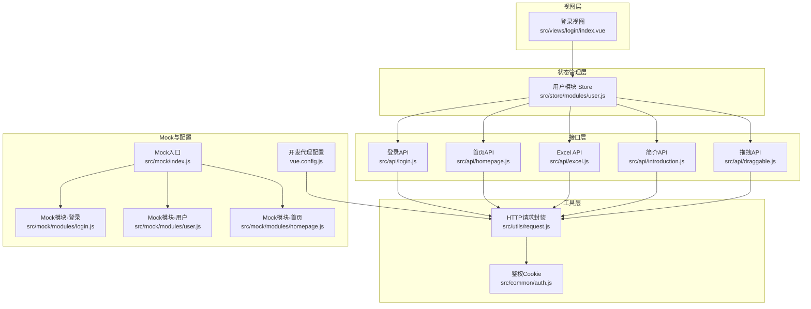
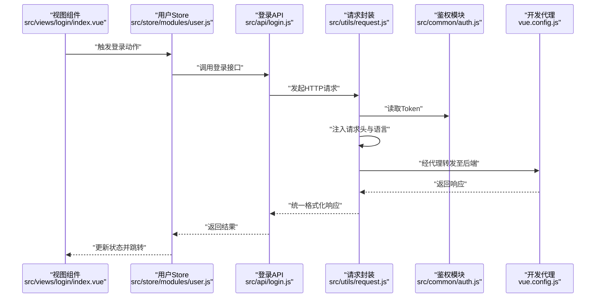
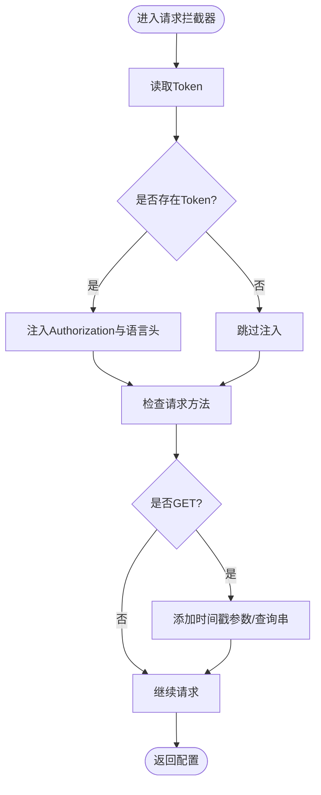
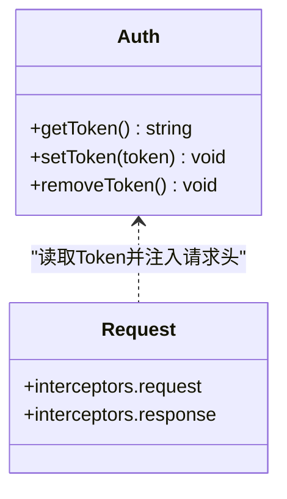
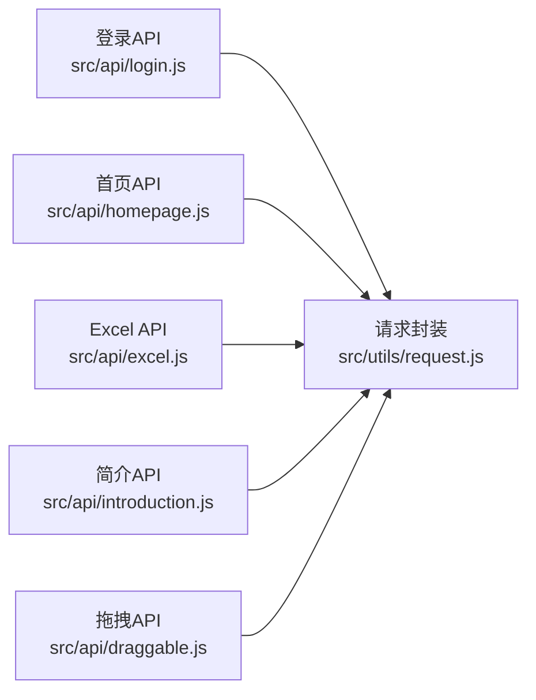
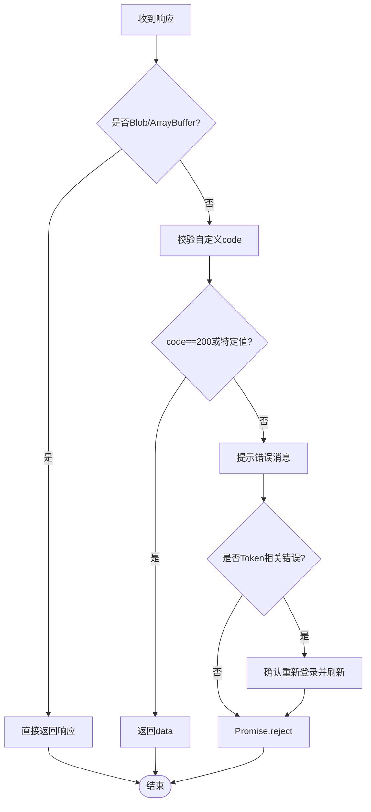
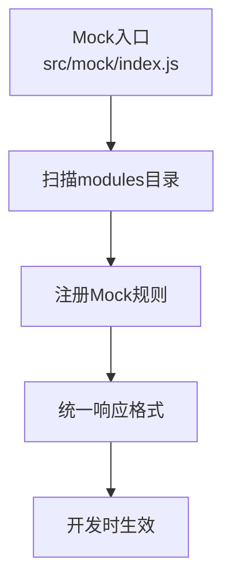
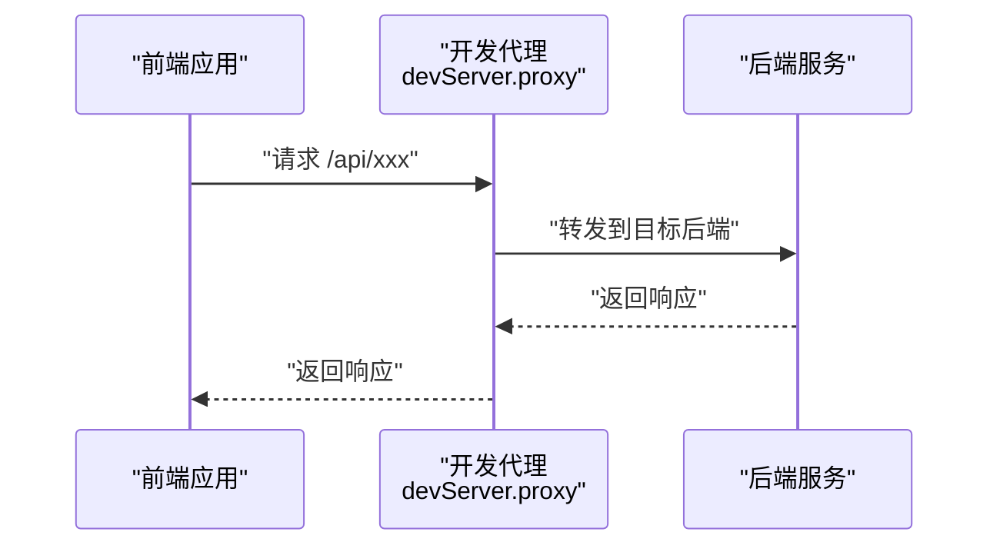
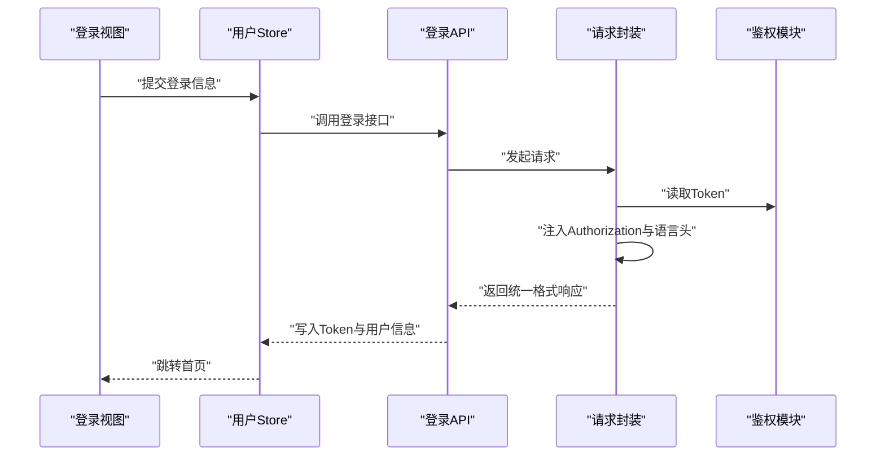
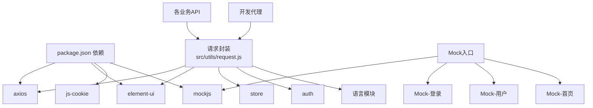

# HTTP请求封装

<cite>
**本文引用的文件**
- [src/utils/request.js](file://src/utils/request.js)
- [src/common/auth.js](file://src/common/auth.js)
- [src/mock/index.js](file://src/mock/index.js)
- [src/mock/modules/login.js](file://src/mock/modules/login.js)
- [src/mock/modules/user.js](file://src/mock/modules/user.js)
- [src/mock/modules/homepage.js](file://src/mock/modules/homepage.js)
- [src/api/login.js](file://src/api/login.js)
- [src/api/homepage.js](file://src/api/homepage.js)
- [src/api/excel.js](file://src/api/excel.js)
- [src/api/introduction.js](file://src/api/introduction.js)
- [src/api/draggable.js](file://src/api/draggable.js)
- [src/store/modules/user.js](file://src/store/modules/user.js)
- [src/views/login/index.vue](file://src/views/login/index.vue)
- [src/main.js](file://src/main.js)
- [vue.config.js](file://vue.config.js)
- [package.json](file://package.json)
</cite>

## 目录
1. [简介](#简介)
2. [项目结构](#项目结构)
3. [核心组件](#核心组件)
4. [架构总览](#架构总览)
5. [详细组件分析](#详细组件分析)
6. [依赖关系分析](#依赖关系分析)
7. [性能考量](#性能考量)
8. [故障排查指南](#故障排查指南)
9. [结论](#结论)
10. [附录](#附录)

## 简介
本指南围绕Vue CMS项目的HTTP请求封装进行系统化说明，重点覆盖：
- Axios实例配置与基础参数
- 请求/响应拦截器的实现原理与行为
- API接口封装模式与统一管理
- 错误处理机制与响应数据格式化
- 请求超时、重试与取消请求的实现思路
- Mock数据集成与开发调试技巧
- 认证Token处理、请求头配置与跨域解决方案
- API接口的统一管理方式与扩展机制

## 项目结构
该项目采用“工具层-模块层-视图层”的分层组织方式：
- 工具层：请求封装与通用能力（如鉴权）
- 模块层：按业务划分的API模块与Mock模块
- 视图层：页面组件调用Store，Store再调用API

图表来源
- [src/views/login/index.vue](file://src/views/login/index.vue)
- [src/store/modules/user.js](file://src/store/modules/user.js)
- [src/api/login.js](file://src/api/login.js)
- [src/api/homepage.js](file://src/api/homepage.js)
- [src/api/excel.js](file://src/api/excel.js)
- [src/api/introduction.js](file://src/api/introduction.js)
- [src/api/draggable.js](file://src/api/draggable.js)
- [src/utils/request.js](file://src/utils/request.js)
- [src/common/auth.js](file://src/common/auth.js)
- [src/mock/index.js](file://src/mock/index.js)
- [src/mock/modules/login.js](file://src/mock/modules/login.js)
- [src/mock/modules/user.js](file://src/mock/modules/user.js)
- [src/mock/modules/homepage.js](file://src/mock/modules/homepage.js)
- [vue.config.js](file://vue.config.js)

章节来源
- [src/main.js](file://src/main.js)
- [vue.config.js](file://vue.config.js)

## 核心组件
- Axios实例与拦截器
  - 实例创建：基础URL、超时、默认请求头
  - 请求拦截器：注入Token、语言、GET防缓存策略
  - 响应拦截器：统一错误提示、Token失效处理、超时与网络错误提示
- 鉴权模块：基于Cookie的Token获取/设置/移除
- API模块：按业务拆分，统一通过请求封装发起
- Mock模块：统一响应格式、自动扫描注册、可配置延迟
- 开发代理：基于Vue CLI的devServer代理，解决跨域

章节来源
- [src/utils/request.js](file://src/utils/request.js)
- [src/common/auth.js](file://src/common/auth.js)
- [src/mock/index.js](file://src/mock/index.js)
- [vue.config.js](file://vue.config.js)

## 架构总览
下图展示从前端调用到后端响应的关键流程，以及Mock与真实后端两种路径。

图表来源
- [src/views/login/index.vue](file://src/views/login/index.vue)
- [src/store/modules/user.js](file://src/store/modules/user.js)
- [src/api/login.js](file://src/api/login.js)
- [src/utils/request.js](file://src/utils/request.js)
- [src/common/auth.js](file://src/common/auth.js)
- [vue.config.js](file://vue.config.js)

## 详细组件分析

### Axios实例与拦截器
- 实例配置
  - 基础URL：通过环境变量注入
  - 超时：默认5秒
  - 默认Content-Type：JSON
- 请求拦截器
  - 注入Authorization头（当前实现存在字符串拼接问题，建议修正）
  - 设置Cache-Control为no-cache
  - 透传当前语言到Accept-Language
  - GET请求加入时间戳参数或查询串，避免缓存
- 响应拦截器
  - 文件流直接透传
  - 自定义code判定：非200与特定错误码触发提示与登出逻辑
  - 特殊code提示：用于业务提示
  - 超时与网络错误统一提示
  - 返回Promise.reject以便上层捕获

图表来源
- [src/utils/request.js](file://src/utils/request.js)

章节来源
- [src/utils/request.js](file://src/utils/request.js)

### 鉴权与Token处理
- Token来源：Cookie，键名来自环境变量
- 提供获取、设置、移除方法
- 请求拦截器中读取并注入到Authorization头（注意实现细节）

图表来源
- [src/common/auth.js](file://src/common/auth.js)
- [src/utils/request.js](file://src/utils/request.js)

章节来源
- [src/common/auth.js](file://src/common/auth.js)
- [src/utils/request.js](file://src/utils/request.js)

### API接口封装模式
- 按业务模块拆分API文件，统一导出函数
- 所有API均通过请求封装发起，确保拦截器与统一处理生效
- 示例：
  - 登录/登出/用户信息：登录模块API
  - 首页聚合数据：首页模块API
  - Excel相关：Excel模块API
  - 其他业务：相应模块API

图表来源
- [src/api/login.js](file://src/api/login.js)
- [src/api/homepage.js](file://src/api/homepage.js)
- [src/api/excel.js](file://src/api/excel.js)
- [src/api/introduction.js](file://src/api/introduction.js)
- [src/api/draggable.js](file://src/api/draggable.js)
- [src/utils/request.js](file://src/utils/request.js)

章节来源
- [src/api/login.js](file://src/api/login.js)
- [src/api/homepage.js](file://src/api/homepage.js)
- [src/api/excel.js](file://src/api/excel.js)
- [src/api/introduction.js](file://src/api/introduction.js)
- [src/api/draggable.js](file://src/api/draggable.js)

### 错误处理与响应格式化
- 统一响应格式：后端返回体包含code/message/data
- 错误分支：
  - 文件流：直接透传
  - 非200与特定错误码：弹窗提示并触发重新登录流程
  - 特殊code：警告提示
  - 超时与网络错误：统一提示
- 上层Promise.reject便于调用方处理

图表来源
- [src/utils/request.js](file://src/utils/request.js)

章节来源
- [src/utils/request.js](file://src/utils/request.js)

### Mock数据集成与开发调试
- Mock入口：定义通用响应格式、设置随机延迟、自动扫描modules目录并注册
- 模块示例：
  - 登录模块：根据用户名返回用户信息
  - 用户模块：根据当前Token返回用户信息
  - 首页模块：生成首页聚合数据与排行榜
- 开发阶段：入口处引入Mock，无需后端即可联调

图表来源
- [src/mock/index.js](file://src/mock/index.js)
- [src/mock/modules/login.js](file://src/mock/modules/login.js)
- [src/mock/modules/user.js](file://src/mock/modules/user.js)
- [src/mock/modules/homepage.js](file://src/mock/modules/homepage.js)

章节来源
- [src/mock/index.js](file://src/mock/index.js)
- [src/mock/modules/login.js](file://src/mock/modules/login.js)
- [src/mock/modules/user.js](file://src/mock/modules/user.js)
- [src/mock/modules/homepage.js](file://src/mock/modules/homepage.js)
- [src/main.js](file://src/main.js)

### 跨域与开发代理
- 通过Vue CLI devServer配置代理，将基础路径前缀转发到目标后端
- 支持跨域场景下的本地联调

图表来源
- [vue.config.js](file://vue.config.js)

章节来源
- [vue.config.js](file://vue.config.js)

### 认证流程与请求头配置
- 登录成功后，Store写入Token并持久化
- 请求拦截器读取Token并注入Authorization头
- Accept-Language透传当前语言
- GET请求加入时间戳参数避免缓存

图表来源
- [src/views/login/index.vue](file://src/views/login/index.vue)
- [src/store/modules/user.js](file://src/store/modules/user.js)
- [src/api/login.js](file://src/api/login.js)
- [src/utils/request.js](file://src/utils/request.js)
- [src/common/auth.js](file://src/common/auth.js)

章节来源
- [src/views/login/index.vue](file://src/views/login/index.vue)
- [src/store/modules/user.js](file://src/store/modules/user.js)
- [src/api/login.js](file://src/api/login.js)
- [src/utils/request.js](file://src/utils/request.js)
- [src/common/auth.js](file://src/common/auth.js)

## 依赖关系分析
- 请求封装依赖：
  - Element UI的消息与对话框组件（用于提示与确认）
  - Store（用于触发登出）
  - 鉴权模块（读取Token）
  - 语言模块（读取当前语言）
- API模块依赖请求封装
- Mock模块依赖MockJS与通用响应格式
- 开发代理依赖Vue CLI配置

图表来源
- [package.json](file://package.json)
- [src/utils/request.js](file://src/utils/request.js)
- [src/api/login.js](file://src/api/login.js)
- [src/mock/index.js](file://src/mock/index.js)
- [vue.config.js](file://vue.config.js)

章节来源
- [package.json](file://package.json)
- [src/utils/request.js](file://src/utils/request.js)
- [src/api/login.js](file://src/api/login.js)
- [src/mock/index.js](file://src/mock/index.js)
- [vue.config.js](file://vue.config.js)

## 性能考量
- 请求缓存控制：GET请求加入时间戳参数，避免浏览器缓存导致的数据陈旧
- 统一超时：5秒超时有助于快速反馈，避免长时间阻塞
- 代理转发：开发环境通过代理避免跨域带来的额外握手成本
- 响应格式化：统一的code/message/data结构便于前端快速判断与处理

## 故障排查指南
- 登录后仍提示未登录
  - 检查请求拦截器是否正确注入Authorization头
  - 确认Cookie键名与后端一致
- 超时或网络错误
  - 查看响应拦截器对超时与网络错误的提示逻辑
  - 检查开发代理配置是否正确
- Mock数据不生效
  - 确认入口已引入Mock
  - 检查模块state开关与URL正则匹配
- GET请求返回缓存数据
  - 确认请求拦截器已为GET注入时间戳参数

章节来源
- [src/utils/request.js](file://src/utils/request.js)
- [src/common/auth.js](file://src/common/auth.js)
- [src/mock/index.js](file://src/mock/index.js)
- [vue.config.js](file://vue.config.js)

## 结论
该HTTP请求封装以Axios为核心，结合拦截器实现了统一的请求头注入、错误处理与响应格式化。配合Mock模块与开发代理，能够高效完成前后端分离的联调与开发。建议后续优化点包括：修正Authorization头拼接问题、补充重试与取消请求能力、完善统一的错误码与提示策略。

## 附录
- 环境变量与代理
  - 基础API前缀与代理目标由环境变量控制
  - 开发代理将前缀路径重写到根路径并开启跨域
- 依赖版本
  - axios、element-ui、js-cookie、mockjs等核心依赖已在package.json中声明

章节来源
- [vue.config.js](file://vue.config.js)
- [package.json](file://package.json)