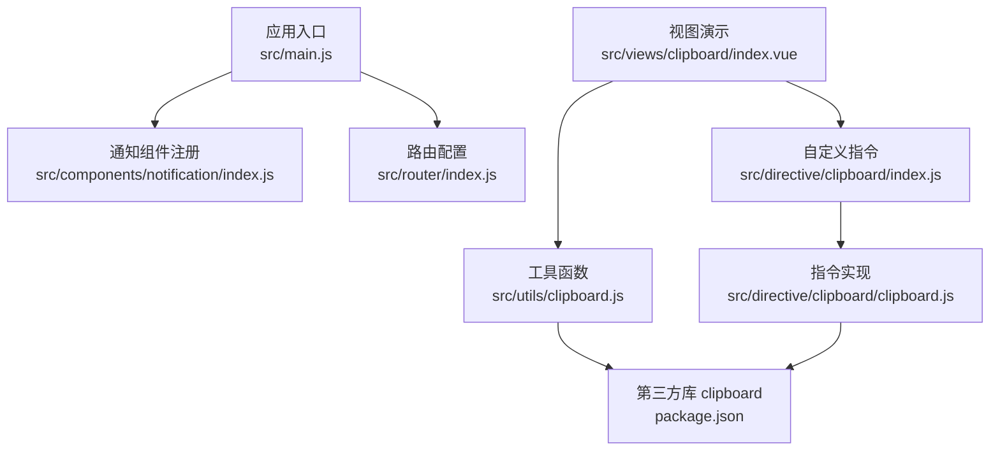
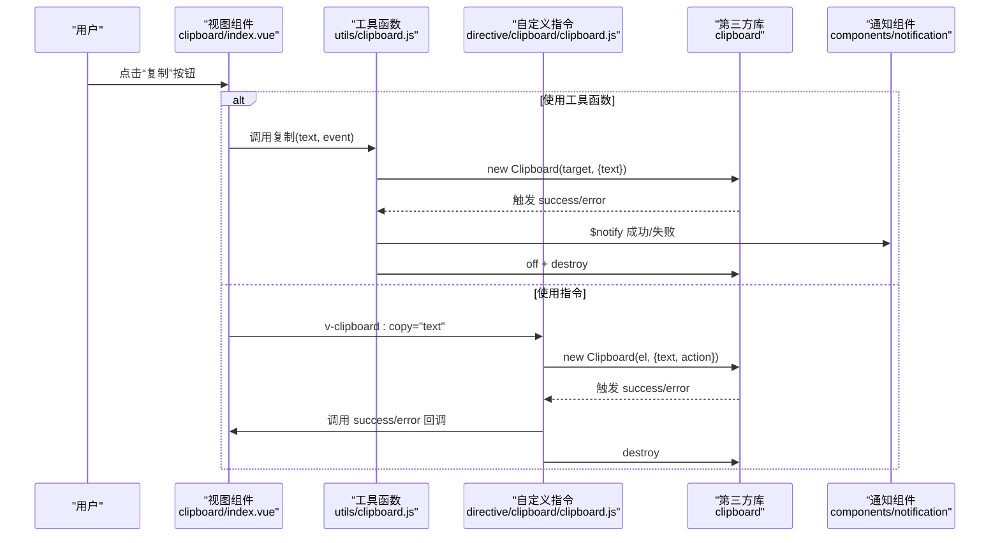
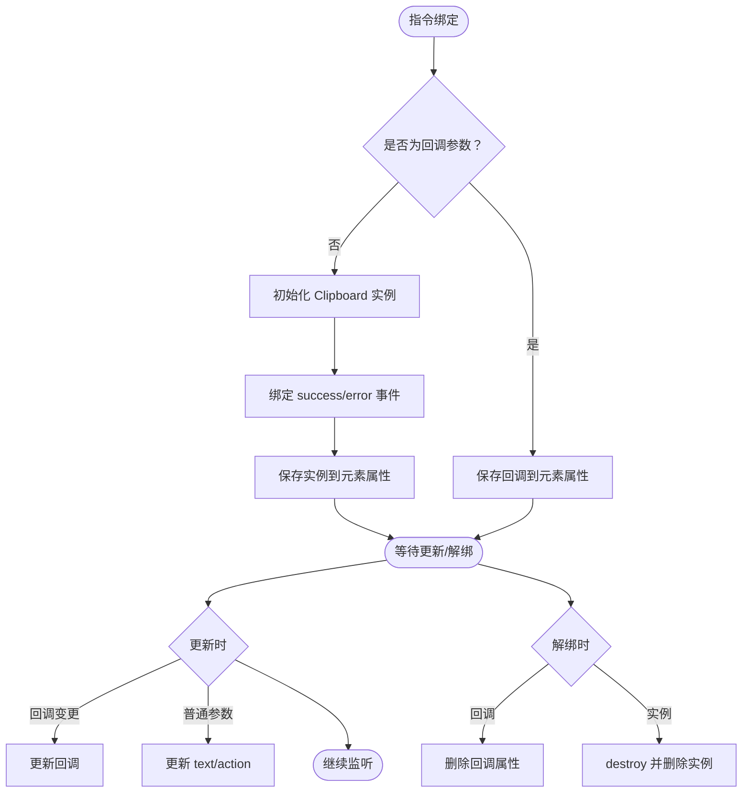
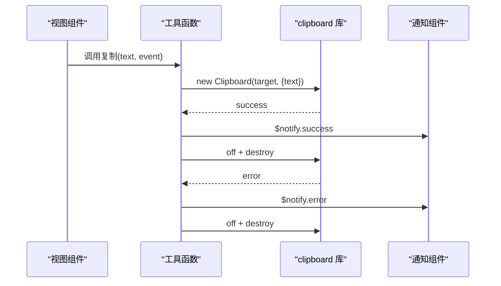
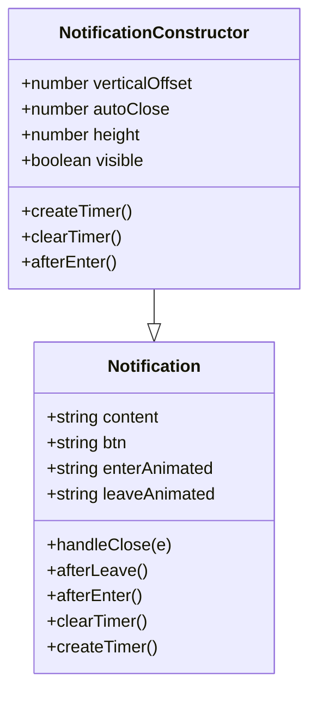
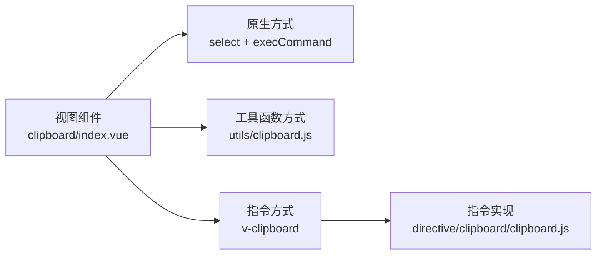
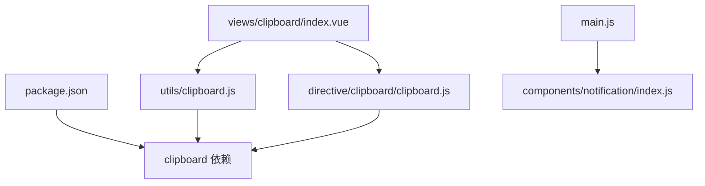

# 剪贴板操作

<cite>
**本文引用的文件列表**
- [src/directive/clipboard/index.js](file://src/directive/clipboard/index.js)
- [src/directive/clipboard/clipboard.js](file://src/directive/clipboard/clipboard.js)
- [src/utils/clipboard.js](file://src/utils/clipboard.js)
- [src/views/clipboard/index.vue](file://src/views/clipboard/index.vue)
- [src/components/notification/index.js](file://src/components/notification/index.js)
- [src/components/notification/notification.vue](file://src/components/notification/notification.vue)
- [src/main.js](file://src/main.js)
- [src/router/index.js](file://src/router/index.js)
- [package.json](file://package.json)
</cite>

## 目录
1. [简介](#简介)
2. [项目结构](#项目结构)
3. [核心组件](#核心组件)
4. [架构总览](#架构总览)
5. [详细组件分析](#详细组件分析)
6. [依赖关系分析](#依赖关系分析)
7. [性能与兼容性](#性能与兼容性)
8. [故障排查指南](#故障排查指南)
9. [结论](#结论)
10. [附录](#附录)

## 简介
本指南面向Vue CMS项目中的剪贴板操作能力，系统讲解以下内容：
- 原生剪贴板API与第三方库的封装与兼容性处理
- 复制文本、复制HTML内容、复制图片的实现思路与注意事项
- 剪贴板权限检查、安全策略与用户手势要求
- 自定义指令的实现原理与使用示例
- 通知组件集成、成功提示与错误处理
- 跨浏览器兼容性与降级方案
- 性能优化技巧与最佳实践

## 项目结构
与剪贴板相关的模块分布如下：
- 自定义指令：src/directive/clipboard
- 工具函数：src/utils/clipboard.js
- 视图演示：src/views/clipboard/index.vue
- 通知组件：src/components/notification
- 应用入口：src/main.js
- 路由配置：src/router/index.js
- 依赖声明：package.json

**图表来源**
- [src/main.js:1-53](file://src/main.js#L1-L53)
- [src/router/index.js:1-343](file://src/router/index.js#L1-L343)
- [src/views/clipboard/index.vue:1-77](file://src/views/clipboard/index.vue#L1-L77)
- [src/directive/clipboard/index.js:1-15](file://src/directive/clipboard/index.js#L1-L15)
- [src/directive/clipboard/clipboard.js:1-58](file://src/directive/clipboard/clipboard.js#L1-L58)
- [src/utils/clipboard.js:1-37](file://src/utils/clipboard.js#L1-L37)
- [package.json:1-99](file://package.json#L1-L99)

**章节来源**
- [src/main.js:1-53](file://src/main.js#L1-L53)
- [src/router/index.js:1-343](file://src/router/index.js#L1-L343)
- [src/views/clipboard/index.vue:1-77](file://src/views/clipboard/index.vue#L1-L77)
- [src/directive/clipboard/index.js:1-15](file://src/directive/clipboard/index.js#L1-L15)
- [src/directive/clipboard/clipboard.js:1-58](file://src/directive/clipboard/clipboard.js#L1-L58)
- [src/utils/clipboard.js:1-37](file://src/utils/clipboard.js#L1-L37)
- [package.json:1-99](file://package.json#L1-L99)

## 核心组件
- 自定义指令：提供 v-clipboard 指令，支持复制/剪切文本，绑定成功/失败回调
- 工具函数：封装 clipboard 库的使用，统一处理成功与错误通知
- 通知组件：提供全局通知能力，用于复制结果反馈
- 视图演示：展示三种复制方式（原生 execCommand、第三方库、指令）

**章节来源**
- [src/directive/clipboard/clipboard.js:1-58](file://src/directive/clipboard/clipboard.js#L1-L58)
- [src/utils/clipboard.js:1-37](file://src/utils/clipboard.js#L1-L37)
- [src/components/notification/index.js:1-119](file://src/components/notification/index.js#L1-L119)
- [src/views/clipboard/index.vue:1-77](file://src/views/clipboard/index.vue#L1-L77)

## 架构总览
剪贴板功能的调用链路如下：
- 视图层触发复制事件
- 通过工具函数或指令封装 clipboard 库
- 统一通过通知组件进行成功/失败提示
- 指令生命周期管理 clipboard 实例，避免内存泄漏

**图表来源**
- [src/views/clipboard/index.vue:28-66](file://src/views/clipboard/index.vue#L28-L66)
- [src/utils/clipboard.js:19-36](file://src/utils/clipboard.js#L19-L36)
- [src/directive/clipboard/clipboard.js:7-57](file://src/directive/clipboard/clipboard.js#L7-L57)
- [src/components/notification/index.js:74-113](file://src/components/notification/index.js#L74-L113)

## 详细组件分析

### 自定义指令 v-clipboard
- 功能概述
  - 支持复制/剪切两种动作（通过修饰符控制）
  - 支持绑定成功/失败回调
  - 生命周期内自动管理 clipboard 实例，避免内存泄漏
- 关键点
  - 文本来源：binding.value 或 binding.arg 控制动作类型
  - 回调绑定：binding.arg 为 success/error 时作为回调存储
  - 销毁：unbind 中销毁实例并清理引用

**图表来源**
- [src/directive/clipboard/clipboard.js:7-57](file://src/directive/clipboard/clipboard.js#L7-L57)

**章节来源**
- [src/directive/clipboard/index.js:1-15](file://src/directive/clipboard/index.js#L1-L15)
- [src/directive/clipboard/clipboard.js:1-58](file://src/directive/clipboard/clipboard.js#L1-L58)

### 工具函数封装
- 功能概述
  - 对 clipboard 库进行二次封装，统一处理成功/失败通知
  - 在回调中移除事件监听并销毁实例，防止内存泄漏
- 关键点
  - 通过 Vue.prototype.$notify 提供成功/失败提示
  - 使用 clipboard.onClick 触发复制

**图表来源**
- [src/utils/clipboard.js:19-36](file://src/utils/clipboard.js#L19-L36)
- [src/components/notification/index.js:74-113](file://src/components/notification/index.js#L74-L113)

**章节来源**
- [src/utils/clipboard.js:1-37](file://src/utils/clipboard.js#L1-L37)

### 通知组件集成
- 功能概述
  - 提供全局通知能力，支持自动关闭、多实例堆叠
  - 通过 Vue.prototype.$custom_notify 暴露
- 关键点
  - 实例创建、挂载与销毁流程清晰
  - 支持定时器管理与垂直偏移计算

**图表来源**
- [src/components/notification/notification.vue:10-59](file://src/components/notification/notification.vue#L10-L59)
- [src/components/notification/index.js:4-47](file://src/components/notification/index.js#L4-L47)

**章节来源**
- [src/components/notification/index.js:1-119](file://src/components/notification/index.js#L1-L119)
- [src/components/notification/notification.vue:1-90](file://src/components/notification/notification.vue#L1-L90)

### 视图演示与使用示例
- 三种复制方式对比
  - 原生 execCommand：选择输入框并执行复制命令
  - 第三方库封装：通过工具函数统一处理
  - 指令封装：通过 v-clipboard:copy 绑定数据与回调
- 路由接入
  - 路由中已配置剪贴板演示页面，可直接访问

**图表来源**
- [src/views/clipboard/index.vue:28-66](file://src/views/clipboard/index.vue#L28-L66)
- [src/directive/clipboard/clipboard.js:7-57](file://src/directive/clipboard/clipboard.js#L7-L57)
- [src/utils/clipboard.js:19-36](file://src/utils/clipboard.js#L19-L36)

**章节来源**
- [src/views/clipboard/index.vue:1-77](file://src/views/clipboard/index.vue#L1-L77)
- [src/router/index.js:204-211](file://src/router/index.js#L204-L211)

## 依赖关系分析
- 第三方库
  - clipboard：负责底层复制/剪切能力
- 应用层
  - 自定义指令与工具函数对 clipboard 进行封装
  - 通知组件提供统一的反馈机制

**图表来源**
- [package.json:37](file://package.json#L37)
- [src/utils/clipboard.js:1-37](file://src/utils/clipboard.js#L1-L37)
- [src/directive/clipboard/clipboard.js:1-58](file://src/directive/clipboard/clipboard.js#L1-L58)
- [src/views/clipboard/index.vue:28-66](file://src/views/clipboard/index.vue#L28-L66)
- [src/main.js:28-42](file://src/main.js#L28-L42)

**章节来源**
- [package.json:1-99](file://package.json#L1-L99)
- [src/main.js:1-53](file://src/main.js#L1-L53)

## 性能与兼容性

### 原生剪贴板API与第三方库
- 原生 API
  - document.execCommand('copy') 在现代浏览器中仍可用，但已被标记为过时
  - 适用于简单场景，无需额外依赖
- 第三方库 clipboard
  - 提供更稳定的跨浏览器行为，自动处理兼容性问题
  - 适合复杂场景与统一的用户体验

**章节来源**
- [src/views/clipboard/index.vue:44-53](file://src/views/clipboard/index.vue#L44-L53)
- [src/utils/clipboard.js:19-36](file://src/utils/clipboard.js#L19-L36)

### 权限检查、安全策略与用户手势
- 用户手势要求
  - 复制操作通常需要用户主动触发（点击、键盘等），以降低恶意脚本滥用风险
- 安全策略
  - 在 HTTPS 环境下优先使用异步剪贴板 API
  - 避免在不受信任的内容中执行复制操作
- 兼容性处理
  - 优先使用 clipboard 库提供的降级方案
  - 对不支持的浏览器给出明确提示或替代方案

**章节来源**
- [src/directive/clipboard/clipboard.js:14-21](file://src/directive/clipboard/clipboard.js#L14-L21)
- [src/utils/clipboard.js:19-36](file://src/utils/clipboard.js#L19-L36)

### 复制文本、复制 HTML 内容与复制图片
- 复制文本
  - 通过指令或工具函数传入 text 即可
- 复制 HTML 内容
  - clipboard 库默认仅复制纯文本，若需复制 HTML，请在目标元素上设置合适的 data 属性或使用富文本编辑器的复制接口
- 复制图片
  - 建议使用富文本编辑器或 Canvas 方案，将图片转换为可复制的数据格式
  - 注意跨域限制与 MIME 类型

**章节来源**
- [src/directive/clipboard/clipboard.js:14-21](file://src/directive/clipboard/clipboard.js#L14-L21)
- [src/utils/clipboard.js:19-36](file://src/utils/clipboard.js#L19-L36)

### 跨浏览器兼容性与降级方案
- 兼容性
  - clipboard 库内置多种降级策略，适配不同浏览器
- 降级方案
  - 若 clipboard 初始化失败，抛出错误提示安装依赖
  - 在不支持的环境中回退到原生 execCommand 或禁用复制按钮

**章节来源**
- [src/directive/clipboard/clipboard.js:2-5](file://src/directive/clipboard/clipboard.js#L2-L5)

### 性能优化与最佳实践
- 及时销毁实例
  - 在 unbind 或回调完成后 off 事件并 destroy 实例，避免内存泄漏
- 合理使用通知
  - 控制通知数量与显示时长，避免频繁弹窗影响体验
- 事件绑定与解绑
  - 在指令 update 中动态更新 text/action，减少不必要的实例重建
- 用户交互
  - 明确提示复制状态，提供撤销/重试机制

**章节来源**
- [src/directive/clipboard/clipboard.js:33-57](file://src/directive/clipboard/clipboard.js#L33-L57)
- [src/utils/clipboard.js:23-36](file://src/utils/clipboard.js#L23-L36)
- [src/components/notification/index.js:74-113](file://src/components/notification/index.js#L74-L113)

## 故障排查指南
- 指令未生效
  - 检查是否正确引入并注册指令
  - 确认 binding.value 是否为字符串
- 复制失败
  - 检查浏览器是否支持 clipboard 库或原生 API
  - 确认用户手势是否满足要求
- 通知未显示
  - 检查通知组件是否正确注册
  - 确认 $notify 方法是否可用

**章节来源**
- [src/directive/clipboard/index.js:1-15](file://src/directive/clipboard/index.js#L1-L15)
- [src/directive/clipboard/clipboard.js:14-21](file://src/directive/clipboard/clipboard.js#L14-L21)
- [src/main.js:28-42](file://src/main.js#L28-L42)

## 结论
本项目通过自定义指令与工具函数对剪贴板能力进行了统一封装，结合通知组件提供了良好的用户体验。遵循用户手势要求与安全策略，配合 clipboard 库的兼容性处理，能够在多浏览器环境下稳定运行。建议在实际业务中根据需求选择合适的复制方式，并注意性能与安全的最佳实践。

## 附录
- 快速开始
  - 在组件中使用 v-clipboard:copy 绑定数据
  - 通过工具函数封装进行统一处理
  - 在路由中访问演示页面验证功能

**章节来源**
- [src/views/clipboard/index.vue:18-23](file://src/views/clipboard/index.vue#L18-L23)
- [src/router/index.js:204-211](file://src/router/index.js#L204-L211)