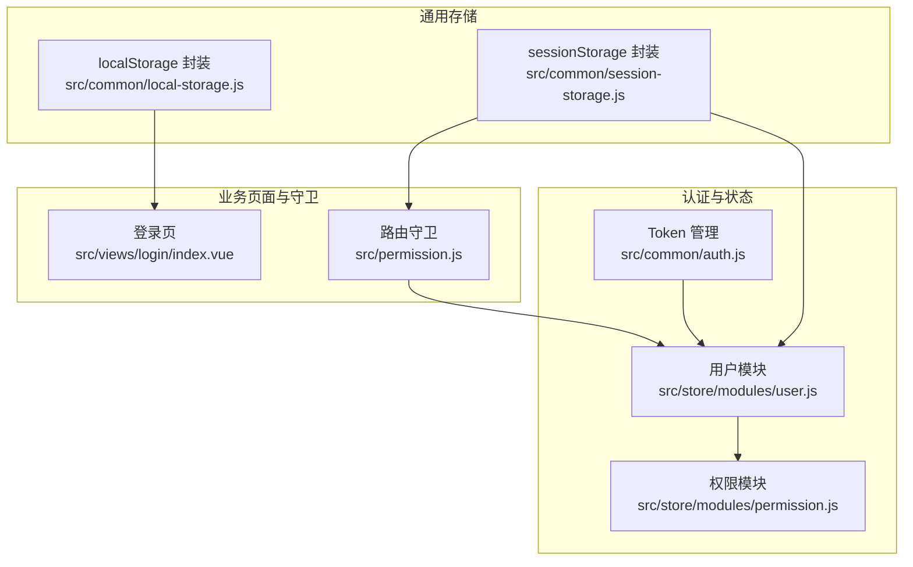
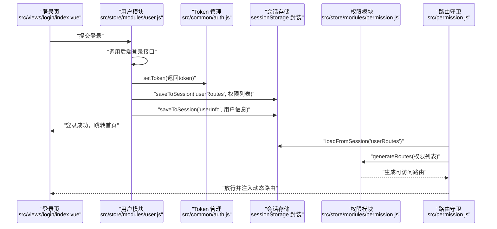
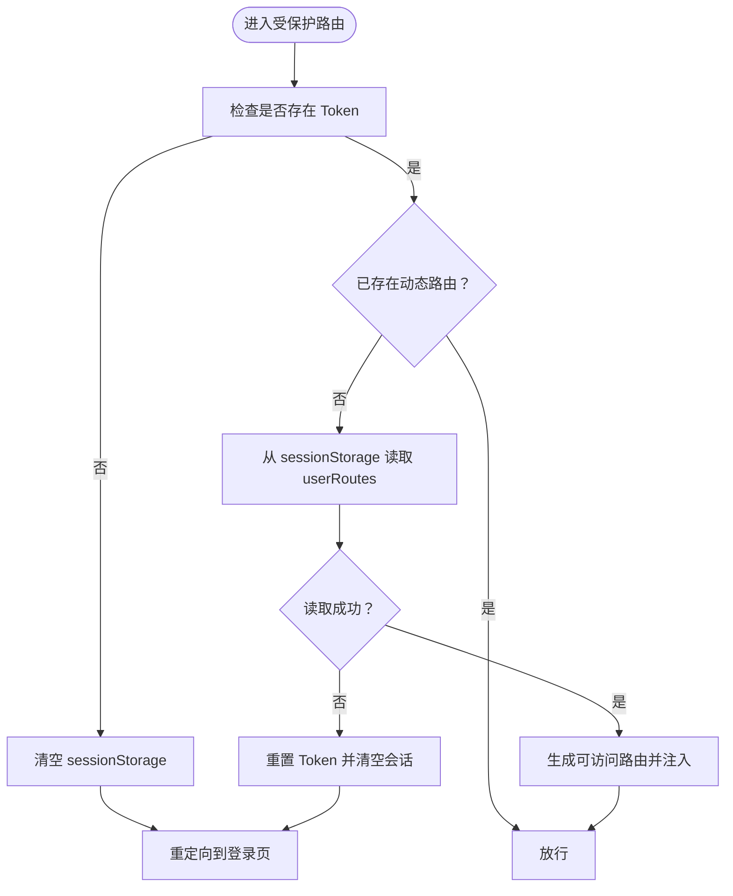
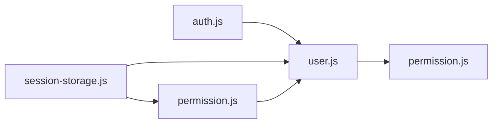

# 存储管理

<cite>
**本文引用的文件**
- [src/common/local-storage.js](file://src/common/local-storage.js)
- [src/common/session-storage.js](file://src/common/session-storage.js)
- [src/common/auth.js](file://src/common/auth.js)
- [src/store/modules/user.js](file://src/store/modules/user.js)
- [src/store/modules/permission.js](file://src/store/modules/permission.js)
- [src/views/login/index.vue](file://src/views/login/index.vue)
- [src/permission.js](file://src/permission.js)
- [src/main.js](file://src/main.js)
- [src/api/login.js](file://src/api/login.js)
- [package.json](file://package.json)
</cite>

## 目录
1. [简介](#简介)
2. [项目结构](#项目结构)
3. [核心组件](#核心组件)
4. [架构总览](#架构总览)
5. [详细组件分析](#详细组件分析)
6. [依赖关系分析](#依赖关系分析)
7. [性能考虑](#性能考虑)
8. [故障排查指南](#故障排查指南)
9. [结论](#结论)
10. [附录](#附录)

## 简介
本指南围绕 Vue CMS 项目的“存储管理”主题，系统讲解 localStorage 与 sessionStorage 的封装与使用、Token 管理、用户信息与权限缓存策略、序列化与反序列化、过期时间管理、存储空间检测与清理策略、异常处理、跨标签页通信与存储事件监听、加密存储与安全令牌管理、会话保持、容量限制与性能优化建议等。文档以仓库现有实现为基础，结合代码片段路径帮助读者快速定位与落地。

## 项目结构
本项目采用“功能模块 + 通用工具”的组织方式，存储相关能力主要分布在以下位置：
- 通用存储封装：src/common/local-storage.js、src/common/session-storage.js
- Token 管理：src/common/auth.js
- 用户状态与权限：src/store/modules/user.js、src/store/modules/permission.js
- 登录页使用本地存储：src/views/login/index.vue
- 路由守卫与会话清理：src/permission.js
- 应用入口与第三方依赖：src/main.js、package.json

图表来源
- [src/common/local-storage.js:1-41](file://src/common/local-storage.js#L1-L41)
- [src/common/session-storage.js:1-48](file://src/common/session-storage.js#L1-L48)
- [src/common/auth.js:1-18](file://src/common/auth.js#L1-L18)
- [src/store/modules/user.js:1-154](file://src/store/modules/user.js#L1-L154)
- [src/store/modules/permission.js:1-187](file://src/store/modules/permission.js#L1-L187)
- [src/views/login/index.vue:1-261](file://src/views/login/index.vue#L1-L261)
- [src/permission.js:1-98](file://src/permission.js#L1-L98)

章节来源
- [src/common/local-storage.js:1-41](file://src/common/local-storage.js#L1-L41)
- [src/common/session-storage.js:1-48](file://src/common/session-storage.js#L1-L48)
- [src/common/auth.js:1-18](file://src/common/auth.js#L1-L18)
- [src/store/modules/user.js:1-154](file://src/store/modules/user.js#L1-L154)
- [src/store/modules/permission.js:1-187](file://src/store/modules/permission.js#L1-L187)
- [src/views/login/index.vue:1-261](file://src/views/login/index.vue#L1-L261)
- [src/permission.js:1-98](file://src/permission.js#L1-L98)
- [src/main.js:1-53](file://src/main.js#L1-L53)
- [package.json:1-99](file://package.json#L1-L99)

## 核心组件
- localStorage 封装：提供 saveToLocal、loadFromLocal、clearLocal，内部以命名空间 __vue_cms__ 组织键值，统一 JSON 序列化/反序列化。
- sessionStorage 封装：提供 saveToSession、loadFromSession、clearAllSession，同样以 __vue_cms__ 命名空间隔离。
- Token 管理：基于 js-cookie，通过环境变量 VUE_APP_Cookie_Key 读写 Cookie，作为后端鉴权凭证。
- 用户模块：登录成功后写入 Token，并将用户信息与路由权限写入 sessionStorage；登出或重置时清理 sessionStorage。
- 权限模块：根据后端返回的权限集合生成可访问路由与按钮权限。
- 登录页：使用 localStorage 封装实现“记住账号/密码”功能。
- 路由守卫：在无 Token 时清理 sessionStorage 并拦截跳转至登录页。

章节来源
- [src/common/local-storage.js:13-40](file://src/common/local-storage.js#L13-L40)
- [src/common/session-storage.js:19-47](file://src/common/session-storage.js#L19-L47)
- [src/common/auth.js:3-17](file://src/common/auth.js#L3-L17)
- [src/store/modules/user.js:54-110](file://src/store/modules/user.js#L54-L110)
- [src/store/modules/permission.js:147-178](file://src/store/modules/permission.js#L147-L178)
- [src/views/login/index.vue:96-134](file://src/views/login/index.vue#L96-L134)
- [src/permission.js:23-90](file://src/permission.js#L23-L90)

## 架构总览
下图展示登录、权限生成与会话清理的关键流程，以及存储层的交互点。

图表来源
- [src/views/login/index.vue:118-141](file://src/views/login/index.vue#L118-L141)
- [src/store/modules/user.js:54-74](file://src/store/modules/user.js#L54-L74)
- [src/common/auth.js:9-11](file://src/common/auth.js#L9-L11)
- [src/common/session-storage.js:19-28](file://src/common/session-storage.js#L19-L28)
- [src/store/modules/permission.js:147-178](file://src/store/modules/permission.js#L147-L178)
- [src/permission.js:43-57](file://src/permission.js#L43-L57)

## 详细组件分析

### localStorage 封装（持久化）
- 设计要点
  - 使用命名空间 __vue_cms__ 将所有键值聚合为单个 JSON 字符串，避免污染全局命名空间。
  - 读取时若不存在或解析失败，返回默认值；写入时先读取旧对象，合并新键值后再整体序列化。
- 关键函数
  - saveToLocal(key, value)：写入持久化存储
  - loadFromLocal(key, def)：读取持久化存储，支持默认值
  - clearLocal()：清空持久化存储
- 复杂度与性能
  - 单次读写涉及一次 JSON 解析/序列化，O(n) 与对象大小线性相关；频繁写入建议批量合并或减少键数量。
- 容错与异常
  - 若 __vue_cms__ 不存在或 JSON 解析失败，返回默认值，保证健壮性。

章节来源
- [src/common/local-storage.js:13-40](file://src/common/local-storage.js#L13-L40)

### sessionStorage 封装（临时会话）
- 设计要点
  - 与 localStorage 类似，但用于存放本次登录会话内的临时数据（如用户信息、路由权限）。
  - 提供 clearAllSession() 清空会话存储，便于登出或重置。
- 关键函数
  - saveToSession(key, value)
  - loadFromSession(key, def)
  - clearAllSession()

章节来源
- [src/common/session-storage.js:19-47](file://src/common/session-storage.js#L19-L47)

### Token 管理（Cookie）
- 设计要点
  - 通过 js-cookie 读写 Cookie，键名来自环境变量 VUE_APP_Cookie_Key。
  - 登录成功设置 Token，登出或重置时移除。
- 与存储的关系
  - Token 作为鉴权凭证，通常不直接放入 localStorage/sessionStorage，避免 XSS 风险；本项目使用 Cookie 存储 Token。

章节来源
- [src/common/auth.js:3-17](file://src/common/auth.js#L3-L17)
- [package.json:44](file://package.json#L44)

### 用户信息与权限缓存（Vuex + sessionStorage）
- 用户模块
  - 登录成功后：setToken、保存 userRoutes 与 userInfo 到 sessionStorage、提交 mutations 更新状态。
  - 登出/重置：removeToken、清空 sessionStorage、重置路由。
- 权限模块
  - generateRoutes：根据后端返回的权限列表过滤前端路由，生成可访问路由并注入。
- 路由守卫
  - 若无 Token，清理 sessionStorage 并重定向登录；若有 Token 且动态路由为空，则尝试从 sessionStorage 加载 userRoutes 并生成路由。

图表来源
- [src/permission.js:23-90](file://src/permission.js#L23-L90)
- [src/store/modules/user.js:91-110](file://src/store/modules/user.js#L91-L110)
- [src/store/modules/permission.js:147-178](file://src/store/modules/permission.js#L147-L178)

章节来源
- [src/store/modules/user.js:54-110](file://src/store/modules/user.js#L54-L110)
- [src/store/modules/permission.js:147-178](file://src/store/modules/permission.js#L147-L178)
- [src/permission.js:23-90](file://src/permission.js#L23-L90)

### 登录页“记住账号/密码”（localStorage）
- 实现逻辑
  - 初始化时根据 remember 键决定是否从 localStorage 读取用户名/密码。
  - 登录成功后按用户选择保存或清空对应键值。
- 使用场景
  - 提升用户体验，减少重复输入；注意安全性，仅保存明文账号/密码，建议配合 HTTPS 与最小暴露原则。

章节来源
- [src/views/login/index.vue:96-134](file://src/views/login/index.vue#L96-L134)
- [src/common/local-storage.js:24-35](file://src/common/local-storage.js#L24-L35)

### 跨标签页通信与存储事件监听
- 现状说明
  - 当前代码未显式监听 storage 事件或实现跨标签页广播机制。
- 可选方案
  - 使用 window.addEventListener('storage', handler) 监听其他标签页对 localStorage/sessionStorage 的变更，实现多标签页状态同步。
  - 注意：storage 事件在同源同域下触发，且不会通知触发该事件的标签页自身。

[本节为概念性说明，不直接分析具体文件，故无章节来源]

### 数据序列化、反序列化与过期时间管理
- 序列化/反序列化
  - localStorage/sessionStorage 仅支持字符串，封装内部统一使用 JSON.stringify/JSON.parse。
- 过期时间
  - 现有实现未内置过期控制；可在 value 中携带时间戳并在读取时校验，或引入带 TTL 的封装库。
- 建议
  - 对敏感数据（如用户信息）建议增加签名或加密，避免篡改。

章节来源
- [src/common/local-storage.js:18-21](file://src/common/local-storage.js#L18-L21)
- [src/common/session-storage.js:24-27](file://src/common/session-storage.js#L24-L27)

### 存储空间检测、清理策略与异常处理
- 空间检测
  - 可通过遍历 localStorage/sessionStorage 的键值估算占用，或捕获 QuotaExceededError 判断配额上限。
- 清理策略
  - 登出/重置时清理 sessionStorage；持久化数据（如账号/密码）可按需清理。
- 异常处理
  - JSON 解析失败、存储不可用、QuotaExceededError 等均需兜底处理，避免阻断主流程。

章节来源
- [src/common/local-storage.js:24-35](file://src/common/local-storage.js#L24-L35)
- [src/common/session-storage.js:30-41](file://src/common/session-storage.js#L30-L41)

### 加密存储、安全令牌管理与会话保持
- 加密存储
  - 对敏感键值（如用户信息）建议在写入前进行对称加密，读取时解密；可结合浏览器 Crypto API 或 WebCrypto。
- 安全令牌
  - Token 已使用 Cookie 存储，建议设置 httpOnly、secure、sameSite 等属性（服务端配置），降低 XSS/Cookie 尝试风险。
- 会话保持
  - 结合 Cookie 与 sessionStorage 的组合：Cookie 保 Token，sessionStorage 保会话内权限与用户信息；路由守卫在 Token 存在时优先从 sessionStorage 恢复状态。

章节来源
- [src/common/auth.js:3-17](file://src/common/auth.js#L3-L17)
- [src/store/modules/user.js:54-74](file://src/store/modules/user.js#L54-L74)
- [src/permission.js:43-57](file://src/permission.js#L43-L57)

## 依赖关系分析
- 组件耦合
  - 用户模块依赖 Token 管理与会话存储；权限模块依赖用户模块提供的权限数据；路由守卫依赖用户模块与会话存储。
- 外部依赖
  - js-cookie 用于 Token 管理；Element UI、NProgress 等用于界面与进度条。

图表来源
- [src/common/auth.js:1-18](file://src/common/auth.js#L1-L18)
- [src/store/modules/user.js:1-154](file://src/store/modules/user.js#L1-L154)
- [src/store/modules/permission.js:1-187](file://src/store/modules/permission.js#L1-L187)
- [src/permission.js:1-98](file://src/permission.js#L1-L98)
- [src/common/session-storage.js:1-48](file://src/common/session-storage.js#L1-L48)

章节来源
- [src/common/auth.js:1-18](file://src/common/auth.js#L1-L18)
- [src/store/modules/user.js:1-154](file://src/store/modules/user.js#L1-L154)
- [src/store/modules/permission.js:1-187](file://src/store/modules/permission.js#L1-L187)
- [src/permission.js:1-98](file://src/permission.js#L1-L98)
- [src/common/session-storage.js:1-48](file://src/common/session-storage.js#L1-L48)

## 性能考虑
- 减少键数量：将多个小对象合并为大对象存储于单一键，降低序列化次数。
- 批量读写：一次性读取 __vue_cms__，修改后再写回，避免多次 IO。
- 控制数据体积：仅缓存必要字段，避免将完整树形结构或大数组长期驻留。
- 避免频繁写入：登录成功后一次性写入，登出/重置时再清理，减少存储抖动。
- 清理策略：定期清理过期或不再需要的缓存项，防止碎片化增长。

[本节提供一般性建议，不直接分析具体文件，故无章节来源]

## 故障排查指南
- 登录后无法进入受保护页面
  - 检查 Token 是否正确写入 Cookie；确认路由守卫是否从 sessionStorage 正确读取 userRoutes 并生成路由。
- 权限不生效
  - 确认后端返回的权限地址与前端路由 path 匹配；检查 generateRoutes 的过滤逻辑。
- 退出登录后仍保留状态
  - 确认登出动作是否执行了 sessionStorage.clear() 与 removeToken()。
- 记住账号/密码无效
  - 检查 localStorage 的键值是否正确写入与读取，默认值处理逻辑。

章节来源
- [src/permission.js:43-70](file://src/permission.js#L43-L70)
- [src/store/modules/user.js:91-110](file://src/store/modules/user.js#L91-L110)
- [src/views/login/index.vue:96-134](file://src/views/login/index.vue#L96-L134)

## 结论
本项目通过 localStorage/sessionStorage 封装与 Cookie 的合理分工，实现了 Token 管理、用户信息与权限缓存、路由守卫联动与会话清理。建议在现有基础上补充过期控制、跨标签页同步、敏感数据加密与配额检测，以进一步提升安全性与稳定性。

## 附录
- 相关接口与入口
  - 登录接口：src/api/login.js
  - 应用入口：src/main.js
  - 依赖清单：package.json

章节来源
- [src/api/login.js:1-24](file://src/api/login.js#L1-L24)
- [src/main.js:1-53](file://src/main.js#L1-L53)
- [package.json:1-99](file://package.json#L1-L99)