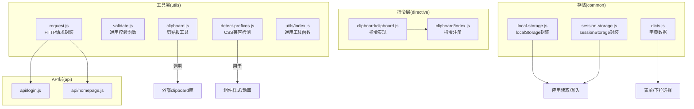
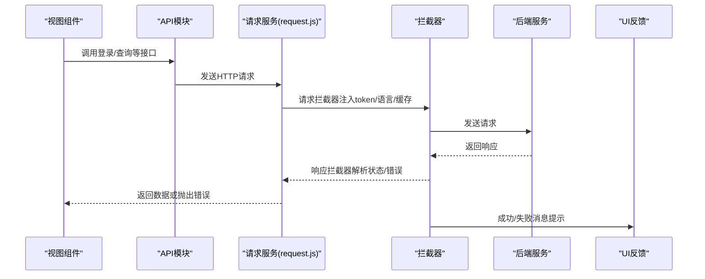
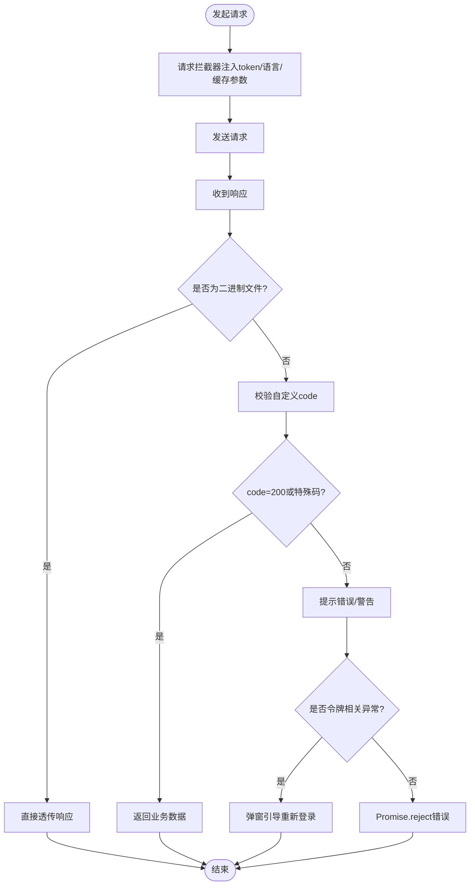
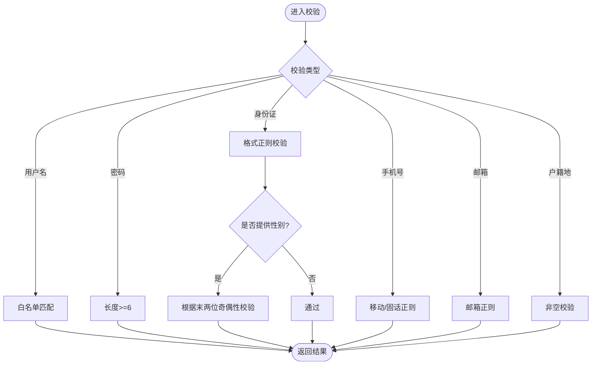
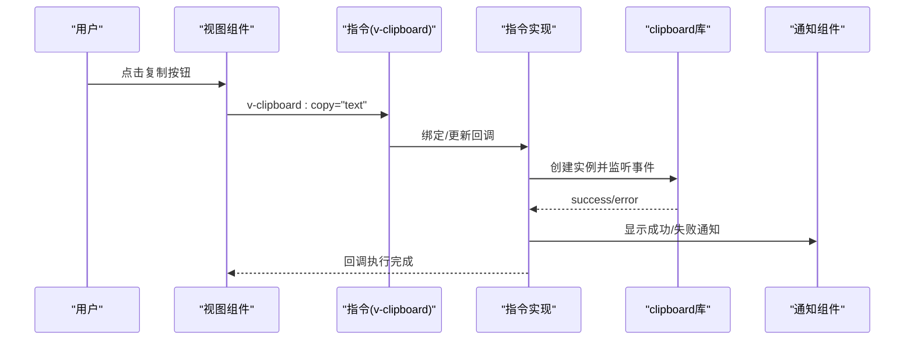
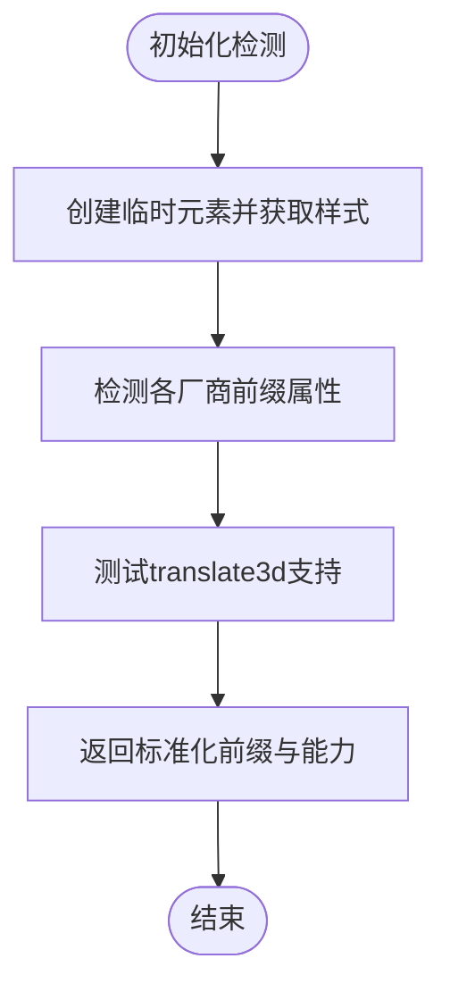
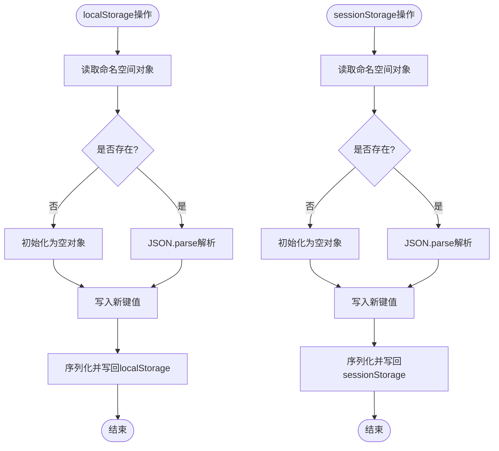
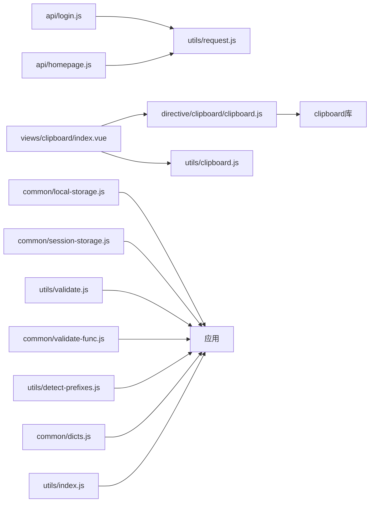

# 工具函数库

<cite>
**本文引用的文件**
- [src/utils/request.js](file://src/utils/request.js)
- [src/utils/validate.js](file://src/utils/validate.js)
- [src/utils/clipboard.js](file://src/utils/clipboard.js)
- [src/utils/detect-prefixes.js](file://src/utils/detect-prefixes.js)
- [src/common/local-storage.js](file://src/common/local-storage.js)
- [src/common/session-storage.js](file://src/common/session-storage.js)
- [src/common/validate-func.js](file://src/common/validate-func.js)
- [src/common/dicts.js](file://src/common/dicts.js)
- [src/directive/clipboard/index.js](file://src/directive/clipboard/index.js)
- [src/directive/clipboard/clipboard.js](file://src/directive/clipboard/clipboard.js)
- [src/utils/index.js](file://src/utils/index.js)
- [src/api/login.js](file://src/api/login.js)
- [src/api/homepage.js](file://src/api/homepage.js)
- [src/views/clipboard/index.vue](file://src/views/clipboard/index.vue)
- [src/main.js](file://src/main.js)
</cite>

## 目录
1. [简介](#简介)
2. [项目结构](#项目结构)
3. [核心组件](#核心组件)
4. [架构总览](#架构总览)
5. [详细组件分析](#详细组件分析)
6. [依赖关系分析](#依赖关系分析)
7. [性能考虑](#性能考虑)
8. [故障排查指南](#故障排查指南)
9. [结论](#结论)
10. [附录](#附录)

## 简介
本指南面向Vue CMS项目的工具函数库，系统讲解HTTP请求封装、数据验证、剪贴板操作、浏览器检测、本地/会话存储、字典数据与自定义指令的使用方法，并结合实际API封装模式说明错误处理与响应拦截器配置。文档同时提供性能优化建议与扩展机制，帮助开发者快速上手并安全扩展。

## 项目结构
工具函数库主要分布在以下位置：
- 请求与验证：src/utils/*
- 剪贴板指令：src/directive/clipboard/*
- 本地/会话存储：src/common/*
- 字典数据：src/common/dicts.js
- API封装示例：src/api/*

图表来源
- [src/utils/request.js:1-139](file://src/utils/request.js#L1-L139)
- [src/utils/validate.js:1-56](file://src/utils/validate.js#L1-L56)
- [src/utils/clipboard.js:1-37](file://src/utils/clipboard.js#L1-L37)
- [src/utils/detect-prefixes.js:1-46](file://src/utils/detect-prefixes.js#L1-L46)
- [src/utils/index.js:1-122](file://src/utils/index.js#L1-L122)
- [src/directive/clipboard/index.js:1-15](file://src/directive/clipboard/index.js#L1-L15)
- [src/directive/clipboard/clipboard.js:1-58](file://src/directive/clipboard/clipboard.js#L1-L58)
- [src/common/local-storage.js:1-41](file://src/common/local-storage.js#L1-L41)
- [src/common/session-storage.js:1-48](file://src/common/session-storage.js#L1-L48)
- [src/common/dicts.js:1-6](file://src/common/dicts.js#L1-L6)
- [src/api/login.js:1-24](file://src/api/login.js#L1-L24)
- [src/api/homepage.js:1-23](file://src/api/homepage.js#L1-L23)

章节来源
- [src/main.js:1-53](file://src/main.js#L1-L53)
- [src/utils/readme.md:1-10](file://src/utils/readme.md#L1-L10)
- [src/common/readme.md:1-8](file://src/common/readme.md#L1-L8)

## 核心组件
- HTTP请求封装与拦截器：统一设置基础URL、超时、请求头、鉴权、语言、缓存策略；对响应进行统一封装与错误处理。
- 数据验证函数：通用校验（用户名、路由权限类型等）与表单校验规则（密码、身份证、手机、邮箱等）。
- 剪贴板工具与指令：提供原生JS、第三方库封装与Vue指令三种方式，支持复制/剪切回调。
- 浏览器检测：自动探测CSS兼容性前缀与3D变换能力，便于样式适配。
- 本地与会话存储：以命名空间隔离的键值存储方案，支持持久化与临时缓存。
- 字典数据：集中维护业务字典，如技能标签等。
- 通用工具函数：防抖、深拷贝、DOM类名操作等。

章节来源
- [src/utils/request.js:1-139](file://src/utils/request.js#L1-L139)
- [src/utils/validate.js:1-56](file://src/utils/validate.js#L1-L56)
- [src/common/validate-func.js:1-123](file://src/common/validate-func.js#L1-L123)
- [src/utils/clipboard.js:1-37](file://src/utils/clipboard.js#L1-L37)
- [src/directive/clipboard/clipboard.js:1-58](file://src/directive/clipboard/clipboard.js#L1-L58)
- [src/utils/detect-prefixes.js:1-46](file://src/utils/detect-prefixes.js#L1-L46)
- [src/common/local-storage.js:1-41](file://src/common/local-storage.js#L1-L41)
- [src/common/session-storage.js:1-48](file://src/common/session-storage.js#L1-L48)
- [src/common/dicts.js:1-6](file://src/common/dicts.js#L1-L6)
- [src/utils/index.js:1-122](file://src/utils/index.js#L1-L122)

## 架构总览
工具函数库围绕“请求—验证—交互—存储—指令”五条主线构建，API层通过统一的请求服务访问后端，验证层贯穿通用校验与表单校验，指令层提供可复用的交互能力，存储层保障数据持久化与临时缓存，字典层提供业务常量。

图表来源
- [src/api/login.js:1-24](file://src/api/login.js#L1-L24)
- [src/utils/request.js:17-136](file://src/utils/request.js#L17-L136)

## 详细组件分析

### HTTP请求封装与拦截器
- 基础配置：基础URL、超时、Content-Type、跨域策略等。
- 请求拦截器：统一注入Authorization、语言头、GET请求防缓存参数。
- 响应拦截器：识别Blob/ArrayBuffer直接透传；根据自定义code判定成功/警告/错误；对特定令牌异常弹窗引导重新登录；对超时与网络错误进行统一提示与拒绝。
- 使用方式：API模块直接调用封装好的request实例，无需重复配置。

图表来源
- [src/utils/request.js:17-136](file://src/utils/request.js#L17-L136)

章节来源
- [src/utils/request.js:1-139](file://src/utils/request.js#L1-L139)
- [src/api/login.js:1-24](file://src/api/login.js#L1-L24)
- [src/api/homepage.js:1-23](file://src/api/homepage.js#L1-L23)

### 数据验证函数
- 通用校验：用户名白名单校验、权限类型映射（菜单/页面/按钮）、类型判断。
- 表单校验：用户名、密码长度、身份证格式与性别校验、手机号（含固话）格式、邮箱格式、户籍地非空等。
- 使用建议：在表单组件中结合Element UI的校验规则使用，确保前后端一致。

图表来源
- [src/utils/validate.js:13-56](file://src/utils/validate.js#L13-L56)
- [src/common/validate-func.js:16-123](file://src/common/validate-func.js#L16-L123)

章节来源
- [src/utils/validate.js:1-56](file://src/utils/validate.js#L1-L56)
- [src/common/validate-func.js:1-123](file://src/common/validate-func.js#L1-L123)

### 剪贴板操作与自定义指令
- 工具函数方式：封装第三方clipboard库，提供成功/失败通知回调。
- 指令方式：v-clipboard:copy/cut，支持绑定文本与成功/失败回调钩子；生命周期内自动绑定/更新/解绑。
- 视图示例：演示原生JS、工具函数与指令三种复制方式。

图表来源
- [src/views/clipboard/index.vue:1-77](file://src/views/clipboard/index.vue#L1-L77)
- [src/directive/clipboard/clipboard.js:1-58](file://src/directive/clipboard/clipboard.js#L1-L58)
- [src/directive/clipboard/index.js:1-15](file://src/directive/clipboard/index.js#L1-L15)
- [src/utils/clipboard.js:1-37](file://src/utils/clipboard.js#L1-L37)

章节来源
- [src/views/clipboard/index.vue:1-77](file://src/views/clipboard/index.vue#L1-L77)
- [src/directive/clipboard/clipboard.js:1-58](file://src/directive/clipboard/clipboard.js#L1-L58)
- [src/directive/clipboard/index.js:1-15](file://src/directive/clipboard/index.js#L1-L15)
- [src/utils/clipboard.js:1-37](file://src/utils/clipboard.js#L1-L37)

### 浏览器检测工具
- 功能：自动检测transform/transition/transitionEnd前缀与translate3d支持，返回标准化字段。
- 适用场景：组件样式兼容、动画过渡、硬件加速判断。

图表来源
- [src/utils/detect-prefixes.js:8-45](file://src/utils/detect-prefixes.js#L8-L45)

章节来源
- [src/utils/detect-prefixes.js:1-46](file://src/utils/detect-prefixes.js#L1-L46)

### 本地存储与会话管理
- localStorage封装：以命名空间隔离的JSON对象保存键值，提供设置、读取、清空。
- sessionStorage封装：同localStorage，但使用sessionStorage实现临时缓存。
- 使用建议：敏感信息避免明文存储；必要时配合加密或后端签名。

图表来源
- [src/common/local-storage.js:13-40](file://src/common/local-storage.js#L13-L40)
- [src/common/session-storage.js:19-47](file://src/common/session-storage.js#L19-L47)

章节来源
- [src/common/local-storage.js:1-41](file://src/common/local-storage.js#L1-L41)
- [src/common/session-storage.js:1-48](file://src/common/session-storage.js#L1-L48)

### 字典数据处理
- 技能字典：集中维护技能标签，便于表单选择、展示与过滤。
- 使用建议：与后端枚举保持同步，前端仅作展示与选择。

章节来源
- [src/common/dicts.js:1-6](file://src/common/dicts.js#L1-L6)

### 通用工具函数
- 防抖：支持立即执行与延迟执行两种模式，适合搜索、窗口调整等高频触发场景。
- 深拷贝：简易深拷贝实现，复杂场景建议使用lodash。
- DOM类名：hasClass/addClass/removeClass/toggleClass，便于组件样式切换。

章节来源
- [src/utils/index.js:12-122](file://src/utils/index.js#L12-L122)

## 依赖关系分析
- API模块依赖请求服务，请求服务依赖鉴权与语言模块。
- 剪贴板指令依赖clipboard库，视图组件通过指令或工具函数调用。
- 存储模块独立，供任意模块读写。
- 验证模块分为通用校验与表单校验两部分，分别服务于不同场景。

图表来源
- [src/api/login.js:1-24](file://src/api/login.js#L1-L24)
- [src/api/homepage.js:1-23](file://src/api/homepage.js#L1-L23)
- [src/utils/request.js:1-139](file://src/utils/request.js#L1-L139)
- [src/views/clipboard/index.vue:1-77](file://src/views/clipboard/index.vue#L1-L77)
- [src/directive/clipboard/clipboard.js:1-58](file://src/directive/clipboard/clipboard.js#L1-L58)
- [src/utils/clipboard.js:1-37](file://src/utils/clipboard.js#L1-L37)
- [src/common/local-storage.js:1-41](file://src/common/local-storage.js#L1-L41)
- [src/common/session-storage.js:1-48](file://src/common/session-storage.js#L1-L48)
- [src/utils/validate.js:1-56](file://src/utils/validate.js#L1-L56)
- [src/common/validate-func.js:1-123](file://src/common/validate-func.js#L1-L123)
- [src/utils/detect-prefixes.js:1-46](file://src/utils/detect-prefixes.js#L1-L46)
- [src/common/dicts.js:1-6](file://src/common/dicts.js#L1-L6)
- [src/utils/index.js:1-122](file://src/utils/index.js#L1-L122)

## 性能考虑
- 请求缓存：GET请求通过附加时间戳参数避免浏览器缓存，适合需要实时数据的场景；若后端支持ETag/Last-Modified，可在拦截器中进一步优化。
- 防抖与节流：高频事件（搜索、滚动、窗口调整）使用防抖/节流降低请求频率与重绘开销。
- 深拷贝：简易深拷贝适合轻量场景；复杂对象建议使用高性能库，减少不必要的内存复制。
- 指令与工具函数：优先使用指令以减少重复逻辑；注意在unbing时销毁实例，避免内存泄漏。
- 存储策略：localStorage适合持久化配置；sessionStorage适合临时状态；避免存储大对象，防止阻塞UI线程。

## 故障排查指南
- 请求超时：拦截器已对超时与网络错误进行统一提示与拒绝，检查网络与后端接口可用性。
- 令牌异常：当出现非法令牌/过期/异地登录等异常时，拦截器会弹窗引导重新登录，确认登录状态与设备限制。
- 剪贴板失败：检查目标元素是否可编辑、浏览器权限与clipboard库版本；指令方式需确保绑定值有效。
- 存储异常：命名空间JSON解析失败时，检查数据完整性；清空存储后重试。
- 验证失败：核对正则表达式与回调时机，确保在表单提交前完成所有校验。

章节来源
- [src/utils/request.js:108-136](file://src/utils/request.js#L108-L136)
- [src/utils/clipboard.js:4-36](file://src/utils/clipboard.js#L4-L36)
- [src/common/local-storage.js:13-40](file://src/common/local-storage.js#L13-L40)
- [src/common/session-storage.js:19-47](file://src/common/session-storage.js#L19-L47)

## 结论
工具函数库通过统一的请求封装、完善的验证体系、可复用的剪贴板指令、可靠的存储方案与字典管理，为Vue CMS项目提供了高内聚、低耦合的基础设施。遵循本文档的使用规范与扩展机制，可显著提升开发效率与系统稳定性。

## 附录
- 扩展机制建议：
  - 新增请求拦截器：在现有拦截器基础上按需扩展，避免破坏既有逻辑。
  - 新增验证规则：在common/validate-func.js中新增校验函数，并在表单中复用。
  - 新增指令：参考clipboard指令实现，遵循bind/update/unbind生命周期。
  - 新增存储：在common目录下新增模块，保持命名空间与JSON序列化一致性。
  - 新增字典：在common/dicts.js中维护，确保与后端枚举一致。