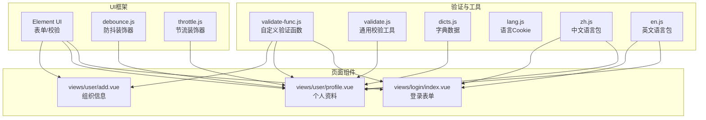
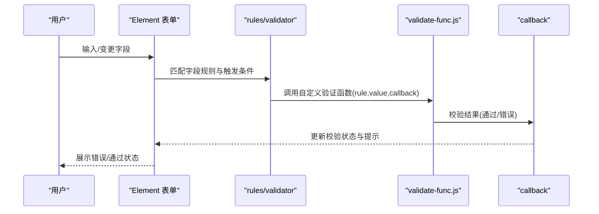
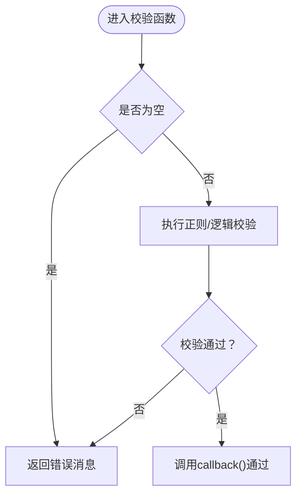
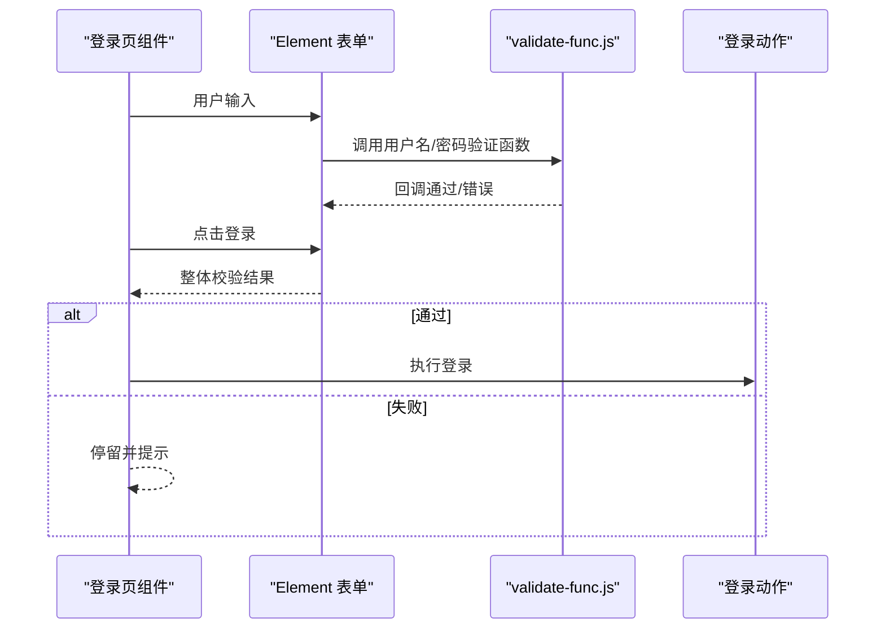
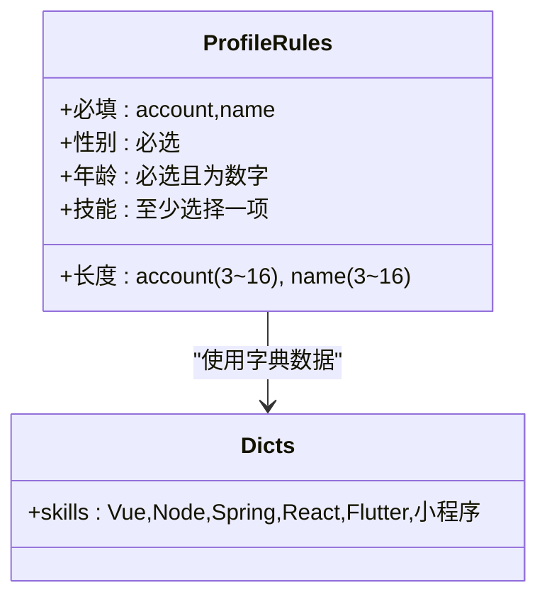
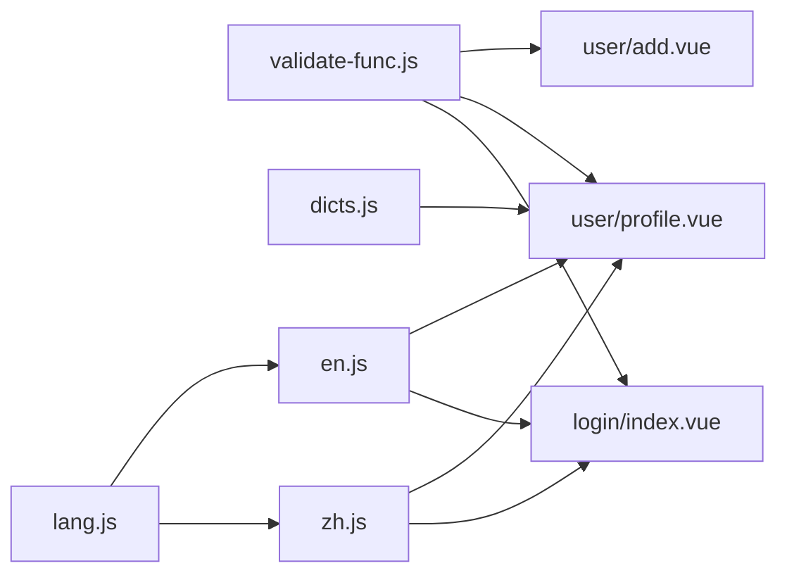

# 数据验证函数

<cite>
**本文引用的文件**
- [validate-func.js](file://src/common/validate-func.js)
- [validate.js](file://src/utils/validate.js)
- [index.vue（登录页）](file://src/views/login/index.vue)
- [add.vue（用户组织页）](file://src/views/user/add.vue)
- [profile.vue（用户资料页）](file://src/views/user/profile.vue)
- [dicts.js](file://src/common/dicts.js)
- [lang.js](file://src/common/lang.js)
- [zh.js（中文语言包）](file://src/language/zh.js)
- [en.js（英文语言包）](file://src/language/en.js)
- [debounce.js（防抖装饰器）](file://src/decorator/debounce.js)
- [throttle.js（节流装饰器）](file://src/decorator/throttle.js)
</cite>

## 目录
1. [简介](#简介)
2. [项目结构](#项目结构)
3. [核心组件](#核心组件)
4. [架构总览](#架构总览)
5. [详细组件分析](#详细组件分析)
6. [依赖关系分析](#依赖关系分析)
7. [性能考量](#性能考量)
8. [故障排查指南](#故障排查指南)
9. [结论](#结论)
10. [附录](#附录)

## 简介
本指南围绕 Vue CMS 项目的表单数据验证体系，系统讲解验证函数的实现与使用，包括：
- Element UI 表单验证规则与集成方式
- 常见场景验证（邮箱、手机号、身份证号、密码强度等）
- 自定义验证函数的参数、返回值与错误消息定制
- 实时验证、异步验证与批量验证的最佳实践
- 字典数据验证与多语言支持策略

## 项目结构
验证相关代码主要分布在以下位置：
- 通用验证函数：src/common/validate-func.js
- 工具类校验：src/utils/validate.js
- 登录页表单：src/views/login/index.vue（使用 validate-func 中的用户名/密码验证）
- 用户资料页：src/views/user/profile.vue（基础必填/长度/数值类型规则）
- 用户组织页：src/views/user/add.vue（基础必填/长度规则）
- 字典数据：src/common/dicts.js（用于复选框/下拉等字段的可选项）
- 多语言：src/language/zh.js、src/language/en.js（错误消息国际化）
- 防抖/节流装饰器：src/decorator/debounce.js、src/decorator/throttle.js（优化高频输入）

图表来源
- [validate-func.js:1-123](file://src/common/validate-func.js#L1-L123)
- [validate.js:1-56](file://src/utils/validate.js#L1-L56)
- [index.vue（登录页）:1-261](file://src/views/login/index.vue#L1-L261)
- [profile.vue（用户资料页）:1-188](file://src/views/user/profile.vue#L1-L188)
- [add.vue（用户组织页）:1-374](file://src/views/user/add.vue#L1-L374)
- [dicts.js:1-6](file://src/common/dicts.js#L1-L6)
- [lang.js:1-18](file://src/common/lang.js#L1-L18)
- [zh.js（中文语言包）:1-142](file://src/language/zh.js#L1-L142)
- [en.js（英文语言包）:1-144](file://src/language/en.js#L1-L144)
- [debounce.js（防抖装饰器）:1-21](file://src/decorator/debounce.js#L1-L21)
- [throttle.js（节流装饰器）:1-20](file://src/decorator/throttle.js#L1-L20)

章节来源
- [validate-func.js:1-123](file://src/common/validate-func.js#L1-L123)
- [validate.js:1-56](file://src/utils/validate.js#L1-L56)
- [index.vue（登录页）:1-261](file://src/views/login/index.vue#L1-L261)
- [profile.vue（用户资料页）:1-188](file://src/views/user/profile.vue#L1-L188)
- [add.vue（用户组织页）:1-374](file://src/views/user/add.vue#L1-L374)
- [dicts.js:1-6](file://src/common/dicts.js#L1-L6)
- [lang.js:1-18](file://src/common/lang.js#L1-L18)
- [zh.js（中文语言包）:1-142](file://src/language/zh.js#L1-L142)
- [en.js（英文语言包）:1-144](file://src/language/en.js#L1-L144)
- [debounce.js（防抖装饰器）:1-21](file://src/decorator/debounce.js#L1-L21)
- [throttle.js（节流装饰器）:1-20](file://src/decorator/throttle.js#L1-L20)

## 核心组件
- 自定义验证函数模块（validate-func.js）
  - 提供用户名、密码、身份证、手机号、邮箱、户籍所在地等验证函数
  - 支持同步与异步校验，统一通过回调返回错误或通过
- 通用校验工具（validate.js）
  - 提供基础字符串/类型判断与枚举映射工具
- 页面级表单（login/profile/add）
  - 使用 Element UI 的 rules 与 validator 字段进行集成
  - 结合语言包与字典数据实现多语言与字典校验

章节来源
- [validate-func.js:1-123](file://src/common/validate-func.js#L1-L123)
- [validate.js:1-56](file://src/utils/validate.js#L1-L56)
- [index.vue（登录页）:73-84](file://src/views/login/index.vue#L73-L84)
- [profile.vue（用户资料页）:77-93](file://src/views/user/profile.vue#L77-L93)
- [add.vue（用户组织页）:231-244](file://src/views/user/add.vue#L231-L244)

## 架构总览
验证流程在 Element UI 的表单校验机制下运行：
- 规则定义：rules 中的每个字段可配置 required、trigger、validator 等
- 触发时机：blur/change 等触发方式控制实时校验
- 自定义校验：validator 指向 validate-func.js 中的函数，接收 (rule, value, callback)
- 错误消息：通过 callback(new Error('...')) 返回，支持多语言

图表来源
- [index.vue（登录页）:73-84](file://src/views/login/index.vue#L73-L84)
- [validate-func.js:16-35](file://src/common/validate-func.js#L16-L35)

## 详细组件分析

### 自定义验证函数模块（validate-func.js）
- 验证函数规范
  - 参数：rule（当前规则对象）、value（当前输入值）、callback（回调函数）
  - 返回：通过时调用 callback()；失败时调用 callback(new Error('...'))
- 常见场景
  - 用户名：validateUsername（基于 mock 数据校验）
  - 密码：validatePwd（长度不少于 6 位）
  - 身份证：checkIdCard（格式校验 + 性别校验分支）
  - 手机号：checkPoliceNumber（手机号/固话格式校验 + 去重记录）
  - 邮箱：checkMailBox（邮箱格式校验 + 占用检测占位）
  - 户籍所在地：checkDomicilePlace（非空校验）

图表来源
- [validate-func.js:16-35](file://src/common/validate-func.js#L16-L35)
- [validate-func.js:38-68](file://src/common/validate-func.js#L38-L68)
- [validate-func.js:71-91](file://src/common/validate-func.js#L71-L91)
- [validate-func.js:94-113](file://src/common/validate-func.js#L94-L113)
- [validate-func.js:116-122](file://src/common/validate-func.js#L116-L122)

章节来源
- [validate-func.js:16-122](file://src/common/validate-func.js#L16-L122)

### Element UI 表单验证集成（登录页）
- 规则配置
  - username/pwd 字段均使用 validator 指向 validate-func.js 中的函数
  - 同时配置 blur/change 触发，确保即时反馈
- 表单提交
  - 通过 $refs.form.validate((valid) => {...}) 获取整体校验结果
  - 成功后执行登录动作，失败则停留在表单

图表来源
- [index.vue（登录页）:73-84](file://src/views/login/index.vue#L73-L84)
- [index.vue（登录页）:120-153](file://src/views/login/index.vue#L120-L153)
- [validate-func.js:16-35](file://src/common/validate-func.js#L16-L35)

章节来源
- [index.vue（登录页）:73-84](file://src/views/login/index.vue#L73-L84)
- [index.vue（登录页）:120-153](file://src/views/login/index.vue#L120-L153)

### 基础规则与字典数据（用户资料页）
- 规则类型
  - 必填 required
  - 长度 min/max
  - 数值类型 type: 'number'
  - 多选项至少选择一项（如技能选择）
- 字典数据
  - 技能列表来自 dicts.js，用于复选框渲染与校验

图表来源
- [profile.vue（用户资料页）:77-93](file://src/views/user/profile.vue#L77-L93)
- [dicts.js:5](file://src/common/dicts.js#L5)

章节来源
- [profile.vue（用户资料页）:77-93](file://src/views/user/profile.vue#L77-L93)
- [dicts.js:5](file://src/common/dicts.js#L5)

### 组织信息页（基础规则）
- 规则覆盖
  - 客户名称、类型、系统标识、账号标识、省/市等必填
  - 文本长度限制（如 concat、depart、remarks）
- 触发方式
  - blur/change 控制实时反馈

章节来源
- [add.vue（用户组织页）:231-244](file://src/views/user/add.vue#L231-L244)

### 异步验证与实时优化
- 异步验证
  - 邮箱/身份证等可扩展为真实接口校验（当前示例为占位）
- 实时优化
  - 使用防抖/节流装饰器减少高频输入带来的校验压力
  - 在输入框频繁变更时，建议对异步校验函数进行节流/防抖包装

章节来源
- [validate-func.js:94-113](file://src/common/validate-func.js#L94-L113)
- [debounce.js（防抖装饰器）:16-19](file://src/decorator/debounce.js#L16-L19)
- [throttle.js（节流装饰器）:15-18](file://src/decorator/throttle.js#L15-L18)

### 字典数据验证与多语言支持
- 字典数据
  - dicts.js 提供技能列表，配合 Element UI 的复选/下拉组件使用
- 多语言
  - zh.js/en.js 提供错误消息与标签文案
  - 登录页与资料页通过 $t() 读取语言包，实现错误消息国际化

章节来源
- [dicts.js:5](file://src/common/dicts.js#L5)
- [zh.js（中文语言包）:5-11](file://src/language/zh.js#L5-L11)
- [en.js（英文语言包）:1-11](file://src/language/en.js#L1-L11)
- [profile.vue（用户资料页）:8-36](file://src/views/user/profile.vue#L8-L36)
- [index.vue（登录页）:13-18](file://src/views/login/index.vue#L13-L18)

## 依赖关系分析
- validate-func.js 与页面组件的耦合点在于 rules 的 validator 字段
- profile.vue 依赖 dicts.js 的字典数据
- 多语言依赖语言包与 Cookie 管理（lang.js）

图表来源
- [validate-func.js:1-123](file://src/common/validate-func.js#L1-L123)
- [index.vue（登录页）:52-84](file://src/views/login/index.vue#L52-L84)
- [profile.vue（用户资料页）:56-93](file://src/views/user/profile.vue#L56-L93)
- [add.vue（用户组织页）:1-374](file://src/views/user/add.vue#L1-L374)
- [dicts.js:5](file://src/common/dicts.js#L5)
- [lang.js:1-18](file://src/common/lang.js#L1-L18)
- [zh.js（中文语言包）:1-142](file://src/language/zh.js#L1-L142)
- [en.js（英文语言包）:1-144](file://src/language/en.js#L1-L144)

章节来源
- [validate-func.js:1-123](file://src/common/validate-func.js#L1-L123)
- [index.vue（登录页）:52-84](file://src/views/login/index.vue#L52-L84)
- [profile.vue（用户资料页）:56-93](file://src/views/user/profile.vue#L56-L93)
- [add.vue（用户组织页）:1-374](file://src/views/user/add.vue#L1-L374)
- [dicts.js:5](file://src/common/dicts.js#L5)
- [lang.js:1-18](file://src/common/lang.js#L1-L18)
- [zh.js（中文语言包）:1-142](file://src/language/zh.js#L1-L142)
- [en.js（英文语言包）:1-144](file://src/language/en.js#L1-L144)

## 性能考量
- 高频输入优化
  - 对异步校验（如邮箱/身份证）使用节流/防抖装饰器，避免请求风暴
- 规则粒度控制
  - 将复杂校验拆分为多个简单规则，提升可维护性
- 本地化与缓存
  - 语言包按需加载，避免重复渲染

## 故障排查指南
- 常见问题
  - 触发时机不当：确认 rules 中 trigger 是否覆盖 blur/change
  - 错误消息未显示：检查 callback(new Error('...')) 是否正确调用
  - 多语言不生效：确认语言包键名与页面 $t() 使用一致
- 定位步骤
  - 在 validate-func.js 的具体函数中打断点或打印日志
  - 在页面组件中打印 $refs.form.validate 的回调结果

章节来源
- [validate-func.js:16-122](file://src/common/validate-func.js#L16-L122)
- [index.vue（登录页）:120-153](file://src/views/login/index.vue#L120-L153)
- [profile.vue（用户资料页）:114-131](file://src/views/user/profile.vue#L114-L131)

## 结论
本项目通过 validate-func.js 提供统一的自定义验证能力，并结合 Element UI 的 rules/validator 机制实现灵活的表单校验。配合字典数据与多语言包，既能满足常见业务场景，又具备良好的扩展性与国际化支持。建议在高频输入场景引入节流/防抖，进一步提升用户体验与系统性能。

## 附录
- 常用验证场景清单
  - 邮箱：格式校验 + 占用检测（可扩展为真实接口）
  - 手机号：手机号/固话格式校验 + 去重记录
  - 身份证：格式校验 + 性别校验分支
  - 密码：长度不少于 6 位
  - 用户名：基于 mock 数据的白名单校验
- 最佳实践
  - 将规则与校验函数分离，保持页面简洁
  - 对异步校验使用节流/防抖装饰器
  - 错误消息与标签文案统一纳入语言包