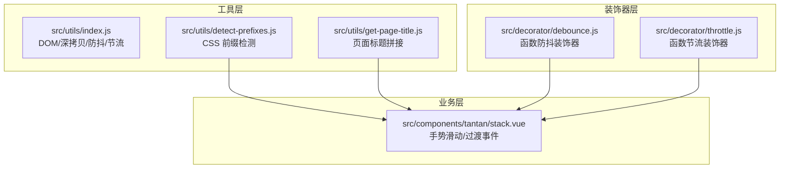
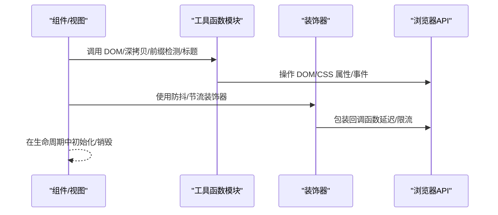
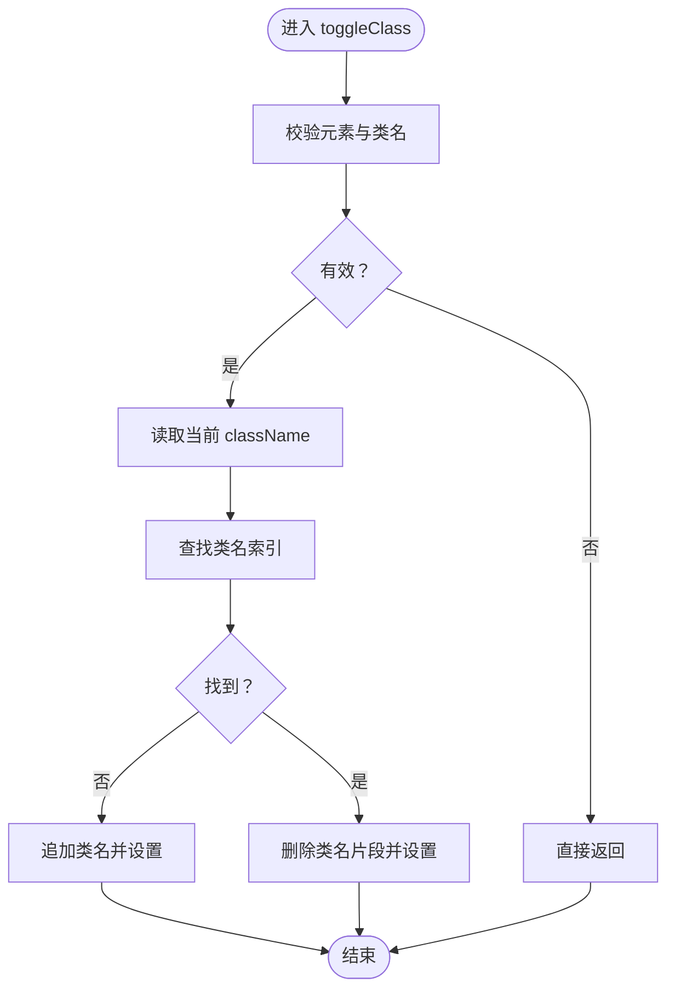
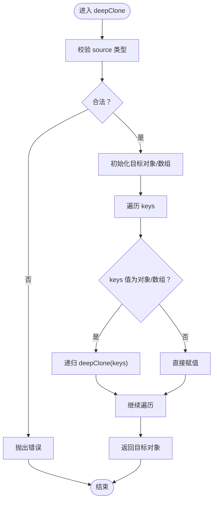
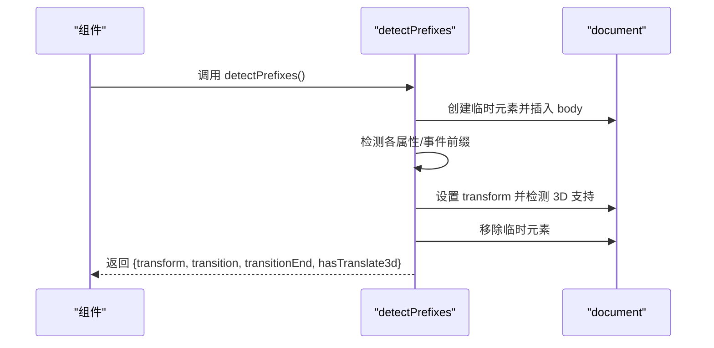
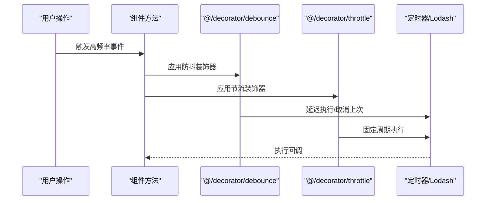
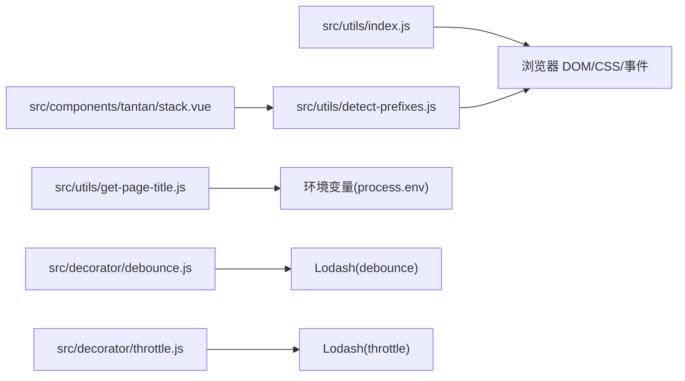

# 浏览器工具函数

<cite>
**本文档引用的文件**
- [src/utils/index.js](file://src/utils/index.js)
- [src/utils/detect-prefixes.js](file://src/utils/detect-prefixes.js)
- [src/utils/get-page-title.js](file://src/utils/get-page-title.js)
- [src/decorator/debounce.js](file://src/decorator/debounce.js)
- [src/decorator/throttle.js](file://src/decorator/throttle.js)
- [src/components/tantan/stack.vue](file://src/components/tantan/stack.vue)
- [README.md](file://README.md)
</cite>

## 目录
1. [简介](#简介)
2. [项目结构](#项目结构)
3. [核心组件](#核心组件)
4. [架构总览](#架构总览)
5. [详细组件分析](#详细组件分析)
6. [依赖关系分析](#依赖关系分析)
7. [性能考量](#性能考量)
8. [故障排查指南](#故障排查指南)
9. [结论](#结论)

## 简介
本指南聚焦于 Vue CMS 项目的浏览器工具函数，系统讲解以下能力与实践：
- DOM 操作工具：hasClass、addClass、removeClass、toggleClass 的实现原理与使用方法
- 浏览器前缀检测：CSS 动画/变换属性的自动探测与兼容性处理
- 页面标题管理：统一标题拼接策略
- 深拷贝算法：递归实现、边界情况与性能权衡
- 防抖与节流：性能优化技巧、使用场景与装饰器封装
- 设备与页面可见性：兼容性处理与扩展机制
- 实战集成：在组件中如何正确使用前缀检测与事件绑定

## 项目结构
浏览器工具函数主要位于 src/utils 目录，配合装饰器与业务组件共同使用：
- 工具函数：DOM 操作、深拷贝、前缀检测、页面标题
- 装饰器：函数式防抖与节流
- 组件：在实际交互中应用前缀检测与事件处理

**图表来源**
- [src/utils/index.js:1-122](file://src/utils/index.js#L1-L122)
- [src/utils/detect-prefixes.js:1-46](file://src/utils/detect-prefixes.js#L1-L46)
- [src/utils/get-page-title.js:1-9](file://src/utils/get-page-title.js#L1-L9)
- [src/decorator/debounce.js:1-21](file://src/decorator/debounce.js#L1-L21)
- [src/decorator/throttle.js:1-20](file://src/decorator/throttle.js#L1-L20)
- [src/components/tantan/stack.vue:23-16](file://src/components/tantan/stack.vue#L23-L16)

**章节来源**
- [src/utils/index.js:1-122](file://src/utils/index.js#L1-L122)
- [src/utils/detect-prefixes.js:1-46](file://src/utils/detect-prefixes.js#L1-L46)
- [src/utils/get-page-title.js:1-9](file://src/utils/get-page-title.js#L1-L9)
- [src/decorator/debounce.js:1-21](file://src/decorator/debounce.js#L1-L21)
- [src/decorator/throttle.js:1-20](file://src/decorator/throttle.js#L1-L20)
- [src/components/tantan/stack.vue:23-16](file://src/components/tantan/stack.vue#L23-L16)

## 核心组件
本节对关键工具函数进行深入解析，并给出使用建议与注意事项。

- DOM 操作工具
  - hasClass：通过正则匹配类名是否存在
  - addClass：仅当不存在目标类名时追加
  - removeClass：使用正则替换移除类名
  - toggleClass：根据类名存在与否进行增删，支持空元素与空类名校验

- 深拷贝工具
  - 递归实现：按类型区分数组与对象，逐键遍历
  - 边界处理：非对象/数组输入抛错；嵌套对象递归复制
  - 性能提示：复杂场景建议使用 lodash 的 cloneDeep

- 前缀检测工具
  - 自动探测 transform/transition/transitionEnd 及 3D 支持
  - 返回标准化属性名与事件名，便于跨浏览器一致化

- 页面标题工具
  - 统一标题格式：若传入页面标题则“页面标题 - 应用标题”，否则返回应用标题

- 防抖与节流装饰器
  - 使用 Lodash 封装，提供可配置的 leading/trailing/maxWait 等参数
  - 适用于高频事件（如滚动、输入、窗口大小变化）

**章节来源**
- [src/utils/index.js:54-119](file://src/utils/index.js#L54-L119)
- [src/utils/detect-prefixes.js:8-45](file://src/utils/detect-prefixes.js#L8-L45)
- [src/utils/get-page-title.js:3-8](file://src/utils/get-page-title.js#L3-L8)
- [src/decorator/debounce.js:16-20](file://src/decorator/debounce.js#L16-L20)
- [src/decorator/throttle.js:15-19](file://src/decorator/throttle.js#L15-L19)

## 架构总览
浏览器工具函数在项目中的协作关系如下：

**图表来源**
- [src/utils/index.js:12-119](file://src/utils/index.js#L12-L119)
- [src/utils/detect-prefixes.js:8-45](file://src/utils/detect-prefixes.js#L8-L45)
- [src/decorator/debounce.js:16-20](file://src/decorator/debounce.js#L16-L20)
- [src/decorator/throttle.js:15-19](file://src/decorator/throttle.js#L15-L19)

## 详细组件分析

### DOM 操作工具详解
- hasClass
  - 实现要点：正则匹配类名边界，避免误判相邻类名
  - 使用建议：先检查再决定 add/remove/toggle
- addClass
  - 实现要点：先 hasClass 再拼接，避免重复添加
- removeClass
  - 实现要点：正则替换空格，清理多余空白
- toggleClass
  - 实现要点：空校验保护；字符串截取拼接实现增删

**图表来源**
- [src/utils/index.js:107-119](file://src/utils/index.js#L107-L119)

**章节来源**
- [src/utils/index.js:75-119](file://src/utils/index.js#L75-L119)

### 深拷贝函数递归算法
- 输入校验：非对象/数组直接抛错
- 类型分支：数组走空数组，对象走空对象
- 递归复制：遇到对象/数组继续深拷贝，否则浅拷贝值
- 边界与限制：不处理函数、Symbol、Date 等特殊类型；循环引用会栈溢出

**图表来源**
- [src/utils/index.js:54-67](file://src/utils/index.js#L54-L67)

**章节来源**
- [src/utils/index.js:54-67](file://src/utils/index.js#L54-L67)

### 浏览器前缀检测与兼容性
- 探测逻辑：创建临时元素，依次检测各厂商前缀属性与事件名
- 3D 支持：通过 translate3d 触发硬件加速能力检测
- 返回值：标准化 transform/transition/transitionEnd 与 hasTranslate3d
- 组件集成：在手势滑动组件中注入前缀，确保过渡事件与样式一致

**图表来源**
- [src/utils/detect-prefixes.js:8-45](file://src/utils/detect-prefixes.js#L8-L45)
- [src/components/tantan/stack.vue](file://src/components/tantan/stack.vue#L46)

**章节来源**
- [src/utils/detect-prefixes.js:8-45](file://src/utils/detect-prefixes.js#L8-L45)
- [src/components/tantan/stack.vue](file://src/components/tantan/stack.vue#L46)

### 页面标题获取与拼接
- 统一策略：应用标题来自环境变量，页面标题可选
- 拼接规则：有页面标题则“页面标题 - 应用标题”，否则仅应用标题
- 使用建议：在路由守卫或页面渲染前调用，保证 SEO 与标签页一致性

**章节来源**
- [src/utils/get-page-title.js:3-8](file://src/utils/get-page-title.js#L3-L8)

### 防抖与节流装饰器
- 防抖装饰器：基于 Lodash debounce，支持 immediate、maxWait 等
- 节流装饰器：基于 Lodash throttle，支持 leading/trailing
- 使用场景：滚动监听、窗口 resize、输入防抖、按钮点击去抖等

**图表来源**
- [src/decorator/debounce.js:16-20](file://src/decorator/debounce.js#L16-L20)
- [src/decorator/throttle.js:15-19](file://src/decorator/throttle.js#L15-L19)

**章节来源**
- [src/decorator/debounce.js:16-20](file://src/decorator/debounce.js#L16-L20)
- [src/decorator/throttle.js:15-19](file://src/decorator/throttle.js#L15-L19)

### 设备信息与页面可见性检测（扩展机制）
- 设备信息：可通过 UA 或特性检测获取设备类型与能力
- 页面可见性：使用 document.visibilityState 与相关事件进行页面可见性控制
- 扩展建议：结合业务场景在工具层封装通用方法，避免重复实现

[本节为概念性说明，未直接分析具体文件，故无“章节来源”]

## 依赖关系分析
- 工具函数依赖浏览器原生 API（DOM/CSS/事件）
- 组件通过 import 引入工具函数，形成松耦合
- 装饰器依赖 Lodash，需在工程中安装对应依赖
- 兼容性：项目声明支持 IE10+，工具函数需注意旧版浏览器差异

**图表来源**
- [src/utils/index.js:1-122](file://src/utils/index.js#L1-L122)
- [src/utils/detect-prefixes.js:8-45](file://src/utils/detect-prefixes.js#L8-L45)
- [src/utils/get-page-title.js:1-9](file://src/utils/get-page-title.js#L1-L9)
- [src/decorator/debounce.js](file://src/decorator/debounce.js#L6)
- [src/decorator/throttle.js](file://src/decorator/throttle.js#L6)
- [src/components/tantan/stack.vue](file://src/components/tantan/stack.vue#L23)

**章节来源**
- [README.md:151-157](file://README.md#L151-L157)

## 性能考量
- 防抖与节流
  - 合理设置 wait/leading/trailing，避免频繁重排与回流
  - 大数据量滚动场景优先使用节流
- 深拷贝
  - 对简单对象/数组可用浅拷贝替代
  - 复杂对象建议使用成熟的库（如 Lodash）以获得更优性能与稳定性
- 前缀检测
  - 仅在初始化阶段执行一次，结果缓存复用
- 事件绑定
  - 在组件销毁时解绑事件，防止内存泄漏

[本节提供通用指导，未直接分析具体文件，故无“章节来源”]

## 故障排查指南
- hasClass/addClass/removeClass/toggleClass
  - 症状：类名未生效或重复添加
  - 排查：确认类名前后空格、正则边界匹配、元素是否为空
- 深拷贝
  - 症状：循环引用导致栈溢出、函数/日期丢失
  - 排查：确认输入类型与业务需求，必要时改用专业库
- 前缀检测
  - 症状：过渡事件不触发或样式无效
  - 排查：确认返回的属性名与事件名是否正确，组件中是否使用了正确的前缀
- 页面标题
  - 症状：标题不符合预期
  - 排查：确认环境变量与传参是否正确
- 防抖/节流
  - 症状：回调未执行或执行过早/过晚
  - 排查：检查 wait、leading、trailing 参数与调用时机

**章节来源**
- [src/utils/index.js:54-119](file://src/utils/index.js#L54-L119)
- [src/utils/detect-prefixes.js:8-45](file://src/utils/detect-prefixes.js#L8-L45)
- [src/utils/get-page-title.js:3-8](file://src/utils/get-page-title.js#L3-L8)
- [src/decorator/debounce.js:16-20](file://src/decorator/debounce.js#L16-L20)
- [src/decorator/throttle.js:15-19](file://src/decorator/throttle.js#L15-L19)

## 结论
本指南梳理了 Vue CMS 项目中的浏览器工具函数体系，涵盖 DOM 操作、深拷贝、前缀检测、页面标题与防抖/节流等核心能力。建议在实际开发中：
- 明确职责边界，将通用逻辑沉淀为工具函数
- 在组件中合理使用前缀检测与装饰器，提升兼容性与性能
- 对复杂场景采用成熟的第三方库，确保稳定性与可维护性
- 注重边界与兼容性处理，建立完善的测试与排障流程