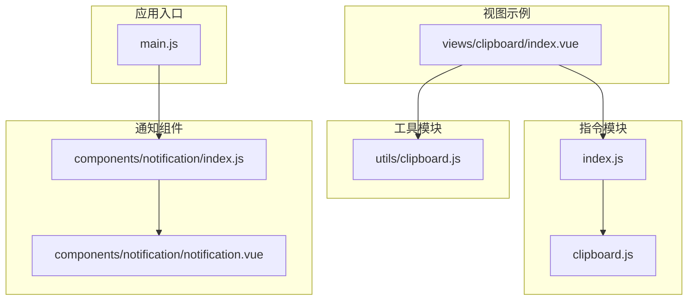
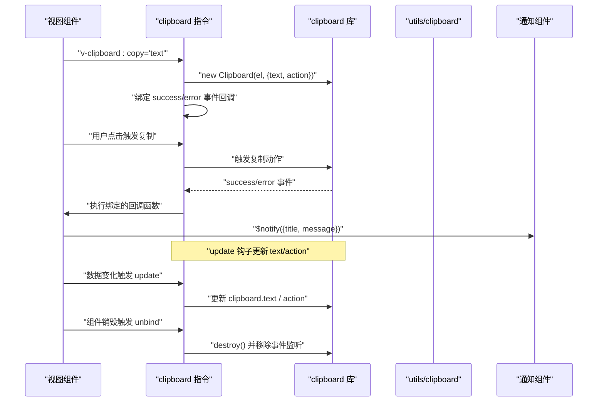
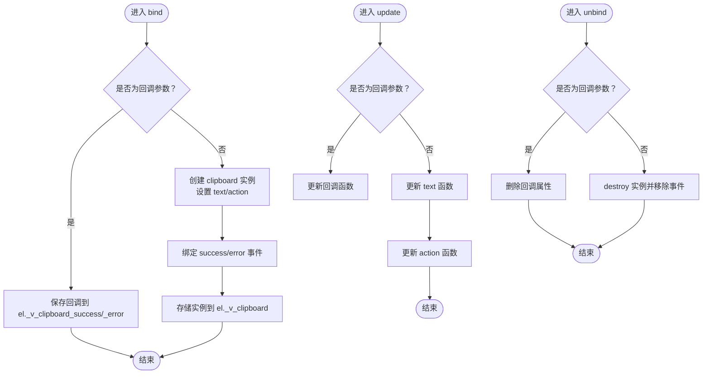
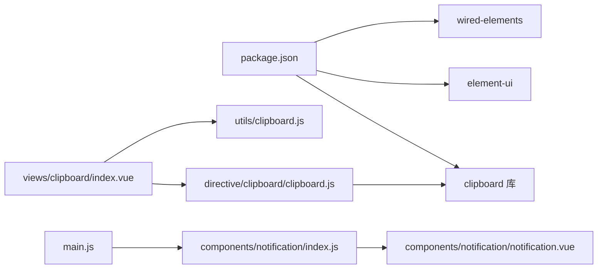

# 自定义指令

<cite>
**本文引用的文件**
- [clipboard.js](file://src/directive/clipboard/clipboard.js)
- [index.js](file://src/directive/clipboard/index.js)
- [clipboard.js](file://src/utils/clipboard.js)
- [index.vue](file://src/views/clipboard/index.vue)
- [main.js](file://src/main.js)
- [package.json](file://package.json)
- [index.js](file://src/components/notification/index.js)
- [notification.vue](file://src/components/notification/notification.vue)
- [example.spec.js](file://tests/unit/example.spec.js)
- [jest.config.js](file://jest.config.js)
</cite>

## 目录
1. [简介](#简介)
2. [项目结构](#项目结构)
3. [核心组件](#核心组件)
4. [架构总览](#架构总览)
5. [详细组件分析](#详细组件分析)
6. [依赖关系分析](#依赖关系分析)
7. [性能考虑](#性能考虑)
8. [故障排查指南](#故障排查指南)
9. [结论](#结论)
10. [附录](#附录)

## 简介
本指南围绕 Vue CMS 项目中的自定义指令进行系统性开发说明，重点覆盖：
- 指令生命周期钩子：bind、update、unbind 的职责与行为
- 绑定参数与动态行为：指令参数、修饰符与回调绑定
- DOM 操作与事件处理：如何安全地挂载/卸载外部库实例
- clipboard 指令的实现原理与使用方法
- 指令注册与使用：全局与局部两种方式
- 性能优化、内存泄漏防护与错误处理策略
- 测试方法与调试技巧
- 指令组合使用与高级用法最佳实践

## 项目结构
与自定义指令直接相关的目录与文件如下：
- 指令实现：src/directive/clipboard
  - clipboard.js：指令主体，封装 clipboard 库的生命周期与事件
  - index.js：导出指令并提供 install 方法，支持全局注册
- 工具函数：src/utils/clipboard.js
  - 封装 clipboard 库的工具函数，用于非指令场景
- 示例页面：src/views/clipboard/index.vue
  - 展示三种复制方式：原生 JS、第三方库、指令
- 应用入口：src/main.js
  - 注册全局通知组件，供指令回调中使用
- 依赖声明：package.json
  - 声明 clipboard、element-ui、wired-elements 等依赖
- 单元测试：tests/unit/example.spec.js
  - Jest 配置与基础示例，可扩展到指令测试

**图表来源**
- [clipboard.js:1-58](file://src/directive/clipboard/clipboard.js#L1-L58)
- [index.js:1-15](file://src/directive/clipboard/index.js#L1-L15)
- [clipboard.js:1-37](file://src/utils/clipboard.js#L1-L37)
- [index.vue:1-77](file://src/views/clipboard/index.vue#L1-L77)
- [main.js:1-53](file://src/main.js#L1-L53)
- [index.js:1-72](file://src/components/notification/index.js#L1-L72)
- [notification.vue:1-90](file://src/components/notification/notification.vue#L1-L90)

**章节来源**
- [clipboard.js:1-58](file://src/directive/clipboard/clipboard.js#L1-L58)
- [index.js:1-15](file://src/directive/clipboard/index.js#L1-L15)
- [clipboard.js:1-37](file://src/utils/clipboard.js#L1-L37)
- [index.vue:1-77](file://src/views/clipboard/index.vue#L1-L77)
- [main.js:1-53](file://src/main.js#L1-L53)
- [package.json:1-99](file://package.json#L1-L99)

## 核心组件
- clipboard 指令：封装 clipboard 库，提供 copy/cut 动作与回调绑定
- clipboard 工具函数：封装 clipboard 库，提供复制能力与回调清理
- 通知组件：用于在复制成功/失败时展示提示

关键点：
- 指令通过 bind/update/unbind 生命周期管理 clipboard 实例的创建、更新与销毁
- 通过指令参数区分 success/error 回调与主复制动作
- 通过工具函数提供更简洁的复制入口，并自动清理事件监听

**章节来源**
- [clipboard.js:7-57](file://src/directive/clipboard/clipboard.js#L7-L57)
- [clipboard.js:19-36](file://src/utils/clipboard.js#L19-L36)
- [index.js:1-72](file://src/components/notification/index.js#L1-L72)

## 架构总览
clipboard 指令与工具函数的协作关系如下：

**图表来源**
- [clipboard.js:8-56](file://src/directive/clipboard/clipboard.js#L8-L56)
- [clipboard.js:19-36](file://src/utils/clipboard.js#L19-L36)
- [index.vue:20-22](file://src/views/clipboard/index.vue#L20-L22)
- [index.js:1-72](file://src/components/notification/index.js#L1-L72)

## 详细组件分析

### clipboard 指令实现
- 生命周期钩子
  - bind：初始化 clipboard 实例，绑定 success/error 回调；若无参数则创建实例并监听事件
  - update：当绑定值或参数变化时，更新 clipboard 的 text/action 函数
  - unbind：销毁 clipboard 实例，移除事件监听，避免内存泄漏
- 参数与修饰符
  - 默认参数：复制文本值
  - 修饰符：copy/cut 控制复制/剪切动作
  - 特殊参数：success/error 分别绑定成功/失败回调
- DOM 操作与事件处理
  - 通过 el._v_clipboard 存储实例，便于后续 update/unbind 访问
  - 事件回调中仅调用绑定的回调函数，不直接操作 DOM
- 错误处理
  - 若未安装 clipboard 库，抛出明确错误提示
  - 成功/失败回调中可结合通知组件展示结果

**图表来源**
- [clipboard.js:8-56](file://src/directive/clipboard/clipboard.js#L8-L56)

**章节来源**
- [clipboard.js:1-58](file://src/directive/clipboard/clipboard.js#L1-L58)

### clipboard 工具函数
- 作用：在非指令场景下快速复制文本，自动绑定 success/error 事件并在完成后清理
- 使用场景：按钮点击等事件中直接调用，简化复制流程
- 清理策略：在 success/error 回调中 off 掉事件并 destroy 实例，避免内存泄漏

**章节来源**
- [clipboard.js:1-37](file://src/utils/clipboard.js#L1-L37)

### 视图示例与使用方式
- 展示三种复制方式：原生 JS、第三方库、指令
- 指令使用：v-clipboard:copy 绑定复制文本，v-clipboard:success 绑定成功回调
- 成功回调：结合通知组件展示“复制成功”提示

**章节来源**
- [index.vue:1-77](file://src/views/clipboard/index.vue#L1-L77)

### 通知组件与集成
- 通知组件提供统一的消息展示能力，指令回调中通过 $notify 调用
- 通知组件内部管理定时器与过渡动画，确保消息正确显示与关闭

**章节来源**
- [index.js:1-72](file://src/components/notification/index.js#L1-L72)
- [notification.vue:1-90](file://src/components/notification/notification.vue#L1-L90)

## 依赖关系分析
- clipboard 指令依赖 clipboard 库与 Vue 指令生命周期
- 视图示例依赖指令与工具函数，同时依赖通知组件
- 应用入口注册通知组件，使指令回调可用

**图表来源**
- [package.json:33-63](file://package.json#L33-L63)
- [clipboard.js:1-5](file://src/directive/clipboard/clipboard.js#L1-L5)
- [index.vue:29-30](file://src/views/clipboard/index.vue#L29-L30)
- [main.js:28-42](file://src/main.js#L28-L42)
- [index.js:1-72](file://src/components/notification/index.js#L1-L72)

**章节来源**
- [package.json:1-99](file://package.json#L1-L99)
- [clipboard.js:1-5](file://src/directive/clipboard/clipboard.js#L1-L5)
- [index.vue:29-30](file://src/views/clipboard/index.vue#L29-L30)
- [main.js:28-42](file://src/main.js#L28-L42)

## 性能考虑
- 实例复用与更新
  - 在 update 钩子中仅更新 text/action 函数，避免频繁创建/销毁实例
- 事件监听清理
  - 在 unbind 中 destroy 实例并移除事件监听，防止内存泄漏
- 回调函数缓存
  - 通过 el._v_clipboard_success/_error 缓存回调，减少闭包开销
- 通知组件优化
  - 通知组件内部使用定时器与过渡动画，注意在大量提示场景下的性能影响

**章节来源**
- [clipboard.js:33-56](file://src/directive/clipboard/clipboard.js#L33-L56)
- [index.js:24-46](file://src/components/notification/index.js#L24-L46)

## 故障排查指南
- 安装依赖
  - 若出现 clipboard 相关错误，请确认已安装 clipboard 库
- 回调未触发
  - 检查指令参数是否正确：v-clipboard:success 绑定成功回调，v-clipboard:error 绑定失败回调
- 复制无效
  - 确认绑定值有效且未被频繁更新导致实例被销毁
- 内存泄漏
  - 确保组件销毁时 unbind 被调用，实例已 destroy
- 通知不显示
  - 确认已在入口注册通知组件，并检查回调中是否正确调用 $notify

**章节来源**
- [clipboard.js:3-5](file://src/directive/clipboard/clipboard.js#L3-L5)
- [index.js:1-72](file://src/components/notification/index.js#L1-L72)

## 结论
本指南系统梳理了 Vue CMS 项目中 clipboard 指令的实现与使用，强调了生命周期钩子的正确使用、参数与回调的绑定方式、DOM 操作与事件处理的安全性、以及性能优化与内存泄漏防护策略。通过视图示例与工具函数的配合，开发者可以灵活选择指令或工具函数方式实现复制功能，并在需要时结合通知组件提升用户体验。

## 附录

### 指令注册与使用
- 全局注册
  - 在 index.js 中导出指令并通过 install 方法注册为全局指令
- 局部注册
  - 在组件内通过 directives 选项引入指令
- 使用方式
  - v-clipboard:copy 绑定复制文本
  - v-clipboard:success 绑定成功回调
  - v-clipboard:error 绑定失败回调

**章节来源**
- [index.js:1-15](file://src/directive/clipboard/index.js#L1-L15)
- [index.vue:34-36](file://src/views/clipboard/index.vue#L34-L36)

### 测试方法与调试技巧
- 单元测试
  - 可参考 tests/unit/example.spec.js 的结构，扩展 clipboard 指令的测试用例
- 调试技巧
  - 在指令钩子中添加日志输出，观察 bind/update/unbind 的触发时机
  - 使用浏览器开发者工具断点定位事件回调执行路径

**章节来源**
- [example.spec.js:1-12](file://tests/unit/example.spec.js#L1-L12)
- [jest.config.js:1-4](file://jest.config.js#L1-L4)

### 指令组合使用与高级用法
- 组合使用
  - 同时绑定 success/error 回调，分别处理不同状态
  - 在复杂表单中，通过 update 钩子动态切换复制内容
- 高级用法
  - 结合工具函数在事件处理器中直接调用复制逻辑
  - 在列表渲染中为每个项绑定独立的复制内容与回调

**章节来源**
- [clipboard.js:33-56](file://src/directive/clipboard/clipboard.js#L33-L56)
- [clipboard.js:19-36](file://src/utils/clipboard.js#L19-L36)