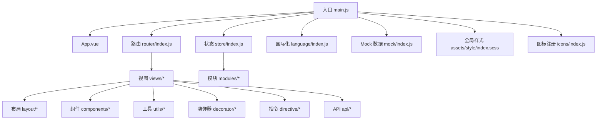
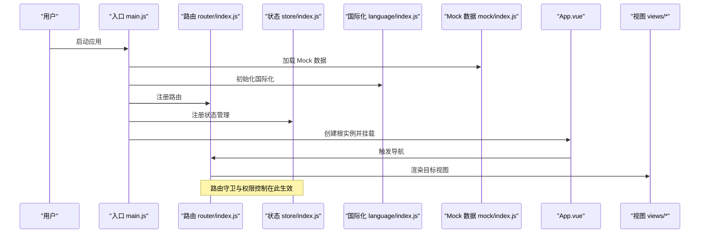
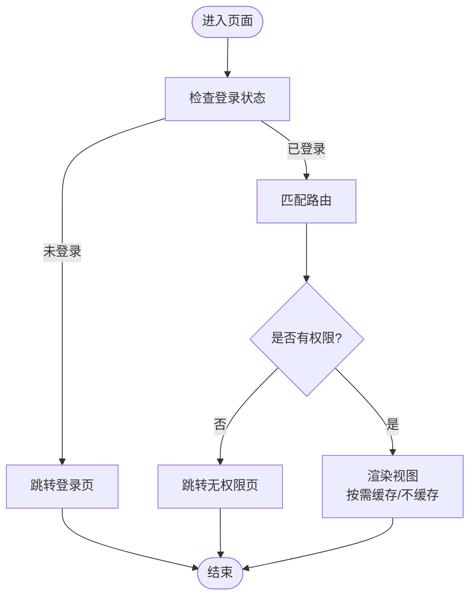
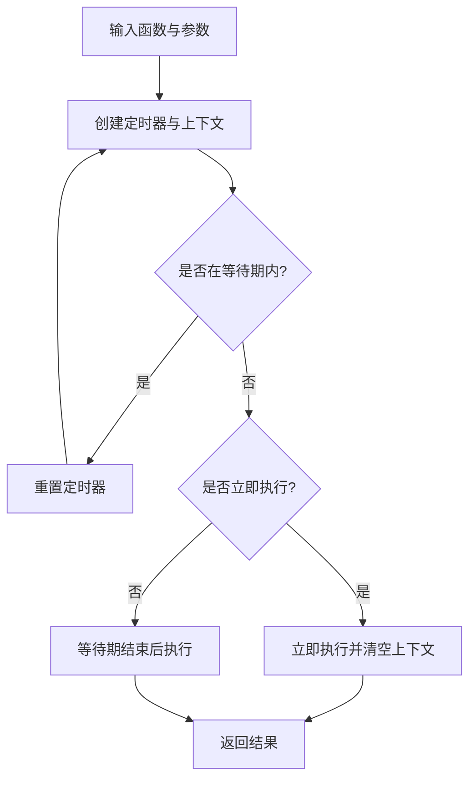
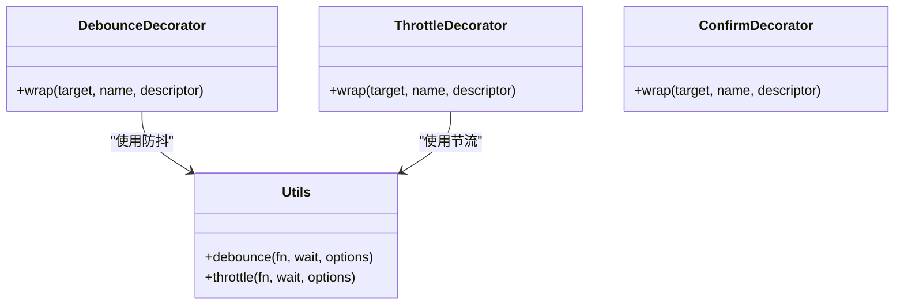
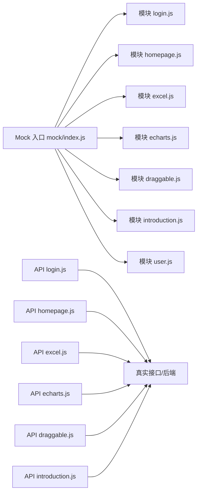
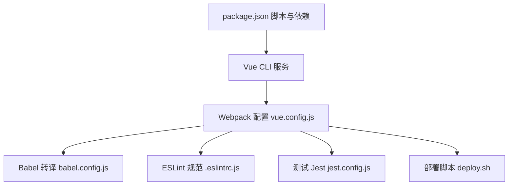

# 开发指南

<cite>
**本文引用的文件**
- [README.md](file://README.md)
- [package.json](file://package.json)
- [vue.config.js](file://vue.config.js)
- [babel.config.js](file://babel.config.js)
- [jest.config.js](file://jest.config.js)
- [deploy.sh](file://deploy.sh)
- [src/main.js](file://src/main.js)
- [src/App.vue](file://src/App.vue)
- [src/router/index.js](file://src/router/index.js)
- [src/store/index.js](file://src/store/index.js)
- [src/utils/index.js](file://src/utils/index.js)
- [src/utils/readme.md](file://src/utils/readme.md)
- [src/common/readme.md](file://src/common/readme.md)
- [src/decorator/readme.md](file://src/decorator/readme.md)
- [src/decorator/debounce.js](file://src/decorator/debounce.js)
- [src/decorator/throttle.js](file://src/decorator/throttle.js)
- [src/decorator/confirm.js](file://src/decorator/confirm.js)
- [src/mock/index.js](file://src/mock/index.js)
- [src/language/index.js](file://src/language/index.js)
- [src/assets/style/index.scss](file://src/assets/style/index.scss)
- [src/icons/index.js](file://src/icons/index.js)
- [src/directive/clipboard/index.js](file://src/directive/clipboard/index.js)
- [src/directive/clipboard/clipboard.js](file://src/directive/clipboard/clipboard.js)
- [src/views/login/index.vue](file://src/views/login/index.vue)
- [src/views/homepage/index.vue](file://src/views/homepage/index.vue)
- [src/layout/index.vue](file://src/layout/index.vue)
- [src/layout/header.vue](file://src/layout/header.vue)
- [src/layout/sidebar/index.vue](file://src/layout/sidebar/index.vue)
- [src/layout/main-container.vue](file://src/layout/main-container.vue)
- [src/components/notification/index.js](file://src/components/notification/index.js)
- [src/components/notification/notification.vue](file://src/components/notification/notification.vue)
- [src/api/login.js](file://src/api/login.js)
- [src/api/homepage.js](file://src/api/homepage.js)
- [src/api/excel.js](file://src/api/excel.js)
- [src/api/echarts.js](file://src/api/echarts.js)
- [src/api/draggable.js](file://src/api/draggable.js)
- [src/api/introduction.js](file://src/api/introduction.js)
- [src/mock/modules/login.js](file://src/mock/modules/login.js)
- [src/mock/modules/homepage.js](file://src/mock/modules/homepage.js)
- [src/mock/modules/excel.js](file://src/mock/modules/excel.js)
- [src/mock/modules/echarts.js](file://src/mock/modules/echarts.js)
- [src/mock/modules/draggable.js](file://src/mock/modules/draggable.js)
- [src/mock/modules/introduction.js](file://src/mock/modules/introduction.js)
- [src/mock/modules/user.js](file://src/mock/modules/user.js)
- [tests/unit/example.spec.js](file://tests/unit/example.spec.js)
</cite>

## 目录
1. [简介](#简介)
2. [项目结构](#项目结构)
3. [核心组件](#核心组件)
4. [架构总览](#架构总览)
5. [详细组件分析](#详细组件分析)
6. [依赖关系分析](#依赖关系分析)
7. [性能考虑](#性能考虑)
8. [故障排查指南](#故障排查指南)
9. [结论](#结论)
10. [附录](#附录)

## 简介
本指南面向 Vue CMS 项目团队与贡献者，系统阐述开发规范、代码风格、最佳实践与工程化流程。项目采用 Vue 2.7 + Element UI 技术栈，提供国际化、权限控制、动态路由、Mock 数据、ECharts 图表、Excel 导入导出、富文本编辑器、主题切换等能力。本文档覆盖工具函数库、装饰器模式、组件组织、文件命名与目录结构、错误处理与日志、测试策略、构建配置与部署流程，并给出团队协作与维护建议。

## 项目结构
项目采用“按功能域分层 + 模块化”的组织方式，核心目录与职责概览：
- public：静态资源与入口 HTML
- src：
  - api：接口封装与业务 API
  - common：通用工具与常量（如鉴权）
  - components：可复用组件（通知、图标、全屏、主题等）
  - config：粒子动画、过渡动画等配置
  - decorator：装饰器（防抖、节流、确认提示）
  - directive：自定义指令（剪贴板）
  - icons：SVG 图标注册
  - language：国际化
  - layout：布局、头部、侧边栏、主容器、标签页
  - mock：Mock 数据与模块化 Mock
  - router：路由配置与动态路由
  - store：状态管理（modules）
  - utils：通用工具函数
  - views：页面视图
  - assets/style：全局样式与主题
  - App.vue、main.js：应用入口与挂载
- tests：单元测试
- 配置文件：vue.config.js、babel.config.js、jest.config.js、package.json、README.md 等

**图表来源**
- [src/main.js:1-53](file://src/main.js#L1-L53)
- [src/App.vue:1-35](file://src/App.vue#L1-L35)
- [src/router/index.js:1-343](file://src/router/index.js#L1-L343)
- [src/store/index.js](file://src/store/index.js)
- [src/language/index.js](file://src/language/index.js)
- [src/mock/index.js](file://src/mock/index.js)
- [src/assets/style/index.scss](file://src/assets/style/index.scss)
- [src/icons/index.js](file://src/icons/index.js)

**章节来源**
- [README.md:98-132](file://README.md#L98-L132)
- [package.json:24-32](file://package.json#L24-L32)

## 核心组件
- 应用入口与挂载：在入口文件中完成 Element UI 全局配置、国际化注入、全局组件注册、Mock 数据引入、权限守卫挂载等。
- 路由系统：常量路由 + 动态路由 + 末尾兜底路由，支持嵌套路由、菜单渲染、权限控制与 keep-alive 缓存策略。
- 状态管理：模块化管理语言、权限、标签页、用户等状态。
- 国际化：基于 vue-i18n，支持中英文切换。
- 工具函数库：提供防抖、深拷贝、DOM 类名操作、运行环境判断等通用能力。
- 装饰器：提供函数防抖、节流与确认提示装饰器，用于简化高频交互与安全操作。
- Mock 数据：统一入口与模块化拆分，便于开发与联调。
- 布局与组件：提供通知、图标、全屏、主题切换等通用组件。
- 指令：剪贴板复制指令，简化复制操作。

**章节来源**
- [src/main.js:1-53](file://src/main.js#L1-L53)
- [src/router/index.js:1-343](file://src/router/index.js#L1-L343)
- [src/store/index.js](file://src/store/index.js)
- [src/utils/index.js:1-122](file://src/utils/index.js#L1-L122)
- [src/decorator/debounce.js:1-21](file://src/decorator/debounce.js#L1-L21)
- [src/decorator/throttle.js:1-20](file://src/decorator/throttle.js#L1-L20)
- [src/decorator/confirm.js:1-28](file://src/decorator/confirm.js#L1-L28)
- [src/mock/index.js](file://src/mock/index.js)
- [src/components/notification/index.js](file://src/components/notification/index.js)
- [src/directive/clipboard/clipboard.js](file://src/directive/clipboard/clipboard.js)

## 架构总览
下图展示了从入口到页面渲染的关键链路，包括路由守卫、权限控制、Mock 数据与 Element UI 初始化。

**图表来源**
- [src/main.js:1-53](file://src/main.js#L1-L53)
- [src/router/index.js:1-343](file://src/router/index.js#L1-L343)
- [src/store/index.js](file://src/store/index.js)
- [src/language/index.js](file://src/language/index.js)
- [src/mock/index.js](file://src/mock/index.js)
- [src/App.vue:1-35](file://src/App.vue#L1-L35)

## 详细组件分析

### 路由与权限控制
- 路由结构：常量路由（登录、重定向、首页）、动态路由（根据权限加载）、末尾兜底路由（404、无权限、通配符）。
- 嵌套路由：支持多级菜单，alwaysShow 控制是否在菜单中显示根节点。
- 权限控制：结合路由守卫与用户角色动态拼接路由，resetRouter 支持重置路由与重新挂载守卫。
- keep-alive：通过 meta.noCache 控制页面缓存策略。

**图表来源**
- [src/router/index.js:1-343](file://src/router/index.js#L1-L343)

**章节来源**
- [src/router/index.js:1-343](file://src/router/index.js#L1-L343)

### 状态管理（Vuex）
- 模块化：语言、权限、标签页、用户等状态拆分为独立模块，便于维护与按需加载。
- 语言模块：切换语言时更新 Element UI 国际化与页面文案。
- 权限模块：根据用户角色动态生成可访问路由集合。
- 标签页模块：记录打开的页面标签，支持关闭与刷新。
- 用户模块：保存用户信息与登录态。

**章节来源**
- [src/store/index.js](file://src/store/index.js)

### 国际化（vue-i18n）
- 多语言：中文与英文配置，配合 Element UI 的 i18n 回调。
- 使用：在 Element UI 组件与页面文案中通过 $t 使用翻译键。
- 切换：通过语言模块更新语言状态，影响全局文案与组件文案。

**章节来源**
- [src/language/index.js](file://src/language/index.js)

### 工具函数库（utils）
- 防抖与深拷贝：提供通用防抖实现与简易深拷贝，满足高频事件与数据复制场景。
- DOM 操作：hasClass、addClass、removeClass、toggleClass，便于组件样式切换。
- 环境判断：isDev 用于区分开发与生产环境，便于调试与日志输出控制。

**图表来源**
- [src/utils/index.js:12-45](file://src/utils/index.js#L12-L45)

**章节来源**
- [src/utils/index.js:1-122](file://src/utils/index.js#L1-L122)
- [src/utils/readme.md:1-10](file://src/utils/readme.md#L1-L10)

### 装饰器模式（decorator）
- 防抖装饰器：对方法进行防抖包装，适用于搜索、窗口尺寸监听等高频触发场景。
- 节流装饰器：对方法进行节流包装，适用于滚动、鼠标移动等持续事件。
- 确认提示装饰器：在执行前弹出确认框，增强危险操作的安全性。

**图表来源**
- [src/decorator/debounce.js:1-21](file://src/decorator/debounce.js#L1-L21)
- [src/decorator/throttle.js:1-20](file://src/decorator/throttle.js#L1-L20)
- [src/decorator/confirm.js:1-28](file://src/decorator/confirm.js#L1-L28)
- [src/utils/index.js:12-45](file://src/utils/index.js#L12-L45)

**章节来源**
- [src/decorator/readme.md:1-8](file://src/decorator/readme.md#L1-L8)
- [src/decorator/debounce.js:1-21](file://src/decorator/debounce.js#L1-L21)
- [src/decorator/throttle.js:1-20](file://src/decorator/throttle.js#L1-L20)
- [src/decorator/confirm.js:1-28](file://src/decorator/confirm.js#L1-L28)

### Mock 数据与 API
- Mock 入口：统一加载所有模块化 Mock，便于开发阶段联调。
- 模块化 Mock：按功能拆分 login、homepage、excel、echarts、draggable、introduction、user 等模块，便于维护与扩展。
- API 层：在 api 目录下封装具体业务接口，与后端约定一致的契约，便于替换真实接口。

**图表来源**
- [src/mock/index.js](file://src/mock/index.js)
- [src/mock/modules/login.js](file://src/mock/modules/login.js)
- [src/mock/modules/homepage.js](file://src/mock/modules/homepage.js)
- [src/mock/modules/excel.js](file://src/mock/modules/excel.js)
- [src/mock/modules/echarts.js](file://src/mock/modules/echarts.js)
- [src/mock/modules/draggable.js](file://src/mock/modules/draggable.js)
- [src/mock/modules/introduction.js](file://src/mock/modules/introduction.js)
- [src/mock/modules/user.js](file://src/mock/modules/user.js)
- [src/api/login.js](file://src/api/login.js)
- [src/api/homepage.js](file://src/api/homepage.js)
- [src/api/excel.js](file://src/api/excel.js)
- [src/api/echarts.js](file://src/api/echarts.js)
- [src/api/draggable.js](file://src/api/draggable.js)
- [src/api/introduction.js](file://src/api/introduction.js)

**章节来源**
- [src/mock/index.js](file://src/mock/index.js)
- [src/mock/modules/login.js](file://src/mock/modules/login.js)
- [src/mock/modules/homepage.js](file://src/mock/modules/homepage.js)
- [src/mock/modules/excel.js](file://src/mock/modules/excel.js)
- [src/mock/modules/echarts.js](file://src/mock/modules/echarts.js)
- [src/mock/modules/draggable.js](file://src/mock/modules/draggable.js)
- [src/mock/modules/introduction.js](file://src/mock/modules/introduction.js)
- [src/mock/modules/user.js](file://src/mock/modules/user.js)
- [src/api/login.js](file://src/api/login.js)
- [src/api/homepage.js](file://src/api/homepage.js)
- [src/api/excel.js](file://src/api/excel.js)
- [src/api/echarts.js](file://src/api/echarts.js)
- [src/api/draggable.js](file://src/api/draggable.js)
- [src/api/introduction.js](file://src/api/introduction.js)

### 布局与通用组件
- 布局：提供顶部导航、侧边栏、主容器、标签页等布局组件，支持主题切换与全屏。
- 通知：全局通知组件，统一消息提示风格。
- 图标：SVG Sprite 图标注册，支持按需引入与复用。
- 全屏：基于 screenfull 实现全屏切换。
- 主题：支持多套主题样式切换。

**章节来源**
- [src/layout/index.vue](file://src/layout/index.vue)
- [src/layout/header.vue](file://src/layout/header.vue)
- [src/layout/sidebar/index.vue](file://src/layout/sidebar/index.vue)
- [src/layout/main-container.vue](file://src/layout/main-container.vue)
- [src/components/notification/index.js](file://src/components/notification/index.js)
- [src/components/notification/notification.vue](file://src/components/notification/notification.vue)
- [src/icons/index.js](file://src/icons/index.js)

### 自定义指令（剪贴板）
- 通过 clipboard 指令简化复制操作，减少重复代码与跨浏览器兼容问题。

**章节来源**
- [src/directive/clipboard/index.js](file://src/directive/clipboard/index.js)
- [src/directive/clipboard/clipboard.js](file://src/directive/clipboard/clipboard.js)

### 页面视图与示例
- 登录页：演示登录流程与表单校验。
- 首页：仪表盘与图表展示。
- 其他页面：富文本编辑器、Excel 导入导出、拖拽列表、主题切换等。

**章节来源**
- [src/views/login/index.vue](file://src/views/login/index.vue)
- [src/views/homepage/index.vue](file://src/views/homepage/index.vue)

## 依赖关系分析
- 构建与运行：Vue CLI 服务、Webpack 配置、Babel 转译、Prettier 格式化、ESLint 规范。
- 依赖管理：package.json 中声明生产与开发依赖，脚本命令涵盖开发、构建、测试、格式化等。
- 代理与环境：vue.config.js 提供 devServer 代理配置，支持环境变量注入。
- 测试：Jest 单测配置，示例用例位于 tests/unit。

**图表来源**
- [package.json:24-32](file://package.json#L24-L32)
- [vue.config.js:1-144](file://vue.config.js#L1-L144)
- [babel.config.js:1-12](file://babel.config.js#L1-L12)
- [jest.config.js:1-4](file://jest.config.js#L1-L4)
- [deploy.sh:1-26](file://deploy.sh#L1-L26)

**章节来源**
- [package.json:1-99](file://package.json#L1-L99)
- [vue.config.js:1-144](file://vue.config.js#L1-L144)
- [babel.config.js:1-12](file://babel.config.js#L1-L12)
- [jest.config.js:1-4](file://jest.config.js#L1-L4)
- [deploy.sh:1-26](file://deploy.sh#L1-L26)

## 性能考虑
- 预加载与预取：默认删除 prefetch 插件，按需保留 preload 以优化首屏关键资源加载。
- 代码分割：splitChunks 将第三方库、Element UI、组件库拆分为独立 chunk，提升缓存命中率。
- 运行时优化：启用 runtimeChunk 单独提取运行时代码，减少重复打包。
- 生产构建：关闭生产环境 source map 以减小体积与提升构建速度。
- SVG 图标：使用 svg-sprite-loader 统一管理图标，减少请求与体积。
- 组件缓存：通过 keep-alive 与 meta.noCache 控制页面缓存，平衡性能与数据实时性。

**章节来源**
- [vue.config.js:66-142](file://vue.config.js#L66-L142)

## 故障排查指南
- 开发代理失败：检查 devServer.proxy 配置与环境变量 VUE_APP_BASE_API、VUE_APP_PROXY_API。
- 路由跳转异常：确认路由守卫逻辑与 resetRouter 重置流程，避免重复挂载。
- 国际化失效：检查 language 配置与 Element UI i18n 回调，确保键值正确。
- Mock 数据不生效：确认 mock/index.js 是否被入口加载，模块化 Mock 文件路径与导出是否正确。
- 组件样式冲突：检查全局样式与主题切换逻辑，避免覆盖 Element UI 默认样式。
- 单测报错：检查 jest.config.js 配置与示例用例语法，确保依赖与快照一致。

**章节来源**
- [vue.config.js:29-50](file://vue.config.js#L29-L50)
- [src/router/index.js:332-340](file://src/router/index.js#L332-L340)
- [src/main.js:22-40](file://src/main.js#L22-L40)
- [src/mock/index.js](file://src/mock/index.js)
- [jest.config.js:1-4](file://jest.config.js#L1-L4)

## 结论
本指南从架构、组件、工具、装饰器、Mock 与 API、国际化、布局与组件、指令、路由与权限、构建与部署、测试与排错等方面，系统梳理了 Vue CMS 项目的开发要点。建议团队在日常协作中严格遵循文件命名与目录规范，统一代码风格与提交规范，持续优化性能与可维护性，保障项目长期稳定演进。

## 附录

### 开发规范与最佳实践
- 目录与文件命名
  - 组件：PascalCase（如 MyComponent.vue），页面：PascalCase（如 UserProfile.vue），工具：kebab-case（如 date-util.js）。
  - 模块化 API：按功能命名（如 user-api.js），Mock 模块同名拆分至 modules 目录。
- 组件组织
  - 单文件组件按功能聚合，复杂组件拆分子组件；通用组件放入 components 目录，页面组件放入 views 目录。
  - 布局组件统一在 layout 目录，按职责拆分 header、sidebar、main-container、tabs-view 等。
- 代码风格
  - 使用 ESLint 与 Prettier 统一风格；在开发环境下开启 lintOnSave，保证提交质量。
- 装饰器使用
  - 高频交互（搜索、窗口尺寸）使用防抖；持续事件（滚动、拖拽）使用节流；危险操作（删除、提交）使用确认装饰器。
- 错误处理与日志
  - 统一在 API 层捕获错误并提示；在 utils 中提供通用错误处理工具；开发环境打印调试信息，生产环境避免敏感信息泄露。
- 日志记录
  - 使用浏览器控制台与网络面板定位问题；必要时在 utils 中增加轻量日志工具（不建议在生产环境持久化）。
- 调试技巧
  - 使用 Vue DevTools 检查组件树与状态；利用路由与权限守卫断点定位导航问题；Mock 数据与真实接口切换通过注释入口文件中的 require 调用。

### 测试策略
- 单元测试：使用 Jest 与 Vue Test Utils，覆盖核心工具函数与纯函数；示例用例位于 tests/unit。
- 集成测试：通过 Mock 数据模拟接口，验证路由、权限、页面渲染与交互流程。
- 端到端测试：可选 Playwright/Cypress，覆盖关键用户路径（登录、导航、导出、导入等）。

**章节来源**
- [tests/unit/example.spec.js](file://tests/unit/example.spec.js)
- [jest.config.js:1-4](file://jest.config.js#L1-L4)

### 构建配置与环境变量
- 构建命令：开发 serve、生产 build、测试 test:unit、代码检查 lint/lint-fix、格式化 prettier-fix。
- 环境变量：.env（通用）、.env.development（开发）、.env.production（生产），通过 VUE_APP_* 注入前端。
- 代理配置：devServer.proxy 将 API 请求转发至后端服务，支持路径重写。
- 生产优化：关闭 source map、拆分第三方库与公共组件、提取运行时代码。

**章节来源**
- [package.json:24-32](file://package.json#L24-L32)
- [vue.config.js:14-28](file://vue.config.js#L14-L28)
- [vue.config.js:33-41](file://vue.config.js#L33-L41)
- [vue.config.js:104-141](file://vue.config.js#L104-L141)

### 部署流程
- 本地构建：npm run build 生成 dist 目录。
- 静态托管：将 dist 目录部署至静态服务器或 GitHub Pages。
- 自动化脚本：deploy.sh 自动构建并推送至 gh-pages 分支，支持手动与自动两种部署方式。

**章节来源**
- [README.md:61-72](file://README.md#L61-L72)
- [deploy.sh:1-26](file://deploy.sh#L1-L26)

### 开发工具推荐
- 编辑器：VSCode（推荐安装 ESLint、Prettier、Vue Language Features 插件）。
- 浏览器：Chrome（Vue DevTools、Network 面板）、Edge/Firefox（兼容性验证）。
- Git：使用分支管理与 PR Review，配合 husky/pre-commit 执行 lint 与格式化。
- Mock：Mock.js 与本地 mock/index.js 配合，便于前后端并行开发。
- 性能：Webpack Bundle Analyzer（构建产物分析），Chrome Performance 面板（运行时性能）。