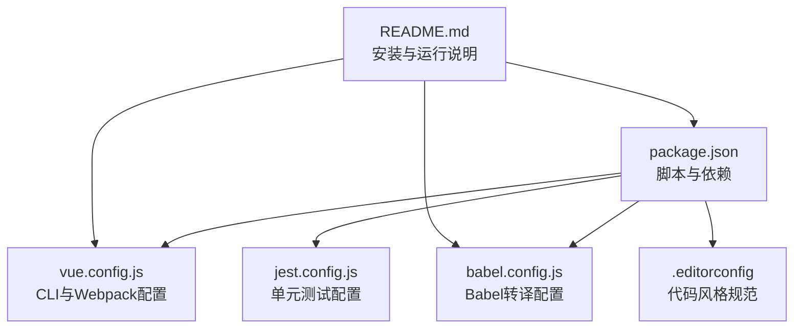
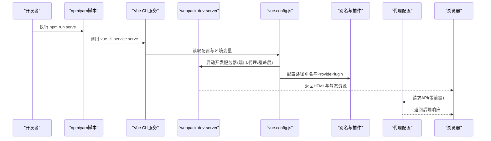
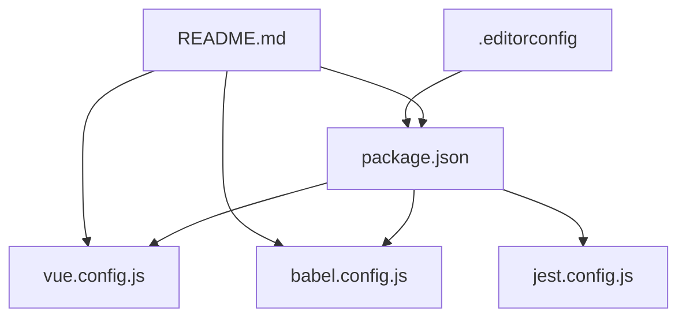

# 开发环境搭建

<cite>
**本文档引用的文件**
- [package.json](file://package.json)
- [babel.config.js](file://babel.config.js)
- [vue.config.js](file://vue.config.js)
- [README.md](file://README.md)
- [.editorconfig](file://.editorconfig)
- [jest.config.js](file://jest.config.js)
</cite>

## 目录
1. [简介](#简介)
2. [项目结构](#项目结构)
3. [核心组件](#核心组件)
4. [架构总览](#架构总览)
5. [详细组件分析](#详细组件分析)
6. [依赖关系分析](#依赖关系分析)
7. [性能考虑](#性能考虑)
8. [故障排除指南](#故障排除指南)
9. [结论](#结论)
10. [附录](#附录)

## 简介
本指南面向Vue CMS项目的开发者，提供从零开始搭建开发环境的完整流程与最佳实践。内容涵盖Node.js版本要求、包管理器选择与依赖安装、Vue CLI配置、Babel转译配置、开发服务器设置、环境变量配置、热重载机制与开发调试工具、IDE配置建议与代码格式化、常见问题解决方案与性能优化建议，以及跨平台开发注意事项。

## 项目结构
该项目采用Vue CLI 5脚手架，结合Vue 2.7与Element-UI 2.15进行企业级后台管理系统开发。核心配置集中在package.json、babel.config.js、vue.config.js中，并辅以README.md提供安装与运行说明。

**图表来源**
- [package.json:1-99](file://package.json#L1-L99)
- [vue.config.js:1-144](file://vue.config.js#L1-L144)
- [babel.config.js:1-12](file://babel.config.js#L1-L12)
- [jest.config.js:1-4](file://jest.config.js#L1-L4)
- [README.md:1-169](file://README.md#L1-L169)

**章节来源**
- [README.md:39-72](file://README.md#L39-L72)
- [package.json:24-32](file://package.json#L24-L32)

## 核心组件
- Node.js与包管理器
  - Node.js版本要求：引擎字段要求Node >= 6.0.0，npm >= 3.0.0。
  - 包管理器建议：优先使用npm；若npm下载缓慢，可通过镜像源加速安装。
- Vue CLI与脚本
  - 使用@vue/cli-service提供的serve/build/test/lint命令。
  - 常用脚本：serve（开发）、build（生产构建）、test:unit（单元测试）、lint/lint-fix（代码检查与修复）、prettier-fix（格式化）。
- Babel转译
  - 预设：@vue/cli-plugin-babel/preset，启用core-js按需polyfill。
- 开发服务器
  - 端口：默认8888（可通过环境变量PORT覆盖）。
  - 代理：基于VUE_APP_BASE_API与VUE_APP_PROXY_API进行API代理。
  - 热重载：devServer.client.overlay显示编译错误，open自动打开浏览器。
- 路径别名与插件
  - @别名指向src目录。
  - ProvidePlugin注入Quill全局变量，便于富文本组件使用。
- 打包优化
  - 生产环境关闭source map以提升构建速度。
  - SplitChunks拆分第三方库、Element-UI与公共组件，runtimeChunk抽取运行时。

**章节来源**
- [package.json:88-97](file://package.json#L88-L97)
- [package.json:24-32](file://package.json#L24-L32)
- [babel.config.js:1-12](file://babel.config.js#L1-L12)
- [vue.config.js:10-50](file://vue.config.js#L10-L50)
- [vue.config.js:51-65](file://vue.config.js#L51-L65)
- [vue.config.js:104-142](file://vue.config.js#L104-L142)

## 架构总览
下图展示了开发环境启动到页面渲染的关键路径：npm/yarn脚本调用@vue/cli-service，读取vue.config.js配置，启动webpack-dev-server，应用别名与插件，处理SVG图标加载与分包策略，并通过代理转发API请求。

**图表来源**
- [package.json:24-32](file://package.json#L24-L32)
- [vue.config.js:14-65](file://vue.config.js#L14-L65)

## 详细组件分析

### Node.js与包管理器
- 版本要求
  - engines字段明确要求Node >= 6.0.0，npm >= 3.0.0。
- 安装建议
  - 推荐使用npm安装依赖；若网络较慢，可使用国内镜像源。
  - README提供两种安装方式：yarn安装或npm指定registry。
- 跨平台注意事项
  - Windows/Linux/macOS均满足engines要求，但需注意npm/yarn缓存与权限差异。

**章节来源**
- [package.json:88-91](file://package.json#L88-L91)
- [README.md:49-56](file://README.md#L49-L56)

### Vue CLI与脚本
- 脚本命令
  - serve：启动开发服务器，默认端口8888。
  - build：生产构建，输出至dist目录，静态资源放置于static。
  - test:unit：运行单元测试（Jest）。
  - lint/lint-fix：ESLint检查与自动修复。
  - prettier-fix：统一代码格式。
- 浏览器兼容性
  - browserslist配置包含"> 1%"、"last 2 versions"、"not ie <= 8"、"not dead"。

**章节来源**
- [package.json:24-32](file://package.json#L24-L32)
- [package.json:92-97](file://package.json#L92-L97)

### Babel转译配置
- 预设与polyfill
  - 使用@vue/cli-plugin-babel/preset，useBuiltIns设置为"entry"或"usage"均可，core-js版本为3。
- 与Vue CLI集成
  - 通过@vue/cli-service自动应用，无需额外手动配置。

**章节来源**
- [babel.config.js:1-12](file://babel.config.js#L1-L12)

### 开发服务器设置
- 端口与主机
  - 端口默认8888，可通过环境变量PORT覆盖；host设置为0.0.0.0以便局域网访问。
- 代理配置
  - 代理目标由VUE_APP_PROXY_API决定，路径前缀由VUE_APP_BASE_API控制，支持changeOrigin与pathRewrite。
- 错误覆盖层
  - client.overlay仅显示错误，不显示警告，避免干扰开发。
- 自动打开
  - open为true，启动后自动打开浏览器。

**章节来源**
- [vue.config.js:10-50](file://vue.config.js#L10-L50)

### 路径别名与插件
- 别名
  - @指向src目录，便于组件与模块导入。
- ProvidePlugin
  - 注入Quill全局变量，简化富文本组件使用。

**章节来源**
- [vue.config.js:51-65](file://vue.config.js#L51-L65)

### SVG图标加载与分包策略
- SVG加载
  - 排除src/icons目录下的SVG，改用svg-sprite-loader加载，统一生成图标符号。
- 分包策略
  - 生产环境启用SplitChunks，拆分node_modules为chunk-libs，Element-UI为chunk-elementUI，公共组件为chunk-commons，runtimeChunk抽取运行时。

**章节来源**
- [vue.config.js:89-142](file://vue.config.js#L89-L142)

### 单元测试配置
- Jest预设
  - 使用@vue/cli-plugin-unit-jest提供的预设，适配Vue 2与Jest生态。

**章节来源**
- [jest.config.js:1-4](file://jest.config.js#L1-L4)

### IDE配置与代码格式化
- EditorConfig
  - 统一缩进风格为space，大小2；行尾LF；末尾插入换行；删除行尾空白；Markdown例外。
- ESLint与Prettier
  - 项目集成ESLint与Prettier，配合@vue/eslint-config-prettier减少冲突。
  - 建议在IDE中启用保存时自动格式化与ESLint检查。

**章节来源**
- [.editorconfig:1-26](file://.editorconfig#L1-L26)
- [package.json:74-83](file://package.json#L74-L83)

## 依赖关系分析
下图展示关键配置文件之间的依赖关系与交互：

**图表来源**
- [package.json:1-99](file://package.json#L1-L99)
- [vue.config.js:1-144](file://vue.config.js#L1-L144)
- [babel.config.js:1-12](file://babel.config.js#L1-L12)
- [jest.config.js:1-4](file://jest.config.js#L1-L4)
- [README.md:1-169](file://README.md#L1-L169)
- [.editorconfig:1-26](file://.editorconfig#L1-L26)

**章节来源**
- [package.json:1-99](file://package.json#L1-L99)
- [README.md:118-131](file://README.md#L118-L131)

## 性能考虑
- 关闭生产source map
  - 生产环境productionSourceMap设为false，显著提升构建速度。
- 预加载与预取
  - 项目显式删除preload与prefetch插件，避免对多页面场景造成无意义请求。
- 分包优化
  - SplitChunks按库、UI框架与公共组件拆分，runtimeChunk抽取运行时，提升缓存命中率。
- 代理与网络
  - 通过代理避免跨域，合理设置pathRewrite，降低后端压力。

**章节来源**
- [vue.config.js:26-27](file://vue.config.js#L26-L27)
- [vue.config.js:79-87](file://vue.config.js#L79-L87)
- [vue.config.js:116-141](file://vue.config.js#L116-L141)

## 故障排除指南
- 端口占用
  - 若8888端口被占用，可在启动前设置环境变量PORT=新端口，或修改vue.config.js中的port配置。
- 代理无法转发
  - 确认VUE_APP_BASE_API与VUE_APP_PROXY_API已正确设置，且路径前缀匹配。
- 热更新无效
  - 检查devServer.client.overlay配置与浏览器控制台错误；确保未被防火墙拦截。
- ESLint/Prettier冲突
  - 使用npm run lint-fix或npm run prettier-fix统一修复；必要时在IDE中禁用冲突规则。
- Windows路径问题
  - 注意路径分隔符与大小写敏感性；EditorConfig与Webpack别名配置需保持一致。

**章节来源**
- [vue.config.js:10-50](file://vue.config.js#L10-L50)
- [README.md:49-56](file://README.md#L49-L56)
- [package.json:74-83](file://package.json#L74-L83)

## 结论
通过遵循本指南，您可以快速完成Vue CMS项目的开发环境搭建。重点在于：满足Node.js版本要求、正确配置Vue CLI与Babel、合理设置开发服务器与代理、启用分包与性能优化、统一IDE与代码格式化规范。遇到问题时，优先检查端口、代理、ESLint与Prettier配置，并参考故障排除章节进行定位与修复。

## 附录
- 快速开始
  - 克隆仓库后，执行依赖安装与启动脚本，即可在浏览器访问开发服务器。
- 推荐IDE插件
  - ESLint、Prettier、EditorConfig、Vue Language Features、Auto Rename Tag等。
- 跨平台建议
  - 使用WSL（Windows）或虚拟机（macOS/Linux）时，注意文件系统性能与路径映射。

**章节来源**
- [README.md:39-72](file://README.md#L39-L72)
- [package.json:24-32](file://package.json#L24-L32)