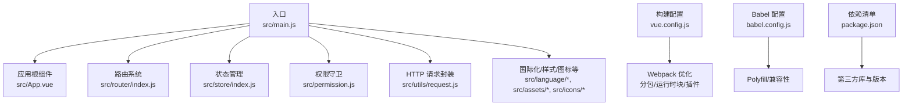
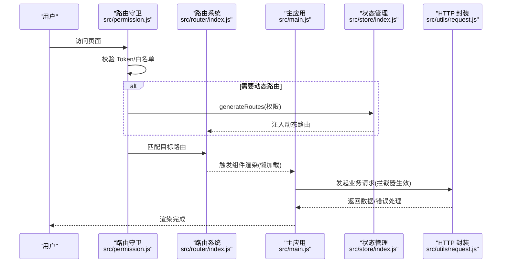
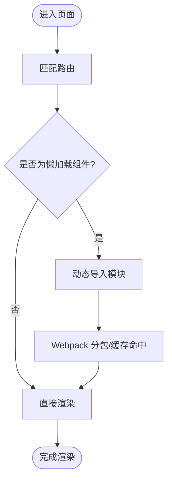
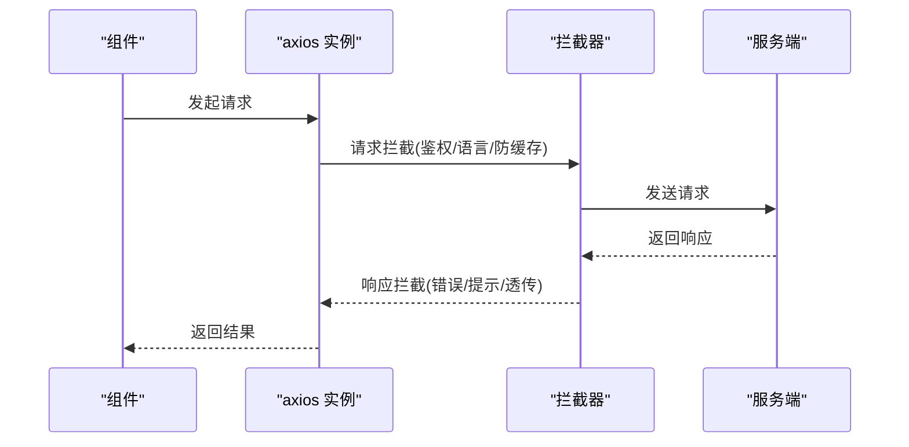
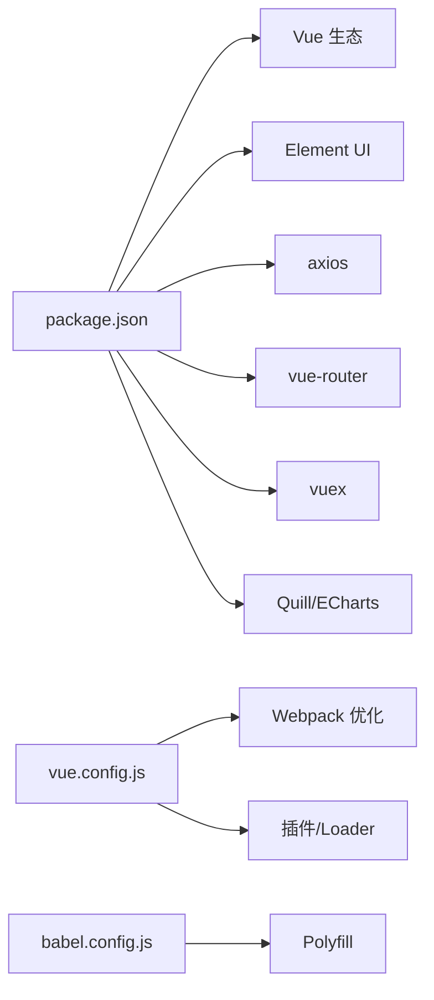

# 性能优化指南

<cite>
**本文引用的文件**
- [package.json](file://package.json)
- [vue.config.js](file://vue.config.js)
- [babel.config.js](file://babel.config.js)
- [src/main.js](file://src/main.js)
- [src/router/index.js](file://src/router/index.js)
- [src/App.vue](file://src/App.vue)
- [src/store/index.js](file://src/store/index.js)
- [src/utils/request.js](file://src/utils/request.js)
- [src/common/auth.js](file://src/common/auth.js)
- [src/permission.js](file://src/permission.js)
- [src/assets/style/index.scss](file://src/assets/style/index.scss)
</cite>

## 目录
1. [简介](#简介)
2. [项目结构](#项目结构)
3. [核心组件](#核心组件)
4. [架构总览](#架构总览)
5. [详细组件分析](#详细组件分析)
6. [依赖关系分析](#依赖关系分析)
7. [性能考量](#性能考量)
8. [故障排查指南](#故障排查指南)
9. [结论](#结论)
10. [附录](#附录)

## 简介
本指南面向 Vue 2.x CMS 项目，聚焦于性能优化策略与落地实践，涵盖打包与运行时优化、组件懒加载与代码分割、图片与资源优化、缓存策略、内存与 DOM 优化、事件处理优化、路由懒加载、组件按需引入、第三方库优化、性能监控与测试、移动端适配与首屏优化等。文档基于仓库现有配置与代码进行分析，并提供可操作的改进建议。

## 项目结构
项目采用 Vue CLI 生成器标准结构，核心入口为 main.js，路由集中在 router/index.js，状态管理通过 store 自动扫描 modules，权限控制在 permission.js 中实现全局守卫与进度条控制。构建配置位于 vue.config.js，Babel 配置位于 babel.config.js。

图示来源
- [src/main.js:1-53](file://src/main.js#L1-L53)
- [src/router/index.js:1-343](file://src/router/index.js#L1-L343)
- [src/store/index.js:1-74](file://src/store/index.js#L1-L74)
- [src/permission.js:1-98](file://src/permission.js#L1-L98)
- [src/utils/request.js:1-139](file://src/utils/request.js#L1-L139)
- [vue.config.js:1-144](file://vue.config.js#L1-L144)
- [babel.config.js:1-12](file://babel.config.js#L1-L12)
- [package.json:1-99](file://package.json#L1-L99)

章节来源
- [src/main.js:1-53](file://src/main.js#L1-L53)
- [vue.config.js:14-144](file://vue.config.js#L14-L144)
- [babel.config.js:1-12](file://babel.config.js#L1-L12)
- [package.json:1-99](file://package.json#L1-L99)

## 核心组件
- 应用入口与全局初始化：在 main.js 中注册 Element UI、国际化、全局图标、Mock 数据、全局通知组件，并关闭生产提示，挂载根实例。
- 路由系统：constantRoutes 与 asyncRoutes 分离常量路由与动态路由，使用路由懒加载按需加载视图组件。
- 权限与导航：permission.js 实现全局前置守卫，结合 NProgress 控制首屏加载进度，白名单机制与动态路由注入。
- 状态管理：store 使用自动扫描模块的方式组织，提供常用 getters 便于跨组件复用。
- HTTP 请求：request.js 统一封装 axios，设置基础配置、请求拦截器（鉴权、语言、GET 防缓存）、响应拦截器（错误提示、超时处理）。
- 构建与 Polyfill：vue.config.js 配置分包策略与运行时块，babel.config.js 使用 useBuiltIns: 'entry' 与 core-js。

章节来源
- [src/main.js:1-53](file://src/main.js#L1-L53)
- [src/router/index.js:43-343](file://src/router/index.js#L43-L343)
- [src/permission.js:22-98](file://src/permission.js#L22-L98)
- [src/store/index.js:10-74](file://src/store/index.js#L10-L74)
- [src/utils/request.js:8-139](file://src/utils/request.js#L8-L139)
- [vue.config.js:116-141](file://vue.config.js#L116-L141)
- [babel.config.js:1-12](file://babel.config.js#L1-L12)

## 架构总览
下图展示了从用户访问到首屏渲染的关键流程，以及与性能相关的关键节点（懒加载、分包、运行时块、进度条、请求拦截）。

图示来源
- [src/permission.js:22-98](file://src/permission.js#L22-L98)
- [src/router/index.js:322-343](file://src/router/index.js#L322-L343)
- [src/main.js:1-53](file://src/main.js#L1-L53)
- [src/store/index.js:10-74](file://src/store/index.js#L10-L74)
- [src/utils/request.js:18-136](file://src/utils/request.js#L18-L136)

## 详细组件分析

### 路由懒加载与代码分割
- 策略：在路由配置中对视图组件使用动态导入，实现按需加载与代码分割。
- 分包策略：vue.config.js 中启用 splitChunks，将 node_modules 第三方库、Element UI、公共组件分别拆分为独立 chunk，并生成单一 runtimeChunk，降低重复依赖与缓存失效影响。
- 影响：显著减少首屏 JS 体积，提升首屏渲染速度；同时改善缓存命中率。

图示来源
- [src/router/index.js:52-343](file://src/router/index.js#L52-L343)
- [vue.config.js:116-141](file://vue.config.js#L116-L141)

章节来源
- [src/router/index.js:43-343](file://src/router/index.js#L43-L343)
- [vue.config.js:116-141](file://vue.config.js#L116-L141)

### 组件懒加载与按需引入
- 组件懒加载：通过动态导入实现视图组件的按需加载，减少初始包体。
- 按需引入第三方 UI 库：Element UI 已在 main.js 中整体引入样式与组件，建议改为按需引入以进一步减小体积。
- 图标与样式：已配置 svg-sprite-loader 与全局样式入口，建议对非首屏图标与样式进行延迟加载或异步引入。

章节来源
- [src/main.js:16-42](file://src/main.js#L16-L42)
- [vue.config.js:90-102](file://vue.config.js#L90-L102)

### HTTP 请求与缓存策略
- 请求拦截：统一设置 Authorization、Accept-Language、GET 防缓存参数（附加时间戳）。
- 响应拦截：对 Blob/ArrayBuffer 直接透传；根据自定义 code 判定错误并提示；对超时与网络错误进行统一处理。
- 建议：对 GET 接口增加 Cache-Control/ETag/Last-Modified 缓存策略；对列表类高频接口增加本地缓存与失效时间控制。

图示来源
- [src/utils/request.js:18-136](file://src/utils/request.js#L18-L136)

章节来源
- [src/utils/request.js:8-139](file://src/utils/request.js#L8-L139)
- [src/common/auth.js:1-18](file://src/common/auth.js#L1-L18)

### 权限控制与首屏体验
- 全局守卫：校验 Token、白名单、动态路由注入；使用 NProgress 展示加载进度。
- 首屏优化：结合路由懒加载与分包策略，确保首屏只加载必要模块；对非关键页面延迟加载。
- 建议：对权限树与路由表进行本地持久化，避免每次刷新都重新拉取；对权限变更场景增加增量更新策略。

章节来源
- [src/permission.js:22-98](file://src/permission.js#L22-L98)

### 状态管理与数据缓存
- 自动模块扫描：store 使用 require.context 扫描 modules，便于扩展与维护。
- 常用 getters：提供用户信息、头像、语言、路由等常用数据的便捷访问。
- 建议：对大对象或频繁读取的数据增加本地缓存与失效策略；对头像路径处理考虑 BASE_URL 与相对路径转换。

章节来源
- [src/store/index.js:10-74](file://src/store/index.js#L10-L74)

### 样式与资源组织
- 样式入口：index.scss 组织 base/dark/transition 等样式模块。
- SVG 图标：通过 svg-sprite-loader 统一处理，建议对非首屏图标采用懒加载或按需引入。
- 建议：对首屏无关样式进行异步加载；对图片资源进行压缩与格式优化（WebP/LazyLoad）。

章节来源
- [src/assets/style/index.scss:1-4](file://src/assets/style/index.scss#L1-L4)
- [vue.config.js:90-102](file://vue.config.js#L90-L102)

## 依赖关系分析
- 第三方库：Element UI、axios、vue-router、vuex、echarts、quill、screenfull、mockjs 等。
- 构建依赖：@vue/cli-service、@vue/cli-plugin-*、babel、sass、svg-sprite-loader 等。
- 浏览器兼容：useBuiltIns: 'entry' 与 core-js 配置，确保按需 polyfill。

图示来源
- [package.json:33-64](file://package.json#L33-L64)
- [vue.config.js:14-144](file://vue.config.js#L14-L144)
- [babel.config.js:1-12](file://babel.config.js#L1-L12)

章节来源
- [package.json:1-99](file://package.json#L1-L99)
- [vue.config.js:14-144](file://vue.config.js#L14-L144)
- [babel.config.js:1-12](file://babel.config.js#L1-L12)

## 性能考量

### 打包与运行时优化
- 代码分割：splitChunks 将第三方库、Element UI、公共组件拆分，runtimeChunk 单独提取，降低缓存失效范围。
- 生产 Source Map：关闭以加速构建与减小产物体积。
- 预加载/预取：已删除 prefetch 插件，建议在特定场景下谨慎使用 preload 以优化首屏关键资源加载。
- SVG 图标：使用 svg-sprite-loader 减少请求次数与体积。

章节来源
- [vue.config.js:26-27](file://vue.config.js#L26-L27)
- [vue.config.js:87-88](file://vue.config.js#L87-L88)
- [vue.config.js:116-141](file://vue.config.js#L116-L141)
- [vue.config.js:90-102](file://vue.config.js#L90-L102)

### 组件懒加载与路由懒加载
- 路由层：constantRoutes 与 asyncRoutes 中大量使用动态导入，配合分包策略实现按需加载。
- 视图层：App.vue 与布局组件按需渲染，避免不必要的初始渲染。

章节来源
- [src/router/index.js:43-343](file://src/router/index.js#L43-L343)
- [src/App.vue:1-35](file://src/App.vue#L1-L35)

### 图片优化与资源压缩
- 建议：对首屏图片启用 WebP 格式与 lazy-loading；对非首屏图片采用懒加载；对图标使用 SVG sprite；对静态资源启用 CDN 与缓存头。
- 当前：已在构建中配置 svg-sprite-loader，建议在视图层对图片资源进行懒加载与格式优化。

章节来源
- [vue.config.js:90-102](file://vue.config.js#L90-L102)

### 缓存策略
- HTTP 层：GET 请求附加时间戳防缓存，建议对列表/静态数据增加 Cache-Control/ETag。
- 本地缓存：对权限路由与用户信息进行本地持久化，减少重复请求。
- 构建缓存：利用分包与 runtimeChunk 提升缓存命中率。

章节来源
- [src/utils/request.js:34-43](file://src/utils/request.js#L34-L43)
- [src/permission.js:40-74](file://src/permission.js#L40-L74)

### 内存管理与 DOM 优化
- 避免内存泄漏：在组件销毁钩子中清理定时器、事件监听与订阅；对长列表使用虚拟滚动（如需）。
- DOM 操作：批量更新、避免强制同步布局；使用 v-show/v-if 合理控制渲染。
- Keep-alive：对频繁切换且状态需要保留的页面使用 keep-alive 缓存。

章节来源
- [src/router/index.js:30-34](file://src/router/index.js#L30-L34)

### 事件处理优化
- 事件节流/防抖：对 resize/scroll/input 等高频事件使用装饰器（decorator/throttle/debounce）。
- 事件解绑：在 beforeDestroy/destroyed 中移除事件监听，避免悬挂引用。

章节来源
- [src/decorator/throttle.js](file://src/decorator/throttle.js)
- [src/decorator/debounce.js](file://src/decorator/debounce.js)

### 第三方库优化
- Element UI：建议改为按需引入，减少全局样式与组件体积。
- ECharts/Quill：按需加载或在首屏后异步加载，避免阻塞。
- Mock：开发与生产环境均可使用，建议在生产关闭或替换为真实接口。

章节来源
- [src/main.js:16-42](file://src/main.js#L16-L42)
- [src/mock/index.js](file://src/mock/index.js)

### 性能监控与测试
- 指标：首屏时间(FMP/FCP/LCP)、交互时间(TTI)、内存占用、JS/CSS 体积、缓存命中率。
- 工具：Lighthouse、WebPageTest、Chrome DevTools Performance/Network/Memory 面板、Webpack Bundle Analyzer。
- 方法：对关键路径进行分包与懒加载验证；对图片与字体进行压缩与格式优化验证；对路由与组件进行懒加载回归测试。

章节来源
- [vue.config.js:116-141](file://vue.config.js#L116-L141)

### 移动端适配与首屏优化
- 适配：使用 flexible/rem 或 vw 方案；对触摸事件与点击延迟进行优化。
- 首屏：减少首屏 JS 体积、延迟加载非关键资源、预渲染关键页面、合理使用骨架屏/占位图。

章节来源
- [vue.config.js:22-27](file://vue.config.js#L22-L27)

## 故障排查指南
- 路由白名单与权限：检查白名单数组与动态路由注入逻辑，确认路由跳转链路。
- 请求超时与网络错误：查看拦截器中的超时与网络错误处理分支，确认错误提示与重试策略。
- 进度条异常：确认 NProgress 初始化与路由钩子调用顺序。
- 图标与样式：确认 svg-sprite-loader 配置与图标引用路径。

章节来源
- [src/permission.js:22-98](file://src/permission.js#L22-L98)
- [src/utils/request.js:110-136](file://src/utils/request.js#L110-L136)
- [vue.config.js:90-102](file://vue.config.js#L90-L102)

## 结论
本项目已具备良好的性能基础：路由懒加载、分包策略、runtimeChunk、SVG 图标处理与进度条控制。建议进一步推进第三方库按需引入、HTTP 缓存策略、图片与样式的优化、事件处理的节流防抖、以及完善的性能监控与测试体系，以持续提升首屏性能与用户体验。

## 附录
- 关键配置参考
  - 构建配置：[vue.config.js:116-141](file://vue.config.js#L116-L141)
  - Babel 配置：[babel.config.js:1-12](file://babel.config.js#L1-12)
  - 依赖清单：[package.json:33-64](file://package.json#L33-L64)
- 关键代码参考
  - 路由懒加载：[src/router/index.js:52-343](file://src/router/index.js#L52-L343)
  - 权限守卫：[src/permission.js:22-98](file://src/permission.js#L22-L98)
  - 请求拦截：[src/utils/request.js:18-136](file://src/utils/request.js#L18-L136)
  - 状态管理：[src/store/index.js:10-74](file://src/store/index.js#L10-L74)
  - 样式入口：[src/assets/style/index.scss:1-4](file://src/assets/style/index.scss#L1-L4)