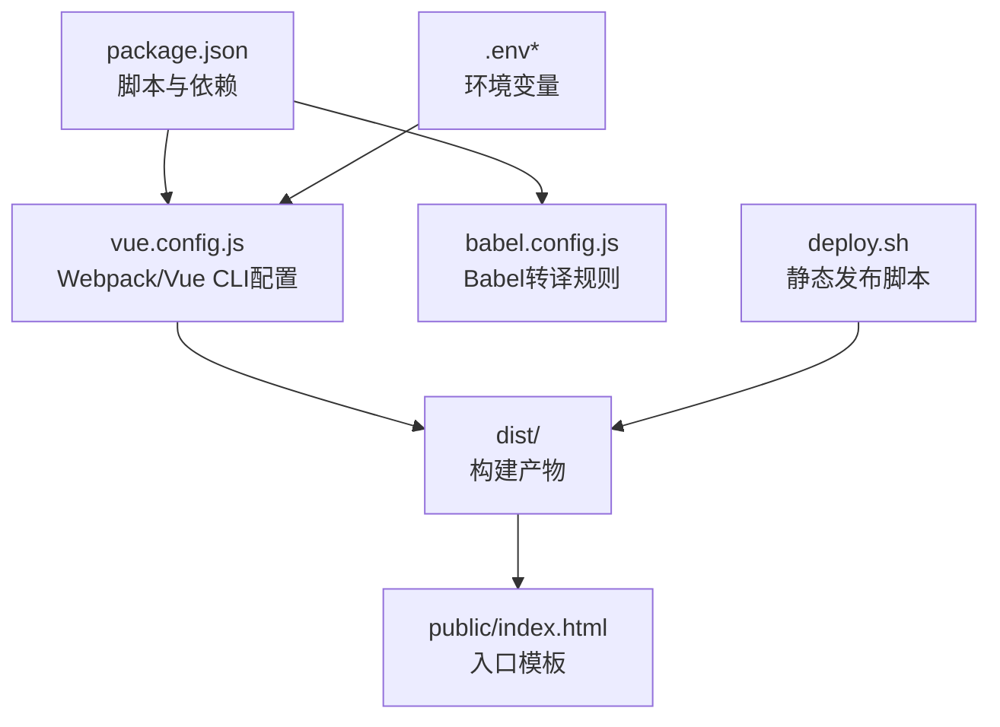
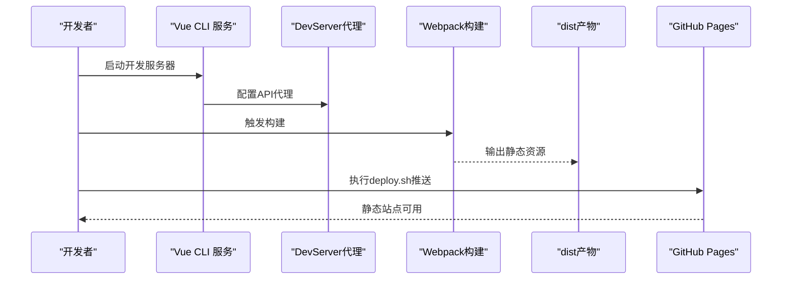
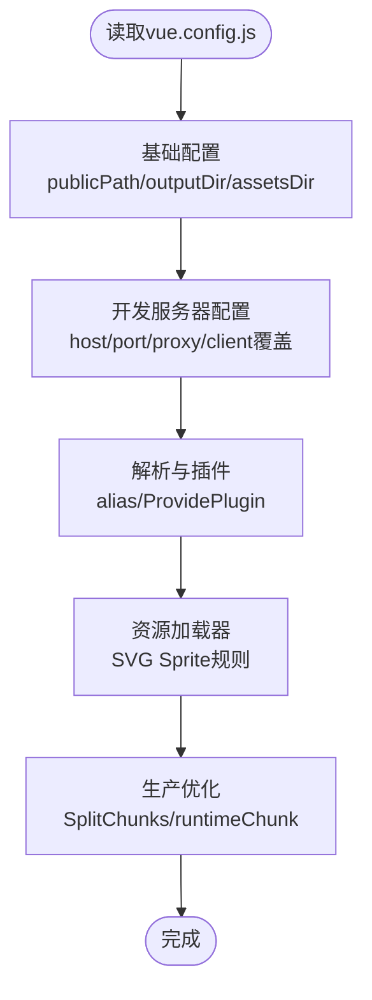
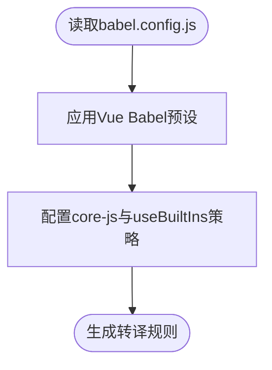
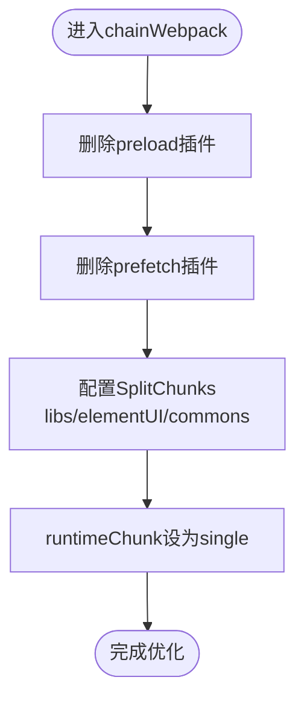
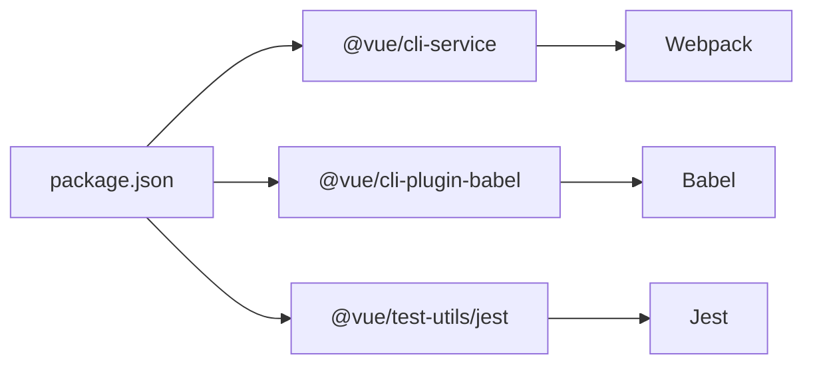

# 构建与部署

<cite>
**本文引用的文件**
- [package.json](file://package.json)
- [babel.config.js](file://babel.config.js)
- [vue.config.js](file://vue.config.js)
- [deploy.sh](file://deploy.sh)
- [README.md](file://README.md)
- [jest.config.js](file://jest.config.js)
</cite>

## 目录
1. [简介](#简介)
2. [项目结构](#项目结构)
3. [核心组件](#核心组件)
4. [架构总览](#架构总览)
5. [详细组件分析](#详细组件分析)
6. [依赖关系分析](#依赖关系分析)
7. [性能考量](#性能考量)
8. [故障排查指南](#故障排查指南)
9. [结论](#结论)
10. [附录](#附录)

## 简介
本指南面向Vue CMS项目的构建与部署，围绕Webpack配置、Babel转译、生产环境优化、多环境配置、静态资源与路由处理、CDN与缓存策略、容器化与CI/CD自动化、以及部署监控与故障恢复展开。文档结合仓库现有配置文件，提供可落地的实践建议与可视化图示，帮助团队高效、稳定地交付产品。

## 项目结构
该项目采用Vue CLI 5.x脚手架，核心构建配置集中在vue.config.js中，Babel转译由babel.config.js控制，环境变量通过.env系列文件注入，构建产物输出至dist目录，配合deploy.sh实现静态站点发布。

**图示来源**
- [package.json:1-99](file://package.json#L1-L99)
- [vue.config.js:1-144](file://vue.config.js#L1-L144)
- [babel.config.js:1-12](file://babel.config.js#L1-L12)
- [deploy.sh:1-26](file://deploy.sh#L1-L26)

**章节来源**
- [README.md:119-132](file://README.md#L119-L132)
- [package.json:24-32](file://package.json#L24-L32)

## 核心组件
- 构建工具链
  - Vue CLI 5.x服务与Webpack链式配置
  - Babel转译与polyfill策略
  - 生产环境压缩与Source Map控制
- 开发与代理
  - devServer代理与跨域配置
  - 热重载与客户端覆盖
- 代码分割与运行时
  - SplitChunks分包策略
  - runtimeChunk独立
- 资源处理
  - SVG Sprite加载器
  - 预加载与预取禁用
- 环境变量与多环境
  - .env/.env.development/.env.production
  - VUE_APP_*前缀变量注入
- 静态发布
  - deploy.sh自动化推送至gh-pages

**章节来源**
- [vue.config.js:14-144](file://vue.config.js#L14-L144)
- [babel.config.js:1-12](file://babel.config.js#L1-L12)
- [package.json:24-32](file://package.json#L24-L32)
- [deploy.sh:1-26](file://deploy.sh#L1-L26)

## 架构总览
下图展示了从开发到生产的整体流程：开发服务器启动、代理转发、构建产物生成、静态发布与CDN分发。

**图示来源**
- [vue.config.js:29-50](file://vue.config.js#L29-L50)
- [vue.config.js:104-142](file://vue.config.js#L104-L142)
- [deploy.sh:6-25](file://deploy.sh#L6-L25)

## 详细组件分析

### Webpack与Vue CLI配置（vue.config.js）
- 基础路径与输出
  - publicPath设置为相对路径，适配子路径部署与静态托管
  - outputDir与assetsDir分别控制产物目录与静态资源目录
- 开发服务器
  - host绑定0.0.0.0，允许外部访问
  - 端口可通过环境变量PORT覆盖
  - 代理规则通过VUE_APP_BASE_API与VUE_APP_PROXY_API联动
  - 客户端错误覆盖关闭警告，仅显示错误
- 解析与插件
  - 路径别名@指向src
  - ProvidePlugin注入Quill全局变量，便于富文本组件使用
- 资源与加载器
  - 禁用SVG默认处理，改为专门的icons规则使用svg-sprite-loader
  - 预加载与预取插件删除，避免多页场景下的无意义请求
- 代码分割与运行时
  - SplitChunks按chunks/all/libs/elementUI/commons分组拆分
  - runtimeChunk设为single，提升缓存命中率
- 生产优化
  - 关闭productionSourceMap，缩短构建时间并减小产物体积

**图示来源**
- [vue.config.js:14-144](file://vue.config.js#L14-L144)

**章节来源**
- [vue.config.js:14-144](file://vue.config.js#L14-L144)

### Babel转译配置（babel.config.js）
- 预设
  - 使用@vue/cli-plugin-babel/preset
  - useBuiltIns采用“entry”或“usage”，结合core-js 3
- 作用
  - 将现代语法转译为目标浏览器集合
  - 通过polyfill按需或入口注入，平衡包体与兼容性

**图示来源**
- [babel.config.js:1-12](file://babel.config.js#L1-L12)

**章节来源**
- [babel.config.js:1-12](file://babel.config.js#L1-L12)

### 多环境构建与环境变量
- 环境文件
  - .env：所有环境通用变量
  - .env.development：开发环境变量
  - .env.production：构建环境变量
- 注入规则
  - 以VUE_APP_开头的变量会被注入到客户端代码
  - 代理目标与路径重写通过VUE_APP_BASE_API与VUE_APP_PROXY_API控制
- 实践建议
  - 将敏感信息与API地址置于不同环境文件
  - 在CI中通过变量覆盖实现不同环境的差异化构建

**章节来源**
- [README.md:119-122](file://README.md#L119-L122)
- [vue.config.js:33-41](file://vue.config.js#L33-L41)

### 静态资源处理与路由
- 静态资源
  - public目录用于不可打包的静态资源（如favicon、index.html）
  - 构建后dist/static存放打包后的静态资源
- 路由
  - 项目使用Vue Router，路由配置位于src/router/index.js
  - 由于publicPath为相对路径，静态资源与路由可共同保证SPA在子路径部署时的正确加载
- CDN与缓存
  - 建议将dist/static中的静态资源上传至CDN，并开启长期缓存
  - 通过runtimeChunk与SplitChunks生成稳定的哈希文件名，提升缓存命中

**章节来源**
- [README.md:103-106](file://README.md#L103-L106)
- [vue.config.js:22-24](file://vue.config.js#L22-L24)

### 代码分割与运行时优化
- 分包策略
  - 第三方库集中到chunk-libs
  - Element UI单独成块chunk-elementUI
  - 组件级commons分组，最小引用次数为3
- 运行时
  - runtimeChunk设为single，避免每次业务代码变更导致runtime变动
- 效果
  - 显著降低首屏阻塞，提升缓存复用

**图示来源**
- [vue.config.js:79-87](file://vue.config.js#L79-L87)
- [vue.config.js:116-141](file://vue.config.js#L116-L141)

**章节来源**
- [vue.config.js:116-141](file://vue.config.js#L116-L141)

### 静态发布与CDN
- 发布脚本
  - deploy.sh执行build后，初始化git仓库并推送到gh-pages分支
  - 支持手动与Token自动两种推送方式
- CDN接入建议
  - 将dist目录托管于CDN，设置长缓存与回源策略
  - 对HTML设置短缓存，对JS/CSS开启immutable缓存
  - 通过子域名或路径区分版本，便于灰度与回滚

**章节来源**
- [deploy.sh:6-25](file://deploy.sh#L6-L25)

### 测试与质量保障
- 单测配置
  - Jest预设使用@vue/cli-plugin-unit-jest
- 建议
  - 在CI中集成单元测试与代码覆盖率报告
  - 结合ESLint与Prettier保证代码风格一致

**章节来源**
- [jest.config.js:1-4](file://jest.config.js#L1-L4)
- [package.json:28-31](file://package.json#L28-L31)

## 依赖关系分析
- 构建期依赖
  - @vue/cli-service、@vue/cli-plugin-babel、sass/sass-loader等
- 运行期依赖
  - vue、vue-router、vuex、element-ui、axios等
- 工具链
  - webpack、babel、jest等由CLI统一管理

**图示来源**
- [package.json:65-83](file://package.json#L65-L83)

**章节来源**
- [package.json:33-83](file://package.json#L33-L83)

## 性能考量
- 构建性能
  - 关闭productionSourceMap，减少I/O与体积
  - 合理的SplitChunks分组，避免过度拆分导致HTTP/2队头阻塞
- 首屏性能
  - 预加载与预取已禁用，避免非关键资源抢占带宽
  - 通过runtimeChunk与稳定文件名提升缓存命中
- 资源体积
  - 依赖按需引入，减少未使用代码
  - 图标使用svg-sprite-loader合并，降低HTTP请求数

**章节来源**
- [vue.config.js:26-27](file://vue.config.js#L26-L27)
- [vue.config.js:79-87](file://vue.config.js#L79-L87)
- [vue.config.js:116-141](file://vue.config.js#L116-L141)

## 故障排查指南
- 构建失败
  - 检查NODE_ENV与VUE_APP_*变量是否正确注入
  - 确认publicPath与部署路径一致
- 代理无效
  - 核对VUE_APP_BASE_API与VUE_APP_PROXY_API是否匹配
  - 检查devServer.proxy.pathRewrite规则
- 首屏白屏或资源404
  - 确认publicPath为相对路径且与CDN路径一致
  - 检查runtimeChunk与SplitChunks生成的文件名是否正确
- 静态发布失败
  - 确认deploy.sh中git remote与分支设置
  - 若使用Token，确保权限与过期时间

**章节来源**
- [vue.config.js:22-27](file://vue.config.js#L22-L27)
- [vue.config.js:33-41](file://vue.config.js#L33-L41)
- [deploy.sh:16-23](file://deploy.sh#L16-L23)

## 结论
本项目基于Vue CLI 5与Webpack 5实现了清晰的构建与部署流程。通过合理的代码分割、运行时优化与静态资源策略，可在多环境下稳定产出高性能的静态站点。建议在此基础上进一步完善CI/CD流水线、容器化与监控体系，以支撑更大规模的交付需求。

## 附录
- 快速命令
  - 开发：npm run serve
  - 构建：npm run build
  - 单测：npm run test:unit
  - 代码格式化：npm run lint / npm run lint-fix / npm run prettier-fix
- 环境变量
  - PORT：开发端口
  - VUE_APP_BASE_API：API前缀
  - VUE_APP_PROXY_API：代理目标地址

**章节来源**
- [package.json:24-31](file://package.json#L24-L31)
- [vue.config.js:10-10](file://vue.config.js#L10-L10)
- [vue.config.js:33-41](file://vue.config.js#L33-L41)