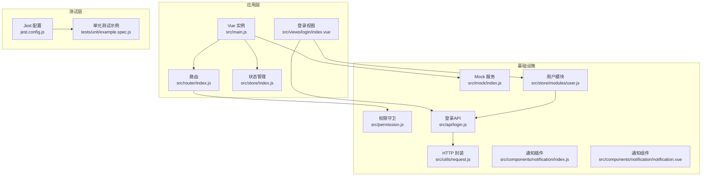
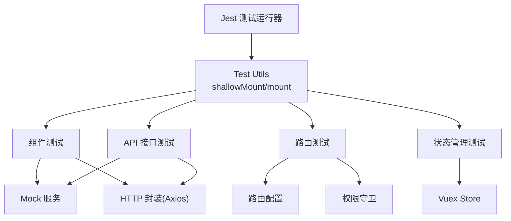
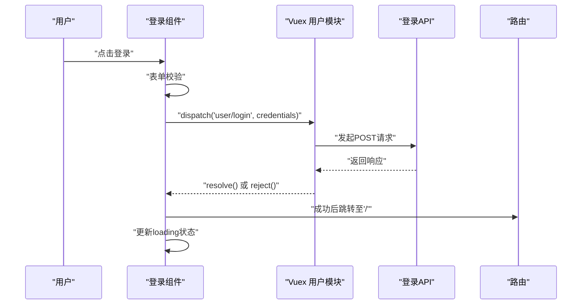
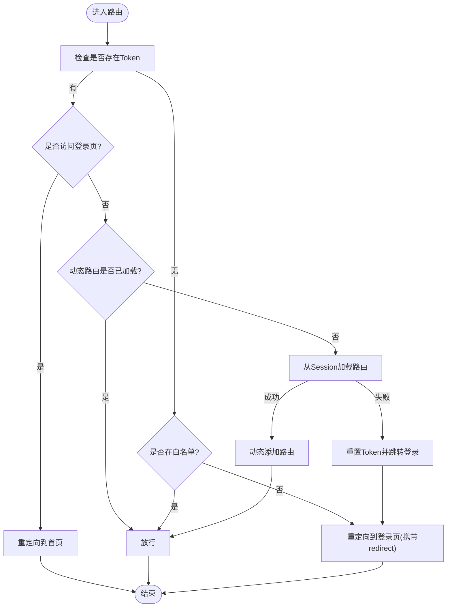
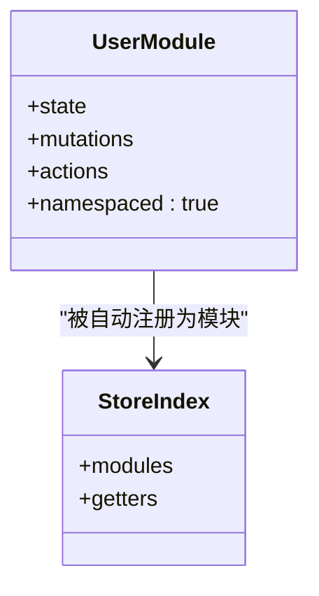
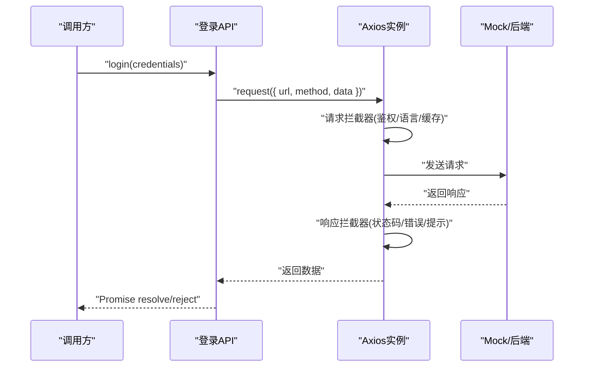
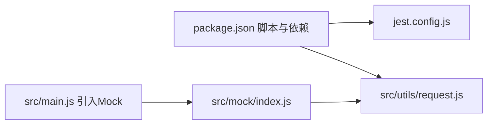

# 测试策略与实践

<cite>
**本文引用的文件**
- [jest.config.js](file://jest.config.js)
- [package.json](file://package.json)
- [example.spec.js](file://tests/unit/example.spec.js)
- [main.js](file://src/main.js)
- [router/index.js](file://src/router/index.js)
- [store/index.js](file://src/store/index.js)
- [mock/index.js](file://src/mock/index.js)
- [utils/request.js](file://src/utils/request.js)
- [permission.js](file://src/permission.js)
- [api/login.js](file://src/api/login.js)
- [store/modules/user.js](file://src/store/modules/user.js)
- [views/login/index.vue](file://src/views/login/index.vue)
- [components/notification/index.js](file://src/components/notification/index.js)
- [components/notification/notification.vue](file://src/components/notification/notification.vue)
</cite>

## 目录
1. [引言](#引言)
2. [项目结构](#项目结构)
3. [核心组件](#核心组件)
4. [架构总览](#架构总览)
5. [详细组件分析](#详细组件分析)
6. [依赖关系分析](#依赖关系分析)
7. [性能考量](#性能考量)
8. [故障排查指南](#故障排查指南)
9. [结论](#结论)
10. [附录](#附录)

## 引言
本指南面向Vue CMS项目，提供一套系统化的测试策略与实践，覆盖Jest测试框架配置、单元测试编写规范、组件测试方法、路由测试、状态管理测试、API接口测试、Mock数据与测试环境配置、持续集成流程、测试覆盖率要求、测试用例设计原则与断言方法、错误页面测试、权限测试、用户交互测试、测试数据管理、测试工具链以及性能测试策略。目标是在保证质量的同时提升开发效率与可维护性。

## 项目结构
项目采用Vue CLI 5 + Vue 2.7 + Element UI + Vuex + Vue Router的标准组合，测试以Jest + @vue/test-utils为主。关键测试相关文件分布如下：
- 测试运行配置：jest.config.js
- 测试脚本与依赖：package.json
- 示例测试：tests/unit/example.spec.js
- 应用入口与全局Mock接入：src/main.js
- 路由定义与动态路由：src/router/index.js
- Vuex Store与模块化：src/store/index.js
- Mock服务与自动注册：src/mock/index.js
- Axios封装与拦截器：src/utils/request.js
- 全局权限守卫：src/permission.js
- 登录API封装：src/api/login.js
- 用户模块（Vuex）：src/store/modules/user.js
- 登录视图组件：src/views/login/index.vue
- 通知组件（插件与组件）：src/components/notification/index.js、src/components/notification/notification.vue

**图表来源**
- [main.js:1-53](file://src/main.js#L1-L53)
- [router/index.js:1-343](file://src/router/index.js#L1-L343)
- [store/index.js:1-74](file://src/store/index.js#L1-L74)
- [mock/index.js:1-38](file://src/mock/index.js#L1-L38)
- [utils/request.js:1-139](file://src/utils/request.js#L1-L139)
- [permission.js:1-98](file://src/permission.js#L1-L98)
- [api/login.js:1-24](file://src/api/login.js#L1-L24)
- [store/modules/user.js:1-154](file://src/store/modules/user.js#L1-L154)
- [views/login/index.vue:1-261](file://src/views/login/index.vue#L1-L261)
- [components/notification/index.js:1-119](file://src/components/notification/index.js#L1-L119)
- [components/notification/notification.vue:1-90](file://src/components/notification/notification.vue#L1-L90)
- [jest.config.js:1-4](file://jest.config.js#L1-L4)
- [example.spec.js:1-13](file://tests/unit/example.spec.js#L1-L13)

**章节来源**
- [jest.config.js:1-4](file://jest.config.js#L1-L4)
- [package.json:1-99](file://package.json#L1-L99)
- [example.spec.js:1-13](file://tests/unit/example.spec.js#L1-L13)
- [main.js:1-53](file://src/main.js#L1-L53)
- [router/index.js:1-343](file://src/router/index.js#L1-L343)
- [store/index.js:1-74](file://src/store/index.js#L1-L74)
- [mock/index.js:1-38](file://src/mock/index.js#L1-L38)
- [utils/request.js:1-139](file://src/utils/request.js#L1-L139)
- [permission.js:1-98](file://src/permission.js#L1-L98)
- [api/login.js:1-24](file://src/api/login.js#L1-L24)
- [store/modules/user.js:1-154](file://src/store/modules/user.js#L1-L154)
- [views/login/index.vue:1-261](file://src/views/login/index.vue#L1-L261)
- [components/notification/index.js:1-119](file://src/components/notification/index.js#L1-L119)
- [components/notification/notification.vue:1-90](file://src/components/notification/notification.vue#L1-L90)

## 核心组件
- Jest配置：使用Vue CLI预设，确保与@vue/cli-plugin-unit-jest、@vue/test-utils、vue2-jest生态兼容。
- 单元测试示例：演示shallowMount与propsData断言的基本用法。
- 应用入口：全局引入Mock服务，便于在本地与CI中稳定复现接口行为。
- 路由与权限：基于Vue Router的常量路由、动态路由与全局守卫，支撑权限与导航测试。
- 状态管理：自动扫描modules目录，统一getters，便于对模块进行独立单元测试。
- Mock服务：自动注册modules下的mock规则，统一响应格式，简化API测试。
- HTTP封装：Axios实例与拦截器，统一处理鉴权头、语言头、错误提示与超时处理。
- 登录视图：包含表单校验、异步登录动作、路由跳转与通知调用，是组件测试重点。
- 通知组件：插件式通知组件，涉及DOM挂载、计时器与事件发射，适合交互与生命周期测试。

**章节来源**
- [jest.config.js:1-4](file://jest.config.js#L1-L4)
- [example.spec.js:1-13](file://tests/unit/example.spec.js#L1-L13)
- [main.js:1-53](file://src/main.js#L1-L53)
- [router/index.js:1-343](file://src/router/index.js#L1-L343)
- [store/index.js:1-74](file://src/store/index.js#L1-L74)
- [mock/index.js:1-38](file://src/mock/index.js#L1-L38)
- [utils/request.js:1-139](file://src/utils/request.js#L1-L139)
- [views/login/index.vue:1-261](file://src/views/login/index.vue#L1-L261)
- [components/notification/index.js:1-119](file://src/components/notification/index.js#L1-L119)
- [components/notification/notification.vue:1-90](file://src/components/notification/notification.vue#L1-L90)

## 架构总览
下图展示了测试策略与项目各层的关系：测试层通过Jest驱动，针对组件、路由、状态与API进行分层验证；Mock与HTTP封装保障接口行为可控；权限守卫与路由配置影响导航与权限测试场景。

**图表来源**
- [jest.config.js:1-4](file://jest.config.js#L1-L4)
- [main.js:1-53](file://src/main.js#L1-L53)
- [router/index.js:1-343](file://src/router/index.js#L1-L343)
- [store/index.js:1-74](file://src/store/index.js#L1-L74)
- [mock/index.js:1-38](file://src/mock/index.js#L1-L38)
- [utils/request.js:1-139](file://src/utils/request.js#L1-L139)
- [permission.js:1-98](file://src/permission.js#L1-L98)

## 详细组件分析

### 组件测试：登录视图（src/views/login/index.vue）
- 测试要点
  - 表单校验：用户名与密码的校验器触发与错误提示。
  - 登录流程：点击登录后触发Vuex action，等待Promise结果，断言路由跳转与loading状态变化。
  - 记住我：根据选项保存/清除本地存储。
  - 通知：登录成功后弹出账号提示通知。
  - 交互：回车键在输入框间的焦点切换。
- 推荐断言
  - DOM存在性与文案匹配。
  - Vuex action调用次数与参数。
  - 路由跳转是否发生。
  - 本地存储读写行为。
  - 通知组件是否被调用。
- Mock策略
  - 使用Mock拦截登录API，返回成功/失败两种场景。
  - 对Axios拦截器进行隔离，避免真实网络请求。
- 参考路径
  - [登录视图组件:1-261](file://src/views/login/index.vue#L1-L261)
  - [用户模块Action:52-110](file://src/store/modules/user.js#L52-L110)
  - [登录API封装:1-24](file://src/api/login.js#L1-L24)
  - [HTTP封装与拦截器:1-139](file://src/utils/request.js#L1-L139)

**图表来源**
- [views/login/index.vue:118-153](file://src/views/login/index.vue#L118-L153)
- [store/modules/user.js:54-74](file://src/store/modules/user.js#L54-L74)
- [api/login.js:3-9](file://src/api/login.js#L3-L9)

**章节来源**
- [views/login/index.vue:1-261](file://src/views/login/index.vue#L1-L261)
- [store/modules/user.js:1-154](file://src/store/modules/user.js#L1-L154)
- [api/login.js:1-24](file://src/api/login.js#L1-L24)
- [utils/request.js:1-139](file://src/utils/request.js#L1-L139)

### 路由测试：常量路由、动态路由与全局守卫
- 测试要点
  - 常量路由：根路径、重定向、登录页等静态路由可用性。
  - 动态路由：根据用户权限生成的路由是否正确注入。
  - 全局守卫：登录态、白名单、动态路由加载与回退逻辑。
  - 错误页面：404、无权限页面路由可达性。
- 推荐断言
  - 路由表包含预期路径与组件懒加载。
  - beforeEach执行顺序与next调用分支。
  - resetRouter后matcher替换与守卫重置。
- 参考路径
  - [路由配置:43-343](file://src/router/index.js#L43-L343)
  - [权限守卫:23-91](file://src/permission.js#L23-L91)

**图表来源**
- [permission.js:23-91](file://src/permission.js#L23-L91)
- [router/index.js:43-111](file://src/router/index.js#L43-L111)

**章节来源**
- [router/index.js:1-343](file://src/router/index.js#L1-L343)
- [permission.js:1-98](file://src/permission.js#L1-L98)

### 状态管理测试：用户模块与全局Store
- 测试要点
  - State初始化：token、用户信息、权限等。
  - Mutations：账户、头像、权限、信息等变更。
  - Actions：登录、拉取用户信息、登出、重置Token、更新头像与信息。
  - Getters：用户信息、头像、语言、路由权限等。
- 推荐断言
  - 提交mutation后state变化。
  - dispatch action后异步结果与副作用（如SessionStorage）。
  - getters计算值与BASE_URL拼接逻辑。
- 参考路径
  - [用户模块:1-154](file://src/store/modules/user.js#L1-L154)
  - [全局Store:1-74](file://src/store/index.js#L1-L74)

**图表来源**
- [store/modules/user.js:1-154](file://src/store/modules/user.js#L1-L154)
- [store/index.js:10-17](file://src/store/index.js#L10-L17)

**章节来源**
- [store/modules/user.js:1-154](file://src/store/modules/user.js#L1-L154)
- [store/index.js:1-74](file://src/store/index.js#L1-L74)

### API接口测试：登录API与HTTP封装
- 测试要点
  - 登录API：URL、方法、数据体。
  - HTTP封装：baseURL、超时、鉴权头、语言头、GET缓存参数、响应拦截与错误处理。
  - Mock：统一响应格式与延迟，模拟成功/失败/超时/网络错误。
- 推荐断言
  - 请求头包含Authorization与Accept-Language。
  - GET请求附加时间戳参数以禁用缓存。
  - 响应码非200时的消息提示与Promise reject。
  - 超时与网络错误的统一提示。
- 参考路径
  - [登录API:1-24](file://src/api/login.js#L1-L24)
  - [HTTP封装:1-139](file://src/utils/request.js#L1-L139)
  - [Mock服务:1-38](file://src/mock/index.js#L1-L38)

**图表来源**
- [api/login.js:3-9](file://src/api/login.js#L3-L9)
- [utils/request.js:18-52](file://src/utils/request.js#L18-L52)
- [utils/request.js:66-107](file://src/utils/request.js#L66-L107)
- [mock/index.js:27-34](file://src/mock/index.js#L27-L34)

**章节来源**
- [api/login.js:1-24](file://src/api/login.js#L1-L24)
- [utils/request.js:1-139](file://src/utils/request.js#L1-L139)
- [mock/index.js:1-38](file://src/mock/index.js#L1-L38)

### 错误页面测试与权限测试
- 错误页面测试
  - 404与无权限页面路由可达性与标题文案。
  - 未匹配路由自动跳转至404。
- 权限测试
  - 未登录访问受保护路由重定向登录。
  - 登录态访问登录页重定向首页。
  - 动态路由注入后，菜单与导航可用。
- 参考路径
  - [错误页面路由:80-111](file://src/router/index.js#L80-L111)
  - [权限守卫:23-91](file://src/permission.js#L23-L91)

**章节来源**
- [router/index.js:80-111](file://src/router/index.js#L80-L111)
- [permission.js:1-98](file://src/permission.js#L1-L98)

### 用户交互测试：通知组件
- 测试要点
  - 插件注册与全局方法调用。
  - 组件挂载到body、可见性控制、计时器创建与清理。
  - 动画进入/离开回调、关闭事件发射。
- 推荐断言
  - DOM插入与移除。
  - visible状态与定时器生命周期。
  - 事件发射（close/closed）。
- 参考路径
  - [通知插件:74-113](file://src/components/notification/index.js#L74-L113)
  - [通知组件:1-90](file://src/components/notification/notification.vue#L1-L90)

**章节来源**
- [components/notification/index.js:1-119](file://src/components/notification/index.js#L1-L119)
- [components/notification/notification.vue:1-90](file://src/components/notification/notification.vue#L1-L90)

## 依赖关系分析
- 测试工具链
  - Jest + @vue/test-utils + vue2-jest
  - CLI脚本：test:unit
- 运行时依赖
  - axios、element-ui、vuex、vue-router
- Mock与HTTP
  - mockjs + 自定义响应格式
  - request.js统一拦截器
- 入口与Mock
  - main.js引入mock/index.js，确保开发/生产均启用Mock

**图表来源**
- [package.json:24-31](file://package.json#L24-L31)
- [jest.config.js:1-4](file://jest.config.js#L1-L4)
- [main.js:34](file://src/main.js#L34)
- [mock/index.js:1-38](file://src/mock/index.js#L1-L38)
- [utils/request.js:1-15](file://src/utils/request.js#L1-L15)

**章节来源**
- [package.json:1-99](file://package.json#L1-L99)
- [jest.config.js:1-4](file://jest.config.js#L1-L4)
- [main.js:1-53](file://src/main.js#L1-L53)
- [mock/index.js:1-38](file://src/mock/index.js#L1-L38)
- [utils/request.js:1-139](file://src/utils/request.js#L1-L139)

## 性能考量
- 测试执行性能
  - 使用shallowMount减少子组件渲染开销。
  - 对异步操作使用Promise/async/await，避免不必要的等待。
  - Mock替代真实HTTP请求，降低网络抖动影响。
- 覆盖率与稳定性
  - 优先保证关键分支与边界条件覆盖。
  - 对计时器、DOM挂载等副作用进行隔离或清理。
- CI集成建议
  - 在CI中固定Node版本与依赖安装策略，确保测试一致性。
  - 并行执行不同模块的测试，缩短总耗时。

## 故障排查指南
- 常见问题
  - 测试中出现网络错误：确认Mock已加载且拦截规则匹配。
  - 路由跳转失败：检查beforeEach守卫逻辑与addRoutes注入时机。
  - 通知组件未显示：确认插件已注册且DOM已挂载。
  - 登录失败但无提示：检查响应拦截器与消息提示逻辑。
- 定位方法
  - 打印中间状态（如store.state、router.currentRoute）。
  - 分支断言：对多路径场景分别断言。
  - 使用Mock的延迟与错误码模拟极端情况。

**章节来源**
- [permission.js:23-91](file://src/permission.js#L23-L91)
- [components/notification/index.js:115-119](file://src/components/notification/index.js#L115-L119)
- [utils/request.js:108-135](file://src/utils/request.js#L108-L135)

## 结论
通过Jest与@vue/test-utils构建的测试体系，结合Mock与HTTP封装，能够有效覆盖组件、路由、状态与API层面的关键行为。建议在团队内统一测试规范、断言风格与覆盖率门槛，并在CI中强制执行，持续提升代码质量与交付效率。

## 附录

### 测试策略与最佳实践清单
- 测试框架与配置
  - 使用Jest预设，确保与Vue 2 + Element UI生态兼容。
  - 在CI中固定Node版本，避免环境差异导致的不稳定。
- 单元测试编写规范
  - 组件测试：优先shallowMount；对交互与副作用进行隔离或断言。
  - 路由测试：覆盖常量路由、动态路由注入与全局守卫分支。
  - 状态管理测试：分别验证mutations/actions/getters。
  - API测试：断言请求头、参数、响应拦截与错误处理。
- Mock与测试数据
  - 使用Mock自动注册模块，统一响应格式与延迟。
  - 对复杂场景（超时、网络错误、鉴权失效）分别编写用例。
- 测试覆盖率与质量门禁
  - 设定关键模块覆盖率门槛（如组件/路由/状态/API均不低于XX%）。
  - 对高风险路径（权限、登录、通知）提高覆盖率要求。
- 持续集成流程
  - 在CI中执行test:unit脚本，输出覆盖率报告。
  - 对失败用例与覆盖率不足进行阻断。
- 用户交互与错误页面
  - 对通知组件的DOM挂载、计时器与事件进行专项测试。
  - 对404、无权限等错误页面进行可达性与文案断言。
- 性能测试策略
  - 对高频组件与API接口进行基准测试，记录关键指标。
  - 在CI中加入性能回归阈值，防止性能退化。