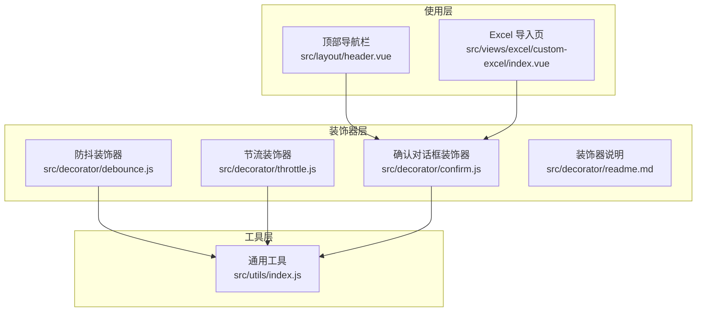
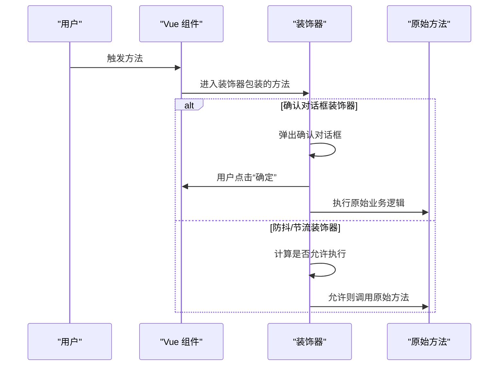
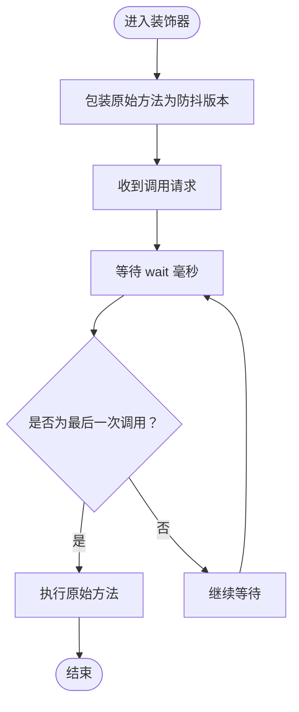
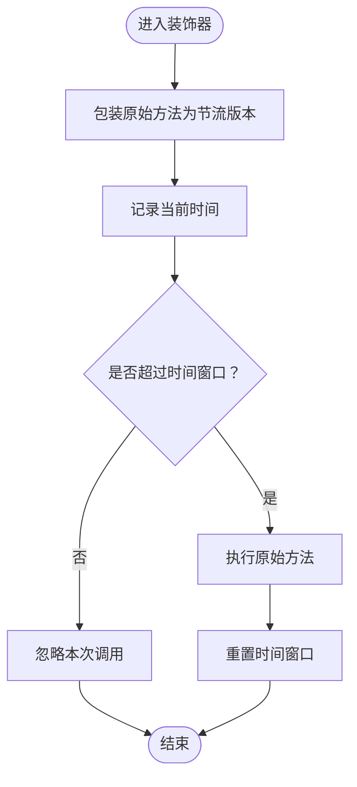
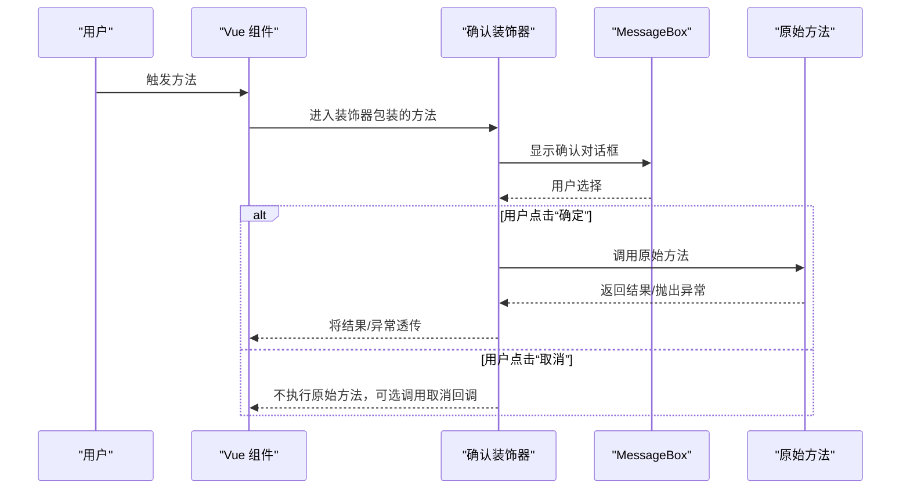
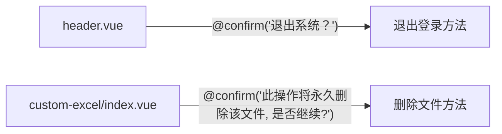
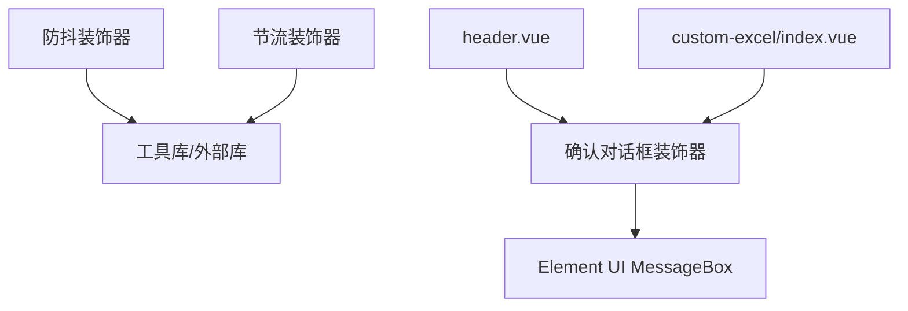

# 装饰器与高阶函数

<cite>
**本文引用的文件**
- [装饰器：README](file://src/decorator/readme.md)
- [防抖装饰器](file://src/decorator/debounce.js)
- [节流装饰器](file://src/decorator/throttle.js)
- [确认对话框装饰器](file://src/decorator/confirm.js)
- [工具库：通用工具](file://src/utils/index.js)
- [布局：顶部导航栏](file://src/layout/header.vue)
- [Excel 导入页面](file://src/views/excel/custom-excel/index.vue)
</cite>

## 目录
1. [引言](#引言)
2. [项目结构](#项目结构)
3. [核心组件](#核心组件)
4. [架构总览](#架构总览)
5. [详细组件分析](#详细组件分析)
6. [依赖关系分析](#依赖关系分析)
7. [性能考量](#性能考量)
8. [故障排查指南](#故障排查指南)
9. [结论](#结论)
10. [附录](#附录)

## 引言
本指南聚焦于 Vue CMS 项目中的“装饰器与高阶函数”实践，围绕以下主题展开：
- 防抖（debounce）、节流（throttle）与确认对话框（confirm）装饰器的实现原理与使用场景
- 装饰器模式在 Vue 组件中的应用方式、性能优化效果与最佳实践
- 自定义装饰器的开发指南（参数传递、返回值处理）
- 异步操作装饰器、错误处理装饰器与缓存装饰器的实现思路
- 装饰器的组合使用、执行顺序与调试技巧

## 项目结构
装饰器与高阶函数相关的核心位置如下：
- 装饰器定义：src/decorator
- 工具函数与通用实现：src/utils/index.js
- 使用示例：src/layout/header.vue、src/views/excel/custom-excel/index.vue

**图表来源**
- [防抖装饰器](file://src/decorator/debounce.js)
- [节流装饰器](file://src/decorator/throttle.js)
- [确认对话框装饰器](file://src/decorator/confirm.js)
- [工具库：通用工具](file://src/utils/index.js)
- [布局：顶部导航栏](file://src/layout/header.vue)
- [Excel 导入页面](file://src/views/excel/custom-excel/index.vue)

**章节来源**
- [装饰器：README](file://src/decorator/readme.md)
- [防抖装饰器](file://src/decorator/debounce.js)
- [节流装饰器](file://src/decorator/throttle.js)
- [确认对话框装饰器](file://src/decorator/confirm.js)
- [工具库：通用工具](file://src/utils/index.js)
- [布局：顶部导航栏](file://src/layout/header.vue)
- [Excel 导入页面](file://src/views/excel/custom-excel/index.vue)

## 核心组件
- 防抖装饰器：对目标方法进行防抖包装，适用于高频触发事件（如输入校验、窗口尺寸监听等）
- 节流装饰器：对目标方法进行节流包装，适用于滚动、鼠标移动等持续性事件
- 确认对话框装饰器：在执行业务逻辑前弹出二次确认，避免误操作

上述装饰器均采用 ES6 类型的“方法级装饰器”，通过修改目标方法的 descriptor.value 实现行为增强。

**章节来源**
- [防抖装饰器](file://src/decorator/debounce.js)
- [节流装饰器](file://src/decorator/throttle.js)
- [确认对话框装饰器](file://src/decorator/confirm.js)

## 架构总览
装饰器在 Vue 中的典型工作流程：
- 在组件方法上使用装饰器语法
- 装饰器在编译期/构建期将目标方法替换为增强后的方法
- 用户交互触发方法时，先执行装饰器逻辑（如弹窗、限流/防抖），再调用原始业务逻辑

**图表来源**
- [确认对话框装饰器](file://src/decorator/confirm.js)
- [防抖装饰器](file://src/decorator/debounce.js)
- [节流装饰器](file://src/decorator/throttle.js)

## 详细组件分析

### 防抖装饰器（debounce）
- 功能：对方法调用进行延迟合并，仅在最后一次触发后的指定时间间隔后再执行
- 参数：wait（延迟毫秒数）、options（leading/trailing/maxWait 等）
- 实现要点：装饰器返回一个函数，内部通过工具库提供的 debounce 包装原始方法
- 性能收益：减少重复请求、降低渲染压力
- 使用建议：搜索输入、窗口尺寸变更、频繁表单校验

**图表来源**
- [防抖装饰器](file://src/decorator/debounce.js)
- [工具库：通用工具](file://src/utils/index.js)

**章节来源**
- [防抖装饰器](file://src/decorator/debounce.js)
- [工具库：通用工具](file://src/utils/index.js)

### 节流装饰器（throttle）
- 功能：在固定时间窗口内最多执行一次方法，其余调用被忽略
- 参数：wait（时间窗口毫秒）、options（leading/trailing）
- 实现要点：装饰器返回一个函数，内部通过工具库提供的 throttle 包装原始方法
- 性能收益：控制高频事件的执行频率，避免过度计算
- 使用建议：滚动事件、鼠标移动、拖拽更新

**图表来源**
- [节流装饰器](file://src/decorator/throttle.js)
- [工具库：通用工具](file://src/utils/index.js)

**章节来源**
- [节流装饰器](file://src/decorator/throttle.js)
- [工具库：通用工具](file://src/utils/index.js)

### 确认对话框装饰器（confirm）
- 功能：在执行业务逻辑前弹出 Element UI 的 MessageBox 确认框
- 参数：message（提示信息）、title（标题）、cancelFn（取消回调）、determineFn（确定回调）
- 实现要点：装饰器保存原始方法，拦截调用，弹窗后根据用户选择决定是否执行原始方法，并支持回调
- 使用建议：删除、提交、危险操作等需要二次确认的场景

**图表来源**
- [确认对话框装饰器](file://src/decorator/confirm.js)

**章节来源**
- [确认对话框装饰器](file://src/decorator/confirm.js)

### 在组件中的使用示例
- 顶部导航栏：使用确认装饰器封装退出登录逻辑
- Excel 导入页：使用确认装饰器封装删除文件逻辑

**图表来源**
- [布局：顶部导航栏](file://src/layout/header.vue)
- [Excel 导入页面](file://src/views/excel/custom-excel/index.vue)

**章节来源**
- [布局：顶部导航栏](file://src/layout/header.vue)
- [Excel 导入页面](file://src/views/excel/custom-excel/index.vue)

## 依赖关系分析
- 装饰器依赖工具库中的防抖/节流实现（或外部库如 lodash 的对应方法）
- 确认对话框装饰器依赖 Element UI 的 MessageBox
- 组件通过装饰器语法直接复用这些能力，无需在每个方法中重复编写弹窗逻辑

**图表来源**
- [防抖装饰器](file://src/decorator/debounce.js)
- [节流装饰器](file://src/decorator/throttle.js)
- [确认对话框装饰器](file://src/decorator/confirm.js)
- [布局：顶部导航栏](file://src/layout/header.vue)
- [Excel 导入页面](file://src/views/excel/custom-excel/index.vue)

**章节来源**
- [防抖装饰器](file://src/decorator/debounce.js)
- [节流装饰器](file://src/decorator/throttle.js)
- [确认对话框装饰器](file://src/decorator/confirm.js)

## 性能考量
- 防抖/节流能显著降低高频事件的执行次数，减少网络请求与 DOM 更新开销
- 对于长耗时任务，建议结合异步装饰器与错误处理装饰器，避免阻塞 UI
- 注意装饰器的参数配置（如 leading/trailing/maxWait）对用户体验的影响
- 在组件销毁时，应清理定时器与订阅，防止内存泄漏

## 故障排查指南
- 确认装饰器未生效
  - 检查装饰器语法是否正确、是否在目标方法上使用
  - 确认 Element UI 的 MessageBox 是否可用
- 确认对话框未出现
  - 检查 message/title/cancelFn/determineFn 参数是否正确传入
  - 确认用户交互路径是否触发了装饰器
- 防抖/节流无效
  - 检查 wait 与 options 配置是否合理
  - 确认多次快速调用是否在同一上下文中
- 回调未执行
  - 确认取消/确定回调函数是否传入且签名正确
  - 检查异步逻辑中是否正确处理了 Promise/await

**章节来源**
- [确认对话框装饰器](file://src/decorator/confirm.js)
- [防抖装饰器](file://src/decorator/debounce.js)
- [节流装饰器](file://src/decorator/throttle.js)

## 结论
- 装饰器与高阶函数为 Vue 组件提供了“横切关注点”的统一处理方案
- 防抖/节流用于性能优化，确认对话框用于安全控制
- 合理使用装饰器可提升代码可读性与可维护性，但需注意参数配置与生命周期管理

## 附录

### 自定义装饰器开发指南
- 基本结构
  - 接收目标方法 descriptor，返回增强后的 descriptor.value
  - 保持 this 绑定与参数透传
- 参数传递
  - 通过装饰器函数参数向装饰器注入配置
  - 在装饰器内部保存配置并在包装方法中使用
- 返回值处理
  - 对同步方法：直接返回结果
  - 对异步方法：返回 Promise 并在 finally 中做清理
- 最佳实践
  - 明确职责边界，避免过度耦合
  - 提供默认配置与可覆盖项
  - 在组件销毁时清理副作用（定时器、订阅）

### 异步操作装饰器、错误处理装饰器与缓存装饰器（实现思路）
- 异步装饰器
  - 包装 Promise，统一处理 pending/loading 状态
  - 支持取消与超时控制
- 错误处理装饰器
  - 捕获异常并统一上报/提示
  - 支持重试策略与降级逻辑
- 缓存装饰器
  - 基于参数生成键，缓存结果
  - 支持 TTL、LRU 等策略

### 装饰器组合与执行顺序
- 多个装饰器按“从内到外”的顺序执行（即最靠近方法的装饰器最先执行）
- 执行顺序会影响参数与返回值的传递，需谨慎设计
- 建议将“安全类”装饰器（如 confirm）置于靠外层，确保在最外层进行最终保护

### 调试技巧
- 在装饰器内部打印日志，观察调用时机与参数
- 使用浏览器开发者工具断点定位装饰器包裹逻辑
- 对异步装饰器，关注 Promise 链路与异常捕获位置