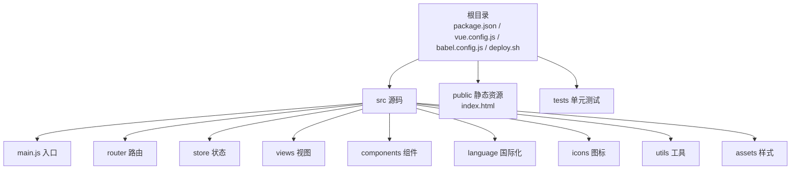
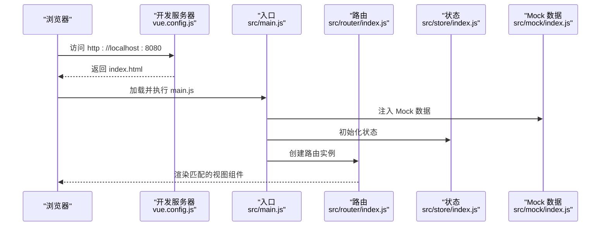
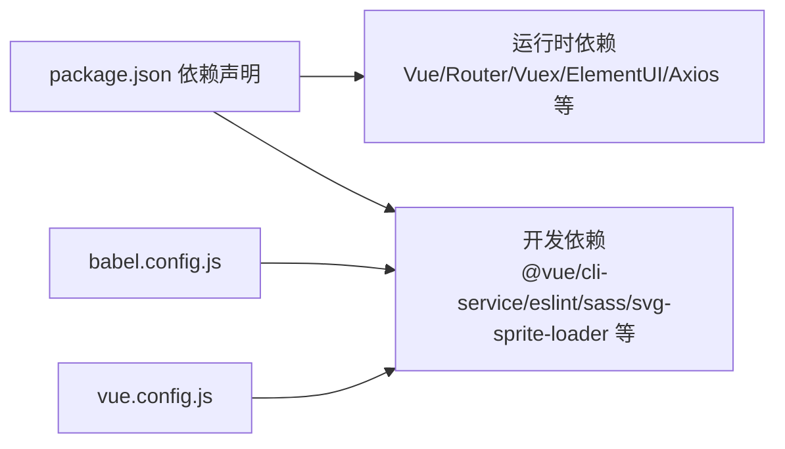

# 快速开始

<cite>
**本文引用的文件**
- [package.json](file://package.json)
- [README.md](file://README.md)
- [vue.config.js](file://vue.config.js)
- [babel.config.js](file://babel.config.js)
- [src/main.js](file://src/main.js)
- [public/index.html](file://public/index.html)
- [src/router/index.js](file://src/router/index.js)
- [src/store/index.js](file://src/store/index.js)
- [deploy.sh](file://deploy.sh)
</cite>

## 目录
1. [简介](#简介)
2. [项目结构](#项目结构)
3. [核心组件](#核心组件)
4. [架构总览](#架构总览)
5. [详细组件分析](#详细组件分析)
6. [依赖关系分析](#依赖关系分析)
7. [性能考虑](#性能考虑)
8. [故障排查指南](#故障排查指南)
9. [结论](#结论)
10. [附录](#附录)

## 简介
本指南面向新手开发者，帮助你在最短时间内完成 Vue CMS 项目的克隆、安装与启动，并提供常见问题排查与最佳实践建议。项目基于 Vue CLI 5.x、Vue 2.7、Element UI 2.x 构建，内置国际化、权限控制、Mock 数据、图表与富文本等功能模块，适合快速搭建企业级后台管理系统。

## 项目结构
- 根目录包含构建脚本、依赖声明与配置文件，如 package.json、vue.config.js、babel.config.js、deploy.sh 等。
- 源码位于 src/，包含入口文件 main.js、路由 router、状态管理 store、视图 views、组件 components、国际化 language、图标 icons、通用工具 utils、样式 assets 等。
- 静态资源位于 public/，入口模板为 index.html。
- 测试位于 tests/unit/，单元测试框架为 Jest。

**章节来源**
- [README.md: 98-132:98-132](file://README.md#L98-L132)

## 核心组件
- 入口与渲染：应用从 src/main.js 启动，挂载到 public/index.html 的 #app 容器。
- 路由系统：src/router/index.js 定义常量路由、动态路由与兜底路由，支持嵌套路由与权限控制。
- 状态管理：src/store/index.js 使用自动扫描模块的方式组织 Vuex，集中管理用户、权限、语言、设置等状态。
- 开发服务器与构建：vue.config.js 配置 devServer、别名、SVG 图标加载、分包优化与生产构建参数；package.json 提供 serve/build/lint 等脚本。

**章节来源**
- [src/main.js: 1-53:1-53](file://src/main.js#L1-L53)
- [public/index.html: 1-21:1-21](file://public/index.html#L1-L21)
- [src/router/index.js: 1-343:1-343](file://src/router/index.js#L1-L343)
- [src/store/index.js: 1-74:1-74](file://src/store/index.js#L1-L74)
- [vue.config.js: 14-65:14-65](file://vue.config.js#L14-L65)
- [package.json: 24-32:24-32](file://package.json#L24-L32)

## 架构总览
下图展示了从浏览器访问到页面渲染的关键流程，包括开发服务器代理、Mock 数据注入与路由导航。

**图表来源**
- [vue.config.js: 29-50:29-50](file://vue.config.js#L29-L50)
- [src/main.js: 34-34:34-34](file://src/main.js#L34-L34)
- [src/router/index.js: 322-343:322-343](file://src/router/index.js#L322-L343)
- [src/store/index.js: 70-74:70-74](file://src/store/index.js#L70-L74)

**章节来源**
- [vue.config.js: 14-65:14-65](file://vue.config.js#L14-L65)
- [src/main.js: 30-52:30-52](file://src/main.js#L30-L52)
- [src/router/index.js: 43-111:43-111](file://src/router/index.js#L43-L111)
- [src/store/index.js: 10-17:10-17](file://src/store/index.js#L10-L17)

## 详细组件分析

### 开发环境与安装步骤
- 环境要求
  - Node.js 版本：满足 engines 字段要求（>= 6.0.0）
  - NPM 版本：满足 engines 字段要求（>= 3.0.0）
  - Git：用于克隆仓库
- 克隆与安装
  - 克隆仓库后进入项目目录
  - 使用 yarn 安装依赖（忽略引擎校验）
  - 或使用 npm 并指定镜像源加速安装
- 启动开发服务器
  - 执行 npm start 或 npm run serve，默认监听 8080 端口
  - 若需自定义端口，可通过环境变量 PORT 指定
- 构建与发布
  - 生产构建：npm run build
  - 发布到 gh-pages：bash ./deploy.sh

**章节来源**
- [package.json: 88-91:88-91](file://package.json#L88-L91)
- [README.md: 39-58:39-58](file://README.md#L39-L58)
- [vue.config.js: 10-10:10-10](file://vue.config.js#L10-L10)
- [deploy.sh: 7-25:7-25](file://deploy.sh#L7-L25)

### 开发服务器与代理配置
- 主机与端口
  - host 默认 0.0.0.0，port 默认 8888（可通过环境变量覆盖）
  - 默认自动打开浏览器，允许所有主机访问
- 代理规则
  - 基于 VUE_APP_BASE_API 与 VUE_APP_PROXY_API 环境变量配置
  - 支持路径重写，将前缀替换为 /
- ESLint 与 Source Map
  - 开发模式下保存时进行代码检查
  - 生产构建关闭 Source Map 以提升构建速度

**章节来源**
- [vue.config.js: 29-50:29-50](file://vue.config.js#L29-L50)
- [vue.config.js: 25-27:25-27](file://vue.config.js#L25-L27)

### 路由与权限控制
- 常量路由：登录页、首页、重定向等无需权限
- 动态路由：根据用户角色生成的菜单与页面
- 兜底路由：404、无权限、通配符未匹配路由
- 路由守卫：在入口处初始化权限控制逻辑（具体实现位于入口文件）

**章节来源**
- [src/router/index.js: 43-111:43-111](file://src/router/index.js#L43-L111)
- [src/router/index.js: 118-320:118-320](file://src/router/index.js#L118-L320)
- [src/main.js: 25-25:25-25](file://src/main.js#L25-L25)

### 状态管理与模块化
- 自动扫描模块：通过 require.context 扫描 modules 目录下的子模块并注册
- Getters：集中提供常用派生状态，便于在组件中按需取值
- 典型状态：用户信息、权限路由、语言设置、侧边栏折叠状态等

**章节来源**
- [src/store/index.js: 10-17:10-17](file://src/store/index.js#L10-L17)
- [src/store/index.js: 24-68:24-68](file://src/store/index.js#L24-L68)

### 构建优化与资源处理
- 别名与插件：配置 @ 指向 src，提供 Quill 全局变量
- SVG 图标：通过 svg-sprite-loader 统一加载 src/icons 下的 SVG
- 分包策略：分离第三方库、Element UI 与公共组件，提升缓存与加载效率
- 预加载与预取：移除默认的预取插件，保留关键资源预加载
- 运行时分包：生产环境启用独立 runtimeChunk

**章节来源**
- [vue.config.js: 51-65:51-65](file://vue.config.js#L51-L65)
- [vue.config.js: 89-102:89-102](file://vue.config.js#L89-L102)
- [vue.config.js: 116-141:116-141](file://vue.config.js#L116-L141)

## 依赖关系分析
- 运行时依赖
  - Vue 2.7、Vue Router、Vuex、Element UI、Axios、ECharts、MockJS、Quill、Screenfull 等
- 开发依赖
  - @vue/cli-service、@vue/cli-plugin-*、eslint、sass、svg-sprite-loader、vue-template-compiler 等
- Babel 配置
  - 使用 @vue/cli-plugin-babel 预设，配合 core-js 与 useBuiltIns 策略

**图表来源**
- [package.json: 33-84:33-84](file://package.json#L33-L84)
- [babel.config.js: 1-12:1-12](file://babel.config.js#L1-L12)
- [vue.config.js: 14-65:14-65](file://vue.config.js#L14-L65)

**章节来源**
- [package.json: 33-84:33-84](file://package.json#L33-L84)
- [babel.config.js: 1-12:1-12](file://babel.config.js#L1-L12)
- [vue.config.js: 14-65:14-65](file://vue.config.js#L14-L65)

## 性能考虑
- 构建优化
  - 生产环境关闭 Source Map，减少体积与构建时间
  - 启用 splitChunks 对第三方库与公共组件进行分包
  - 独立 runtimeChunk，降低重复代码
- 资源加载
  - 预加载关键资源，避免不必要的预取请求
  - SVG 图标统一处理，减少请求次数
- 代理与网络
  - 本地开发代理简化跨域与接口联调

**章节来源**
- [vue.config.js: 25-27:25-27](file://vue.config.js#L25-L27)
- [vue.config.js: 116-141:116-141](file://vue.config.js#L116-L141)
- [vue.config.js: 89-102:89-102](file://vue.config.js#L89-L102)

## 故障排查指南
- 端口占用
  - 现象：无法启动开发服务器
  - 解决：修改环境变量 PORT 或终止占用进程
- 代理未生效
  - 现象：接口 404 或跨域
  - 解决：确认 VUE_APP_BASE_API 与 VUE_APP_PROXY_API 环境变量已正确设置
- 依赖安装失败
  - 现象：yarn/npm 安装超时或报错
  - 解决：使用镜像源安装；若使用 cnpm，可能出现与 yarn.lock 不一致导致的异常
- Mock 数据冲突
  - 现象：页面数据与预期不符
  - 解决：确认 src/main.js 中已注入 Mock 数据；如需对接真实接口，注释掉相关注入逻辑
- 浏览器兼容性
  - 现象：低版本浏览器样式或功能异常
  - 解决：参考 browserslist 配置，确保目标浏览器受支持

**章节来源**
- [vue.config.js: 10-10:10-10](file://vue.config.js#L10-L10)
- [vue.config.js: 33-41:33-41](file://vue.config.js#L33-L41)
- [README.md: 52-53:52-53](file://README.md#L52-L53)
- [src/main.js: 34-34:34-34](file://src/main.js#L34-L34)
- [package.json: 92-97:92-97](file://package.json#L92-L97)

## 结论
按照本指南完成克隆、安装与启动后，你将能在本地看到基于 Vue 2 + Element UI 的后台管理界面，并具备进一步定制与扩展的能力。建议结合路由与状态模块逐步理解项目结构，再按需接入真实后端接口与 CI/CD 流程。

## 附录

### 首次运行验证清单
- 成功启动开发服务器并在浏览器打开 http://localhost:8080
- 登录页可正常跳转与渲染
- 首页与菜单项可访问
- 控制台无严重错误与警告
- Mock 数据正常加载（可在入口文件中切换为真实接口）

**章节来源**
- [README.md: 59-59:59-59](file://README.md#L59-L59)
- [src/main.js: 34-34:34-34](file://src/main.js#L34-L34)

### 环境配置最佳实践
- 使用 .env 文件管理环境变量（如 VUE_APP_BASE_API、VUE_APP_PROXY_API）
- 在 CI 中固定 Node 与 NPM 版本，避免依赖差异
- 使用 Prettier 与 ESLint 统一代码风格
- 生产构建前先执行 lint 与单元测试

**章节来源**
- [vue.config.js: 33-41:33-41](file://vue.config.js#L33-L41)
- [package.json: 24-32:24-32](file://package.json#L24-L32)