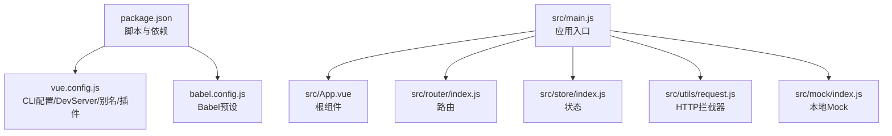
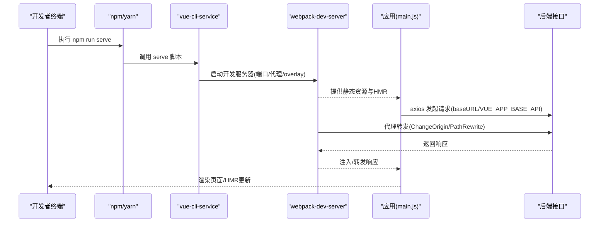
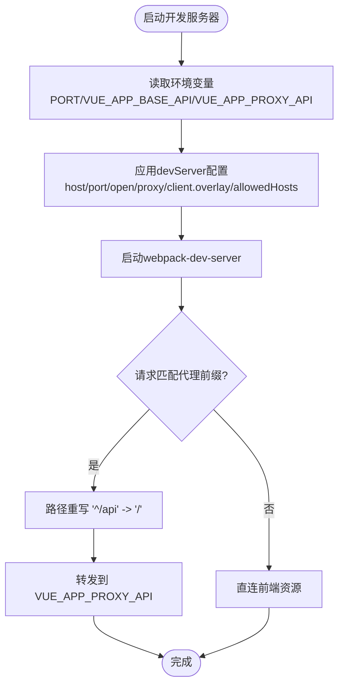
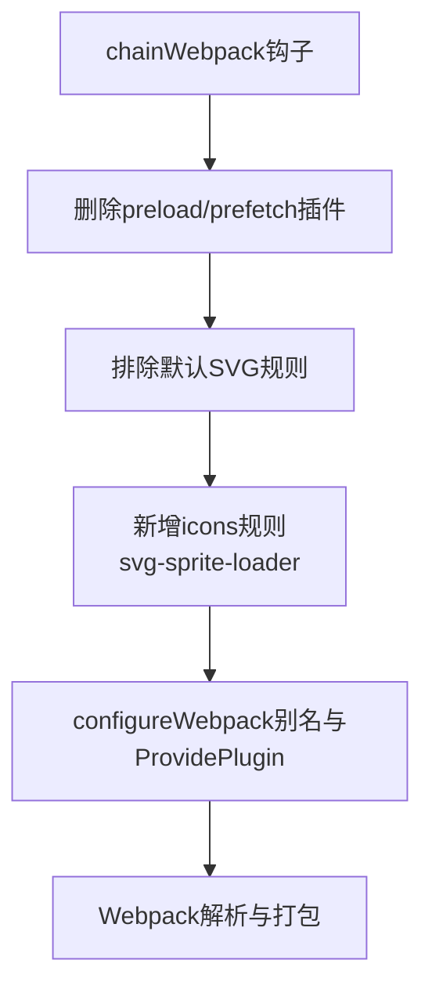
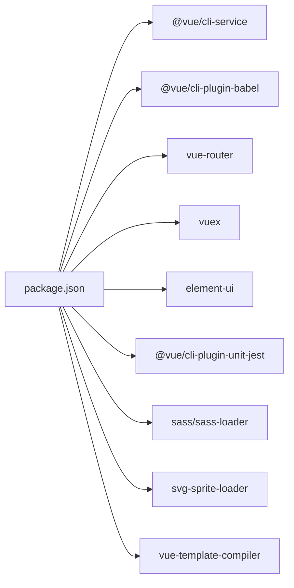

# 开发环境问题

<cite>
**本文引用的文件**
- [package.json](file://package.json)
- [vue.config.js](file://vue.config.js)
- [babel.config.js](file://babel.config.js)
- [README.md](file://README.md)
- [jest.config.js](file://jest.config.js)
- [.editorconfig](file://.editorconfig)
- [src/main.js](file://src/main.js)
- [src/App.vue](file://src/App.vue)
- [src/router/index.js](file://src/router/index.js)
- [src/store/index.js](file://src/store/index.js)
- [src/utils/request.js](file://src/utils/request.js)
- [src/mock/index.js](file://src/mock/index.js)
</cite>

## 目录
1. [简介](#简介)
2. [项目结构](#项目结构)
3. [核心组件](#核心组件)
4. [架构总览](#架构总览)
5. [详细组件分析](#详细组件分析)
6. [依赖关系分析](#依赖关系分析)
7. [性能考量](#性能考量)
8. [故障排除指南](#故障排除指南)
9. [结论](#结论)
10. [附录](#附录)

## 简介
本文件面向Vue CMS项目的开发者，聚焦“开发环境问题”的诊断与修复，覆盖开发服务器启动失败、热重载异常、构建错误、Webpack配置问题、Babel转译错误、依赖包冲突、开发代理配置、端口占用、文件监听异常等常见问题。文档同时提供开发工具配置、IDE设置、Node.js版本兼容性建议、环境变量检查清单与具体修复方案，帮助快速定位并解决问题。

## 项目结构
该项目采用 Vue CLI 5.x 脚手架，核心配置集中在 vue.config.js，脚本与依赖在 package.json，Babel配置在 babel.config.js，入口文件位于 src/main.js，路由与状态管理分别在 src/router/index.js 与 src/store/index.js，网络请求封装在 src/utils/request.js，本地 Mock 在 src/mock/index.js。

**图示来源**
- [package.json](file://package.json)
- [vue.config.js](file://vue.config.js)
- [babel.config.js](file://babel.config.js)
- [src/main.js](file://src/main.js)
- [src/App.vue](file://src/App.vue)
- [src/router/index.js](file://src/router/index.js)
- [src/store/index.js](file://src/store/index.js)
- [src/utils/request.js](file://src/utils/request.js)
- [src/mock/index.js](file://src/mock/index.js)

**章节来源**
- [package.json](file://package.json)
- [vue.config.js](file://vue.config.js)
- [babel.config.js](file://babel.config.js)
- [README.md](file://README.md)

## 核心组件
- 开发服务器与代理：通过 vue.config.js 的 devServer 字段配置 host、port、open、proxy、allowedHosts、client.overlay 等，支持跨域与路径重写。
- 资源别名与插件：configureWebpack 中配置 @ 到 src 的别名与 ProvidePlugin 注入 Quill，chainWebpack 中删除 preload/prefetch 并定制 svg-sprite-loader。
- Babel 转译：preset 使用 @vue/cli-plugin-babel/preset，useBuiltIns 为 entry，core-js 版本为 3。
- 应用入口：main.js 引入 ElementUI、国际化、全局样式、Mock、权限控制与根实例挂载。
- 路由与状态：router/index.js 定义常量路由、动态路由与末尾兜底路由；store/index.js 自动加载 modules 并导出统一 getters。
- 请求与Mock：utils/request.js 基于 axios 创建服务，设置 baseURL、超时、请求/响应拦截；mock/index.js 自动扫描 modules 注册本地接口。

**章节来源**
- [vue.config.js](file://vue.config.js)
- [babel.config.js](file://babel.config.js)
- [src/main.js](file://src/main.js)
- [src/router/index.js](file://src/router/index.js)
- [src/store/index.js](file://src/store/index.js)
- [src/utils/request.js](file://src/utils/request.js)
- [src/mock/index.js](file://src/mock/index.js)

## 架构总览
下图展示开发环境启动与请求链路的关键交互：npm/yarn 调用 vue-cli-service serve，启动 webpack-dev-server，应用通过别名与插件初始化，请求经由 baseURL 与代理转发至后端。

**图示来源**
- [package.json](file://package.json)
- [vue.config.js](file://vue.config.js)
- [src/main.js](file://src/main.js)
- [src/utils/request.js](file://src/utils/request.js)

## 详细组件分析

### 开发服务器与代理配置
- 端口与主机：host 为 0.0.0.0，port 默认 8888（可通过环境变量覆盖），open 自动打开浏览器。
- 代理规则：基于 VUE_APP_BASE_API 与 VUE_APP_PROXY_API 环境变量，启用 changeOrigin 与 pathRewrite。
- 客户端覆盖层：client.overlay 仅显示错误，不遮蔽警告，便于快速发现编译错误。
- allowedHosts：设置为 all，允许任意主机访问（开发场景常用）。

**图示来源**
- [vue.config.js](file://vue.config.js)

**章节来源**
- [vue.config.js](file://vue.config.js)

### 资源别名与插件注入
- 别名：@ 指向 src，提升导入可读性与一致性。
- ProvidePlugin：全局注入 Quill，避免各组件重复引入。
- SVG Sprite：通过 chainWebpack 规则将 src/icons 下的 SVG 交由 svg-sprite-loader 处理，其余 SVG 排除。

**图示来源**
- [vue.config.js](file://vue.config.js)

**章节来源**
- [vue.config.js](file://vue.config.js)

### Babel 转译与 polyfill
- 预设：@vue/cli-plugin-babel/preset。
- useBuiltIns：entry，结合 core-js 3，按需注入垫片，减少冗余代码。
- 注意：若出现转译异常，优先检查 @babel/core、@vue/cli-plugin-babel 版本与 Node 版本兼容性。

**章节来源**
- [babel.config.js](file://babel.config.js)
- [package.json](file://package.json)

### 应用入口与运行时行为
- ElementUI：全局按需语言与尺寸配置，结合 Cookie 与 i18n。
- Mock：开发阶段强制引入本地 Mock，便于前后端并行。
- 权限控制：引入 permission 控制，保证路由与菜单安全。
- 根组件：App.vue 包裹 router-view 与设置面板组件。

**章节来源**
- [src/main.js](file://src/main.js)
- [src/App.vue](file://src/App.vue)

### 路由与状态管理
- 路由：constantRoutes、asyncRoutes、endBasicRoutes 三段式组织；支持 keep-alive、iframe、嵌套菜单等高级特性。
- 状态：自动扫描 modules 文件夹，统一导出 getters，便于全局取值。

**章节来源**
- [src/router/index.js](file://src/router/index.js)
- [src/store/index.js](file://src/store/index.js)

### 请求与本地 Mock
- axios 服务：baseURL 来自 VUE_APP_BASE_API；请求头携带 Authorization、Accept-Language；GET 请求追加时间戳参数防缓存。
- 响应拦截：根据自定义 code 判定成功/警告/错误，必要时触发重新登录流程。
- Mock：自动扫描 modules 注册本地接口，支持延时模拟。

**章节来源**
- [src/utils/request.js](file://src/utils/request.js)
- [src/mock/index.js](file://src/mock/index.js)

## 依赖关系分析
- Node 与 npm 版本要求：engines 指定 node >= 6.0.0，npm >= 3.0.0。
- Vue 生态：vue@2.7.16、vue-router@3.6.5、vuex@3.6.2、Element UI@2.15.14。
- CLI 与构建：@vue/cli-service@5.0.8、@vue/cli-plugin-babel、sass、sass-loader、svg-sprite-loader、vue-template-compiler。
- 测试：jest 预设 @vue/cli-plugin-unit-jest。

**图示来源**
- [package.json](file://package.json)

**章节来源**
- [package.json](file://package.json)

## 性能考量
- 首屏优化：移除 preload/prefetch 插件，避免无效请求；生产环境拆分 chunk，分离 element-ui 与公共组件。
- 运行时：生产环境关闭 source map，减少体积与构建时间。
- 资源加载：SVG 使用 sprite loader，减少 HTTP 请求。

**章节来源**
- [vue.config.js](file://vue.config.js)

## 故障排除指南

### 一、开发服务器启动失败
- 症状
  - 启动报错、端口被占用、无法打开浏览器。
- 排查步骤
  - 确认端口占用：检查 8888（或自定义 PORT）是否被占用，必要时更换端口或终止占用进程。
  - 确认环境变量：VUE_APP_BASE_API、VUE_APP_PROXY_API 是否正确设置；若未设置，代理可能不生效。
  - 确认 host：host=0.0.0.0 可接受外部访问，若网络策略限制，可临时改回 127.0.0.1。
  - 确认 allowedHosts：开发环境可设为 all，避免跨主机访问被拒绝。
  - 确认 open：若浏览器未自动打开，可手动访问 http://localhost:端口。
- 修复方案
  - 在项目根目录创建 .env.development，设置 PORT 与 VUE_APP_BASE_API/VUE_APP_PROXY_API。
  - 若 Windows 防火墙拦截，临时放行端口或关闭拦截。
  - 若 Docker/WSL 环境，确认 host 与端口映射。

**章节来源**
- [vue.config.js](file://vue.config.js)
- [README.md](file://README.md)

### 二、热重载(HMR)异常
- 症状
  - 修改文件后页面不刷新或刷新异常。
- 排查步骤
  - 检查 devServer.client.overlay 是否仅显示错误，避免误以为无更新。
  - 检查文件监听：确认未被 .gitignore/.eslintignore/.editorconfig 忽略。
  - 检查 VS Code 设置：确保文件保存策略与编码一致（LF、UTF-8）。
- 修复方案
  - 在 .editorconfig 中统一缩进与换行，避免 IDE 自动格式化导致的监听抖动。
  - 重启开发服务器，清理缓存后重试。

**章节来源**
- [vue.config.js](file://vue.config.js)
- [.editorconfig](file://.editorconfig)

### 三、构建错误
- 症状
  - npm run build 报错，常见于样式、SVG、polyfill 或插件版本不兼容。
- 排查步骤
  - 样式相关：确认 sass/sass-loader 版本与 Node 版本兼容。
  - SVG 相关：确认 svg-sprite-loader 配置与 chainWebpack 规则一致。
  - Polyfill：确认 babel.config.js 中 useBuiltIns=entry 且 core-js 版本为 3。
  - 插件版本：确保 @vue/cli-service 与 @vue/cli-plugin-* 版本一致。
- 修复方案
  - 升级/降级相关依赖至稳定组合，参考 package.json 中版本范围。
  - 清理 node_modules 与 lock 文件后重装依赖。

**章节来源**
- [package.json](file://package.json)
- [babel.config.js](file://babel.config.js)
- [vue.config.js](file://vue.config.js)

### 四、Webpack 配置问题
- 症状
  - 别名失效、ProvidePlugin 注入失败、SVG 未被 sprite 处理。
- 排查步骤
  - 别名：确认 @ 指向 src，导入路径是否使用 @ 前缀。
  - ProvidePlugin：确认已注入 window.Quill 与 Quill。
  - SVG：确认 chainWebpack 中排除默认规则并新增 icons 规则。
- 修复方案
  - 对照 vue.config.js 的 configureWebpack 与 chainWebpack 配置逐项核对。
  - 若使用自定义 webpack 配置，避免与 defineConfig 冲突。

**章节来源**
- [vue.config.js](file://vue.config.js)

### 五、Babel 转译错误
- 症状
  - 语法不被识别、core-js 相关报错、构建失败。
- 排查步骤
  - 检查 @babel/core 与 @vue/cli-plugin-babel 版本是否匹配。
  - 检查 useBuiltIns=entry 与 core-js=3 是否一致。
  - 检查 Node 版本是否满足 engines 要求。
- 修复方案
  - 锁定 @babel/* 与 @vue/cli-* 版本，避免不兼容升级。
  - 使用 Node LTS 版本，避免实验性语法导致的转译失败。

**章节来源**
- [babel.config.js](file://babel.config.js)
- [package.json](file://package.json)

### 六、依赖包冲突
- 症状
  - 启动时报 require/resolve 错误、样式缺失、运行时崩溃。
- 排查步骤
  - 使用 yarn/npm 安装时遵循 README 建议，避免 cnpm 导致的包差异。
  - 检查 package.json 中依赖版本范围，避免版本漂移。
- 修复方案
  - 使用 yarn --ignore-engines 或指定镜像源安装。
  - 清理 node_modules 与 lock 文件后重装。

**章节来源**
- [README.md](file://README.md)
- [package.json](file://package.json)

### 七、开发代理配置异常
- 症状
  - 请求 404、跨域失败、路径未重写。
- 排查步骤
  - 确认 VUE_APP_BASE_API 与 VUE_APP_PROXY_API 已在 .env.development 中设置。
  - 确认 devServer.proxy 的 pathRewrite 将前缀重写为 /。
  - 确认 changeOrigin=true，避免后端校验 Host 失败。
- 修复方案
  - 在 .env.development 中补充：
    - PORT=8888
    - VUE_APP_BASE_API=/api
    - VUE_APP_PROXY_API=http://localhost:8080
  - 重启开发服务器使代理生效。

**章节来源**
- [vue.config.js](file://vue.config.js)
- [src/utils/request.js](file://src/utils/request.js)

### 八、端口占用与网络策略
- 症状
  - 启动失败、浏览器无法访问、代理不通。
- 排查步骤
  - 使用 netstat/lsof 查找占用端口进程。
  - 检查防火墙/杀毒软件是否拦截。
  - 检查 host 设置与 allowedHosts。
- 修复方案
  - 更换端口或释放占用进程。
  - 临时关闭拦截或加入白名单。

**章节来源**
- [vue.config.js](file://vue.config.js)

### 九、文件监听异常
- 症状
  - 修改文件后无热更、编辑器格式化导致反复触发。
- 排查步骤
  - 检查 .editorconfig 是否统一换行与缩进。
  - 检查 .gitignore/.eslintignore 是否误忽略开发文件。
- 修复方案
  - 在 .editorconfig 中设置 indent_size=2、end_of_line=lf、insert_final_newline=true。
  - 在 VS Code 中禁用不必要的格式化插件或调整保存策略。

**章节来源**
- [.editorconfig](file://.editorconfig)

### 十、Node.js 版本兼容性
- 建议
  - 使用 Node LTS，满足 engines 要求（>= 6.0.0）。
  - 避免使用过新的 Node 版本导致 @vue/cli-service 或依赖不兼容。
- 修复方案
  - 使用 nvm/ndenv 切换 Node 版本后重装依赖。

**章节来源**
- [package.json](file://package.json)

### 十一、IDE 设置与开发工具
- VS Code 建议
  - 安装 EditorConfig 扩展，确保 .editorconfig 生效。
  - 安装 ESLint/Prettier 插件，配合 scripts lint 与 lint-fix。
  - 使用 UTF-8、LF 换行、2 空格缩进。
- 其他
  - Jest 测试：使用 npm run test:unit，jest.config.js 已配置预设。

**章节来源**
- [.editorconfig](file://.editorconfig)
- [jest.config.js](file://jest.config.js)
- [README.md](file://README.md)

### 十二、环境变量检查清单
- 必填项
  - PORT：开发端口，默认 8888
  - VUE_APP_BASE_API：代理前缀，如 /api
  - VUE_APP_PROXY_API：后端代理目标地址，如 http://localhost:8080
- 可选项
  - NODE_ENV：开发环境默认 development
  - BASE_URL：生产部署路径（与 publicPath 配合）

**章节来源**
- [vue.config.js](file://vue.config.js)
- [src/utils/request.js](file://src/utils/request.js)

## 结论
开发环境问题多源于配置不一致、环境变量缺失、依赖版本不兼容与网络策略限制。建议以“环境变量—代理—端口—监听—依赖版本”为主线逐步排查，结合本文提供的检查清单与修复方案，可快速定位并解决问题。日常开发中保持依赖版本稳定、统一 IDE 配置与格式规范，有助于降低故障率。

## 附录

### A. 常见命令与用途
- npm run serve：启动开发服务器
- npm run build：生产构建
- npm run test:unit：单元测试
- npm run lint / lint-fix：代码规范检查与修复
- npm run prettier-fix：Prettier 统一格式

**章节来源**
- [package.json](file://package.json)

### B. 关键配置文件路径速查
- 开发服务器与代理：vue.config.js
- Babel 转译：babel.config.js
- 依赖与脚本：package.json
- 应用入口：src/main.js
- 路由：src/router/index.js
- 状态：src/store/index.js
- 请求封装：src/utils/request.js
- 本地 Mock：src/mock/index.js
- 编辑器规范：.editorconfig
- 测试配置：jest.config.js
- 项目说明：README.md

**章节来源**
- [vue.config.js](file://vue.config.js)
- [babel.config.js](file://babel.config.js)
- [package.json](file://package.json)
- [src/main.js](file://src/main.js)
- [src/router/index.js](file://src/router/index.js)
- [src/store/index.js](file://src/store/index.js)
- [src/utils/request.js](file://src/utils/request.js)
- [src/mock/index.js](file://src/mock/index.js)
- [.editorconfig](file://.editorconfig)
- [jest.config.js](file://jest.config.js)
- [README.md](file://README.md)