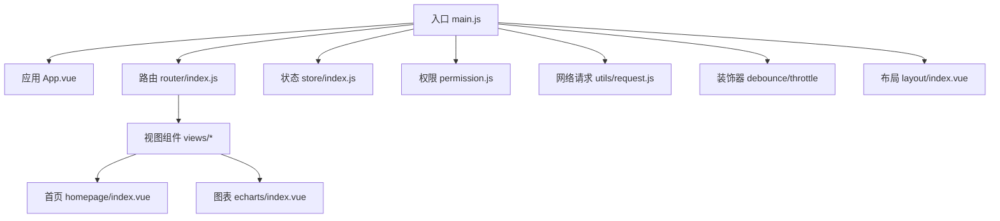
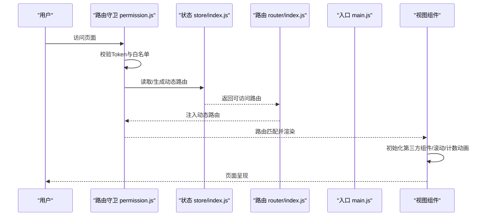
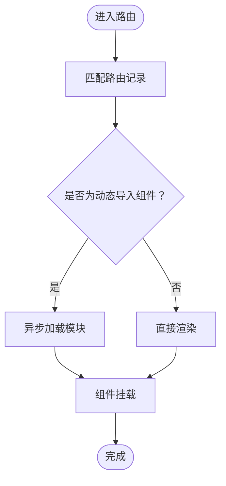
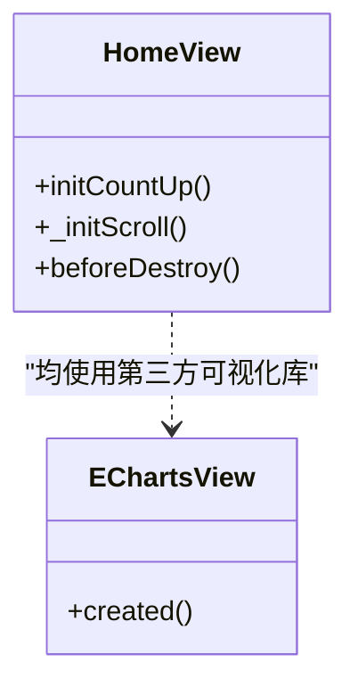
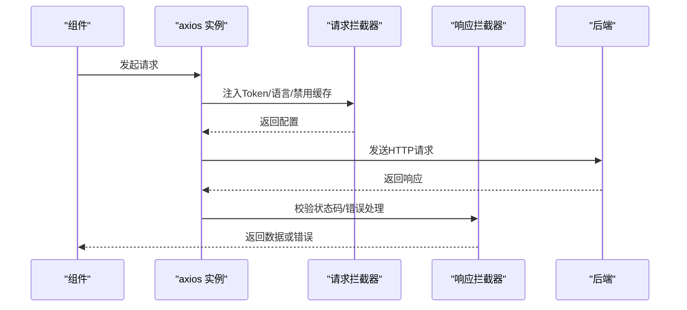
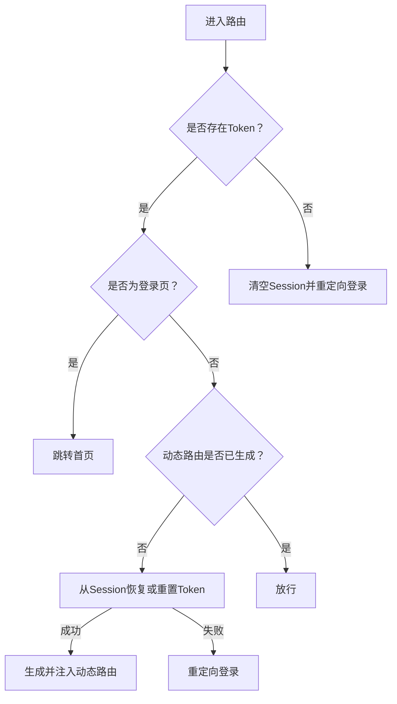
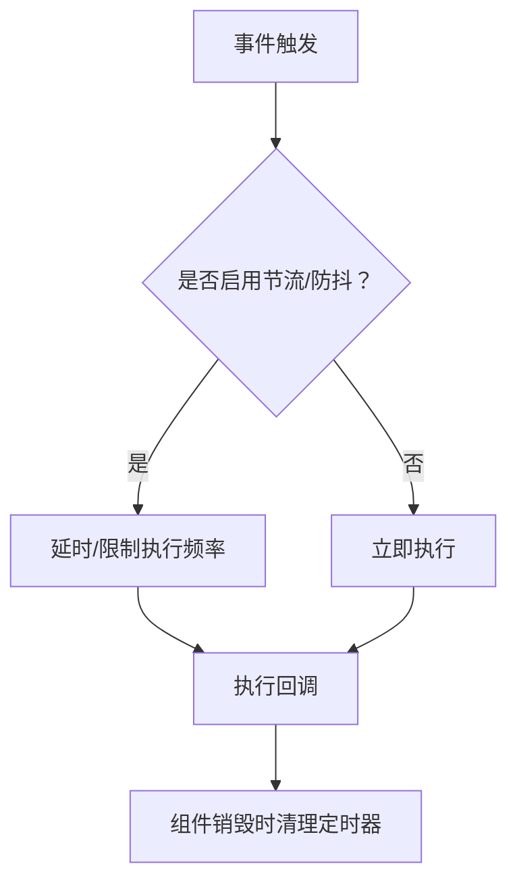
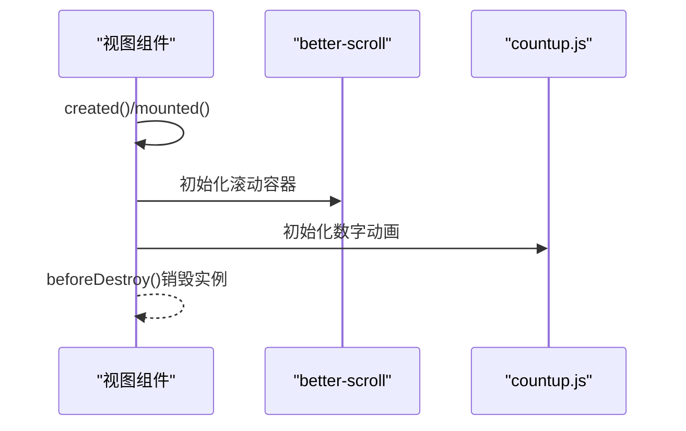
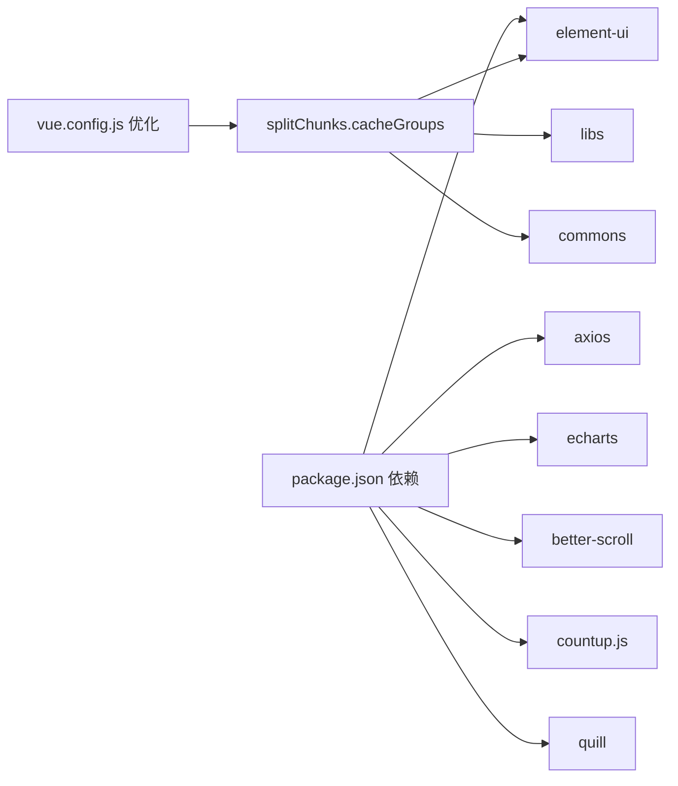

# 性能问题

<cite>
**本文引用的文件**
- [package.json](file://package.json)
- [vue.config.js](file://vue.config.js)
- [src/main.js](file://src/main.js)
- [src/router/index.js](file://src/router/index.js)
- [src/store/index.js](file://src/store/index.js)
- [src/permission.js](file://src/permission.js)
- [src/utils/request.js](file://src/utils/request.js)
- [src/decorator/debounce.js](file://src/decorator/debounce.js)
- [src/decorator/throttle.js](file://src/decorator/throttle.js)
- [src/layout/index.vue](file://src/layout/index.vue)
- [src/App.vue](file://src/App.vue)
- [src/views/homepage/index.vue](file://src/views/homepage/index.vue)
- [src/views/echarts/index.vue](file://src/views/echarts/index.vue)
- [src/common/auth.js](file://src/common/auth.js)
</cite>

## 目录
1. [简介](#简介)
2. [项目结构](#项目结构)
3. [核心组件](#核心组件)
4. [架构总览](#架构总览)
5. [详细组件分析](#详细组件分析)
6. [依赖分析](#依赖分析)
7. [性能考虑](#性能考虑)
8. [故障排除指南](#故障排除指南)
9. [结论](#结论)
10. [附录](#附录)

## 简介
本文件面向Vue CMS项目的性能问题排查与优化，聚焦页面加载缓慢、组件渲染卡顿、内存泄漏等常见问题，结合现有代码结构，提供路由懒加载、组件按需加载、资源优化、防抖节流、动画与图片优化、性能监控与内存分析、渲染性能检测等实用策略，并给出具体指标与优化建议。

## 项目结构
项目采用Vue CLI 5 + Vue 2.7 + Element UI 2.x的经典组合，路由采用vue-router，状态管理采用vuex，构建配置集中在vue.config.js中，整体结构清晰，便于进行性能优化与问题定位。

**图表来源**
- [src/main.js:1-53](file://src/main.js#L1-L53)
- [src/App.vue:1-35](file://src/App.vue#L1-L35)
- [src/router/index.js:1-343](file://src/router/index.js#L1-L343)
- [src/store/index.js:1-74](file://src/store/index.js#L1-L74)
- [src/permission.js:1-98](file://src/permission.js#L1-L98)
- [src/utils/request.js:1-139](file://src/utils/request.js#L1-L139)
- [src/decorator/debounce.js:1-21](file://src/decorator/debounce.js#L1-L21)
- [src/decorator/throttle.js:1-20](file://src/decorator/throttle.js#L1-L20)
- [src/layout/index.vue:1-32](file://src/layout/index.vue#L1-L32)
- [src/views/homepage/index.vue:1-654](file://src/views/homepage/index.vue#L1-L654)
- [src/views/echarts/index.vue:1-217](file://src/views/echarts/index.vue#L1-L217)

**章节来源**
- [src/main.js:1-53](file://src/main.js#L1-L53)
- [vue.config.js:1-144](file://vue.config.js#L1-L144)

## 核心组件
- 应用入口与全局配置：负责引入UI库、国际化、全局组件、Mock数据、全局权限控制等。
- 路由与权限：基于vue-router的动态路由与全局前置守卫，结合Vuex生成可访问路由。
- 状态管理：自动扫描modules目录，统一注册模块与getters。
- 网络层：基于axios封装拦截器，统一处理鉴权、缓存、错误提示与超时。
- 性能装饰器：提供防抖与节流装饰器，降低高频事件触发频率。
- 视图组件：首页与图表页包含大量第三方可视化组件，存在潜在渲染与内存压力。

**章节来源**
- [src/main.js:1-53](file://src/main.js#L1-L53)
- [src/router/index.js:1-343](file://src/router/index.js#L1-L343)
- [src/store/index.js:1-74](file://src/store/index.js#L1-L74)
- [src/permission.js:1-98](file://src/permission.js#L1-L98)
- [src/utils/request.js:1-139](file://src/utils/request.js#L1-L139)
- [src/decorator/debounce.js:1-21](file://src/decorator/debounce.js#L1-L21)
- [src/decorator/throttle.js:1-20](file://src/decorator/throttle.js#L1-L20)
- [src/views/homepage/index.vue:1-654](file://src/views/homepage/index.vue#L1-L654)
- [src/views/echarts/index.vue:1-217](file://src/views/echarts/index.vue#L1-L217)

## 架构总览
下图展示了从用户导航到页面渲染的关键流程，包括路由守卫、动态路由注入、组件渲染与第三方库初始化。

**图表来源**
- [src/permission.js:23-97](file://src/permission.js#L23-L97)
- [src/store/index.js:10-17](file://src/store/index.js#L10-L17)
- [src/router/index.js:322-342](file://src/router/index.js#L322-L342)
- [src/main.js:1-53](file://src/main.js#L1-L53)
- [src/views/homepage/index.vue:233-271](file://src/views/homepage/index.vue#L233-L271)

## 详细组件分析

### 路由与懒加载
- 路由采用动态导入实现懒加载，有效拆分初始包体，减少首屏加载时间。
- 建议：对大组件进一步拆分子路由或子组件，配合keep-alive与缓存策略，避免重复初始化。

**图表来源**
- [src/router/index.js:43-75](file://src/router/index.js#L43-L75)
- [src/router/index.js:118-320](file://src/router/index.js#L118-L320)

**章节来源**
- [src/router/index.js:1-343](file://src/router/index.js#L1-L343)

### 组件按需加载与第三方库
- 入口处引入Element UI与全局样式，建议改为按需引入以减小体积。
- 图表页与首页使用第三方可视化库，注意在组件销毁时清理实例，防止内存泄漏。

**图表来源**
- [src/views/homepage/index.vue:200-271](file://src/views/homepage/index.vue#L200-L271)
- [src/views/echarts/index.vue:168-171](file://src/views/echarts/index.vue#L168-L171)

**章节来源**
- [src/views/homepage/index.vue:1-654](file://src/views/homepage/index.vue#L1-L654)
- [src/views/echarts/index.vue:1-217](file://src/views/echarts/index.vue#L1-L217)

### 网络请求与缓存策略
- 请求拦截器统一注入鉴权与语言头，GET请求加入时间戳参数以规避缓存。
- 响应拦截器统一处理错误码与超时，建议结合缓存策略与重试机制优化弱网体验。

**图表来源**
- [src/utils/request.js:18-52](file://src/utils/request.js#L18-L52)
- [src/utils/request.js:54-136](file://src/utils/request.js#L54-L136)

**章节来源**
- [src/utils/request.js:1-139](file://src/utils/request.js#L1-L139)

### 权限控制与路由守卫
- 全局前置守卫校验Token与白名单，动态注入路由，确保仅加载用户可访问页面。
- 建议：对动态路由生成过程增加缓存与降级策略，避免重复计算与失败回退。

**图表来源**
- [src/permission.js:23-97](file://src/permission.js#L23-L97)

**章节来源**
- [src/permission.js:1-98](file://src/permission.js#L1-L98)

### 防抖与节流装饰器
- 使用lodash的debounce/throttle对高频事件（如滚动、窗口resize）进行节流/防抖，降低渲染压力。
- 建议：在组件销毁时取消未完成的定时器，避免内存泄漏。

**图表来源**
- [src/decorator/debounce.js:16-20](file://src/decorator/debounce.js#L16-L20)
- [src/decorator/throttle.js:15-19](file://src/decorator/throttle.js#L15-L19)

**章节来源**
- [src/decorator/debounce.js:1-21](file://src/decorator/debounce.js#L1-L21)
- [src/decorator/throttle.js:1-20](file://src/decorator/throttle.js#L1-L20)

### 视图组件与第三方库初始化
- 首页组件在mounted后初始化better-scroll与countup.js动画，注意在beforeDestroy中销毁实例。
- 图表页在created阶段发起数据请求，建议结合骨架屏与虚拟滚动优化长列表渲染。

**图表来源**
- [src/views/homepage/index.vue:200-271](file://src/views/homepage/index.vue#L200-L271)

**章节来源**
- [src/views/homepage/index.vue:1-654](file://src/views/homepage/index.vue#L1-L654)

## 依赖分析
- 第三方依赖包含axios、element-ui、echarts、better-scroll、countup.js、quill等，体量较大，建议结合按需引入与分包策略优化。
- 构建配置中已启用splitChunks与runtimeChunk，建议进一步细化cacheGroups，分离element-ui与业务组件。

**图表来源**
- [package.json:33-63](file://package.json#L33-L63)
- [vue.config.js:116-141](file://vue.config.js#L116-L141)

**章节来源**
- [package.json:1-99](file://package.json#L1-L99)
- [vue.config.js:1-144](file://vue.config.js#L1-L144)

## 性能考虑
- 资源优化
  - 已关闭生产环境source map，减少打包体积与解析开销。
  - SVG使用svg-sprite-loader统一处理，减少HTTP请求数。
  - 建议：对图片进行压缩与WebP格式适配，结合懒加载与占位图提升感知速度。
- 路由与组件
  - 路由懒加载已启用，建议对大组件进一步拆分与按需渲染。
  - keep-alive与缓存策略：对频繁切换且状态稳定的页面启用缓存，减少重复初始化。
- 网络与缓存
  - GET请求加入时间戳避免缓存，建议在特定场景使用ETag/Last-Modified缓存策略。
  - 响应拦截器中统一错误提示，建议结合Toast/Message队列避免重复弹窗。
- 动画与滚动
  - better-scroll与countup.js初始化应在DOM稳定后进行，避免阻塞主线程。
  - 对长列表建议使用虚拟滚动或分页加载，降低一次性渲染压力。
- 防抖与节流
  - 对resize、scroll、input等高频事件使用节流/防抖，减少重排与重绘。
- 构建优化
  - splitChunks已按libs、elementUI、commons分组，建议根据实际业务调整最小chunks与复用策略。

**章节来源**
- [vue.config.js:26-27](file://vue.config.js#L26-L27)
- [vue.config.js:90-102](file://vue.config.js#L90-L102)
- [vue.config.js:116-141](file://vue.config.js#L116-L141)
- [src/utils/request.js:34-43](file://src/utils/request.js#L34-L43)
- [src/views/homepage/index.vue:200-271](file://src/views/homepage/index.vue#L200-L271)
- [src/decorator/debounce.js:16-20](file://src/decorator/debounce.js#L16-L20)
- [src/decorator/throttle.js:15-19](file://src/decorator/throttle.js#L15-L19)

## 故障排除指南

### 页面加载缓慢
- 检查首屏资源大小与请求数，确认路由懒加载生效与SVG精灵正确生成。
- 使用浏览器开发者工具的Network与Performance面板分析关键资源与瓶颈。
- 建议：对首屏非关键资源延迟加载，使用骨架屏与渐进增强策略。

**章节来源**
- [vue.config.js:90-102](file://vue.config.js#L90-L102)
- [src/router/index.js:43-75](file://src/router/index.js#L43-L75)

### 组件渲染卡顿
- 检查是否存在大量DOM操作与第三方库初始化在同一生命周期中执行。
- 对长列表使用虚拟滚动或分页，减少一次性渲染节点数量。
- 使用节流/防抖装饰器处理高频事件，避免频繁重排与重绘。

**章节来源**
- [src/views/homepage/index.vue:200-271](file://src/views/homepage/index.vue#L200-L271)
- [src/decorator/debounce.js:16-20](file://src/decorator/debounce.js#L16-L20)
- [src/decorator/throttle.js:15-19](file://src/decorator/throttle.js#L15-L19)

### 内存泄漏
- 确认组件销毁时调用destroy()或清理定时器/订阅，避免残留引用。
- 对第三方库实例（如better-scroll、echarts）在beforeDestroy中销毁。
- 使用浏览器内存快照工具定位泄漏点，重点关注未释放的DOM引用与闭包。

**章节来源**
- [src/views/homepage/index.vue:267-271](file://src/views/homepage/index.vue#L267-L271)

### 路由与权限问题
- 若动态路由注入失败，检查Session中路由数据完整性与生成逻辑。
- 对白名单与重定向逻辑进行日志追踪，避免循环跳转。

**章节来源**
- [src/permission.js:23-97](file://src/permission.js#L23-L97)

### 网络请求与错误处理
- 检查请求拦截器中Token注入与语言头设置是否正确。
- 对超时与网络错误进行统一提示，避免重复弹窗影响用户体验。

**章节来源**
- [src/utils/request.js:18-52](file://src/utils/request.js#L18-L52)
- [src/utils/request.js:108-136](file://src/utils/request.js#L108-L136)

### 性能监控与调试
- 使用Performance面板记录帧率与长任务，识别渲染瓶颈。
- 使用Memory面板进行堆快照对比，定位内存泄漏。
- 结合浏览器Lighthouse生成性能报告，持续跟踪指标变化。

[本节为通用指导，无需列出章节来源]

## 结论
通过路由懒加载、组件按需加载、第三方库实例化时机优化、防抖节流与缓存策略，以及构建期的分包与运行时优化，可显著改善Vue CMS的页面加载与渲染性能。建议建立持续的性能监控与回归测试机制，确保优化措施长期有效。

## 附录

### 性能指标与建议
- 首屏时间（FCP/LCP）：优先优化首屏关键资源与路由懒加载命中率。
- 交互可用时间（TTI）：减少主线程长任务，合理使用节流/防抖与虚拟滚动。
- 内存占用：严格在组件销毁时清理实例与定时器，定期进行内存快照对比。
- 网络请求：对GET请求加入缓存策略与重试机制，统一错误提示与降级处理。

[本节为通用指导，无需列出章节来源]