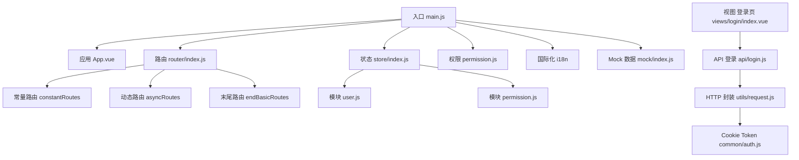
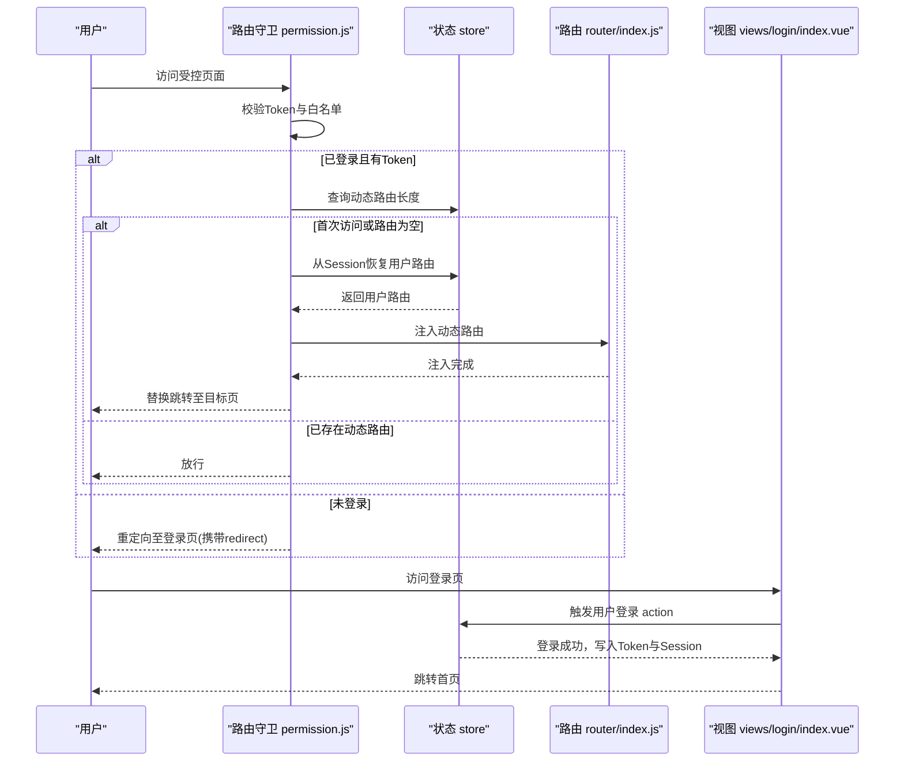
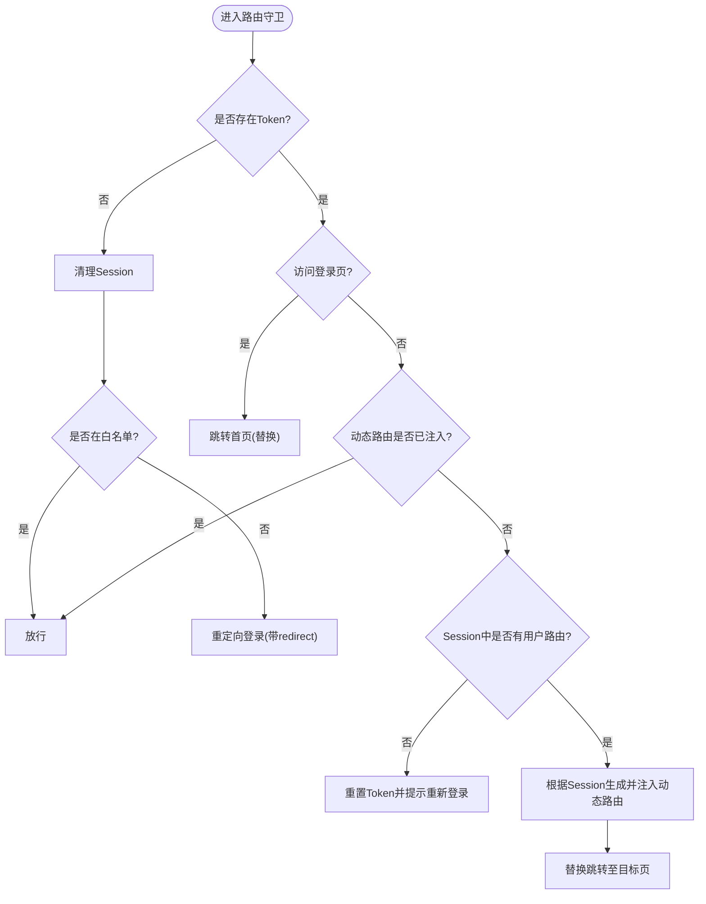
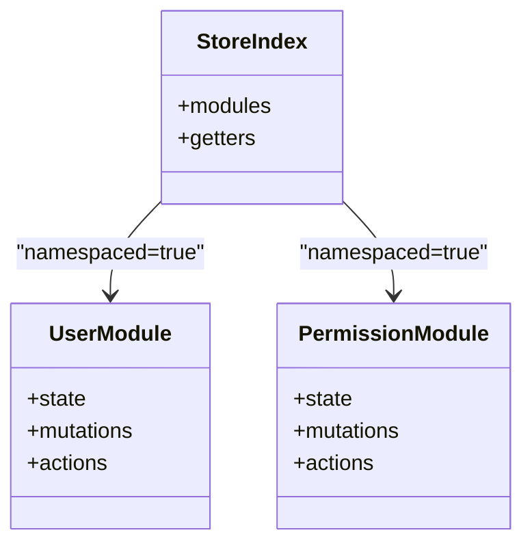
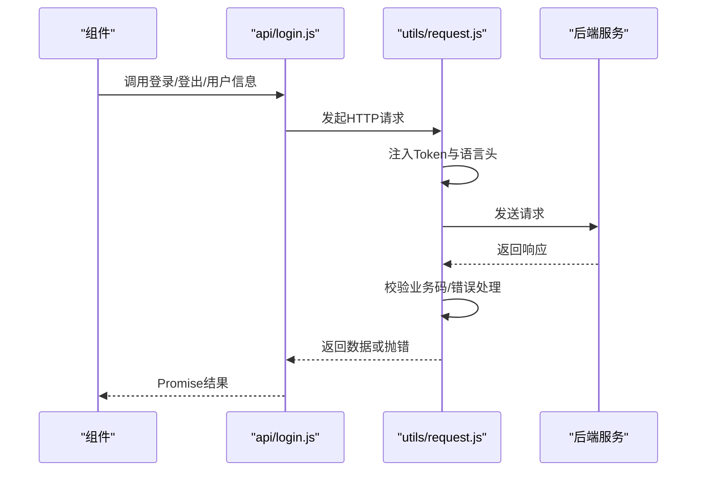
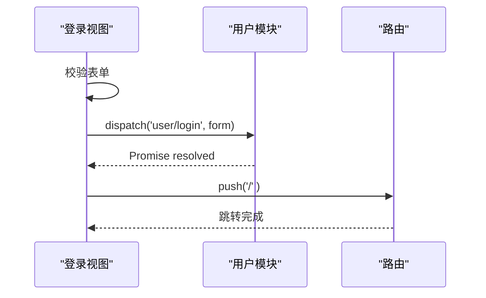
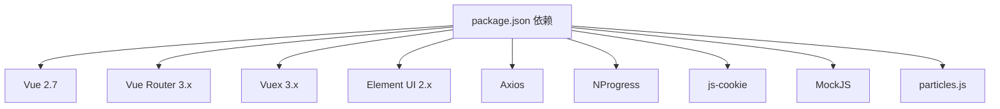

# 故障排除

<cite>
**本文引用的文件**
- [src/main.js](file://src/main.js)
- [src/permission.js](file://src/permission.js)
- [src/router/index.js](file://src/router/index.js)
- [src/store/index.js](file://src/store/index.js)
- [src/store/modules/user.js](file://src/store/modules/user.js)
- [src/store/modules/permission.js](file://src/store/modules/permission.js)
- [src/utils/request.js](file://src/utils/request.js)
- [src/common/auth.js](file://src/common/auth.js)
- [src/views/login/index.vue](file://src/views/login/index.vue)
- [src/api/login.js](file://src/api/login.js)
- [src/mock/index.js](file://src/mock/index.js)
- [src/utils/validate.js](file://src/utils/validate.js)
- [vue.config.js](file://vue.config.js)
- [package.json](file://package.json)
- [README.md](file://README.md)
</cite>

## 目录
1. [简介](#简介)
2. [项目结构](#项目结构)
3. [核心组件](#核心组件)
4. [架构总览](#架构总览)
5. [详细组件分析](#详细组件分析)
6. [依赖分析](#依赖分析)
7. [性能考虑](#性能考虑)
8. [故障排除指南](#故障排除指南)
9. [结论](#结论)
10. [附录](#附录)

## 简介
本故障排除文档面向Vue CMS项目的开发者与技术支持人员，聚焦权限验证、路由跳转、状态管理、网络请求与API调用、组件渲染、浏览器兼容性、性能问题与日志监控等关键领域，提供系统化的诊断思路、常见异常与修复方案、开发与生产环境调试技巧，以及标准化的问题反馈流程。

## 项目结构
项目采用典型的Vue CLI工程化组织方式，核心由入口、路由、状态管理、HTTP请求封装、权限控制、Mock与构建配置构成。下图展示关键模块之间的关系与交互：

**图表来源**
- [src/main.js:1-53](file://src/main.js#L1-L53)
- [src/router/index.js:1-343](file://src/router/index.js#L1-L343)
- [src/store/index.js:1-74](file://src/store/index.js#L1-L74)
- [src/store/modules/user.js:1-154](file://src/store/modules/user.js#L1-L154)
- [src/store/modules/permission.js:1-187](file://src/store/modules/permission.js#L1-L187)
- [src/utils/request.js:1-139](file://src/utils/request.js#L1-L139)
- [src/common/auth.js:1-18](file://src/common/auth.js#L1-L18)
- [src/views/login/index.vue:1-261](file://src/views/login/index.vue#L1-L261)
- [src/api/login.js:1-24](file://src/api/login.js#L1-L24)
- [src/mock/index.js:1-38](file://src/mock/index.js#L1-L38)

**章节来源**
- [src/main.js:1-53](file://src/main.js#L1-L53)
- [src/router/index.js:1-343](file://src/router/index.js#L1-L343)
- [src/store/index.js:1-74](file://src/store/index.js#L1-L74)
- [vue.config.js:1-144](file://vue.config.js#L1-L144)

## 核心组件
- 应用入口与初始化：负责引入UI库、国际化、全局样式、Mock、权限守卫与根实例挂载。
- 路由系统：包含常量路由、动态路由与末尾兜底路由，支持嵌套与懒加载。
- 状态管理：自动加载modules，提供用户信息、权限路由、语言、设置等getter。
- 权限控制：全局前置守卫，结合Cookie Token与Session存储，动态注入路由。
- 网络层：Axios拦截器封装，统一处理鉴权头、语言头、错误提示与超时/网络错误。
- 登录视图：表单校验、记住账号、触发登录动作、路由跳转。
- Mock与构建：Mock集中注册、开发代理、生产资源优化与分包策略。

**章节来源**
- [src/main.js:1-53](file://src/main.js#L1-L53)
- [src/router/index.js:1-343](file://src/router/index.js#L1-L343)
- [src/store/index.js:1-74](file://src/store/index.js#L1-L74)
- [src/permission.js:1-98](file://src/permission.js#L1-L98)
- [src/utils/request.js:1-139](file://src/utils/request.js#L1-L139)
- [src/views/login/index.vue:1-261](file://src/views/login/index.vue#L1-L261)
- [src/mock/index.js:1-38](file://src/mock/index.js#L1-L38)
- [vue.config.js:1-144](file://vue.config.js#L1-L144)

## 架构总览
下图展示从用户访问到页面渲染的关键链路，包括权限校验、动态路由注入与错误处理：

**图表来源**
- [src/permission.js:23-91](file://src/permission.js#L23-L91)
- [src/router/index.js:43-111](file://src/router/index.js#L43-L111)
- [src/store/modules/user.js:54-74](file://src/store/modules/user.js#L54-L74)
- [src/views/login/index.vue:118-153](file://src/views/login/index.vue#L118-L153)

## 详细组件分析

### 权限验证与路由跳转
- 白名单机制：登录、外部授权回调等页面无需鉴权。
- Token校验：通过Cookie中的令牌判断登录态；无Token时清理Session并重定向登录。
- 动态路由注入：首次进入时若无动态路由，尝试从Session恢复；失败则重置Token并引导重新登录。
- 路由替换：注入完成后使用replace避免历史记录。

**图表来源**
- [src/permission.js:23-91](file://src/permission.js#L23-L91)
- [src/common/auth.js:1-18](file://src/common/auth.js#L1-L18)
- [src/store/modules/permission.js:147-178](file://src/store/modules/permission.js#L147-L178)

**章节来源**
- [src/permission.js:1-98](file://src/permission.js#L1-L98)
- [src/router/index.js:43-111](file://src/router/index.js#L43-L111)
- [src/store/modules/permission.js:1-187](file://src/store/modules/permission.js#L1-L187)

### 状态管理（Vuex）
- 自动模块加载：通过require.context扫描modules目录，统一注入store。
- Getter聚合：提供用户信息、头像、语言、动态路由、设置等常用派生状态。
- 用户模块：登录写入Token与Session，退出登录清理Token与Session并重置路由。
- 权限模块：根据后端返回的权限列表过滤前端动态路由，生成按钮权限数组。

**图表来源**
- [src/store/index.js:10-73](file://src/store/index.js#L10-L73)
- [src/store/modules/user.js:13-154](file://src/store/modules/user.js#L13-L154)
- [src/store/modules/permission.js:7-187](file://src/store/modules/permission.js#L7-L187)

**章节来源**
- [src/store/index.js:1-74](file://src/store/index.js#L1-L74)
- [src/store/modules/user.js:1-154](file://src/store/modules/user.js#L1-L154)
- [src/store/modules/permission.js:1-187](file://src/store/modules/permission.js#L1-L187)

### 网络请求与API调用
- Axios实例：统一baseURL、超时、Content-Type与自定义头部。
- 请求拦截：注入Authorization与Accept-Language；GET请求附加时间戳参数防缓存。
- 响应拦截：统一处理业务码、错误提示、超时与网络错误；特殊业务码触发重新登录流程。
- 登录API：封装登录、登出、获取用户信息接口。

**图表来源**
- [src/api/login.js:1-24](file://src/api/login.js#L1-L24)
- [src/utils/request.js:18-52](file://src/utils/request.js#L18-L52)
- [src/utils/request.js:55-136](file://src/utils/request.js#L55-L136)

**章节来源**
- [src/utils/request.js:1-139](file://src/utils/request.js#L1-L139)
- [src/api/login.js:1-24](file://src/api/login.js#L1-L24)
- [src/common/auth.js:1-18](file://src/common/auth.js#L1-L18)

### 登录流程与组件渲染
- 登录页：表单校验、记住账号、触发用户模块登录Action、成功后跳转首页。
- 渲染与生命周期：created读取本地记忆、mounted提示账号信息；登录成功后路由跳转。

**图表来源**
- [src/views/login/index.vue:118-153](file://src/views/login/index.vue#L118-L153)
- [src/store/modules/user.js:54-74](file://src/store/modules/user.js#L54-L74)

**章节来源**
- [src/views/login/index.vue:1-261](file://src/views/login/index.vue#L1-L261)
- [src/store/modules/user.js:1-154](file://src/store/modules/user.js#L1-L154)

### Mock与开发调试
- Mock集中注册：自动扫描modules目录，按配置启用并注册。
- 开发代理：通过devServer.proxy将API前缀转发至后端服务。
- 构建优化：生产环境移除预取、拆分chunk、runtimeChunk独立。

**章节来源**
- [src/mock/index.js:1-38](file://src/mock/index.js#L1-L38)
- [vue.config.js:29-50](file://vue.config.js#L29-L50)
- [vue.config.js:116-141](file://vue.config.js#L116-L141)

## 依赖分析
- 前端框架与UI：Vue 2.7、Element UI 2.x、Vue Router 3.x、Vuex 3.x。
- 网络与工具：Axios、NProgress、js-cookie、MockJS、particles.js等。
- 浏览器支持：现代浏览器与IE 10+。

**图表来源**
- [package.json:33-64](file://package.json#L33-L64)

**章节来源**
- [package.json:1-99](file://package.json#L1-L99)
- [README.md:151-158](file://README.md#L151-L158)

## 性能考虑
- 预加载与预取：开发阶段保留preload，生产移除prefetch以减少无效请求。
- 分包策略：第三方库、Element UI、公共组件分别拆分，提升缓存命中率。
- 运行时优化：runtimeChunk独立，降低重复代码。
- 静态资源：publicPath设置为相对路径，适配子路径部署。

**章节来源**
- [vue.config.js:66-88](file://vue.config.js#L66-L88)
- [vue.config.js:116-141](file://vue.config.js#L116-L141)
- [vue.config.js:22](file://vue.config.js#L22)

## 故障排除指南

### 一、权限验证类问题
- 现象
  - 已登录仍被重定向到登录页
  - 登录后无法进入受控页面
  - 动态路由未生效或菜单不显示
- 诊断步骤
  - 检查Cookie中Token是否存在与过期
  - 查看Session中是否保存了用户路由与用户信息
  - 确认路由守卫是否正确注入动态路由
  - 核对后端返回的权限类型与地址匹配规则
- 修复建议
  - 清理无效Token并重新登录
  - 若Session缺失，引导用户重新登录以重建权限
  - 确保后端返回的权限项包含address字段并与前端path一致
  - 检查路由注入后是否使用replace跳转避免历史记录

**章节来源**
- [src/permission.js:23-91](file://src/permission.js#L23-L91)
- [src/common/auth.js:1-18](file://src/common/auth.js#L1-L18)
- [src/store/modules/permission.js:22-54](file://src/store/modules/permission.js#L22-L54)
- [src/store/modules/permission.js:147-178](file://src/store/modules/permission.js#L147-L178)

### 二、路由跳转类问题
- 现象
  - 访问受控页面白屏或无限重定向
  - 登录成功后未跳转首页
- 诊断步骤
  - 检查白名单配置与目标路径
  - 确认动态路由注入是否完成
  - 核对路由替换逻辑与历史记录
- 修复建议
  - 将受控页面加入白名单或完善登录流程
  - 注入动态路由后使用replace跳转
  - 使用resetRouter在必要时重置路由匹配器

**章节来源**
- [src/router/index.js:20-20](file://src/router/index.js#L20-L20)
- [src/router/index.js:332-340](file://src/router/index.js#L332-L340)
- [src/permission.js:63-74](file://src/permission.js#L63-L74)

### 三、状态管理类问题
- 现象
  - 用户信息未更新或头像路径异常
  - 退出登录后仍显示旧数据
- 诊断步骤
  - 检查用户模块的mutations与actions
  - 确认Session存储与读取逻辑
  - 校验BASE_URL与头像路径拼接
- 修复建议
  - 退出登录时清理Token与Session并重置路由
  - 处理头像路径前缀，确保相对路径兼容子目录部署

**章节来源**
- [src/store/modules/user.js:91-110](file://src/store/modules/user.js#L91-L110)
- [src/store/modules/user.js:136-145](file://src/store/modules/user.js#L136-L145)
- [src/store/index.js:35-39](file://src/store/index.js#L35-L39)

### 四、网络请求与API调用问题
- 现象
  - 登录/查询接口报错或超时
  - 业务码不一致导致提示异常
  - GET请求被浏览器缓存
- 诊断步骤
  - 检查请求拦截器是否注入Token与语言头
  - 核对响应拦截器的业务码判断与错误提示
  - 确认超时与网络错误分支
- 修复建议
  - 确保后端返回正确的业务码与message
  - 对GET请求追加时间戳参数避免缓存
  - 调整Axios超时时间以适配网络环境

**章节来源**
- [src/utils/request.js:18-52](file://src/utils/request.js#L18-L52)
- [src/utils/request.js:55-136](file://src/utils/request.js#L55-L136)

### 五、组件渲染与交互问题
- 现象
  - 登录页表单校验不生效
  - 粒子背景未显示或切换异常
- 诊断步骤
  - 检查表单校验器与事件绑定
  - 确认watch与DOM操作时机
- 修复建议
  - 使用正确的ref与原生事件修饰符
  - 切换时正确销毁粒子实例

**章节来源**
- [src/views/login/index.vue:74-84](file://src/views/login/index.vue#L74-L84)
- [src/views/login/index.vue:87-95](file://src/views/login/index.vue#L87-L95)

### 六、开发与生产环境调试
- 开发环境
  - 使用devServer.proxy转发API请求
  - 打开浏览器自动打开与错误覆盖
  - 使用Mock数据模拟后端接口
- 生产环境
  - 关闭source map以提升构建速度
  - 合理拆分chunk与runtime独立
  - 确认publicPath与静态资源路径

**章节来源**
- [vue.config.js:29-50](file://vue.config.js#L29-L50)
- [vue.config.js:22](file://vue.config.js#L22)
- [src/mock/index.js:16-18](file://src/mock/index.js#L16-L18)

### 七、浏览器兼容性问题
- 支持范围：现代浏览器与IE 10+
- 建议
  - 避免使用过时API，必要时添加polyfill
  - 在IE环境下关注Promise与ES6语法支持

**章节来源**
- [README.md:151-158](file://README.md#L151-L158)

### 八、性能问题分析与优化
- 优化点
  - 移除不必要的prefetch，减少首屏无关请求
  - 拆分第三方库与公共组件，提升缓存复用
  - runtimeChunk独立，降低重复代码
- 建议
  - 使用构建报告分析bundle体积
  - 对大组件采用懒加载与keep-alive合理缓存

**章节来源**
- [vue.config.js:66-88](file://vue.config.js#L66-L88)
- [vue.config.js:116-141](file://vue.config.js#L116-L141)

### 九、日志分析与错误监控
- 日志位置
  - 请求拦截器与响应拦截器中的console输出
  - 登录页与用户模块中的错误打印
- 建议
  - 在生产环境接入统一错误上报
  - 结合浏览器Network面板与Console定位问题
  - 使用Vue DevTools观察状态变更与组件渲染

**章节来源**
- [src/utils/request.js:49-50](file://src/utils/request.js#L49-L50)
- [src/utils/request.js:109-135](file://src/utils/request.js#L109-L135)
- [src/views/login/index.vue:144](file://src/views/login/index.vue#L144-L145)

### 十、标准化问题反馈流程
- 收集信息
  - 浏览器版本与系统信息
  - 复现步骤与期望/实际结果
  - 控制台错误日志与网络请求截图
- 分析定位
  - 检查权限、路由、状态与网络层
  - 对照Mock与真实接口差异
- 处理与回归
  - 提供修复方案与最小复现
  - 验证修复后在多浏览器下的表现

[本节为流程性建议，不直接分析具体文件]

## 结论
本项目围绕“权限—路由—状态—网络—渲染”主线构建，具备完善的Mock与构建优化能力。针对常见问题，建议优先检查Token与Session一致性、动态路由注入完整性、Axios拦截器与业务码约定、以及浏览器兼容与性能瓶颈。通过标准化的诊断流程与问题反馈机制，可显著提升问题定位与修复效率。

## 附录
- 常用命令
  - 开发：npm run serve
  - 构建：npm run build
  - 单测：npm run test:unit
  - 代码规范：npm run lint / lint-fix / prettier-fix
- 环境变量
  - VUE_APP_BASE_API：后端接口前缀
  - VUE_APP_PROXY_API：代理目标地址
  - VUE_APP_Cookie_Key：Cookie中Token键名

**章节来源**
- [package.json:24-32](file://package.json#L24-L32)
- [vue.config.js:33-40](file://vue.config.js#L33-L40)
- [src/common/auth.js:3](file://src/common/auth.js#L3)