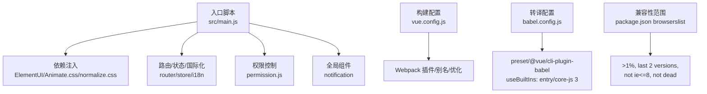
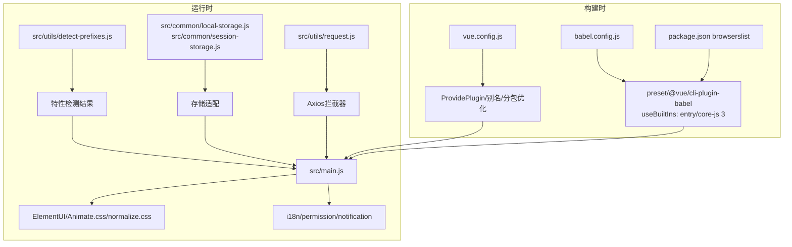
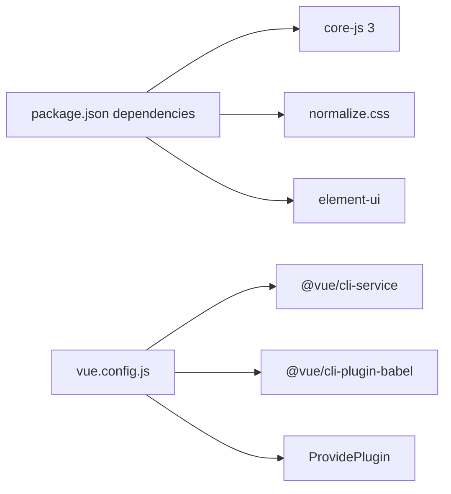
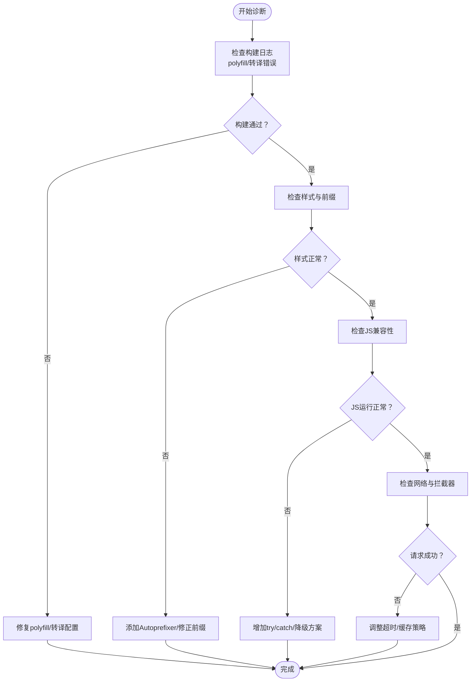

# 浏览器兼容性问题

<cite>
**本文引用的文件**
- [package.json](file://package.json)
- [babel.config.js](file://babel.config.js)
- [vue.config.js](file://vue.config.js)
- [src/main.js](file://src/main.js)
- [src/utils/detect-prefixes.js](file://src/utils/detect-prefixes.js)
- [src/assets/style/base.scss](file://src/assets/style/base.scss)
- [src/common/local-storage.js](file://src/common/local-storage.js)
- [src/common/session-storage.js](file://src/common/session-storage.js)
- [src/utils/index.js](file://src/utils/index.js)
- [src/utils/request.js](file://src/utils/request.js)
- [src/mock/index.js](file://src/mock/index.js)
- [src/components/notification/index.js](file://src/components/notification/index.js)
</cite>

## 目录
1. [简介](#简介)
2. [项目结构](#项目结构)
3. [核心组件](#核心组件)
4. [架构总览](#架构总览)
5. [详细组件分析](#详细组件分析)
6. [依赖分析](#依赖分析)
7. [性能考虑](#性能考虑)
8. [故障排除指南](#故障排除指南)
9. [结论](#结论)
10. [附录](#附录)

## 简介
本文件面向Vue CMS项目的浏览器兼容性问题，聚焦于不同浏览器下的功能异常、样式错乱、JavaScript兼容性等问题的诊断与解决。内容涵盖CSS前缀处理、ES6+语法转换、Polyfill配置、特性检测与渐进增强策略，并提供主流浏览器测试、兼容性检测与降级方案等实用调试技巧。

## 项目结构
本项目采用Vue CLI 5构建，基于Babel进行ES6+转译，使用Webpack进行打包优化；样式方面通过SCSS与normalize.css统一基础样式，并在必要处使用特性检测与前缀处理保证跨浏览器一致性。

图表来源
- [src/main.js:1-53](file://src/main.js#L1-L53)
- [vue.config.js:14-144](file://vue.config.js#L14-L144)
- [babel.config.js:1-12](file://babel.config.js#L1-L12)
- [package.json:92-97](file://package.json#L92-L97)

章节来源
- [src/main.js:1-53](file://src/main.js#L1-L53)
- [vue.config.js:14-144](file://vue.config.js#L14-L144)
- [babel.config.js:1-12](file://babel.config.js#L1-L12)
- [package.json:92-97](file://package.json#L92-L97)

## 核心组件
- 构建与转译层
  - Babel preset由@vue/cli-plugin-babel提供，默认启用useBuiltIns: 'entry'并指定core-js 3，用于按需注入polyfill，减少冗余代码体积。
  - browserslist配置排除IE8及以下，确保现代浏览器体验优先。
- 样式与基础层
  - normalize.css统一默认样式，避免浏览器差异。
  - SCSS变量与选择器在部分浏览器存在兼容性差异，需结合特性检测与前缀处理。
- 运行时与存储层
  - localStorage/sessionStorage封装提供统一访问接口，注意旧版IE对localStorage的限制与错误处理。
- 工具与拦截器
  - 特性检测工具用于识别CSS过渡/变换前缀与translate3d支持。
  - Axios拦截器负责请求/响应处理、超时与网络错误提示，保障跨浏览器一致的错误反馈。

章节来源
- [babel.config.js:1-12](file://babel.config.js#L1-L12)
- [package.json:92-97](file://package.json#L92-L97)
- [src/main.js:9-18](file://src/main.js#L9-L18)
- [src/assets/style/base.scss:1-125](file://src/assets/style/base.scss#L1-L125)
- [src/common/local-storage.js:1-41](file://src/common/local-storage.js#L1-L41)
- [src/common/session-storage.js:1-48](file://src/common/session-storage.js#L1-L48)
- [src/utils/detect-prefixes.js:1-46](file://src/utils/detect-prefixes.js#L1-L46)
- [src/utils/request.js:1-139](file://src/utils/request.js#L1-L139)

## 架构总览
下图展示浏览器兼容性相关的关键路径：入口脚本引入基础样式与UI库，构建配置启用Webpack插件与别名，Babel转译与polyfill注入，运行时通过特性检测与存储封装适配不同浏览器。

图表来源
- [src/main.js:1-53](file://src/main.js#L1-L53)
- [src/utils/detect-prefixes.js:1-46](file://src/utils/detect-prefixes.js#L1-L46)
- [src/common/local-storage.js:1-41](file://src/common/local-storage.js#L1-L41)
- [src/common/session-storage.js:1-48](file://src/common/session-storage.js#L1-L48)
- [src/utils/request.js:1-139](file://src/utils/request.js#L1-L139)
- [vue.config.js:51-65](file://vue.config.js#L51-L65)
- [babel.config.js:1-12](file://babel.config.js#L1-L12)
- [package.json:92-97](file://package.json#L92-L97)

## 详细组件分析

### ES6+语法与Polyfill策略
- 转译与注入
  - 使用@vue/cli-plugin-babel preset，开启useBuiltIns: 'entry'与core-js 3，按需注入polyfill，避免全量引入导致体积膨胀。
  - 建议在入口文件显式引入polyfill以确保目标浏览器具备所需API。
- 测试与验证
  - 在本地开发服务器与CI中分别执行构建，检查产物是否包含必要的polyfill。
  - 使用浏览器开发者工具的“Coverage”功能查看未使用的polyfill，进一步瘦身。

章节来源
- [babel.config.js:1-12](file://babel.config.js#L1-L12)
- [package.json:92-97](file://package.json#L92-L97)

### CSS前缀与样式兼容
- 前缀检测
  - 通过特性检测工具识别transition/transform事件与属性的浏览器前缀，以及translate3d支持，动态选择正确的CSS属性与事件名。
- 基础样式
  - normalize.css统一默认样式，SCSS变量在部分旧版浏览器可能不被识别，建议配合Autoprefixer自动添加厂商前缀。
- 滚动条样式
  - WebKit与Firefox滚动条样式存在差异，需分别处理，确保跨浏览器一致的滚动体验。

章节来源
- [src/utils/detect-prefixes.js:1-46](file://src/utils/detect-prefixes.js#L1-L46)
- [src/assets/style/base.scss:1-125](file://src/assets/style/base.scss#L1-L125)

### 存储API兼容性
- localStorage/sessionStorage
  - 旧版IE在无痕模式或禁用Cookie时可能抛出异常，封装中已包含JSON解析与默认值处理逻辑。
  - 建议在业务层增加try/catch保护与降级方案（如使用Cookie或内存存储）。

章节来源
- [src/common/local-storage.js:1-41](file://src/common/local-storage.js#L1-L41)
- [src/common/session-storage.js:1-48](file://src/common/session-storage.js#L1-L48)

### 网络与错误处理
- Axios拦截器
  - 统一设置Content-Type、超时与缓存控制；针对GET请求附加时间戳参数避免缓存。
  - 对响应状态码与Blob/ArrayBuffer类型进行特殊处理；对超时与网络错误提供明确提示。
- Mock数据
  - 开发环境下使用MockJS模拟接口，避免真实网络波动影响测试稳定性。

章节来源
- [src/utils/request.js:1-139](file://src/utils/request.js#L1-L139)
- [src/mock/index.js:1-38](file://src/mock/index.js#L1-L38)

### 通知组件与DOM操作
- 动态挂载与生命周期
  - 通过Vue.extend创建实例并手动挂载至body，注意在beforeDestroy阶段清理定时器与DOM节点，防止内存泄漏。
- 兼容性要点
  - 在旧版浏览器中，offsetHeight计算可能受字体渲染差异影响，建议在可见性变化时重算高度。

章节来源
- [src/components/notification/index.js:1-119](file://src/components/notification/index.js#L1-L119)

### 特性检测与渐进增强
- 检测维度
  - CSS过渡/变换事件与属性前缀、translate3d支持、滚动条样式差异、localStorage可用性等。
- 设计原则
  - 渐进增强：在现代浏览器启用高级特性（如CSS变量、translate3d），在旧版浏览器回退到兼容方案（如固定前缀、替代布局）。
  - 优雅降级：保证核心功能在低版本浏览器可用，视觉与交互可适当简化。

章节来源
- [src/utils/detect-prefixes.js:1-46](file://src/utils/detect-prefixes.js#L1-L46)
- [src/assets/style/base.scss:1-125](file://src/assets/style/base.scss#L1-L125)
- [src/common/local-storage.js:1-41](file://src/common/local-storage.js#L1-L41)

## 依赖分析
- 外部依赖
  - core-js 3：提供polyfill，与Babel useBuiltIns协同工作。
  - normalize.css：统一默认样式，减少跨浏览器差异。
  - element-ui：提供UI组件，需关注其对现代浏览器的依赖与兼容性。
- 构建依赖
  - @vue/cli-service、@vue/cli-plugin-babel：提供构建与转译能力。
  - webpack ProvidePlugin：全局注入Quill，避免模块导入复杂度。

图表来源
- [package.json:33-63](file://package.json#L33-L63)
- [vue.config.js:51-65](file://vue.config.js#L51-L65)

章节来源
- [package.json:33-63](file://package.json#L33-L63)
- [vue.config.js:51-65](file://vue.config.js#L51-L65)

## 性能考虑
- 分包与运行时
  - 通过splitChunks将第三方库、ElementUI与公共组件拆分为独立chunk，提升缓存命中率与并行加载效率。
  - runtimeChunk设为single，减少重复运行时代码。
- 预加载与预取
  - 生产环境删除preload/prefetch插件，避免对慢速网络造成额外负担；保留关键资源的合理预加载策略。
- 样式与脚本
  - Autoprefixer自动添加CSS前缀，减少手工维护成本；确保只引入必要的normalize.css与自定义样式。

章节来源
- [vue.config.js:104-141](file://vue.config.js#L104-L141)
- [src/main.js:9-18](file://src/main.js#L9-L18)

## 故障排除指南

### 常见问题与定位步骤
- 页面空白或组件不显示
  - 检查构建日志是否存在polyfill缺失或转译错误。
  - 确认入口文件已正确引入normalize.css与ElementUI样式。
- 样式错乱或动画异常
  - 使用特性检测工具确认CSS前缀与事件名是否匹配。
  - 检查SCSS变量在目标浏览器是否被识别，必要时添加Autoprefixer。
- JavaScript报错（如localStorage不可用）
  - 在业务层增加try/catch与降级逻辑，确保应用在受限环境中仍可运行。
- 请求失败或超时
  - 查看Axios拦截器日志，确认超时时间与缓存控制策略是否合理。
  - 在Mock环境下验证接口行为，排除后端波动影响。

### 诊断流程图

### 测试与验证清单
- 主流浏览器测试
  - Chrome/Edge最新版、Firefox稳定版、Safari最新版；对Android WebView与iOS Safari进行基础验证。
- 兼容性检测
  - 使用特性检测工具验证CSS前缀与translate3d支持。
  - 检查localStorage/sessionStorage在目标环境的行为与异常处理。
- 降级方案
  - 为不支持某些特性的浏览器提供替代实现（如固定前缀、简化动画）。
  - 在UI层面提供清晰的错误提示与引导。

章节来源
- [src/utils/detect-prefixes.js:1-46](file://src/utils/detect-prefixes.js#L1-L46)
- [src/common/local-storage.js:1-41](file://src/common/local-storage.js#L1-L41)
- [src/common/session-storage.js:1-48](file://src/common/session-storage.js#L1-L48)
- [src/utils/request.js:1-139](file://src/utils/request.js#L1-L139)

## 结论
本项目通过Babel + core-js 3实现按需polyfill注入，结合normalize.css与SCSS变量统一基础样式，并辅以特性检测与存储封装，形成较为完善的浏览器兼容体系。建议在实际部署前，针对目标浏览器范围补充自动化测试与覆盖率监控，持续优化polyfill与样式策略，确保在现代浏览器中获得最佳体验的同时，为旧版浏览器提供稳定的降级方案。

## 附录
- 关键配置参考
  - browserslist：排除IE8及以下，聚焦现代浏览器生态。
  - Babel preset：useBuiltIns: 'entry' + core-js 3，平衡兼容性与体积。
  - Webpack：分包与runtime优化，提升加载性能。
- 最佳实践
  - 渐进增强与优雅降级并重，优先保障核心功能可用。
  - 在入口处集中引入基础样式与polyfill，避免分散配置带来的遗漏。
  - 使用特性检测而非UA判断，提高兼容策略的可维护性。