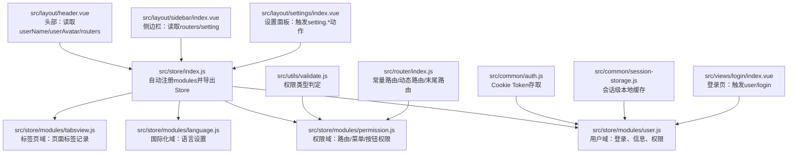
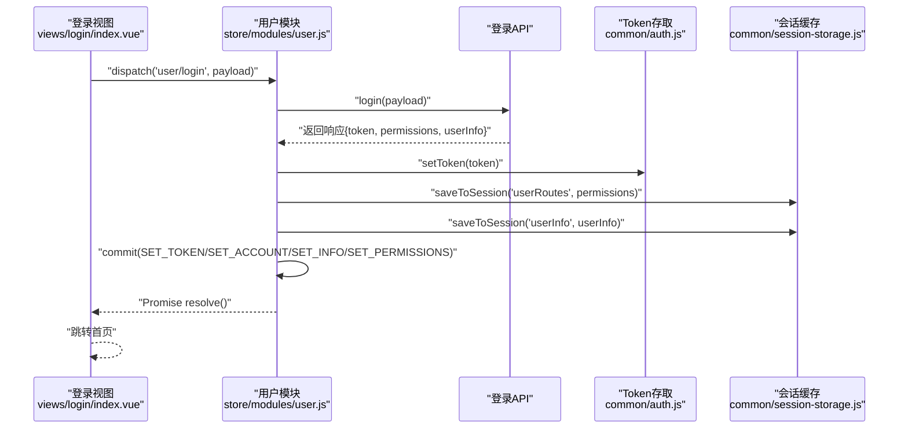
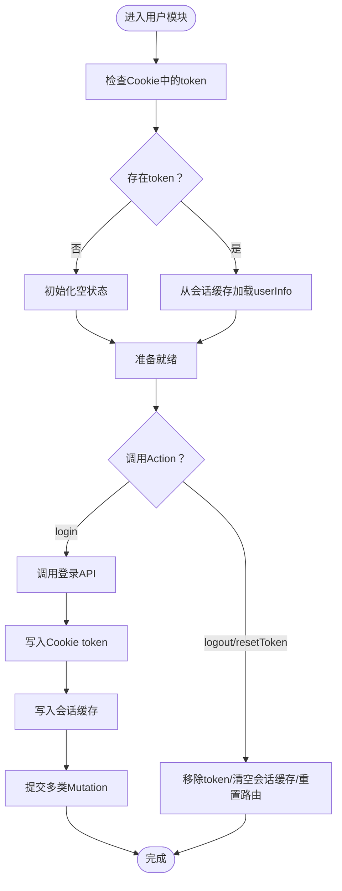
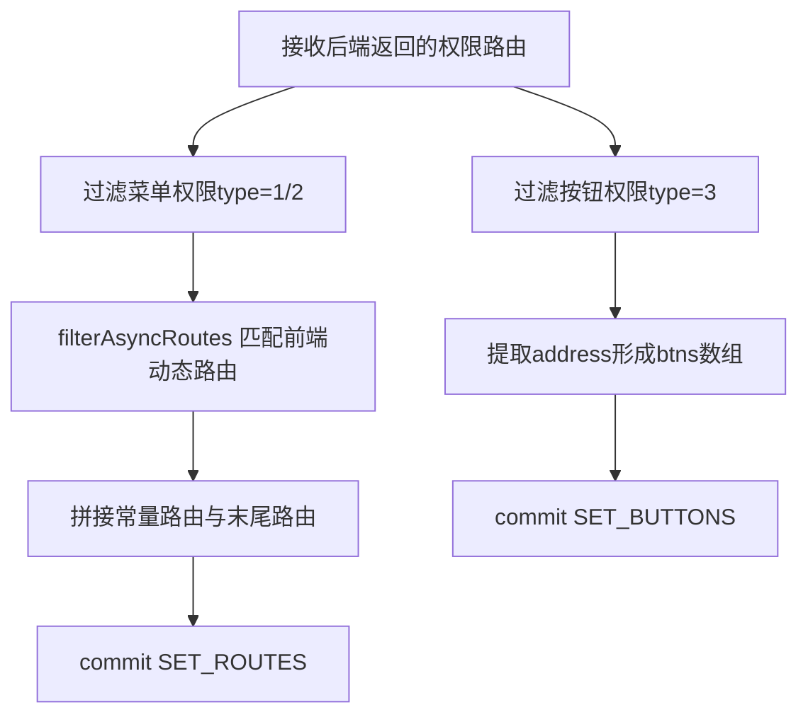
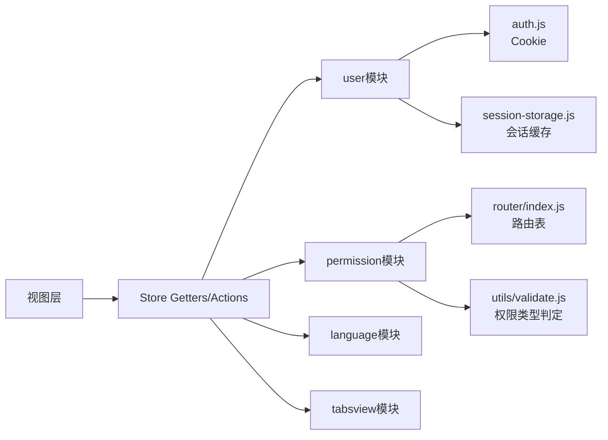

# 状态管理问题

<cite>
**本文引用的文件**
- [src/store/index.js](file://src/store/index.js)
- [src/store/modules/user.js](file://src/store/modules/user.js)
- [src/store/modules/language.js](file://src/store/modules/language.js)
- [src/store/modules/permission.js](file://src/store/modules/permission.js)
- [src/store/modules/tabsview.js](file://src/store/modules/tabsview.js)
- [src/common/auth.js](file://src/common/auth.js)
- [src/common/session-storage.js](file://src/common/session-storage.js)
- [src/utils/validate.js](file://src/utils/validate.js)
- [src/router/index.js](file://src/router/index.js)
- [src/views/login/index.vue](file://src/views/login/index.vue)
- [src/layout/header.vue](file://src/layout/header.vue)
- [src/layout/sidebar/index.vue](file://src/layout/sidebar/index.vue)
- [src/layout/settings/index.vue](file://src/layout/settings/index.vue)
</cite>

## 目录
1. [简介](#简介)
2. [项目结构](#项目结构)
3. [核心组件](#核心组件)
4. [架构总览](#架构总览)
5. [详细组件分析](#详细组件分析)
6. [依赖关系分析](#依赖关系分析)
7. [性能考量](#性能考量)
8. [故障排除指南](#故障排除指南)
9. [结论](#结论)
10. [附录](#附录)

## 简介
本文件面向Vue CMS项目的前端开发者，聚焦Vuex状态管理在实际工程中的常见问题与排障实践。内容覆盖：
- Vuex状态异常、模块注册失败、数据同步错误的诊断与修复
- Action执行异常、Mutation触发失败、State更新延迟的排查流程
- 模块化状态设计、异步数据处理、状态持久化的调试技巧
- 状态树结构、模块间通信、响应式更新的异常处理
- 具体的State检查方法与修复方案

## 项目结构
本项目采用模块化Store组织方式，通过自动扫描模块目录实现“零手动引入”的模块注册；同时在全局定义一组Getters，统一对外提供便捷取值入口。

图示来源
- [src/store/index.js:1-74](file://src/store/index.js#L1-L74)
- [src/store/modules/user.js:1-154](file://src/store/modules/user.js#L1-L154)
- [src/store/modules/permission.js:1-187](file://src/store/modules/permission.js#L1-L187)
- [src/store/modules/language.js:1-26](file://src/store/modules/language.js#L1-L26)
- [src/store/modules/tabsview.js:1-49](file://src/store/modules/tabsview.js#L1-L49)
- [src/common/auth.js:1-18](file://src/common/auth.js#L1-L18)
- [src/common/session-storage.js:1-48](file://src/common/session-storage.js#L1-L48)
- [src/utils/validate.js:1-56](file://src/utils/validate.js#L1-L56)
- [src/router/index.js:1-343](file://src/router/index.js#L1-L343)
- [src/views/login/index.vue:1-261](file://src/views/login/index.vue#L1-L261)
- [src/layout/header.vue:1-270](file://src/layout/header.vue#L1-L270)
- [src/layout/sidebar/index.vue:1-142](file://src/layout/sidebar/index.vue#L1-L142)
- [src/layout/settings/index.vue:1-512](file://src/layout/settings/index.vue#L1-L512)

章节来源
- [src/store/index.js:1-74](file://src/store/index.js#L1-L74)

## 核心组件
- Store入口与模块注册
  - 自动扫描modules目录，按文件名注册命名空间模块，避免手动引入遗漏
  - 在Store中集中定义全局Getters，统一对外取值
- 用户模块（user）
  - 维护token、账户、用户信息、权限等状态
  - 提供登录、拉取用户信息、登出、头像更新、用户信息更新、重置token等Action
  - 使用Cookie存储token，使用会话级storage缓存本次登录相关数据
- 权限模块（permission）
  - 维护按钮权限数组、最终路由集合、动态添加的路由
  - 提供生成路由的动作，基于后端返回的权限数据与前端动态路由表进行匹配过滤
- 语言模块（language）
  - 维护当前语言，并写入本地语言设置
- 标签页模块（tabsview）
  - 记录访问过的页面标签，支持添加与删除

章节来源
- [src/store/index.js:1-74](file://src/store/index.js#L1-L74)
- [src/store/modules/user.js:1-154](file://src/store/modules/user.js#L1-L154)
- [src/store/modules/permission.js:1-187](file://src/store/modules/permission.js#L1-L187)
- [src/store/modules/language.js:1-26](file://src/store/modules/language.js#L1-L26)
- [src/store/modules/tabsview.js:1-49](file://src/store/modules/tabsview.js#L1-L49)

## 架构总览
下图展示了登录流程中Action、Mutation与外部依赖的交互：

图示来源
- [src/views/login/index.vue:110-153](file://src/views/login/index.vue#L110-L153)
- [src/store/modules/user.js:52-88](file://src/store/modules/user.js#L52-L88)
- [src/common/auth.js:9-11](file://src/common/auth.js#L9-L11)
- [src/common/session-storage.js:19-28](file://src/common/session-storage.js#L19-L28)

## 详细组件分析

### 用户模块（user）分析
- 状态结构
  - token：来自Cookie
  - account：账户名
  - userInfo：包含name、age、sex、avatar、type、desc等
  - permissions：原始权限数组
- 关键Action
  - login：调用登录API，成功后写入token与会话缓存，提交多类Mutation
  - pullUserInfo：拉取用户信息（未在模板中直接使用）
  - logout：清理token与会话缓存，提交清空Mutation
  - doUpdateAvatar/doUpdateUser：模拟异步更新，延时后提交Mutation
  - resetToken：移除token、清空会话缓存、重置路由
- 关键Mutation
  - SET_ACCOUNT/SET_TOKEN/SET_AVATAR/SET_PERMISSIONS/SET_ALL/SET_INFO
- 持久化策略
  - Token：Cookie
  - 本次登录相关数据：window.sessionStorage（带命名空间隔离）

图示来源
- [src/store/modules/user.js:13-49](file://src/store/modules/user.js#L13-L49)
- [src/store/modules/user.js:52-145](file://src/store/modules/user.js#L52-L145)
- [src/common/auth.js:5-15](file://src/common/auth.js#L5-L15)
- [src/common/session-storage.js:19-41](file://src/common/session-storage.js#L19-L41)

章节来源
- [src/store/modules/user.js:1-154](file://src/store/modules/user.js#L1-L154)
- [src/common/auth.js:1-18](file://src/common/auth.js#L1-L18)
- [src/common/session-storage.js:1-48](file://src/common/session-storage.js#L1-L48)

### 权限模块（permission）分析
- 状态结构
  - btns：按钮权限数组
  - routes：最终路由集合（常量路由+动态路由）
  - addRoutes：动态添加的路由
- 关键算法
  - hasPermission：匹配后端返回的address与前端路由path
  - filterAsyncRoutes：递归过滤动态路由，保留有权限或存在有效子节点的路由
- 关键Action
  - generateRoutes：过滤菜单权限、提取按钮权限、生成最终路由并提交Mutation
- 与路由表的关系
  - 依赖constantRoutes、asyncRoutes、endBasicRoutes
  - 通过Mutation更新routes与addRoutes

图示来源
- [src/store/modules/permission.js:143-179](file://src/store/modules/permission.js#L143-L179)
- [src/store/modules/permission.js:41-54](file://src/store/modules/permission.js#L41-L54)
- [src/store/modules/permission.js:22-32](file://src/store/modules/permission.js#L22-L32)
- [src/router/index.js:43-111](file://src/router/index.js#L43-L111)

章节来源
- [src/store/modules/permission.js:1-187](file://src/store/modules/permission.js#L1-L187)
- [src/router/index.js:1-343](file://src/router/index.js#L1-L343)
- [src/utils/validate.js:24-55](file://src/utils/validate.js#L24-L55)

### 语言模块（language）分析
- 状态结构：language
- Mutation：SET_LANG，同时写入本地语言设置
- Action：setLanguage，提交SET_LANG

章节来源
- [src/store/modules/language.js:1-26](file://src/store/modules/language.js#L1-L26)

### 标签页模块（tabsview）分析
- 状态结构：visitedTabsView
- Mutation：SET_TABSVIEW（去重添加）、DEL_TABSVIEW（按path/name删除）
- Action：addVisitedTabsView、delVisitedTabsView（返回新数组）

章节来源
- [src/store/modules/tabsview.js:1-49](file://src/store/modules/tabsview.js#L1-L49)

## 依赖关系分析
- 模块耦合
  - user依赖auth与session-storage进行持久化
  - permission依赖router的常量/动态/末尾路由以及validate工具
  - 视图层通过mapGetters/mapActions与Store交互
- 外部依赖
  - Cookie：token存取
  - window.sessionStorage：会话级缓存
  - Vue Router：动态路由生成与重置

图示来源
- [src/store/modules/user.js:1-4](file://src/store/modules/user.js#L1-L4)
- [src/common/auth.js:1-18](file://src/common/auth.js#L1-L18)
- [src/common/session-storage.js:1-48](file://src/common/session-storage.js#L1-L48)
- [src/store/modules/permission.js:4-5](file://src/store/modules/permission.js#L4-L5)
- [src/router/index.js:43-343](file://src/router/index.js#L43-L343)
- [src/utils/validate.js:1-56](file://src/utils/validate.js#L1-L56)

章节来源
- [src/store/index.js:1-74](file://src/store/index.js#L1-L74)

## 性能考量
- 模块注册自动化：减少手动引入，降低遗漏风险，提升开发效率
- Getter集中：避免跨模块重复取值逻辑，减少计算冗余
- 会话缓存：仅缓存本次登录相关数据，避免污染localStorage
- 路由过滤：递归过滤动态路由，注意大数据量时的复杂度控制

## 故障排除指南

### 一、Vuex状态异常（State异常）
- 症状
  - 页面读取不到最新状态（如头像、用户名、路由）
  - 刷新后状态丢失
- 排查步骤
  - 检查模块是否正确注册：确认modules目录下文件名与命名空间一致
  - 检查namespaced：各模块均声明namespaced，确保通过模块路径访问
  - 检查Getter映射：确认mapGetters使用的键名与Store中定义一致
  - 检查Cookie与会话缓存：确认token是否存在，userInfo是否正确写入sessionStorage
- 修复建议
  - 若状态未更新：确认Mutation是否被提交，是否在正确的模块命名空间下
  - 若刷新丢失：确认持久化策略（token用Cookie，会话数据用sessionStorage），避免误用localStorage

章节来源
- [src/store/index.js:10-17](file://src/store/index.js#L10-L17)
- [src/store/modules/user.js:13-49](file://src/store/modules/user.js#L13-L49)
- [src/common/auth.js:5-15](file://src/common/auth.js#L5-L15)
- [src/common/session-storage.js:19-41](file://src/common/session-storage.js#L19-L41)

### 二、模块注册失败
- 症状
  - 控制台报错找不到模块或命名空间
- 排查步骤
  - 检查自动注册逻辑：require.context是否能正确扫描到模块文件
  - 检查模块default导出：模块文件是否正确导出namespaced对象
- 修复建议
  - 确保模块文件位于modules目录且以.js结尾
  - 确保模块文件末尾导出包含namespaced、state、mutations、actions

章节来源
- [src/store/index.js:10-17](file://src/store/index.js#L10-L17)
- [src/store/modules/user.js:148-153](file://src/store/modules/user.js#L148-L153)

###三、数据同步错误（Getters/视图不同步）
- 症状
  - 页面显示旧数据或空白
- 排查步骤
  - 检查Getter定义：确认getters中对state的访问路径正确
  - 检查视图映射：确认mapGetters绑定的键名与getter一致
  - 检查响应式更新：确认Mutation对state的修改是响应式的
- 修复建议
  - 对象/数组需通过替换或使用Vue.set等方式保证响应式
  - 避免直接修改深层嵌套属性，优先使用已有Mutation

章节来源
- [src/store/index.js:24-68](file://src/store/index.js#L24-L68)
- [src/layout/header.vue:86-94](file://src/layout/header.vue#L86-L94)
- [src/layout/sidebar/index.vue:31-51](file://src/layout/sidebar/index.vue#L31-L51)

### 四、Action执行异常
- 症状
  - 登录失败、登出后状态未清空、头像更新无效
- 排查步骤
  - 检查Action返回Promise：确保resolve/reject正确调用
  - 检查API调用与回调：确认登录/登出API返回结构与预期一致
  - 检查持久化：确认token与会话缓存写入/清除顺序
- 修复建议
  - 登录：在成功后立即写入token与会话缓存，再提交Mutation
  - 登出：先清除token与会话缓存，再提交清空Mutation，最后重置路由

章节来源
- [src/store/modules/user.js:52-145](file://src/store/modules/user.js#L52-L145)
- [src/views/login/index.vue:118-153](file://src/views/login/index.vue#L118-L153)

### 五、Mutation触发失败
- 症状
  - 提交Mutation后State不变
- 排查步骤
  - 检查Mutation键名：确保commit传入的字符串与模块内定义一致
  - 检查命名空间：确保在namespaced模块中使用模块路径调用
  - 检查state引用：确认state参数是否被正确解构
- 修复建议
  - 使用常量定义Mutation键名，避免字符串拼写错误
  - 在组件中通过模块路径调用，如commit('user/SET_TOKEN')

章节来源
- [src/store/modules/user.js:6-12](file://src/store/modules/user.js#L6-L12)
- [src/store/modules/user.js:31-50](file://src/store/modules/user.js#L31-L50)

### 六、State更新延迟
- 症状
  - Mutation已提交，但UI未即时更新
- 排查步骤
  - 检查异步更新：确认异步操作（如setTimeout）是否在Promise中处理
  - 检查视图渲染：确认组件是否监听到对应state变化
- 修复建议
  - 将异步更新包裹在Promise中，确保在resolve后再进行后续操作
  - 对于UI延迟，可在Promise链路中加入必要的过渡或提示

章节来源
- [src/store/modules/user.js:113-133](file://src/store/modules/user.js#L113-L133)

### 七、模块间通信异常
- 症状
  - 权限变更后路由未更新
- 排查步骤
  - 检查generateRoutes是否被调用：确认在登录后或权限变更后执行
  - 检查hasPermission与filterAsyncRoutes：确认匹配规则与后端返回一致
  - 检查路由重置：登出后是否调用resetRouter
- 修复建议
  - 在登录成功后调用generateRoutes，确保最终路由拼接正确
  - 确保endBasicRoutes始终附加到动态路由之后

章节来源
- [src/store/modules/permission.js:147-178](file://src/store/modules/permission.js#L147-L178)
- [src/router/index.js:332-340](file://src/router/index.js#L332-L340)

### 八、状态树结构与响应式更新
- 症状
  - 修改深层对象后UI不更新
- 排查步骤
  - 检查对象替换：确认使用整体替换而非逐项赋值
  - 检查响应式边界：确认未越界修改非响应式数据
- 修复建议
  - 使用Object.assign或展开语法整体替换对象
  - 避免直接修改数组索引或长度，使用Vue.set/ splice等方法

章节来源
- [src/store/modules/user.js:44-49](file://src/store/modules/user.js#L44-L49)

### 九、状态持久化问题
- 症状
  - 登录后刷新丢失token或用户信息
- 排查步骤
  - 检查Cookie键名：确认process.env.VUE_APP_Cookie_Key是否正确
  - 检查会话缓存命名空间：确认window.sessionStorage.__vue_cms__格式正确
- 修复建议
  - 确保登录成功后写入Cookie与会话缓存
  - 登出时清除Cookie与会话缓存，避免残留

章节来源
- [src/common/auth.js:3-15](file://src/common/auth.js#L3-L15)
- [src/common/session-storage.js:19-41](file://src/common/session-storage.js#L19-L41)
- [src/store/modules/user.js:59-67](file://src/store/modules/user.js#L59-L67)

### 十、State检查方法与修复方案
- 检查方法
  - 在组件中使用console.log打印$store.state.[module]与getters
  - 在Action/Mutation中加入日志，定位执行分支
  - 使用浏览器Vue DevTools观察State变化
- 修复方案
  - 对比期望与实际状态，逐步缩小范围
  - 优先修复命名空间与键名一致性问题
  - 确认持久化时机与顺序，避免竞态

章节来源
- [src/layout/header.vue:138-142](file://src/layout/header.vue#L138-L142)
- [src/layout/settings/index.vue:206-224](file://src/layout/settings/index.vue#L206-L224)

## 结论
本项目的状态管理采用模块化与自动化注册相结合的方式，配合统一的Getter与明确的持久化策略，能够较好地支撑权限、用户、国际化与标签页等核心功能。针对常见问题，建议从模块注册、命名空间、持久化、异步处理与响应式更新五个维度入手排查，并结合日志与DevTools进行定位与修复。

## 附录
- 快速检查清单
  - 模块文件位于modules目录且导出namespaced对象
  - Mutation键名与commit一致，使用模块路径调用
  - 登录成功后写入Cookie与会话缓存，登出后清除
  - 权限变更后调用generateRoutes并重置路由
  - 异步更新使用Promise包裹，确保UI及时更新