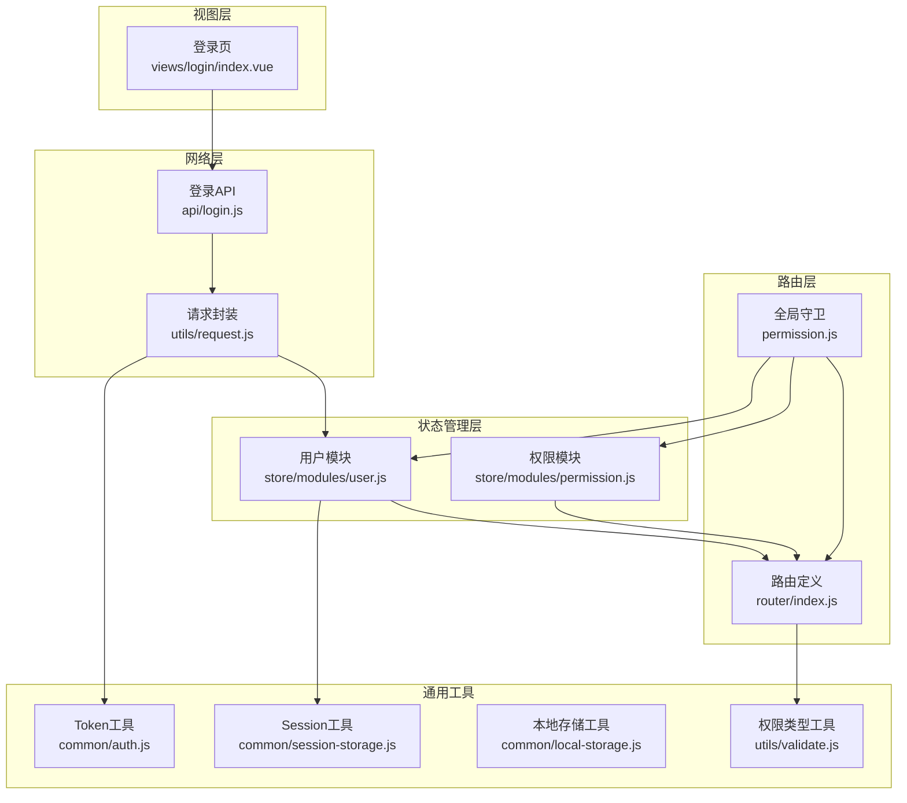
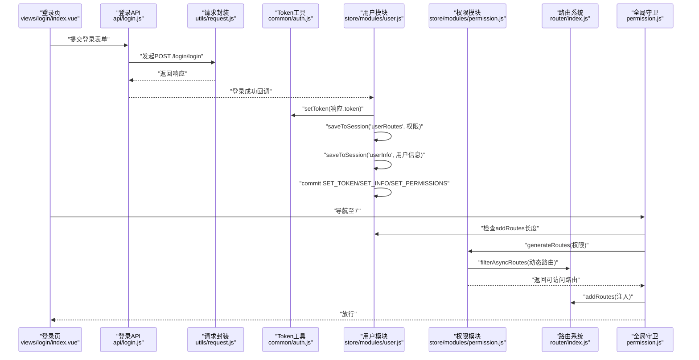
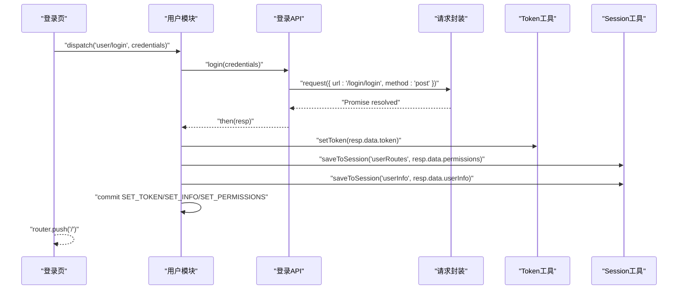
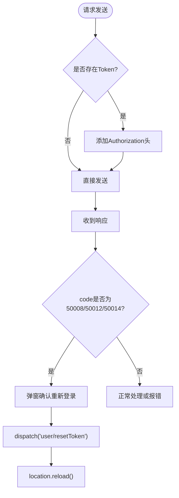
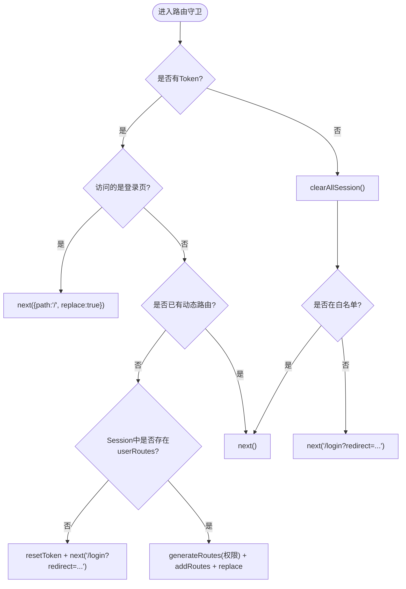
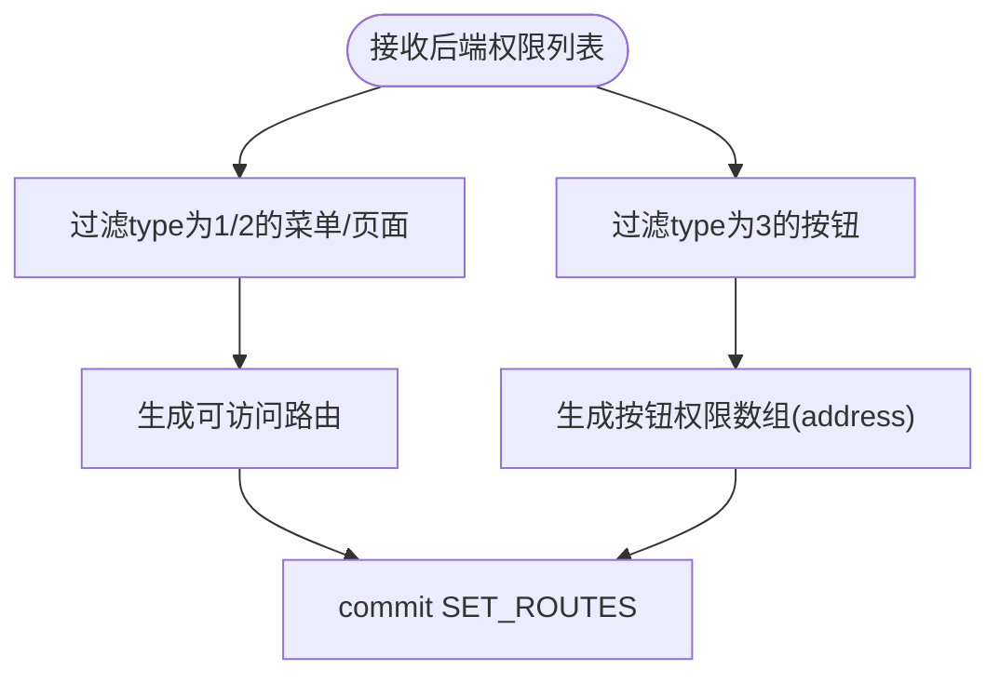
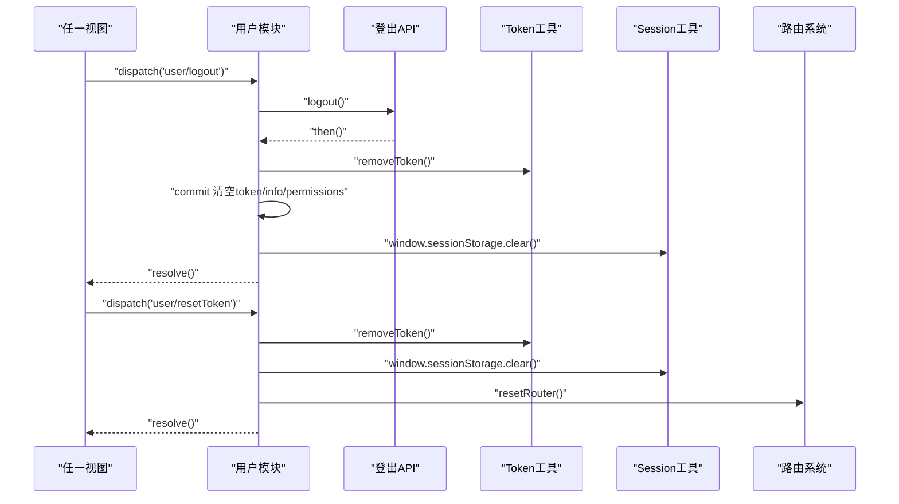
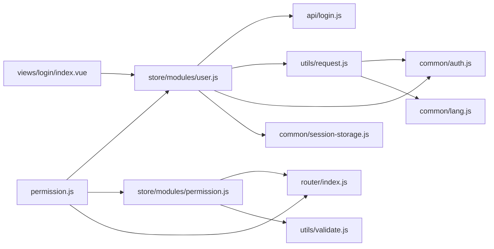

# 认证相关问题

<cite>
**本文引用的文件**
- [src/common/auth.js](file://src/common/auth.js)
- [src/api/login.js](file://src/api/login.js)
- [src/store/modules/user.js](file://src/store/modules/user.js)
- [src/store/modules/permission.js](file://src/store/modules/permission.js)
- [src/router/index.js](file://src/router/index.js)
- [src/permission.js](file://src/permission.js)
- [src/utils/request.js](file://src/utils/request.js)
- [src/views/login/index.vue](file://src/views/login/index.vue)
- [src/common/session-storage.js](file://src/common/session-storage.js)
- [src/utils/validate.js](file://src/utils/validate.js)
- [src/common/local-storage.js](file://src/common/local-storage.js)
- [src/mock/login.js](file://src/mock/login.js)
- [package.json](file://package.json)
</cite>

## 目录
1. [简介](#简介)
2. [项目结构](#项目结构)
3. [核心组件](#核心组件)
4. [架构总览](#架构总览)
5. [详细组件分析](#详细组件分析)
6. [依赖关系分析](#依赖关系分析)
7. [性能考虑](#性能考虑)
8. [故障排除指南](#故障排除指南)
9. [结论](#结论)
10. [附录](#附录)

## 简介
本文件面向Vue CMS项目的认证与权限体系，聚焦以下常见问题的诊断与修复：
- 登录失败：账号密码校验、接口调用、状态写入
- Token过期/非法/被顶下线：响应拦截器识别与自动登出
- 会话异常：Cookie与Session存储一致性、白名单与路由守卫
- 权限验证失败：动态路由生成、按钮权限映射
- 路由拦截异常：全局前置守卫逻辑、重定向策略
- 用户状态同步：Token、用户信息、权限路由的生命周期
- 白名单配置、路由守卫逻辑、状态重置机制的异常处理
- 错误码分析与修复建议

## 项目结构
认证与权限相关的关键模块分布如下：
- 通用工具：Token Cookie读写、Session本地临时存储、本地持久化存储
- API层：登录、登出、用户信息拉取
- 状态管理：用户模块（Token、用户信息、权限）、权限模块（动态路由生成）
- 路由：常量路由、动态路由、路由重置
- 全局守卫：路由拦截、白名单、动态路由注入
- 请求封装：统一请求头、响应拦截、错误码处理
- 视图：登录页（触发登录动作）

**图表来源**
- [src/views/login/index.vue:118-141](file://src/views/login/index.vue#L118-L141)
- [src/api/login.js:3-23](file://src/api/login.js#L3-L23)
- [src/utils/request.js:18-52](file://src/utils/request.js#L18-L52)
- [src/common/auth.js:5-15](file://src/common/auth.js#L5-L15)
- [src/store/modules/user.js:54-74](file://src/store/modules/user.js#L54-L74)
- [src/store/modules/permission.js:147-178](file://src/store/modules/permission.js#L147-L178)
- [src/router/index.js:43-111](file://src/router/index.js#L43-L111)
- [src/permission.js:23-91](file://src/permission.js#L23-L91)
- [src/common/session-storage.js:19-45](file://src/common/session-storage.js#L19-L45)
- [src/utils/validate.js:25-55](file://src/utils/validate.js#L25-L55)

**章节来源**
- [src/common/auth.js:1-18](file://src/common/auth.js#L1-L18)
- [src/api/login.js:1-24](file://src/api/login.js#L1-L24)
- [src/store/modules/user.js:1-154](file://src/store/modules/user.js#L1-L154)
- [src/store/modules/permission.js:1-187](file://src/store/modules/permission.js#L1-L187)
- [src/router/index.js:1-343](file://src/router/index.js#L1-L343)
- [src/permission.js:1-98](file://src/permission.js#L1-L98)
- [src/utils/request.js:1-139](file://src/utils/request.js#L1-L139)
- [src/views/login/index.vue:1-261](file://src/views/login/index.vue#L1-L261)
- [src/common/session-storage.js:1-48](file://src/common/session-storage.js#L1-L48)
- [src/utils/validate.js:1-56](file://src/utils/validate.js#L1-L56)
- [src/common/local-storage.js:1-41](file://src/common/local-storage.js#L1-L41)
- [src/mock/login.js:1-18](file://src/mock/login.js#L1-L18)

## 核心组件
- Token与Cookie管理：提供获取、设置、移除Token的统一入口，依赖环境变量作为Cookie Key。
- 登录API：封装登录、登出、用户信息获取的HTTP请求。
- 用户状态模块：负责登录成功后的Token写入、用户信息与权限路由的Session持久化、登出清理、Token重置。
- 权限模块：根据后端返回的权限列表过滤前端路由，生成可访问路由集合与按钮权限数组。
- 路由系统：定义常量路由、动态路由、末尾兜底路由，并提供路由重置能力。
- 全局守卫：基于Token与白名单控制路由访问，必要时从Session恢复动态路由。
- 请求封装：统一添加Authorization头、语言头；根据自定义code处理错误与自动登出。
- Session与本地存储：隔离临时与持久化数据，避免跨模块污染。

**章节来源**
- [src/common/auth.js:3-15](file://src/common/auth.js#L3-L15)
- [src/api/login.js:3-23](file://src/api/login.js#L3-L23)
- [src/store/modules/user.js:54-145](file://src/store/modules/user.js#L54-L145)
- [src/store/modules/permission.js:147-178](file://src/store/modules/permission.js#L147-L178)
- [src/router/index.js:43-111](file://src/router/index.js#L43-L111)
- [src/permission.js:23-91](file://src/permission.js#L23-L91)
- [src/utils/request.js:18-107](file://src/utils/request.js#L18-L107)
- [src/common/session-storage.js:19-45](file://src/common/session-storage.js#L19-L45)

## 架构总览
认证与权限的整体流程如下：

**图表来源**
- [src/views/login/index.vue:118-141](file://src/views/login/index.vue#L118-L141)
- [src/api/login.js:3-9](file://src/api/login.js#L3-L9)
- [src/utils/request.js:66-106](file://src/utils/request.js#L66-L106)
- [src/common/auth.js:9-11](file://src/common/auth.js#L9-L11)
- [src/store/modules/user.js:54-74](file://src/store/modules/user.js#L54-L74)
- [src/store/modules/permission.js:147-178](file://src/store/modules/permission.js#L147-L178)
- [src/router/index.js:322-340](file://src/router/index.js#L322-L340)
- [src/permission.js:40-74](file://src/permission.js#L40-L74)

## 详细组件分析

### 组件A：登录流程与状态写入
- 登录页触发登录动作，调用用户模块的登录Action。
- 登录Action调用登录API，成功后：
  - 写入Token到Cookie
  - 将用户权限与用户信息写入Session
  - 提交多个Mutation更新Token、账户、用户信息、权限
- 登录成功后跳转首页，后续由全局守卫决定是否需要再次注入动态路由。

**图表来源**
- [src/views/login/index.vue:118-141](file://src/views/login/index.vue#L118-L141)
- [src/store/modules/user.js:54-74](file://src/store/modules/user.js#L54-L74)
- [src/api/login.js:3-9](file://src/api/login.js#L3-L9)
- [src/utils/request.js:66-106](file://src/utils/request.js#L66-L106)
- [src/common/auth.js:9-11](file://src/common/auth.js#L9-L11)
- [src/common/session-storage.js:19-28](file://src/common/session-storage.js#L19-L28)

**章节来源**
- [src/views/login/index.vue:118-141](file://src/views/login/index.vue#L118-L141)
- [src/store/modules/user.js:54-74](file://src/store/modules/user.js#L54-L74)
- [src/api/login.js:3-9](file://src/api/login.js#L3-L9)

### 组件B：Token过期与自动登出
- 请求拦截器在存在Token时向请求头添加Authorization。
- 响应拦截器根据自定义code判断：
  - 50008/50012/50014：提示“已被登出”，弹窗引导重新登录，派发用户模块的resetToken，刷新页面。
- 该机制覆盖Token过期、非法、被顶下线等场景。

**图表来源**
- [src/utils/request.js:18-52](file://src/utils/request.js#L18-L52)
- [src/utils/request.js:84-95](file://src/utils/request.js#L84-L95)

**章节来源**
- [src/utils/request.js:18-52](file://src/utils/request.js#L18-L52)
- [src/utils/request.js:84-95](file://src/utils/request.js#L84-L95)

### 组件C：路由拦截与动态路由注入
- 白名单包括登录页与其他免登录页面。
- 有Token时：
  - 若访问登录页则重定向首页；
  - 若未注入动态路由，则尝试从Session恢复并注入，否则重置Token并跳转登录。
- 无Token时：
  - 清空Session临时数据；
  - 若不在白名单则重定向登录页并携带redirect参数。

**图表来源**
- [src/permission.js:23-91](file://src/permission.js#L23-L91)
- [src/store/modules/permission.js:147-178](file://src/store/modules/permission.js#L147-L178)
- [src/router/index.js:322-340](file://src/router/index.js#L322-L340)
- [src/common/session-storage.js:43-45](file://src/common/session-storage.js#L43-L45)

**章节来源**
- [src/permission.js:23-91](file://src/permission.js#L23-L91)
- [src/store/modules/permission.js:147-178](file://src/store/modules/permission.js#L147-L178)
- [src/router/index.js:322-340](file://src/router/index.js#L322-L340)
- [src/common/session-storage.js:43-45](file://src/common/session-storage.js#L43-L45)

### 组件D：权限过滤与按钮权限
- 权限模块根据type区分菜单/页面/按钮，分别生成可访问路由与按钮权限数组。
- 使用工具函数判断type是否为菜单或按钮，确保过滤逻辑正确。

**图表来源**
- [src/store/modules/permission.js:147-178](file://src/store/modules/permission.js#L147-L178)
- [src/utils/validate.js:43-55](file://src/utils/validate.js#L43-L55)

**章节来源**
- [src/store/modules/permission.js:147-178](file://src/store/modules/permission.js#L147-L178)
- [src/utils/validate.js:43-55](file://src/utils/validate.js#L43-L55)

### 组件E：用户状态同步与清理
- 登出时：
  - 调用登出API
  - 移除Token、清空用户信息与权限
  - 清空Session（一次性数据）
  - 保持LocalStorage不变
- Token重置：
  - 移除Token、清空Session、重置路由

**图表来源**
- [src/store/modules/user.js:91-110](file://src/store/modules/user.js#L91-L110)
- [src/store/modules/user.js:136-145](file://src/store/modules/user.js#L136-L145)
- [src/api/login.js:11-16](file://src/api/login.js#L11-L16)
- [src/common/auth.js:13-15](file://src/common/auth.js#L13-L15)
- [src/common/session-storage.js:43-45](file://src/common/session-storage.js#L43-L45)
- [src/router/index.js:332-340](file://src/router/index.js#L332-L340)

**章节来源**
- [src/store/modules/user.js:91-110](file://src/store/modules/user.js#L91-L110)
- [src/store/modules/user.js:136-145](file://src/store/modules/user.js#L136-L145)
- [src/api/login.js:11-16](file://src/api/login.js#L11-L16)

## 依赖关系分析
- 视图层依赖用户模块的Action触发登录。
- 用户模块依赖登录API与请求封装，同时依赖Token与Session工具。
- 权限模块依赖路由表与权限类型工具，最终影响路由系统。
- 全局守卫依赖用户模块与权限模块，控制路由注入时机。
- 请求封装依赖Token工具与语言工具，统一处理错误码。

**图表来源**
- [src/views/login/index.vue:118-141](file://src/views/login/index.vue#L118-L141)
- [src/store/modules/user.js:1-154](file://src/store/modules/user.js#L1-L154)
- [src/api/login.js:1-24](file://src/api/login.js#L1-L24)
- [src/utils/request.js:1-139](file://src/utils/request.js#L1-L139)
- [src/common/auth.js:1-18](file://src/common/auth.js#L1-L18)
- [src/common/session-storage.js:1-48](file://src/common/session-storage.js#L1-L48)
- [src/store/modules/permission.js:1-187](file://src/store/modules/permission.js#L1-L187)
- [src/router/index.js:1-343](file://src/router/index.js#L1-L343)
- [src/permission.js:1-98](file://src/permission.js#L1-L98)
- [src/utils/validate.js:1-56](file://src/utils/validate.js#L1-L56)

**章节来源**
- [src/views/login/index.vue:118-141](file://src/views/login/index.vue#L118-L141)
- [src/store/modules/user.js:1-154](file://src/store/modules/user.js#L1-L154)
- [src/api/login.js:1-24](file://src/api/login.js#L1-L24)
- [src/utils/request.js:1-139](file://src/utils/request.js#L1-L139)
- [src/common/auth.js:1-18](file://src/common/auth.js#L1-L18)
- [src/common/session-storage.js:1-48](file://src/common/session-storage.js#L1-L48)
- [src/store/modules/permission.js:1-187](file://src/store/modules/permission.js#L1-L187)
- [src/router/index.js:1-343](file://src/router/index.js#L1-L343)
- [src/permission.js:1-98](file://src/permission.js#L1-L98)
- [src/utils/validate.js:1-56](file://src/utils/validate.js#L1-L56)

## 性能考虑
- 请求拦截器对GET请求追加时间戳参数以规避缓存，确保数据新鲜度。
- 动态路由注入采用一次性addRoutes并replace当前路由，减少历史记录。
- Session临时存储采用单一命名空间隔离，避免频繁序列化开销。
- 建议：在高并发场景下，避免在路由守卫中执行耗时操作；将权限过滤与路由注入放在后台任务或异步Action中。

[本节为通用指导，无需列出章节来源]

## 故障排除指南

### 1. 登录失败
- 可能原因
  - 账号/密码校验失败（前端校验器）。
  - 登录接口返回非预期格式或错误码。
  - 登录成功后未正确写入Token或Session。
- 诊断步骤
  - 打开浏览器开发者工具，查看登录请求与响应。
  - 检查登录页的校验规则与调用链路。
  - 确认用户模块的登录Action是否执行成功并提交了Mutation。
  - 确认Cookie中是否写入Token，以及Session中是否写入userRoutes与userInfo。
- 修复建议
  - 修正前端校验器或调整校验规则。
  - 在登录API与请求封装处增加日志输出，定位响应结构问题。
  - 确保登录成功回调中顺序执行setToken、saveToSession、commit。

**章节来源**
- [src/views/login/index.vue:118-141](file://src/views/login/index.vue#L118-L141)
- [src/store/modules/user.js:54-74](file://src/store/modules/user.js#L54-L74)
- [src/api/login.js:3-9](file://src/api/login.js#L3-L9)
- [src/utils/request.js:66-106](file://src/utils/request.js#L66-L106)
- [src/common/auth.js:9-11](file://src/common/auth.js#L9-L11)
- [src/common/session-storage.js:19-28](file://src/common/session-storage.js#L19-L28)

### 2. Token过期/非法/被顶下线
- 可能原因
  - 后端返回特定错误码（50008/50012/50014）。
  - 请求拦截器未正确添加Authorization头。
- 诊断步骤
  - 查看响应拦截器对错误码的处理分支。
  - 确认请求头中Authorization是否包含Token。
  - 验证自动登出流程是否触发resetToken并刷新页面。
- 修复建议
  - 确保请求拦截器正确读取Token并设置Authorization。
  - 在后端统一错误码规范，前端按约定处理。

**章节来源**
- [src/utils/request.js:18-52](file://src/utils/request.js#L18-L52)
- [src/utils/request.js:84-95](file://src/utils/request.js#L84-L95)

### 3. 会话异常（Token存在但无法访问受控页面）
- 可能原因
  - Session中缺少userRoutes或userInfo。
  - 动态路由未注入或注入失败。
- 诊断步骤
  - 在路由守卫中检查addRoutes长度与Session中的userRoutes。
  - 若Session缺失，触发resetToken并重定向登录。
  - 检查权限模块的generateRoutes与filterAsyncRoutes逻辑。
- 修复建议
  - 登录成功后确保saveToSession写入userRoutes与userInfo。
  - 在路由守卫中捕获异常并回退到重置Token流程。

**章节来源**
- [src/permission.js:40-74](file://src/permission.js#L40-L74)
- [src/store/modules/permission.js:147-178](file://src/store/modules/permission.js#L147-L178)
- [src/common/session-storage.js:30-41](file://src/common/session-storage.js#L30-L41)

### 4. 权限验证失败（页面/按钮不可见）
- 可能原因
  - 后端返回的权限type与前端期望不符。
  - 路由过滤逻辑未正确匹配address与path。
- 诊断步骤
  - 检查后端返回的权限列表与type字段。
  - 确认权限模块的菜单/按钮过滤逻辑。
  - 核对filterAsyncRoutes的匹配条件。
- 修复建议
  - 统一后端权限type定义与前端判断逻辑。
  - 确保address与path一致，避免路径差异导致匹配失败。

**章节来源**
- [src/store/modules/permission.js:22-54](file://src/store/modules/permission.js#L22-L54)
- [src/store/modules/permission.js:147-178](file://src/store/modules/permission.js#L147-L178)
- [src/utils/validate.js:43-55](file://src/utils/validate.js#L43-L55)

### 5. 路由拦截异常（循环重定向/白名单失效）
- 可能原因
  - 白名单配置遗漏或路径不一致。
  - 路由守卫逻辑分支错误。
- 诊断步骤
  - 检查白名单数组与实际路径是否一致。
  - 在路由守卫中打印to/from路径，确认分支走向。
  - 验证resetRouter后是否重新注册守卫。
- 修复建议
  - 明确白名单项，确保大小写与路径完全一致。
  - 在resetRouter后重新挂载守卫逻辑。

**章节来源**
- [src/permission.js:20-21](file://src/permission.js#L20-L21)
- [src/permission.js:33-74](file://src/permission.js#L33-L74)
- [src/router/index.js:332-340](file://src/router/index.js#L332-L340)

### 6. 用户状态不同步（Token已过期但UI仍显示登录态）
- 可能原因
  - 前端未正确移除Token或未清空用户信息。
  - Session残留导致守卫误判有权限。
- 诊断步骤
  - 检查登出与resetToken的调用链。
  - 确认Session是否被清空，LocalStorage是否保留。
- 修复建议
  - 登出与resetToken均需清空Session并重置路由。
  - 在页面初始化时优先检查Token与Session一致性。

**章节来源**
- [src/store/modules/user.js:91-110](file://src/store/modules/user.js#L91-L110)
- [src/store/modules/user.js:136-145](file://src/store/modules/user.js#L136-L145)
- [src/common/session-storage.js:43-45](file://src/common/session-storage.js#L43-L45)

### 7. 错误码分析与修复
- 常见错误码
  - 50008：非法Token
  - 50012：其他客户端已登录
  - 50014：Token已过期
- 修复要点
  - 响应拦截器统一处理上述错误码，触发自动登出。
  - 登录页与全局守卫配合，确保用户回到登录流程。

**章节来源**
- [src/utils/request.js:84-95](file://src/utils/request.js#L84-L95)

## 结论
本项目的认证与权限体系通过“登录API + 请求封装 + 用户/权限状态 + 全局守卫 + 路由系统”的协同工作，实现了较为完善的登录态管理与权限控制。针对常见问题，建议重点关注：
- 登录流程的完整性与顺序（Token写入、Session持久化、状态提交）
- 响应拦截器对错误码的统一处理
- 路由守卫对Token与Session的严格校验
- 权限过滤与路由匹配的准确性

[本节为总结，无需列出章节来源]

## 附录

### A. 关键文件与职责速览
- [src/common/auth.js:1-18](file://src/common/auth.js#L1-L18)：Token Cookie读写
- [src/api/login.js:1-24](file://src/api/login.js#L1-L24)：登录/登出/用户信息API
- [src/store/modules/user.js:1-154](file://src/store/modules/user.js#L1-L154)：登录/登出/重置Token与状态
- [src/store/modules/permission.js:1-187](file://src/store/modules/permission.js#L1-L187)：动态路由与按钮权限
- [src/router/index.js:1-343](file://src/router/index.js#L1-L343)：常量/动态/兜底路由与重置
- [src/permission.js:1-98](file://src/permission.js#L1-L98)：全局守卫与白名单
- [src/utils/request.js:1-139](file://src/utils/request.js#L1-L139)：请求/响应拦截与错误处理
- [src/views/login/index.vue:1-261](file://src/views/login/index.vue#L1-L261)：登录视图与触发逻辑
- [src/common/session-storage.js:1-48](file://src/common/session-storage.js#L1-L48)：Session临时存储
- [src/utils/validate.js:1-56](file://src/utils/validate.js#L1-L56)：权限类型判断
- [src/common/local-storage.js:1-41](file://src/common/local-storage.js#L1-L41)：LocalStorage持久化
- [src/mock/login.js:1-18](file://src/mock/login.js#L1-L18)：Mock登录/登出/用户信息
- [package.json:33-64](file://package.json#L33-L64)：依赖清单（含js-cookie、axios、element-ui、vue等）

**章节来源**
- [src/common/auth.js:1-18](file://src/common/auth.js#L1-L18)
- [src/api/login.js:1-24](file://src/api/login.js#L1-L24)
- [src/store/modules/user.js:1-154](file://src/store/modules/user.js#L1-L154)
- [src/store/modules/permission.js:1-187](file://src/store/modules/permission.js#L1-L187)
- [src/router/index.js:1-343](file://src/router/index.js#L1-L343)
- [src/permission.js:1-98](file://src/permission.js#L1-L98)
- [src/utils/request.js:1-139](file://src/utils/request.js#L1-L139)
- [src/views/login/index.vue:1-261](file://src/views/login/index.vue#L1-L261)
- [src/common/session-storage.js:1-48](file://src/common/session-storage.js#L1-L48)
- [src/utils/validate.js:1-56](file://src/utils/validate.js#L1-L56)
- [src/common/local-storage.js:1-41](file://src/common/local-storage.js#L1-L41)
- [src/mock/login.js:1-18](file://src/mock/login.js#L1-L18)
- [package.json:33-64](file://package.json#L33-L64)