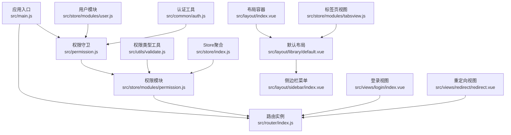
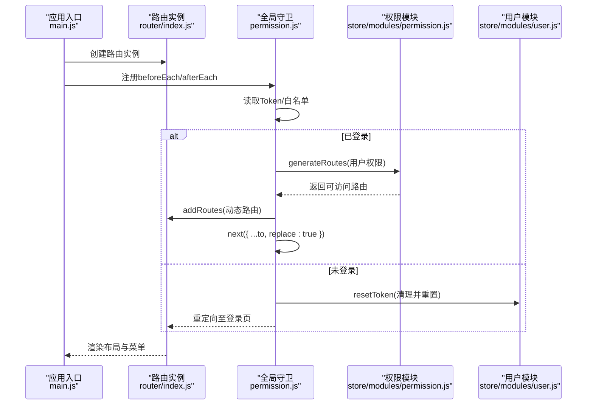
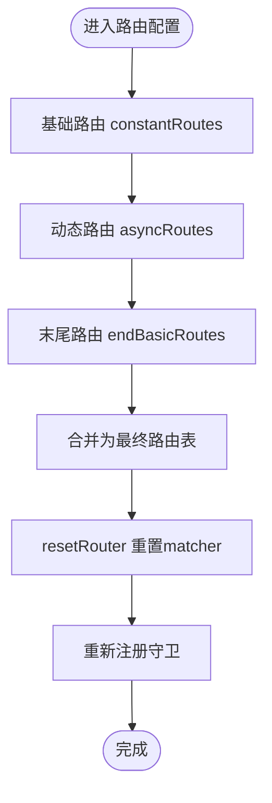
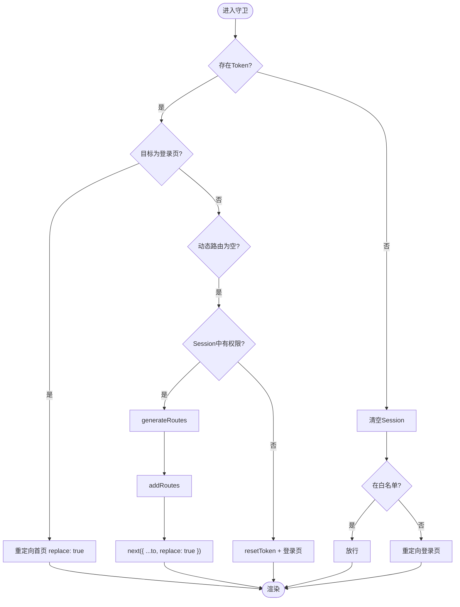
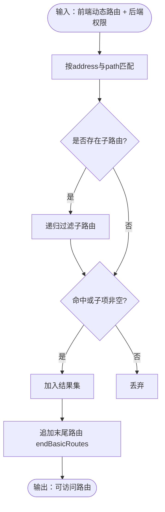
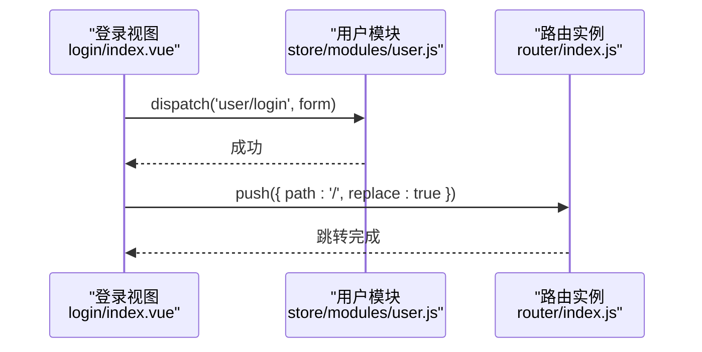
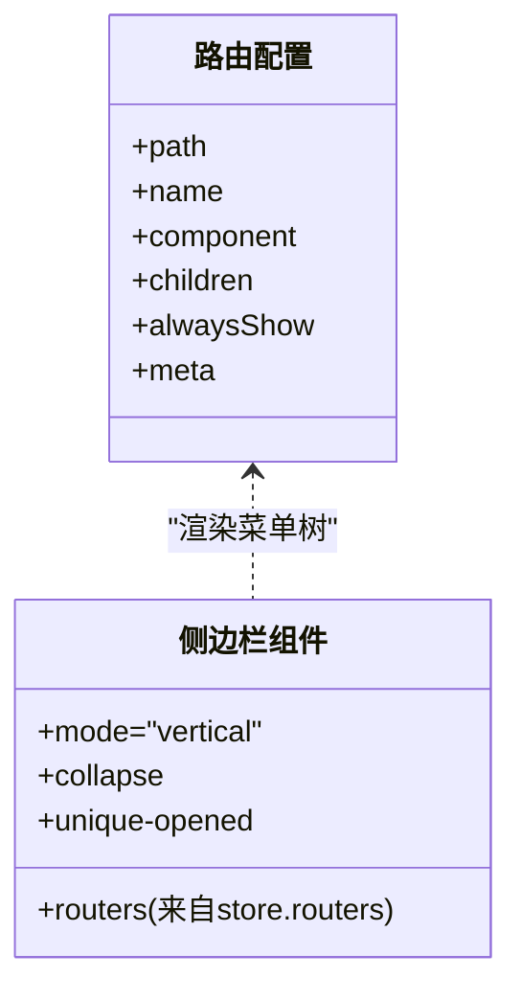
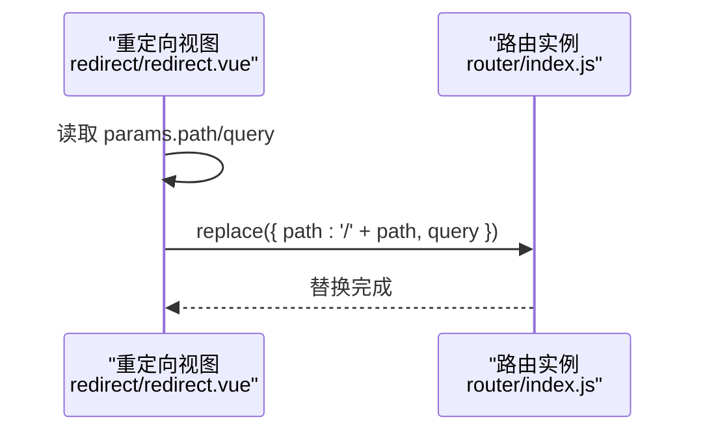
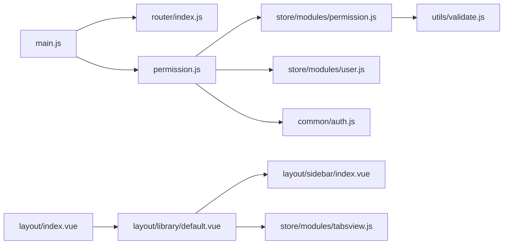

# 路由导航问题

<cite>
**本文引用的文件**
- [src/router/index.js](file://src/router/index.js)
- [src/permission.js](file://src/permission.js)
- [src/store/modules/permission.js](file://src/store/modules/permission.js)
- [src/store/modules/user.js](file://src/store/modules/user.js)
- [src/common/auth.js](file://src/common/auth.js)
- [src/utils/validate.js](file://src/utils/validate.js)
- [src/main.js](file://src/main.js)
- [src/views/login/index.vue](file://src/views/login/index.vue)
- [src/layout/index.vue](file://src/layout/index.vue)
- [src/layout/library/default.vue](file://src/layout/library/default.vue)
- [src/layout/sidebar/index.vue](file://src/layout/sidebar/index.vue)
- [src/store/index.js](file://src/store/index.js)
- [src/views/redirect/redirect.vue](file://src/views/redirect/redirect.vue)
- [src/store/modules/tabsview.js](file://src/store/modules/tabsview.js)
</cite>

## 目录
1. [简介](#简介)
2. [项目结构](#项目结构)
3. [核心组件](#核心组件)
4. [架构总览](#架构总览)
5. [详细组件分析](#详细组件分析)
6. [依赖关系分析](#依赖关系分析)
7. [性能考虑](#性能考虑)
8. [故障排除指南](#故障排除指南)
9. [结论](#结论)
10. [附录](#附录)

## 简介
本指南聚焦于Vue CMS项目的路由导航问题排查，覆盖以下典型场景：
- 路由跳转失败、动态路由加载异常、菜单生成错误
- 路由守卫执行异常、路由参数传递错误、嵌套路由配置问题
- 路由表生成、权限匹配、导航拦截等核心功能调试
- 路由缓存、历史记录、替换导航等机制异常处理
- 提供可落地的路由配置检查清单与修复方案

## 项目结构
围绕路由导航的关键文件与职责如下：
- 路由定义与重置：src/router/index.js
- 全局权限守卫：src/permission.js
- 权限模块（动态路由生成）：src/store/modules/permission.js
- 用户模块（登录、登出、重置）：src/store/modules/user.js
- 认证工具（Cookie Token）：src/common/auth.js
- 权限类型校验工具：src/utils/validate.js
- 应用入口与挂载：src/main.js
- 登录视图（触发跳转）：src/views/login/index.vue
- 布局与侧边栏（菜单渲染）：src/layout/index.vue、src/layout/library/default.vue、src/layout/sidebar/index.vue
- Store聚合与Getter：src/store/index.js
- 重定向视图：src/views/redirect/redirect.vue
- 标签页视图（历史记录）：src/store/modules/tabsview.js

**图表来源**
- [src/main.js:1-53](file://src/main.js#L1-L53)
- [src/router/index.js:1-343](file://src/router/index.js#L1-L343)
- [src/permission.js:1-98](file://src/permission.js#L1-L98)
- [src/store/modules/permission.js:1-187](file://src/store/modules/permission.js#L1-L187)
- [src/store/modules/user.js:1-154](file://src/store/modules/user.js#L1-L154)
- [src/common/auth.js:1-18](file://src/common/auth.js#L1-L18)
- [src/utils/validate.js:1-56](file://src/utils/validate.js#L1-L56)
- [src/views/login/index.vue:1-261](file://src/views/login/index.vue#L1-L261)
- [src/layout/index.vue:1-32](file://src/layout/index.vue#L1-L32)
- [src/layout/library/default.vue:1-87](file://src/layout/library/default.vue#L1-L87)
- [src/layout/sidebar/index.vue:1-142](file://src/layout/sidebar/index.vue#L1-L142)
- [src/views/redirect/redirect.vue:1-13](file://src/views/redirect/redirect.vue#L1-L13)
- [src/store/index.js:1-74](file://src/store/index.js#L1-L74)
- [src/store/modules/tabsview.js:1-49](file://src/store/modules/tabsview.js#L1-L49)

**章节来源**
- [src/main.js:1-53](file://src/main.js#L1-L53)
- [src/router/index.js:1-343](file://src/router/index.js#L1-L343)
- [src/permission.js:1-98](file://src/permission.js#L1-L98)
- [src/store/modules/permission.js:1-187](file://src/store/modules/permission.js#L1-L187)
- [src/store/modules/user.js:1-154](file://src/store/modules/user.js#L1-L154)
- [src/common/auth.js:1-18](file://src/common/auth.js#L1-L18)
- [src/utils/validate.js:1-56](file://src/utils/validate.js#L1-L56)
- [src/views/login/index.vue:1-261](file://src/views/login/index.vue#L1-L261)
- [src/layout/index.vue:1-32](file://src/layout/index.vue#L1-L32)
- [src/layout/library/default.vue:1-87](file://src/layout/library/default.vue#L1-L87)
- [src/layout/sidebar/index.vue:1-142](file://src/layout/sidebar/index.vue#L1-L142)
- [src/views/redirect/redirect.vue:1-13](file://src/views/redirect/redirect.vue#L1-L13)
- [src/store/index.js:1-74](file://src/store/index.js#L1-L74)
- [src/store/modules/tabsview.js:1-49](file://src/store/modules/tabsview.js#L1-L49)

## 核心组件
- 路由表与重置
  - 基础路由、动态路由、末尾路由三段式结构，支持运行时重置与动态添加
  - 通过重置matcher与重新注册守卫确保路由状态一致性
- 全局守卫
  - 基于Token判定登录态，白名单放行，动态路由缺失时从Session恢复或强制登出
  - 使用进度条与页面标题设置增强用户体验
- 权限模块
  - 前端动态路由与后端返回权限地址进行精确匹配，生成最终路由并追加末尾路由
  - 按类型区分菜单/页面/按钮权限，分别写入Store
- 用户模块
  - 登录成功后持久化权限与用户信息，登出时清理Token与Session并重置路由
- 认证与工具
  - Cookie中读取Token，权限类型判断工具，登录视图触发跳转

**章节来源**
- [src/router/index.js:43-343](file://src/router/index.js#L43-L343)
- [src/permission.js:22-98](file://src/permission.js#L22-L98)
- [src/store/modules/permission.js:14-178](file://src/store/modules/permission.js#L14-L178)
- [src/store/modules/user.js:52-145](file://src/store/modules/user.js#L52-L145)
- [src/common/auth.js:5-15](file://src/common/auth.js#L5-L15)
- [src/utils/validate.js:25-55](file://src/utils/validate.js#L25-L55)

## 架构总览
路由导航整体流程：应用启动 → 注册全局守卫 → 判断Token → 加载动态路由 → 添加路由 → 替换导航 → 渲染布局与菜单。

**图表来源**
- [src/main.js:25](file://src/main.js#L25)
- [src/router/index.js:322-343](file://src/router/index.js#L322-L343)
- [src/permission.js:23-91](file://src/permission.js#L23-L91)
- [src/store/modules/permission.js:147-178](file://src/store/modules/permission.js#L147-L178)
- [src/store/modules/user.js:136-145](file://src/store/modules/user.js#L136-L145)

## 详细组件分析

### 路由表与动态加载
- 结构要点
  - constantRoutes：基础路由（无需权限）
  - asyncRoutes：动态路由（按权限下发）
  - endBasicRoutes：末尾路由（404、无权限、通配符）
  - resetRouter：重建matcher并重新注册守卫
- 常见问题定位
  - 动态路由未生效：确认addRoutes调用与replace: true
  - 末尾路由不匹配：检查通配符与顺序
  - 嵌套路由不显示：检查alwaysShow与children长度

**图表来源**
- [src/router/index.js:43-111](file://src/router/index.js#L43-L111)
- [src/router/index.js:118-320](file://src/router/index.js#L118-L320)
- [src/router/index.js:322-343](file://src/router/index.js#L322-L343)

**章节来源**
- [src/router/index.js:43-343](file://src/router/index.js#L43-L343)

### 全局守卫与导航拦截
- 流程要点
  - 设置页面标题与进度条
  - 有Token：登录态校验、动态路由缺失恢复、异常捕获与强制登出
  - 无Token：清空Session、白名单放行、其余重定向登录
- 常见问题定位
  - 守卫未执行：确认main.js已引入permission
  - 重复历史记录：确保replace: true
  - 白名单误判：核对白名单列表与路径

**图表来源**
- [src/permission.js:23-91](file://src/permission.js#L23-L91)

**章节来源**
- [src/permission.js:1-98](file://src/permission.js#L1-L98)

### 权限匹配与路由生成
- 匹配策略
  - 仅保留后端返回address与前端path完全相等的路由
  - 递归过滤子路由，保留命中或存在子项的父级
  - 过滤后追加末尾路由
- 常见问题定位
  - 地址不一致：核对后端address与前端path
  - 嵌套层级：确认basePath拼接规则与children结构
  - 类型不符：确认type=1/2为菜单/页面，type=3为按钮

**图表来源**
- [src/store/modules/permission.js:41-54](file://src/store/modules/permission.js#L41-L54)
- [src/store/modules/permission.js:147-178](file://src/store/modules/permission.js#L147-L178)
- [src/utils/validate.js:25-55](file://src/utils/validate.js#L25-L55)

**章节来源**
- [src/store/modules/permission.js:14-178](file://src/store/modules/permission.js#L14-L178)
- [src/utils/validate.js:1-56](file://src/utils/validate.js#L1-L56)

### 登录跳转与替换导航
- 登录成功后使用replace导航避免历史栈污染
- 登录视图通过Vuex action触发登录流程，成功后跳转首页

**图表来源**
- [src/views/login/index.vue:118-141](file://src/views/login/index.vue#L118-L141)
- [src/store/modules/user.js:54-74](file://src/store/modules/user.js#L54-L74)
- [src/router/index.js:322-343](file://src/router/index.js#L322-L343)

**章节来源**
- [src/views/login/index.vue:118-141](file://src/views/login/index.vue#L118-L141)
- [src/store/modules/user.js:54-74](file://src/store/modules/user.js#L54-L74)

### 嵌套路由与菜单生成
- 嵌套路由通过children逐层渲染，alwaysShow控制是否始终显示根菜单
- 侧边栏根据store.routers渲染菜单树，支持折叠与唯一展开

**图表来源**
- [src/router/index.js:118-320](file://src/router/index.js#L118-L320)
- [src/layout/sidebar/index.vue:32-59](file://src/layout/sidebar/index.vue#L32-L59)
- [src/store/index.js:56-61](file://src/store/index.js#L56-L61)

**章节来源**
- [src/router/index.js:118-320](file://src/router/index.js#L118-L320)
- [src/layout/sidebar/index.vue:1-142](file://src/layout/sidebar/index.vue#L1-L142)
- [src/store/index.js:1-74](file://src/store/index.js#L1-L74)

### 重定向与历史记录
- 重定向视图通过params.path与query实现安全替换
- 标签页模块维护visitedTabsView，避免重复记录

**图表来源**
- [src/views/redirect/redirect.vue:3-6](file://src/views/redirect/redirect.vue#L3-L6)

**章节来源**
- [src/views/redirect/redirect.vue:1-13](file://src/views/redirect/redirect.vue#L1-L13)
- [src/store/modules/tabsview.js:9-26](file://src/store/modules/tabsview.js#L9-L26)

## 依赖关系分析
- 组件耦合
  - main.js依赖router与permission，permission依赖store与common/auth
  - permission依赖store/modules/permission与store/modules/user
  - layout与sidebar依赖store.routers进行菜单渲染
- 外部依赖
  - Element UI菜单组件、NProgress进度条、js-cookie

**图表来源**
- [src/main.js:1-53](file://src/main.js#L1-L53)
- [src/router/index.js:1-343](file://src/router/index.js#L1-L343)
- [src/permission.js:1-98](file://src/permission.js#L1-L98)
- [src/store/modules/permission.js:1-187](file://src/store/modules/permission.js#L1-L187)
- [src/store/modules/user.js:1-154](file://src/store/modules/user.js#L1-L154)
- [src/common/auth.js:1-18](file://src/common/auth.js#L1-L18)
- [src/utils/validate.js:1-56](file://src/utils/validate.js#L1-L56)
- [src/layout/index.vue:1-32](file://src/layout/index.vue#L1-L32)
- [src/layout/library/default.vue:1-87](file://src/layout/library/default.vue#L1-L87)
- [src/layout/sidebar/index.vue:1-142](file://src/layout/sidebar/index.vue#L1-L142)
- [src/store/modules/tabsview.js:1-49](file://src/store/modules/tabsview.js#L1-L49)

**章节来源**
- [src/main.js:1-53](file://src/main.js#L1-L53)
- [src/store/index.js:1-74](file://src/store/index.js#L1-L74)

## 性能考虑
- 动态路由只在首次缺失时加载，避免重复请求
- 使用replace导航减少历史记录，降低回退成本
- 进度条与页面标题设置在守卫阶段集中处理，避免重复计算
- 建议对大型菜单进行懒加载与分组，减少首屏渲染压力

## 故障排除指南

### 路由跳转失败
- 症状
  - 点击菜单无反应或跳转到空白页
- 排查步骤
  - 确认路由已被addRoutes注入且顺序正确
  - 检查目标路由是否存在component或懒加载是否成功
  - 验证meta.title是否正确，影响页面标题设置
- 修复建议
  - 在generateRoutes后确认store.permission.addRoutes非空
  - 使用replace导航避免历史栈累积
  - 若使用iframe/isIframe，确保isLink与路径有效

**章节来源**
- [src/permission.js:54-63](file://src/permission.js#L54-L63)
- [src/store/modules/permission.js:170-177](file://src/store/modules/permission.js#L170-L177)

### 动态路由加载异常
- 症状
  - 登录后仍显示无权限或部分菜单缺失
- 排查步骤
  - 检查Session中userRoutes是否存在且address字段完整
  - 核对后端返回type=1/2与前端path是否一一对应
  - 确认filterAsyncRoutes递归过滤逻辑未误删
- 修复建议
  - 在generateRoutes中打印前后路由对比，定位差异
  - 确保endBasicRoutes追加在过滤之后
  - 异常时调用resetToken并重新登录

**章节来源**
- [src/permission.js:40-70](file://src/permission.js#L40-L70)
- [src/store/modules/permission.js:147-178](file://src/store/modules/permission.js#L147-L178)

### 菜单生成错误
- 症状
  - 侧边栏菜单不显示或显示异常
- 排查步骤
  - 检查store.routers是否包含目标路由
  - 确认alwaysShow与children长度决定是否显示根菜单
  - 核对Element UI菜单组件的props与事件绑定
- 修复建议
  - 为根菜单设置alwaysShow以强制显示
  - 确保children数组非空且每项有唯一path与name

**章节来源**
- [src/layout/sidebar/index.vue:32-59](file://src/layout/sidebar/index.vue#L32-L59)
- [src/router/index.js:138-140](file://src/router/index.js#L138-L140)

### 路由守卫执行异常
- 症状
  - 页面无法进入或反复重定向
- 排查步骤
  - 确认main.js已引入permission
  - 检查白名单路径与to.path是否匹配
  - 观察NProgress与页面标题变化
- 修复建议
  - 在resetRouter后重新注册守卫
  - 对异常分支增加日志与错误提示

**章节来源**
- [src/main.js:25](file://src/main.js#L25)
- [src/permission.js:23-91](file://src/permission.js#L23-L91)
- [src/router/index.js:332-340](file://src/router/index.js#L332-L340)

### 路由参数传递错误
- 症状
  - 参数丢失或类型不匹配
- 排查步骤
  - 检查路由定义中的path与params/query
  - 确认重定向视图redirect.vue的参数拼接
- 修复建议
  - 使用$router.replace保持当前历史记录
  - 对必传参数进行校验并在守卫中处理

**章节来源**
- [src/views/redirect/redirect.vue:3-6](file://src/views/redirect/redirect.vue#L3-L6)

### 嵌套路由配置问题
- 症状
  - 子菜单不显示或展开异常
- 排查步骤
  - 确认父级alwaysShow与children结构
  - 检查子路由path是否以父级path开头
- 修复建议
  - 为多级菜单设置清晰的父子关系
  - 使用meta.icon与title提升可读性

**章节来源**
- [src/router/index.js:227-268](file://src/router/index.js#L227-L268)

### 路由缓存、历史记录与替换导航
- 症状
  - 返回按钮无效或历史记录过多
- 排查步骤
  - 登录成功后使用replace导航
  - 重定向使用replace而非push
- 修复建议
  - 在守卫中对动态路由跳转使用replace
  - 标签页模块避免重复记录同一path

**章节来源**
- [src/views/login/index.vue:135-140](file://src/views/login/index.vue#L135-L140)
- [src/permission.js:63](file://src/permission.js#L63)
- [src/store/modules/tabsview.js:9-18](file://src/store/modules/tabsview.js#L9-L18)

### 路由配置检查清单
- 路由表
  - 基础路由、动态路由、末尾路由是否齐全
  - 动态路由是否在首次缺失时加载
  - resetRouter是否正确重置matcher并重新注册守卫
- 权限匹配
  - 后端address与前端path是否一致
  - type=1/2/3是否正确分类
  - 递归过滤是否保留命中或存在子项的父级
- 导航行为
  - 登录成功后是否使用replace导航
  - 重定向是否使用replace
  - 白名单路径是否覆盖所有免登录页面
- 菜单渲染
  - store.routers是否包含目标路由
  - alwaysShow与children长度是否合理
  - Element UI菜单组件是否正确绑定

**章节来源**
- [src/router/index.js:43-111](file://src/router/index.js#L43-L111)
- [src/store/modules/permission.js:147-178](file://src/store/modules/permission.js#L147-L178)
- [src/permission.js:23-91](file://src/permission.js#L23-L91)
- [src/layout/sidebar/index.vue:32-59](file://src/layout/sidebar/index.vue#L32-L59)

## 结论
本指南提供了从路由表、权限匹配到守卫执行与菜单渲染的全链路排查思路。遵循“先守卫后路由、先权限后渲染”的原则，结合替换导航与历史记录管理，可显著降低路由导航问题的发生率。遇到复杂场景时，建议通过日志与断点定位具体环节，并对照检查清单逐项核验。

## 附录
- 相关文件路径与职责已在“项目结构”与“核心组件”中给出，便于快速定位问题所在模块。