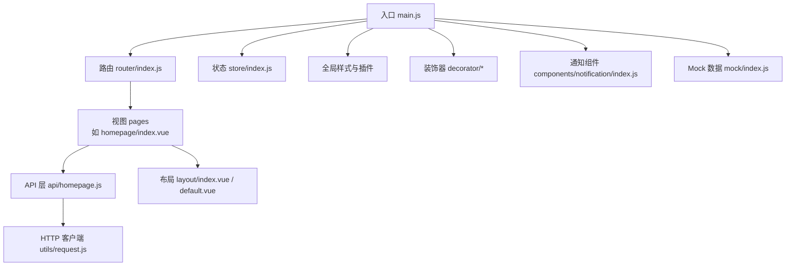
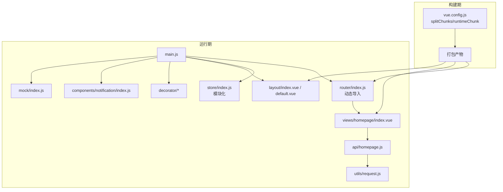
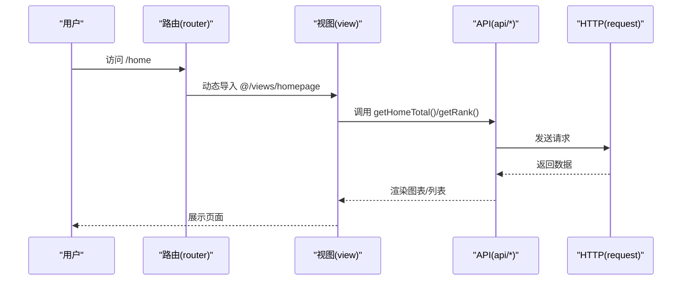
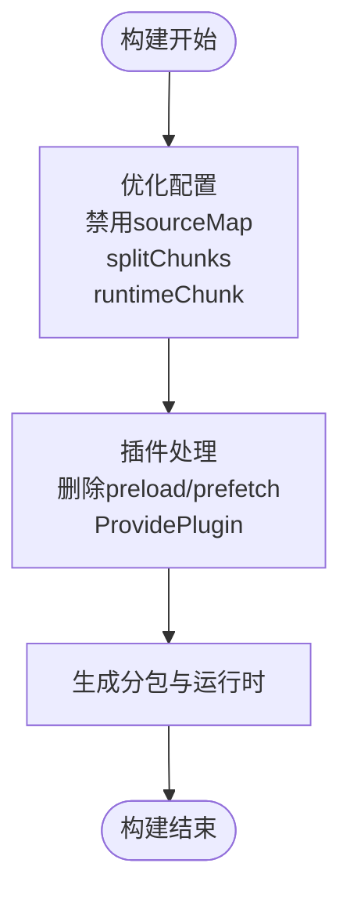
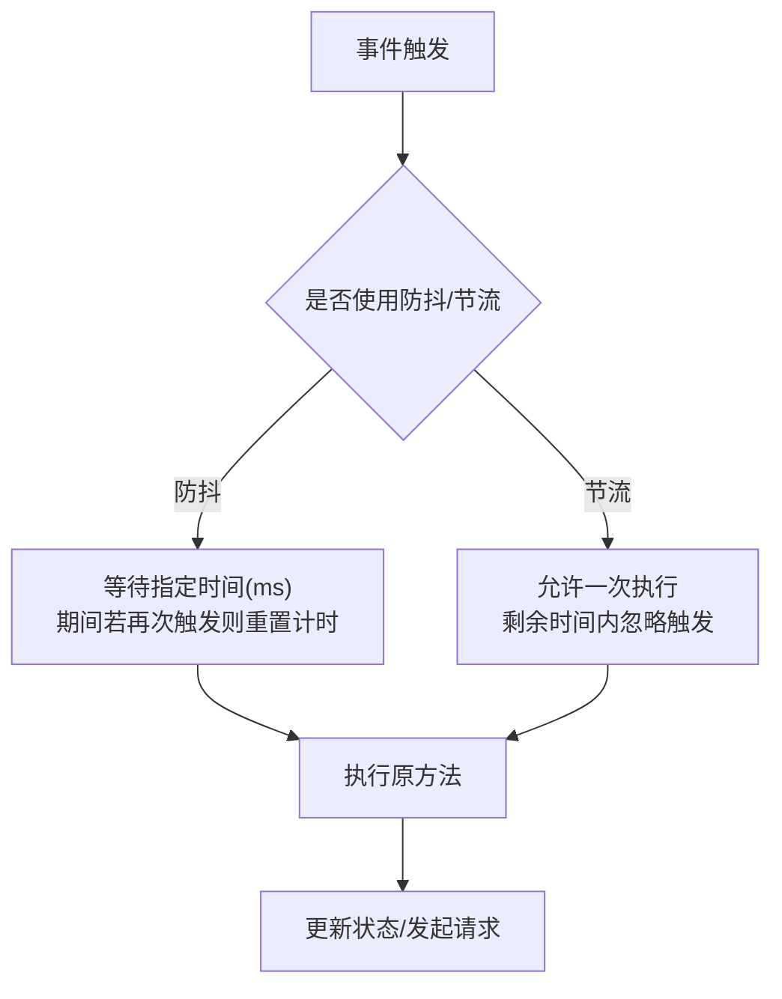
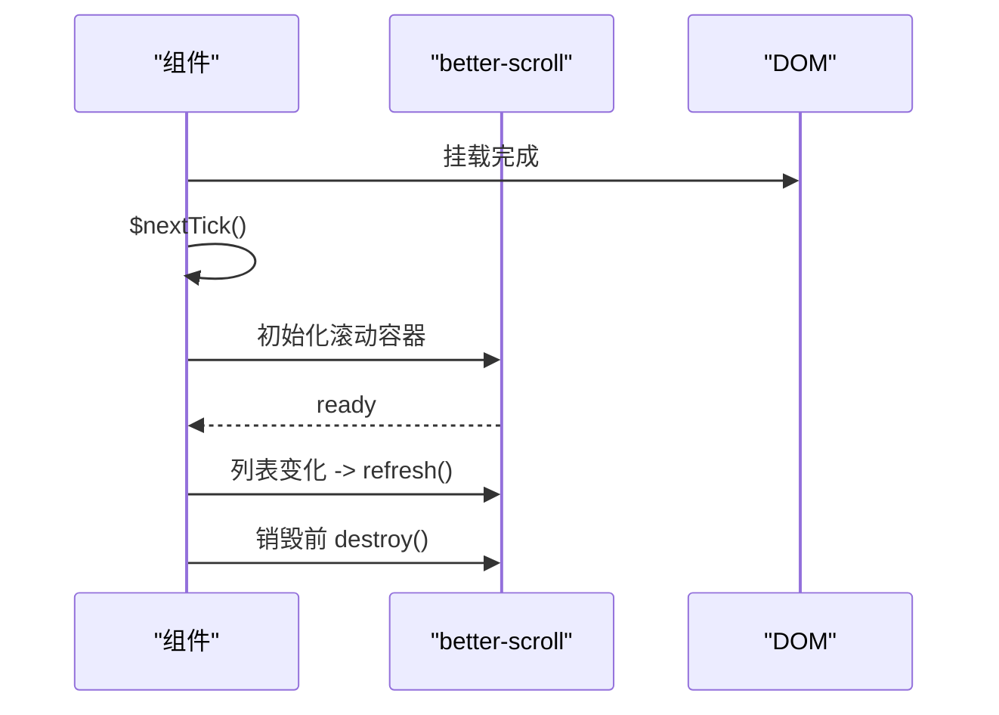
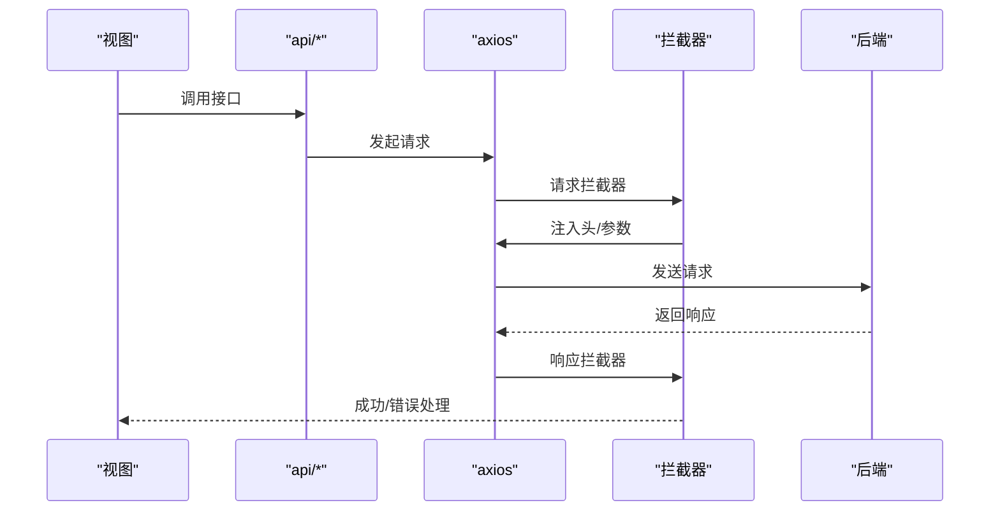
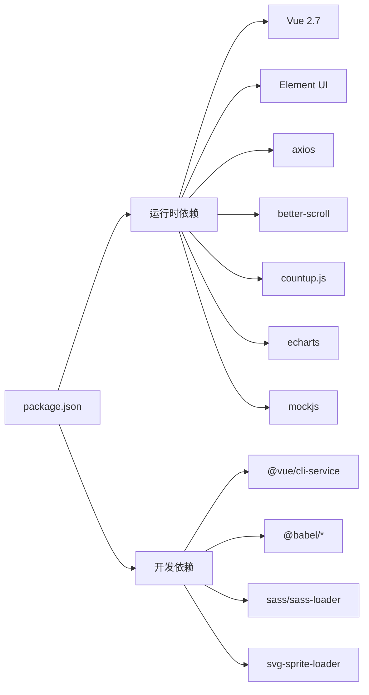

# 性能架构

<cite>
**本文引用的文件**
- [package.json](file://package.json)
- [vue.config.js](file://vue.config.js)
- [babel.config.js](file://babel.config.js)
- [src/main.js](file://src/main.js)
- [src/router/index.js](file://src/router/index.js)
- [src/store/index.js](file://src/store/index.js)
- [src/utils/request.js](file://src/utils/request.js)
- [src/api/homepage.js](file://src/api/homepage.js)
- [src/views/homepage/index.vue](file://src/views/homepage/index.vue)
- [src/layout/index.vue](file://src/layout/index.vue)
- [src/layout/library/default.vue](file://src/layout/library/default.vue)
- [src/decorator/debounce.js](file://src/decorator/debounce.js)
- [src/decorator/throttle.js](file://src/decorator/throttle.js)
- [src/decorator/confirm.js](file://src/decorator/confirm.js)
- [src/components/notification/index.js](file://src/components/notification/index.js)
- [src/mock/index.js](file://src/mock/index.js)
</cite>

## 目录
1. [引言](#引言)
2. [项目结构](#项目结构)
3. [核心组件](#核心组件)
4. [架构总览](#架构总览)
5. [详细组件分析](#详细组件分析)
6. [依赖分析](#依赖分析)
7. [性能考量与优化策略](#性能考量与优化策略)
8. [性能监控与对比](#性能监控与对比)
9. [移动端适配与响应式设计](#移动端适配与响应式设计)
10. [可维护性与性能的平衡](#可维护性与性能的平衡)
11. [结论](#结论)

## 引言
本性能架构文档聚焦于 Vue CMS 项目的性能优化策略与架构设计，覆盖构建期优化（Webpack、Tree Shaking、Bundle 分析）、运行期优化（代码分割、懒加载、资源压缩、防抖/节流装饰器）、组件级优化（keep-alive 缓存、虚拟滚动、图片懒加载）、以及移动端与响应式设计的性能权衡。文档同时提供可视化图示与实践建议，帮助在保证可维护性的前提下持续提升用户体验。

## 项目结构
项目采用 Vue CLI 生成的典型目录结构，按功能域划分清晰：路由、状态、API、视图、组件、工具、装饰器、Mock 等。构建配置集中在 vue.config.js 中，依赖与脚本在 package.json 中定义，Babel 转译策略在 babel.config.js 中配置。

**图示来源**
- [src/main.js:1-53](file://src/main.js#L1-L53)
- [src/router/index.js:1-343](file://src/router/index.js#L1-L343)
- [src/store/index.js:1-74](file://src/store/index.js#L1-L74)
- [src/views/homepage/index.vue:1-654](file://src/views/homepage/index.vue#L1-L654)
- [src/api/homepage.js:1-23](file://src/api/homepage.js#L1-L23)
- [src/utils/request.js:1-139](file://src/utils/request.js#L1-L139)
- [src/layout/index.vue:1-32](file://src/layout/index.vue#L1-L32)
- [src/layout/library/default.vue:1-87](file://src/layout/library/default.vue#L1-L87)
- [src/decorator/debounce.js:1-21](file://src/decorator/debounce.js#L1-L21)
- [src/decorator/throttle.js:1-20](file://src/decorator/throttle.js#L1-L20)
- [src/decorator/confirm.js:1-28](file://src/decorator/confirm.js#L1-L28)
- [src/components/notification/index.js:1-119](file://src/components/notification/index.js#L1-L119)
- [src/mock/index.js:1-38](file://src/mock/index.js#L1-L38)

**章节来源**
- [src/main.js:1-53](file://src/main.js#L1-L53)
- [src/router/index.js:1-343](file://src/router/index.js#L1-L343)
- [src/store/index.js:1-74](file://src/store/index.js#L1-L74)
- [vue.config.js:1-144](file://vue.config.js#L1-L144)
- [package.json:1-99](file://package.json#L1-L99)

## 核心组件
- 应用入口与全局装配：在入口文件中按需引入 Element UI、国际化、全局图标、权限控制与 Mock 数据，减少初始包体。
- 路由与懒加载：路由采用动态导入实现按需加载，配合 keep-alive 缓存与滚动恢复，降低首屏压力。
- 状态管理：自动扫描 modules 文件夹，模块化拆分，避免单点臃肿。
- HTTP 客户端：统一拦截器处理鉴权、语言、超时与错误提示，GET 请求加入时间戳参数防止缓存。
- 构建优化：禁用生产环境 source map，启用 splitChunks、runtimeChunk 单独提取，移除无意义的 prefetch 插件。
- 装饰器：提供防抖、节流与确认提示装饰器，降低事件处理开销与误操作风险。
- 组件级优化：首页组件使用 better-scroll 与 countup.js，结合懒加载与 DOM 更新时机控制，避免不必要的重排重绘。

**章节来源**
- [src/main.js:1-53](file://src/main.js#L1-L53)
- [src/router/index.js:1-343](file://src/router/index.js#L1-L343)
- [src/store/index.js:1-74](file://src/store/index.js#L1-L74)
- [src/utils/request.js:1-139](file://src/utils/request.js#L1-L139)
- [vue.config.js:104-143](file://vue.config.js#L104-L143)
- [src/decorator/debounce.js:1-21](file://src/decorator/debounce.js#L1-L21)
- [src/decorator/throttle.js:1-20](file://src/decorator/throttle.js#L1-L20)
- [src/decorator/confirm.js:1-28](file://src/decorator/confirm.js#L1-L28)
- [src/views/homepage/index.vue:176-278](file://src/views/homepage/index.vue#L176-L278)

## 架构总览
下图展示了从入口到视图层的关键交互路径，以及构建期优化对运行期性能的影响。

**图示来源**
- [vue.config.js:104-143](file://vue.config.js#L104-L143)
- [src/main.js:1-53](file://src/main.js#L1-L53)
- [src/router/index.js:1-343](file://src/router/index.js#L1-L343)
- [src/store/index.js:1-74](file://src/store/index.js#L1-L74)
- [src/views/homepage/index.vue:176-278](file://src/views/homepage/index.vue#L176-L278)
- [src/api/homepage.js:1-23](file://src/api/homepage.js#L1-L23)
- [src/utils/request.js:1-139](file://src/utils/request.js#L1-L139)
- [src/layout/index.vue:1-32](file://src/layout/index.vue#L1-L32)
- [src/layout/library/default.vue:1-87](file://src/layout/library/default.vue#L1-L87)
- [src/decorator/debounce.js:1-21](file://src/decorator/debounce.js#L1-L21)
- [src/decorator/throttle.js:1-20](file://src/decorator/throttle.js#L1-L20)
- [src/decorator/confirm.js:1-28](file://src/decorator/confirm.js#L1-L28)
- [src/components/notification/index.js:1-119](file://src/components/notification/index.js#L1-L119)
- [src/mock/index.js:1-38](file://src/mock/index.js#L1-L38)

## 详细组件分析

### 路由与代码分割
- 路由采用动态导入实现按需加载，减少初始包体积。
- 首屏路由与末尾兜底路由分离，确保关键路径优先加载。
- 配合 keep-alive 缓存与滚动位置恢复，提升切换体验。

**图示来源**
- [src/router/index.js:43-111](file://src/router/index.js#L43-L111)
- [src/views/homepage/index.vue:176-278](file://src/views/homepage/index.vue#L176-L278)
- [src/api/homepage.js:1-23](file://src/api/homepage.js#L1-L23)
- [src/utils/request.js:1-139](file://src/utils/request.js#L1-L139)

**章节来源**
- [src/router/index.js:1-343](file://src/router/index.js#L1-L343)
- [src/views/homepage/index.vue:176-278](file://src/views/homepage/index.vue#L176-L278)

### 构建配置与 Tree Shaking
- 生产环境关闭 source map，缩短构建时间并减小产物体积。
- splitChunks 将第三方库、Element UI、公共组件分别打包，提升缓存命中率。
- runtimeChunk 单独提取，便于长期缓存与增量更新。
- 移除 prefetch 插件，避免多页场景下的无效请求。
- ProvidePlugin 注入全局依赖，减少重复引入。

**图示来源**
- [vue.config.js:26-27](file://vue.config.js#L26-L27)
- [vue.config.js:116-141](file://vue.config.js#L116-L141)
- [vue.config.js:79-87](file://vue.config.js#L79-L87)
- [vue.config.js:59-64](file://vue.config.js#L59-L64)

**章节来源**
- [vue.config.js:1-144](file://vue.config.js#L1-L144)

### 防抖与节流装饰器
- 防抖装饰器：在高频输入/滚动/搜索等场景中，延迟执行，避免重复请求与重绘。
- 节流装饰器：在 resize/mousemove 等高频事件中，限制单位时间内的执行次数，保障流畅度。
- 设计要点：基于 lodash debounce/throttle，通过装饰器语法对方法进行二次封装，保持原方法签名与上下文。

**图示来源**
- [src/decorator/debounce.js:1-21](file://src/decorator/debounce.js#L1-L21)
- [src/decorator/throttle.js:1-20](file://src/decorator/throttle.js#L1-L20)

**章节来源**
- [src/decorator/debounce.js:1-21](file://src/decorator/debounce.js#L1-L21)
- [src/decorator/throttle.js:1-20](file://src/decorator/throttle.js#L1-L20)

### 组件级性能优化
- keep-alive 缓存：结合路由 meta.noCache 控制是否缓存，减少重复渲染与初始化成本。
- better-scroll：在长列表/滚动区域使用，仅在需要时初始化，销毁时释放资源，避免内存泄漏。
- 图片懒加载：在列表/卡片中使用 loading="lazy"，减少首屏带宽与渲染压力。
- DOM 更新时机：使用 $nextTick 与 refresh()，确保 DOM 就绪后再进行初始化或刷新。
- 动画与图表：按需引入 countup.js、echarts 等，避免全局引入造成体积膨胀。

**图示来源**
- [src/views/homepage/index.vue:200-231](file://src/views/homepage/index.vue#L200-L231)

**章节来源**
- [src/views/homepage/index.vue:176-278](file://src/views/homepage/index.vue#L176-L278)

### HTTP 客户端与缓存策略
- 统一请求拦截器：注入 Authorization、Accept-Language，GET 请求附加时间戳参数，避免缓存导致的数据陈旧。
- 统一响应拦截器：根据业务 code 判定成功/错误，统一消息提示与登出流程。
- 超时与网络错误：明确区分超时与网络错误，提供友好提示并中断后续链路。

**图示来源**
- [src/api/homepage.js:1-23](file://src/api/homepage.js#L1-L23)
- [src/utils/request.js:17-52](file://src/utils/request.js#L17-L52)
- [src/utils/request.js:54-136](file://src/utils/request.js#L54-L136)

**章节来源**
- [src/utils/request.js:1-139](file://src/utils/request.js#L1-L139)
- [src/api/homepage.js:1-23](file://src/api/homepage.js#L1-L23)

### Mock 数据与开发体验
- 自动扫描 modules 目录，批量注册 Mock 规则，提升联调效率。
- 统一响应格式与随机延时，模拟真实网络环境，便于性能测试与调试。

**章节来源**
- [src/mock/index.js:1-38](file://src/mock/index.js#L1-L38)

## 依赖分析
- 运行时依赖：Vue 2.7、Element UI、axios、better-scroll、countup.js、echarts、mockjs 等。
- 开发时依赖：@vue/cli-service、@vue/cli-plugin-*、babel、sass、svg-sprite-loader 等。
- 浏览器兼容：browserslist 指定现代浏览器范围，避免过度 polyfill。

**图示来源**
- [package.json:33-84](file://package.json#L33-L84)

**章节来源**
- [package.json:1-99](file://package.json#L1-L99)

## 性能考量与优化策略

### 构建期优化
- Webpack 优化
  - splitChunks：将 node_modules、Element UI、公共组件拆分为独立 chunk，提升缓存复用率。
  - runtimeChunk：单个 runtime 提升长期缓存命中，减少首屏改动影响。
  - 移除 preload/prefetch：避免多页场景下的无效请求，降低带宽浪费。
- Tree Shaking
  - 使用 ES Module 导出，确保未使用代码被摇树优化。
  - Babel 配置 useBuiltIns: entry，按需注入 polyfill，减少冗余。
- Bundle 分析
  - 建议在 CI 中集成 bundle 分析工具，识别大体积依赖与重复模块，持续优化。

**章节来源**
- [vue.config.js:104-143](file://vue.config.js#L104-L143)
- [babel.config.js:1-12](file://babel.config.js#L1-L12)

### 运行期优化
- 代码分割与懒加载
  - 路由动态导入、视图组件按需加载，配合 keep-alive 缓存。
- 资源压缩
  - 生产环境关闭 source map，减少体积与解析时间。
- 事件处理优化
  - 使用防抖/节流装饰器，降低高频事件对主线程的压力。
- 组件渲染优化
  - better-scroll、懒加载图片、DOM 更新时机控制，避免不必要的重排重绘。

**章节来源**
- [src/router/index.js:1-343](file://src/router/index.js#L1-L343)
- [src/views/homepage/index.vue:176-278](file://src/views/homepage/index.vue#L176-L278)
- [src/decorator/debounce.js:1-21](file://src/decorator/debounce.js#L1-L21)
- [src/decorator/throttle.js:1-20](file://src/decorator/throttle.js#L1-L20)
- [vue.config.js:26-27](file://vue.config.js#L26-L27)

### 组件级优化技巧
- keep-alive 缓存：通过路由 meta 控制缓存策略，减少重复渲染。
- 虚拟滚动：在大数据列表场景中，仅渲染可视区域，显著降低 DOM 数量。
- 图片懒加载：使用 loading="lazy"，减少首屏资源消耗。
- 滚动与动画：合理使用 better-scroll 与按需动画库，避免全局引入。

**章节来源**
- [src/views/homepage/index.vue:176-278](file://src/views/homepage/index.vue#L176-L278)

### 移动端适配与响应式设计
- 媒体查询与栅格系统：利用 Element UI 的栅格系统与媒体查询，适配不同屏幕尺寸。
- 触摸与滚动：better-scroll 提供移动端滚动体验，注意禁用不必要的滚动条与阴影。
- 图片与字体：使用响应式图片与矢量图标，减少体积与渲染负担。

**章节来源**
- [src/views/homepage/index.vue:1-654](file://src/views/homepage/index.vue#L1-L654)

## 性能监控与对比
- 指标建议
  - 首屏时间（FCP/LCP）、交互时间（FID/INP）、页面体积（JS/CSS/HTML）、缓存命中率、请求数与体积。
- 对比维度
  - 优化前后：对比 Bundle 体积、首屏时间、交互延迟、内存占用。
  - 不同环境：开发/生产、不同网络条件（2G/3G/4G）下的表现。
- 工具建议
  - Lighthouse、WebPageTest、Chrome DevTools Performance/Network、Bundle 分析工具。

[本节为通用指导，不直接分析具体文件，故无“章节来源”]

## 移动端适配与响应式设计
- 布局与滚动
  - 使用 better-scroll 提供流畅滚动，避免原生滚动的卡顿。
  - 在移动端禁用不必要的阴影与渐变，减少合成层压力。
- 图片与资源
  - 使用懒加载与合适的图片格式（如 WebP），降低移动端带宽消耗。
- 交互与事件
  - 高频事件使用节流装饰器，避免触摸过程中的掉帧。
- 字体与图标
  - 使用矢量图标与系统字体，减少额外资源请求。

**章节来源**
- [src/views/homepage/index.vue:176-278](file://src/views/homepage/index.vue#L176-L278)

## 可维护性与性能的平衡
- 模块化与职责分离：路由、状态、API、组件各司其职，避免耦合。
- 统一规范：装饰器、拦截器、Mock 规则形成统一范式，降低维护成本。
- 渐进式优化：先保证正确性与可维护性，再针对性地进行性能优化，避免过度工程化。

[本节为通用指导，不直接分析具体文件，故无“章节来源”]

## 结论
本项目通过合理的构建配置、路由懒加载、组件级优化与装饰器策略，在保证可维护性的同时显著提升了运行期性能。建议持续引入 Bundle 分析与性能监控，针对热点路径与大体积依赖进行迭代优化，确保在多端与多网络环境下均具备稳定、流畅的用户体验。