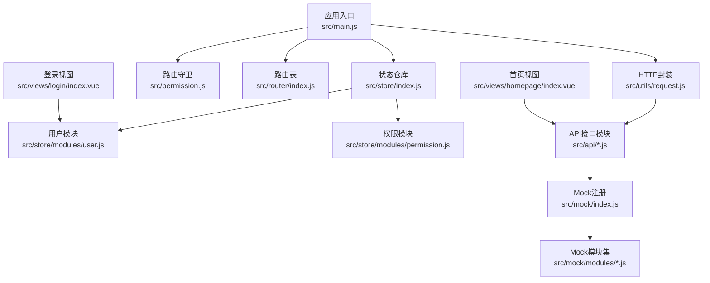
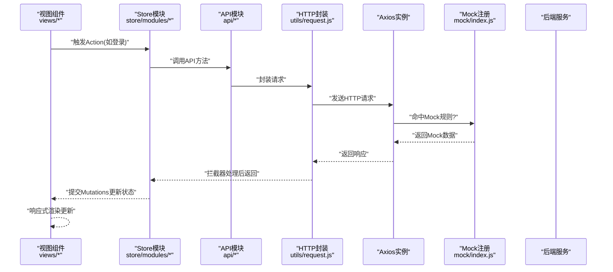
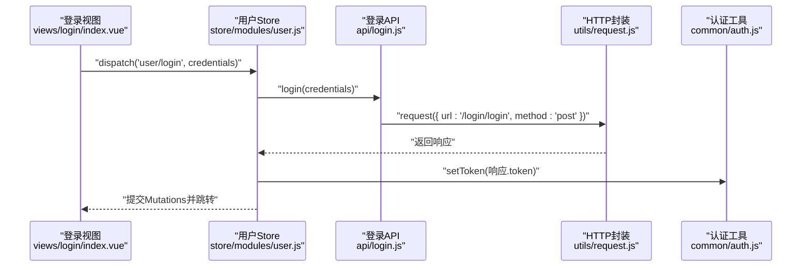
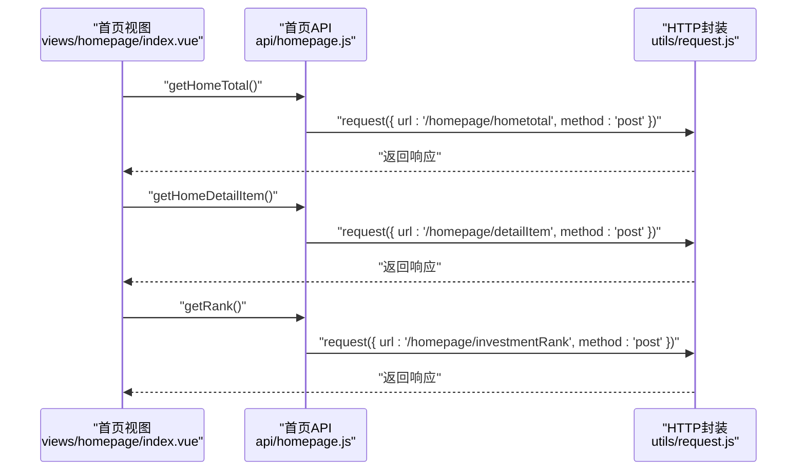
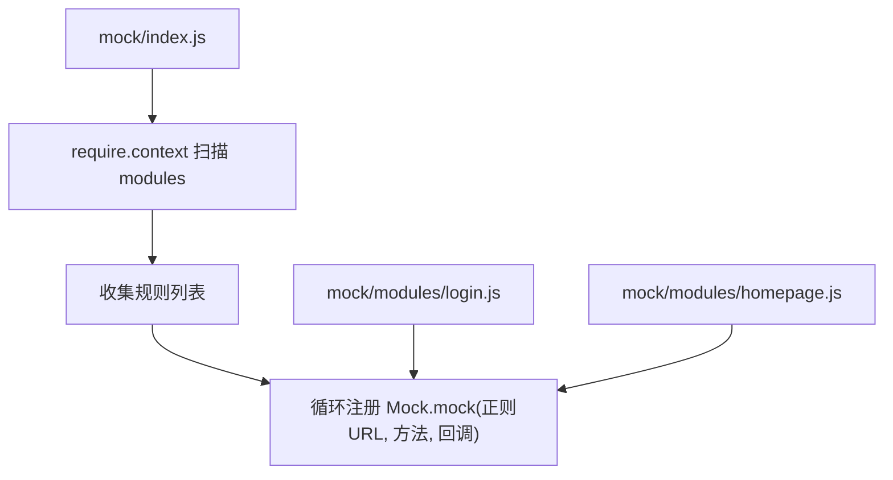
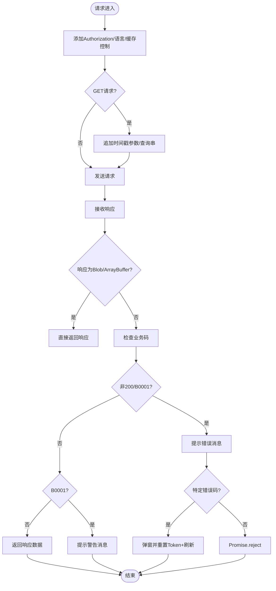
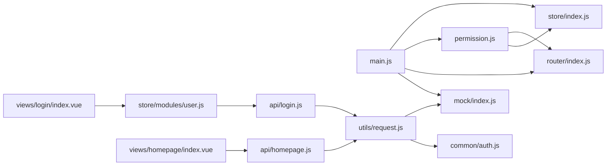

# 数据流架构

<cite>
**本文引用的文件**
- [main.js](file://src/main.js)
- [request.js](file://src/utils/request.js)
- [auth.js](file://src/common/auth.js)
- [store/index.js](file://src/store/index.js)
- [store/modules/user.js](file://src/store/modules/user.js)
- [store/modules/permission.js](file://src/store/modules/permission.js)
- [router/index.js](file://src/router/index.js)
- [permission.js](file://src/permission.js)
- [api/login.js](file://src/api/login.js)
- [api/homepage.js](file://src/api/homepage.js)
- [mock/index.js](file://src/mock/index.js)
- [mock/modules/login.js](file://src/mock/modules/login.js)
- [mock/modules/homepage.js](file://src/mock/modules/homepage.js)
- [views/login/index.vue](file://src/views/login/index.vue)
- [views/homepage/index.vue](file://src/views/homepage/index.vue)
</cite>

## 目录
1. [引言](#引言)
2. [项目结构](#项目结构)
3. [核心组件](#核心组件)
4. [架构总览](#架构总览)
5. [详细组件分析](#详细组件分析)
6. [依赖关系分析](#依赖关系分析)
7. [性能考量](#性能考量)
8. [故障排查指南](#故障排查指南)
9. [结论](#结论)
10. [附录](#附录)

## 引言
本文件面向Vue CMS项目的“数据流架构”，系统化阐述从组件到Store、从Store到API、从API到Mock的数据传输机制；解释HTTP请求封装与拦截器实现；梳理API接口组织与调用规范；分析数据缓存与状态同步策略；说明响应式更新原理；并提供数据流与错误处理流程图，以及Mock与真实API的切换与调试策略。

## 项目结构
项目采用“视图层-路由-状态管理-API封装-Mock”分层组织，核心入口在应用启动阶段挂载Mock与全局配置，随后通过路由守卫与Store驱动页面渲染与权限控制。

**图示来源**
- [main.js:1-53](file://src/main.js#L1-L53)
- [request.js:1-139](file://src/utils/request.js#L1-L139)
- [permission.js:1-98](file://src/permission.js#L1-L98)
- [router/index.js:1-343](file://src/router/index.js#L1-L343)
- [store/index.js:1-74](file://src/store/index.js#L1-L74)
- [store/modules/user.js:1-154](file://src/store/modules/user.js#L1-L154)
- [store/modules/permission.js:1-187](file://src/store/modules/permission.js#L1-L187)
- [api/login.js:1-24](file://src/api/login.js#L1-L24)
- [api/homepage.js:1-23](file://src/api/homepage.js#L1-L23)
- [mock/index.js:1-38](file://src/mock/index.js#L1-L38)
- [mock/modules/login.js:1-25](file://src/mock/modules/login.js#L1-L25)
- [mock/modules/homepage.js:1-120](file://src/mock/modules/homepage.js#L1-L120)
- [views/login/index.vue:1-261](file://src/views/login/index.vue#L1-L261)
- [views/homepage/index.vue:1-654](file://src/views/homepage/index.vue#L1-L654)

**章节来源**
- [main.js:1-53](file://src/main.js#L1-L53)
- [router/index.js:1-343](file://src/router/index.js#L1-L343)
- [store/index.js:1-74](file://src/store/index.js#L1-L74)

## 核心组件
- 应用入口与Mock挂载：在入口文件中引入并执行Mock注册，确保开发/生产环境下均可使用Mock。
- HTTP封装与拦截器：基于Axios封装服务实例，统一设置基础URL、超时、请求头、GET防缓存策略，并在请求/响应阶段进行鉴权、国际化、错误提示与超时处理。
- 认证与令牌：通过Cookie存储令牌，拦截器自动附加Authorization与语言头。
- Store与模块：自动加载modules目录下模块，提供用户、权限等状态管理；Getter统一对外暴露常用派生状态。
- 路由与权限：路由守卫根据令牌与会话中的权限生成可访问路由，动态注入并控制页面访问。
- API接口：按功能域拆分API模块，统一通过封装的服务发起请求。
- Mock系统：集中注册各模块Mock规则，统一响应格式，支持随机数据生成。

**章节来源**
- [main.js:30-34](file://src/main.js#L30-L34)
- [request.js:7-15](file://src/utils/request.js#L7-L15)
- [request.js:18-52](file://src/utils/request.js#L18-L52)
- [request.js:55-136](file://src/utils/request.js#L55-L136)
- [auth.js:1-18](file://src/common/auth.js#L1-L18)
- [store/index.js:10-17](file://src/store/index.js#L10-L17)
- [store/index.js:24-68](file://src/store/index.js#L24-L68)
- [permission.js:23-91](file://src/permission.js#L23-L91)
- [api/login.js:1-24](file://src/api/login.js#L1-L24)
- [api/homepage.js:1-23](file://src/api/homepage.js#L1-L23)
- [mock/index.js:20-34](file://src/mock/index.js#L20-L34)

## 架构总览
下图展示了典型数据流：组件触发Action → Store执行异步请求 → API封装发起HTTP请求 → Mock或真实后端返回 → 统一响应拦截器处理 → 视图响应式更新。

**图示来源**
- [views/login/index.vue:118-153](file://src/views/login/index.vue#L118-L153)
- [store/modules/user.js:52-110](file://src/store/modules/user.js#L52-L110)
- [api/login.js:3-23](file://src/api/login.js#L3-L23)
- [request.js:18-52](file://src/utils/request.js#L18-L52)
- [request.js:55-136](file://src/utils/request.js#L55-L136)
- [mock/index.js:27-34](file://src/mock/index.js#L27-L34)

## 详细组件分析

### 组件到Store：登录流程
- 视图组件触发登录校验与提交，调用Store的登录Action。
- Action内部调用API模块的登录接口，拿到响应后写入令牌与用户信息至Cookie与SessionStorage，并提交Mutations更新状态。
- 路由守卫根据会话中的权限动态生成路由并注入。

**图示来源**
- [views/login/index.vue:118-153](file://src/views/login/index.vue#L118-L153)
- [store/modules/user.js:52-74](file://src/store/modules/user.js#L52-L74)
- [api/login.js:3-9](file://src/api/login.js#L3-L9)
- [request.js:18-52](file://src/utils/request.js#L18-L52)
- [auth.js:9-11](file://src/common/auth.js#L9-L11)

**章节来源**
- [views/login/index.vue:118-153](file://src/views/login/index.vue#L118-L153)
- [store/modules/user.js:52-74](file://src/store/modules/user.js#L52-L74)
- [api/login.js:1-24](file://src/api/login.js#L1-L24)
- [auth.js:1-18](file://src/common/auth.js#L1-L18)

### Store到API：首页数据拉取
- 首页视图在created生命周期中分别调用多个API方法获取头部汇总、明细项与排行榜数据。
- API模块统一通过封装的服务发起请求，响应经拦截器处理后返回给组件。

**图示来源**
- [views/homepage/index.vue:234-264](file://src/views/homepage/index.vue#L234-L264)
- [api/homepage.js:3-22](file://src/api/homepage.js#L3-L22)
- [request.js:55-136](file://src/utils/request.js#L55-L136)

**章节来源**
- [views/homepage/index.vue:234-264](file://src/views/homepage/index.vue#L234-L264)
- [api/homepage.js:1-23](file://src/api/homepage.js#L1-L23)

### API到Mock：Mock注册与规则
- Mock入口自动扫描modules目录，收集各模块导出的规则并注册。
- Mock模块定义统一响应格式，支持随机数据生成，便于前后端并行开发与测试。

**图示来源**
- [mock/index.js:20-34](file://src/mock/index.js#L20-L34)
- [mock/modules/login.js:5-24](file://src/mock/modules/login.js#L5-L24)
- [mock/modules/homepage.js:75-119](file://src/mock/modules/homepage.js#L75-L119)

**章节来源**
- [mock/index.js:1-38](file://src/mock/index.js#L1-L38)
- [mock/modules/login.js:1-25](file://src/mock/modules/login.js#L1-L25)
- [mock/modules/homepage.js:1-120](file://src/mock/modules/homepage.js#L1-L120)

### HTTP请求封装与拦截器
- 请求拦截：自动附加令牌、语言头、GET防缓存参数；支持在headers中加入缓存控制。
- 响应拦截：统一处理Blob/ArrayBuffer下载场景；根据业务码判定成功/警告/错误；对特定错误码弹窗并强制登出；对超时与网络错误进行统一提示与拒绝。

**图示来源**
- [request.js:18-52](file://src/utils/request.js#L18-L52)
- [request.js:66-106](file://src/utils/request.js#L66-L106)
- [request.js:108-135](file://src/utils/request.js#L108-L135)

**章节来源**
- [request.js:1-139](file://src/utils/request.js#L1-L139)

### 数据缓存策略与状态同步
- 令牌缓存：通过Cookie存储，拦截器自动读取并附加至请求头。
- 用户信息与路由权限：通过SessionStorage持久化，用于刷新后恢复状态与动态路由注入。
- GET防缓存：在请求拦截器中为GET请求追加时间戳参数，避免浏览器缓存导致数据陈旧。
- Store派生状态：通过Getters统一输出常用派生数据，减少组件重复计算。

**章节来源**
- [auth.js:1-18](file://src/common/auth.js#L1-L18)
- [store/modules/user.js:13-29](file://src/store/modules/user.js#L13-L29)
- [store/modules/user.js:60-67](file://src/store/modules/user.js#L60-L67)
- [request.js:34-43](file://src/utils/request.js#L34-L43)
- [store/index.js:24-68](file://src/store/index.js#L24-L68)

### 响应式数据更新原理
- 组件通过调用Store Action触发异步流程；Action完成后提交Mutations更新状态；视图基于响应式数据自动渲染。
- 路由守卫在登录后根据会话中的权限生成路由并注入，保证导航与权限一致。

**章节来源**
- [views/login/index.vue:123-141](file://src/views/login/index.vue#L123-L141)
- [store/modules/user.js:52-110](file://src/store/modules/user.js#L52-L110)
- [permission.js:50-74](file://src/permission.js#L50-L74)

## 依赖关系分析
- 入口文件依赖Mock与全局配置，确保Mock在应用启动时即生效。
- 视图组件依赖Store与API模块；Store依赖API模块与认证工具；API模块依赖HTTP封装。
- 路由守卫依赖Store与会话存储，用于动态注入路由与权限控制。
- Mock系统依赖MockJS与模块规则，统一响应格式。

**图示来源**
- [main.js:30-34](file://src/main.js#L30-L34)
- [views/login/index.vue:118-153](file://src/views/login/index.vue#L118-L153)
- [views/homepage/index.vue:234-264](file://src/views/homepage/index.vue#L234-L264)
- [store/modules/user.js:1-4](file://src/store/modules/user.js#L1-L4)
- [api/login.js:1](file://src/api/login.js#L1)
- [api/homepage.js:1](file://src/api/homepage.js#L1)
- [request.js:1-6](file://src/utils/request.js#L1-L6)
- [auth.js:1-5](file://src/common/auth.js#L1-L5)
- [permission.js:1-12](file://src/permission.js#L1-L12)
- [router/index.js:1-12](file://src/router/index.js#L1-L12)
- [store/index.js:1-6](file://src/store/index.js#L1-L6)

**章节来源**
- [main.js:1-53](file://src/main.js#L1-L53)
- [router/index.js:1-343](file://src/router/index.js#L1-L343)
- [store/index.js:1-74](file://src/store/index.js#L1-L74)
- [permission.js:1-98](file://src/permission.js#L1-L98)

## 性能考量
- GET防缓存：在请求拦截器中为GET请求追加时间戳参数，避免缓存导致数据陈旧，但可能增加请求次数。建议仅对关键数据启用，或结合组件级缓存策略。
- 统一超时与错误提示：拦截器统一处理超时与网络错误，减少重复逻辑，提升一致性。
- 动态路由注入：路由守卫在首次登录后注入，避免重复生成；建议在权限变更时按需刷新。
- Mock延迟：Mock设置统一响应延时，有助于模拟真实网络，但需注意开发体验与自动化测试耗时。

[本节为通用指导，无需列出章节来源]

## 故障排查指南
- 登录失败/无权限：检查令牌是否正确写入与拦截器是否附加；确认后端返回的业务码与拦截器判定逻辑一致。
- 路由无法访问：检查会话中是否存在用户路由权限；确认路由守卫是否成功注入动态路由。
- 数据未更新：确认Store Mutations是否提交；检查组件是否监听到状态变化；必要时在组件中触发刷新。
- Mock未生效：确认Mock入口已被执行；检查模块规则的URL正则与方法是否匹配；验证统一响应格式。

**章节来源**
- [request.js:66-106](file://src/utils/request.js#L66-L106)
- [request.js:108-135](file://src/utils/request.js#L108-L135)
- [permission.js:40-74](file://src/permission.js#L40-L74)
- [mock/index.js:27-34](file://src/mock/index.js#L27-L34)

## 结论
本项目通过“视图-Store-API-封装-Mock”的清晰分层，实现了可测试、可维护的数据流。HTTP封装与拦截器提供了统一的请求/响应处理能力；Store模块化管理用户与权限状态；Mock系统保障了前后端并行开发效率。配合路由守卫与会话存储，实现了从登录到导航的完整数据流闭环。

[本节为总结，无需列出章节来源]

## 附录

### API接口组织与调用规范
- 按功能域拆分API模块，统一通过封装的服务发起请求。
- 命名规范：登录相关使用login.js，首页相关使用homepage.js。
- 调用方式：组件直接导入API方法并调用，返回Promise以便链式处理。

**章节来源**
- [api/login.js:1-24](file://src/api/login.js#L1-L24)
- [api/homepage.js:1-23](file://src/api/homepage.js#L1-L23)

### Mock与真实API切换机制
- 切换策略：入口文件中引入Mock注册；若需连接真实后端，注释掉Mock引入行即可。
- 开发调试：Mock提供统一响应格式与随机数据，便于快速联调；生产环境保持Mock以避免跨域与后端依赖。

**章节来源**
- [main.js:30-34](file://src/main.js#L30-L34)
- [mock/index.js:1-38](file://src/mock/index.js#L1-L38)