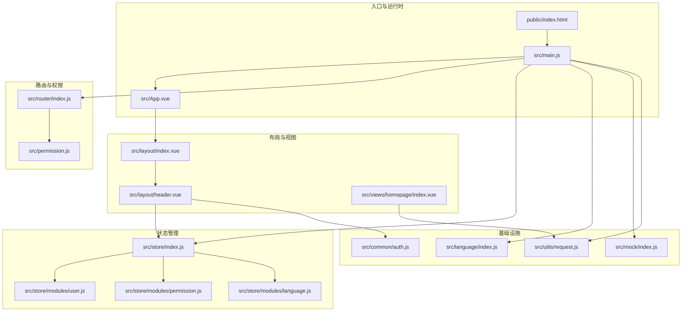
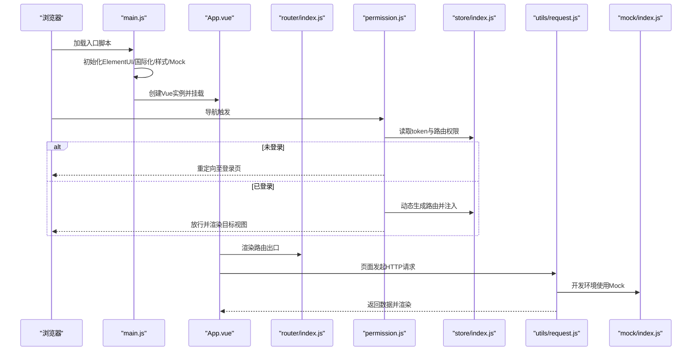
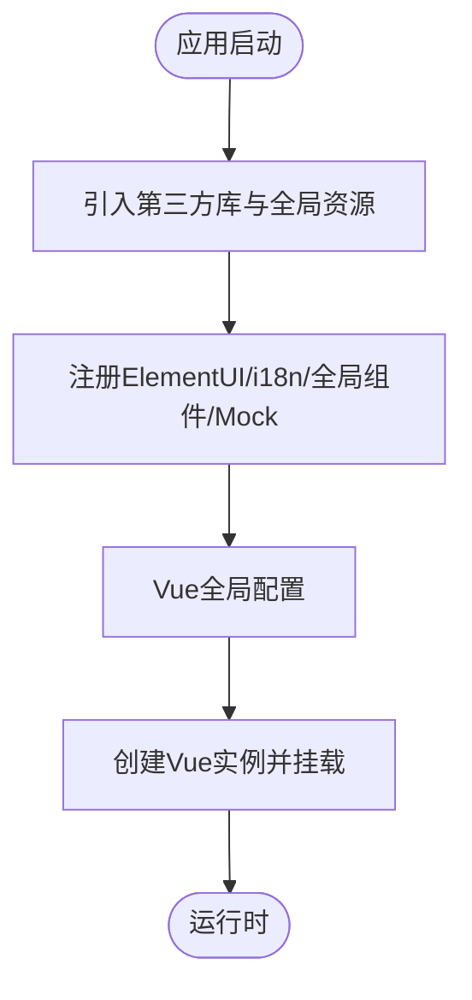
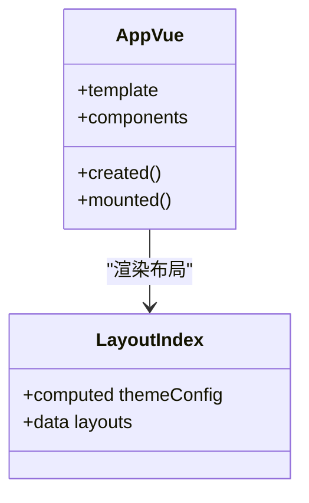
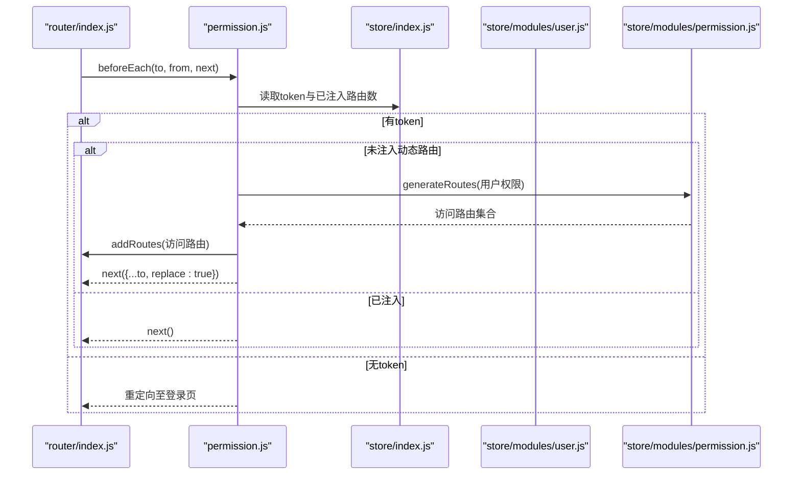
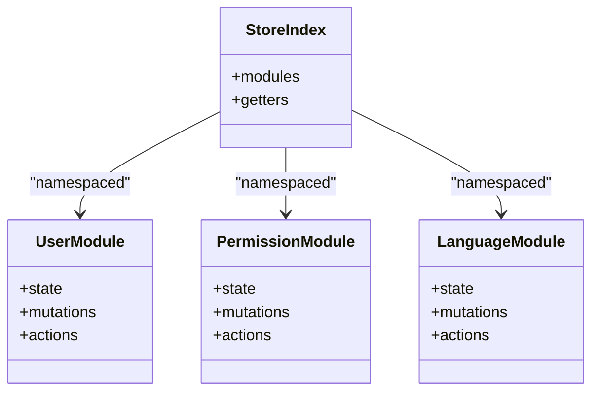
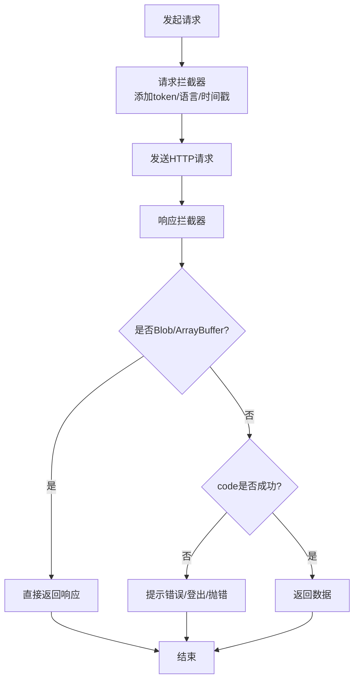
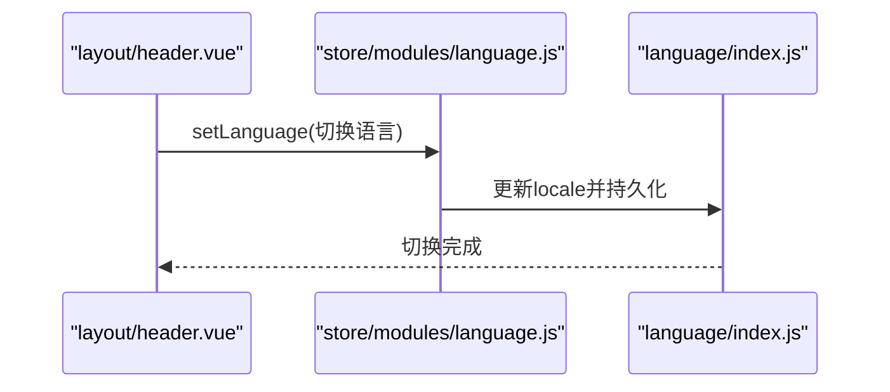
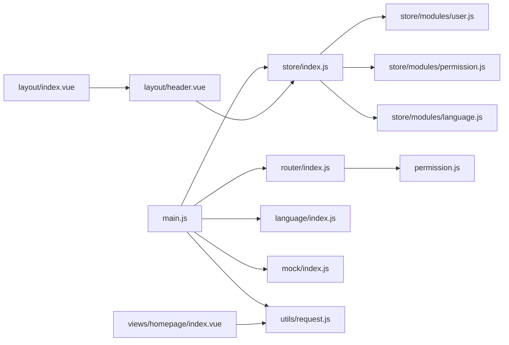

# 整体架构

<cite>
**本文引用的文件**
- [main.js](file://src/main.js)
- [App.vue](file://src/App.vue)
- [package.json](file://package.json)
- [vue.config.js](file://vue.config.js)
- [router/index.js](file://src/router/index.js)
- [store/index.js](file://src/store/index.js)
- [store/modules/user.js](file://src/store/modules/user.js)
- [store/modules/permission.js](file://src/store/modules/permission.js)
- [store/modules/language.js](file://src/store/modules/language.js)
- [permission.js](file://src/permission.js)
- [utils/request.js](file://src/utils/request.js)
- [language/index.js](file://src/language/index.js)
- [layout/index.vue](file://src/layout/index.vue)
- [layout/header.vue](file://src/layout/header.vue)
- [views/homepage/index.vue](file://src/views/homepage/index.vue)
- [mock/index.js](file://src/mock/index.js)
- [common/auth.js](file://src/common/auth.js)
- [babel.config.js](file://babel.config.js)
</cite>

## 目录
1. [引言](#引言)
2. [项目结构](#项目结构)
3. [核心组件](#核心组件)
4. [架构总览](#架构总览)
5. [详细组件分析](#详细组件分析)
6. [依赖分析](#依赖分析)
7. [性能考虑](#性能考虑)
8. [故障排查指南](#故障排查指南)
9. [结论](#结论)
10. [附录](#附录)

## 引言
本项目是一个基于 Vue.js 2.x 的内容管理系统（CMS），采用 MVVM 架构模式，结合 Vue Router 实现前端路由与权限控制，使用 Vuex 进行状态管理，并通过 Element UI 提供丰富的 UI 组件。项目同时集成了国际化（vue-i18n）、进度条（NProgress）、MockJS 数据模拟、Axios 请求拦截器等生态能力，形成一套可扩展、可维护且具备良好用户体验的前端工程化方案。

## 项目结构
项目采用“按功能域划分”的模块化组织方式，核心目录与职责如下：
- src/api：封装与后端交互的接口方法，便于统一管理与替换。
- src/assets：全局样式与静态资源（字体、图片、样式入口）。
- src/common：通用工具（认证、本地/会话存储、校验等）。
- src/components：可复用的通用组件（通知、全屏、主题、图标等）。
- src/config：动画与粒子效果等配置。
- src/decorator：装饰器（防抖、节流、确认框等）。
- src/directive：指令（剪贴板等）。
- src/icons：SVG 图标体系与加载器。
- src/language：国际化资源与 Element UI 语言包整合。
- src/layout：布局容器与头部、侧边栏、标签页等。
- src/mock：前后端解耦的数据模拟层，支持模块化注册。
- src/router：路由表与全局前置守卫。
- src/store：状态管理，自动扫描 modules 并聚合 getters。
- src/utils：通用工具（请求、验证、标题等）。
- src/views：页面视图，按业务模块组织。
- public：HTML 入口与静态资源。

**图表来源**
- [main.js:1-53](file://src/main.js#L1-L53)
- [App.vue:1-35](file://src/App.vue#L1-L35)
- [router/index.js:1-343](file://src/router/index.js#L1-L343)
- [store/index.js:1-74](file://src/store/index.js#L1-L74)
- [store/modules/user.js:1-154](file://src/store/modules/user.js#L1-L154)
- [store/modules/permission.js:1-187](file://src/store/modules/permission.js#L1-L187)
- [store/modules/language.js:1-26](file://src/store/modules/language.js#L1-L26)
- [layout/index.vue:1-32](file://src/layout/index.vue#L1-L32)
- [layout/header.vue:1-270](file://src/layout/header.vue#L1-L270)
- [views/homepage/index.vue:1-654](file://src/views/homepage/index.vue#L1-L654)
- [utils/request.js:1-139](file://src/utils/request.js#L1-L139)
- [language/index.js:1-28](file://src/language/index.js#L1-L28)
- [mock/index.js:1-38](file://src/mock/index.js#L1-L38)
- [common/auth.js:1-18](file://src/common/auth.js#L1-L18)

**章节来源**
- [main.js:1-53](file://src/main.js#L1-L53)
- [App.vue:1-35](file://src/App.vue#L1-L35)
- [package.json:1-99](file://package.json#L1-L99)
- [vue.config.js:1-144](file://vue.config.js#L1-L144)

## 核心组件
- 入口文件 main.js：负责引入第三方库、全局样式、Element UI 插件、国际化、权限控制、全局组件与 Mock 数据；随后创建 Vue 实例并挂载到 DOM。
- App.vue：作为根组件，承载路由出口与系统设置抽屉，保持根组件简洁，避免直接处理业务逻辑。
- 路由模块 router/index.js：定义基础路由、动态路由与末尾兜底路由，提供路由守卫与动态添加路由的能力。
- 状态模块 store/index.js：自动扫描 modules 文件夹，聚合 getters，集中管理用户、权限、语言等状态。
- 权限模块 permission.js：全局前置守卫，结合 store 的用户与路由模块，实现登录态校验、动态路由注入与页面标题设置。
- 请求模块 utils/request.js：基于 Axios 的请求/响应拦截器，统一处理鉴权头、错误提示、超时与网络异常。
- 国际化 language/index.js：整合 vue-i18n 与 Element UI 语言包，按系统语言切换界面文案。
- Mock 模块 mock/index.js：自动注册 modules 下的模拟接口，统一响应格式，便于前后端并行开发。
- 布局模块 layout/index.vue 与 header.vue：提供主题布局切换与顶部导航栏（面包屑、语言切换、全屏、用户下拉菜单等）。

**章节来源**
- [main.js:1-53](file://src/main.js#L1-L53)
- [App.vue:1-35](file://src/App.vue#L1-L35)
- [router/index.js:1-343](file://src/router/index.js#L1-L343)
- [store/index.js:1-74](file://src/store/index.js#L1-L74)
- [permission.js:1-98](file://src/permission.js#L1-L98)
- [utils/request.js:1-139](file://src/utils/request.js#L1-L139)
- [language/index.js:1-28](file://src/language/index.js#L1-L28)
- [mock/index.js:1-38](file://src/mock/index.js#L1-L38)
- [layout/index.vue:1-32](file://src/layout/index.vue#L1-L32)
- [layout/header.vue:1-270](file://src/layout/header.vue#L1-L270)

## 架构总览
本项目采用 MVVM 架构，数据驱动视图更新，控制器（路由与权限）协调模型（状态）与视图（组件）。核心流程如下：
- 应用启动：main.js 初始化 Element UI、国际化、全局样式与 Mock；随后挂载 Vue 实例。
- 路由与权限：permission.js 在导航前进行登录态与路由权限校验，必要时动态注入路由。
- 状态管理：store/modules/* 管理用户、权限、语言等状态，通过 getters 提供统一访问入口。
- 视图渲染：App.vue 渲染路由出口与设置面板；layout/header.vue 提供顶部导航与用户操作；views 下的页面组件负责具体业务。
- 数据交互：utils/request.js 统一处理请求与响应，支持鉴权头、语言头与错误处理；mock/index.js 提供离线数据模拟。

**图表来源**
- [main.js:1-53](file://src/main.js#L1-L53)
- [permission.js:1-98](file://src/permission.js#L1-L98)
- [store/index.js:1-74](file://src/store/index.js#L1-L74)
- [utils/request.js:1-139](file://src/utils/request.js#L1-L139)
- [mock/index.js:1-38](file://src/mock/index.js#L1-L38)
- [router/index.js:1-343](file://src/router/index.js#L1-L343)

## 详细组件分析

### 入口与初始化流程（main.js）
- 依赖引入：Cookies、Vue、App、router、store、Element UI、国际化、全局样式、图标、通知组件、权限控制、Mock 数据。
- 插件注册：Element UI 使用 Cookie 控制尺寸与 zIndex，并通过 i18n 注入翻译函数。
- 全局配置：关闭生产提示。
- 实例挂载：渲染 App 根组件并挂载到 #app。

**图表来源**
- [main.js:1-53](file://src/main.js#L1-L53)

**章节来源**
- [main.js:1-53](file://src/main.js#L1-L53)

### 根组件与布局（App.vue 与 layout/index.vue）
- App.vue：提供路由出口与设置面板，保持根组件简洁。
- layout/index.vue：根据主题配置动态选择布局组件（默认布局），通过 Vuex 获取主题设置。

**图表来源**
- [App.vue:1-35](file://src/App.vue#L1-L35)
- [layout/index.vue:1-32](file://src/layout/index.vue#L1-L32)

**章节来源**
- [App.vue:1-35](file://src/App.vue#L1-L35)
- [layout/index.vue:1-32](file://src/layout/index.vue#L1-L32)

### 路由与权限（router/index.js 与 permission.js）
- 路由表：constantRoutes（基础路由）、asyncRoutes（动态路由）、endBasicRoutes（兜底路由）。
- 动态路由：permission.js 在导航前根据用户权限生成可访问路由并注入，同时设置页面标题与进度条。
- 路由守卫：白名单、token 校验、动态路由回退与错误处理。

**图表来源**
- [router/index.js:1-343](file://src/router/index.js#L1-L343)
- [permission.js:1-98](file://src/permission.js#L1-L98)
- [store/modules/permission.js:1-187](file://src/store/modules/permission.js#L1-L187)
- [store/modules/user.js:1-154](file://src/store/modules/user.js#L1-L154)

**章节来源**
- [router/index.js:1-343](file://src/router/index.js#L1-L343)
- [permission.js:1-98](file://src/permission.js#L1-L98)

### 状态管理（store/index.js 与模块）
- 自动扫描：通过 require.context 扫描 modules 下的模块并注入。
- 全局 getters：统一提供用户信息、路由权限、语言、设置等便捷访问。
- 用户模块：登录、登出、更新头像与信息、重置 token 并清理路由。
- 权限模块：根据后端返回的权限过滤前端路由，生成按钮权限列表。
- 语言模块：设置与持久化语言。

**图表来源**
- [store/index.js:1-74](file://src/store/index.js#L1-L74)
- [store/modules/user.js:1-154](file://src/store/modules/user.js#L1-L154)
- [store/modules/permission.js:1-187](file://src/store/modules/permission.js#L1-L187)
- [store/modules/language.js:1-26](file://src/store/modules/language.js#L1-L26)

**章节来源**
- [store/index.js:1-74](file://src/store/index.js#L1-L74)
- [store/modules/user.js:1-154](file://src/store/modules/user.js#L1-L154)
- [store/modules/permission.js:1-187](file://src/store/modules/permission.js#L1-L187)
- [store/modules/language.js:1-26](file://src/store/modules/language.js#L1-L26)

### 数据交互与 Mock（utils/request.js 与 mock/index.js）
- 请求拦截器：统一添加 Authorization 与 Accept-Language 头，GET 请求加入时间戳参数防止缓存。
- 响应拦截器：统一处理 Blob/ArrayBuffer、自定义 code、超时与网络异常，错误消息提示与登出处理。
- Mock：自动扫描 modules 下的模拟接口，统一响应格式，支持延时与正则匹配。

**图表来源**
- [utils/request.js:1-139](file://src/utils/request.js#L1-L139)

**章节来源**
- [utils/request.js:1-139](file://src/utils/request.js#L1-L139)
- [mock/index.js:1-38](file://src/mock/index.js#L1-L38)

### 国际化与主题（language/index.js 与 layout/header.vue）
- 国际化：整合 vue-i18n 与 Element UI 语言包，按系统语言初始化。
- 主题与设置：header.vue 提供语言切换、全屏、设置面板开关、用户下拉菜单与登出。

**图表来源**
- [layout/header.vue:1-270](file://src/layout/header.vue#L1-L270)
- [store/modules/language.js:1-26](file://src/store/modules/language.js#L1-L26)
- [language/index.js:1-28](file://src/language/index.js#L1-L28)

**章节来源**
- [layout/header.vue:1-270](file://src/layout/header.vue#L1-L270)
- [store/modules/language.js:1-26](file://src/store/modules/language.js#L1-L26)
- [language/index.js:1-28](file://src/language/index.js#L1-L28)

### 页面示例（views/homepage/index.vue）
- 业务页面：首页聚合展示，使用 ECharts、better-scroll、countup.js 等第三方库。
- 数据获取：通过 API 方法拉取头部汇总、详情卡片与排行榜数据。
- 性能注意：在 created 生命周期发起请求，mounted 后进行滚动初始化，beforeDestroy 销毁实例避免内存泄漏。

**章节来源**
- [views/homepage/index.vue:1-654](file://src/views/homepage/index.vue#L1-L654)

## 依赖分析
- 技术栈选择：
  - Vue 生态：Vue 2.7、Vue Router 3、Vuex 3，稳定且生态完善。
  - UI 框架：Element UI 2，提供丰富组件与国际化支持。
  - 网络层：Axios + 请求拦截器，统一处理鉴权与错误。
  - Mock：MockJS，模块化注册，便于前后端并行。
  - 国际化：vue-i18n + Element UI 语言包。
  - 构建：Vue CLI 5 + Webpack 5，提供 SVG Sprite、分包优化、运行时优化等。
- 模块耦合：
  - main.js 作为装配者，低耦合地引入各模块。
  - permission.js 与 store 模块强耦合，负责权限与路由注入。
  - utils/request.js 与 API 层解耦，便于替换或对接真实后端。
  - layout/header.vue 与 store 的 getters/ actions 解耦，通过映射访问状态。

**图表来源**
- [main.js:1-53](file://src/main.js#L1-L53)
- [router/index.js:1-343](file://src/router/index.js#L1-L343)
- [store/index.js:1-74](file://src/store/index.js#L1-L74)
- [permission.js:1-98](file://src/permission.js#L1-L98)
- [store/modules/user.js:1-154](file://src/store/modules/user.js#L1-L154)
- [store/modules/permission.js:1-187](file://src/store/modules/permission.js#L1-L187)
- [store/modules/language.js:1-26](file://src/store/modules/language.js#L1-L26)
- [layout/index.vue:1-32](file://src/layout/index.vue#L1-L32)
- [layout/header.vue:1-270](file://src/layout/header.vue#L1-L270)
- [views/homepage/index.vue:1-654](file://src/views/homepage/index.vue#L1-L654)
- [utils/request.js:1-139](file://src/utils/request.js#L1-L139)
- [language/index.js:1-28](file://src/language/index.js#L1-L28)
- [mock/index.js:1-38](file://src/mock/index.js#L1-L38)

**章节来源**
- [package.json:1-99](file://package.json#L1-L99)
- [vue.config.js:1-144](file://vue.config.js#L1-L144)

## 性能考虑
- 构建优化：
  - 分包策略：将 element-ui、libs、components 独立拆分，提升缓存命中率。
  - 运行时优化：启用 runtimeChunk 单独提取运行时代码。
  - 删除无用插件：禁用 preload/prefetch，避免多余请求。
- 运行时优化：
  - 请求缓存：GET 请求追加时间戳参数，避免浏览器缓存导致数据陈旧。
  - 组件懒加载：路由组件使用动态导入，按需加载。
  - 滚动优化：better-scroll 在销毁时释放实例，避免内存泄漏。
- 开发体验：
  - SVG Sprite：自定义 svg-sprite-loader，减少图标体积与请求数。
  - Mock 延时：模拟网络延迟，提升联调体验。

**章节来源**
- [vue.config.js:104-141](file://vue.config.js#L104-L141)
- [utils/request.js:34-43](file://src/utils/request.js#L34-L43)
- [views/homepage/index.vue:210-231](file://src/views/homepage/index.vue#L210-L231)

## 故障排查指南
- 登录态异常：
  - 检查 token 是否存在与过期，必要时触发 resetToken 并重定向登录。
  - 清理 sessionStorage 中的用户路由与用户信息。
- 动态路由注入失败：
  - 确认后端返回的权限地址与前端路由 path 匹配规则一致。
  - 检查 generateRoutes 的过滤逻辑与 endBasicRoutes 的拼接。
- 请求失败：
  - 查看响应拦截器对 code 的判断与错误提示。
  - 检查 baseURL、超时与网络异常分支。
- Mock 数据不生效：
  - 确认 modules 下的接口模块已正确导出并被自动注册。
  - 检查正则匹配与 state 字段是否启用。

**章节来源**
- [permission.js:40-70](file://src/permission.js#L40-L70)
- [store/modules/permission.js:147-177](file://src/store/modules/permission.js#L147-L177)
- [utils/request.js:66-135](file://src/utils/request.js#L66-L135)
- [mock/index.js:20-34](file://src/mock/index.js#L20-L34)

## 结论
本项目以 Vue 2.x 为核心，结合 Element UI、Vue Router、Vuex、Axios、MockJS 等成熟生态，构建了清晰的 MVVM 架构与模块化组织。通过全局权限守卫、自动状态管理与 Mock 数据模拟，实现了前后端并行开发与良好的用户体验。配合构建期的分包与运行时优化，兼顾了可扩展性与性能表现。

## 附录
- 浏览器兼容：browserslist 配置排除 IE 低版本，适配现代浏览器。
- 本地开发：通过 vue.config.js 的 devServer 代理与热更新，提升开发效率。
- 代码规范：ESLint + Prettier 集成，保证团队一致性。

**章节来源**
- [babel.config.js:1-12](file://babel.config.js#L1-L12)
- [vue.config.js:29-50](file://vue.config.js#L29-L50)
- [package.json:92-97](file://package.json#L92-L97)