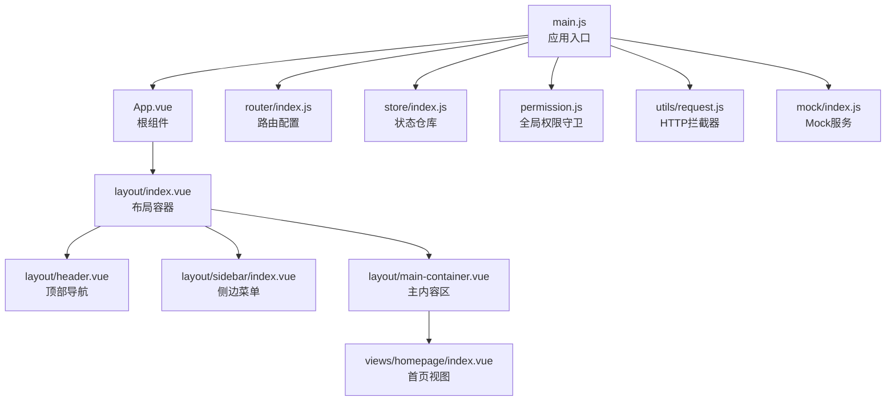
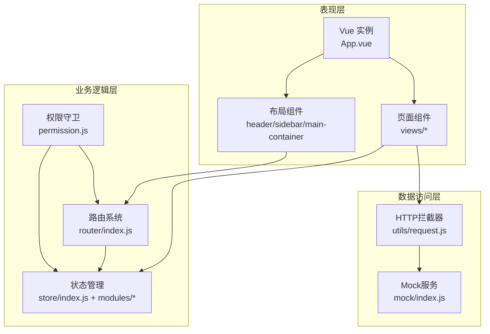
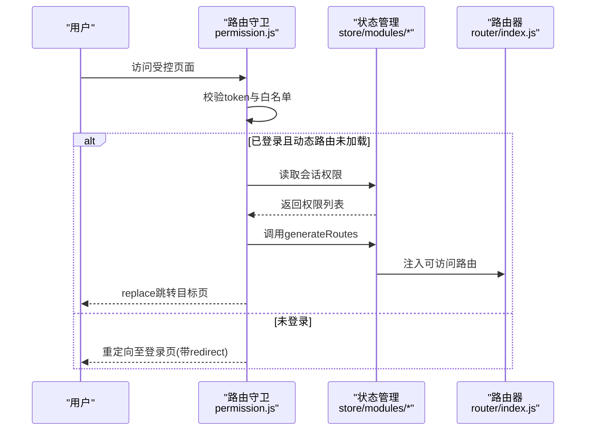
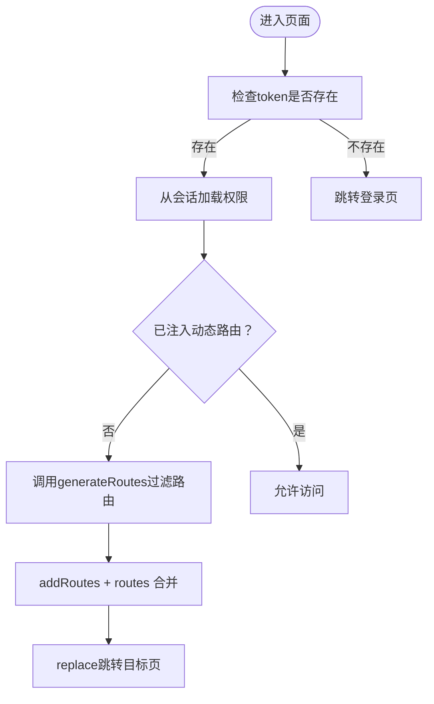
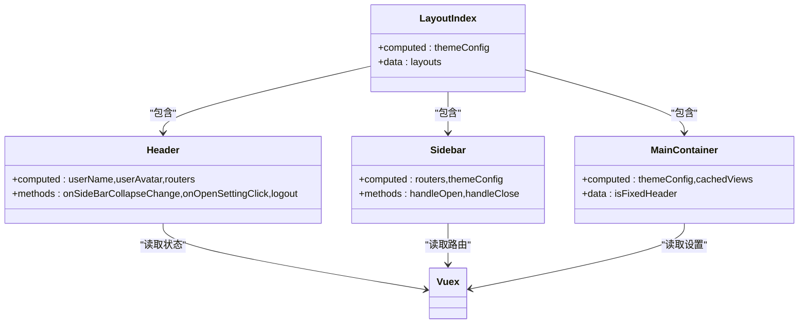
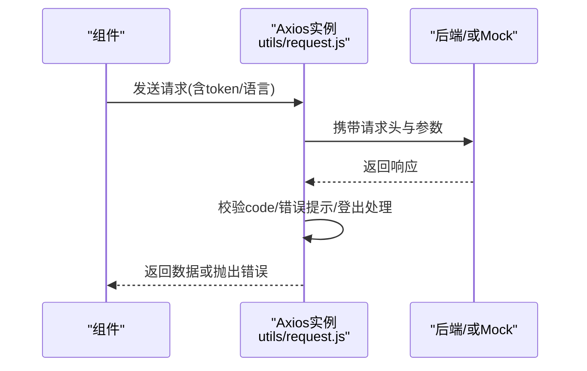
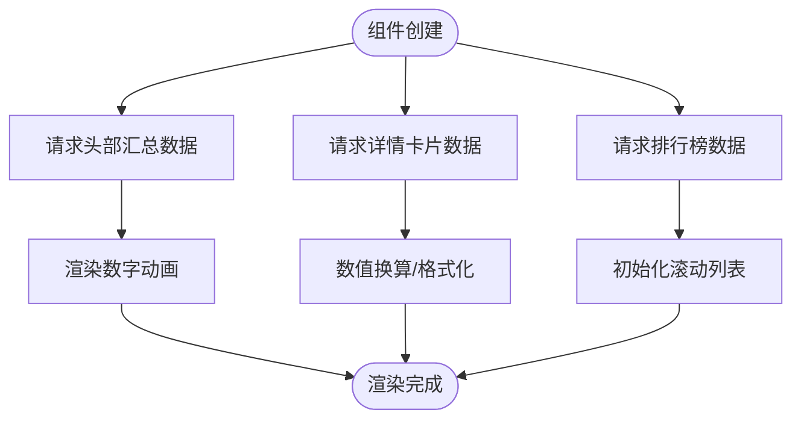
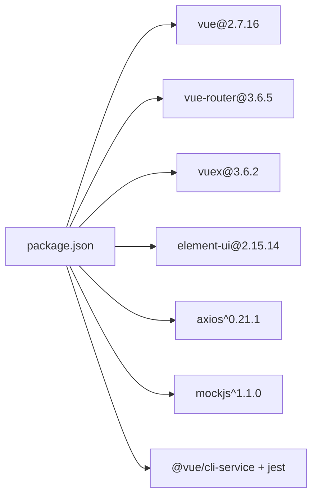

# 架构设计

<cite>
**本文引用的文件**
- [main.js](file://src/main.js)
- [App.vue](file://src/App.vue)
- [router/index.js](file://src/router/index.js)
- [store/index.js](file://src/store/index.js)
- [store/modules/user.js](file://src/store/modules/user.js)
- [store/modules/permission.js](file://src/store/modules/permission.js)
- [layout/index.vue](file://src/layout/index.vue)
- [layout/header.vue](file://src/layout/header.vue)
- [layout/sidebar/index.vue](file://src/layout/sidebar/index.vue)
- [layout/main-container.vue](file://src/layout/main-container.vue)
- [permission.js](file://src/permission.js)
- [utils/request.js](file://src/utils/request.js)
- [mock/index.js](file://src/mock/index.js)
- [views/homepage/index.vue](file://src/views/homepage/index.vue)
- [package.json](file://package.json)
</cite>

## 目录
1. [引言](#引言)
2. [项目结构](#项目结构)
3. [核心组件](#核心组件)
4. [架构总览](#架构总览)
5. [详细组件分析](#详细组件分析)
6. [依赖分析](#依赖分析)
7. [性能考量](#性能考量)
8. [故障排查指南](#故障排查指南)
9. [结论](#结论)
10. [附录](#附录)

## 引言
本项目采用基于 Vue.js 的 MVVM 架构，结合组件化与模块化理念，构建一个内容管理系统的前端应用。系统围绕“表现层-业务逻辑层-数据访问层”的分层设计，配合路由系统、状态管理与组件通信机制，形成清晰的职责划分与可扩展的架构形态。本文档将系统阐述架构设计、组件协作、数据流与控制流，并对性能优化、可维护性与可扩展性提出实践建议。

## 项目结构
项目采用按功能域组织的目录结构，主要模块包括：
- 应用入口与全局配置：main.js、App.vue
- 路由系统：router/index.js
- 状态管理：store/index.js 及其 modules 子模块
- 布局与页面：layout 目录下的多组件组合
- 视图页面：views 目录下的页面组件
- 工具与拦截器：utils/request.js
- 权限与导航：permission.js
- Mock 数据：mock/index.js
- 依赖与脚手架：package.json、vue.config.js

**图表来源**
- [main.js:1-53](file://src/main.js#L1-L53)
- [App.vue:1-35](file://src/App.vue#L1-L35)
- [router/index.js:1-343](file://src/router/index.js#L1-L343)
- [store/index.js:1-74](file://src/store/index.js#L1-L74)
- [permission.js:1-98](file://src/permission.js#L1-L98)
- [utils/request.js:1-139](file://src/utils/request.js#L1-L139)
- [mock/index.js:1-38](file://src/mock/index.js#L1-L38)
- [layout/index.vue:1-32](file://src/layout/index.vue#L1-L32)
- [layout/header.vue:1-270](file://src/layout/header.vue#L1-L270)
- [layout/sidebar/index.vue:1-142](file://src/layout/sidebar/index.vue#L1-L142)
- [layout/main-container.vue:1-109](file://src/layout/main-container.vue#L1-L109)
- [views/homepage/index.vue:1-654](file://src/views/homepage/index.vue#L1-L654)

**章节来源**
- [main.js:1-53](file://src/main.js#L1-L53)
- [router/index.js:1-343](file://src/router/index.js#L1-L343)
- [store/index.js:1-74](file://src/store/index.js#L1-L74)
- [layout/index.vue:1-32](file://src/layout/index.vue#L1-L32)

## 核心组件
- 应用入口与初始化：负责引入 UI 组件库、国际化、全局样式、通知组件、Mock 数据以及挂载根实例。
- 根组件 App.vue：承载路由出口与设置面板，保持根组件轻量，避免直接处理业务逻辑。
- 路由系统：常量路由、动态路由与末尾兜底路由三段式设计，支持权限过滤与动态注入。
- 状态管理：自动扫描 modules 文件夹，集中管理用户、权限、语言、标签页等状态。
- 布局系统：头部导航、侧边菜单、主内容区与设置面板协同工作，支持主题与动画配置。
- 权限守卫：基于路由守卫实现登录态校验、动态路由注入与页面标题设置。
- HTTP 拦截器：统一封装请求头、鉴权、错误提示与超时处理。
- Mock 服务：模块化注册，便于前后端并行开发与本地联调。

**章节来源**
- [main.js:1-53](file://src/main.js#L1-L53)
- [App.vue:1-35](file://src/App.vue#L1-L35)
- [router/index.js:1-343](file://src/router/index.js#L1-L343)
- [store/index.js:1-74](file://src/store/index.js#L1-L74)
- [layout/header.vue:1-270](file://src/layout/header.vue#L1-L270)
- [layout/sidebar/index.vue:1-142](file://src/layout/sidebar/index.vue#L1-L142)
- [layout/main-container.vue:1-109](file://src/layout/main-container.vue#L1-L109)
- [permission.js:1-98](file://src/permission.js#L1-L98)
- [utils/request.js:1-139](file://src/utils/request.js#L1-L139)
- [mock/index.js:1-38](file://src/mock/index.js#L1-L38)

## 架构总览
系统采用 MVVM 架构模式，Vue 实现视图与模型的双向绑定，Vuex 提供集中式状态管理，Vue Router 实现前端路由与导航。权限体系通过路由守卫与动态路由注入实现细粒度控制。HTTP 请求通过 Axios 与拦截器封装，统一处理鉴权与错误提示。Mock 服务在开发阶段替代真实后端，提升联调效率。

**图表来源**
- [main.js:1-53](file://src/main.js#L1-L53)
- [router/index.js:1-343](file://src/router/index.js#L1-L343)
- [store/index.js:1-74](file://src/store/index.js#L1-L74)
- [permission.js:1-98](file://src/permission.js#L1-L98)
- [utils/request.js:1-139](file://src/utils/request.js#L1-L139)
- [mock/index.js:1-38](file://src/mock/index.js#L1-L38)

## 详细组件分析

### 路由系统与权限控制
- 路由结构：常量路由（无需权限）、动态路由（按权限生成）、末尾兜底路由（404/无权限/通配）。
- 动态注入：登录成功后从会话加载权限，调用权限模块生成可访问路由，再注入到路由器。
- 路由守卫：登录态校验、白名单放行、动态路由未加载时回退至登录页并携带 redirect 参数。

**图表来源**
- [permission.js:23-91](file://src/permission.js#L23-L91)
- [store/modules/permission.js:147-178](file://src/store/modules/permission.js#L147-L178)
- [router/index.js:322-342](file://src/router/index.js#L322-L342)

**章节来源**
- [router/index.js:43-111](file://src/router/index.js#L43-L111)
- [router/index.js:118-320](file://src/router/index.js#L118-L320)
- [permission.js:23-91](file://src/permission.js#L23-L91)
- [store/modules/permission.js:147-178](file://src/store/modules/permission.js#L147-L178)

### 状态管理与模块化
- 自动模块发现：通过 require.context 扫描 modules 目录，统一注入到 store。
- 全局 getters：集中提供常用派生状态，如用户信息、路由菜单、语言、设置项等。
- 用户模块：封装登录、登出、头像更新、用户信息更新等动作，持久化 token 与会话数据。
- 权限模块：根据后端返回的权限列表过滤前端路由，生成最终路由树并提交按钮权限。

**图表来源**
- [permission.js:40-74](file://src/permission.js#L40-L74)
- [store/modules/permission.js:147-178](file://src/store/modules/permission.js#L147-L178)
- [store/index.js:24-68](file://src/store/index.js#L24-L68)

**章节来源**
- [store/index.js:10-17](file://src/store/index.js#L10-L17)
- [store/index.js:24-68](file://src/store/index.js#L24-L68)
- [store/modules/user.js:52-145](file://src/store/modules/user.js#L52-L145)
- [store/modules/permission.js:133-178](file://src/store/modules/permission.js#L133-L178)

### 布局与组件通信
- 布局容器：根据主题配置选择不同布局组件，保持布局切换的灵活性。
- 顶部导航：集成面包屑、全屏、语言切换、用户下拉菜单等，通过 Vuex 获取用户名、头像与路由列表。
- 侧边菜单：根据动态路由渲染菜单树，支持折叠、唯一展开、图标与标题国际化。
- 主内容区：支持 keep-alive 缓存、页面切换动画与滚动区域封装。

**图表来源**
- [layout/index.vue:19-30](file://src/layout/index.vue#L19-L30)
- [layout/header.vue:86-173](file://src/layout/header.vue#L86-L173)
- [layout/sidebar/index.vue:31-59](file://src/layout/sidebar/index.vue#L31-L59)
- [layout/main-container.vue:25-56](file://src/layout/main-container.vue#L25-L56)

**章节来源**
- [layout/index.vue:19-30](file://src/layout/index.vue#L19-L30)
- [layout/header.vue:86-173](file://src/layout/header.vue#L86-L173)
- [layout/sidebar/index.vue:31-59](file://src/layout/sidebar/index.vue#L31-L59)
- [layout/main-container.vue:25-56](file://src/layout/main-container.vue#L25-L56)

### 数据访问层与 Mock
- HTTP 拦截器：统一设置 Authorization、Accept-Language、GET 请求防缓存策略；根据自定义 code 处理错误与登出流程。
- Mock 服务：模块化注册，支持随机延迟，便于本地调试与接口联调。

**图表来源**
- [utils/request.js:18-52](file://src/utils/request.js#L18-L52)
- [utils/request.js:66-135](file://src/utils/request.js#L66-L135)
- [mock/index.js:20-34](file://src/mock/index.js#L20-L34)

**章节来源**
- [utils/request.js:18-52](file://src/utils/request.js#L18-L52)
- [utils/request.js:66-135](file://src/utils/request.js#L66-L135)
- [mock/index.js:20-34](file://src/mock/index.js#L20-L34)

### 首页视图与数据流
- 首页视图通过 API 获取头部汇总、详情卡片与排行榜数据，使用第三方库实现数字动画与滚动列表。
- 组件内部管理本地状态，生命周期中发起请求并在 DOM 更新后初始化外部组件实例。

**图表来源**
- [views/homepage/index.vue:233-277](file://src/views/homepage/index.vue#L233-L277)

**章节来源**
- [views/homepage/index.vue:176-277](file://src/views/homepage/index.vue#L176-L277)

## 依赖分析
- 核心运行时依赖：Vue 2.7、Vue Router 3.x、Vuex 3.x、Element UI 2.x、Axios、MockJS 等。
- 开发工具链：@vue/cli-service、Sass、SVG Sprite Loader、Jest 单测等。
- 浏览器兼容：browserslist 指定现代浏览器与非废弃目标。

**图表来源**
- [package.json:33-63](file://package.json#L33-L63)
- [package.json:65-83](file://package.json#L65-L83)

**章节来源**
- [package.json:33-99](file://package.json#L33-L99)

## 性能考量
- 路由与权限：仅在必要时注入动态路由，避免重复添加；使用会话缓存权限列表，减少重复请求。
- 组件缓存：主内容区支持 keep-alive 缓存，结合路由 key 控制刷新策略，降低重复渲染成本。
- 请求拦截：GET 请求附加时间戳参数避免缓存；统一错误提示与登出处理，减少异常分支开销。
- 滚动与动画：外部组件（如 better-scroll、countup.js）在生命周期中按需初始化与销毁，避免内存泄漏。
- Mock 服务：合理设置随机延迟，模拟真实网络环境，便于前端性能压测与体验优化。

[本节为通用指导，无需特定文件引用]

## 故障排查指南
- 登录态异常：检查 token 是否存在与过期；若后端返回特定 code，拦截器会触发重新登录流程。
- 动态路由未生效：确认会话中是否保存了权限列表；权限模块是否正确过滤并注入路由。
- 页面空白或404：检查末尾兜底路由是否正确添加；通配符路由是否位于路由表末尾。
- 请求超时或网络错误：查看拦截器对超时与网络错误的统一提示与返回值。

**章节来源**
- [utils/request.js:84-96](file://src/utils/request.js#L84-L96)
- [utils/request.js:110-135](file://src/utils/request.js#L110-L135)
- [permission.js:40-74](file://src/permission.js#L40-L74)
- [router/index.js:80-111](file://src/router/index.js#L80-L111)

## 结论
本项目以 Vue MVVM 为核心，结合组件化与模块化设计，实现了清晰的三层架构与完善的权限控制。通过路由守卫、状态管理与 HTTP 拦截器，系统具备良好的可维护性与可扩展性。建议在后续版本中逐步引入 Composition API、TypeScript 与更现代化的构建工具链，以进一步提升开发体验与运行性能。

[本节为总结性内容，无需特定文件引用]

## 附录
- 架构演进历史与未来规划：建议在版本迭代中逐步迁移至 Vue 3 + TS + Vite 生态，完善单元测试与端到端测试覆盖，引入微前端或模块联邦以增强多团队协作能力。
- 系统边界定义：前端边界以内置路由与权限控制为准，Mock 服务仅用于开发联调；生产环境需替换为真实后端接口。

[本节为概念性内容，无需特定文件引用]