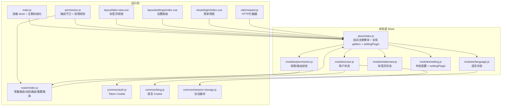
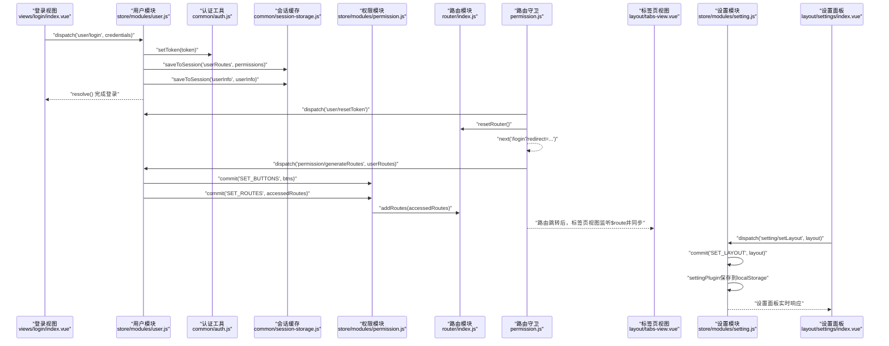
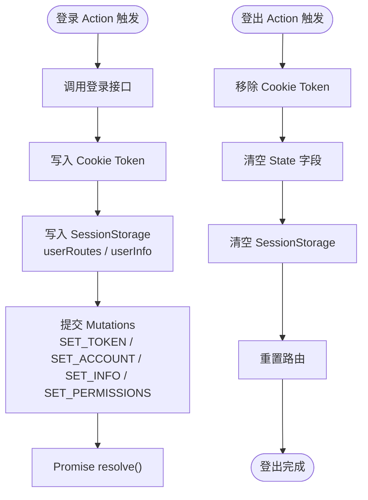
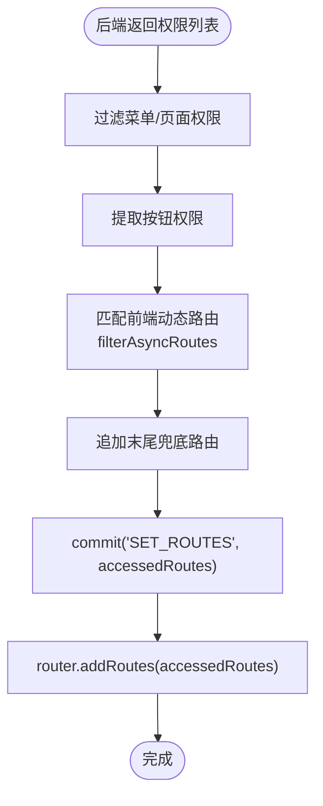
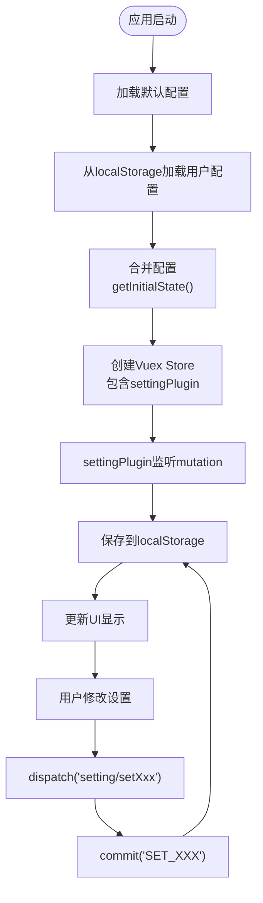
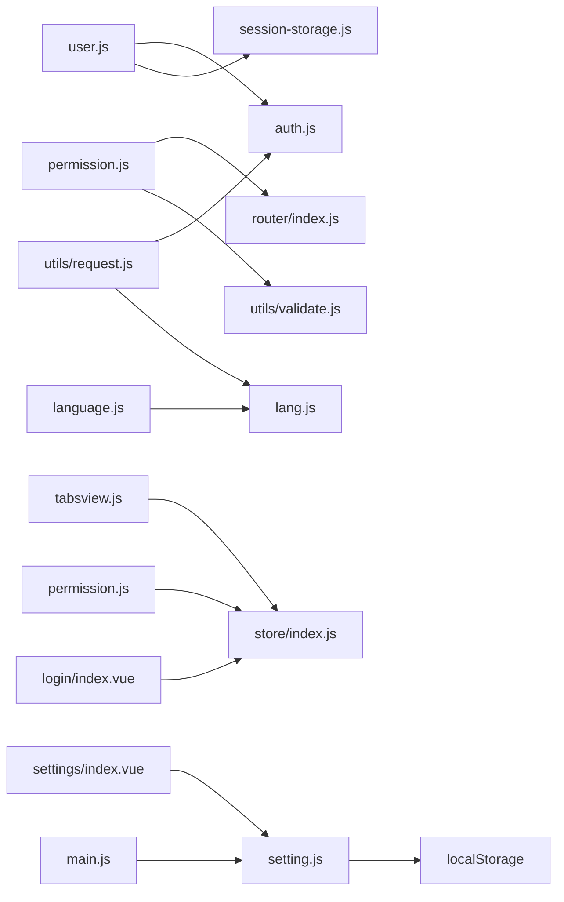

# 状态管理架构

<cite>
**本文引用的文件**
- [src/store/index.js](file://src/store/index.js)
- [src/store/modules/user.js](file://src/store/modules/user.js)
- [src/store/modules/permission.js](file://src/store/modules/permission.js)
- [src/store/modules/language.js](file://src/store/modules/language.js)
- [src/store/modules/tabsview.js](file://src/store/modules/tabsview.js)
- [src/store/modules/setting.js](file://src/store/modules/setting.js)
- [src/common/auth.js](file://src/common/auth.js)
- [src/common/lang.js](file://src/common/lang.js)
- [src/common/session-storage.js](file://src/common/session-storage.js)
- [src/router/index.js](file://src/router/index.js)
- [src/utils/validate.js](file://src/utils/validate.js)
- [src/permission.js](file://src/permission.js)
- [src/layout/tabs-view.vue](file://src/layout/tabs-view.vue)
- [src/layout/settings/index.vue](file://src/layout/settings/index.vue)
- [src/views/login/index.vue](file://src/views/login/index.vue)
- [src/utils/request.js](file://src/utils/request.js)
- [src/main.js](file://src/main.js)
</cite>

## 目录
1. [引言](#引言)
2. [项目结构](#项目结构)
3. [核心组件](#核心组件)
4. [架构总览](#架构总览)
5. [详细组件分析](#详细组件分析)
6. [依赖分析](#依赖分析)
7. [性能考虑](#性能考虑)
8. [故障排查指南](#故障排查指南)
9. [结论](#结论)
10. [附录](#附录)

## 引言
本文件面向Vue CMS项目的前端团队与技术管理者，系统化梳理基于Vuex的状态管理架构，重点覆盖模块化Store的组织方式、数据流与控制流、核心模块职责边界、状态持久化策略以及跨组件数据共享机制。文档同时提供状态流转图与模块依赖关系图，帮助读者快速理解"从登录到路由生成再到标签页联动"的完整流程，并总结异步状态管理最佳实践与性能优化建议。

**更新** 本版本新增了设置模块（setting）的详细分析，包括自动配置持久化系统（settingPlugin）和可视化布局配置面板的实现。

## 项目结构
本项目采用"按功能域分模块"的Store组织方式，所有模块位于src/store/modules目录下，入口文件通过上下文自动扫描注册，配合全局getters集中对外提供便捷访问。路由方面，采用"基础路由+动态路由+末尾兜底路由"的组合模式，结合权限模块对动态路由进行筛选与注入。新增的设置模块提供了完整的布局配置功能，通过Vuex插件实现自动持久化。

**图示来源**
- [src/store/index.js:1-76](file://src/store/index.js#L1-L76)
- [src/store/modules/user.js:1-154](file://src/store/modules/user.js#L1-L154)
- [src/store/modules/permission.js:1-187](file://src/store/modules/permission.js#L1-L187)
- [src/store/modules/language.js:1-26](file://src/store/modules/language.js#L1-L26)
- [src/store/modules/tabsview.js:1-49](file://src/store/modules/tabsview.js#L1-L49)
- [src/store/modules/setting.js:1-241](file://src/store/modules/setting.js#L1-L241)
- [src/main.js:1-73](file://src/main.js#L1-L73)
- [src/permission.js:1-98](file://src/permission.js#L1-L98)
- [src/router/index.js:1-343](file://src/router/index.js#L1-L343)
- [src/layout/tabs-view.vue:1-209](file://src/layout/tabs-view.vue#L1-L209)
- [src/layout/settings/index.vue:1-524](file://src/layout/settings/index.vue#L1-L524)
- [src/views/login/index.vue:1-261](file://src/views/login/index.vue#L1-L261)
- [src/common/auth.js:1-18](file://src/common/auth.js#L1-L18)
- [src/common/lang.js:1-18](file://src/common/lang.js#L1-L18)
- [src/common/session-storage.js:1-48](file://src/common/session-storage.js#L1-L48)
- [src/utils/request.js:1-139](file://src/utils/request.js#L1-L139)

**章节来源**
- [src/store/index.js:1-76](file://src/store/index.js#L1-L76)
- [src/main.js:1-73](file://src/main.js#L1-L73)

## 核心组件
- Store入口与自动模块注册
  - 通过require.context扫描modules目录，动态导入并注册模块，避免手动维护模块清单，降低耦合风险。
  - 全局getters集中暴露常用派生状态，如visitedTabsView、userInfo、routers、language等，便于组件以简洁方式访问。
  - **新增** settingPlugin插件集成，实现设置模块的自动持久化功能。
- 用户状态(user)
  - 维护token、账户、用户信息、原始权限列表等；提供登录、拉取用户信息、登出、头像更新、用户信息更新、重置token等动作。
  - 使用Cookie存储token，使用sessionStorage存储本次登录相关的用户路由与用户信息，确保刷新后可恢复登录态与界面状态。
- 权限状态(permission)
  - 维护最终路由集合、动态添加的路由、按钮权限列表；提供generateRoutes动作，根据后端返回的权限数据与前端动态路由表进行匹配，生成可访问路由并注入到路由器。
  - 提供按钮权限判断辅助方法，支持菜单/页面/按钮三类权限的区分与过滤。
- 语言状态(language)
  - 维护当前语言标识，提供切换语言的动作，写入语言Cookie，驱动Element UI与i18n国际化。
- 标签页状态(tabsview)
  - 维护已访问的标签页列表，提供新增与删除标签页的动作；标签页视图组件在路由变化时自动同步，支持关闭标签页并回退到前一个标签页。
- **新增** 布局配置(setting)
  - 维护完整的界面布局配置，包括侧边栏折叠、主题色、深色模式、菜单手风琴、面包屑设置、标签页配置、Logo显示、页脚显示等。
  - 通过Vuex插件自动持久化到localStorage，刷新后恢复用户设置。
  - 提供可视化设置面板，支持实时预览和一键恢复默认设置。

**章节来源**
- [src/store/index.js:10-75](file://src/store/index.js#L10-L75)
- [src/store/modules/user.js:13-146](file://src/store/modules/user.js#L13-L146)
- [src/store/modules/permission.js:7-179](file://src/store/modules/permission.js#L7-L179)
- [src/store/modules/language.js:5-25](file://src/store/modules/language.js#L5-L25)
- [src/store/modules/tabsview.js:4-41](file://src/store/modules/tabsview.js#L4-L41)
- [src/store/modules/setting.js:1-241](file://src/store/modules/setting.js#L1-L241)

## 架构总览
下图展示了从用户登录到路由生成再到标签页联动的关键流程，体现Vuex Action、Mutation与外部依赖（Cookie、SessionStorage、Router）之间的协作关系。**更新** 新增了设置模块的持久化流程和主题初始化流程。

**图示来源**
- [src/views/login/index.vue:110-153](file://src/views/login/index.vue#L110-L153)
- [src/store/modules/user.js:52-145](file://src/store/modules/user.js#L52-L145)
- [src/common/auth.js:9-11](file://src/common/auth.js#L9-L11)
- [src/common/session-storage.js:19-28](file://src/common/session-storage.js#L19-L28)
- [src/permission.js:40-74](file://src/permission.js#L40-L74)
- [src/store/modules/permission.js:143-179](file://src/store/modules/permission.js#L143-L179)
- [src/router/index.js:322-340](file://src/router/index.js#L322-L340)
- [src/layout/tabs-view.vue:34-80](file://src/layout/tabs-view.vue#L34-L80)
- [src/layout/settings/index.vue:190-317](file://src/layout/settings/index.vue#L190-L317)
- [src/store/modules/setting.js:160-240](file://src/store/modules/setting.js#L160-L240)

## 详细组件分析

### 用户状态(user)模块
- 设计要点
  - State：token、account、userInfo、permissions；userInfo初始值来自本地会话缓存，保证刷新后界面状态恢复。
  - Mutations：集中更新账户、token、头像、权限、用户信息等字段。
  - Actions：登录写入token与会话缓存、拉取用户信息、登出清理token与会话缓存、头像与用户信息更新、重置token并重置路由。
- 状态持久化
  - Token通过Cookie持久化；用户路由与用户信息通过sessionStorage持久化，确保每次登录会话内的数据可用。
- 异步最佳实践
  - 所有异步操作均返回Promise，便于调用方链式处理与错误捕获；登出时统一清理sessionStorage，避免脏数据残留。

**图示来源**
- [src/store/modules/user.js:52-145](file://src/store/modules/user.js#L52-L145)
- [src/common/auth.js:9-15](file://src/common/auth.js#L9-L15)
- [src/common/session-storage.js:43-45](file://src/common/session-storage.js#L43-L45)
- [src/router/index.js:332-340](file://src/router/index.js#L332-L340)

**章节来源**
- [src/store/modules/user.js:13-146](file://src/store/modules/user.js#L13-L146)
- [src/common/auth.js:1-18](file://src/common/auth.js#L1-L18)
- [src/common/session-storage.js:1-48](file://src/common/session-storage.js#L1-L48)

### 权限状态(permission)模块
- 设计要点
  - State：routes（最终路由）、addRoutes（动态添加路由）、btns（按钮权限）。
  - 工具函数：hasPermission与filterAsyncRoutes用于将后端返回的权限与前端动态路由进行匹配，生成可访问路由树。
  - Mutations：SET_ROUTES与SET_BUTTONS分别更新动态路由与按钮权限。
  - Actions：generateRoutes负责过滤菜单/页面权限、提取按钮权限、生成最终路由并注入到路由器。
- 路由注入与重置
  - 通过router.addRoutes注入动态路由；resetRouter通过替换matcher重置路由，确保登出后路由回到初始状态。
- 权限类型
  - 通过工具函数区分菜单、页面、按钮三类权限，保障前端渲染与按钮显隐的准确性。

**图示来源**
- [src/store/modules/permission.js:143-179](file://src/store/modules/permission.js#L143-L179)
- [src/store/modules/permission.js:41-54](file://src/store/modules/permission.js#L41-L54)
- [src/router/index.js:322-340](file://src/router/index.js#L322-L340)
- [src/utils/validate.js:25-55](file://src/utils/validate.js#L25-L55)

**章节来源**
- [src/store/modules/permission.js:7-179](file://src/store/modules/permission.js#L7-L179)
- [src/router/index.js:43-343](file://src/router/index.js#L43-L343)
- [src/utils/validate.js:1-56](file://src/utils/validate.js#L1-L56)

### 语言状态(language)模块
- 设计要点
  - State：language字段，初始化从Cookie读取；Mutations：SET_LANG写入Cookie；Actions：setLanguage触发SET_LANG。
- 与国际化集成
  - 语言切换影响Element UI与i18n，确保组件与消息文案实时更新。

**章节来源**
- [src/store/modules/language.js:5-25](file://src/store/modules/language.js#L5-L25)
- [src/common/lang.js:1-18](file://src/common/lang.js#L1-L18)

### 标签页状态(tabsview)模块
- 设计要点
  - State：visitedTabsView记录已访问标签页；Mutations：SET_TABSVIEW新增、DEL_TABSVIEW删除；Actions：addVisitedTabsView、delVisitedTabsView。
- 视图联动
  - 标签页视图组件在created与watch $route时调用addVisitedTabsView，关闭标签页时调用delVisitedTabsView并回退到前一个标签页。

**章节来源**
- [src/store/modules/tabsview.js:4-41](file://src/store/modules/tabsview.js#L4-L41)
- [src/layout/tabs-view.vue:34-80](file://src/layout/tabs-view.vue#L34-L80)

### **新增** 布局配置(setting)模块
- 设计要点
  - State：包含完整的界面布局配置，包括侧边栏折叠(isCollapse)、主题色(primary)、深色模式(isDark)、菜单手风琴(isUniqueOpened)、面包屑设置、标签页配置、Logo显示、页脚显示等。
  - 默认状态：通过getDefaultState()提供完整的默认配置，确保首次使用时的用户体验。
  - 初始化：通过getInitialState()合并默认配置与localStorage中的用户配置，实现个性化设置的持久化。
  - Mutations：提供完整的配置修改方法，包括toggleCollapse、setCollapse、setLayout、setBreadcrumb、setPrimary、setDark等。
  - Actions：提供对应的Action方法，便于组件通过dispatch调用。
- 自动持久化系统
  - settingPlugin：通过Vuex插件监听setting模块的所有mutation，自动将配置保存到localStorage。
  - 持久化策略：仅保存实际的配置项，排除showSettingPanel等临时状态，避免存储冗余数据。
  - 错误处理：包含完整的try-catch错误处理，确保持久化失败不影响应用正常运行。
- 可视化设置面板
  - layout/settings/index.vue：提供完整的设置面板组件，支持主题色选择、深色模式切换、布局切换、标签页配置等。
  - 实时预览：设置面板支持实时预览效果，无需刷新页面即可看到配置变化。
  - 一键恢复：提供一键恢复默认设置的功能，便于用户快速重置配置。

**图示来源**
- [src/store/modules/setting.js:94-104](file://src/store/modules/setting.js#L94-L104)
- [src/store/modules/setting.js:232-240](file://src/store/modules/setting.js#L232-L240)
- [src/layout/settings/index.vue:190-317](file://src/layout/settings/index.vue#L190-L317)

**章节来源**
- [src/store/modules/setting.js:1-241](file://src/store/modules/setting.js#L1-L241)
- [src/layout/settings/index.vue:1-524](file://src/layout/settings/index.vue#L1-L524)

### 路由守卫与权限控制
- 白名单与登录态判定
  - 若存在Token且访问非登录页，若未生成动态路由则尝试从SessionStorage加载并生成；否则直接放行。
  - 若无Token且不在白名单，重定向至登录页并携带redirect参数。
- 错误处理
  - 生成动态路由失败或后端返回非法token时，调用user/resetToken并刷新页面。

**章节来源**
- [src/permission.js:23-91](file://src/permission.js#L23-L91)

## 依赖分析
- 模块内聚与耦合
  - user模块依赖auth与session-storage；permission模块依赖router与validate；language模块依赖lang；tabsview模块依赖store的getters；**新增** setting模块依赖localStorage持久化。
- 外部依赖
  - Cookie用于token与语言持久化；sessionStorage用于登录会话内的临时数据；localStorage用于设置模块的配置持久化；Axios拦截器在请求头注入token与语言。
- 循环依赖
  - 当前模块间无明显循环依赖；路由守卫在permission.js中引用store，属于单向依赖。

**图示来源**
- [src/store/modules/user.js:1-5](file://src/store/modules/user.js#L1-L5)
- [src/common/auth.js:1-18](file://src/common/auth.js#L1-L18)
- [src/common/session-storage.js:1-48](file://src/common/session-storage.js#L1-L48)
- [src/store/modules/permission.js:4-5](file://src/store/modules/permission.js#L4-L5)
- [src/router/index.js:1-12](file://src/router/index.js#L1-L12)
- [src/utils/validate.js:1-6](file://src/utils/validate.js#L1-L6)
- [src/store/modules/language.js:1](file://src/store/modules/language.js#L1)
- [src/common/lang.js:1-18](file://src/common/lang.js#L1-L18)
- [src/store/modules/tabsview.js:1-3](file://src/store/modules/tabsview.js#L1-L3)
- [src/store/modules/setting.js:70-92](file://src/store/modules/setting.js#L70-L92)
- [src/layout/settings/index.vue:190-317](file://src/layout/settings/index.vue#L190-L317)
- [src/permission.js:5-12](file://src/permission.js#L5-L12)
- [src/views/login/index.vue:55](file://src/views/login/index.vue#L55)
- [src/utils/request.js:3-6](file://src/utils/request.js#L3-L6)
- [src/main.js:47-62](file://src/main.js#L47-L62)

**章节来源**
- [src/store/modules/user.js:1-5](file://src/store/modules/user.js#L1-L5)
- [src/store/modules/permission.js:4-5](file://src/store/modules/permission.js#L4-L5)
- [src/store/modules/language.js:1](file://src/store/modules/language.js#L1)
- [src/store/modules/tabsview.js:1-3](file://src/store/modules/tabsview.js#L1-L3)
- [src/store/modules/setting.js:70-92](file://src/store/modules/setting.js#L70-L92)
- [src/permission.js:5-12](file://src/permission.js#L5-L12)
- [src/utils/request.js:3-6](file://src/utils/request.js#L3-L6)

## 性能考虑
- 模块化与懒加载
  - Store模块按需注册，减少首屏加载负担；路由采用按需加载组件，降低包体体积。
- 异步与防抖
  - 登录与权限生成均为异步流程，避免阻塞主线程；标签页新增在路由变化时触发，避免频繁重复添加。
- 缓存策略
  - Token与语言通过Cookie缓存，用户信息与路由权限通过sessionStorage缓存，**新增** 设置配置通过localStorage缓存，减少重复请求与计算。
- 请求拦截
  - Axios在请求头注入token与语言，GET请求增加时间戳参数避免缓存，提升数据一致性。
- **新增** 设置模块优化
  - settingPlugin采用防抖机制，避免频繁的localStorage写入操作。
  - 配置合并策略优化，仅保存必要的配置项，减少存储空间占用。

## 故障排查指南
- 登录后无法进入系统
  - 检查是否正确写入Token与SessionStorage；确认路由守卫是否成功调用generateRoutes并注入路由。
  - 参考：[src/permission.js:40-74](file://src/permission.js#L40-L74)，[src/store/modules/user.js:52-74](file://src/store/modules/user.js#L52-L74)
- 刷新后丢失登录态
  - 检查Cookie中Token是否存在；确认sessionStorage中userRoutes与userInfo是否完整。
  - 参考：[src/common/auth.js:5-15](file://src/common/auth.js#L5-L15)，[src/common/session-storage.js:30-41](file://src/common/session-storage.js#L30-L41)
- 路由未生效或出现404
  - 确认动态路由是否注入成功；检查权限类型过滤逻辑与前端路由path是否匹配。
  - 参考：[src/store/modules/permission.js:147-179](file://src/store/modules/permission.js#L147-L179)，[src/utils/validate.js:43-55](file://src/utils/validate.js#L43-L55)
- 标签页不更新或关闭后无回退
  - 检查标签页视图是否监听$route并调用addVisitedTabsView；关闭标签页后是否正确回退。
  - 参考：[src/layout/tabs-view.vue:34-80](file://src/layout/tabs-view.vue#L34-L80)
- 请求失败或超时
  - 查看Axios拦截器日志与错误提示，确认token与语言头是否正确注入。
  - 参考：[src/utils/request.js:18-52](file://src/utils/request.js#L18-L52)，[src/utils/request.js:54-136](file://src/utils/request.js#L54-L136)
- **新增** 设置模块问题
  - 设置不生效：检查settingPlugin是否正确集成到store；确认localStorage是否可用。
  - 设置丢失：检查localStorage中的配置数据格式是否正确；确认getInitialState()合并逻辑。
  - 设置面板无响应：检查layout/settings/index.vue中的actions映射是否正确；确认Vuex命名空间使用。

**章节来源**
- [src/permission.js:40-74](file://src/permission.js#L40-L74)
- [src/store/modules/user.js:52-74](file://src/store/modules/user.js#L52-L74)
- [src/common/auth.js:5-15](file://src/common/auth.js#L5-L15)
- [src/common/session-storage.js:30-41](file://src/common/session-storage.js#L30-L41)
- [src/store/modules/permission.js:147-179](file://src/store/modules/permission.js#L147-L179)
- [src/utils/validate.js:43-55](file://src/utils/validate.js#L43-L55)
- [src/layout/tabs-view.vue:34-80](file://src/layout/tabs-view.vue#L34-L80)
- [src/utils/request.js:18-52](file://src/utils/request.js#L18-L52)
- [src/utils/request.js:54-136](file://src/utils/request.js#L54-L136)
- [src/store/modules/setting.js:232-240](file://src/store/modules/setting.js#L232-L240)
- [src/layout/settings/index.vue:190-317](file://src/layout/settings/index.vue#L190-L317)

## 结论
本项目采用模块化Store与自动注册机制，结合路由守卫与动态路由注入，实现了清晰的用户态、权限态、语言态、标签页态与**新增的布局配置态**管理。通过Cookie、sessionStorage与localStorage的合理分工，既保证了登录态的持久性，又实现了界面个性化设置的持久化。**新增的settingPlugin自动持久化系统**进一步提升了用户体验，通过可视化设置面板让用户能够轻松定制界面布局。整体架构具备良好的扩展性与可维护性，适合在多角色、多权限的复杂业务场景中持续演进。

## 附录
- Store入口与全局getters
  - 自动注册模块与全局getters定义参考：[src/store/index.js:10-75](file://src/store/index.js#L10-L75)
- 主应用挂载
  - Store挂载与全局配置参考：[src/main.js:1-73](file://src/main.js#L1-L73)
- HTTP拦截器
  - 请求头注入token与语言、响应错误处理参考：[src/utils/request.js:18-52](file://src/utils/request.js#L18-L52)，[src/utils/request.js:54-136](file://src/utils/request.js#L54-L136)
- **新增** 设置模块集成
  - settingPlugin插件集成与配置持久化参考：[src/store/modules/setting.js:232-240](file://src/store/modules/setting.js#L232-L240)
- **新增** 可视化设置面板
  - 设置面板组件与交互逻辑参考：[src/layout/settings/index.vue:190-317](file://src/layout/settings/index.vue#L190-L317)

**章节来源**
- [src/store/index.js:10-75](file://src/store/index.js#L10-L75)
- [src/main.js:1-73](file://src/main.js#L1-L73)
- [src/utils/request.js:18-52](file://src/utils/request.js#L18-L52)
- [src/utils/request.js:54-136](file://src/utils/request.js#L54-L136)
- [src/store/modules/setting.js:232-240](file://src/store/modules/setting.js#L232-L240)
- [src/layout/settings/index.vue:190-317](file://src/layout/settings/index.vue#L190-L317)