# 组件架构

<cite>
**本文引用的文件**
- [src/layout/index.vue](file://src/layout/index.vue)
- [src/layout/library/default.vue](file://src/layout/library/default.vue)
- [src/layout/header.vue](file://src/layout/header.vue)
- [src/layout/sidebar/index.vue](file://src/layout/sidebar/index.vue)
- [src/layout/sidebar/sidebar-item.vue](file://src/layout/sidebar/sidebar-item.vue)
- [src/layout/logo.vue](file://src/layout/logo.vue)
- [src/layout/main-container.vue](file://src/layout/main-container.vue)
- [src/layout/tabs-view.vue](file://src/layout/tabs-view.vue)
- [src/App.vue](file://src/App.vue)
- [src/layout/settings/index.vue](file://src/layout/settings/index.vue)
- [src/components/lang-select/index.vue](file://src/components/lang-select/index.vue)
- [src/components/screenfull/index.vue](file://src/components/screenfull/index.vue)
- [src/router/index.js](file://src/router/index.js)
- [src/store/modules/permission.js](file://src/store/modules/permission.js)
- [src/store/modules/user.js](file://src/store/modules/user.js)
</cite>

## 目录
1. [引言](#引言)
2. [项目结构](#项目结构)
3. [核心组件](#核心组件)
4. [架构总览](#架构总览)
5. [详细组件分析](#详细组件分析)
6. [依赖关系分析](#依赖关系分析)
7. [性能考量](#性能考量)
8. [故障排查指南](#故障排查指南)
9. [结论](#结论)
10. [附录](#附录)

## 引言
本文件面向Vue CMS项目的组件架构，聚焦于基于Vue组件化的布局体系设计与实现。文档围绕主布局组件index.vue及其子组件（头部header、侧边栏sidebar、主内容区main-container、标签页tabs-view、Logo、设置面板settings）的协作机制展开，系统阐述组件间通信方式（props、事件、插槽）、复用策略与扩展机制，并给出组件树结构图与数据流图，帮助读者快速理解并高效维护与扩展该布局体系。

## 项目结构
本项目采用“布局组件 + 视图页面”的分层组织方式：
- 布局层：位于src/layout，负责整体页面骨架与交互控制
- 视图层：位于src/views，承载具体业务页面
- 路由层：src/router，定义常量路由、动态路由与嵌套路由
- 状态层：src/store，集中管理用户、权限、标签页、设置等状态
- 公共组件：src/components，封装通用UI能力（语言选择、全屏、通知等）

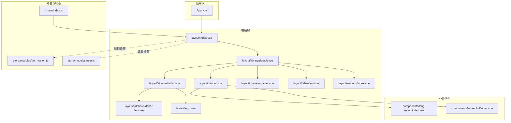

**图表来源**
- [src/App.vue:1-35](file://src/App.vue#L1-L35)
- [src/layout/index.vue:1-32](file://src/layout/index.vue#L1-L32)
- [src/layout/library/default.vue:1-87](file://src/layout/library/default.vue#L1-L87)
- [src/layout/header.vue:1-270](file://src/layout/header.vue#L1-L270)
- [src/layout/sidebar/index.vue:1-142](file://src/layout/sidebar/index.vue#L1-L142)
- [src/layout/sidebar/sidebar-item.vue:1-107](file://src/layout/sidebar/sidebar-item.vue#L1-L107)
- [src/layout/logo.vue:1-89](file://src/layout/logo.vue#L1-L89)
- [src/layout/main-container.vue:1-109](file://src/layout/main-container.vue#L1-L109)
- [src/layout/tabs-view.vue:1-209](file://src/layout/tabs-view.vue#L1-L209)
- [src/layout/settings/index.vue:1-512](file://src/layout/settings/index.vue#L1-L512)
- [src/components/lang-select/index.vue:1-39](file://src/components/lang-select/index.vue#L1-L39)
- [src/components/screenfull/index.vue:1-53](file://src/components/screenfull/index.vue#L1-L53)
- [src/router/index.js:1-343](file://src/router/index.js#L1-L343)
- [src/store/modules/permission.js:1-187](file://src/store/modules/permission.js#L1-L187)
- [src/store/modules/user.js:1-154](file://src/store/modules/user.js#L1-L154)

**章节来源**
- [src/layout/index.vue:1-32](file://src/layout/index.vue#L1-L32)
- [src/layout/library/default.vue:1-87](file://src/layout/library/default.vue#L1-L87)
- [src/App.vue:1-35](file://src/App.vue#L1-L35)

## 核心组件
- 主布局容器：通过layout/index.vue按主题配置动态选择具体布局组件，默认指向library/default.vue
- 默认布局：library/default.vue组合header、sidebar、main-container、tabs-view等子组件，形成标准三段式布局
- 顶部导航：header.vue负责面包屑、设置抽屉、语言切换、用户下拉菜单等
- 侧边菜单：sidebar/index.vue渲染菜单树，sidebar-item.vue递归渲染菜单项与子菜单
- 主内容区：main-container.vue承载路由视图，支持标签页高度适配与页面切换动画
- 标签页：tabs-view.vue展示已访问页面，支持关闭与滚动
- 设置面板：settings/index.vue提供主题、布局、功能开关等配置项
- 公共组件：lang-select、screenfull等作为header的子组件使用

**章节来源**
- [src/layout/index.vue:15-30](file://src/layout/index.vue#L15-L30)
- [src/layout/library/default.vue:26-58](file://src/layout/library/default.vue#L26-L58)
- [src/layout/header.vue:80-173](file://src/layout/header.vue#L80-L173)
- [src/layout/sidebar/index.vue:22-60](file://src/layout/sidebar/index.vue#L22-L60)
- [src/layout/sidebar/sidebar-item.vue:42-105](file://src/layout/sidebar/sidebar-item.vue#L42-L105)
- [src/layout/main-container.vue:17-57](file://src/layout/main-container.vue#L17-L57)
- [src/layout/tabs-view.vue:20-81](file://src/layout/tabs-view.vue#L20-L81)
- [src/layout/settings/index.vue:192-305](file://src/layout/settings/index.vue#L192-L305)
- [src/components/lang-select/index.vue:14-31](file://src/components/lang-select/index.vue#L14-L31)
- [src/components/screenfull/index.vue:6-40](file://src/components/screenfull/index.vue#L6-L40)

## 架构总览
本项目采用“布局即组件”的思想，通过Vuex集中管理主题与布局配置，结合Vue Router的嵌套路由与动态路由，实现菜单、权限与页面的解耦。组件间通过props向下传递配置，通过actions/mutations向上反馈状态变化，形成清晰的单向数据流。

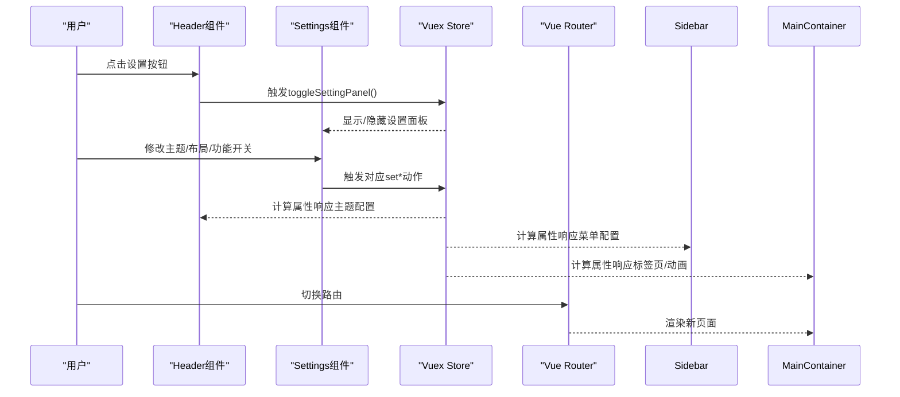

**图表来源**
- [src/layout/header.vue:115-124](file://src/layout/header.vue#L115-L124)
- [src/layout/settings/index.vue:207-304](file://src/layout/settings/index.vue#L207-L304)
- [src/layout/main-container.vue:25-57](file://src/layout/main-container.vue#L25-L57)
- [src/router/index.js:322-342](file://src/router/index.js#L322-L342)

## 详细组件分析

### 主布局组件 index.vue 设计理念
- 动态布局选择：通过映射layouts与Vuex中的themeConfig.layout联动，运行时决定渲染哪个布局组件
- 松耦合：仅导入默认布局，便于后续扩展classic、transverse、columns等布局
- 与设置联动：布局切换与主题配置均来自Vuex，保证UI一致性

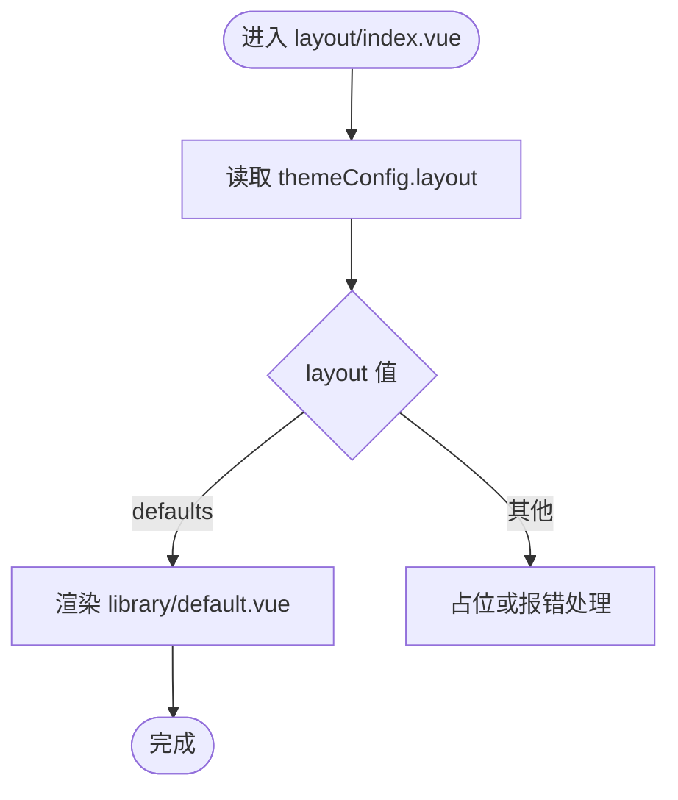

**图表来源**
- [src/layout/index.vue:15-29](file://src/layout/index.vue#L15-L29)

**章节来源**
- [src/layout/index.vue:5-30](file://src/layout/index.vue#L5-L30)

### 默认布局 default.vue 的层次结构与职责
- 结构职责分离：header负责顶部导航，sidebar负责左侧菜单，main-container负责内容区，tabs-view可选展示
- 滚动同步：监听路由变化，更新多处滚动条，确保滚动位置正确
- 主题配置：通过Vuex读取主题配置，影响各子组件行为

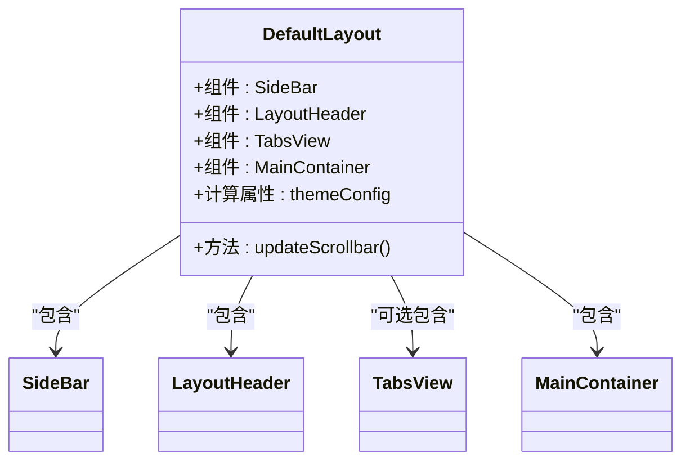

**图表来源**
- [src/layout/library/default.vue:26-58](file://src/layout/library/default.vue#L26-L58)

**章节来源**
- [src/layout/library/default.vue:19-58](file://src/layout/library/default.vue#L19-L58)

### 顶部导航 header.vue 的协作机制
- 面包屑：根据路由匹配结果动态生成，支持图标与标题国际化
- 设置抽屉：通过Vuex开关控制设置面板显示
- 用户下拉：头像、用户名、下拉菜单项（个人资料、GitHub链接、退出登录）
- 侧边栏折叠：通过Vuex切换菜单展开/收起

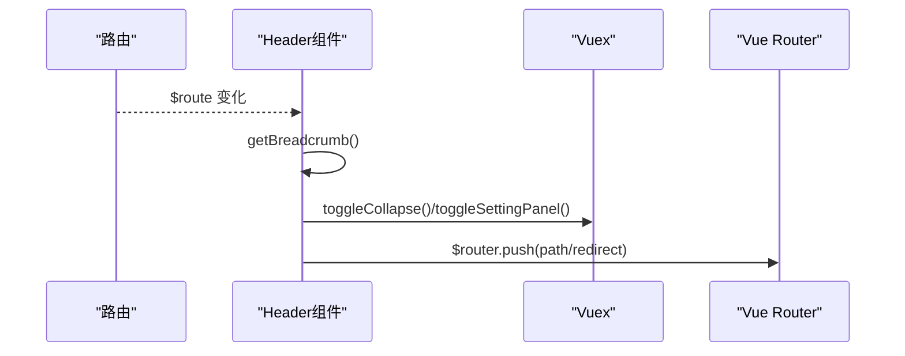

**图表来源**
- [src/layout/header.vue:101-153](file://src/layout/header.vue#L101-L153)
- [src/layout/header.vue:110-124](file://src/layout/header.vue#L110-L124)

**章节来源**
- [src/layout/header.vue:74-173](file://src/layout/header.vue#L74-L173)

### 侧边栏 sidebar/index.vue 与菜单项 sidebar-item.vue
- 菜单渲染：根据Vuex中的routers生成菜单树，支持手风琴与展开/收起
- Logo集成：Logo组件在展开时显示，点击可触发菜单折叠
- 递归渲染：sidebar-item.vue根据children递归渲染子菜单，支持“单子路由提升”逻辑

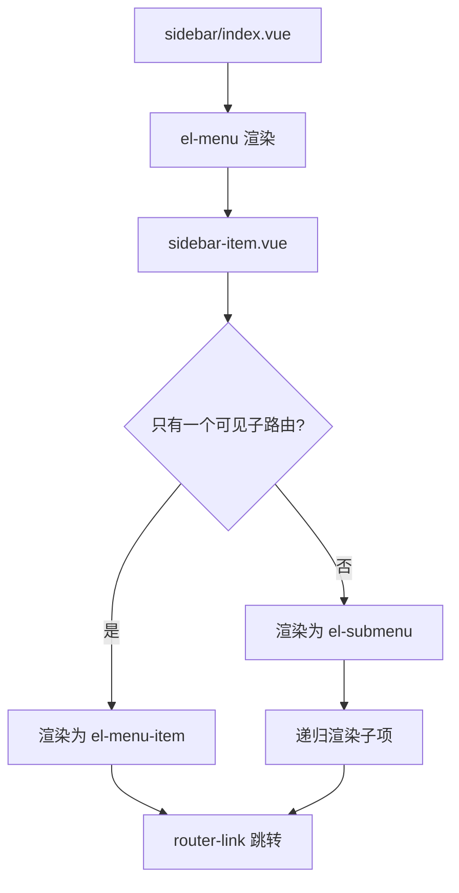

**图表来源**
- [src/layout/sidebar/index.vue:5-14](file://src/layout/sidebar/index.vue#L5-L14)
- [src/layout/sidebar/sidebar-item.vue:64-94](file://src/layout/sidebar/sidebar-item.vue#L64-L94)

**章节来源**
- [src/layout/sidebar/index.vue:17-60](file://src/layout/sidebar/index.vue#L17-L60)
- [src/layout/sidebar/sidebar-item.vue:38-105](file://src/layout/sidebar/sidebar-item.vue#L38-L105)

### 主内容区 main-container.vue 的数据流
- 高度适配：根据是否启用标签页动态计算高度
- 页面切换动画：根据主题配置选择不同过渡动画
- 视图缓存：根据配置决定是否缓存页面

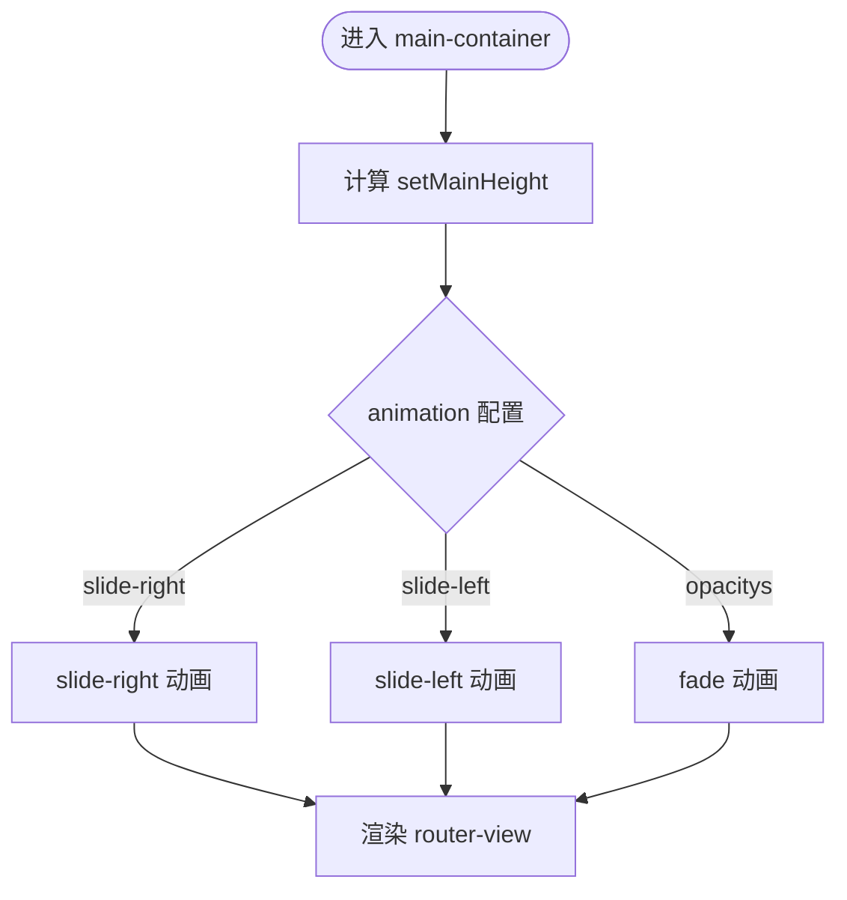

**图表来源**
- [src/layout/main-container.vue:25-57](file://src/layout/main-container.vue#L25-L57)

**章节来源**
- [src/layout/main-container.vue:15-57](file://src/layout/main-container.vue#L15-L57)

### 标签页 tabs-view.vue 的生命周期与交互
- 生命周期：created时生成当前路由标签，watch $route时动态增删
- 交互：点击标签跳转，关闭标签时回退到上一个标签或首页
- 滚动：支持鼠标滚轮横向滚动

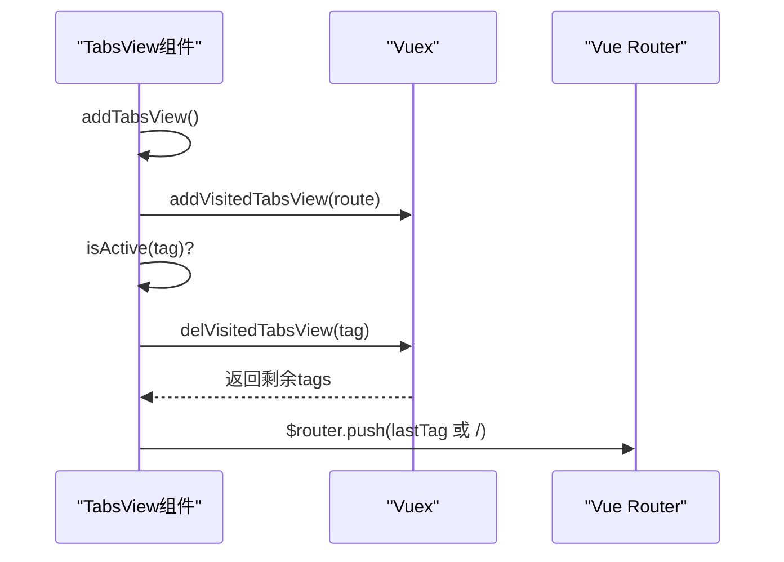

**图表来源**
- [src/layout/tabs-view.vue:34-81](file://src/layout/tabs-view.vue#L34-L81)

**章节来源**
- [src/layout/tabs-view.vue:18-81](file://src/layout/tabs-view.vue#L18-L81)

### 设置面板 settings/index.vue 的配置项与主题切换
- 主题：主色、深色模式、Logo显示、页脚显示
- 界面：侧边栏折叠、菜单手风琴
- 面包屑：开关与图标
- 标签页：开关、图标、缓存、样式
- 布局：默认、经典、横向、分栏
- 动画：滑入/滑出/淡入淡出
- 重置：恢复默认设置

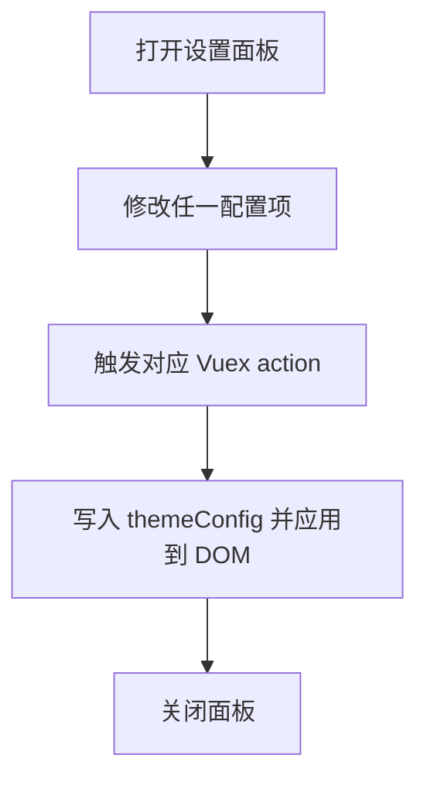

**图表来源**
- [src/layout/settings/index.vue:192-305](file://src/layout/settings/index.vue#L192-L305)

**章节来源**
- [src/layout/settings/index.vue:1-512](file://src/layout/settings/index.vue#L1-L512)

### 组件间通信方式
- Props传递：sidebar-item接收item与basePath；logo接收主题配置；tabs-view接收visitedTabsView
- 事件触发：header通过Vuex actions触发菜单折叠、设置面板开关；settings通过actions写入主题配置
- 插槽使用：Element UI的dropdown使用slot="dropdown"；tabs-view内部使用router-link与el-tag
- 全局状态：header、sidebar、main-container、tabs-view、settings均通过mapGetters/mapActions读取/写入Vuex

**章节来源**
- [src/layout/sidebar/sidebar-item.vue:47-57](file://src/layout/sidebar/sidebar-item.vue#L47-L57)
- [src/layout/logo.vue:21-31](file://src/layout/logo.vue#L21-L31)
- [src/layout/tabs-view.vue:28-32](file://src/layout/tabs-view.vue#L28-L32)
- [src/layout/header.vue:86-94](file://src/layout/header.vue#L86-L94)
- [src/layout/settings/index.vue:193-200](file://src/layout/settings/index.vue#L193-L200)

### 复用策略与扩展机制
- 布局扩展：在layout/index.vue的layouts映射中新增键值对，即可无缝接入新布局组件
- 菜单扩展：通过router/index.js的asyncRoutes与permission模块，动态注入菜单与页面路由
- 主题扩展：settings/index.vue提供丰富的主题与布局开关，配合CSS变量实现主题切换
- 组件复用：lang-select、screenfull等公共组件在header中复用，降低重复开发成本

**章节来源**
- [src/layout/index.vue:15-17](file://src/layout/index.vue#L15-L17)
- [src/router/index.js:117-320](file://src/router/index.js#L117-L320)
- [src/store/modules/permission.js:143-178](file://src/store/modules/permission.js#L143-L178)
- [src/layout/settings/index.vue:192-305](file://src/layout/settings/index.vue#L192-L305)

## 依赖关系分析
- 布局依赖：App.vue -> layout/index.vue -> library/default.vue -> 各子组件
- 路由依赖：router/index.js定义常量路由与动态路由，layout/index.vue作为主布局承载
- 状态依赖：各布局组件通过Vuex读取/写入主题配置、用户信息、权限、标签页等
- 权限依赖：permission模块根据后端返回的权限过滤动态路由，再由router注入

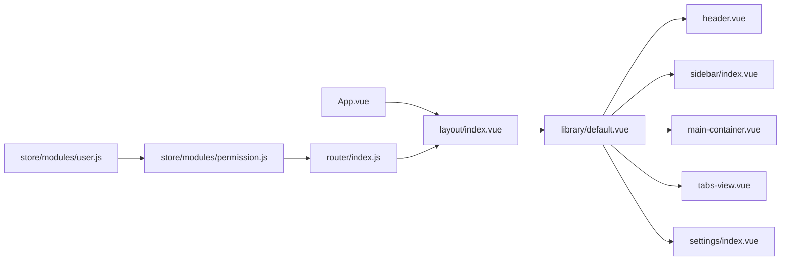

**图表来源**
- [src/App.vue:8-23](file://src/App.vue#L8-L23)
- [src/layout/index.vue:5-30](file://src/layout/index.vue#L5-L30)
- [src/layout/library/default.vue:19-58](file://src/layout/library/default.vue#L19-L58)
- [src/router/index.js:322-342](file://src/router/index.js#L322-L342)
- [src/store/modules/permission.js:133-178](file://src/store/modules/permission.js#L133-L178)
- [src/store/modules/user.js:52-145](file://src/store/modules/user.js#L52-L145)

**章节来源**
- [src/App.vue:8-23](file://src/App.vue#L8-L23)
- [src/layout/index.vue:5-30](file://src/layout/index.vue#L5-L30)
- [src/router/index.js:322-342](file://src/router/index.js#L322-L342)
- [src/store/modules/permission.js:133-178](file://src/store/modules/permission.js#L133-L178)
- [src/store/modules/user.js:52-145](file://src/store/modules/user.js#L52-L145)

## 性能考量
- 路由切换动画：main-container根据配置选择轻量过渡，减少不必要的重绘
- Keep-alive缓存：根据isCacheTagsView决定缓存范围，平衡内存占用与切换体验
- 滚动同步：default.vue在路由切换后延迟更新滚动条，避免DOM未就绪导致的异常
- 菜单渲染：sidebar-item对“单子路由提升”逻辑进行优化，减少DOM层级与渲染开销

[本节为通用指导，无需列出具体文件来源]

## 故障排查指南
- 设置面板无效：检查Vuex actions是否正确触发，确认settings/index.vue的mapActions绑定
- 菜单不显示：检查permission模块过滤逻辑与router配置，确认hasPermission匹配规则
- 标签页关闭异常：检查tabs-view的isActive与delVisitedTabsView流程，确保lastTag存在
- 退出登录后仍保留状态：确认user模块logout是否清空token与sessionStorage，并重置router

**章节来源**
- [src/layout/settings/index.vue:207-304](file://src/layout/settings/index.vue#L207-L304)
- [src/store/modules/permission.js:22-54](file://src/store/modules/permission.js#L22-L54)
- [src/layout/tabs-view.vue:54-81](file://src/layout/tabs-view.vue#L54-L81)
- [src/store/modules/user.js:91-110](file://src/store/modules/user.js#L91-L110)

## 结论
本项目通过“布局即组件”的架构设计，实现了布局、菜单、主题与页面的高内聚低耦合。借助Vuex统一管理配置与状态，结合Vue Router的动态路由与嵌套路由，形成了可扩展、可维护的前端布局体系。建议在后续迭代中持续完善权限过滤与菜单渲染的边界场景，同时探索更多布局变体与主题定制能力。

[本节为总结性内容，无需列出具体文件来源]

## 附录
- 组件树结构图（概念示意）
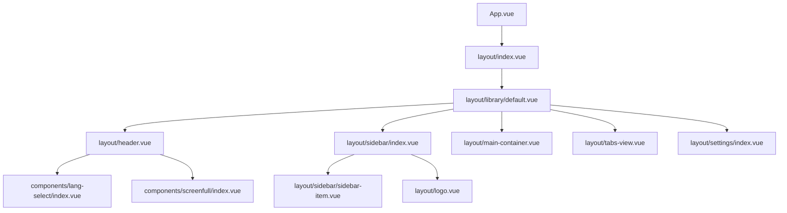

[本图为概念示意，不对应具体源码结构，故不提供图表来源]