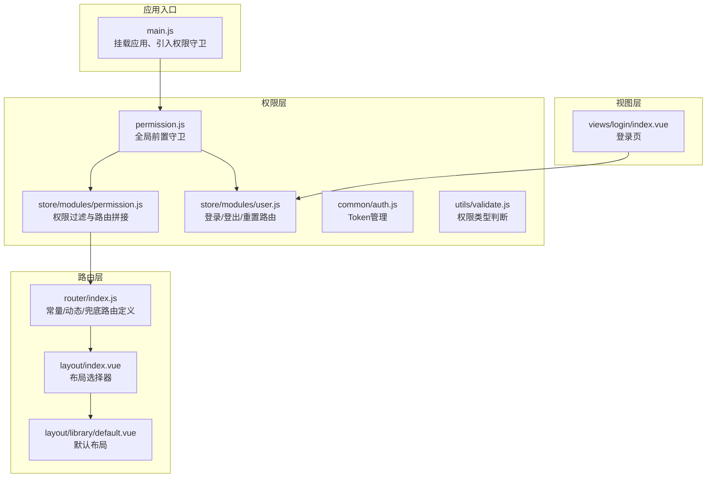
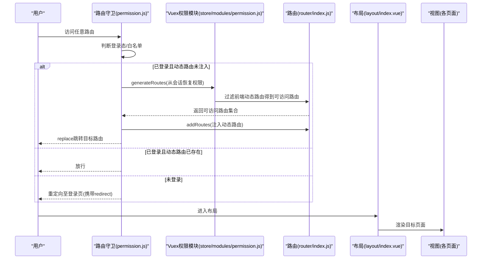
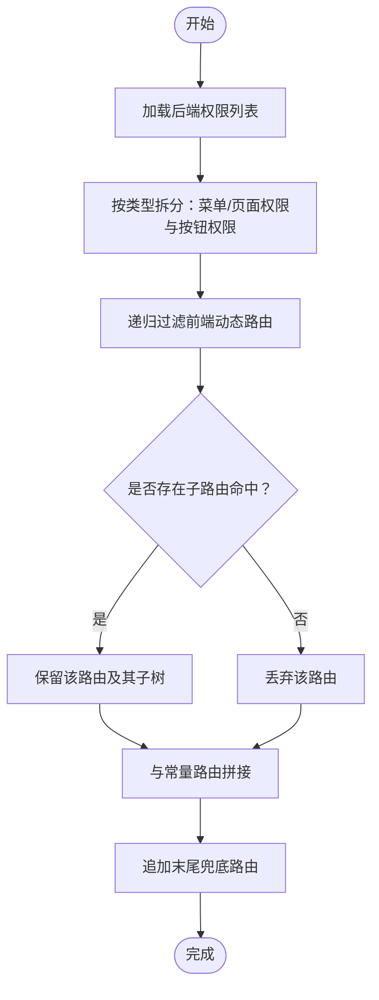
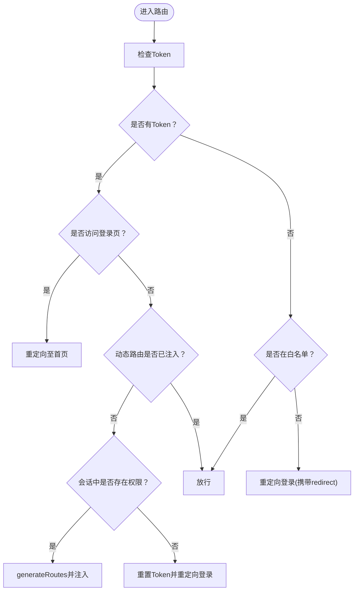
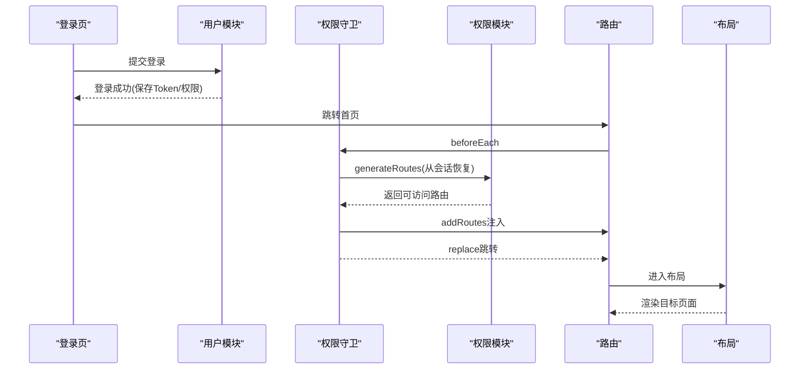
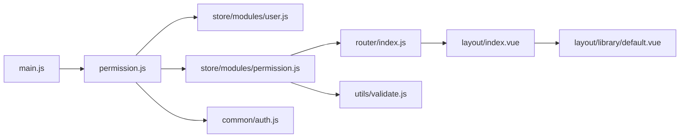

# 路由架构

<cite>
**本文引用的文件列表**
- [router/index.js](file://src/router/index.js)
- [permission.js](file://src/permission.js)
- [store/modules/permission.js](file://src/store/modules/permission.js)
- [store/modules/user.js](file://src/store/modules/user.js)
- [common/auth.js](file://src/common/auth.js)
- [utils/validate.js](file://src/utils/validate.js)
- [main.js](file://src/main.js)
- [layout/index.vue](file://src/layout/index.vue)
- [layout/library/default.vue](file://src/layout/library/default.vue)
- [views/login/index.vue](file://src/views/login/index.vue)
- [vue.config.js](file://vue.config.js)
</cite>

## 目录
1. [简介](#简介)
2. [项目结构](#项目结构)
3. [核心组件](#核心组件)
4. [架构总览](#架构总览)
5. [详细组件分析](#详细组件分析)
6. [依赖关系分析](#依赖关系分析)
7. [性能考量](#性能考量)
8. [故障排查指南](#故障排查指南)
9. [结论](#结论)
10. [附录](#附录)

## 简介
本文件面向Vue CMS项目的路由架构，围绕基于Vue Router的路由系统进行系统化说明，重点涵盖：
- 路由配置的层次结构：静态常量路由、动态路由与末尾兜底路由的划分与职责
- 动态路由的实现原理与权限控制机制：如何根据用户权限动态生成可访问路由
- 权限守卫的实现逻辑：从登录态判断、动态路由注入到页面访问的完整链路
- 路由懒加载与代码分割策略：结合打包配置提升首屏性能
- 嵌套路由与重定向机制：父子路由、多层嵌套与重定向的组织方式
- 权限验证流程图：从用户登录到页面访问的关键步骤与决策点

## 项目结构
本项目采用“路由配置 + 权限守卫 + Vuex权限模块”的分层设计：
- 路由配置集中于路由模块，分为常量路由、动态路由与末尾兜底路由三部分
- 权限守卫在进入路由前执行，负责登录态校验与动态路由注入
- Vuex权限模块负责将后端返回的权限与前端路由表进行匹配，生成最终可访问路由集合
- 布局组件统一承载菜单、头部、标签页与主内容区域

**图表来源**
- [main.js:25](file://src/main.js#L25)
- [router/index.js:43](file://src/router/index.js#L43)
- [permission.js:23](file://src/permission.js#L23)
- [store/modules/permission.js:4](file://src/store/modules/permission.js#L4)
- [store/modules/user.js:14](file://src/store/modules/user.js#L14)
- [common/auth.js:5](file://src/common/auth.js#L5)
- [utils/validate.js:25](file://src/utils/validate.js#L25)
- [layout/index.vue:15](file://src/layout/index.vue#L15)
- [layout/library/default.vue:6](file://src/layout/library/default.vue#L6)
- [views/login/index.vue:118](file://src/views/login/index.vue#L118)

**章节来源**
- [main.js:25](file://src/main.js#L25)
- [router/index.js:43](file://src/router/index.js#L43)
- [permission.js:23](file://src/permission.js#L23)
- [store/modules/permission.js:4](file://src/store/modules/permission.js#L4)
- [store/modules/user.js:14](file://src/store/modules/user.js#L14)
- [common/auth.js:5](file://src/common/auth.js#L5)
- [utils/validate.js:25](file://src/utils/validate.js#L25)
- [layout/index.vue:15](file://src/layout/index.vue#L15)
- [layout/library/default.vue:6](file://src/layout/library/default.vue#L6)
- [views/login/index.vue:118](file://src/views/login/index.vue#L118)

## 核心组件
- 路由配置层
  - 常量路由：无需登录即可访问的基础页面（如首页、登录、重定向、404等）
  - 动态路由：按用户权限开放的业务页面，前端静态配置，后端返回权限进行匹配
  - 末尾兜底路由：404、无权限、通配符未匹配等兜底页面
- 权限守卫层
  - 前置守卫：判断登录态、白名单、动态路由是否已注入，并在必要时从会话恢复或重新生成
  - 后置守卫：进度条结束、页面标题设置
- 权限模块层
  - 路由过滤：将后端返回的权限与前端动态路由进行匹配，保留用户有权限的路由及子路由
  - 菜单与按钮权限：区分菜单/页面权限与按钮权限，分别用于菜单渲染与按钮显隐
- 布局与视图层
  - 布局组件：统一承载侧边栏、头部、标签页与主内容区
  - 登录视图：触发登录流程，登录成功后跳转首页

**章节来源**
- [router/index.js:43](file://src/router/index.js#L43)
- [router/index.js:118](file://src/router/index.js#L118)
- [router/index.js:80](file://src/router/index.js#L80)
- [permission.js:23](file://src/permission.js#L23)
- [store/modules/permission.js:147](file://src/store/modules/permission.js#L147)
- [store/modules/permission.js:133](file://src/store/modules/permission.js#L133)
- [layout/index.vue:15](file://src/layout/index.vue#L15)
- [layout/library/default.vue:6](file://src/layout/library/default.vue#L6)
- [views/login/index.vue:118](file://src/views/login/index.vue#L118)

## 架构总览
下图展示了从用户访问任意页面到最终渲染的完整链路，包括登录态判断、动态路由注入与页面渲染。

**图表来源**
- [permission.js:23](file://src/permission.js#L23)
- [store/modules/permission.js:147](file://src/store/modules/permission.js#L147)
- [router/index.js:322](file://src/router/index.js#L322)
- [layout/index.vue:15](file://src/layout/index.vue#L15)

## 详细组件分析

### 路由配置层次与属性说明
- 常量路由（constantRoutes）
  - 职责：无需登录即可访问的基础页面，如首页、登录、重定向、404等
  - 特点：始终存在于路由表中，不随用户权限变化
- 动态路由（asyncRoutes）
  - 职责：按用户权限开放的业务页面，前端静态配置，后端返回权限进行匹配
  - 特点：通过权限过滤后注入，支持嵌套与重定向
- 末尾兜底路由（endBasicRoutes）
  - 职责：404、无权限、通配符兜底页面，始终置于路由表末尾
- 路由属性要点
  - alwaysShow：控制父级菜单是否总是显示
  - hidden：控制菜单是否显示
  - meta：包含图标、标题、缓存等元信息
  - isKeepAlive/isIframe：组件缓存与内嵌窗口标识
  - 路径：父子路由均需使用完整路径

**章节来源**
- [router/index.js:43](file://src/router/index.js#L43)
- [router/index.js:118](file://src/router/index.js#L118)
- [router/index.js:80](file://src/router/index.js#L80)
- [router/index.js:14](file://src/router/index.js#L14)

### 动态路由与权限控制机制
- 权限来源
  - 后端返回的权限列表包含菜单/页面/按钮三类权限
  - 前端通过类型判断函数区分菜单/页面与按钮权限
- 路由过滤
  - 使用递归过滤算法，将后端权限与前端动态路由进行匹配
  - 若某路由或其子路由命中权限，则保留整条分支
- 路由拼接
  - 将过滤后的动态路由与常量路由拼接，并追加末尾兜底路由
- 注入时机
  - 首次登录后或刷新页面时，若发现动态路由为空，则从会话恢复权限并注入

**图表来源**
- [store/modules/permission.js:147](file://src/store/modules/permission.js#L147)
- [store/modules/permission.js:41](file://src/store/modules/permission.js#L41)
- [utils/validate.js:43](file://src/utils/validate.js#L43)

**章节来源**
- [store/modules/permission.js:147](file://src/store/modules/permission.js#L147)
- [store/modules/permission.js:41](file://src/store/modules/permission.js#L41)
- [utils/validate.js:43](file://src/utils/validate.js#L43)

### 权限守卫实现逻辑
- 登录态判断
  - 通过Token判断是否已登录
  - 已登录访问登录页时重定向至首页
- 动态路由注入
  - 若动态路由为空且会话中存在权限，则从会话恢复并注入
  - 注入后使用replace避免历史记录
- 白名单处理
  - 对白名单内的页面直接放行
- 错误处理
  - 注入失败或会话异常时，重置Token并引导重新登录

**图表来源**
- [permission.js:23](file://src/permission.js#L23)
- [store/modules/permission.js:147](file://src/store/modules/permission.js#L147)

**章节来源**
- [permission.js:23](file://src/permission.js#L23)

### 嵌套路由与重定向机制
- 嵌套路由
  - 支持多层级子路由，父级可通过alwaysShow控制是否显示自身
  - 子路由使用完整路径，确保匹配与渲染正确
- 重定向
  - 父级路由可设置redirect指向子路由，提升用户体验
  - 重定向页面位于常量路由中，保证可访问性

**章节来源**
- [router/index.js:138](file://src/router/index.js#L138)
- [router/index.js:230](file://src/router/index.js#L230)
- [router/index.js:58](file://src/router/index.js#L58)

### 路由懒加载与代码分割
- 路由懒加载
  - 动态导入组件，实现按需加载，降低首屏体积
- 代码分割策略
  - Webpack分包配置：第三方库、Element UI、通用组件等独立分包
  - 单独运行时：启用runtimeChunk以提升缓存命中率
  - 生产环境移除无意义的prefetch插件，避免过度请求

**章节来源**
- [router/index.js:52](file://src/router/index.js#L52)
- [router/index.js:166](file://src/router/index.js#L166)
- [router/index.js:284](file://src/router/index.js#L284)
- [vue.config.js:116](file://vue.config.js#L116)
- [vue.config.js:140](file://vue.config.js#L140)

### 登录到页面访问的完整链路
- 登录流程
  - 登录页提交凭据，调用用户模块登录动作
  - 成功后保存Token与用户权限到会话，跳转首页
- 路由守卫
  - 首次进入首页时，若动态路由为空，从会话恢复并注入
  - 注入后replace跳转，避免历史记录
- 页面渲染
  - 布局组件统一承载菜单、头部与主内容区
  - 目标页面按路由懒加载方式渲染

**图表来源**
- [views/login/index.vue:118](file://src/views/login/index.vue#L118)
- [store/modules/user.js:54](file://src/store/modules/user.js#L54)
- [permission.js:23](file://src/permission.js#L23)
- [store/modules/permission.js:147](file://src/store/modules/permission.js#L147)
- [router/index.js:322](file://src/router/index.js#L322)
- [layout/index.vue:15](file://src/layout/index.vue#L15)

**章节来源**
- [views/login/index.vue:118](file://src/views/login/index.vue#L118)
- [store/modules/user.js:54](file://src/store/modules/user.js#L54)
- [permission.js:23](file://src/permission.js#L23)
- [store/modules/permission.js:147](file://src/store/modules/permission.js#L147)
- [router/index.js:322](file://src/router/index.js#L322)
- [layout/index.vue:15](file://src/layout/index.vue#L15)

## 依赖关系分析
- 组件耦合
  - main.js引入权限守卫，形成全局拦截
  - 权限守卫依赖Vuex用户与权限模块，以及路由实例
  - 权限模块依赖路由配置与权限类型判断工具
- 外部依赖
  - Element UI用于UI与进度条
  - js-cookie用于Token存储
  - Webpack分包配置用于性能优化

**图表来源**
- [main.js:25](file://src/main.js#L25)
- [permission.js:5](file://src/permission.js#L5)
- [store/modules/permission.js:4](file://src/store/modules/permission.js#L4)
- [store/modules/user.js:4](file://src/store/modules/user.js#L4)
- [common/auth.js:1](file://src/common/auth.js#L1)
- [utils/validate.js:5](file://src/utils/validate.js#L5)
- [router/index.js:5](file://src/router/index.js#L5)
- [layout/index.vue:6](file://src/layout/index.vue#L6)
- [layout/library/default.vue:21](file://src/layout/library/default.vue#L21)

**章节来源**
- [main.js:25](file://src/main.js#L25)
- [permission.js:5](file://src/permission.js#L5)
- [store/modules/permission.js:4](file://src/store/modules/permission.js#L4)
- [store/modules/user.js:4](file://src/store/modules/user.js#L4)
- [common/auth.js:1](file://src/common/auth.js#L1)
- [utils/validate.js:5](file://src/utils/validate.js#L5)
- [router/index.js:5](file://src/router/index.js#L5)
- [layout/index.vue:6](file://src/layout/index.vue#L6)
- [layout/library/default.vue:21](file://src/layout/library/default.vue#L21)

## 性能考量
- 路由懒加载
  - 使用动态导入组件，按需加载，显著降低首屏体积
- 代码分割
  - 第三方库、Element UI、通用组件独立分包，提升缓存复用
  - 单独runtimeChunk，减少重复代码
- 预加载与预取
  - 开发环境可考虑关键资源预加载，生产环境移除无意义的prefetch
- 进度条与页面标题
  - 前置守卫中开启进度条，后置守卫中结束，提升交互体验

**章节来源**
- [router/index.js:52](file://src/router/index.js#L52)
- [router/index.js:166](file://src/router/index.js#L166)
- [router/index.js:284](file://src/router/index.js#L284)
- [vue.config.js:116](file://vue.config.js#L116)
- [vue.config.js:140](file://vue.config.js#L140)

## 故障排查指南
- 登录后无法进入业务页面
  - 检查会话中是否保存了用户权限
  - 确认权限模块是否正确过滤并注入动态路由
  - 查看路由守卫是否抛出异常并重置Token
- 404或无权限页面频繁出现
  - 检查后端返回的权限类型是否正确
  - 确认前端动态路由与后端address字段匹配规则
- 刷新后路由丢失
  - 确认resetRouter是否被调用
  - 检查会话存储是否被清理

**章节来源**
- [store/modules/user.js:136](file://src/store/modules/user.js#L136)
- [store/modules/permission.js:147](file://src/store/modules/permission.js#L147)
- [permission.js:40](file://src/permission.js#L40)

## 结论
本项目的路由架构通过“常量路由 + 动态路由 + 兜底路由”的清晰分层，配合全局前置守卫与Vuex权限模块，实现了灵活的权限控制与良好的用户体验。动态路由与懒加载结合Webpack分包策略，在保证功能完整性的同时显著提升了性能。嵌套路由与重定向机制完善了导航体验，而完善的错误处理与会话恢复机制增强了系统的健壮性。

## 附录
- 路由配置示例（路径参考）
  - 常量路由：[router/index.js:43](file://src/router/index.js#L43)
  - 动态路由：[router/index.js:118](file://src/router/index.js#L118)
  - 末尾兜底路由：[router/index.js:80](file://src/router/index.js#L80)
- 权限守卫示例（路径参考）
  - 全局前置守卫：[permission.js:23](file://src/permission.js#L23)
- 权限模块示例（路径参考）
  - 权限过滤与路由拼接：[store/modules/permission.js:147](file://src/store/modules/permission.js#L147)
- 布局与视图示例（路径参考）
  - 布局选择器：[layout/index.vue:15](file://src/layout/index.vue#L15)
  - 默认布局：[layout/library/default.vue:6](file://src/layout/library/default.vue#L6)
  - 登录页：[views/login/index.vue:118](file://src/views/login/index.vue#L118)
- 打包配置示例（路径参考）
  - 代码分割与runtimeChunk：[vue.config.js:116](file://vue.config.js#L116), [vue.config.js:140](file://vue.config.js#L140)