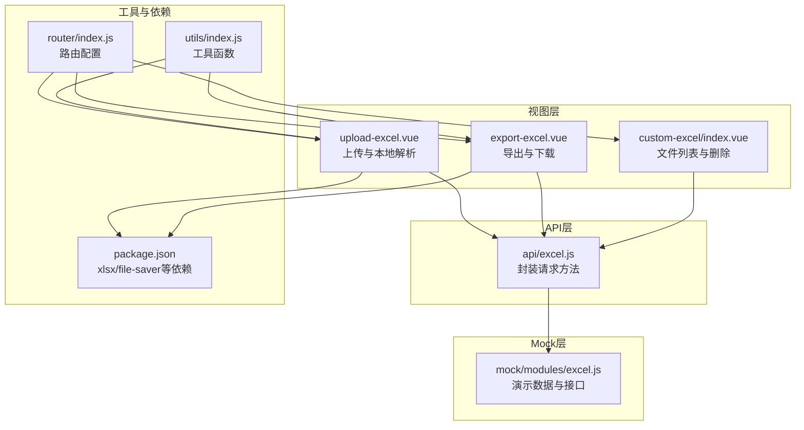
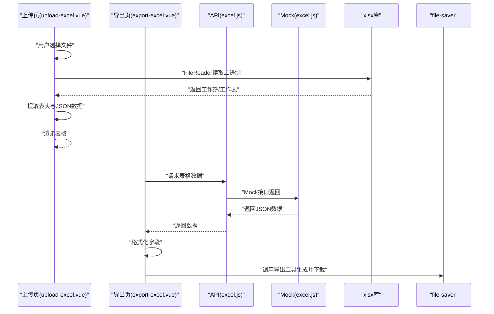
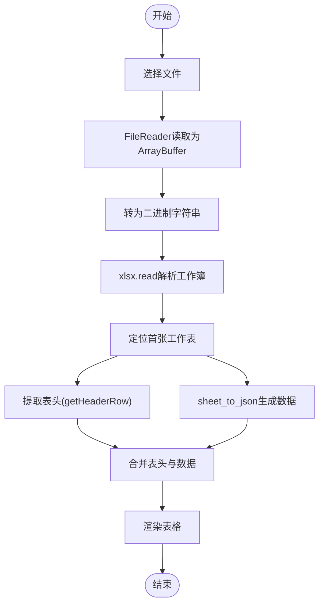
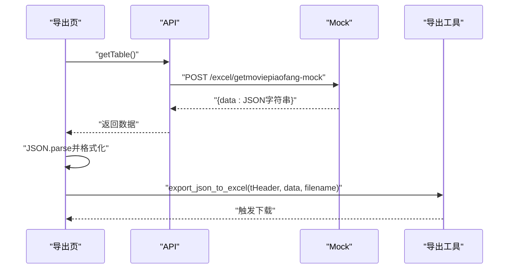
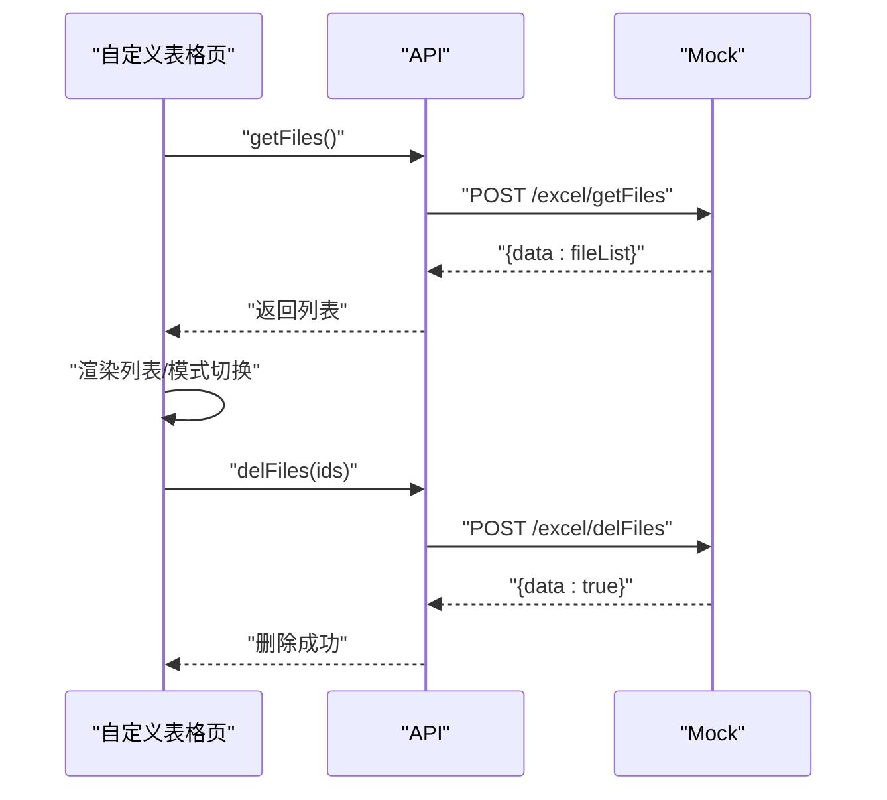
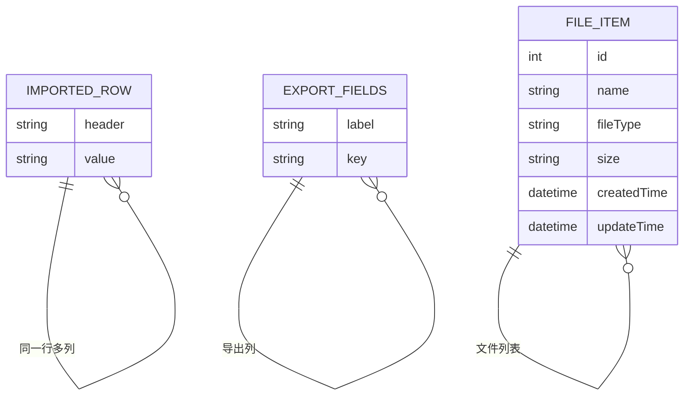
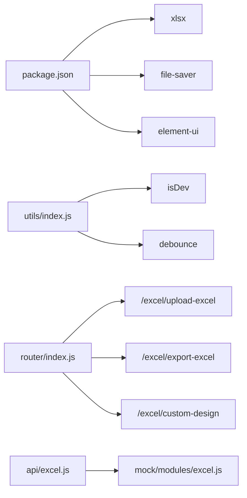

# Excel导入导出

<cite>
**本文引用的文件**
- [src/views/excel/upload-excel.vue](file://src/views/excel/upload-excel.vue)
- [src/views/excel/export-excel.vue](file://src/views/excel/export-excel.vue)
- [src/api/excel.js](file://src/api/excel.js)
- [src/mock/modules/excel.js](file://src/mock/modules/excel.js)
- [src/views/excel/custom-excel/index.vue](file://src/views/excel/custom-excel/index.vue)
- [src/views/excel/custom-excel/children/_mixin.js](file://src/views/excel/custom-excel/children/_mixin.js)
- [src/router/index.js](file://src/router/index.js)
- [src/utils/index.js](file://src/utils/index.js)
- [package.json](file://package.json)
</cite>

## 目录
1. [简介](#简介)
2. [项目结构](#项目结构)
3. [核心组件](#核心组件)
4. [架构总览](#架构总览)
5. [详细组件分析](#详细组件分析)
6. [依赖分析](#依赖分析)
7. [性能考虑](#性能考虑)
8. [故障排查指南](#故障排查指南)
9. [结论](#结论)
10. [附录](#附录)

## 简介
本文件系统性梳理并说明本仓库中Excel导入与导出功能的实现与使用方式，覆盖以下方面：
- 导入：文件上传、格式校验、本地解析、数据展示与后续处理
- 导出：数据准备、标题映射、模板化输出、浏览器下载
- 安全与限制：前端可执行的格式与大小约束、数据清洗建议
- 接口文档：API请求参数、响应格式与错误码说明
- 数据转换：日期格式、数值精度、特殊字符处理策略
- 性能优化：大文件分块、节流与防抖、内存管理
- 扩展指南：如何接入后端、如何自定义列、如何扩展导入/导出能力

## 项目结构
Excel相关功能主要分布在以下模块：
- 视图层：上传页、导出页、自定义表格页
- API层：封装Excel相关请求
- Mock层：提供演示数据与接口占位
- 工具层：通用工具与环境判断
- 依赖：xlsx（读取）、file-saver（保存）、Element UI（上传/表格）

图表来源
- [src/views/excel/upload-excel.vue:1-130](file://src/views/excel/upload-excel.vue#L1-L130)
- [src/views/excel/export-excel.vue:1-172](file://src/views/excel/export-excel.vue#L1-L172)
- [src/views/excel/custom-excel/index.vue:1-205](file://src/views/excel/custom-excel/index.vue#L1-L205)
- [src/api/excel.js:1-38](file://src/api/excel.js#L1-L38)
- [src/mock/modules/excel.js:1-93](file://src/mock/modules/excel.js#L1-L93)
- [src/router/index.js:164-207](file://src/router/index.js#L164-L207)
- [src/utils/index.js:1-122](file://src/utils/index.js#L1-L122)
- [package.json:33-64](file://package.json#L33-L64)

章节来源
- [src/router/index.js:164-207](file://src/router/index.js#L164-L207)
- [package.json:33-64](file://package.json#L33-L64)

## 核心组件
- 上传组件（本地解析）：基于 Element Upload 组件与 xlsx 库，读取二进制数据并解析首张工作表，提取表头与JSON数据，供表格展示。
- 导出组件（浏览器导出）：从后端拉取数据，按预设字段映射生成二维数组，调用导出工具生成Excel并触发下载。
- 文件列表组件（自定义表格）：展示文件列表，支持删除与切换展示模式。

章节来源
- [src/views/excel/upload-excel.vue:1-130](file://src/views/excel/upload-excel.vue#L1-L130)
- [src/views/excel/export-excel.vue:1-172](file://src/views/excel/export-excel.vue#L1-L172)
- [src/views/excel/custom-excel/index.vue:1-205](file://src/views/excel/custom-excel/index.vue#L1-L205)

## 架构总览
下图展示了从前端到后端的数据流与交互关系：

图表来源
- [src/views/excel/upload-excel.vue:42-92](file://src/views/excel/upload-excel.vue#L42-L92)
- [src/views/excel/export-excel.vue:55-123](file://src/views/excel/export-excel.vue#L55-L123)
- [src/api/excel.js:5-18](file://src/api/excel.js#L5-L18)
- [src/mock/modules/excel.js:58-73](file://src/mock/modules/excel.js#L58-L73)

## 详细组件分析

### 上传组件（本地解析）
- 功能要点
  - 使用 Element Upload 的拖拽/点击上传，限制单个文件、接受 .xlsx/.xls
  - 通过 FileReader 读取文件为 ArrayBuffer，再转为二进制字符串交由 xlsx 解析
  - 读取首张工作表，提取表头与JSON数据，渲染到表格
  - 提供修复二进制数据的方法（兼容旧版本处理逻辑）
- 关键流程

图表来源
- [src/views/excel/upload-excel.vue:42-92](file://src/views/excel/upload-excel.vue#L42-L92)

章节来源
- [src/views/excel/upload-excel.vue:1-130](file://src/views/excel/upload-excel.vue#L1-L130)

### 导出组件（浏览器导出）
- 功能要点
  - 从后端获取数据，解析并格式化字段
  - 预设导出标题与字段映射，调用导出工具生成Excel并下载
  - 支持进度条与定时刷新提示
- 关键流程

图表来源
- [src/views/excel/export-excel.vue:55-123](file://src/views/excel/export-excel.vue#L55-L123)
- [src/api/excel.js:5-10](file://src/api/excel.js#L5-L10)
- [src/mock/modules/excel.js:58-64](file://src/mock/modules/excel.js#L58-L64)

章节来源
- [src/views/excel/export-excel.vue:1-172](file://src/views/excel/export-excel.vue#L1-L172)
- [src/api/excel.js:1-38](file://src/api/excel.js#L1-L38)
- [src/mock/modules/excel.js:1-93](file://src/mock/modules/excel.js#L1-L93)

### 文件列表组件（自定义表格）
- 功能要点
  - 展示文件列表，支持列表/精简两种模式切换
  - 多选删除，删除前二次确认
  - 调用后端接口获取/删除文件
- 关键流程

图表来源
- [src/views/excel/custom-excel/index.vue:74-113](file://src/views/excel/custom-excel/index.vue#L74-L113)
- [src/api/excel.js:24-37](file://src/api/excel.js#L24-L37)
- [src/mock/modules/excel.js:74-91](file://src/mock/modules/excel.js#L74-L91)

章节来源
- [src/views/excel/custom-excel/index.vue:1-205](file://src/views/excel/custom-excel/index.vue#L1-L205)
- [src/api/excel.js:20-37](file://src/api/excel.js#L20-L37)
- [src/mock/modules/excel.js:74-91](file://src/mock/modules/excel.js#L74-L91)

### 数据模型与字段映射
- 导入侧：表头来自首行单元格，数据为每行对象集合
- 导出侧：预设字段映射，如“影片”、“上映天数”、“累计票房”等
- 自定义表格侧：文件列表字段包含名称、类型、大小、时间等

图表来源
- [src/views/excel/upload-excel.vue:79-92](file://src/views/excel/upload-excel.vue#L79-L92)
- [src/views/excel/export-excel.vue:83-112](file://src/views/excel/export-excel.vue#L83-L112)
- [src/mock/modules/excel.js:34-53](file://src/mock/modules/excel.js#L34-L53)

章节来源
- [src/views/excel/upload-excel.vue:79-92](file://src/views/excel/upload-excel.vue#L79-L92)
- [src/views/excel/export-excel.vue:83-112](file://src/views/excel/export-excel.vue#L83-L112)
- [src/mock/modules/excel.js:34-53](file://src/mock/modules/excel.js#L34-L53)

## 依赖分析
- 前端依赖
  - xlsx：读取Excel文件（导入）、解析工作簿与工作表
  - file-saver：浏览器端保存Blob为文件（导出）
  - element-ui：上传、表格、对话框等UI组件
- 工具与环境
  - utils/index.js：提供环境判断、防抖等工具
- Mock与路由
  - mock/modules/excel.js：提供演示数据与接口占位
  - router/index.js：注册Excel相关页面路由

图表来源
- [package.json:33-64](file://package.json#L33-L64)
- [src/utils/index.js:4-44](file://src/utils/index.js#L4-L44)
- [src/router/index.js:164-207](file://src/router/index.js#L164-L207)
- [src/api/excel.js:1-38](file://src/api/excel.js#L1-L38)
- [src/mock/modules/excel.js:58-91](file://src/mock/modules/excel.js#L58-L91)

章节来源
- [package.json:33-64](file://package.json#L33-L64)
- [src/utils/index.js:1-122](file://src/utils/index.js#L1-L122)
- [src/router/index.js:164-207](file://src/router/index.js#L164-L207)
- [src/api/excel.js:1-38](file://src/api/excel.js#L1-L38)
- [src/mock/modules/excel.js:1-93](file://src/mock/modules/excel.js#L1-L93)

## 性能考虑
- 导入侧
  - 本地解析：大文件会占用较多内存，建议对超大文件进行提示或引导后端处理
  - 二进制拼接：已提供修复二进制的辅助方法，便于兼容不同版本
- 导出侧
  - 数据量大时，建议在后端生成Excel并提供下载链接，避免前端生成导致卡顿
  - 字段映射与格式化应尽量复用，减少重复计算
- 通用优化
  - 使用防抖/节流控制频繁操作（如刷新进度）
  - 合理设置表格宽度与列数量，避免渲染压力过大

[本节为通用指导，不直接分析具体文件]

## 故障排查指南
- 无法解析或报错
  - 确认文件为 .xlsx 或 .xls
  - 检查浏览器控制台是否有 xlsx 相关错误
  - 若文件异常，尝试使用修复二进制方法
- 导出空白或列错位
  - 确认字段映射与数据结构一致
  - 检查数据是否为空或字段缺失
- 删除失败
  - 确认后端接口返回状态与数据结构
  - 查看控制台错误日志

章节来源
- [src/views/excel/upload-excel.vue:71-78](file://src/views/excel/upload-excel.vue#L71-L78)
- [src/views/excel/export-excel.vue:124-134](file://src/views/excel/export-excel.vue#L124-L134)
- [src/views/excel/custom-excel/index.vue:99-113](file://src/views/excel/custom-excel/index.vue#L99-L113)

## 结论
本项目在前端实现了完整的Excel导入与导出闭环：上传页负责本地解析与展示，导出页负责数据准备与下载，自定义表格页提供文件管理能力。结合Mock层与API层，形成清晰的前后端协作模式。对于大文件与高并发场景，建议将解析与生成移至后端，前端仅做轻量处理与交互。

[本节为总结，不直接分析具体文件]

## 附录

### API接口文档
- 获取电影票房数据
  - 方法：POST
  - 地址：/excel/getmoviepiaofang-mock
  - 请求体：无
  - 响应：包含JSON字符串的data字段
  - 错误码：200表示成功
- 获取合并统计数据
  - 方法：POST
  - 地址：/excel/getMergeTableData
  - 请求体：无
  - 响应：数组形式的统计数据
  - 错误码：200表示成功
- 获取文件列表
  - 方法：POST
  - 地址：/excel/getFiles
  - 请求体：无
  - 响应：文件列表数组
  - 错误码：200表示成功
- 删除文件
  - 方法：POST
  - 地址：/excel/delFiles
  - 请求体：ids（数组）
  - 响应：布尔值
  - 错误码：200表示成功

章节来源
- [src/api/excel.js:5-37](file://src/api/excel.js#L5-L37)
- [src/mock/modules/excel.js:58-91](file://src/mock/modules/excel.js#L58-L91)

### 数据转换与格式处理
- 日期格式
  - 导入侧：xlsx会根据单元格格式推断日期，建议在导出前统一格式化为字符串或标准时间戳
- 数值精度
  - 导出前对数值进行四舍五入或保留小数位处理，避免浮点误差
- 特殊字符
  - 导出前对字段进行转义或清理，避免Excel识别异常

[本节为通用指导，不直接分析具体文件]

### 扩展指南与最佳实践
- 扩展导入
  - 在上传页增加文件大小限制与类型白名单
  - 对解析结果进行字段校验与空值处理
  - 对于超大文件，建议后端解析并返回结构化数据
- 扩展导出
  - 将导出逻辑下沉到后端，前端仅发起任务与轮询下载链接
  - 支持多工作表与样式定制
- 安全建议
  - 严格限制文件类型与大小
  - 对用户输入的文件名进行白名单过滤
  - 导出时对敏感字段进行脱敏

[本节为通用指导，不直接分析具体文件]