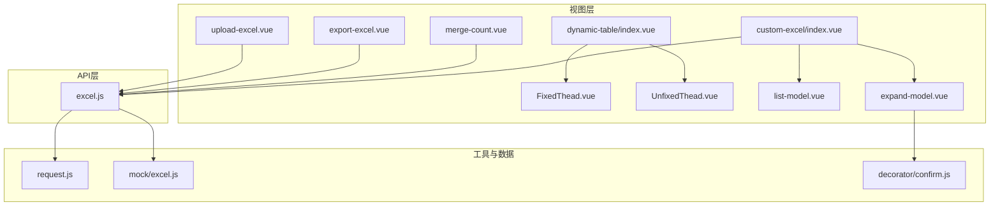
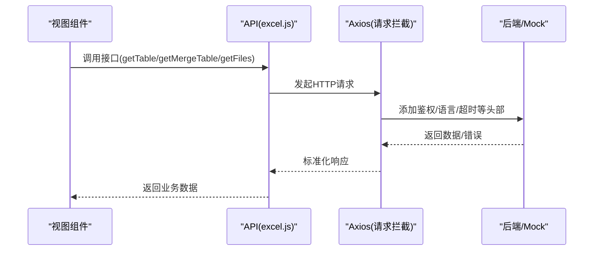
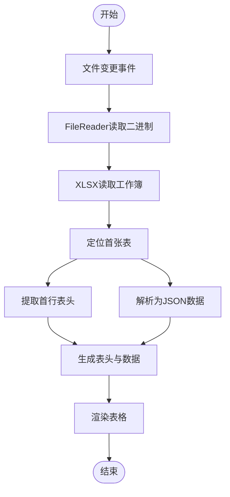
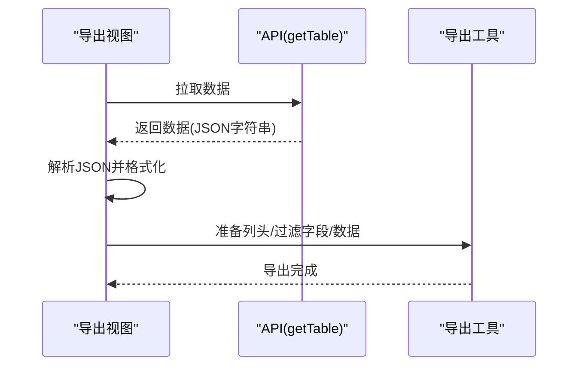
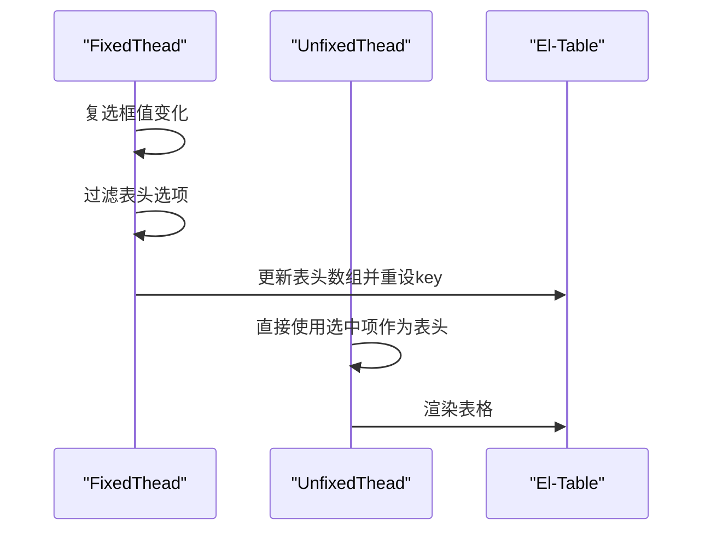
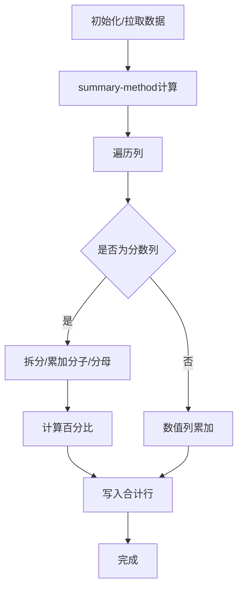
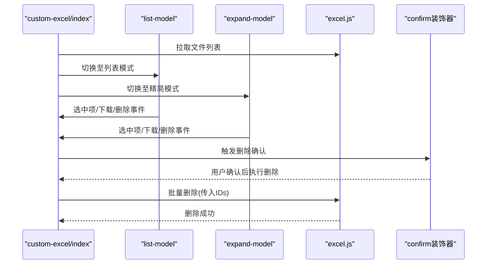
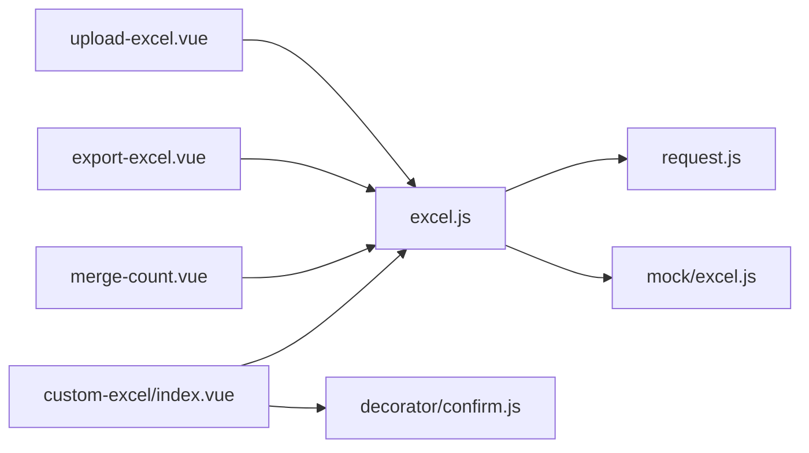

# Excel数据管理

<cite>
**本文引用的文件**
- [src/api/excel.js](file://src/api/excel.js)
- [src/views/excel/upload-excel.vue](file://src/views/excel/upload-excel.vue)
- [src/views/excel/export-excel.vue](file://src/views/excel/export-excel.vue)
- [src/views/excel/dynamic-table/index.vue](file://src/views/excel/dynamic-table/index.vue)
- [src/views/excel/dynamic-table/components/FixedThead.vue](file://src/views/excel/dynamic-table/components/FixedThead.vue)
- [src/views/excel/dynamic-table/components/UnfixedThead.vue](file://src/views/excel/dynamic-table/components/UnfixedThead.vue)
- [src/views/excel/merge-count.vue](file://src/views/excel/merge-count.vue)
- [src/views/excel/custom-excel/index.vue](file://src/views/excel/custom-excel/index.vue)
- [src/views/excel/custom-excel/children/list-model.vue](file://src/views/excel/custom-excel/children/list-model.vue)
- [src/views/excel/custom-excel/children/expand-model.vue](file://src/views/excel/custom-excel/children/expand-model.vue)
- [src/utils/request.js](file://src/utils/request.js)
- [src/mock/excel.js](file://src/mock/excel.js)
- [src/decorator/confirm.js](file://src/decorator/confirm.js)
</cite>

## 目录
1. [简介](#简介)
2. [项目结构](#项目结构)
3. [核心组件](#核心组件)
4. [架构总览](#架构总览)
5. [详细组件分析](#详细组件分析)
6. [依赖关系分析](#依赖关系分析)
7. [性能考量](#性能考量)
8. [故障排查指南](#故障排查指南)
9. [结论](#结论)
10. [附录](#附录)

## 简介
本项目围绕“Excel数据管理”构建了完整的前端功能模块，涵盖Excel文件的本地上传与解析、表格数据导出、动态表格组件、合并统计展示以及自定义Excel模板的列表/精简两种视图模式。系统通过Axios封装的请求拦截器统一处理鉴权、语言、超时与响应错误；Mock模块提供演示数据，便于开发与测试。

## 项目结构
Excel相关功能主要分布在以下路径：
- 视图层：src/views/excel/
  - 导入：upload-excel.vue
  - 导出：export-excel.vue
  - 动态表格：dynamic-table/index.vue 及其子组件 FixedThead.vue、UnfixedThead.vue
  - 合并统计：merge-count.vue
  - 自定义Excel模板：custom-excel/index.vue 及其子组件 list-model.vue、expand-model.vue
- API层：src/api/excel.js
- 工具与拦截：src/utils/request.js
- 装饰器：src/decorator/confirm.js
- Mock数据：src/mock/excel.js

图表来源
- [src/views/excel/upload-excel.vue:1-130](file://src/views/excel/upload-excel.vue#L1-L130)
- [src/views/excel/export-excel.vue:1-172](file://src/views/excel/export-excel.vue#L1-L172)
- [src/views/excel/dynamic-table/index.vue:1-48](file://src/views/excel/dynamic-table/index.vue#L1-L48)
- [src/views/excel/dynamic-table/components/FixedThead.vue:1-65](file://src/views/excel/dynamic-table/components/FixedThead.vue#L1-L65)
- [src/views/excel/dynamic-table/components/UnfixedThead.vue:1-56](file://src/views/excel/dynamic-table/components/UnfixedThead.vue#L1-L56)
- [src/views/excel/merge-count.vue:1-118](file://src/views/excel/merge-count.vue#L1-L118)
- [src/views/excel/custom-excel/index.vue:1-205](file://src/views/excel/custom-excel/index.vue#L1-L205)
- [src/views/excel/custom-excel/children/list-model.vue:1-543](file://src/views/excel/custom-excel/children/list-model.vue#L1-L543)
- [src/views/excel/custom-excel/children/expand-model.vue:1-579](file://src/views/excel/custom-excel/children/expand-model.vue#L1-L579)
- [src/api/excel.js:1-38](file://src/api/excel.js#L1-L38)
- [src/utils/request.js:1-139](file://src/utils/request.js#L1-L139)
- [src/mock/excel.js:1-65](file://src/mock/excel.js#L1-L65)
- [src/decorator/confirm.js:1-28](file://src/decorator/confirm.js#L1-L28)

章节来源
- [src/views/excel/upload-excel.vue:1-130](file://src/views/excel/upload-excel.vue#L1-L130)
- [src/views/excel/export-excel.vue:1-172](file://src/views/excel/export-excel.vue#L1-L172)
- [src/views/excel/dynamic-table/index.vue:1-48](file://src/views/excel/dynamic-table/index.vue#L1-L48)
- [src/views/excel/merge-count.vue:1-118](file://src/views/excel/merge-count.vue#L1-L118)
- [src/views/excel/custom-excel/index.vue:1-205](file://src/views/excel/custom-excel/index.vue#L1-L205)
- [src/api/excel.js:1-38](file://src/api/excel.js#L1-L38)
- [src/utils/request.js:1-139](file://src/utils/request.js#L1-L139)
- [src/mock/excel.js:1-65](file://src/mock/excel.js#L1-L65)
- [src/decorator/confirm.js:1-28](file://src/decorator/confirm.js#L1-L28)

## 核心组件
- Excel导入视图：基于Element Upload与XLSX库，实现本地文件读取、二进制转工作簿、首张表解析为JSON并生成表头与数据。
- Excel导出视图：拉取Mock数据，格式化字段，按列头与过滤字段导出为Excel文件。
- 动态表格：提供固定表头与非固定表头两种模式，支持复选框控制列显隐与排序。
- 合并统计：基于Element Table的汇总方法，对特定列进行求和、分数式百分比计算与空值处理。
- 自定义Excel模板：提供列表/精简两种视图模式，支持勾选、下载、删除、详情弹窗与图片预览。

章节来源
- [src/views/excel/upload-excel.vue:29-94](file://src/views/excel/upload-excel.vue#L29-L94)
- [src/views/excel/export-excel.vue:38-149](file://src/views/excel/export-excel.vue#L38-L149)
- [src/views/excel/dynamic-table/index.vue:15-22](file://src/views/excel/dynamic-table/index.vue#L15-L22)
- [src/views/excel/merge-count.vue:34-114](file://src/views/excel/merge-count.vue#L34-L114)
- [src/views/excel/custom-excel/index.vue:52-142](file://src/views/excel/custom-excel/index.vue#L52-L142)

## 架构总览
系统采用“视图-组件-API-工具-数据”的分层设计：
- 视图层负责用户交互与数据展示；
- 组件层提供可复用的表格与对话框；
- API层封装HTTP请求；
- 工具层提供请求拦截与错误处理；
- 数据层提供Mock数据与装饰器辅助。

图表来源
- [src/api/excel.js:5-37](file://src/api/excel.js#L5-L37)
- [src/utils/request.js:18-52](file://src/utils/request.js#L18-L52)
- [src/mock/excel.js:1-65](file://src/mock/excel.js#L1-L65)

## 详细组件分析

### Excel导入组件（upload-excel）
- 功能要点
  - 支持拖拽/点击上传，限制文件类型与数量；
  - 使用FileReader读取二进制，XLSX解析工作簿；
  - 读取首张表的表头与数据，生成表格展示。
- 关键流程
  - 文件变更事件触发readerData；
  - 二进制拼接与XLSX.read解析；
  - 从第一行提取表头，sheet_to_json生成结果；
  - 更新组件内部tableHeader与tableData。

图表来源
- [src/views/excel/upload-excel.vue:42-92](file://src/views/excel/upload-excel.vue#L42-L92)

章节来源
- [src/views/excel/upload-excel.vue:29-94](file://src/views/excel/upload-excel.vue#L29-L94)

### Excel导出组件（export-excel）
- 功能要点
  - 拉取远端数据（Mock），解析并格式化字段；
  - 提供定时刷新进度条模拟加载；
  - 导出时按指定列头与过滤字段生成Excel。
- 关键流程
  - created钩子拉取数据并格式化；
  - handleDownload异步加载导出模块，准备列头与数据；
  - 调用导出方法生成文件并设置文件名。

图表来源
- [src/views/excel/export-excel.vue:54-123](file://src/views/excel/export-excel.vue#L54-L123)
- [src/api/excel.js:5-10](file://src/api/excel.js#L5-L10)
- [src/mock/excel.js:3-64](file://src/mock/excel.js#L3-L64)

章节来源
- [src/views/excel/export-excel.vue:38-149](file://src/views/excel/export-excel.vue#L38-L149)
- [src/api/excel.js:5-10](file://src/api/excel.js#L5-L10)
- [src/mock/excel.js:3-64](file://src/mock/excel.js#L3-L64)

### 动态表格组件（dynamic-table）
- 功能要点
  - 固定表头：通过复选框控制列显隐，强制按固定顺序渲染；
  - 非固定表头：点击顺序决定列顺序，适合灵活排序。
- 关键流程
  - FixedThead：监听复选框变化，过滤表头数组并重置key以强制重渲染；
  - UnfixedThead：直接以选中项作为表头顺序。

图表来源
- [src/views/excel/dynamic-table/components/FixedThead.vue:48-53](file://src/views/excel/dynamic-table/components/FixedThead.vue#L48-L53)
- [src/views/excel/dynamic-table/components/UnfixedThead.vue:22-43](file://src/views/excel/dynamic-table/components/UnfixedThead.vue#L22-L43)

章节来源
- [src/views/excel/dynamic-table/index.vue:15-22](file://src/views/excel/dynamic-table/index.vue#L15-L22)
- [src/views/excel/dynamic-table/components/FixedThead.vue:22-54](file://src/views/excel/dynamic-table/components/FixedThead.vue#L22-L54)
- [src/views/excel/dynamic-table/components/UnfixedThead.vue:22-43](file://src/views/excel/dynamic-table/components/UnfixedThead.vue#L22-L43)

### 合并统计组件（merge-count）
- 功能要点
  - 使用Element Table的show-summary与summary-method实现自定义汇总；
  - 对特定列进行数值累加与分数式百分比计算；
  - 对无法解析的数值返回“N/A”。
- 关键流程
  - 拉取数据后在created中赋值；
  - getSummaries遍历列，对目标列分别计算分子/分母与百分比；
  - 其他数值列进行数字累加。

图表来源
- [src/views/excel/merge-count.vue:48-109](file://src/views/excel/merge-count.vue#L48-L109)
- [src/api/excel.js:12-18](file://src/api/excel.js#L12-L18)
- [src/mock/excel.js:7-27](file://src/mock/excel.js#L7-L27)

章节来源
- [src/views/excel/merge-count.vue:34-114](file://src/views/excel/merge-count.vue#L34-L114)
- [src/api/excel.js:12-18](file://src/api/excel.js#L12-L18)
- [src/mock/excel.js:7-27](file://src/mock/excel.js#L7-L27)

### 自定义Excel模板（custom-excel）
- 功能要点
  - 列表/精简两种视图模式切换；
  - 支持勾选、下载、删除、详情弹窗、图片预览；
  - 顶部批量删除通过装饰器Confirm确认。
- 关键流程
  - 列表模式：el-table展示文件列表，支持排序与多选；
  - 精简模式：卡片网格展示，支持全选、单选、详情与下载；
  - 删除：批量删除通过API调用与确认装饰器。

图表来源
- [src/views/excel/custom-excel/index.vue:74-138](file://src/views/excel/custom-excel/index.vue#L74-L138)
- [src/views/excel/custom-excel/children/list-model.vue:192-223](file://src/views/excel/custom-excel/children/list-model.vue#L192-L223)
- [src/views/excel/custom-excel/children/expand-model.vue:220-237](file://src/views/excel/custom-excel/children/expand-model.vue#L220-L237)
- [src/api/excel.js:23-37](file://src/api/excel.js#L23-L37)
- [src/decorator/confirm.js:8-27](file://src/decorator/confirm.js#L8-L27)

章节来源
- [src/views/excel/custom-excel/index.vue:52-142](file://src/views/excel/custom-excel/index.vue#L52-L142)
- [src/views/excel/custom-excel/children/list-model.vue:154-277](file://src/views/excel/custom-excel/children/list-model.vue#L154-L277)
- [src/views/excel/custom-excel/children/expand-model.vue:169-363](file://src/views/excel/custom-excel/children/expand-model.vue#L169-L363)
- [src/api/excel.js:23-37](file://src/api/excel.js#L23-L37)
- [src/decorator/confirm.js:8-27](file://src/decorator/confirm.js#L8-L27)

## 依赖关系分析
- 视图组件依赖API层接口；
- API层依赖Axios拦截器进行统一请求处理；
- Mock模块为演示提供数据；
- 装饰器用于增强删除等危险操作的确认流程。

图表来源
- [src/views/excel/upload-excel.vue:1-130](file://src/views/excel/upload-excel.vue#L1-L130)
- [src/views/excel/export-excel.vue:1-172](file://src/views/excel/export-excel.vue#L1-L172)
- [src/views/excel/merge-count.vue:1-118](file://src/views/excel/merge-count.vue#L1-L118)
- [src/views/excel/custom-excel/index.vue:1-205](file://src/views/excel/custom-excel/index.vue#L1-L205)
- [src/api/excel.js:1-38](file://src/api/excel.js#L1-L38)
- [src/utils/request.js:1-139](file://src/utils/request.js#L1-L139)
- [src/mock/excel.js:1-65](file://src/mock/excel.js#L1-L65)
- [src/decorator/confirm.js:1-28](file://src/decorator/confirm.js#L1-L28)

章节来源
- [src/api/excel.js:1-38](file://src/api/excel.js#L1-L38)
- [src/utils/request.js:1-139](file://src/utils/request.js#L1-L139)
- [src/mock/excel.js:1-65](file://src/mock/excel.js#L1-L65)
- [src/decorator/confirm.js:1-28](file://src/decorator/confirm.js#L1-L28)

## 性能考量
- 导入解析
  - 大文件解析建议分片读取与流式处理，避免一次性占用内存；
  - 仅解析首张表，减少不必要的计算。
- 导出处理
  - 控制导出数据量，必要时分页或分批导出；
  - 列头与过滤字段尽量复用，减少重复映射。
- 动态表格
  - 固定表头模式通过key强制重渲染，频繁切换需谨慎；
  - 非固定表头模式更灵活，但注意大量列时的渲染开销。
- 合并统计
  - 对分数式列先拆分再累加，避免字符串处理成本；
  - 数值列使用Number转换并过滤NaN，减少无效计算。
- 自定义模板
  - 精简模式卡片布局在大数据量时可能影响滚动性能，建议虚拟滚动或懒加载；
  - 弹窗与图片预览按需加载，避免同时打开过多弹窗。

## 故障排查指南
- 请求拦截与错误处理
  - 请求拦截器统一添加鉴权与语言头，GET请求加入时间戳参数防止缓存；
  - 响应拦截器对Blob/ArrayBuffer直接透传，其余响应按业务码处理；
  - 超时与网络错误统一提示，令牌失效引导重新登录。
- 导入解析异常
  - 确认文件类型与编码，确保二进制拼接正确；
  - 若表头为空，检查首行是否包含有效文本。
- 导出失败
  - 确认列头与过滤字段与数据结构一致；
  - 检查导出模块是否正确异步加载。
- 合并统计异常
  - 分数式列需确保格式为“分子/分母”，否则会返回“N/A”；
  - 数值列需确保可解析为数字，否则会被忽略。
- 自定义模板
  - 删除操作需二次确认，避免误删；
  - 精简模式全选/单选状态同步依赖父组件checkList，确保双向绑定生效。

章节来源
- [src/utils/request.js:18-52](file://src/utils/request.js#L18-L52)
- [src/utils/request.js:66-135](file://src/utils/request.js#L66-L135)
- [src/views/excel/upload-excel.vue:42-66](file://src/views/excel/upload-excel.vue#L42-L66)
- [src/views/excel/export-excel.vue:113-123](file://src/views/excel/export-excel.vue#L113-L123)
- [src/views/excel/merge-count.vue:66-106](file://src/views/excel/merge-count.vue#L66-L106)
- [src/views/excel/custom-excel/index.vue:98-113](file://src/views/excel/custom-excel/index.vue#L98-L113)
- [src/decorator/confirm.js:8-27](file://src/decorator/confirm.js#L8-L27)

## 结论
本Excel数据管理模块以清晰的分层架构实现了从本地导入、服务端数据导出、动态表格展示、合并统计到自定义模板的完整链路。通过Axios拦截器统一处理鉴权与错误，结合Mock数据提升开发效率。建议在生产环境中进一步完善大文件处理策略、导出分页与虚拟滚动优化，并加强安全校验与权限控制。

## 附录
- 扩展指南
  - 新增列配置：在动态表格组件中增加复选框选项与表头映射；
  - 新增导出字段：在导出组件中扩展列头与过滤字段数组；
  - 新增合并统计列：在summary-method中新增计算逻辑；
  - 新增模板视图：参考list-model与expand-model的结构与事件通信方式。
- 性能优化建议
  - 导入：采用分片读取与Web Worker解析；
  - 导出：分批生成与下载，避免主线程阻塞；
  - 表格：启用虚拟滚动与懒加载；
  - 统计：缓存中间结果，避免重复计算。