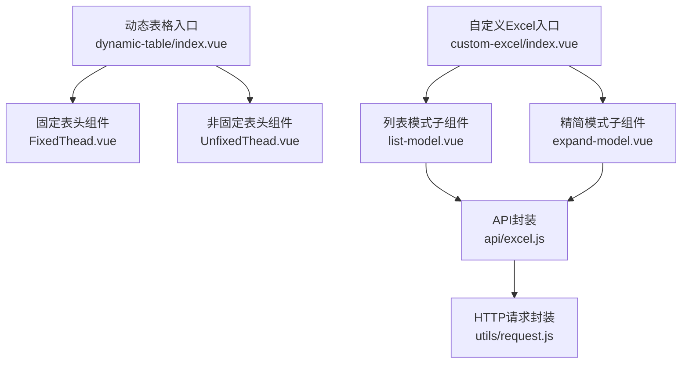
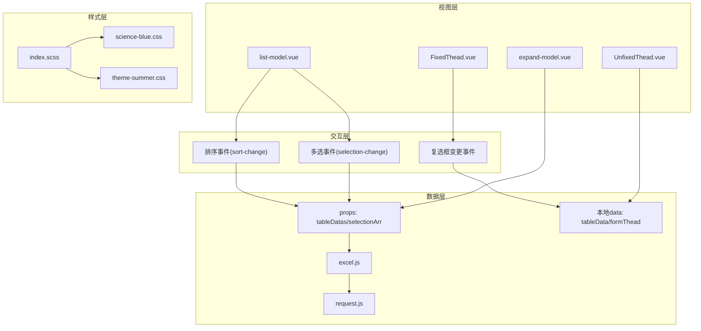
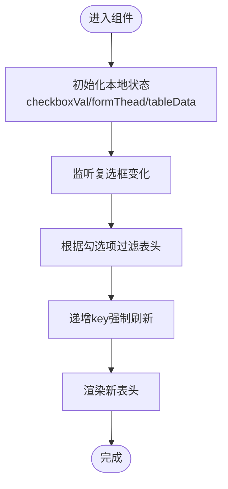
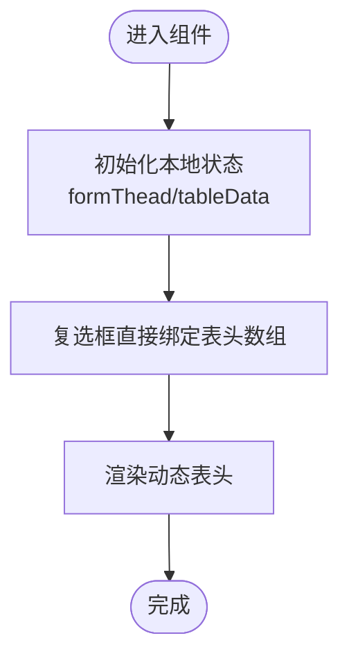
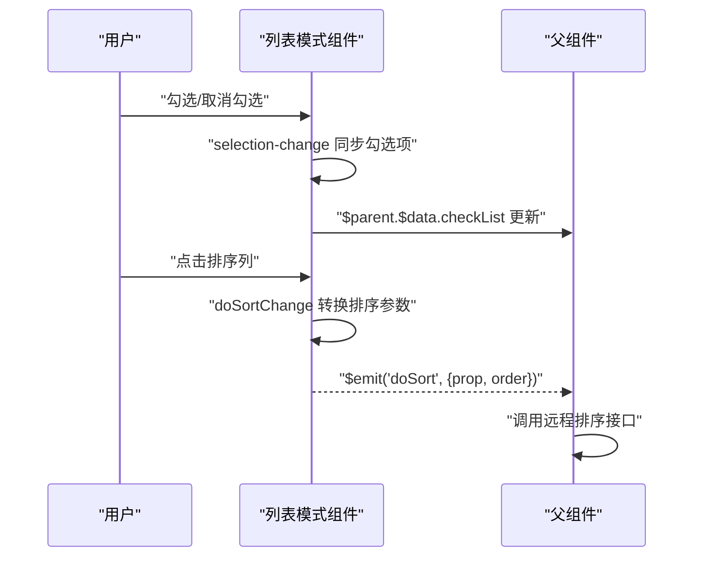
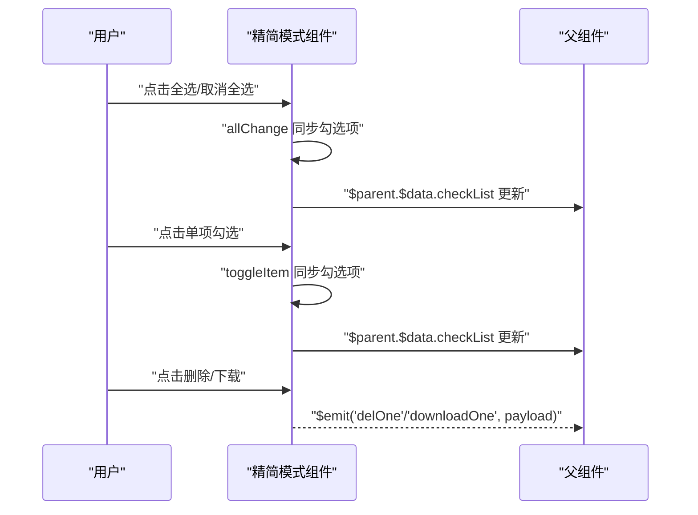
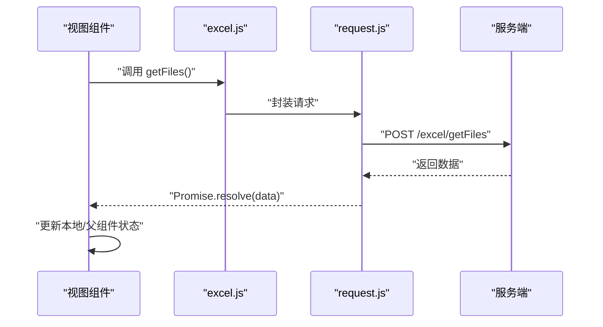
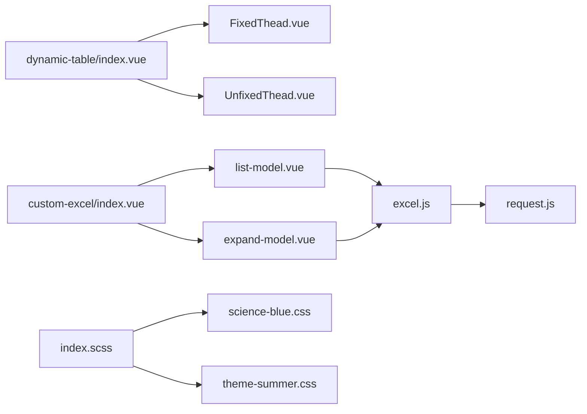

# 动态表格组件

<cite>
**本文引用的文件**
- [index.vue](file://src/views/excel/dynamic-table/index.vue)
- [FixedThead.vue](file://src/views/excel/dynamic-table/components/FixedThead.vue)
- [UnfixedThead.vue](file://src/views/excel/dynamic-table/components/UnfixedThead.vue)
- [excel.js](file://src/api/excel.js)
- [request.js](file://src/utils/request.js)
- [index.vue](file://src/views/excel/custom-excel/index.vue)
- [list-model.vue](file://src/views/excel/custom-excel/children/list-model.vue)
- [expand-model.vue](file://src/views/excel/custom-excel/children/expand-model.vue)
- [index.scss](file://src/assets/style/index.scss)
- [science-blue.css](file://src/assets/custom-theme/science-blue.css)
- [theme-summer.css](file://src/assets/custom-theme/theme-summer.css)
</cite>

## 目录
1. [简介](#简介)
2. [项目结构](#项目结构)
3. [核心组件](#核心组件)
4. [架构总览](#架构总览)
5. [详细组件分析](#详细组件分析)
6. [依赖关系分析](#依赖关系分析)
7. [性能考量](#性能考量)
8. [故障排查指南](#故障排查指南)
9. [结论](#结论)
10. [附录](#附录)

## 简介
本文件面向开发者，系统性梳理并说明本仓库中的动态表格组件体系，涵盖设计理念、数据绑定机制、交互功能、固定/非固定表头实现差异、列的动态配置、排序与筛选、批量操作、增删改查（本地状态与远程同步）、性能优化（虚拟滚动、懒加载、分页）、样式定制与响应式适配，以及扩展指南（自定义列类型、插件集成、业务场景适配）。

## 项目结构
动态表格相关的核心位置集中在“Excel 动态表格”和“自定义 Excel”两个视图模块中：
- 动态表格演示：位于 views/excel/dynamic-table，包含固定表头与非固定表头两种子组件，用于演示列的动态增删与渲染控制。
- 自定义 Excel：位于 views/excel/custom-excel，提供更完整的表格交互能力（排序、多选、详情弹窗、批量删除等），并展示与 API 的联动。

图表来源
- [index.vue:1-48](file://src/views/excel/dynamic-table/index.vue#L1-L48)
- [FixedThead.vue:1-65](file://src/views/excel/dynamic-table/components/FixedThead.vue#L1-L65)
- [UnfixedThead.vue:1-56](file://src/views/excel/dynamic-table/components/UnfixedThead.vue#L1-L56)
- [index.vue:1-205](file://src/views/excel/custom-excel/index.vue#L1-L205)
- [list-model.vue:1-543](file://src/views/excel/custom-excel/children/list-model.vue#L1-L543)
- [expand-model.vue:1-579](file://src/views/excel/custom-excel/children/expand-model.vue#L1-L579)
- [excel.js:1-38](file://src/api/excel.js#L1-L38)
- [request.js:1-139](file://src/utils/request.js#L1-L139)

章节来源
- [index.vue:1-48](file://src/views/excel/dynamic-table/index.vue#L1-L48)
- [index.vue:1-205](file://src/views/excel/custom-excel/index.vue#L1-L205)

## 核心组件
- 固定表头组件（FixedThead）：通过复选框控制表头集合，使用 key 强制刷新以确保渲染更新；适合“按表头顺序固定”的场景。
- 非固定表头组件（UnfixedThead）：直接以用户勾选的字段作为表头；适合“按点击顺序动态排序”的场景。
- 列表模式（list-model）：提供排序事件、多选事件、弹窗详情、批量操作等完整表格交互。
- 精简模式（expand-model）：卡片式布局，支持全选、单个勾选、图片预览、详情弹窗等。
- API 封装（excel.js）：统一导出与表格相关的接口方法，便于集中维护。
- 请求封装（request.js）：全局拦截器处理鉴权、语言、错误提示与超时等。

章节来源
- [FixedThead.vue:1-65](file://src/views/excel/dynamic-table/components/FixedThead.vue#L1-L65)
- [UnfixedThead.vue:1-56](file://src/views/excel/dynamic-table/components/UnfixedThead.vue#L1-L56)
- [list-model.vue:1-543](file://src/views/excel/custom-excel/children/list-model.vue#L1-L543)
- [expand-model.vue:1-579](file://src/views/excel/custom-excel/children/expand-model.vue#L1-L579)
- [excel.js:1-38](file://src/api/excel.js#L1-L38)
- [request.js:1-139](file://src/utils/request.js#L1-L139)

## 架构总览
动态表格的总体架构由“视图层（组件）—交互层（事件与状态）—数据层（props/本地data/远程API）—样式层（主题与SCSS）”构成。视图层负责渲染与交互；交互层通过事件向上抛出或向下传递状态；数据层通过 API 封装与请求封装完成远程同步；样式层通过主题CSS与SCSS变量实现统一风格与响应式适配。

图表来源
- [FixedThead.vue:48-53](file://src/views/excel/dynamic-table/components/FixedThead.vue#L48-L53)
- [UnfixedThead.vue:22-43](file://src/views/excel/dynamic-table/components/UnfixedThead.vue#L22-L43)
- [list-model.vue:8-9](file://src/views/excel/custom-excel/children/list-model.vue#L8-L9)
- [expand-model.vue:171-187](file://src/views/excel/custom-excel/children/expand-model.vue#L171-L187)
- [excel.js:5-38](file://src/api/excel.js#L5-L38)
- [request.js:18-52](file://src/utils/request.js#L18-L52)
- [index.scss:1-4](file://src/assets/style/index.scss#L1-L4)
- [science-blue.css:1-49](file://src/assets/custom-theme/science-blue.css#L1-L49)
- [theme-summer.css:1-800](file://src/assets/custom-theme/theme-summer.css#L1-L800)

## 详细组件分析

### 固定表头组件（FixedThead）
- 设计理念：通过复选框控制表头集合，每次变更通过 key 强制刷新，确保渲染一致性；适合“先定表头再填数据”的场景。
- 数据绑定机制：
  - 本地状态：checkboxVal（受控复选框）、formThead（最终表头数组）、tableData（表格数据）。
  - 计算逻辑：watch 复选框值，过滤出 formThead，并递增 key 触发重新渲染。
- 交互功能：复选框勾选即刻生效，无需额外提交按钮。
- 使用场景：当表头顺序固定且需快速切换显示字段时。

图表来源
- [FixedThead.vue:26-53](file://src/views/excel/dynamic-table/components/FixedThead.vue#L26-L53)

章节来源
- [FixedThead.vue:1-65](file://src/views/excel/dynamic-table/components/FixedThead.vue#L1-L65)

### 非固定表头组件（UnfixedThead）
- 设计理念：直接以用户勾选的字段作为表头，无需额外键值刷新；适合“按点击顺序动态排序”的场景。
- 数据绑定机制：
  - 本地状态：formThead（直接绑定复选框）、tableData（表格数据）。
- 交互功能：勾选即刻生效，适合轻量级动态列展示。
- 使用场景：当表头顺序由用户决定且不需要固定顺序时。

图表来源
- [UnfixedThead.vue:24-42](file://src/views/excel/dynamic-table/components/UnfixedThead.vue#L24-L42)

章节来源
- [UnfixedThead.vue:1-56](file://src/views/excel/dynamic-table/components/UnfixedThead.vue#L1-L56)

### 列表模式（list-model）
- 排序筛选：
  - 监听 sort-change 事件，将排序参数转换为后端期望格式并向上抛出，便于在父组件发起远程排序请求。
- 批量操作：
  - 监听 selection-change，同步勾选项至父组件的 checkList，支持批量删除、批量下载等。
- 详情弹窗与图片预览：提供素材详情弹窗与图片大图弹窗，增强用户体验。
- 与父组件通信：通过 $emit 与 $parent.$data.checkList 实现双向数据流。

图表来源
- [list-model.vue:235-252](file://src/views/excel/custom-excel/children/list-model.vue#L235-L252)
- [list-model.vue:193-209](file://src/views/excel/custom-excel/children/list-model.vue#L193-L209)
- [index.vue:73-138](file://src/views/excel/custom-excel/index.vue#L73-L138)

章节来源
- [list-model.vue:1-543](file://src/views/excel/custom-excel/children/list-model.vue#L1-L543)
- [index.vue:1-205](file://src/views/excel/custom-excel/index.vue#L1-L205)

### 精简模式（expand-model）
- 全选/单选：提供全选与单项勾选，自动同步至父组件的 checkList。
- 图片预览与详情弹窗：支持图片大图弹窗与素材详情弹窗。
- 与父组件通信：通过 $emit 与 $parent.$data.checkList 实现双向数据流。

图表来源
- [expand-model.vue:257-272](file://src/views/excel/custom-excel/children/expand-model.vue#L257-L272)
- [expand-model.vue:316-333](file://src/views/excel/custom-excel/children/expand-model.vue#L316-L333)
- [expand-model.vue:221-237](file://src/views/excel/custom-excel/children/expand-model.vue#L221-L237)
- [index.vue:73-138](file://src/views/excel/custom-excel/index.vue#L73-L138)

章节来源
- [expand-model.vue:1-579](file://src/views/excel/custom-excel/children/expand-model.vue#L1-L579)
- [index.vue:1-205](file://src/views/excel/custom-excel/index.vue#L1-L205)

### 增删改查（本地状态与远程同步）
- 本地状态管理：
  - 动态表头组件通过本地 data 维护表头数组与数据集，适合演示与轻量场景。
  - 列表/精简模式通过 props 接收外部数据，内部通过 watch 同步至本地 tableData，同时通过 $emit/$parent.$data 与父组件保持双向数据流。
- 远程数据同步：
  - API 封装统一导出 getFiles、delFiles 等方法，便于在父组件中调用。
  - 请求封装提供全局拦截器，自动注入鉴权头、语言头、超时处理与错误提示。

图表来源
- [excel.js:24-38](file://src/api/excel.js#L24-L38)
- [request.js:18-52](file://src/utils/request.js#L18-L52)
- [index.vue:74-80](file://src/views/excel/custom-excel/index.vue#L74-L80)

章节来源
- [excel.js:1-38](file://src/api/excel.js#L1-L38)
- [request.js:1-139](file://src/utils/request.js#L1-L139)
- [index.vue:1-205](file://src/views/excel/custom-excel/index.vue#L1-L205)

## 依赖关系分析
- 组件间依赖：
  - dynamic-table/index.vue 依赖 FixedThead 与 UnfixedThead。
  - custom-excel/index.vue 依赖 list-model 与 expand-model。
  - list-model 与 expand-model 依赖父组件传入的 props（tableDatas、selectionArr）。
- 数据依赖：
  - API 封装依赖请求封装，统一处理鉴权与错误。
- 样式依赖：
  - 主题样式通过 index.scss 统一引入，具体主题样式在自定义主题CSS中覆盖Element UI样式。

图表来源
- [index.vue:16-22](file://src/views/excel/dynamic-table/index.vue#L16-L22)
- [index.vue:53-61](file://src/views/excel/custom-excel/index.vue#L53-L61)
- [excel.js:1-38](file://src/api/excel.js#L1-L38)
- [request.js:1-139](file://src/utils/request.js#L1-L139)
- [index.scss:1-4](file://src/assets/style/index.scss#L1-L4)
- [science-blue.css:1-49](file://src/assets/custom-theme/science-blue.css#L1-L49)
- [theme-summer.css:1-800](file://src/assets/custom-theme/theme-summer.css#L1-L800)

章节来源
- [index.vue:1-48](file://src/views/excel/dynamic-table/index.vue#L1-L48)
- [index.vue:1-205](file://src/views/excel/custom-excel/index.vue#L1-L205)

## 性能考量
- 渲染优化：
  - 固定表头组件通过 key 强制刷新，确保复杂表头切换时的渲染一致性，避免因 v-for 键值重复导致的渲染问题。
- 交互优化：
  - 列表/精简模式通过 selection-change 同步勾选项，减少不必要的全量计算。
- 请求优化：
  - 请求封装对 GET 请求增加时间戳参数，避免浏览器缓存；设置超时与错误提示，提升稳定性。
- 样式优化：
  - 主题CSS覆盖 Element UI 样式，统一风格；SCSS 变量与主题文件便于按需调整。

章节来源
- [FixedThead.vue:48-53](file://src/views/excel/dynamic-table/components/FixedThead.vue#L48-L53)
- [list-model.vue:235-252](file://src/views/excel/custom-excel/children/list-model.vue#L235-L252)
- [request.js:35-43](file://src/utils/request.js#L35-L43)

## 故障排查指南
- 请求失败与超时：
  - 检查请求拦截器是否正确注入鉴权头与语言头；关注超时与网络错误提示。
- 表格渲染异常：
  - 固定表头组件需确保 key 变化触发刷新；若表头未更新，检查复选框绑定与 watch 逻辑。
- 勾选状态不同步：
  - 确认 selection-change 事件是否正确同步至父组件的 checkList；列表/精简模式通过 $parent.$data.checkList 更新。
- 主题样式冲突：
  - 检查 index.scss 中的主题引入顺序；确认自定义主题CSS未被覆盖。

章节来源
- [request.js:18-52](file://src/utils/request.js#L18-L52)
- [FixedThead.vue:48-53](file://src/views/excel/dynamic-table/components/FixedThead.vue#L48-L53)
- [list-model.vue:249-251](file://src/views/excel/custom-excel/children/list-model.vue#L249-L251)
- [index.scss:1-4](file://src/assets/style/index.scss#L1-L4)

## 结论
本动态表格组件体系通过“固定/非固定表头”演示了列的动态配置，结合“列表/精简模式”展示了排序、筛选、批量操作等完整交互流程，并通过 API 与请求封装实现了本地状态与远程数据的协同。配合主题与样式体系，可在不同业务场景下快速落地并扩展。

## 附录
- 自定义列类型建议：
  - 在现有 el-table-column 基础上，新增自定义模板列（如富文本、图片缩略图、状态标签等），并在父组件中通过 props 传入渲染规则。
- 插件集成：
  - 可在请求封装基础上集成缓存策略（如基于 URL+参数的缓存键）与重试机制，提升弱网环境下的体验。
- 业务场景适配：
  - 对于大数据量场景，建议结合虚拟滚动（如第三方虚拟滚动库）与分页接口；对于频繁筛选场景，可将筛选条件持久化至查询参数，便于刷新后恢复。