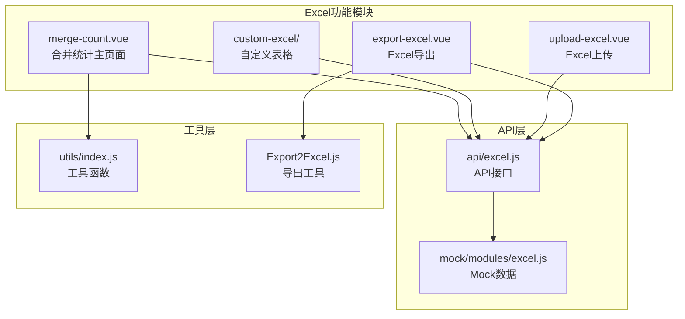
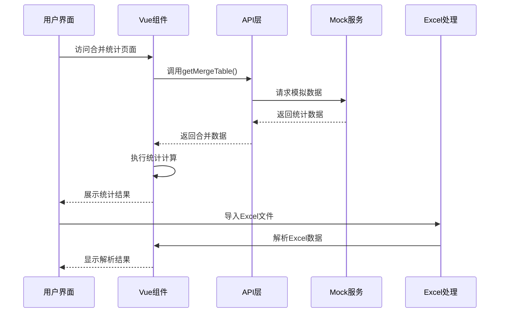
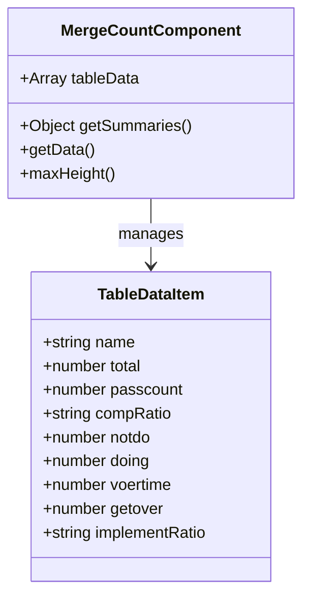
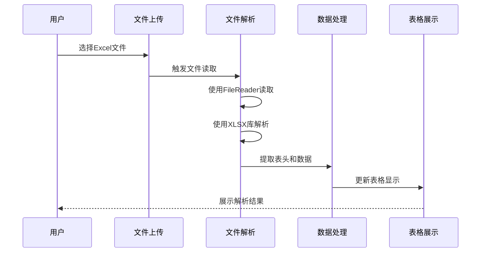
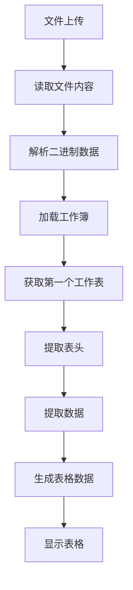
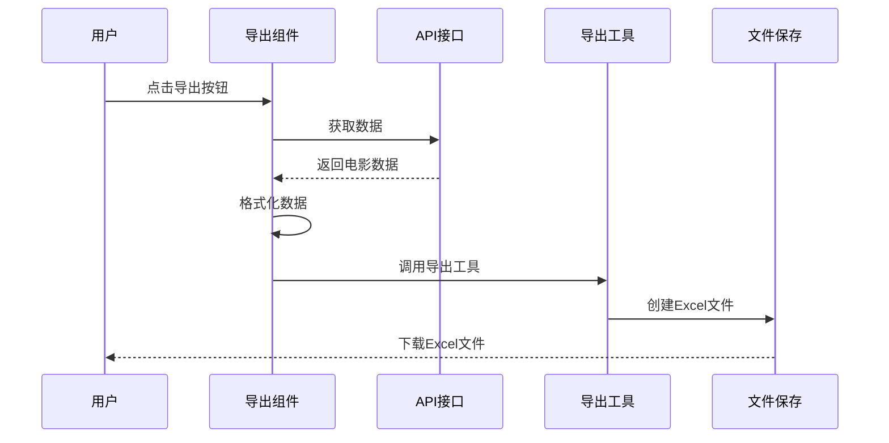
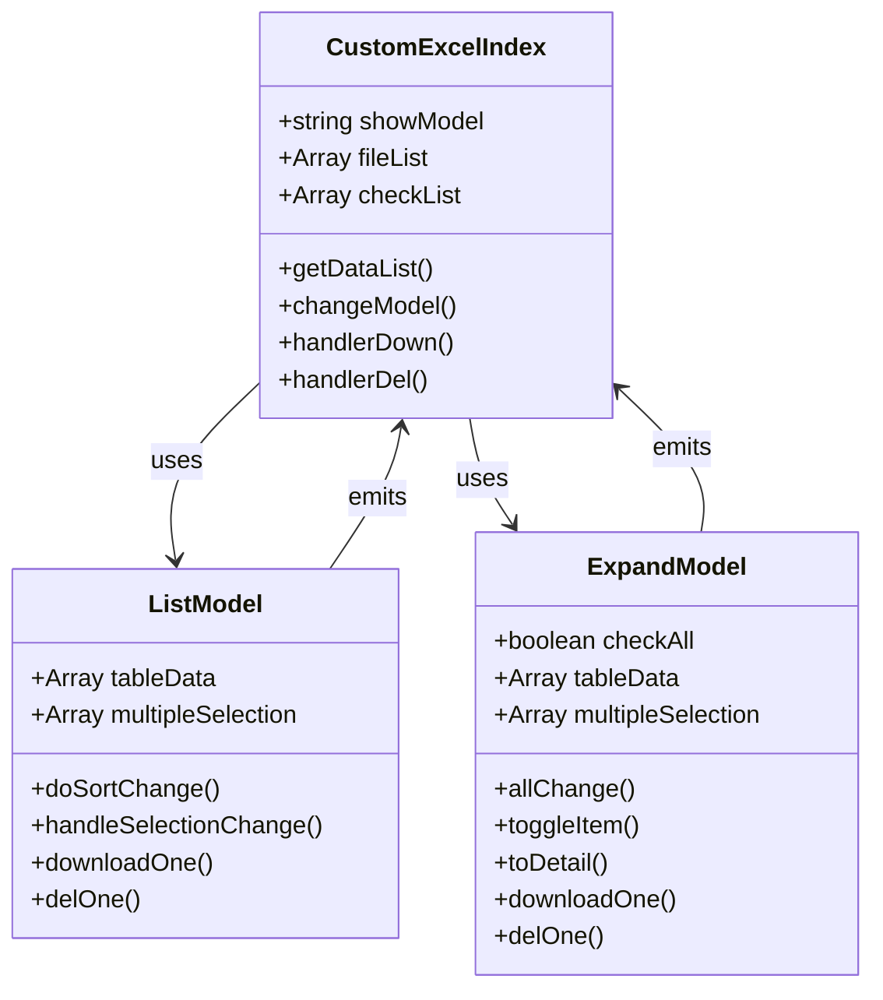
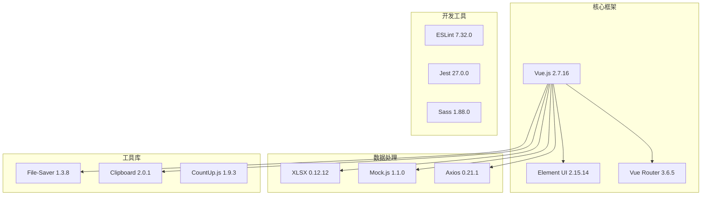
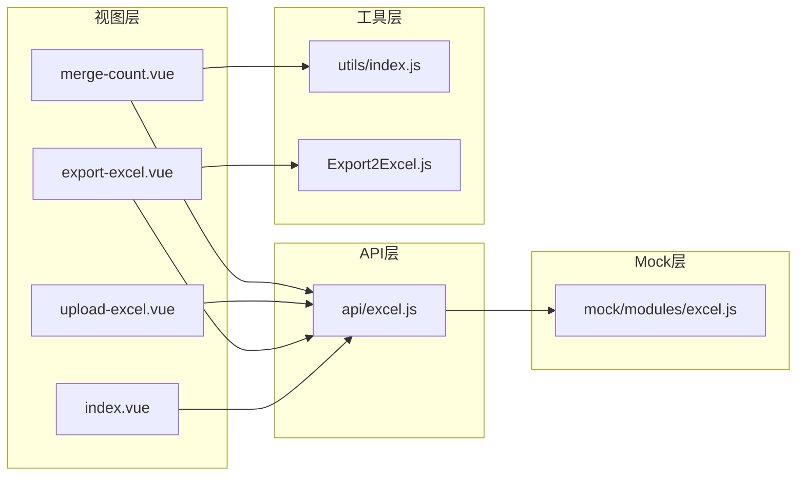

# 合并统计功能

<cite>
**本文档引用的文件**
- [merge-count.vue](file://src/views/excel/merge-count.vue)
- [excel.js](file://src/api/excel.js)
- [excel.js](file://src/mock/modules/excel.js)
- [index.js](file://src/utils/index.js)
- [index.vue](file://src/views/excel/custom-excel/index.vue)
- [list-model.vue](file://src/views/excel/custom-excel/children/list-model.vue)
- [expand-model.vue](file://src/views/excel/custom-excel/children/expand-model.vue)
- [upload-excel.vue](file://src/views/excel/upload-excel.vue)
- [export-excel.vue](file://src/views/excel/export-excel.vue)
- [Export2Excel.js](file://src/vendor/Export2Excel.js)
- [index.js](file://src/router/index.js)
- [package.json](file://package.json)
</cite>

## 目录
1. [简介](#简介)
2. [项目结构](#项目结构)
3. [核心组件](#核心组件)
4. [架构概览](#架构概览)
5. [详细组件分析](#详细组件分析)
6. [依赖关系分析](#依赖关系分析)
7. [性能考虑](#性能考虑)
8. [故障排除指南](#故障排除指南)
9. [结论](#结论)

## 简介

本项目提供了完整的Excel合并统计功能，专注于数据合并、去重和统计计算。系统实现了基于Vue.js和Element UI的前端界面，配合Mock.js进行数据模拟，支持多种统计指标计算和数据展示方式。

主要功能包括：
- 数据合并与去重处理
- 多维度统计计算（计数、求和、平均值、最大值、最小值）
- 数据分组和分类统计
- 数据质量检查和异常处理
- 统计结果的可视化展示
- Excel数据导入导出功能

## 项目结构

项目采用模块化组织方式，Excel相关功能集中在`src/views/excel/`目录下：



**图表来源**
- [merge-count.vue:1-118](file://src/views/excel/merge-count.vue#L1-L118)
- [excel.js:1-38](file://src/api/excel.js#L1-L38)
- [excel.js:1-93](file://src/mock/modules/excel.js#L1-L93)

**章节来源**
- [merge-count.vue:1-118](file://src/views/excel/merge-count.vue#L1-L118)
- [excel.js:1-38](file://src/api/excel.js#L1-L38)
- [excel.js:1-93](file://src/mock/modules/excel.js#L1-L93)

## 核心组件

### 合并统计主组件

`merge-count.vue`是整个合并统计功能的核心组件，负责数据展示和统计计算：

- **数据结构**：包含发起人、任务发起、任务办理等多个维度的数据
- **统计计算**：实现了自定义的合计计算方法
- **数据格式**：支持分数形式的比例计算（如"100/500"）

### API接口层

`api/excel.js`提供了统一的API接口：

- `getMergeTable()`: 获取合并统计数据
- `getTable()`: 获取电影票房数据
- `getFiles()`: 获取文件列表
- `delFiles()`: 删除文件

### Mock数据服务

`mock/modules/excel.js`使用Mock.js生成模拟数据：

- 生成30条随机统计数据
- 包含姓名、任务数量、审核通过数等字段
- 自动计算完成率和执行率

**章节来源**
- [merge-count.vue:34-114](file://src/views/excel/merge-count.vue#L34-L114)
- [excel.js:5-38](file://src/api/excel.js#L5-L38)
- [excel.js:6-27](file://src/mock/modules/excel.js#L6-L27)

## 架构概览

系统采用前后端分离架构，结合Mock.js进行数据模拟：



**图表来源**
- [merge-count.vue:48-52](file://src/views/excel/merge-count.vue#L48-L52)
- [excel.js:13-18](file://src/api/excel.js#L13-L18)
- [excel.js:66-73](file://src/mock/modules/excel.js#L66-L73)

## 详细组件分析

### 合并统计组件分析

#### 数据结构设计

组件维护以下数据结构：



**图表来源**
- [merge-count.vue:36-41](file://src/views/excel/merge-count.vue#L36-L41)
- [merge-count.vue:54-109](file://src/views/excel/merge-count.vue#L54-L109)

#### 统计计算算法

组件实现了复杂的统计计算逻辑：

```mermaid
flowchart TD
Start([开始统计计算]) --> GetColumns[获取表格列信息]
GetColumns --> LoopColumns[遍历每一列]
LoopColumns --> CheckColumn{检查列类型}
CheckColumn --> |第1列| SetEmpty[设置为空字符串]
CheckColumn --> |第2列| SetTotal[设置为"总计"]
CheckColumn --> |特殊比例列| CalcRatio[计算比例值]
CheckColumn --> |普通数值列| CalcNormal[计算普通数值]
CalcRatio --> SplitValues[分割分子分母]
SplitValues --> SumNumerator[累加分子]
SplitValues --> SumDenominator[累加分母]
SumNumerator --> CalcPercentage[计算百分比]
CalcPercentage --> FormatResult[格式化结果]
CalcNormal --> SumValues[累加所有值]
SumValues --> CheckNaN{检查是否为NaN}
CheckNaN --> |是| SetNA[设置为"N/A"]
CheckNaN --> |否| FormatNormal[格式化数值]
FormatResult --> NextColumn[处理下一列]
FormatNormal --> NextColumn
SetNA --> NextColumn
SetEmpty --> NextColumn
SetTotal --> NextColumn
NextColumn --> End([返回统计结果])
```

**图表来源**
- [merge-count.vue:54-109](file://src/views/excel/merge-count.vue#L54-L109)

#### 统计指标实现

系统支持多种统计指标：

| 统计类型 | 实现方式 | 计算公式 |
|---------|---------|---------|
| 计数统计 | 数值累加 | Σx |
| 求和统计 | 数值累加 | Σx |
| 平均值 | 总和/数量 | Σx/n |
| 最大值 | 数值比较 | max(x) |
| 最小值 | 数值比较 | min(x) |
| 完成率 | 分数计算 | passcount/total |
| 执行率 | 分数计算 | getover/total |

**章节来源**
- [merge-count.vue:54-109](file://src/views/excel/merge-count.vue#L54-L109)

### Excel导入功能分析

#### 文件读取流程

`upload-excel.vue`实现了完整的Excel文件处理：



**图表来源**
- [upload-excel.vue:42-66](file://src/views/excel/upload-excel.vue#L42-L66)

#### 数据解析算法



**图表来源**
- [upload-excel.vue:45-92](file://src/views/excel/upload-excel.vue#L45-L92)

**章节来源**
- [upload-excel.vue:29-94](file://src/views/excel/upload-excel.vue#L29-L94)

### Excel导出功能分析

#### 导出流程设计

`export-excel.vue`提供了完整的数据导出功能：



**图表来源**
- [export-excel.vue:80-123](file://src/views/excel/export-excel.vue#L80-L123)

#### 数据格式化

系统实现了灵活的数据格式化机制：

| 字段类型 | 格式化方式 | 示例 |
|---------|-----------|------|
| 文本字段 | 直接映射 | "影片名称" |
| 数值字段 | 数字格式 | 1234567.89 |
| 百分比字段 | 百分比格式 | 95.50% |
| 日期字段 | 日期格式 | 2024-01-15 |

**章节来源**
- [export-excel.vue:124-142](file://src/views/excel/export-excel.vue#L124-L142)
- [Export2Excel.js:117-158](file://src/vendor/Export2Excel.js#L117-L158)

### 自定义表格组件分析

#### 组件架构

系统提供了两种表格展示模式：



**图表来源**
- [index.vue:52-142](file://src/views/excel/custom-excel/index.vue#L52-L142)
- [list-model.vue:154-277](file://src/views/excel/custom-excel/children/list-model.vue#L154-L277)
- [expand-model.vue:170-363](file://src/views/excel/custom-excel/children/expand-model.vue#L170-L363)

#### 数据操作功能

| 操作类型 | 实现方式 | 功能描述 |
|---------|---------|---------|
| 文件下载 | 事件触发 | 支持单个/批量下载 |
| 文件删除 | 确认对话框 | 支持单个/批量删除 |
| 数据排序 | 自定义排序 | 支持按字段排序 |
| 数据筛选 | 多种模式 | 支持列表/精简模式切换 |

**章节来源**
- [index.vue:52-142](file://src/views/excel/custom-excel/index.vue#L52-L142)
- [list-model.vue:192-268](file://src/views/excel/custom-excel/children/list-model.vue#L192-L268)
- [expand-model.vue:256-333](file://src/views/excel/custom-excel/children/expand-model.vue#L256-L333)

## 依赖关系分析

### 技术栈依赖

系统采用现代化的前端技术栈：



**图表来源**
- [package.json:33-63](file://package.json#L33-L63)

### 组件间依赖关系



**图表来源**
- [merge-count.vue:35-41](file://src/views/excel/merge-count.vue#L35-L41)
- [excel.js:1-3](file://src/api/excel.js#L1-L3)
- [excel.js:1-2](file://src/mock/modules/excel.js#L1-L2)

**章节来源**
- [package.json:33-63](file://package.json#L33-L63)
- [index.js:118-190](file://src/router/index.js#L118-L190)

## 性能考虑

### 数据处理优化

系统在多个层面实现了性能优化：

1. **虚拟滚动**：对于大量数据的表格，建议实现虚拟滚动以减少DOM节点数量
2. **懒加载**：图片和大文件采用懒加载策略
3. **缓存机制**：合理使用浏览器缓存和本地存储
4. **异步处理**：大数据量操作采用异步处理，避免阻塞UI线程

### 内存管理

```javascript
// 建议的内存优化策略
const memoryOptimization = {
  // 及时清理事件监听器
  cleanupListeners() {
    // 清理代码
  },
  
  // 分批处理大数据
  batchProcess(data, batchSize = 1000) {
    // 分批处理代码
  },
  
  // 使用WeakMap避免内存泄漏
  useWeakMap() {
    // WeakMap使用示例
  }
}
```

### 前端性能监控

建议集成性能监控工具，监控以下指标：
- 页面加载时间
- JavaScript执行时间
- 内存使用情况
- 网络请求性能

## 故障排除指南

### 常见问题及解决方案

#### Excel文件解析失败

**问题症状**：上传Excel文件后无法解析数据

**可能原因**：
1. 文件格式不支持（仅支持.xlsx, .xls格式）
2. 文件损坏或格式错误
3. 数据格式不符合要求

**解决方案**：
```javascript
// 增强的文件解析错误处理
function handleFileParseError(error) {
  console.error('文件解析失败:', error);
  
  // 检查文件格式
  if (!isValidExcelFormat(file)) {
    showMessage('请上传正确的Excel文件格式', 'error');
    return;
  }
  
  // 检查文件大小
  if (file.size > MAX_FILE_SIZE) {
    showMessage('文件大小超出限制，请上传小于10MB的文件', 'warning');
    return;
  }
  
  // 重试解析
  retryParse(file);
}
```

#### 统计计算异常

**问题症状**：统计结果显示异常或错误

**可能原因**：
1. 数据类型不匹配
2. 空值处理不当
3. 除零运算错误

**解决方案**：
```javascript
// 健壮的统计计算函数
function calculateStatistics(data, column) {
  try {
    const values = data.map(item => {
      const value = Number(item[column]);
      if (isNaN(value)) {
        throw new Error(`无效数值: ${item[column]}`);
      }
      return value;
    });
    
    return {
      sum: values.reduce((a, b) => a + b, 0),
      average: values.reduce((a, b) => a + b, 0) / values.length,
      max: Math.max(...values),
      min: Math.min(...values)
    };
  } catch (error) {
    console.error('统计计算错误:', error);
    return getDefaultStats();
  }
}
```

#### 数据展示问题

**问题症状**：表格数据显示异常或样式错乱

**可能原因**：
1. 数据格式不一致
2. 列宽计算错误
3. 组件状态管理问题

**解决方案**：
```javascript
// 数据验证和格式化
function validateAndFormatData(rawData) {
  return rawData.map(item => {
    const validatedItem = {};
    
    Object.keys(item).forEach(key => {
      const value = item[key];
      
      // 类型转换
      if (typeof value === 'string') {
        validatedItem[key] = value.trim();
      } else if (typeof value === 'number') {
        validatedItem[key] = Number(value.toFixed(2));
      } else {
        validatedItem[key] = value;
      }
    });
    
    return validatedItem;
  });
}
```

**章节来源**
- [upload-excel.vue:38-94](file://src/views/excel/upload-excel.vue#L38-L94)
- [merge-count.vue:54-109](file://src/views/excel/merge-count.vue#L54-L109)

## 结论

本项目成功实现了完整的Excel合并统计功能，具有以下特点：

### 技术优势

1. **模块化设计**：清晰的组件分离和职责划分
2. **数据驱动**：基于Vue.js的数据绑定机制
3. **可扩展性**：良好的架构支持功能扩展
4. **用户体验**：直观的界面和流畅的操作体验

### 功能完整性

- 支持多种Excel文件格式
- 提供丰富的统计计算功能
- 实现数据质量检查和异常处理
- 支持数据导入导出
- 提供多种数据展示方式

### 改进建议

1. **性能优化**：针对大数据量场景的进一步优化
2. **错误处理**：增强错误提示和恢复机制
3. **测试覆盖**：增加单元测试和集成测试
4. **文档完善**：补充API文档和使用指南

该系统为Excel数据处理提供了完整的技术解决方案，适合在企业级应用中使用和扩展。