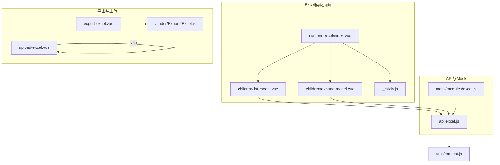
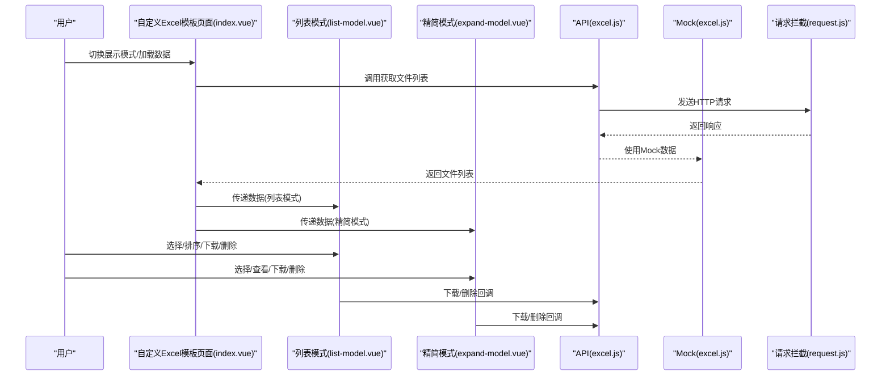
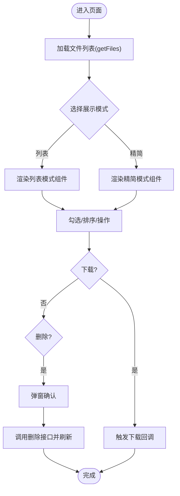
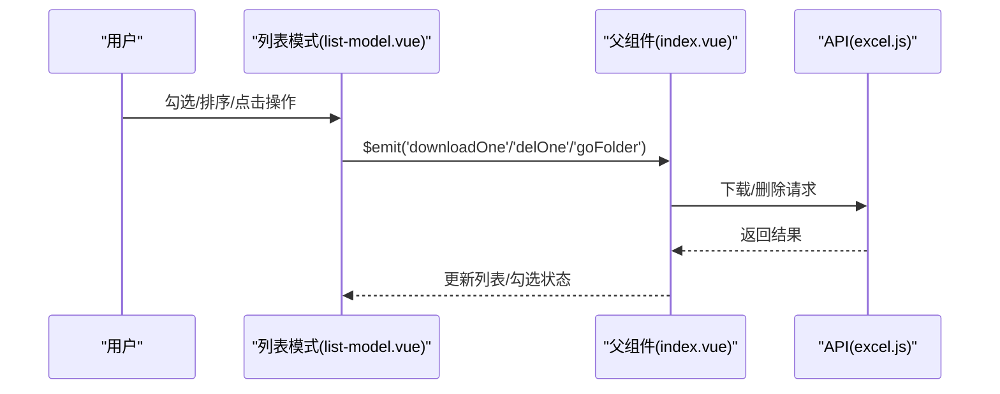
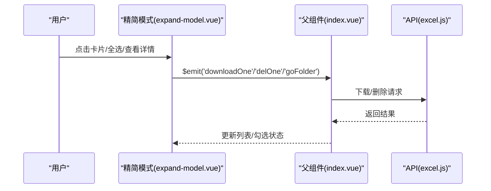
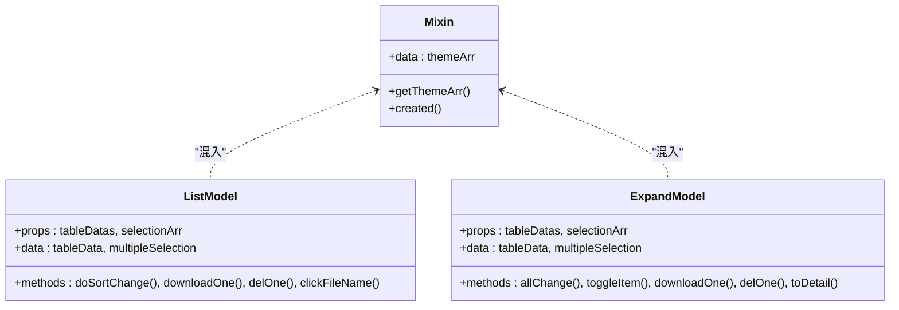
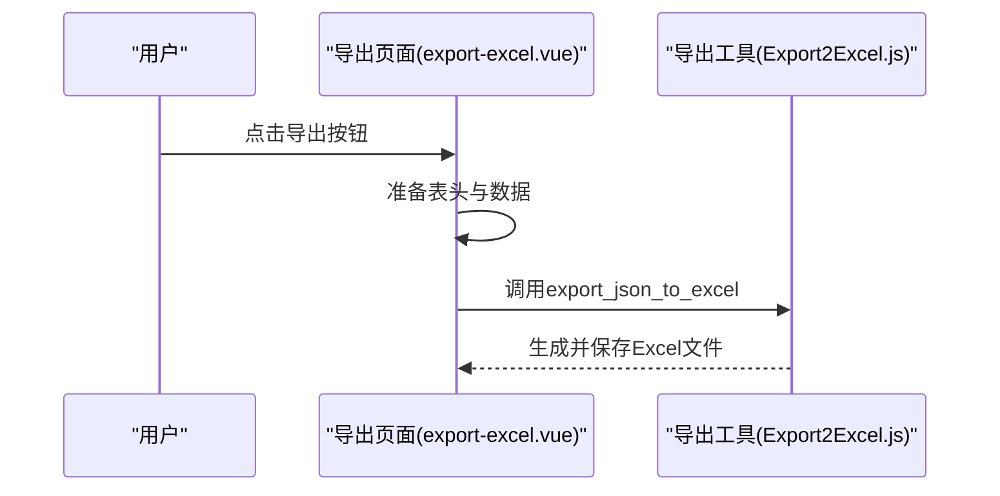
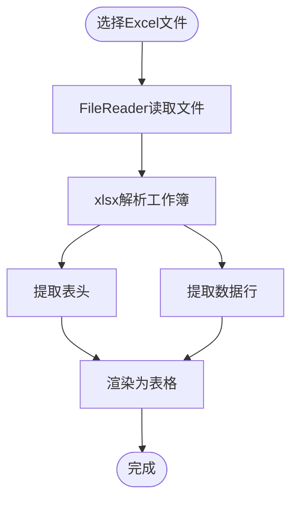
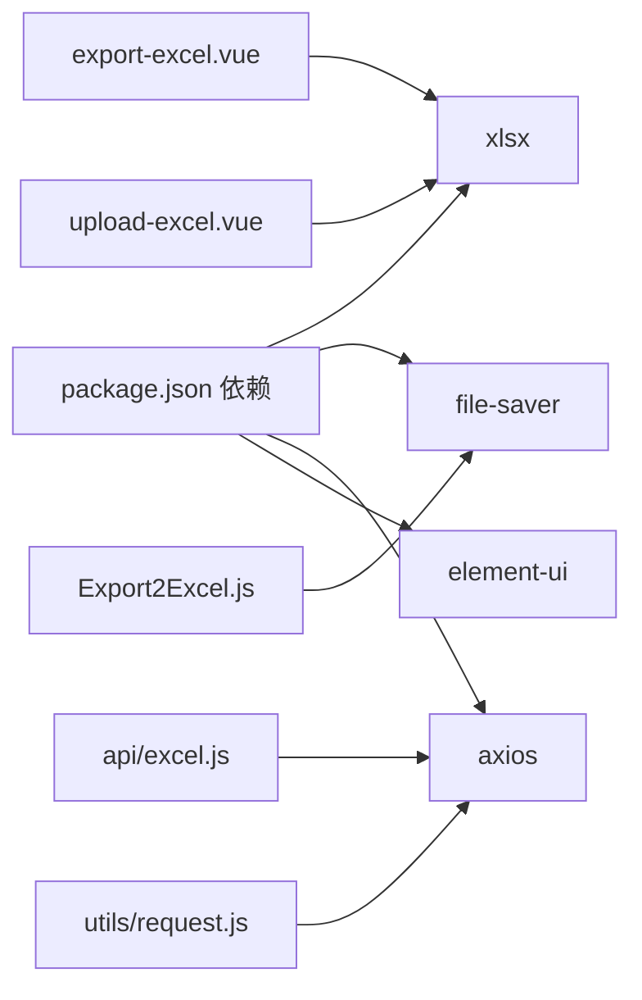

# 自定义Excel模板

<cite>
**本文档引用的文件**
- [index.vue](file://src/views/excel/custom-excel/index.vue)
- [_mixin.js](file://src/views/excel/custom-excel/children/_mixin.js)
- [expand-model.vue](file://src/views/excel/custom-excel/children/expand-model.vue)
- [list-model.vue](file://src/views/excel/custom-excel/children/list-model.vue)
- [excel.js](file://src/api/excel.js)
- [excel.js](file://src/mock/modules/excel.js)
- [export-excel.vue](file://src/views/excel/export-excel.vue)
- [upload-excel.vue](file://src/views/excel/upload-excel.vue)
- [Export2Excel.js](file://src/vendor/Export2Excel.js)
- [request.js](file://src/utils/request.js)
- [package.json](file://package.json)
</cite>

## 目录
1. [简介](#简介)
2. [项目结构](#项目结构)
3. [核心组件](#核心组件)
4. [架构总览](#架构总览)
5. [详细组件分析](#详细组件分析)
6. [依赖分析](#依赖分析)
7. [性能考虑](#性能考虑)
8. [故障排查指南](#故障排查指南)
9. [结论](#结论)
10. [附录](#附录)

## 简介
本项目提供了完整的自定义Excel模板系统，涵盖模板设计、数据映射、渲染与导出、上传解析、以及模板混入复用机制。系统支持两种展示模式（列表/精简），并提供统一的下载、删除、详情查看等功能。模板导出基于XLSX库，支持JSON数据导出为Excel文件；模板上传解析基于xlsx库，支持本地Excel文件读取与预览。

## 项目结构
Excel相关功能主要分布在以下模块：
- 自定义Excel模板页面：包含列表模式与精简模式组件，以及通用混入
- Excel导出页面：演示如何将JSON数据导出为Excel
- Excel上传页面：演示如何读取本地Excel文件并解析为表格数据
- API与Mock：提供文件列表、删除等接口的模拟数据
- 导出工具：封装了基于xlsx的导出能力

**图表来源**
- [index.vue:1-205](file://src/views/excel/custom-excel/index.vue#L1-L205)
- [list-model.vue:1-543](file://src/views/excel/custom-excel/children/list-model.vue#L1-L543)
- [expand-model.vue:1-579](file://src/views/excel/custom-excel/children/expand-model.vue#L1-L579)
- [_mixin.js:1-21](file://src/views/excel/custom-excel/children/_mixin.js#L1-L21)
- [export-excel.vue:1-172](file://src/views/excel/export-excel.vue#L1-L172)
- [upload-excel.vue:1-130](file://src/views/excel/upload-excel.vue#L1-L130)
- [Export2Excel.js:1-159](file://src/vendor/Export2Excel.js#L1-L159)
- [excel.js:1-38](file://src/api/excel.js#L1-L38)
- [excel.js:1-93](file://src/mock/modules/excel.js#L1-L93)
- [request.js:1-139](file://src/utils/request.js#L1-L139)

**章节来源**
- [index.vue:1-205](file://src/views/excel/custom-excel/index.vue#L1-L205)
- [excel.js:1-38](file://src/api/excel.js#L1-L38)
- [excel.js:1-93](file://src/mock/modules/excel.js#L1-L93)

## 核心组件
- 自定义Excel模板主页面：负责切换展示模式、加载文件列表、处理下载与删除事件
- 列表模式组件：以表格形式展示素材，支持排序、多选、查看详情、图片预览、下载与删除
- 精简模式组件：以卡片形式展示素材，支持全选、单选、图片大图弹窗、详情弹窗、下载与删除
- 模板混入：提供可复用的主题数组等通用逻辑
- 导出页面：演示将JSON数据导出为Excel文件
- 上传页面：演示读取本地Excel文件并解析为表格数据
- 导出工具：封装了基于xlsx的导出能力（表格与JSON）

**章节来源**
- [index.vue:52-142](file://src/views/excel/custom-excel/index.vue#L52-L142)
- [list-model.vue:154-277](file://src/views/excel/custom-excel/children/list-model.vue#L154-L277)
- [expand-model.vue:170-363](file://src/views/excel/custom-excel/children/expand-model.vue#L170-L363)
- [_mixin.js:1-21](file://src/views/excel/custom-excel/children/_mixin.js#L1-L21)
- [export-excel.vue:38-148](file://src/views/excel/export-excel.vue#L38-L148)
- [upload-excel.vue:29-94](file://src/views/excel/upload-excel.vue#L29-L94)
- [Export2Excel.js:117-159](file://src/vendor/Export2Excel.js#L117-L159)

## 架构总览
系统采用“页面组件 + 子组件 + 混入 + 工具库”的分层架构：
- 页面组件负责控制态与事件分发
- 子组件负责具体的数据展示与交互
- 混入提供可复用的通用逻辑
- 工具库封装底层导出与解析能力
- API与Mock提供数据源

**图表来源**
- [index.vue:74-141](file://src/views/excel/custom-excel/index.vue#L74-L141)
- [list-model.vue:192-268](file://src/views/excel/custom-excel/children/list-model.vue#L192-L268)
- [expand-model.vue:221-324](file://src/views/excel/custom-excel/children/expand-model.vue#L221-L324)
- [excel.js:24-37](file://src/api/excel.js#L24-L37)
- [excel.js:74-91](file://src/mock/modules/excel.js#L74-L91)
- [request.js:18-52](file://src/utils/request.js#L18-L52)

## 详细组件分析

### 自定义Excel模板主页面
- 功能职责
  - 切换展示模式（列表/精简）
  - 加载文件列表
  - 处理批量下载与删除
  - 弹窗确认删除
- 关键流程
  - 初始化加载文件列表
  - 根据选择项触发下载或删除
  - 删除确认后调用删除接口并刷新列表

**图表来源**
- [index.vue:74-141](file://src/views/excel/custom-excel/index.vue#L74-L141)
- [excel.js:24-37](file://src/api/excel.js#L24-L37)

**章节来源**
- [index.vue:52-142](file://src/views/excel/custom-excel/index.vue#L52-L142)

### 列表模式组件
- 数据绑定：接收父组件传入的文件列表与勾选状态
- 交互能力：
  - 多选：监听selection-change，同步勾选项到父组件
  - 排序：自定义排序事件，向父组件传递排序参数
  - 查看详情：根据素材类型打开详情弹窗或图片预览
  - 下载/删除：触发父组件回调
- 视觉呈现：按素材类型显示不同图标，支持中文标题溢出提示

**图表来源**
- [list-model.vue:192-268](file://src/views/excel/custom-excel/children/list-model.vue#L192-L268)
- [index.vue:119-137](file://src/views/excel/custom-excel/index.vue#L119-L137)

**章节来源**
- [list-model.vue:154-277](file://src/views/excel/custom-excel/children/list-model.vue#L154-L277)

### 精简模式组件
- 数据绑定：接收父组件传入的文件列表与勾选状态
- 交互能力：
  - 全选/反选：同步到父组件checkList
  - 单个勾选：动态计算全选状态
  - 查看详情：根据素材类型打开详情弹窗或跳转新闻稿详情
  - 图片预览：弹窗展示大图并支持下载
  - 下载/删除：触发父组件回调
- 视觉呈现：卡片布局，按素材类型显示不同图标

**图表来源**
- [expand-model.vue:221-324](file://src/views/excel/custom-excel/children/expand-model.vue#L221-L324)
- [index.vue:119-137](file://src/views/excel/custom-excel/index.vue#L119-L137)

**章节来源**
- [expand-model.vue:170-363](file://src/views/excel/custom-excel/children/expand-model.vue#L170-L363)

### 模板混入（_mixin）
- 设计目的：在多个子组件间复用通用逻辑（如主题数组）
- 使用方式：在子组件中引入混入，即可获得其data与methods
- 注意事项：混入中的created钩子会在组件生命周期前执行，需确保不会覆盖子组件同名逻辑

**图表来源**
- [_mixin.js:1-21](file://src/views/excel/custom-excel/children/_mixin.js#L1-L21)
- [list-model.vue:154-171](file://src/views/excel/custom-excel/children/list-model.vue#L154-L171)
- [expand-model.vue:170-187](file://src/views/excel/custom-excel/children/expand-model.vue#L170-L187)

**章节来源**
- [_mixin.js:1-21](file://src/views/excel/custom-excel/children/_mixin.js#L1-L21)

### 模板导出机制
- 导出入口：导出页面通过按钮触发导出流程
- 数据准备：将表格数据转换为二维数组，首行为表头
- 导出实现：调用导出工具函数，自动调整列宽并生成文件
- 文件命名：支持自定义文件名，默认为“excel-list”

**图表来源**
- [export-excel.vue:80-123](file://src/views/excel/export-excel.vue#L80-L123)
- [Export2Excel.js:117-159](file://src/vendor/Export2Excel.js#L117-L159)

**章节来源**
- [export-excel.vue:38-148](file://src/views/excel/export-excel.vue#L38-L148)
- [Export2Excel.js:117-159](file://src/vendor/Export2Excel.js#L117-L159)

### 模板上传解析
- 上传入口：上传页面提供拖拽上传与文件选择
- 解析流程：读取文件二进制数据，使用xlsx库解析工作簿，提取首张表的表头与数据
- 展示方式：将解析后的表头与数据渲染为表格

**图表来源**
- [upload-excel.vue:45-92](file://src/views/excel/upload-excel.vue#L45-L92)

**章节来源**
- [upload-excel.vue:29-94](file://src/views/excel/upload-excel.vue#L29-L94)

## 依赖分析
- 核心依赖
  - xlsx：用于Excel文件解析与导出
  - file-saver：用于保存Blob文件
  - axios：用于HTTP请求
  - element-ui：用于UI组件与对话框
- 组件间耦合
  - 主页面与子组件通过props与事件进行松耦合通信
  - 子组件与API通过统一的请求拦截器进行交互
  - 导出工具与上传页面分别依赖独立的第三方库

**图表来源**
- [package.json:33-64](file://package.json#L33-L64)
- [export-excel.vue:82-122](file://src/views/excel/export-excel.vue#L82-L122)
- [upload-excel.vue](file://src/views/excel/upload-excel.vue#L30)
- [Export2Excel.js:2-4](file://src/vendor/Export2Excel.js#L2-L4)
- [excel.js](file://src/api/excel.js#L1)
- [request.js](file://src/utils/request.js#L1)

**章节来源**
- [package.json:33-64](file://package.json#L33-L64)
- [excel.js:1-38](file://src/api/excel.js#L1-L38)
- [request.js:1-139](file://src/utils/request.js#L1-L139)

## 性能考虑
- 渲染优化
  - 列表模式使用Element Table的虚拟滚动能力（若数据量大可启用）
  - 精简模式采用卡片布局，适合小规模数据展示
- 数据处理
  - 导出时自动计算列宽，避免文本截断
  - 上传解析仅读取首张表，减少不必要的解析开销
- 网络请求
  - 请求拦截器统一处理超时与错误提示
  - GET请求增加时间戳参数避免缓存问题

[本节为通用建议，不直接分析具体文件]

## 故障排查指南
- 导出文件为空或列宽异常
  - 检查导出数据是否正确转换为二维数组
  - 确认表头与数据长度一致
- 上传文件解析失败
  - 确认文件格式为.xlsx/.xls
  - 检查首张表是否存在且包含有效数据
- 删除操作无效
  - 确认父组件的checkList与子组件的勾选状态同步
  - 检查Mock或真实接口的返回状态码
- 请求超时或网络错误
  - 检查请求拦截器中的超时配置与错误提示
  - 确认后端接口可用性

**章节来源**
- [export-excel.vue:124-134](file://src/views/excel/export-excel.vue#L124-L134)
- [upload-excel.vue:45-92](file://src/views/excel/upload-excel.vue#L45-L92)
- [index.vue:90-117](file://src/views/excel/custom-excel/index.vue#L90-L117)
- [request.js:108-135](file://src/utils/request.js#L108-L135)

## 结论
本系统通过清晰的组件划分与统一的工具库，实现了从数据加载、展示、交互到导出与上传的完整闭环。列表与精简两种模式满足不同场景下的用户体验需求；模板混入提升了代码复用性；导出与上传功能基于成熟的第三方库，具备良好的稳定性与扩展性。建议在实际项目中结合业务需求进一步完善字段校验、权限控制与版本管理策略。

[本节为总结性内容，不直接分析具体文件]

## 附录

### 模板字段配置规则与数据映射
- 字段映射
  - 文件名、大小、上传/修改时间、上传/修改人员、下载量等字段直接映射到素材对象属性
  - 素材类型与文件类型用于决定图标与部分展示逻辑
- 验证逻辑
  - 列表模式：排序参数通过自定义事件传递给父组件
  - 精简模式：全选/单选状态与父组件checkList保持同步
- 格式化输出
  - 导出时自动调整列宽，中文字符按两倍宽度计算

**章节来源**
- [list-model.vue:192-209](file://src/views/excel/custom-excel/children/list-model.vue#L192-L209)
- [expand-model.vue:257-271](file://src/views/excel/custom-excel/children/expand-model.vue#L257-L271)
- [Export2Excel.js:125-150](file://src/vendor/Export2Excel.js#L125-L150)

### 模板版本管理与兼容性
- 版本标识
  - 建议在导出文件中加入版本号与生成时间戳，便于追踪
- 兼容性处理
  - 导出时使用xlsx标准格式，确保Office版本兼容
  - 上传解析时忽略隐藏列与空行，提升健壮性
- 升级策略
  - 新增字段时保留旧字段映射，避免破坏既有导出模板
  - 提供迁移脚本或版本提示，引导用户更新模板

[本节为通用建议，不直接分析具体文件]

### 扩展指南
- 自定义字段类型
  - 在导出页面新增表头与数据映射，确保与后端字段一致
- 业务规则集成
  - 在子组件中扩展事件回调，接入业务侧的校验与权限控制
- 模板库管理
  - 建议维护模板清单与版本历史，提供模板导入/导出能力

[本节为通用建议，不直接分析具体文件]