# 主页仪表板

<cite>
**本文档引用的文件**
- [src/views/homepage/index.vue](file://src/views/homepage/index.vue)
- [src/api/homepage.js](file://src/api/homepage.js)
- [src/views/homepage/near-six-month.vue](file://src/views/homepage/near-six-month.vue)
- [src/views/homepage/investment-pie.vue](file://src/views/homepage/investment-pie.vue)
- [src/views/homepage/financing-pie.vue](file://src/views/homepage/financing-pie.vue)
- [src/components/color-line/index.vue](file://src/components/color-line/index.vue)
- [src/utils/request.js](file://src/utils/request.js)
- [src/utils/index.js](file://src/utils/index.js)
- [src/mock/modules/homepage.js](file://src/mock/modules/homepage.js)
- [src/mock/homepage.js](file://src/mock/homepage.js)
- [src/assets/style/base.scss](file://src/assets/style/base.scss)
- [src/main.js](file://src/main.js)
</cite>

## 目录
1. [简介](#简介)
2. [项目结构](#项目结构)
3. [核心组件](#核心组件)
4. [架构概览](#架构概览)
5. [详细组件分析](#详细组件分析)
6. [依赖关系分析](#依赖关系分析)
7. [性能考虑](#性能考虑)
8. [故障排除指南](#故障排除指南)
9. [结论](#结论)
10. [附录](#附录)

## 简介

主页仪表板是Vue CMS项目的核心功能模块，提供了全面的数据可视化和业务监控界面。该仪表板采用响应式设计，集成了多种图表组件，包括近六个月交易记录图表、投资分布饼图、融资期限饼图等，为用户提供直观的数据洞察和业务指标展示。

仪表板采用现代化的前端技术栈，结合Element UI组件库、ECharts图表库和Better Scroll滚动组件，实现了丰富的交互体验和良好的用户体验。系统支持多语言国际化，具备完整的错误处理机制和性能优化策略。

## 项目结构

仪表板功能主要分布在以下目录结构中：

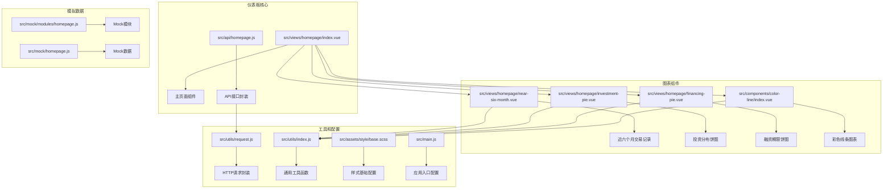

**图表来源**
- [src/views/homepage/index.vue:1-654](file://src/views/homepage/index.vue#L1-L654)
- [src/api/homepage.js:1-23](file://src/api/homepage.js#L1-L23)

**章节来源**
- [src/views/homepage/index.vue:1-654](file://src/views/homepage/index.vue#L1-L654)
- [src/main.js:1-53](file://src/main.js#L1-L53)

## 核心组件

### 主页面容器组件

主页仪表板的核心容器组件负责整体布局管理和数据协调。该组件采用Element UI的栅格系统，实现了响应式的三段式布局设计。

#### 布局结构

组件采用三层布局架构：
- **顶部数据卡片区域**：展示关键业务指标，支持数字动画效果
- **中部内容区域**：包含交易记录图表和详细信息列表
- **底部统计区域**：展示投资分布和融资期限分析

#### 数据流管理

组件通过三个独立的API调用获取不同类型的业务数据：
- 首页总览数据：平台交易总额、投资人收益等关键指标
- 详情项目数据：注册用户数、活跃用户数等辅助指标
- 排行榜数据：投资排行榜用户信息

**章节来源**
- [src/views/homepage/index.vue:176-278](file://src/views/homepage/index.vue#L176-L278)
- [src/api/homepage.js:1-23](file://src/api/homepage.js#L1-L23)

### 数字动画组件

仪表板实现了平滑的数字动画效果，通过CountUp.js库实现数值的渐变动画。

#### 动画实现原理

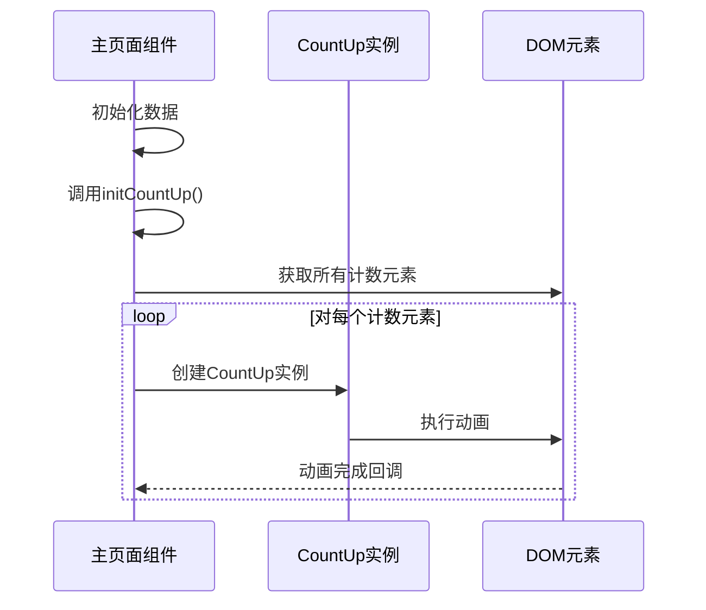

**图表来源**
- [src/views/homepage/index.vue:200-209](file://src/views/homepage/index.vue#L200-L209)

#### 动画配置参数

- **起始值**：从0开始
- **结束值**：目标数值
- **小数位数**：2位小数
- **动画时长**：1.5秒
- **缓动函数**：默认缓动

**章节来源**
- [src/views/homepage/index.vue:200-209](file://src/views/homepage/index.vue#L200-L209)

### 滚动列表组件

投资排行榜采用了Better Scroll实现的高性能滚动列表，支持流畅的垂直滚动体验。

#### 滚动配置优化

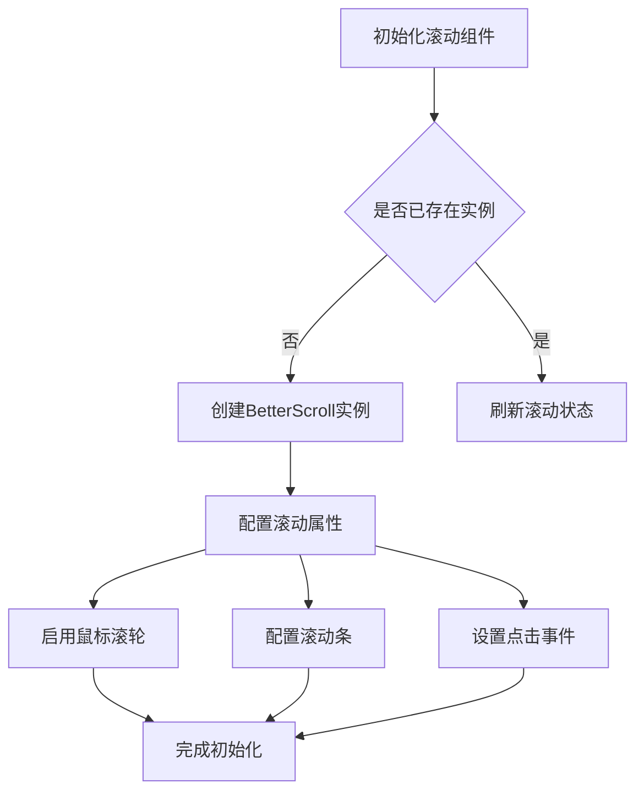

**图表来源**
- [src/views/homepage/index.vue:210-231](file://src/views/homepage/index.vue#L210-L231)

#### 性能优化特性

- **虚拟滚动**：仅渲染可见区域元素
- **防抖处理**：避免频繁重绘
- **内存管理**：组件销毁时自动清理资源

**章节来源**
- [src/views/homepage/index.vue:210-231](file://src/views/homepage/index.vue#L210-L231)

## 架构概览

仪表板采用分层架构设计，各组件职责明确，耦合度低，便于维护和扩展。

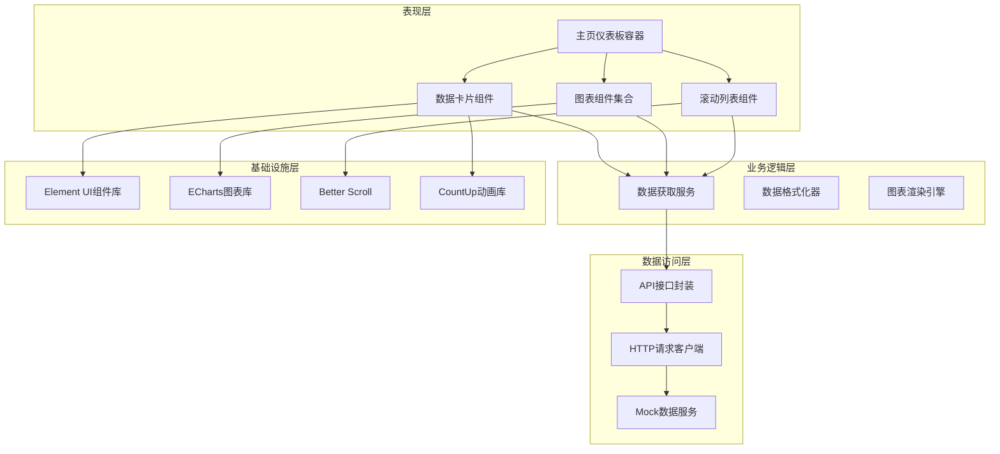

**图表来源**
- [src/views/homepage/index.vue:176-278](file://src/views/homepage/index.vue#L176-L278)
- [src/api/homepage.js:1-23](file://src/api/homepage.js#L1-L23)

### 数据流向

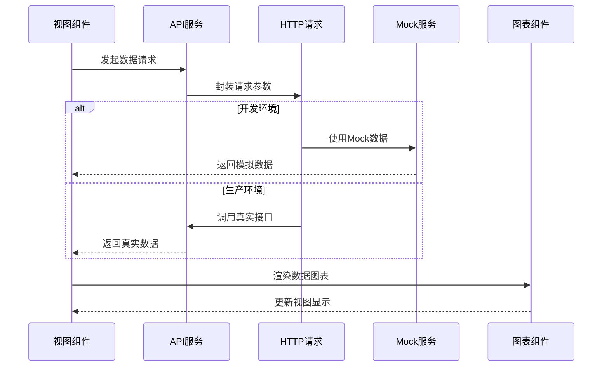

**图表来源**
- [src/utils/request.js:1-139](file://src/utils/request.js#L1-L139)
- [src/mock/modules/homepage.js:1-120](file://src/mock/modules/homepage.js#L1-L120)

## 详细组件分析

### 近六个月交易记录图表

近六个月交易记录图表是仪表板的核心可视化组件，展示了平台交易的关键趋势数据。

#### 图表配置详解

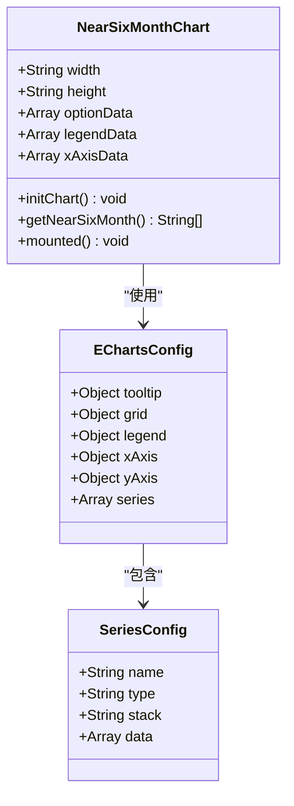

**图表来源**
- [src/views/homepage/near-six-month.vue:51-107](file://src/views/homepage/near-six-month.vue#L51-L107)

#### 时间轴计算逻辑

图表采用智能的时间轴计算算法，确保始终显示最近六个月的数据：

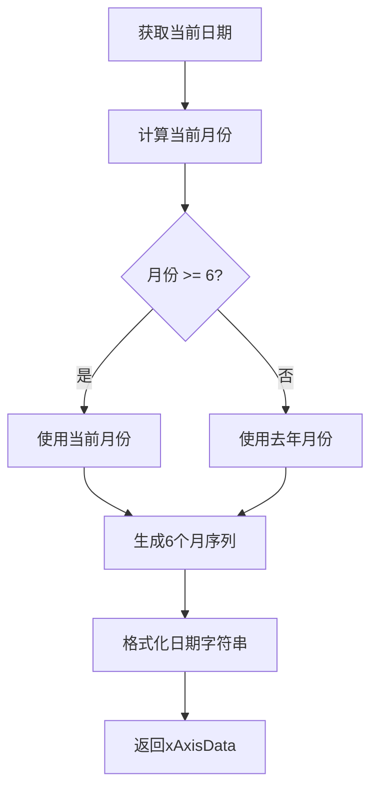

**图表来源**
- [src/views/homepage/near-six-month.vue:31-50](file://src/views/homepage/near-six-month.vue#L31-L50)

#### 图表配置参数

| 参数 | 类型 | 默认值 | 描述 |
|------|------|--------|------|
| tooltip.trigger | String | 'axis' | 提示框触发方式 |
| grid.left/right/bottom/top | String | '50px'/'10px'/'30px'/'10px' | 内边距设置 |
| legend.data | Array | 5个系列名称 | 图例标签数组 |
| xAxis.type | String | 'category' | 坐标轴类型 |
| series[].stack | String | '总量' | 数据堆叠标识 |

**章节来源**
- [src/views/homepage/near-six-month.vue:51-107](file://src/views/homepage/near-six-month.vue#L51-L107)

### 投资分布饼图

投资分布饼图展示了不同投资金额区间的分布情况，帮助用户了解平台的投资结构。

#### 饼图配置特点

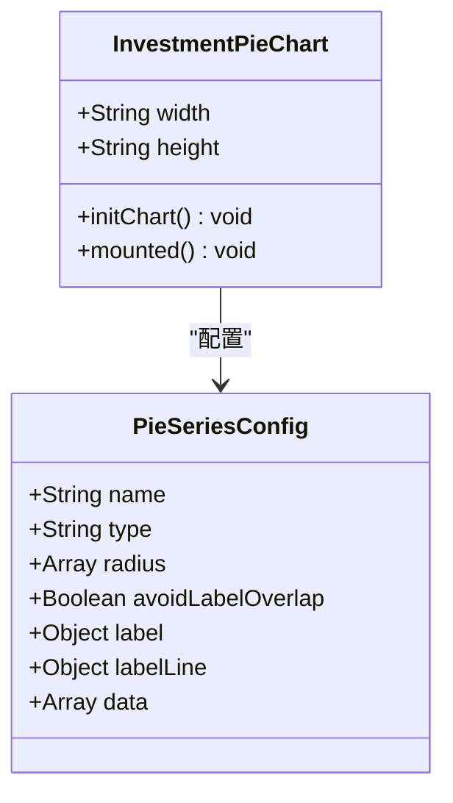

**图表来源**
- [src/views/homepage/investment-pie.vue:33-78](file://src/views/homepage/investment-pie.vue#L33-L78)

#### 数据分布区间

| 区间范围 | 占比 | 颜色编码 |
|----------|------|----------|
| 1万元以下 | 33.04% | 浅蓝色系 |
| 1-10万 | 30.57% | 中蓝色系 |
| 10-40万 | 23.08% | 深蓝色系 |
| 40万以上 | 13.31% | 紫色系 |

#### 饼图视觉设计

- **环形结构**：外半径80%，内半径60%
- **标签隐藏**：默认隐藏标签，强调视觉效果
- **高亮显示**：悬停时显示详细标签
- **字体大小**：高亮状态下18px粗体

**章节来源**
- [src/views/homepage/investment-pie.vue:33-78](file://src/views/homepage/investment-pie.vue#L33-L78)

### 融资期限饼图

融资期限饼图分析了不同融资期限的分布情况，为用户提供融资结构洞察。

#### 融资期限分类

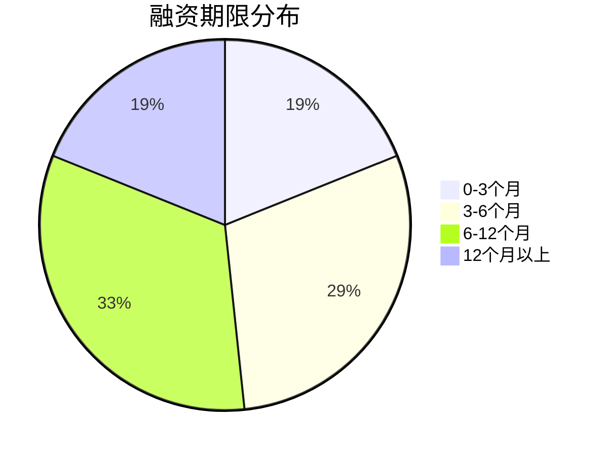

**图表来源**
- [src/views/homepage/financing-pie.vue:69-75](file://src/views/homepage/financing-pie.vue#L69-L75)

#### 配置参数对比

| 特性 | 投资分布 | 融资期限 |
|------|----------|----------|
| 饼图半径 | 60%-80% | 60%-80% |
| 标签显示 | 默认隐藏 | 默认隐藏 |
| 高亮样式 | 18px粗体 | 18px粗体 |
| 数据项数量 | 4个 | 4个 |
| 颜色方案 | 蓝色调 | 绿色调 |

**章节来源**
- [src/views/homepage/financing-pie.vue:33-78](file://src/views/homepage/financing-pie.vue#L33-L78)

### 彩色线条组件

彩色线条组件是一个轻量级的图表组件，用于在数据卡片中展示趋势线。

#### 组件设计特点

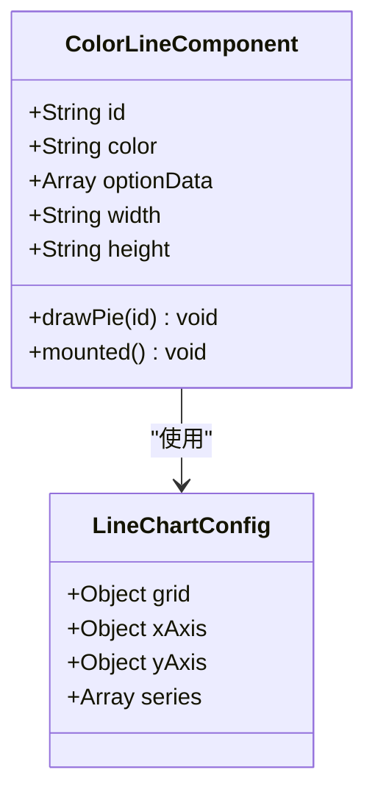

**图表来源**
- [src/components/color-line/index.vue:35-77](file://src/components/color-line/index.vue#L35-L77)

#### 技术实现要点

- **无坐标轴**：隐藏x轴和y轴，专注于线条展示
- **平滑曲线**：使用smooth属性创建流畅的曲线效果
- **自适应尺寸**：根据props动态调整图表尺寸
- **实时渲染**：组件挂载时立即执行渲染

**章节来源**
- [src/components/color-line/index.vue:35-77](file://src/components/color-line/index.vue#L35-L77)

## 依赖关系分析

仪表板组件之间的依赖关系清晰明确，形成了稳定的组件生态系统。

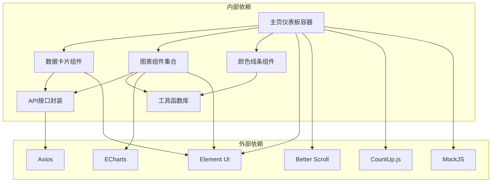

**图表来源**
- [src/views/homepage/index.vue:176-189](file://src/views/homepage/index.vue#L176-L189)
- [src/api/homepage.js:1-23](file://src/api/homepage.js#L1-L23)

### 组件通信模式

仪表板采用单向数据流和事件驱动相结合的通信模式：

1. **父组件到子组件**：通过props传递配置和数据
2. **子组件到父组件**：通过事件回调通知状态变化
3. **组件到服务**：通过API接口获取远程数据
4. **服务到组件**：通过Promise链式调用返回数据

**章节来源**
- [src/views/homepage/index.vue:176-278](file://src/views/homepage/index.vue#L176-L278)
- [src/api/homepage.js:1-23](file://src/api/homepage.js#L1-L23)

## 性能考虑

仪表板在设计时充分考虑了性能优化，采用了多种策略确保良好的用户体验。

### 渲染性能优化

#### 虚拟滚动实现

投资排行榜采用了Better Scroll的虚拟滚动技术，通过以下机制优化性能：

- **按需渲染**：只渲染可视区域内的列表项
- **DOM复用**：滚动过程中复用DOM元素
- **缓冲区管理**：预渲染上下文缓冲区提高滚动流畅度

#### 图表渲染优化

图表组件采用懒加载和防抖机制：

- **延迟初始化**：组件挂载后再进行图表初始化
- **resize防抖**：窗口大小变化时进行防抖处理
- **内存清理**：组件销毁时自动清理图表实例

### 网络性能优化

#### 请求拦截器设计

HTTP请求拦截器实现了多项性能优化：

- **超时控制**：5秒超时限制，避免长时间等待
- **缓存策略**：GET请求添加时间戳参数避免缓存
- **错误处理**：统一的错误处理机制减少异常传播

#### Mock数据集成

开发环境中集成了完整的Mock数据服务：

- **本地数据**：无需真实后端即可进行开发调试
- **数据一致性**：Mock数据与真实接口保持一致的格式
- **随机化处理**：使用MockJS生成随机但合理的测试数据

### 内存管理策略

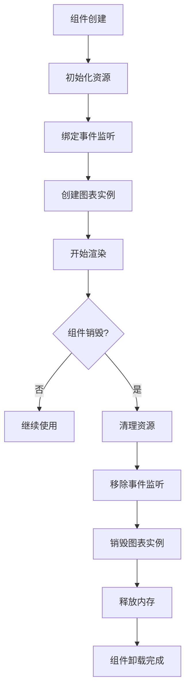

**图表来源**
- [src/views/homepage/index.vue:267-271](file://src/views/homepage/index.vue#L267-L271)

**章节来源**
- [src/utils/request.js:18-52](file://src/utils/request.js#L18-L52)
- [src/mock/modules/homepage.js:1-120](file://src/mock/modules/homepage.js#L1-L120)

## 故障排除指南

### 常见问题诊断

#### 图表渲染失败

**症状**：图表无法正常显示或显示为空白

**可能原因**：
1. 容器尺寸未正确设置
2. ECharts库加载失败
3. 数据格式不符合要求

**解决方案**：
1. 检查组件的width和height属性
2. 确认ECharts依赖正确引入
3. 验证数据格式和类型

#### 滚动列表卡顿

**症状**：投资排行榜滚动不流畅

**可能原因**：
1. 列表项过多导致渲染压力
2. 滚动配置不当
3. DOM操作过于频繁

**解决方案**：
1. 检查Better Scroll配置参数
2. 优化列表项的渲染逻辑
3. 考虑分页加载策略

#### 数据加载异常

**症状**：API请求失败或数据格式错误

**可能原因**：
1. 网络连接问题
2. 接口地址配置错误
3. 数据格式不匹配

**解决方案**：
1. 检查网络连接状态
2. 验证API接口配置
3. 实现数据格式验证

### 错误处理机制

仪表板实现了多层次的错误处理机制：

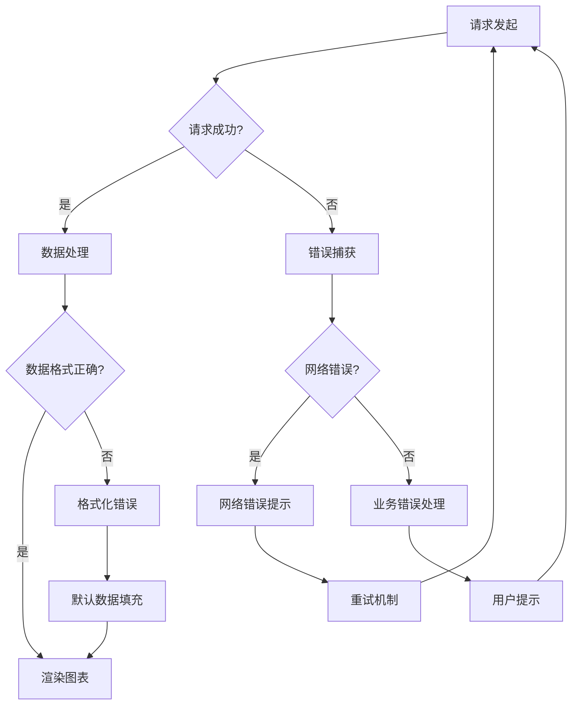

**图表来源**
- [src/utils/request.js:54-136](file://src/utils/request.js#L54-L136)

**章节来源**
- [src/utils/request.js:54-136](file://src/utils/request.js#L54-L136)

## 结论

主页仪表板是一个功能完整、设计精良的数据可视化系统。通过合理的架构设计和丰富的组件实现，为用户提供了直观、易用的业务监控界面。

### 主要优势

1. **响应式设计**：完美适配各种屏幕尺寸
2. **丰富的图表类型**：涵盖线图、饼图等多种可视化形式
3. **优秀的用户体验**：流畅的动画效果和交互体验
4. **完善的错误处理**：健壮的异常处理和降级策略
5. **良好的性能表现**：优化的渲染和内存管理

### 技术亮点

- **模块化架构**：清晰的组件分离和职责划分
- **数据驱动**：基于API的数据驱动渲染模式
- **可扩展性**：易于添加新的图表类型和功能模块
- **国际化支持**：完整的多语言支持机制

### 改进建议

1. **数据缓存机制**：实现数据缓存减少重复请求
2. **图表主题定制**：支持更多图表主题和样式配置
3. **移动端优化**：进一步优化移动端的交互体验
4. **性能监控**：集成性能监控和分析工具

## 附录

### 样式定制指南

仪表板使用CSS变量实现主题定制，支持以下变量：

| 变量名 | 默认值 | 用途 |
|--------|--------|------|
| --next-color-white | #ffffff | 白色背景 |
| --next-bg-main-color | #f8f8f8 | 主背景色 |
| --next-border-color-light | #f1f2f3 | 边框浅色 |
| --next-color-primary-lighter | #ecf5ff | 主色浅色 |

### 图表配置参数参考

#### ECharts基础配置

```javascript
// 通用配置模板
{
  tooltip: {
    trigger: 'axis'
  },
  grid: {
    left: '5%',
    right: '5%',
    bottom: '5%',
    top: '5%'
  },
  legend: {
    data: []
  },
  xAxis: {
    type: 'category',
    data: []
  },
  yAxis: {
    type: 'value'
  }
}
```

#### 图表尺寸规范

| 组件类型 | 推荐宽度 | 推荐高度 | 最小宽度 |
|----------|----------|----------|----------|
| 近六个月图表 | 100% | 300px | 300px |
| 投资分布饼图 | 100% | 330px | 250px |
| 融资期限饼图 | 100% | 330px | 250px |
| 数据卡片图表 | 180px | 70px | 150px |

### 开发最佳实践

1. **组件复用**：优先使用现有组件而非重复开发
2. **数据验证**：对所有外部数据进行格式验证
3. **错误边界**：为关键组件设置错误边界处理
4. **性能监控**：定期监控组件的渲染性能
5. **文档维护**：及时更新组件使用文档