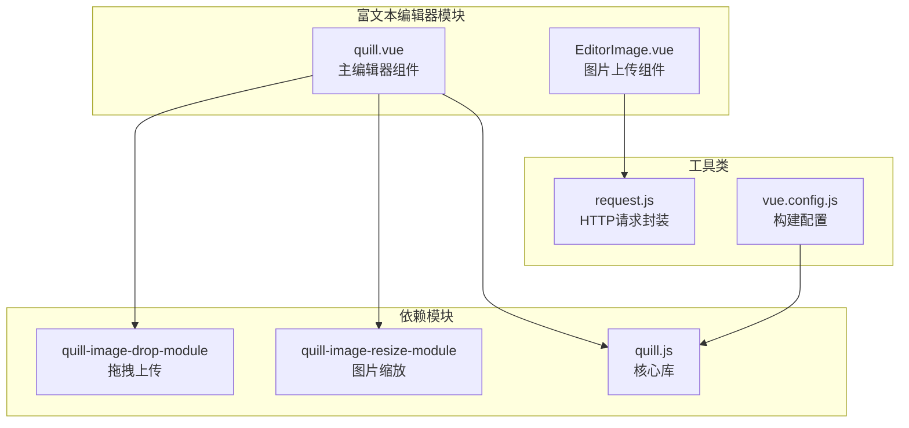
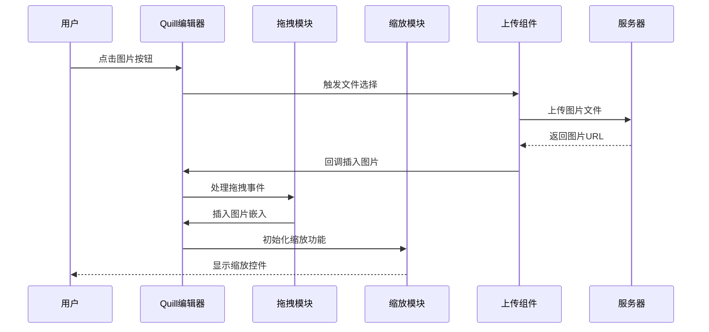
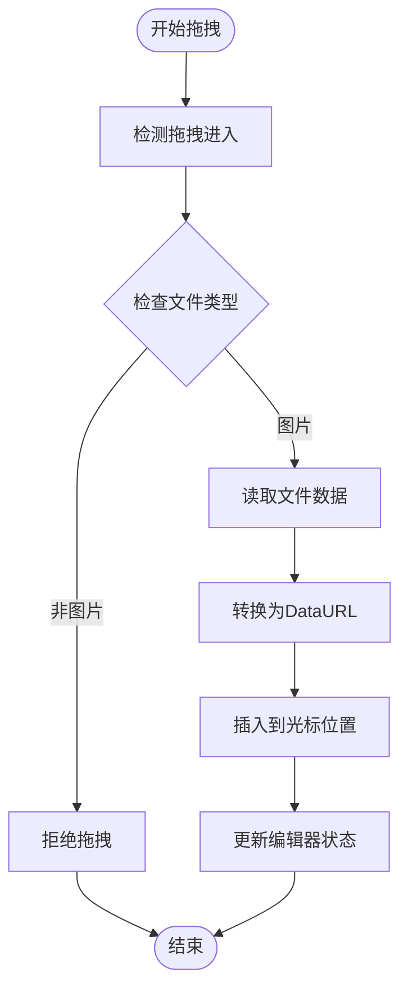
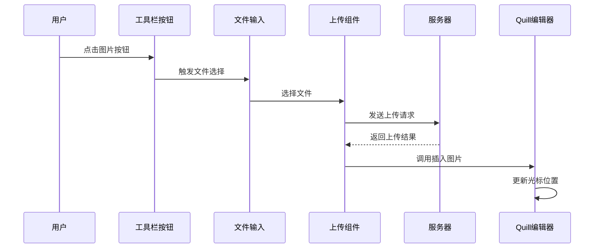
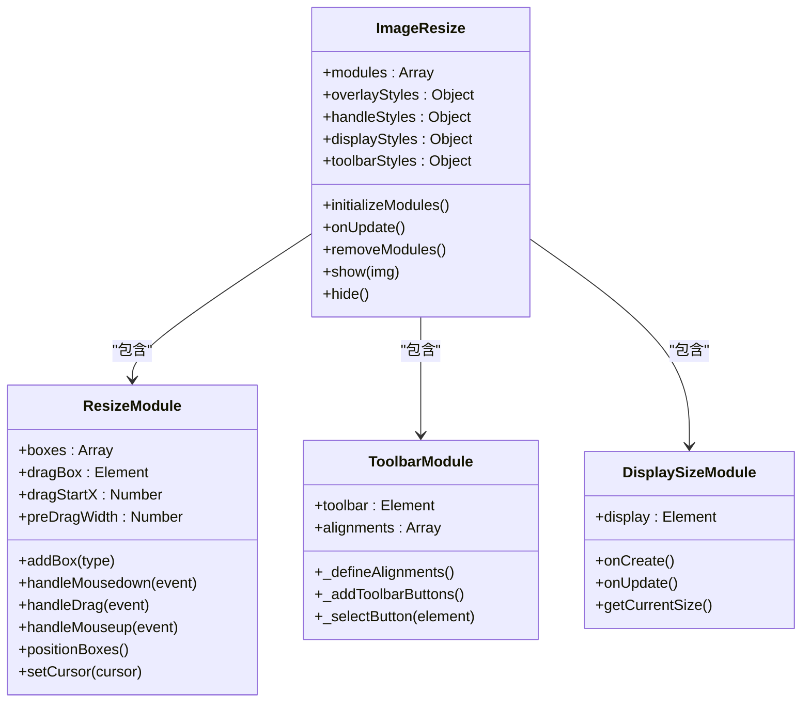
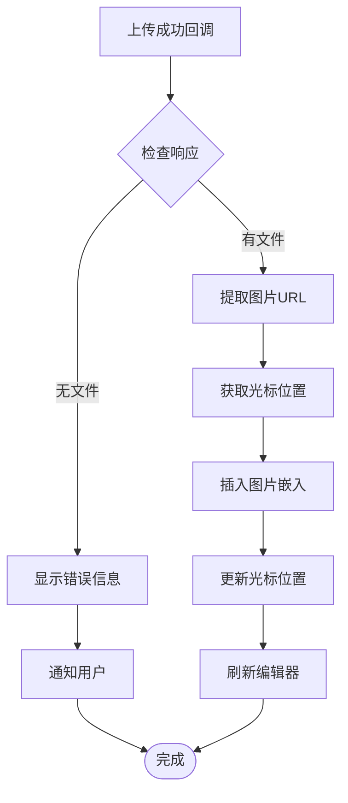
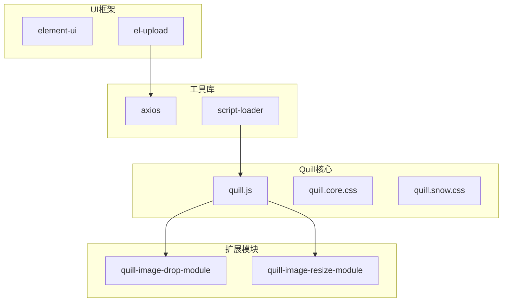

# Quill图片上传功能

<cite>
**本文引用的文件**
- [quill.vue](file://src/views/rich-editor/quill.vue)
- [package.json](file://package.json)
- [request.js](file://src/utils/request.js)
- [vue.config.js](file://vue.config.js)
- [EditorImage.vue](file://src/views/rich-editor/tinymce-components/components/EditorImage.vue)
- [quill.js](file://node_modules/quill/dist/quill.js)
- [image-drop.min.js](file://node_modules/quill-image-drop-module/image-drop.min.js)
- [image-resize.min.js](file://node_modules/quill-image-resize-module/image-resize.min.js)
</cite>

## 目录
1. [简介](#简介)
2. [项目结构](#项目结构)
3. [核心组件](#核心组件)
4. [架构概览](#架构概览)
5. [详细组件分析](#详细组件分析)
6. [依赖关系分析](#依赖关系分析)
7. [性能考虑](#性能考虑)
8. [故障排除指南](#故障排除指南)
9. [结论](#结论)
10. [附录](#附录)

## 简介

本文件详细介绍了Vue CMS项目中Quill富文本编辑器的图片上传功能实现。该功能集成了多种上传方式，包括拖拽上传、点击上传和自动上传，提供了完整的图片处理流程，从文件选择到服务器上传，再到编辑器中的显示和交互。

Quill作为现代富文本编辑器，通过模块化架构支持丰富的扩展功能。本项目中集成了两个关键模块：`quill-image-drop-module`用于拖拽上传，`quill-image-resize-module`用于图片缩放和编辑。

## 项目结构

Quill图片上传功能主要分布在以下文件中：

**图表来源**
- [quill.vue:1-236](file://src/views/rich-editor/quill.vue#L1-L236)
- [EditorImage.vue:1-107](file://src/views/rich-editor/tinymce-components/components/EditorImage.vue#L1-L107)

**章节来源**
- [quill.vue:1-236](file://src/views/rich-editor/quill.vue#L1-L236)
- [package.json:33-64](file://package.json#L33-L64)

## 核心组件

### Quill编辑器组件

主编辑器组件实现了完整的图片上传功能，包括工具栏配置、事件处理和模块集成。

**关键特性：**
- 自定义工具栏配置，包含图片上传按钮
- 图片拖拽上传支持
- 图片缩放和编辑功能
- 实时内容长度统计
- 成功回调处理和错误处理

**章节来源**
- [quill.vue:46-192](file://src/views/rich-editor/quill.vue#L46-L192)

### 图片上传组件

独立的图片上传组件提供了更灵活的上传控制，支持多文件上传和批量处理。

**核心功能：**
- 弹窗式上传界面
- 多文件上传支持
- 上传状态跟踪
- 批量确认提交
- 图片尺寸预览

**章节来源**
- [EditorImage.vue:28-96](file://src/views/rich-editor/tinymce-components/components/EditorImage.vue#L28-L96)

## 架构概览

Quill图片上传功能采用分层架构设计，确保各组件职责清晰分离：

**图表来源**
- [quill.vue:88-109](file://src/views/rich-editor/quill.vue#L88-L109)
- [quill.vue:135-183](file://src/views/rich-editor/quill.vue#L135-L183)

## 详细组件分析

### 图片拖拽上传实现

拖拽上传功能通过`quill-image-drop-module`实现，支持从文件系统拖拽图片到编辑器中。

**图表来源**
- [image-drop.min.js:1-68](file://node_modules/quill-image-drop-module/image-drop.min.js#L1-L68)

**实现要点：**
- 支持拖拽和粘贴两种方式
- 自动检测文件类型（image/gif, image/jpeg, image/png等）
- 使用FileReader异步读取文件
- 通过Quill API插入图片嵌入

**章节来源**
- [quill.vue:40-44](file://src/views/rich-editor/quill.vue#L40-L44)
- [image-drop.min.js:60-68](file://node_modules/quill-image-drop-module/image-drop.min.js#L60-L68)

### 点击上传实现

点击上传通过Element UI的Upload组件实现，提供标准的文件上传界面。

**图表来源**
- [quill.vue:14-20](file://src/views/rich-editor/quill.vue#L14-L20)
- [quill.vue:88-109](file://src/views/rich-editor/quill.vue#L88-L109)

**实现细节：**
- 使用隐藏的文件输入框触发上传
- 支持单文件上传（multiple=false）
- 自定义上传成功回调
- 自动调整光标位置

**章节来源**
- [quill.vue:59-66](file://src/views/rich-editor/quill.vue#L59-L66)
- [quill.vue:88-109](file://src/views/rich-editor/quill.vue#L88-L109)

### 图片缩放和编辑功能

图片缩放功能通过`quill-image-resize-module`实现，提供直观的图片编辑体验。

**图表来源**
- [image-resize.min.js:1-200](file://node_modules/quill-image-resize-module/image-resize.min.js#L1-L200)

**功能特性：**
- 可拖拽调整图片尺寸
- 显示实时尺寸信息
- 支持多种对齐方式
- 浮动布局支持
- 响应式设计

**章节来源**
- [quill.vue:150-171](file://src/views/rich-editor/quill.vue#L150-L171)
- [image-resize.min.js:150-200](file://node_modules/quill-image-resize-module/image-resize.min.js#L150-L200)

### 成功回调处理机制

图片上传成功后的处理流程确保了编辑器状态的正确更新：

**图表来源**
- [quill.vue:88-109](file://src/views/rich-editor/quill.vue#L88-L109)

**处理逻辑：**
- 验证服务器返回的文件信息
- 提取正确的图片URL路径
- 获取当前光标位置
- 使用Quill API插入图片
- 自动调整光标到图片末尾

**章节来源**
- [quill.vue:88-109](file://src/views/rich-editor/quill.vue#L88-L109)

### 错误处理和进度反馈

系统提供了多层次的错误处理和用户反馈机制：

**错误处理层次：**
1. **上传前验证**：文件类型检查
2. **上传过程监控**：网络状态和超时处理
3. **服务器响应处理**：业务逻辑错误
4. **编辑器状态恢复**：失败时的状态回滚

**进度反馈机制：**
- 实时内容长度统计
- 上传状态指示
- 错误消息提示
- 成功操作确认

**章节来源**
- [quill.vue:75-85](file://src/views/rich-editor/quill.vue#L75-L85)
- [request.js:54-136](file://src/utils/request.js#L54-L136)

## 依赖关系分析

### 核心依赖模块

**图表来源**
- [package.json:50-52](file://package.json#L50-L52)
- [vue.config.js:60-63](file://vue.config.js#L60-L63)

### 版本兼容性

| 依赖包 | 当前版本 | 最小兼容版本 | 兼容性说明 |
|--------|----------|--------------|------------|
| quill | ^1.3.7 | 1.x | 完全兼容 |
| quill-image-drop-module | ^1.0.3 | 1.0.0 | 完全兼容 |
| quill-image-resize-module | ^3.0.0 | 3.0.0 | 完全兼容 |
| element-ui | ^2.15.14 | 2.15.0 | 完全兼容 |

**章节来源**
- [package.json:50-63](file://package.json#L50-L63)

## 性能考虑

### 上传性能优化

**文件大小限制：**
- 建议设置合理的文件大小上限（如2MB）
- 实现分片上传以支持大文件
- 提供上传进度条显示

**并发控制：**
- 限制同时上传的文件数量
- 实现上传队列管理
- 支持断点续传

**内存管理：**
- 及时释放预览图片的内存
- 使用URL.createObjectURL进行临时存储
- 监控内存使用情况

### 编辑器性能优化

**渲染优化：**
- 避免频繁的DOM重绘
- 使用虚拟滚动处理大量图片
- 实现图片懒加载

**交互优化：**
- 防抖处理工具栏操作
- 节流处理滚动事件
- 优化图片缩放性能

## 故障排除指南

### 常见问题及解决方案

**问题1：图片无法拖拽上传**
- 检查浏览器兼容性
- 确认quill-image-drop-module正确注册
- 验证文件类型过滤规则

**问题2：上传按钮无响应**
- 检查Element UI版本兼容性
- 确认action属性配置正确
- 验证跨域设置

**问题3：图片显示异常**
- 检查图片URL格式
- 验证服务器访问权限
- 确认CORS配置

**问题4：编辑器崩溃**
- 检查Quill版本兼容性
- 验证模块注册顺序
- 确认内存泄漏防护

**章节来源**
- [quill.vue:185-191](file://src/views/rich-editor/quill.vue#L185-L191)
- [request.js:108-136](file://src/utils/request.js#L108-L136)

### 调试技巧

**开发环境调试：**
- 启用Quill debug模式
- 使用浏览器开发者工具
- 监控网络请求状态

**生产环境监控：**
- 实现错误日志收集
- 设置性能指标监控
- 建立用户反馈渠道

## 结论

本项目的Quill图片上传功能实现了现代化富文本编辑器的核心需求。通过模块化设计，系统提供了完整的图片处理能力，包括拖拽上传、点击上传、图片缩放和编辑等功能。

**主要优势：**
- 模块化架构，易于维护和扩展
- 完善的错误处理机制
- 良好的用户体验设计
- 良好的性能表现

**改进建议：**
- 添加文件类型和大小验证
- 实现上传进度显示
- 支持多文件批量上传
- 增强图片压缩功能

## 附录

### 配置参数参考

**Quill配置选项：**
- theme: 'snow' - 编辑器主题
- placeholder: 'Compose an epic...' - 占位符文本
- modules: 图像处理模块配置

**模块配置：**
- imageDrop: true - 启用拖拽上传
- imageResize: 图片缩放配置对象

**章节来源**
- [quill.vue:135-172](file://src/views/rich-editor/quill.vue#L135-L172)

### 扩展开发指南

**自定义上传处理器：**
1. 创建新的上传组件
2. 实现文件验证逻辑
3. 集成第三方云存储服务
4. 添加上传进度反馈

**自定义图片处理：**
1. 扩展ImageResize模块
2. 添加图片滤镜效果
3. 实现图片裁剪功能
4. 集成本地图片管理

**最佳实践建议：**
- 始终验证用户输入
- 实现适当的错误处理
- 保持代码模块化
- 编写完整的测试用例
- 文档化所有配置选项