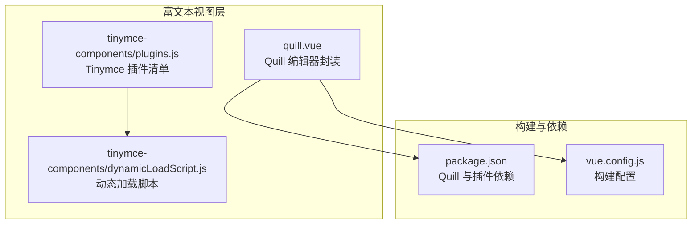
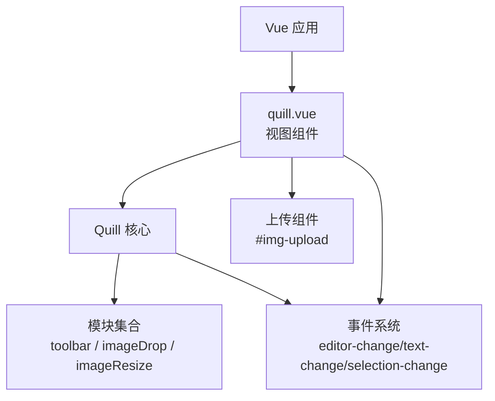
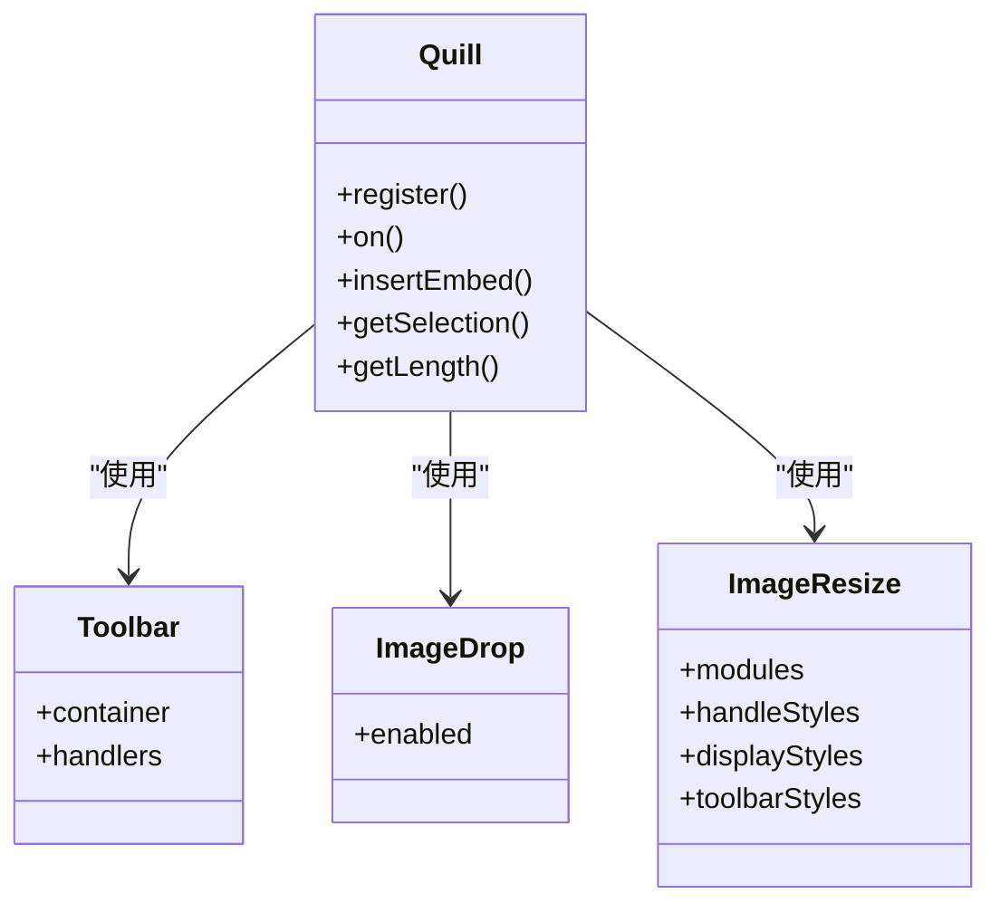
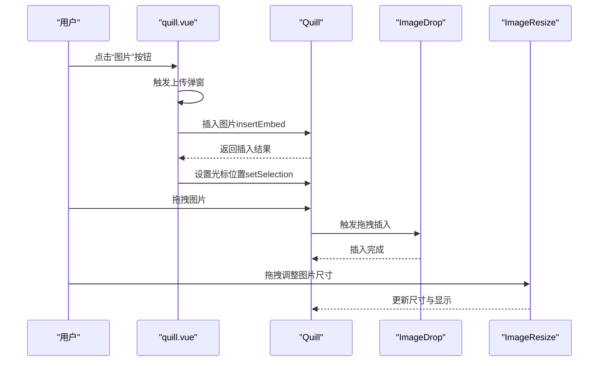
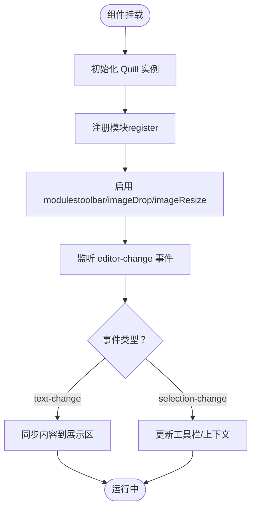
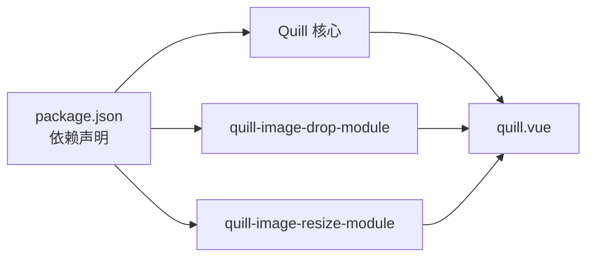

# Quill模块与插件

<cite>
**本文引用的文件**
- [quill.vue](file://src/views/rich-editor/quill.vue)
- [package.json](file://package.json)
- [vue.config.js](file://vue.config.js)
- [plugins.js](file://src/views/rich-editor/tinymce-components/plugins.js)
- [dynamicLoadScript.js](file://src/views/rich-editor/tinymce-components/dynamicLoadScript.js)
</cite>

## 目录
1. [引言](#引言)
2. [项目结构](#项目结构)
3. [核心组件](#核心组件)
4. [架构总览](#架构总览)
5. [详细组件分析](#详细组件分析)
6. [依赖关系分析](#依赖关系分析)
7. [性能考量](#性能考量)
8. [故障排查指南](#故障排查指南)
9. [结论](#结论)
10. [附录](#附录)

## 引言
本文件面向使用 Vue 的前端团队，系统化梳理项目中基于 Quill 的富文本编辑器模块与插件体系，重点覆盖以下主题：
- Quill 模块系统架构与内置模块
- 第三方插件（ImageResize、ImageDrop）的功能与配置
- Quill 插件注册机制、生命周期与事件处理
- 自定义 Quill 模块与插件的开发指南与最佳实践
- 模块间依赖关系与冲突处理策略
- 性能优化与兼容性建议

## 项目结构
本项目在富文本编辑器方面采用 Vue 单文件组件封装 Quill，并通过 npm 安装 Quill 及其图像相关插件。关键文件如下：
- 富文本编辑器页面组件：src/views/rich-editor/quill.vue
- 依赖声明与版本：package.json
- Webpack 构建配置（与 Quill 相关的加载策略）：vue.config.js
- 其他富文本方案参考（Tinymce）：src/views/rich-editor/tinymce-components/plugins.js、dynamicLoadScript.js

**图表来源**
- [quill.vue](file://src/views/rich-editor/quill.vue)
- [package.json](file://package.json)
- [vue.config.js](file://vue.config.js)
- [plugins.js](file://src/views/rich-editor/tinymce-components/plugins.js)
- [dynamicLoadScript.js](file://src/views/rich-editor/tinymce-components/dynamicLoadScript.js)

**章节来源**
- [quill.vue](file://src/views/rich-editor/quill.vue)
- [package.json](file://package.json)
- [vue.config.js](file://vue.config.js)

## 核心组件
本节聚焦于 Quill 在本项目中的实际使用方式与关键配置点。

- Quill 实例初始化与主题
  - 使用 snow 主题，设置占位符与调试级别
  - 通过模块化配置启用工具栏、图像拖拽与图像尺寸调整
- 工具栏自定义
  - 定义字体大小、标题层级、加粗斜体下划线删除线、缩进、颜色与对齐、清除格式、图片与自定义按钮等
  - 自定义图片按钮绑定上传逻辑，支持点击触发上传并插入图片
- 图像处理插件
  - 注册并启用 imageDrop 与 imageResize 模块
  - imageResize 支持 Resize、DisplaySize、Toolbar 三个子模块，可自定义样式
- 事件与数据流
  - 监听 editor-change 事件，区分 text-change 与 selection-change
  - 基于 DOM 获取编辑器 HTML 内容进行展示
  - 监控内容长度并进行视觉提示

**章节来源**
- [quill.vue](file://src/views/rich-editor/quill.vue)

## 架构总览
下图展示了 Quill 在本项目中的运行时架构与交互关系：

**图表来源**
- [quill.vue](file://src/views/rich-editor/quill.vue)

## 详细组件分析

### Quill 模块系统与内置模块
- 模块化配置入口
  - 通过 modules 配置启用 toolbar、imageDrop、imageResize 等模块
  - toolbar.container 指定工具栏按钮集合，handlers 绑定自定义按钮行为
- 内置模块职责
  - toolbar：提供格式化与交互按钮集合
  - imageDrop：允许通过拖拽方式插入图片
  - imageResize：提供图片尺寸调整能力与显示样式

**图表来源**
- [quill.vue](file://src/views/rich-editor/quill.vue)

**章节来源**
- [quill.vue](file://src/views/rich-editor/quill.vue)

### ImageResize 与 ImageDrop 模块详解
- ImageDrop
  - 启用方式：modules.imageDrop: true
  - 功能：允许直接将图片拖拽至编辑器中插入
- ImageResize
  - 启用方式：modules.imageResize: { modules, styles ... }
  - 子模块：
    - Resize：提供拖拽调整尺寸的能力
    - DisplaySize：显示当前图片尺寸
    - Toolbar：提供操作工具条
  - 样式定制：handleStyles、displayStyles、toolbarStyles、toolbarButtonStyles、toolbarButtonSvgStyles
- 上传流程
  - 自定义图片按钮触发上传
  - 上传成功回调中获取光标位置并插入图片
  - 更新光标位置以提升用户体验

**图表来源**
- [quill.vue](file://src/views/rich-editor/quill.vue)

**章节来源**
- [quill.vue](file://src/views/rich-editor/quill.vue)

### Quill 插件注册机制、生命周期与事件处理
- 注册机制
  - 通过 Quill.register('modules/模块名', 模块类或对象) 进行全局注册
  - 在初始化时通过 modules 配置启用对应模块
- 生命周期
  - mounted 阶段初始化 Quill 实例
  - beforeDestroy 阶段清理实例，避免内存泄漏
- 事件处理
  - editor-change：统一监听文本与选择变化
  - text-change：用于同步内容到展示区域
  - selection-change：可用于更新工具栏状态或上下文菜单

**图表来源**
- [quill.vue](file://src/views/rich-editor/quill.vue)

**章节来源**
- [quill.vue](file://src/views/rich-editor/quill.vue)

### 自定义 Quill 模块与插件开发指南
- 开发步骤
  - 定义模块类或函数，遵循 Quill 模块规范
  - 在全局通过 Quill.register 注册模块
  - 在 modules 中启用该模块
  - 如需与 UI 交互，可在组件内绑定事件与状态
- 最佳实践
  - 明确模块职责边界，避免功能耦合
  - 提供可配置项（如样式、行为开关），便于复用
  - 注意性能：避免在事件回调中执行重型计算
  - 保持向后兼容：升级 Quill 版本时验证模块行为

**章节来源**
- [quill.vue](file://src/views/rich-editor/quill.vue)

### 模块间依赖关系与冲突处理
- 依赖关系
  - quill.vue 依赖 Quill 核心与第三方模块（ImageDrop、ImageResize）
  - 上传组件与 Quill 通过 insertEmbed 与 setSelection 协作
- 冲突处理
  - 当多个模块同时影响同一区域（如图片）时，应明确优先级与互斥逻辑
  - 在事件处理中区分不同模块触发的变更，避免重复处理
  - 样式冲突可通过模块独立的样式配置进行隔离

**章节来源**
- [quill.vue](file://src/views/rich-editor/quill.vue)

## 依赖关系分析
- 依赖来源
  - Quill 核心与主题样式：通过 npm 安装并在组件中按需引入
  - 图像处理插件：quill-image-drop-module、quill-image-resize-module
- 构建与加载
  - 通过 vue.config.js 控制资源加载策略（如预取/预加载策略）
  - 上传组件与 Quill 解耦，通过事件与回调协作

**图表来源**
- [package.json](file://package.json)
- [quill.vue](file://src/views/rich-editor/quill.vue)

**章节来源**
- [package.json](file://package.json)
- [vue.config.js](file://vue.config.js)

## 性能考量
- 资源加载
  - 合理配置构建阶段的预取/预加载，减少首屏等待
  - 对于大图片，建议在服务端进行压缩与懒加载
- 事件处理
  - editor-change 回调中避免频繁 DOM 查询与重排
  - 对长文本输入场景，可考虑节流/防抖策略
- 模块选择
  - 按需启用模块，避免不必要的功能增加体积与开销
  - ImageResize 的样式与交互可根据业务需求裁剪

## 故障排查指南
- 常见问题
  - 图片无法插入：检查上传回调是否正确获取图片链接并调用 insertEmbed
  - 工具栏按钮无效：确认自定义 handlers 是否正确绑定到对应按钮键名
  - 样式异常：核对 imageResize 的样式配置是否与主题一致
- 调试建议
  - 启用 Quill 的 debug 模式定位错误
  - 在 editor-change 中打印事件参数，区分 text-change 与 selection-change
  - 在 beforeDestroy 中清理事件监听与定时器，防止内存泄漏

**章节来源**
- [quill.vue](file://src/views/rich-editor/quill.vue)

## 结论
本项目以 Vue 组件形式封装了 Quill 富文本编辑器，结合 ImageDrop 与 ImageResize 插件实现了便捷的图片拖拽与尺寸调整能力。通过模块化配置与事件驱动的方式，既保证了功能的可扩展性，又兼顾了开发体验与运行效率。建议在后续迭代中持续关注 Quill 版本升级、插件生态演进与性能优化策略，确保系统稳定与可维护性。

## 附录
- 参考实现
  - Tinymce 插件清单与动态加载脚本可作为其他富文本方案的参考
- 扩展方向
  - 可继续探索更多 Quill 插件（如公式、代码高亮、附件等）
  - 结合服务端接口完善上传与回显逻辑，增强安全性与一致性

**章节来源**
- [plugins.js](file://src/views/rich-editor/tinymce-components/plugins.js)
- [dynamicLoadScript.js](file://src/views/rich-editor/tinymce-components/dynamicLoadScript.js)